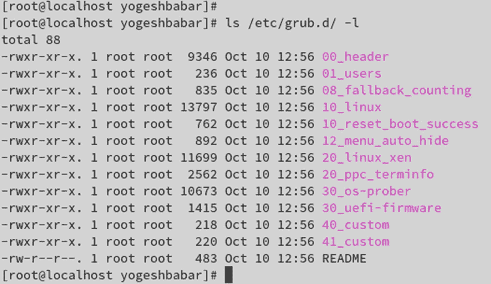
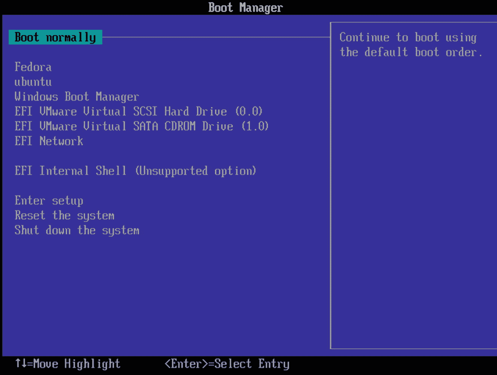
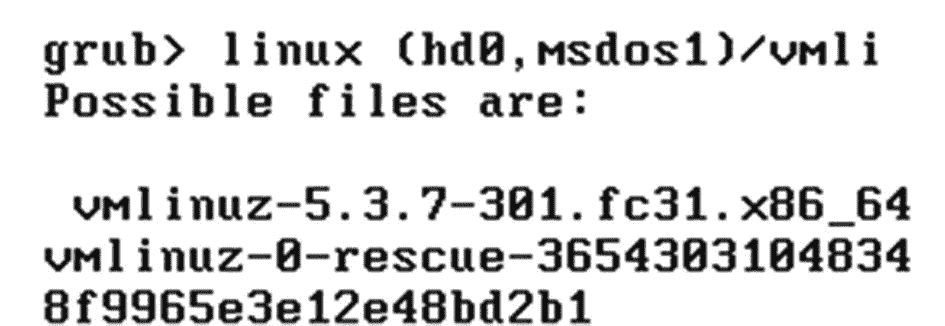
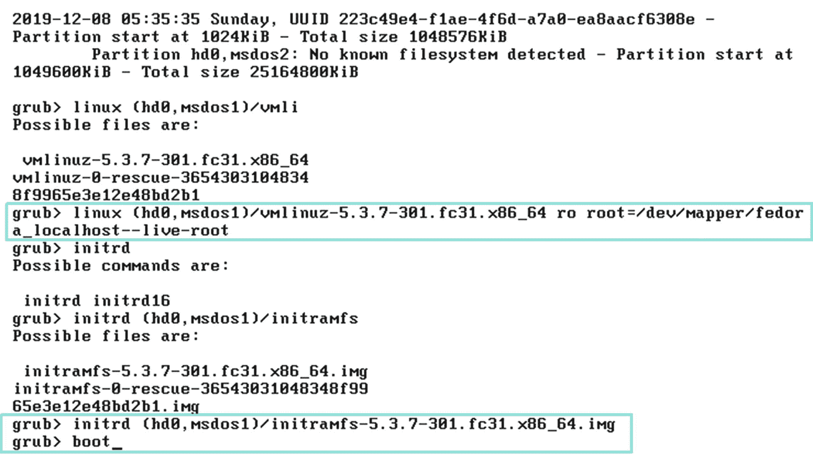
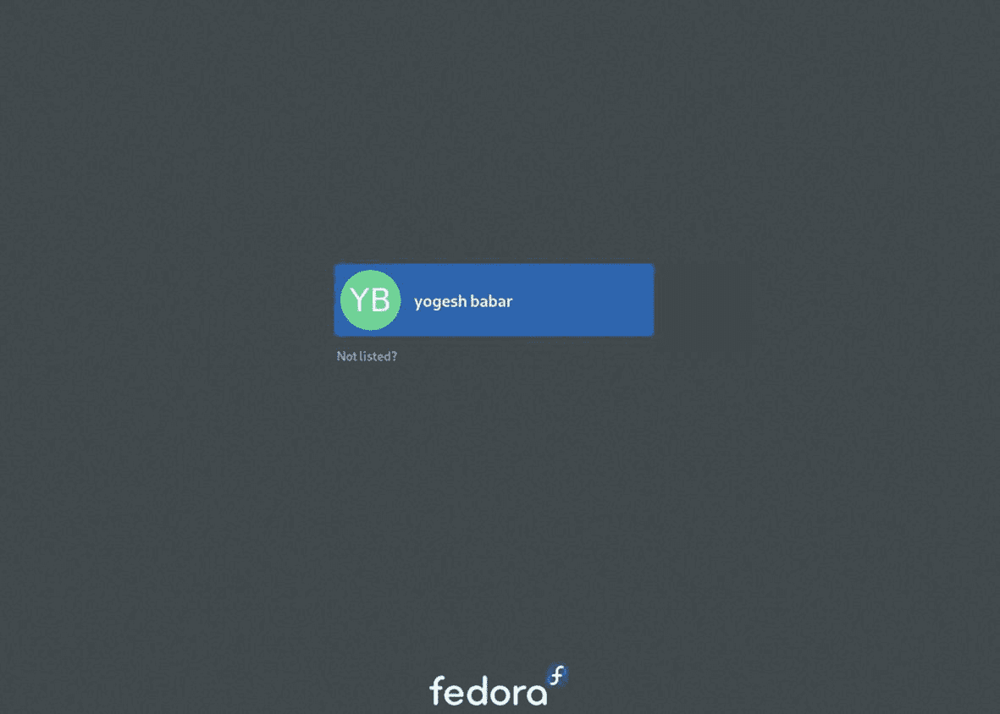
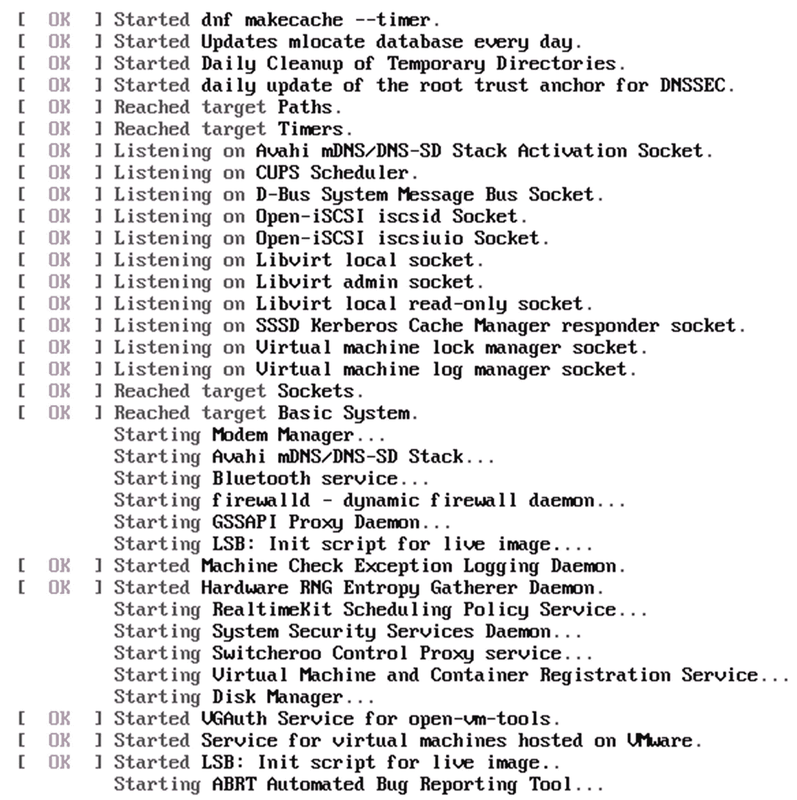
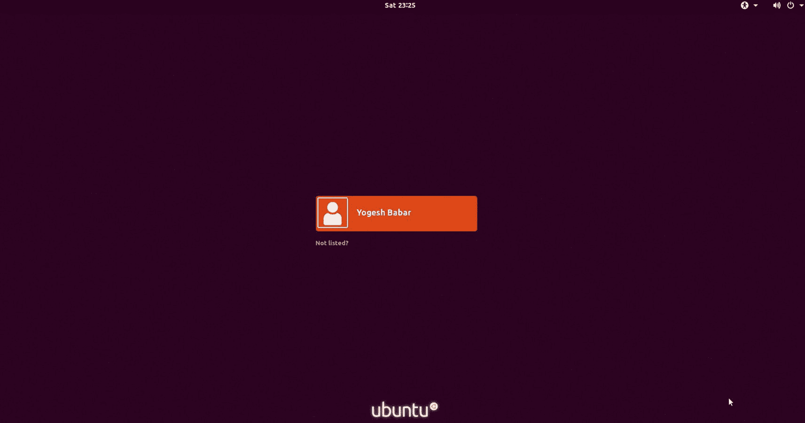
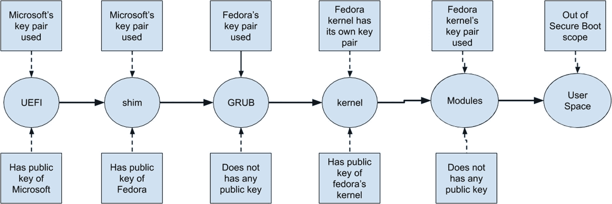
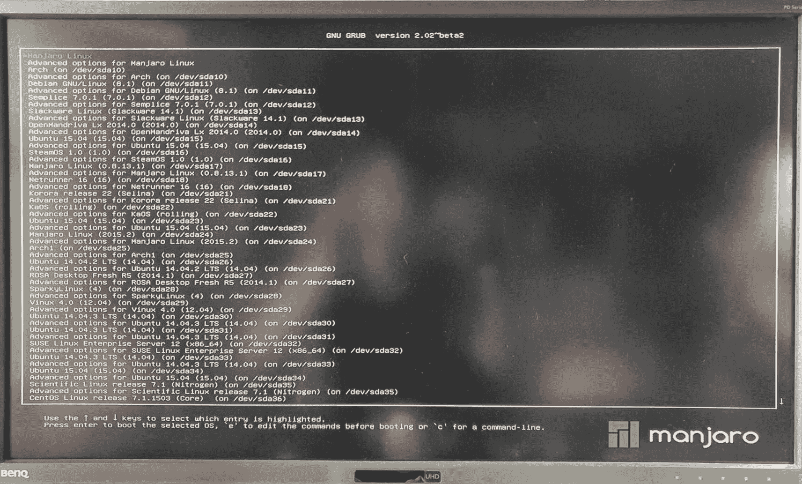

# 三、GRUB 开机管理程序

Linux 系统现在使用的引导装载程序是 GRUB 版本 2。GRUB 2 的第一个稳定版本是在 2012 年，但它是在 2014 年随着 Centos 7 和 RHEL 7 开始出现在企业级 Linux 中的。2015 年后，它在几乎所有流行的 Linux 发行版中都被广泛采用。通常当用户提出错误或要求新功能时，开发人员会听取反馈，区分工作的优先级，并最终推出新版本的代码。然而，在 GRUB 的情况下，它以另一种方式工作。当用户对 GRUB Legacy(版本 1)感到满意时，开发人员决定改变 GRUB 2 的整个结构。

*   “由于混乱的代码和设计失败，GRUB Legacy 已经变得不可维护。我们收到了许多功能请求，并且在没有重新设计框架的情况下，将 GRUB 扩展到了原来的范围之外。这导致了一种状态，即如果不从根本上重新思考一切，就不可能进一步扩展 GRUB。”

*   —gnu grub 常见问题解答( [`https://www.gnu.org/software/grub/grub-faq.html`](https://www.gnu.org/software/grub/grub-faq.html)

以下是 GRUB 2 提供或正在开发的一些特性:

*   完全支持 USB。

*   Linux 统一设置密钥(LUKS)支持。LUKS 是 Linux 硬盘加密的标准。

*   一个别致的菜单实现，将有动画，彩色效果，样式表等。

*   一个“分开的”工具将被添加到引导装载程序中。添加后，用户将能够在引导时编辑磁盘配置。

本章将涵盖以下内容:

*   如何为 BIOS 和 UEFI 固件实现 GRUB 2

*   GRUB 2 中固件特定的结构变化

*   GRUB 2 的引导程序规范特性

*   UEFI 的安全引导特性及其在 GRUB 2 中的实现

*   几个与引导程序相关的问题以及我们如何修复它们

## GRUB 2 实现

正如我们到目前为止所看到的，GRUB 控制了固件。这意味着它必须处理 UEFI 以及 BIOS。我们先来看看 GRUB 2 是如何在基于 BIOS 的系统上实现的。

### 基于 BIOS 的系统上的 GRUB 2

基于 BIOS 的系统上的 GRUB 2 将其所有文件保存在三个不同的位置。

*   `/boot/grub2/`

*   `/etc/default/grub`

*   `/etc/grub.d/`

以 Ubuntu 为例，GRUB 的名字中没有使用版本 2，所以会用`/boot/grub/`代替`/boot/grub2/`，用`grub-install`代替`grub2-install`，或者用`grub-mkconfig`代替`grub2-mkconfig`。

让我们讨论一下位置和它们的内容。

#### /boot/grub2

这是 GRUB 2 的安装位置。正如你在图 [3-1](#Fig1) 中看到的，这个目录保存了引导装载程序的核心文件。


图 3-1

/boot/grub2 中的文件

##### 设备.地图

GRUB 不理解 sda 或 vda 等磁盘名称，因为这些磁盘命名约定是由操作系统的 SCSI 驱动程序创建的。很明显，GRUB 在操作系统不存在时运行，因此它有自己的磁盘命名约定。以下是 GRUB 的磁盘命名约定:

<colgroup><col class="tcol1 align-left"> <col class="tcol2 align-left"> <col class="tcol3 align-left"></colgroup> 
| 

GRUB 版本

 | 

磁盘命名约定

 | 

意义

 |
| --- | --- | --- |
| Two | `hd0`，`msdos1` | 硬盘号 0 和分区号 1，其中有一个 MS-DOS 分区表 |
| Two | `hd1`，`msdos3` | 2 号硬盘和 3 号分区，其中有一个 MS-DOS 分区表 |
| Two | `hd2`，`gpt1` | 3 号硬盘和 1 号分区，后者有一个 GPT 分区表 |
| one | `hd0`，`0` | 硬盘号 0 和分区号 1 |

在 GRUB 中，硬盘从 0 开始，分区号从 1 开始，而磁盘和分区的操作系统命名约定从 1 开始。由于 OS 和 GRUB 磁盘命名约定不同，所以必须有一个用户映射，这就是为什么创建了`device.map`文件。

```sh
# cat /boot/grub2/device.map
      # this device map was generated by anaconda
      (hd0)      /dev/sda

```

`grub2-install` like 命令将使用`device.map`文件来了解 GRUB 的核心文件安装在哪个磁盘上。以下是该文件的一个示例:

```sh
# strace -o delete_it.txt  grub2-install  /dev/sda
      Installing for i386-pc platform.
      Installation finished. No error reported.

# cat delete_it.txt | grep -i 'device.map'
      openat(AT_FDCWD, "/boot/grub2/device.map", O_RDONLY) = 3
      read(3, "# this device map was generated "..., 4096) = 64
      openat(AT_FDCWD, "/boot/grub2/device.map", O_RDONLY) = 3
      read(3, "# this device map was generated "..., 4096) = 64

```

因为用户不知道 GRUB 磁盘命名约定，所以`grub2-install`命令将以 OS 磁盘命名约定的形式接受输入。在执行过程中，`grub2-install`会通过读取`device.map`文件将 SCSI 磁盘命名约定转换为 GRUB 磁盘命名约定。

##### grub.cfg

这是 GRUB 的主要配置文件。正如你在图 [3-2](#Fig2) 中看到的，这是一个巨大的脚本文件，它是通过引用其他一些脚本文件生成的，我们将很快讨论这些文件。强烈建议不要更改`grub.cfg`的内容，因为这样做可能会使您的 Linux 版本无法启动。GRUB part-3 从这个文件中获取如下指令:


图 3-2

grub.cfg 文件

*   内核和 initramfs 的位置
    *   `/boot/vmlinuz-<version>`

    *   `/boot/initramfs-<version>`

*   内核命令行参数
    *   根文件系统名称及其位置等。

GRUB 有自己的命令集，正如您在这里看到的:

<colgroup><col class="tcol1 align-left"> <col class="tcol2 align-left"></colgroup> 
| 

GRUB 命令

 | 

目的

 |
| --- | --- |
| `menuentry` | 这将在屏幕上打印标题。 |
| `set root` | 这将提供存储内核和 initramfs 的磁盘和分区名称。 |
| `linux` | Linux 内核文件的绝对路径 |
| `initrd` | Linux 的 initramfs 文件的绝对路径 |

因此，GRUB 2 在基于 BIOS 的 Fedora 系统上的引导顺序如下:

1.  开机:首先是 BIOS，然后是 POST，然后是 BIOS，最后是第一个扇区。

2.  首先是引导程序(GRUB 的第 1 部分)，然后是 GRUB 的第 2 部分，最后是 GRUB 的第 3 部分。

3.  Part-3 of GRUB will read the previously shown `grub.cfg` from `/boot/grub2/` (in the case of Ubuntu, it will be `/boot/grub/`) and will print the welcome screen, as shown in Figure [3-3](#Fig3).

    

    图 3-3

    欢迎屏幕

4.  当用户选择 Ubuntu `menuentry`时，它将运行`set root`、`linux`和`initrd`命令，并开始在内存中加载内核和 initramfs。

5.  在类似 Fedora 的 Linux 发行版中，您会发现一种不同的方法。会有一个`grub.cfg`文件，但是`menuentry`、`set root`、`linux`和`initrd`命令在`grub.cfg`中不可用。一个叫做 BLS 的 GRUB 上游项目有了新的进展。我们将在本章的后面讨论这个问题。

##### i386 电脑

该目录包含所有 GRUB 支持的文件系统模块(驱动程序)(请参见图 [3-4](#Fig4) )。所有的`*.mod`文件都是模块。通过使用这些模块，GRUB 可以在内存中加载内核和 initramfs 文件。例如，这个系统的`/boot`有一个 ext4 文件系统，所以显然当从`/boot`中探索和加载`vmlinuz`和 initramfs 文件时，GRUB 需要 ext4 模块，它从`ext4.mod`文件中获得这个模块。这类似于 XFS 或 UFS 文件系统上的`/boot`;因此，`xfs.mod`和`ufs.mod`文件存在于`/boot/grub2/i386-pc`中。同时你会发现像`http.mod`和`pxe.mod`这样的模块。这意味着 GRUB 2 的 part-3 可以从`http`和`pxe`设备加载内核和 initramfs 文件。一般来说，`*.mod`文件增加了功能，而不仅仅是设备。这些功能可能包括设备支持、文件系统支持或协议支持。

早先，`/boot`在 LVM 治下是不可能的，原因很简单。GRUB 必须了解 LVM 的设备。为了理解和组装 LVM 设备，GRUB 需要 LVM 模块和 LVM 二进制文件，如`vgscan, vgchange, pvs, lvscan,`等。它会增加 GRUB 作为一个包的大小；因此，企业 Linux 系统厂商一直避免在 LVM 设备下使用`/boot`。但是自从 UEFI 引入以来，GRUB 已经开始在 LVM 设备上支持`/boot`。

T2】

图 3-4

那个。/boot/grub2/i386-pc 中的 mod*文件

如图 [3-5](#Fig5) 所示，除了这些`*.mod`文件，你还会在`/boot/grub2/i386-pc/`位置找到几个其他文件。


图 3-5

这些文件除了*。现代的

`core.img`文件是 GRUB 2 的第 3 部分。因此，Linux 引导顺序如下:

```sh
-> Power on -> BIOS -> POST -> BIOS ->
-> part-1 of GRUB2 -> Part-2 of GRUB2 -> core3.img -> grub.cfg ->
-> if /boot is on an xfs filesystem -> /boot/grub2/i386-pc/xfs.mod ->
-> load vmlinuz & initramfs in main memory.

```

一旦内核在内存中，GRUB 2 的工作就完成了。引导序列的其余部分将由内核执行，我们将在第 [4](04.html) 章中讨论。

#### /etc/默认值/grub

另一个重要的文件当然是`/etc/default/grub`。请参见图 [3-6](#Fig6) 。


图 3-6

/etc/default 目录的内容

GRUB 使用该文件接受用户对外观和内核命令行的更改。

```sh
$ cat /etc/default/grub
GRUB_TIMEOUT=10
GRUB_DISTRIBUTOR="$(sed 's, release .*$,,g' /etc/system-release)"
GRUB_DEFAULT=saved
GRUB_DISABLE_SUBMENU=true
GRUB_TERMINAL_OUTPUT="console"
GRUB_CMDLINE_LINUX="resume=/dev/mapper/root_vg-swap rd.lvm.lv=root_vg/root rd.lvm.lv=root_vg/swap console=ttyS0,115200 console=tty0"
GRUB_DISABLE_RECOVERY="true"
GRUB_ENABLE_BLSCFG=true

```

如您所见，在这个文件中，我们可以更改 GRUB 欢迎屏幕的默认超时、字体、子菜单和默认内核命令行参数，如根设备名、交换设备名等。

#### /etc/grub.d/

这就是 GRUB 2 真正有趣的地方。

GRUB 2 有一个名为`grub2-mkconfig` `.`的命令，该命令的名字表明它将创建 GRUB 配置文件`grub.cfg,`，GRUB 的第 3 部分将引用该文件来显示欢迎屏幕。`grub2-mkconfig`文件将首先从`/etc/default/grub`获取外观和内核命令行参数输入，并从`/etc/grub.d/`目录运行图 [3-7](#Fig7) 中列出的脚本文件。



图 3-7

/etc/grub.d/目录的内容

如您所见，这些文件都有编号。这意味着它们将按顺序运行。

`00_header`、`01_users`、`08_fallback_counting`、`10_reset_boot_success`和`12_menu_auto_hide`脚本文件做内务工作。例如，`00_header`脚本文件负责向`grub.cfg`文件添加一个头。例如，在 Fedora Linux 上，运行`grub2-mkconfig`文件后，会在`grub.cfg`中添加以下头:

```sh
### BEGIN /etc/grub.d/00_header ###
set pager=1

if [ -f ${config_directory}/grubenv ]; then
  load_env -f ${config_directory}/grubenv
elif [ -s $prefix/grubenv ]; then
  load_env
fi
if [ "${next_entry}" ] ; then
   set default="${next_entry}"
   set next_entry=
   save_env next_entry
   set boot_once=true
else
   set default="${saved_entry}"
fi

if [ x"${feature_menuentry_id}" = xy ]; then
  menuentry_id_option="--id"
else
  menuentry_id_option=""
fi

export menuentry_id_option

if [ "${prev_saved_entry}" ]; then
  set saved_entry="${prev_saved_entry}"
  save_env saved_entry
  set prev_saved_entry=
  save_env prev_saved_entry
  set boot_once=true
fi
function savedefault {
  if [ -z "${boot_once}" ]; then
    saved_entry="${chosen}"
    save_env saved_entry
  fi
}

function load_video {
  if [ x$feature_all_video_module = xy ]; then

    insmod all_video
  else
    insmod efi_gop
    insmod efi_uga
    insmod ieee1275_fb
    insmod vbe
    insmod vga
    insmod video_bochs
    insmod video_cirrus
  fi
}

terminal_output console
if [ x$feature_timeout_style = xy ] ; then
  set timeout_style=menu
  set timeout=5
# Fallback normal timeout code in case the timeout_style feature is
# unavailable.
else
  set timeout=5
fi
### END /etc/grub.d/00_header ###

```

`08_fallback_counting`脚本文件将在`grub.cfg`中添加以下内容:

```sh
### BEGIN /etc/grub.d/08_fallback_counting ###
insmod increment
# Check if boot_counter exists and boot_success=0 to activate this behaviour.
if [ -n "${boot_counter}" -a "${boot_success}" = "0" ]; then
  # if countdown has ended, choose to boot rollback deployment,
  # i.e. default=1 on OSTree-based systems.
  if  [ "${boot_counter}" = "0" -o "${boot_counter}" = "-1" ]; then
    set default=1
    set boot_counter=-1
  # otherwise decrement boot_counter
  else
    decrement boot_counter
  fi
  save_env boot_counter
fi
### END /etc/grub.d/08_fallback_counting ###

```

如您所见，该文件添加了监控 GRUB 欢迎屏幕的默认超时值的代码，与其余文件(`10_reset_boot_success`和`menu_auto_hide`)为 GRUB 做家务的方式相同。让我们看看让 GRUB 2 成为多引导最佳引导加载程序之一的脚本文件。

##### 10_linux

这个文件包含将近 500 行 bash 脚本文件。每当用户执行`grub2-mkconfig`命令时，它就会运行这个脚本。`10_linux`文件将找出您的系统上还安装了哪些其他的 Linux 发行版。它会一个分区一个分区地查找已经安装在您系统上的所有其他 Linux 版本。如果还有其他的，那么它会在`grub.cfg`里做一个`menuentry`。与`menuentry`一起，它将添加各自的内核和 initramfs 条目。是不是很神奇？

考虑你先装了 Ubuntu 再装了 Fedora 现在你不用手动把 Ubuntu 的条目加入 Fedora 的`grub.cfg`。你只要跑`grub2-mkconfig`就行了。该命令将为我们运行`10_linux`，它最终会发现 Ubuntu 已经安装，并将为它添加适当的条目。

##### S7-1200 可编程控制器

在`grub2-mkconfig`之后，这个脚本文件会发现你的系统是否安装了 XEN 内核。如果是，那么它将在`grub.cfg`中为其添加适当的条目。大多数 Linux 发行商将 XEN 作为一个独立的内核包发布。XEN 主要由管理程序使用。

##### 20_ppc_terminfo

如果您的系统有 IBM 的 PPC 或 PowerPC 架构，那么这个脚本文件将为它找到相应的内核，并将适当的条目添加到`grub.cfg`中。

##### 30 秒后醒来

如果您的硬盘上安装了任何非基于 Linux 的操作系统，那么这个脚本文件将找到该操作系统，并为其创建适当的条目。换句话说，如果您的系统上安装了 Windows，它会自动找出并在`grub.cfg`中为其创建一个适当的条目。这就是为什么在 UEFI 系统上安装了我们的第三个操作系统(Fedora 31)后，我们什么也没做就获得了操作系统列表。在图 [3-8](#Fig8) 中可以看到 Fedora 31 呈现的欢迎画面。


图 3-8

欢迎屏幕

Fedora 安装完成后，Anaconda 在后台运行`grub2-mkconfig`，最终运行`30_os_prober`，它找到 Windows 安装并在`grub.cfg`中为其创建适当的条目。

##### 30_uefi 韧体

只有当您拥有 UEFI 系统时，此脚本才能成功运行。该脚本文件的任务是在`grub.cfg`中添加 UEFI 固件的适当条目。如图 [3-8](#Fig8) 所示，`System setup`条目已经被`30_uefi-firmware`脚本文件添加。

```sh
### BEGIN /etc/grub.d/30_uefi-firmware ###
menuentry 'System setup' $menuentry_id_option 'uefi-firmware' {
        fwsetup
}
### END /etc/grub.d/30_uefi-firmware ###

```

如果用户选择“系统设置”选项，那么它将引导回 UEFI 固件。在图 [3-9](#Fig9) 中可以看到 UEFI 固件界面。



图 3-9

UEFI 固件

##### 40 _ 自定义和 41 _ 自定义

这些是给用户的，以防用户想要添加一些自定义条目到`grub.cfg`。例如，如果`grub2-mkconfig`未能添加任何已安装的 OS 作为条目，那么用户可以向这两个自定义文件添加一个自定义条目。您可以创建自己的自定义文件，但需要确保每个文件都有一个编号，并且有可执行的权限。

### 基于 UEFI 的系统上的 GRUB 2

同样，GRUB 2 有三个存储文件的位置。图 [3-10](#Fig10) 显示了目录及其文件。


图 3-10

基于 UEFI 的系统上的 GRUB 2 位置

先前在`/boot/grub2/`中显示的`grub.cfg`文件已经被转移到 ESP ( `/boot/efi/EFI/fedora/`)中。另外，正如您所见，没有`i386-pc`目录。这是因为 EFI 提供了丰富的设备和文件系统支持。在 ESP 中，你会发现几个`*.efi`文件，包括我们的`shim.efi`和`grubx64.efi`二进制文件。负责 GRUB 外观变化和内核命令行参数的`etc/default/grub`文件仍然在同一个位置。由于`grub2-install`命令在 UEFI 系统上没有意义，因此`device.map`文件不可用。我们将在本章的后面讨论这个命令。

## 引导加载程序规范(BLS)

BLS 是 GRUB 上游项目的新发展，还没有被许多主流发行版采用。具体来说，这种方案已经被 RHEL、Fedora、Centos、Oracle Linux 等基于 Fedora 的操作系统所采用。，但不是基于 Debian 的发行版，如 Ubuntu、Mint 等。

在基于 BIOS 的系统上，无论哪个操作系统控制了前 512 个字节，它就控制了所有操作系统的引导序列，这就是为什么每个操作系统都试图获得前 512 个字节。出现这种情况是因为 BIOS 总是进入硬盘的前 512 个字节，并调用引导程序的第一部分(引导程序)。part-1 到 part-2 和 part-2 到 part-3 的转换稍后发生，然后在最后，part-3 读取特定于引导加载程序的配置文件(对于 Windows，`bcdedit`对于 Linux，`grub.cfg`)。如果该配置文件包含其他已安装操作系统的条目，那么它们将有机会启动。所以，长话短说:谁控制了前 512 个字节，谁就控制了整个引导序列。但是有了 ESP，每个操作系统都有平等的启动机会，因为 UEFI 会检查 ESP 目录并列出所有可用的操作系统条目。开发人员开始考虑是否能在基于 BIOS 的系统中得到这样的东西，于是他们想到了 BLS。

在 BLS，引入了一个新的位置(第五个)来存储与引导程序相关的文件，那就是`/boot/loader/.`所以，我们现在有了五个 GRUB 存储文件的位置。

*   `/boot/grub2/`

*   `/etc/default/grub`

*   `/etc/grub.d`

*   `/boot/efi/EFI/<OS_vendor>/`(仅适用于 UEFI)

*   `/boot/loader/` (BLS 的文件将存储在这里)

其思想是，在新内核安装之后，内核本身及其后脚本(类似于 Fedora 中的`kernel-core`包)将在`/boot/loader/`目录中为新内核创建一个条目。例如，我们安装了这个内核包:

```sh
# rpm -q kernel
Kernel-5.3.7-301.fc31.x86_64

```

这是将提供`/boot/vmlinuz`和`/boot/initramfs`文件的同一个包。一旦安装了这个内核，它将准备以下文件:

```sh
# cat /boot/loader/entries/36543031048348f9965e3e12e48bd2b1-5.3.7-301.fc31.x86_64.conf

title Fedora (5.3.7-301.fc31.x86_64) 31 (Thirty One)
version 5.3.7-301.fc31.x86_64
linux /vmlinuz-5.3.7-301.fc31.x86_64
initrd /initramfs-5.3.7-301.fc31.x86_64.img
options $kernelopts
grub_users $grub_users
grub_arg --unrestricted
grub_class kernel

```

如您所见，该文件有四个条目。

*   GRUB 的第 3 部分将打印的标题

*   内核文件的位置和名称

*   initramfs 文件的位置和名称

*   已经在`/boot/grub2/grubenv`文件中声明的`$kernelopts`变量

```sh
# cat /boot/grub2/grubenv

# GRUB Environment Block
saved_entry=2058a9f13f9e489dba29c477a8ae2493-5.3.7-301.fc31.x86_64
menu_auto_hide=1
boot_success=0
kernelopts=root=/dev/mapper/fedora_localhost--live-root ro resume=/dev/mapper/fedora_localhost--live-swap rd.lvm.lv=fedora_localhost-live/root rd.lvm.lv=fedora_localhost-live/swap rhgb quiet
boot_indeterminate=0

```

基本上，`kernelopts`提供了内核命令行参数，比如根文件系统的名称(`/dev/mapper/fedora_localhost--live-root`)以及它必须以何种模式挂载(`ro - read only`)。

因此，引导顺序变成这样:

1.  BIOS > post > BIOS

2.  GRUB 的第一部分->第二部分->第三部分

3.  GRUB 的第三部分->阅读`grub.cfg`

4.  GRUB -> reads 的第 3 部分`/boot/loader/entries/*`

5.  打印出现在`/boot/loader/entries`中的所有文件标题

例如，假设安装了新的操作系统或新的内核。它必须生成自己的条目文件，并将其放在第一个主分区的`/boot/loader/entries/`目录中。这样，每次第一个主操作系统的 GRUB part-3 读取条目时，其他操作系统都有机会引导。可以使用 Fedora 的`kernel-install`命令创建条目文件。

```sh
#kernel-install add 5.3.7-301.fc31.x86_64 /lib/modules/5.3.7-301.fc31.x86_64/vmlinuz

```

该命令将在`/boot/loader/entries/`中为`kernel-5.3.7-301.fc31.x86_64`创建适当的条目，如下所示:

```sh
# ls /boot/loader/entries/ -l
total 8
-rw-r--r--. 1 root root 329 Dec  9 10:18 2058a9f13f9e489dba29c477a8ae2493-0-rescue.conf
-rw-r--r--. 1 root root 249 Oct 22 01:04 2058a9f13f9e489dba29c477a8ae2493-5.3.7-301.fc31.x86_64.conf

```

与`*.conf`文件相关的编号是唯一的。BLS 有自己的优势和劣势。

以下是优点:

*   每个操作系统都有平等的启动机会。

*   它的工作与 BIOS 和 UEFI 固件无关。

*   在 BIOS 的情况下，最新的 Linux 安装删除了早期安装的操作系统的第 1 部分和第 2 部分，这已经变得过时，因为最新的 Linux 安装将通过早期操作系统上的`kernel-install`命令创建自己的条目。

以下是缺点:

*   BLS 尚未完全实现。如果第二个操作系统想要在第一个操作系统中创建它的条目，那么第一个操作系统的`/boot`必须被共享。目前情况并非如此。所以，我认为这是一个半实现。

*   BLS 不必要地使引导序列变得复杂，因为我们有两个配置文件需要参考:来自`/boot/loader/entries/`的`grub.conf`和`<uniq_no><kernel_version>.conf`。在解决“无法启动”问题的情况下，BLS 尤其让生活变得困难。

*   除了基于 Fedora 的发行版，还没有人采用 BLS，这似乎是一个明智的决定。看起来 Fedora 是最致力于上游项目的；因此，BLS 已经在 Fedora 中实现。

## 常见的引导程序问题

基于这些知识，让我们尝试解决一些最常见的与引导程序相关的“无法引导”问题。

### “无法引导”问题 1(引导加载程序)

**问题:**系统加电后，在 GRUB 提示符下退出，如图 [3-11](#Fig11) 所示。


图 3-11

GRUB 2 提示符

这是你在屏幕上看到的。你一生中肯定至少遇到过一次这种错误。让我们试着解决它。

1.  只有当你知道问题是什么的时候，你才能解决问题。但是现在，我们不知道问题出在哪里，因为我们刚刚启动这个系统，这就是我们得到的结果。

2.  该屏幕称为 GRUB 提示符。当这被称为提示符时，意味着您可以在它上面执行命令。请记住，这是一个 GRUB 命令提示符，这意味着它只能接受 GRUB 命令。

3.  通过查看图 [3-11](#Fig11) ，在 GRUB 的三个部分中，GRUB 的哪个部分为我们提供了 GRUB 提示符？

4.  当然，它必须是 part-3，因为 part-1 和 part-2 的空间很小，所以它们无法容纳这样的功能。所以，我们已经成功地完成了 GRUB 的第 3 部分，最重要的是，这个系统是有 UEFI 还是 BIOS 并不重要。既然我们已经到了第 3 部分，这意味着我们已经离开了固件环境。这是至关重要的输入。现在我们不能只关注第三部分。

5.  GRUB 第 3 部分的目的是什么？很简单。它读取`grub.cfg`，并从那里获得内核和 initramfs 的位置。如果它是一个支持 BLS 的系统，那么它从`/boot/loader/entries/`目录中获取内核和 initramfs 名称。对于这个例子，我们将假设这个系统不知道 BLS。然后，第 3 部分在内存中加载`vmlinuz`和 initramfs。

6.  由于第 3 部分已经向我们提供了 GRUB 提示符，但未能加载 OS，这意味着要么内核和 initramfs 文件不存在，要么`grub.cfg`文件没有指出这些文件的正确位置。

7.  因此，在这种情况下，我们可以尝试手动引导 Fedora。手动意味着我们将使用 GRUB 提示符为内核和 initramfs 文件提供绝对路径。这是可以做到的。

8.  `linux` is a GRUB command through which we need to give the absolute path of the kernel (`vmlinuz`) file. As we know, the `vmlinuz` file is at `/boot`, and GRUB follows its own disk naming convention. So, the path of `/boot` will be hard disk number 0 and partition number 1\. Of course, you might not be aware on which HDD or partition `/boot` has been stored. In that case, you can get the help of the autocomplete feature of GRUB. You can press Tab twice, and GRUB will prompt you for the available options. Let’s find out the HDD and partition number of `/boot`. Please refer to Figure [3-12](#Fig12).

    

    图 3-12

    0 号硬盘上的可用分区

    The first tab after `hd0` showed us that there are two partitions available under the hard disk number 0\. The second partition is not readable to GRUB, so of course the second partition cannot be `/boot`. Hence, we will choose the `msdos1` partition. Then, as shown in Figure [3-13](#Fig13), we will start looking for the `vmlinuz` file in it with the help of autocomplete.

    

    图 3-13

    vmlinuz 文件

    As you can see inside HDD number 0 and partition number 1, we found two `vmlinuz` files; one is of a rescue kernel, and another one is the normal kernel file of Fedora 31\. As shown in Figure [3-14](#Fig14), we will choose the normal kernel and will provide the root filesystem name to it. If you are unaware of the root filesystem name of your system, then you can boot the system with the rescue or live image and check the `/etc/fstab` entries. We will talk about the rescue mode in Chapter [10](10.html).

    

    图 3-14

    根文件系统名称和 ro 标志

    The absolute path of the `vmlinuz` file is `(hd0,msdos1)/vmlinuz-5.3.7-301.fc31.x86_64`. Next to it is the `ro` kernel command-line parameter, which stands for “read-only.” After `ro`, we have a `root` kernel command-line parameter to which we have passed our system’s root filesystem name, which is - `/dev/mapper/fedora_localhost--live-root.` It’s an `lvm` device.

    ```sh
    grub> linux (hd0,msdos1)/vmlinuz-5.3.7-301.fc31.x86_64 ro
         root=/dev/mapper/fedora_localhost--live-root

    ```

    After successfully executing the `linux` command, we need to pass on the initramfs name. We have two commands available that we can use: `initrd` and `initrd16`. Please refer to Figure [3-15](#Fig15).

    ```sh
    grub> initrd (hd0,msdos1)/initramfs-5.3.7-301.fc31.x86_64.img

    ```

    

    图 3-15

    运行中的 linux、initrd 和 boot 命令

9.  The moment you execute the `boot` command, as shown in Figure [3-16](#Fig16) and in Figure [3-17](#Fig17), GRUB’s part-3 will take these inputs and load `/boot/vmlinuz-5.3.7-301.fc31.x86_64` from `sda1 (hd0,msdos1)`. Then it will load `/boot/initramfs-5.3.7-301.fc31.x86_64.img` and give control to the kernel. The kernel will eventually mount the root (`/`) filesystem from `/dev/mapper/fedora_locahost--live-root` on the `/` directory and will show the login screen.

    

    图 3-17

    登录屏幕

    

    图 3-16

    引导时的控制台消息

10.  在 Ubuntu 18 的情况下，命令略有不同。在 Fedora 31 上，我们将`/boot`分区的地址直接给了`linux`命令，而在 Ubuntu 中，我们有一个单独的 GRUB 命令，名为`set root`。

如图 [3-18](#Fig18) 所示，Ubuntu 18 系统的根文件系统名称是`/dev/sda1`。这是一个标准分区，不像 Fedora 31 的`lvm`设备。


图 3-18

Ubuntu 有一个稍微不同的方法

一旦我们向 GRUB 2 提供了正确的输入，它就会把我们带到登录屏幕。图 [3-19](#Fig19) 可以看到 Ubuntu 的登录界面。



图 3-19

Ubuntu 显示的登录屏幕


图 3-20

grub2-mkconfig 命令

1.  回到我们的 Fedora 系统，由于现在已经启动，我们可以使用`grub2-mkconfig`命令重新生成`grub.cfg`文件，如图 [3-20](#Fig20) 所示。

我们可以在 Ubuntu 的情况下执行`grub-mkconfig`。请参见图 [3-21](#Fig21) 。


图 3-21

Ubuntu 的 grub-mkconfig 命令

但是如果是 UEFI 系统，你想再生`grub.cfg`，那么如图 [3-22](#Fig22) 所示，`grub.cfg`的位置就是 ESP。


图 3-22

基于 UEFI 的系统上的 grub2-mkconfig

1.  一旦生成了`grub.cfg`，我们需要为 Fedora 重新生成 BLS 条目。

```sh
#kernel-install add 5.3.7-301.fc31.x86_64 /lib/modules/5.3.7-301.fc31.x86_64/vmlinuz

```

该命令将在`/boot/loader/entries/`中为`kernel-5.3.7-301.fc31.x86_64`创建适当的条目。

1.  如果 Fedora 在 UEFI 系统上，那么 BLS 步骤保持不变。

2.  重启后，Fedora 能够顺利启动，“无法启动”的问题已经修复。

```sh
# ls /boot/loader/entries/ -l
total 8
-rw-r--r--. 1 root root 329 Dec  9 10:18 2058a9f13f9e489dba29c477a8ae2493-0-rescue.conf
-rw-r--r--. 1 root root 249 Oct 22 01:04 2058a9f13f9e489dba29c477a8ae2493-5.3.7-301.fc31.x86_64.conf

```

### “无法引导”问题 2(引导加载程序)

**问题:**系统上电后，通过固件阶段，但之后如图 [3-23](#Fig23) 所示，屏幕上什么都没有。


图 3-23

空白屏幕

#### 基于 BIOS 的系统的分辨率

以下是解决这个问题的步骤:

1.  由于 BIOS 固件阶段已经过去，这意味着在引导装载程序级别有问题。

2.  因为我们在屏幕上看不到任何东西，这意味着 GRUB 的第 1 部分或第 2 部分丢失了，或者至少它们被破坏了(512 字节+ 31 KB)。如果它到达了第 3 部分，那么我们至少会得到 GRUB 提示符。因此，这个问题已经被隔离，行动计划是替换 GRUB 的第 1 部分和第 2 部分。

3.  这可以通过`grub2-install`命令来完成。首先用相同 Linux 发行版的 live 介质引导，或者，如果可以的话，用救援模式引导。现场图像和救援模式将在第 [10 章](10.html)中解释。

如图 [3-24](#Fig24) 所示，`grub2-install`将设备名称作为输入。请注意，设备名称不应是分区号；相反，它应该是一个磁盘名称。这是因为 GRUB 的第 1 部分和第 2 部分必须安装在磁盘的前 512 字节+ 31 KB 上，而不是安装在分区内。您需要用您的磁盘名称替换 sda。


图 3-24

grub2-install 命令

随着引导程序文件的第 1 部分和第 2 部分，`grub2-install`修复或重新安装`i386-pc`目录，其中包含 GRUB 2 引导程序的所有模块。我们可以通过在自定义目录中安装模块来交叉验证这一点。请参见图 [3-25](#Fig25) 。


图 3-25

在临时目录中安装 grub2

您可以看到所有的 GRUB 2 文件和 GRUB 的模块文件都已经恢复。

```sh
# ls temp/grub2/
      fonts  grubenv  i386-pc
# ls -l temp/grub2/i386-pc/ | wc -l
      279

```

重启后，Fedora 应该可以正常启动，“无法启动”的问题应该已经修复。如果 GRUB 让您进入命令提示符，那么您需要遵循问题 1 中提到的步骤，因为`grub2-install`会修复二进制文件，但它不会重新生成`grub.cfg`文件。

但是，如果您在基于 UEFI 的系统上面临类似的问题，该怎么办呢？

#### 基于 UEFI 的系统的解决方案

以下是步骤:


图 3-26

基于 UEFI 的系统上的 grub-install 命令

1.  正如你可能已经猜到的，我们只需改变`grub2-install`命令传递的设备名称，如图 [3-26](#Fig26) 所示。设备名称应该是 ESP。

### “无法引导”问题 3(引导程序+内核)

**问题:**完整的`/boot`不见了。

#### 基于 BIOS 的系统的分辨率

以下是步骤:

1.  找回丢失的`/boot`是不可能的(或者至少超出了本书的范围)。

2.  在救援模式下启动，或者用一个动态镜像启动，并挂载我们“不能启动”的系统的根文件系统。救援模式及其工作原理将在第 [10](10.html) 章中讨论。

3.  首先创建一个新的`/boot`目录，并在其上设置适当的权限。
    *   `#mkdir /boot`

    *   `#chmod 555 /boot`

    *   `#chown root:root /boot`

    *   如果`/boot`应该是一个单独的分区，那么用正确的分区挂载它。

4.  正如我们所知，`/boot`是我们存储引导程序、内核和 initramfs 文件的地方。因为`/boot`丢失了，我们需要为它创建每个文件。
    *   `#dnf reinstall kernel`
        *   这是一个基于 Fedora 的系统。如果是基于 Debian 的系统，那么可以使用`apt-get`命令，并且可以重装内核。

        *   这将安装`vmlinuz`文件并为其重新生成 initramfs 文件。

5.  现在我们需要安装 GRUB。
    *   **# grub 2-安装/开发/ <磁盘名称>**
        *   在我们的例子中，命令是`#grub2-install /dev/sda.`

    *   这将从`/boot/grub2`修复 GRUB 的 part-1、part-2 和`i386-pc`目录。

    *   为了修复 GRUB 的第 3 部分并使用 GRUB 提供的工具，我们需要在基于 Fedora 的系统上安装两个包。
        *   `#dnf reinstall grub2 grub2-tools`

        *   顾名思义，`grub2`包将提供 GRUB 的第 3 部分，`grub2-tools`将提供一些类似`grub2-install`的工具。

    *   现在是重新生成 GRUB 配置文件的时候了。
        *   `#grub2-mkconfig -o /boot/grub2/grub.cfg`

    *   最后，修复 BLS。
        *   `#kernel-install add 5.3.7-301.fc31.x86_64 /lib/modules/5.3.7-301.fc31.x86_64/vmlinuz`

#### 基于 UEFI 的系统的解决方案

以下是步骤:

*   `/boot and /boot/efi/`是单独的挂载点。
    *   `# mkdir /boot`

    *   `# chmod 555 /boot`

    *   `# chown root:root /boot`

    *   `# yum reinstall kernel`

*   现在我们需要创建一个 ESP 分区，正如我们所知，它必须是一个 VFAT 分区。然后给它分配一个 ESP 分区类型。
    *   `#mkdir /boot/efi`

    *   `#mount /dev/sda2 /boot/efi`
        *   在我们的例子中，我为 ESP 创建的分区是 sda2。

    *   `#grub2-install --efi-directory=/boot/efi`
        *   这将在 ESP 中安装`grubx64.efi`文件。

    *   其余的必需文件由`grub2-efi`、`shim`和`grub2-tools`包提供。
        *   `#yum reinstall grub2-efi shim grub2-tools`

    *   重新生成配置文件。
        *   `#grub2-mkconfig -o /boot/efi/EFI/redhat/grub.cfg`

        *   `#kernel-install add 5.3.7-301.fc31.x86_64 /lib/modules/5.3.7-301.fc31.x86_64/vmlinuz`

重新启动系统后，它能够顺利启动。

现在是时候对 UEFI 的安全引导环境进行更多的阐述了。

## UEFI 的安全引导功能

安全引导是 UEFI 的一个令人惊叹的功能。它确保启动时不会运行不可信的二进制文件。到目前为止，我们已经看到了以下内容:

*   数字签名是唯一的字符串。
    *   任何文件的数字签名都将由私钥生成。

    *   可以从公钥中重新生成相同的数字签名。

    *   如果文件没有被修改，那么数字签名应该匹配。

*   微软制作了它的密钥对(公钥和私钥)。

*   Microsoft 用其私钥对其引导加载程序相关文件(BCD)进行了数字签名。

*   微软的公钥存在于 UEFI 内部。

*   引导时，UEFI 将使用可用的公钥重新生成引导程序的数字签名。如果数字签名不匹配，那么 UEFI 将放弃执行`.efi`文件。

*   为了在 Linux 环境中使用这个特性，已经创建了一个名为`shim`的新引导加载程序，它已经用微软的私钥进行了签名，因此 UEFI 将允许执行`shim.efi`。

*   `Shim.efi`的工作是调用实际的 GRUB 文件，也就是`grubx64.efi`。

但是安全引导并没有就此停止。因为有可能`grubx64.efi`本身已经被破坏，或者事实上在引导装载程序之后运行的任何代码都可能已经被破坏，所以仅仅保证引导环境达到引导装载程序级别是不够的；因此，现在安全引导特性保护了 Linux 的整个引导过程。它是这样工作的:

1.  Fedora 将准备自己的密钥对，并用 Fedora 的私钥签署 GRUB 文件。

2.  Fedora 的公钥将保存在`shim.efi`文件中。

3.  随着引导序列的继续，GRUB 的数字签名将通过使用`shim.efi`中的公钥重新生成。

4.  如果签名匹配，那么`grubx64.efi`和其他引导程序文件将被 UEFI 允许运行。

5.  GRUB 的最终工作是加载内核(`/boot/vmlinuz`)。

6.  这个`vmlinuz`文件也可能被破坏，因此为了避免这种情况，内核将由用于签名 GRUB 的同一个私钥进行签名。

7.  将使用`shim.efi`中的公钥重新生成`Vmlinuz'`的数字签名。

8.  一旦数字签名匹配，内核就会控制引导序列。

9.  但是内核使用了大量的模块/驱动程序，这些模块/驱动程序最终被插入内核内部。所以，这些二进制的模块可能会受到损害，而且由于它们将成为 kernel/ `vmlinuz`的一部分，最终内核本身也会受到损害。

10.  因此，内核作为一个包将准备自己的密钥对。所有模块都将由这个内核的私钥签名，公钥将随内核包一起提供。内核包的私有密钥将在以后被销毁。

11.  在引导时，在内核中插入模块时，模块的数字签名将通过使用内核中的公钥重新生成。

12.  按照上面提到的步骤，安全引导特性确保只执行来自可信方的二进制文件。

图 [3-27](#Fig27) 所示的框图将进一步简化启动程序。



图 3-27

安全引导过程

## 100 操作系统多重引导项目

我的一个学生问了我一个问题:我们可以在一个系统上安装多少个操作系统，并用一个引导程序多重引导它们？我不知道答案，但我决定试着找出答案。我决定使用 GRUB 2 引导程序来引导我安装的每个操作系统。我已经安装和引导操作系统将近两年了。到目前为止，我已经安装了 106 个操作系统。这是我们的第三个系统，我命名为贾维斯。以下是 Jarvis 的硬件和软件细节:

*   UEFI 韧体。

*   连接了两个磁盘(sda 和 sdb)。

*   引导方法是 UEFI。

*   sda 是用 MS-DOS 分区表格式化的。

*   sdb 用 GPT 分区表格式化。

*   所有的操作系统都由 GRUB 2 引导程序识别和引导。

sda 磁盘上安装的操作系统是通过将引导方法设置为 UEFI 来安装的，它拥有所有新的操作系统。sdb 上的操作系统是通过将固件的引导方法设置为 legacy 来安装的。sdb 托管大多数老一代操作系统，或者至少是那些不支持 UEFI 的操作系统。以下是详细情况:

<colgroup><col class="tcol1 align-left"> <col class="tcol2 align-left"> <col class="tcol3 align-left"> <col class="tcol4 align-left"></colgroup> 
| 

划分

 | 

操作系统

 | 

文件系统

 | 

大小

 |
| --- | --- | --- | --- |
| sda-1 | 电子燃油喷射系统分区 | FAT32 | 20 GB |
| sda-2 | MSR(微软恢复) | 发动机阻力矩控制系统 | 16 兆字节 |
| sda-3 | Windows 10 | Windows NT 文件系统(NT File System) | 9.7 GB |
| sda-4 | 交换 | 交换 | 2.01 GB |
| sda-5 | openSUSE Linux 13.2 | EXT4 | 10 GB |
| sda-6 | 就像 Linux 17.2 | EXT4 | 10 GB |
| sda-7 | Oracle OpenSolaris 11.2 | ZFS | 10 GB |
| sda-8 | Sabayon Linux 15.06 版 | EXT4 | 10 GB |
| sda-9 | 一些随机的自由空间 | 不适用的 | 8.4 兆字节 |
| sda-10 | Kali Linux 2.0 版 | EXT4 | 10 GB |
| sda-11 | Arch Linux 2015-8.1 | EXT4 | 10 GB |
| sda-12 | Debian Linux 8.1 | EXT4 | 10 GB |
| sda-13 | 简单 Linux 7.0.1 | EXT4 | 10 GB |
| sda-14 | Slackware 14.1 Linux | EXT4 | 10 GB |
| sda-15 | Openmandriva 2014.2 | EXT4 | 10 GB |
| sda-16 | 杀死 Ubuntu Linux15.04 | EXT4 | 10 GB |
| sda-17 | 蒸汽 OS beta 版 | EXT4 | 10 GB |
| sda-18 | Manjaro Linux 0.8.13.1 版 | EXT4 | 10 GB |
| sda-19 | Netrunner Linux 16 | EXT4 | 10 GB |
| sda-20 | Windows 8 | Windows NT 文件系统(NT File System) | 10 GB |
| sda-21 | Korora Linux 22 | EXT4 | 10 GB |
| sda-22 | 卡奥斯 Linux 2015.08 | EXT4 | 10 GB |
| sda-23 | ubuntu linux 15.04 | EXT4 | 10 GB |
| sda-24 | 声纳 Linux 2015.2 | EXT4 | 10 GB |
| sda-25 | Linux 2015 年 8 月 18 日 | EXT4 | 10 GB |
| sda-26 | linux 月 14 日 | EXT4 | 10 GB |
| sda-27 | 罗莎 Linux 新鲜版 R5 | EXT4 | 10 GB |
| sda-28 | SparkyLinux 4.0 | EXT4 | 10 GB |
| sda-29 | Linux 4.0 葡萄酒 | EXT4 | 10 GB |
| sda-30 | xubuntu linux 14 . 04 . 3 版 | EXT4 | 10 GB |
| sda-31 | Ubuntu Studio 14.04.3 版 | EXT4 | 10 GB |
| sda-32 | Suse 企业 12 | EXT4 | 10 GB |
| sda-33 | Ubuntu Linux 14.04 | EXT4 | 10 GB |
| sda-34 | Ubuntu Linux 15.04 | EXT4 | 10 GB |
| sda-35 | 科学 Linux 7 | EXT4 | 10 GB |
| sda-36 | 数百个 Linux 7 | EXT4 | 10 GB |
| sda-37 | Solus Linux 日报 | EXT4 | 10 GB |
| sda-38 | Ubuntu Server 14 Linux | EXT4 | 10 GB |
| sda-39 | Fedora 21 Linux | EXT4 | 10 GB |
| sda-40 | Fedora 22 Linux | EXT4 | 10 GB |
| sda-41 | 黑拱门 | EXT4 | 10 GB |
| sda-42 | gentoo linux multilib 20140826 | EXT4 | 10 GB |
| sda-43 | 计算 Linux 14.16.2 | EXT4 | 10 GB |
| sda-44 | Fedora 20 Linux | EXT4 | 10 GB |
| sda-45 | Fedora 23 Linux | EXT4 | 10 GB |
| sda-46 | Manjaro Linux 15-0.9 版 | EXT4 | 10 GB |
| sda-47 | Ubuntu Linux 16.04 | EXT4 | 10 GB |
| sda-48 | Linux 23 帽子 | EXT4 | 10 GB |
| sda-49 | Linux 22 归档类型 | EXT4 | 10 GB |
| sda-50 | Fx64 Linux 22 | EXT4 | 10 GB |
| sda-51 | 毒蛇 Linux 7 | EXT4 | 10 GB |
| sda-52 | Hanthana Linux 21 | EXT4 | 10 GB |
| sda-53 | Qubes R3.1 Linux | EXT4 | 10 GB |
| sda-54 | Fedora 24 | EXT4 | 10 GB |
| sda-55 | 科罗拉-23 | EXT4 | 10 GB |
| sda-56 | 萨巴永-16 | EXT4 | 10 GB |
| sda-57 | 科罗拉-24 | EXT4 | 10 GB |
| sda-58 | 声纳 16 Linux | EXT4 | 10 GB |
| sda-59 | 蝰蛇 9 Linux | EXT4 | 10 GB |
| sda-60 | Linux 23 归档类型 | EXT4 | 10 GB |
| sda-61 | Manjaro Linux 16 | EXT4 | 10 GB |
| sda-62 | Manjaro Linux 游戏 16 | EXT4 | 10 GB |
| sda-63 | 计算 Linux 15 | EXT4 | 10 GB |

因此，sda 磁盘上 UEFI OS 安装的总数是 59，因为 4 个分区是为类似 ESP 和 MSR 的东西保留的。以下是 sdb 磁盘安装的详细信息:

<colgroup><col class="tcol1 align-left"> <col class="tcol2 align-left"> <col class="tcol3 align-left"> <col class="tcol4 align-left"></colgroup> 
| 

划分

 | 

操作系统

 | 

文件系统

 | 

大小

 |
| --- | --- | --- | --- |
| sdb-1 | PCBSD 10.1.2 | ZFS | 10 GB |
| sdb-2 | Linux 魔法 2 | EXT4 | 10 GB |
| sdb-3 | Linux 魔法 3 | EXt4 | 10 GB |
| sdb-4 | 扩展/二级 | 不适用的 | 大约 970 GB |
| sdb-5 | Q4 Linux 1 . 2 . 8 作业系统 | EXT4 | 10 GB |
| sdb-6 | R2 Linux | EXT4 | 10 GB |
| sdb-7 | Pardus Linux 2013 版 | EXT4 | 10 GB |
| sdb-8 | 奥林帕斯 015 | EXT4 | 10 GB |
| sdb-9 | Crux Linux 3.1 | EXT4 | 10 GB |
| sdb-10 | 点 Linux 3.0 | EXT4 | 10 GB |
| sdb-11 | Extix Linux 15.3 | EXT4 | 10 GB |
| sdb-12 | Bodhi Linux 3.0 版 | EXT4 | 10 GB |
| sdb-13 | Debian Linux 7.0 | EXT4 | 10 GB |
| sdb-14 | Debian Linux 6.0 | EXT4 | 10 GB |
| sdb-15 | BOSS Linux 6.1 | EXT4 | 10 GB |
| sdb-16 | CrunchBang rc1 Linux 游戏 | EXT4 | 10 GB |
| sdb-17 | Linux 2.1 手机 | EXT4 | 10 GB |
| sdb-18 | Linux 2.4 版 | EXT4 | 10 GB |
| sdb-19 | Linux R9 瓦数 | EXT4 | 10 GB |
| sdb-20 | 平谷 14.04.3 Linux | EXT4 | 10 GB |
| sdb-21 | SuperX 3.0 Linux | EXT4 | 10 GB |
| sdb-22 | JuLinux 10X 版本 3.1 Linux | EXT4 | 10 GB |
| sdb-23 | 黑实验室 Linux 2015.7 | EXT4 | 10 GB |
| sdb-24 | Hamara Linux 1.0.3 | EXT4 | 10 GB |
| sdb-25 | 薄荷 LInux 20150518 | EXT4 | 10 GB |
| sdb-26 | Ubuntu 13.10 Linux | EXT4 | 10 GB |
| sdb-27 | linuxmint 13 杀手 | EXT4 | 10 GB |
| sdb-28 | Linux 薄荷 14.1 肉桂 | EXT4 | 10 GB |
| sdb-29 | linuxmint 15 xfce | EXT4 | 10 GB |
| sdb-30 | linuxmint 系统 16 KDE | EXT4 | 10 GB |
| sdb-31 | 薄荷 4 20131113 | EXT4 | 10 GB |
| sdb-32 | 薄荷 5 20140623 | EXT4 | 10 GB |
| sdb-33 | Fedora 12 | EXT4 | 10 GB |
| sdb-34 | 哪 7 个 Linux | EXT4 | 10 GB |
| sdb-35 | Oracle Linux 7.1 | EXT4 | 10 GB |
| sdb-36 | Fedora 14 Linux | EXT4 | 10 GB |
| sdb-37 | Fedora 15 Linux | EXT4 | 10 GB |
| sdb-38 | Fedora 17 Linux | EXT4 | 10 GB |
| sdb-39 | Fedora 19 Linux | EXT4 | 10 GB |
| sdb-40 | RHEL 6.5 Linux | EXT4 | 10 GB |
| sdb-41 | SolydX 201506 | EXT4 | 10 GB |
| sdb-42 | Oracle Linux 6.7 | EXT4 | 10 GB |
| sdb-43 | OpenSuse 11.3 | EXT4 | 10 GB |
| sdb-44 | LMDE (Linux Mint 2 Debian 版) | EXT4 | 10 GB |
| sdb-45 | Linux 12.04 中心 | EXT4 | 10 GB |
| sdb-46 | 基础操作系统 2013 | EXT4 | 10 GB |
| sdb-47 | 基础操作系统 2015 | EXT4 | 10 GB |
| sdb-48 | Sabayon 13.08 Linux | EXT4 | 10 GB |
| sdb-49 | Deepin 2013 Linux | EXT4 | 10 GB |
| sdb-50 | Deepin 15.1 Linux | EXT4 | 10 GB |

在 sdb 磁盘上以 BIOS 方式引导的操作系统总数为 50–2 = 48。

两个分区保留给交换分区和扩展分区。

因此，Jarvis 系统上的安装总数是 106，正如您在图 [3-28](#Fig28) 中看到的，所有这些操作系统都是通过使用 GRUB 2 引导程序进行多重引导的。有了这个项目，我意识到这是没有止境的。GRUB 2 和 UEFI 的组合可以处理 *n* 个操作系统。



图 3-28

GRUB 2 列出的 106 种操作系统

我是如何安装这么多操作系统的？很简单。每次安装新的操作系统后，我都会启动`grub-mkconfig`命令，从所有连接的磁盘中找到所有的操作系统。

```sh
# time grub-mkconfig -o multiboot_grub.cfg

```

前面的命令是在安装了列表中第 106 个操作系统 Ubuntu 18 之后使用的。

如图 [3-29](#Fig29) 所示，当我安装第 106 个操作系统时，`grub-mkconfig`花了将近一个小时才完成，结果 GRUB 配置文件有 5500 行。


图 3-29

grb-mkconfig 命令花费的时间

## 一个虚拟的小型引导程序

我们知道 BIOS 跳转到第一个 512 字节并调用 GRUB 2 引导程序。为了理解 BIOS 是如何调用引导装载程序的，我们将制作自己的引导装载程序。与 GRUB 2 相比，我们的引导程序非常小。我们的引导程序会在屏幕上显示`!`。但是通过这个例子，您将能够理解 BIOS 如何像 GRUB 2 一样跳转到引导加载程序，如下所示:

```sh
#cat boot.nasm
    ;
    ; Note: this example is written in Intel Assembly syntax
    ;
     [BITS 16]
     [ORG 0x7c00]

    boot:
        mov al, '!'       <<-- Character for interrupt
        mov ah, 0x0e      <<-- Display character
        mov bh, 0x00      <<-- Set video mode
        mov bl, 0x07      <<-- Clear/Scroll screen down
        int 0x10          <<--- BIOS interrupt 10 which is taking inputs from al, ah, bh, bl
        jmp $
        times 510-($-$$) db 0      <<--- Out of 512 bytes first 510 bytes are filled  with 0's.
                                   In the real world it will be filled with grub's boot strap.
        db 0x55           <<-- &
        db 0xaa           <<-- | tells BIOS that this is the device which is active/fdisk sign/boot flag.

     #nasm -f bin boot.nasm && qemu-system-x86_64 boot

```

这将从`boot.nasm`文件中创建一个`boot`磁盘(磁盘映像),它将成为`qemu`的输入，后者将执行它。如图 [3-30](#Fig30) 所示，你会看到`!`印在屏幕上。


图 3-30

我们的小型引导程序

基本上，`qemu`机器把`boot`当作一个磁盘，每当`qemu`机器完成它的 BIOS 阶段，BIOS 就在引导磁盘的前 512 个字节处落下。在这里你会发现前 510 个字节被写成 0，最后 2 个字节我们有`!`(引导程序)，它会被打印在我们的屏幕上。

到目前为止，我们已经很好地了解了 GRUB 2；在下一节中，我们将进一步讨论 GRUB 2 内部到底发生了什么。

## 低级别的 GRUB 2

在写这本书的时候，GRUB 最新可用的源代码是 GRUB 2.04，我一直在这里使用。从 512 字节的第一个 440 字节开始的引导二进制文件(如果系统是基于 BIOS 的)被称为`boot.img`，它在`/usr/lib/grub/i386-pc/boot.img`可用。

```sh
# ls -lh /usr/lib/grub/i386-pc/boot.img
-rw-r--r--. 1 root root 512 Mar 28  2019 /usr/lib/grub/i386-pc/boot.img

# file  /usr/lib/grub/i386-pc/boot.img
/usr/lib/grub/i386-pc/boot.img: DOS/MBR boot sector

```

`boot.img`文件是从写在文件`/GRUB 2.04/grub-core/boot/i386/pc/boot.S`中的源代码创建的。

以下是其中的一个片段:

```sh
<snip>
1 /* -*-Asm-*- */
  2 /*
  3  *  GRUB  --  GRand Unified Bootloader
  4  *  Copyright (C) 1999,2000,2001,2002,2005,2006,2007,2008,2009  Free Software Foundation, Inc.
  5  *
  6  *  GRUB is free software: you can redistribute it and/or modify
  7  *  it under the terms of the GNU General Public License as published by
  8  *  the Free Software Foundation, either version 3 of the License, or
  9  *  (at your option) any later version.
 10  *
 11  *  GRUB is distributed in the hope that it will be useful,
 12  *  but WITHOUT ANY WARRANTY; without even the implied warranty of
 13  *  MERCHANTABILITY or FITNESS FOR A PARTICULAR PURPOSE.  See the
 14  *  GNU General Public License for more details.
 15  *
 16  *  You should have received a copy of the GNU General Public License
 17  *  along with GRUB.  If not, see <http://www.gnu.org/licenses/>.
 18  */
 19
 20 #include <grub/symbol.h>
 21 #include <grub/machine/boot.h>
 22
 23 /*
 24  *  defines for the code go here
 25  */
 26
 27         /* Print message string */
 28 #define MSG(x)  movw $x, %si; call LOCAL(message)
 29 #define ERR(x)  movw $x, %si; jmp LOCAL(error_message)
 30
 31         .macro floppy
 32 part_start:
 33
 34 LOCAL(probe_values):
 35         .byte   36, 18, 15, 9, 0
 36
 37 LOCAL(floppy_probe):
 38         pushw   %dx
 39 /*
 40  *  Perform floppy probe.
 41  */
 42 #ifdef __APPLE__
 43         LOCAL(probe_values_minus_one) = LOCAL(probe_values) - 1
 44         movw    MACRO_DOLLAR(LOCAL(probe_values_minus_one)), %si
 45 #else
 46         movw    MACRO_DOLLAR(LOCAL(probe_values)) - 1, %si
 47 #endif
 48
 49 LOCAL(probe_loop):
 50         /* reset floppy controller INT 13h AH=0 */
 51         xorw    %ax, %ax
 52         int     MACRO_DOLLAR(0x13)
 </snip>

```

您可以将`boot.img`视为引导加载程序的第一阶段或 GRUB 的第 1 部分。这个`boot.img`文件将控制权转移给`diskboot.img`，这是 GRUB 的第 2 部分。

```sh
# ls -lh /usr/lib/grub/i386-pc/diskboot.img
-rw-r--r--. 1 root root 512 Mar 28  2019 /usr/lib/grub/i386-pc/diskboot.img

# file /usr/lib/grub/i386-pc/diskboot.img
/usr/lib/grub/i386-pc/diskboot.img: data

```

`diskboot.img`文件由`grub-2.04/grub-core/boot/i386/pc/diskboot.S.`的源代码组成，以下是它的一个片段:

```sh
<snip>
1 /*
  2  *  GRUB  --  GRand Unified Bootloader
  3  * Copyright (C) 1999,2000,2001,2002,2006,2007,2009,2010 Free Software Foundation, Inc.
  4  *
  5  *  GRUB is free software: you can redistribute it and/or modify
  6  *  it under the terms of the GNU General Public License as published by
  7  *  the Free Software Foundation, either version 3 of the License, or
  8  *  (at your option) any later version.
  9  *
 10  *  GRUB is distributed in the hope that it will be useful,
 11  *  but WITHOUT ANY WARRANTY; without even the implied warranty of
 12  *  MERCHANTABILITY or FITNESS FOR A PARTICULAR PURPOSE.  See the
 13  *  GNU General Public License for more details.
 14  *
 15  *  You should have received a copy of the GNU General Public License
 16  *  along with GRUB.  If not, see <http://www.gnu.org/licenses/>.
 17  */
 18
 19 #include <grub/symbol.h>
 20 #include <grub/machine/boot.h>
 21
 22 /*
 23  *  defines for the code go here
 24  */
 25
 26 #define MSG(x)  movw $x, %si; call LOCAL(message)
 27
 28         .file   "diskboot.S"
 29
 30         .text
 31
 32         /* Tell GAS to generate 16-bit instructions so that this code works
 33            in real mode. */
 34         .code16
 35
 36         .globl  start, _start
 37 start:
 38 _start:
 39         /*
 40          * _start is loaded at 0x8000 and is jumped to with
 41          * CS:IP 0:0x8000 in kernel.
 42          */
 </snip>

```

然后,`diskboot.img`文件加载 GRUB 2 的实际核心部分，这是 GRUB 的第 3 部分。你也可以认为 GRUB 的第 3 部分是引导装载程序的一个内核。在这个阶段，GRUB 2 将能够读取文件系统。

```sh
# ls /boot/grub2/i386-pc/core.img -lh
-rw-r--r--. 1 root root 30K Dec  9 10:18 /boot/grub2/i386-pc/core.img

```

从`/GRUB 2.00/grub-core/kern/main.c`开始，GRUB 2 设置根设备名，读取`grub.cfg`，最后显示操作系统列表供选择。

希望你现在明白 GRUB 2 是怎么工作的了。以下是我们到目前为止所讨论内容的简要总结:

1.  引导装载程序是固件之后运行的第一个代码。

2.  bootloader/GRUB 将内核复制到内存中。

3.  引导加载程序将 initramfs 映像加载到内存中，并给内核一个指向它的指针。

4.  引导装载程序将控制权移交给内核。