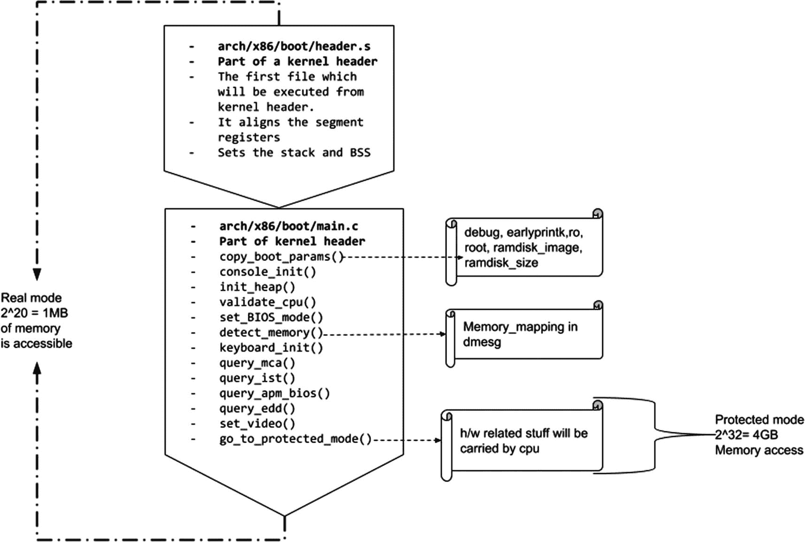
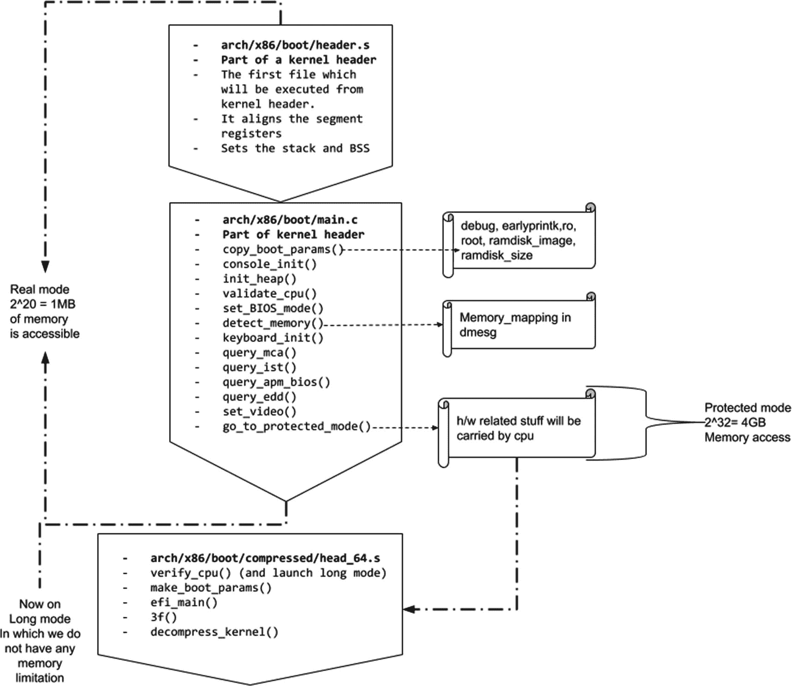
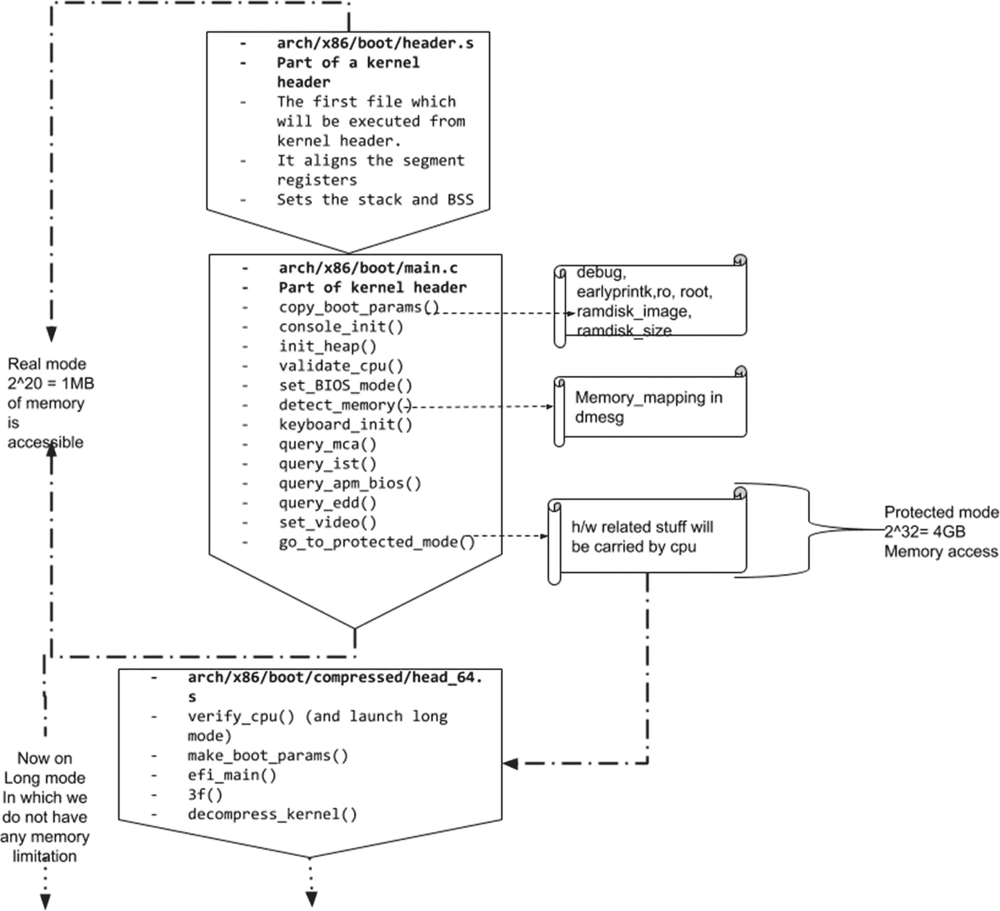
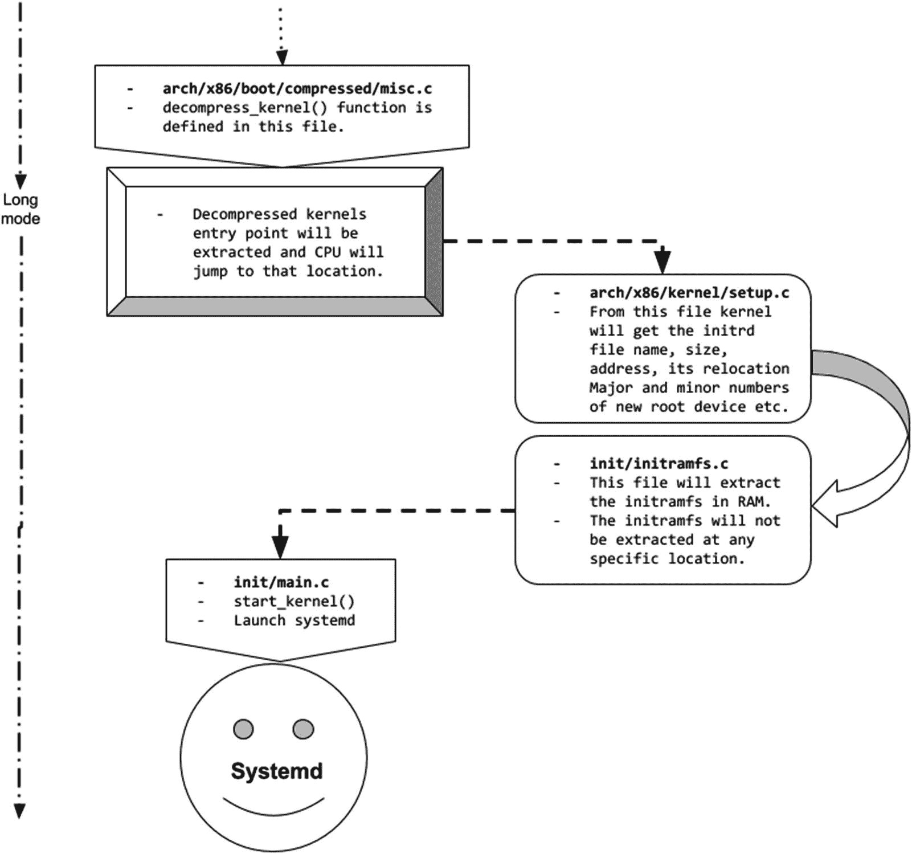
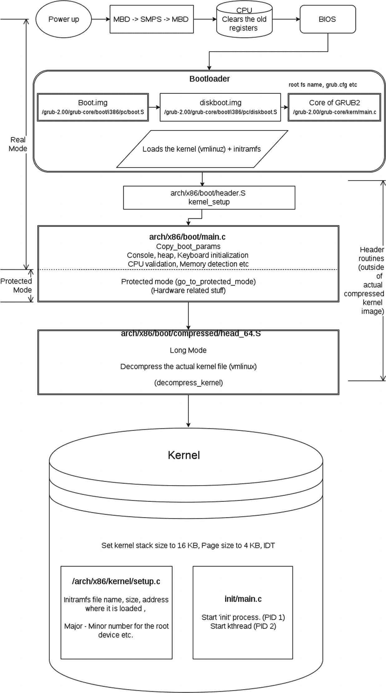

# 四、内核

本章将介绍内核。

## 在内存中加载内核

这是一个有趣的章节。到目前为止，我们已经看到 GRUB 2 已经完全控制了引导过程。现在它必须将控制权交给内核。在这一章中，我们将会看到引导装载程序是如何以及在哪里装载内核的。换句话说，内核是怎么提取的？然后我们将看到 Linux 内核完成的与引导相关的任务，最后我们将看到内核如何启动 systemd。

Note

本章使用的内核源代码是版本`kernel-5.4.4`。当我写这本书的时候，那是最新的稳定代码；参见 [`https://www.kernel.org/`](https://www.kernel.org/) `.`关于这个主题的一个很好的参考资料是由 0xAX 写的《Linux 内部的*】一书。我从中学到了很多，我相信你也会的。你可以在 [`https://0xax.gitbooks.io/linux-insides/`](https://0xax.gitbooks.io/linux-insides/) 找到这本书。*

为了将控制权交给内核，引导装载程序必须完成两件主要的事情。

*   将内核装入内存

*   按照引导协议设置内核的一些字段

完整的启动协议可从 [`https://www.kernel.org/doc/Documentation/x86/boot.txt`](https://www.kernel.org/doc/Documentation/x86/boot.txt) 获得。最初的引导协议是由 Linus Torvalds 定义的。

```sh
         ~                               ~
         |  Protected-mode kernel        |
 100000  +-------------------------------+
         |  I/O memory hole              |
 0A0000  +-------------------------------+
         |  Reserved for BIOS            | Leave as much as possible unused
         ~                               ~
         |  Command line                 | (Can also be below the X+10000 mark)
X+10000  +-------------------------------+
         |  Stack/heap                   | For use by the kernel real-mode code.
X+08000  +-------------------------------+
         |  Kernel setup                 | The kernel real-mode code.
         |  Kernel boot sector           | The kernel legacy boot sector.
      X  +-------------------------------+
         |  Boot loader                  | <- Boot sector entry point 0000:7C00\. You will see the same
         |                               | address location at our boot.asm file which we created above.
  001000 +-------------------------------+
         |  Reserved for MBR/BIOS        |
 000800  +-------------------------------+
         |  Typically used by MBR        |
 000600  +-------------------------------+
         |  BIOS use only                |
 000000  +-------------------------------+

```

按照引导协议，引导装载程序有责任传递或设置内核头的一些字段。这些字段是根设备名称、挂载选项(如`ro`或`rw`)、initramfs 名称、initramfs 大小等。这些相同的字段被称为*内核命令行参数*，我们已经知道内核命令行参数是由 GRUB/boot loader 传递给内核的。

GRUB 不会在任何随机位置加载内核(`/boot/vmlinuz`)；它将总是被装载在一个特殊的位置。这个特殊的位置会根据您使用的 Linux 发行版和版本以及系统的 CPU 架构而有所不同。`vmlinuz`是一个归档文件，归档文件由三部分组成。

```sh
Vmlinuz (bZimage) =  Header   + kernel setup code + vmlinux (actual compressed kernel)
                     (part-1)   (part-2)            (part-3)

```

## 将内核加载到内存中后

这里我们需要想象 GRUB 2 已经在内存中的特殊位置加载了内核。下面是内核归档文件`vmlinuz`加载到内存后执行的初始步骤:

1.  一旦引导加载程序将内核加载到内存中的特定位置，由文件`arch/x86/boot/header.S`生成的二进制文件就会运行。

2.  如果`vmlinuz`是一个归档文件，而引导装载程序还没有提取它，就会出现混乱。引导加载程序刚刚在一个特定的位置加载了内核。那么为什么`vmlinuz`归档文件中的代码能够运行呢？

3.  我们先看简答，长答在“什么提取了 vmlinuz？”本章第节。所以，简单的答案是由`arch/x86/boot/header.S`文件生成的二进制文件不在存档中；相反，它是执行`kernel_setup`任务的报头的一部分。标头在归档文件之外。

    ```sh
    Vmlinuz (bZimage) = Header + kernel setup code + vmlinux (actual compressed kernel)
             --->Outside of archive<--- + -------->Inside archive<------->header.s file is here<---

    ```

4.  现在让我们考虑`vmlinuz`已经被提取，让我们继续我们的引导序列。到目前为止，我们已经看到 GRUB 将内核加载到内存中的一个特殊位置，并运行由`arch/x86/boot/header.S.`生成的二进制文件。该二进制文件负责`Kernel_setup`部分`.`。`kernel_setup`文件执行以下任务:
    1.  对齐段寄存器

    2.  设置堆栈和 BSS

在每一章中，一个流程图会给我们一个清晰的概念，让我们知道我们已经学了什么，以及在引导方面，我们已经达到了什么程度。图 [4-1](#Fig1) 显示了我们将在本章中构建的流程图的开始。显示由`header.s`的`kernel_setup`代码执行的动作。


图 4-1

kernel_setup 采取的步骤

1.  然后在`arch/x86/boot/main.c`跳转到`main()`功能。`main.c`文件也是内核头文件的一部分，这个头文件在实际的归档文件之外。

```sh
Vmlinuz (bZimage) = Header + kernel setup code + vmlinux (actual compressed kernel)
         --->Outside of archive<--- + -------->Inside archive<---------
         --->main.c file is here<---

#vim arch/x86/boot/main.c
<snip>
134 void main(void)
135 {
136         /* First, copy the boot header into the "zeropage" */
137         copy_boot_params();
138
139         /* Initialize the early-boot console */
140         console_init();
141         if (cmdline_find_option_bool("debug"))
142                 puts("early console in setup code\n");
143
144         /* End of heap check */
145         init_heap();
146
147         /* Make sure we have all the proper CPU support */
148         if (validate_cpu()) {
149                 puts("Unable to boot - please use a kernel appropriate "
150                      "for your CPU.\n");
151                 die();
152         }
153
154         /* Tell the BIOS what CPU mode we intend to run in. */
155         set_bios_mode();
156
157         /* Detect memory layout */

158         detect_memory();
159
160         /* Set keyboard repeat rate (why?) and query the lock flags */
161         keyboard_init();
162
163         /* Query Intel SpeedStep (IST) information */
164         query_ist();
165
166         /* Query APM information */
167 #if defined(CONFIG_APM) || defined(CONFIG_APM_MODULE)
168         query_apm_bios();
169 #endif
170
171         /* Query EDD information */
172 #if defined(CONFIG_EDD) || defined(CONFIG_EDD_MODULE)
173         query_edd();
174 #endif
175
176         /* Set the video mode */
177         set_video();
178
179         /* Do the last things and invoke protected mode */
180         go_to_protected_mode();
181 }
</snip>

```

如您所见，`main.c`源代码负责以下内容:

1.  它从引导装载程序复制引导参数(内核命令行参数)。`copy_boot_params`函数将用于复制引导加载程序传递的以下引导参数:

1.  它初始化控制台，并检查用户是否传递了类似于`debug`的内核命令行参数。如果有，内核将在屏幕上显示详细级别的消息。

2.  它初始化堆。

3.  如果 CPU 不能被验证，那么它通过`validate_cpu()`函数抛出一个错误消息。像 Fedora 和 Ubuntu 这样的发行版定制了错误消息，从`'unable to boot - please use the kernel appropriate for your cpu'`到类似`'The CPU is not supported'`的东西。定制还会使内核恐慌，引导将被中止。

4.  然后，它会检测内存布局，并在引导的早期阶段将其打印在屏幕上。使用`'dmesg'`命令可以在引导后看到相同的内存布局消息，如下所示:

```sh
debug, earlyprintk, ro, root, ramdisk_image, ramdisk_size etc.

```



图 4-2

流程图

1.  初始化键盘及其布局。

2.  设置基本视频模式。

3.  通过`go_to_protected_mode()`功能跳转到保护模式。请参考图 [4-2](#Fig2) 以便更好地理解。

```sh
[    0.000000] BIOS-provided physical RAM map:
[    0.000000] BIOS-e820: [mem 0x0000000000000000-0x0000000000057fff] usable
[    0.000000] BIOS-e820: [mem 0x0000000000058000-0x0000000000058fff] reserved
[    0.000000] BIOS-e820: [mem 0x0000000000059000-0x000000000009cfff] usable
[    0.000000] BIOS-e820: [mem 0x000000000009d000-0x00000000000fffff] reserved
[    0.000000] BIOS-e820: [mem 0x0000000000100000-0x000000007e5f7fff] usable
[    0.000000] BIOS-e820: [mem 0x000000007e5f8000-0x000000007e5f8fff] ACPI NVS
[    0.000000] BIOS-e820: [mem 0x000000007e5f9000-0x000000007e5f9fff] reserved
[    0.000000] BIOS-e820: [mem 0x000000007e5fa000-0x0000000087f62fff] usable
[    0.000000] BIOS-e820: [mem 0x0000000087f63000-0x000000008952bfff] reserved
[    0.000000] BIOS-e820: [mem 0x000000008952c000-0x0000000089599fff] ACPI NVS
[    0.000000] BIOS-e820: [mem 0x000000008959a000-0x00000000895fefff] ACPI data
[    0.000000] BIOS-e820: [mem 0x00000000895ff000-0x00000000895fffff] usable
[    0.000000] BIOS-e820: [mem 0x0000000089600000-0x000000008f7fffff] reserved
[    0.000000] BIOS-e820: [mem 0x00000000f0000000-0x00000000f7ffffff] reserved
[    0.000000] BIOS-e820: [mem 0x00000000fe010000-0x00000000fe010fff] reserved
[    0.000000] BIOS-e820: [mem 0x0000000100000000-0x000000086e7fffff] usable

```

### 保护模式

到目前为止，我们一直在实模式下工作，该模式有 20 位地址限制，因为我们可以访问高达 1 MB 的内存。通过`go_to_protected_mode()`函数，内核将 CPU 从实模式切换到保护模式。保护模式有 32 位地址限制，因此 CPU 可以访问高达 4 GB 的内存。简单地说，在实模式下，只有那些具有 16 位指令集的程序才会运行，例如 BIOS。在保护模式下，只有 32 位程序会运行。内核在保护模式下执行一些硬件相关的任务，然后在长模式下启动 CPU。

请注意，本书遵循 Intel 的 X86 架构，实模式、保护模式、长模式的讨论都是基于 Intel 的 64 位架构。

### 长模式

长模式对 CPU 没有任何内存限制。它可以使用所有已安装的内存。将 CPU 置于长模式将通过来自`arch/x86/boot/compressed/head_64.S`的`head_64.S`文件实现。它负责以下工作:

1.  准备长模式意味着它将检查它是否支持长模式。

2.  进入长模式。

3.  解压内核。

以下是从`head_64.S`汇编文件中调用的函数:

<colgroup><col class="tcol1 align-left"> <col class="tcol2 align-left"></colgroup> 
| 

功能

 | 

工作

 |
| --- | --- |
| `verify_cpu` | 这将确保 CPU 具有长模式。 |
| `make_boot_params` | 这将负责引导加载程序传递的引导时参数。 |
| `efi_main` | UEFI 固件相关的东西。 |
| `extract_kernel` | 该功能在`arch/x86/boot/compressed_misc.c`中定义。这是将从`vmlinuz`解压`vmlinux`的函数。 |

```sh
$ cat arch/x86/boot/compressed/head_64.S | grep -i call
    call    1f
    call    verify_cpu
    call    get_sev_encryption_bit
    call    1f
    call    1f
    call    .Ladjust_got
     * this function call.
    call    paging_prepare
     * this function call.
    call    cleanup_trampoline
    call    1f
    call    .Ladjust_got
    call    1f
     * Relocate efi_config->call().
    call    make_boot_params
    call    1f
     * Relocate efi_config->call().
    call    efi_main
    call    extract_kernel    /* returns kernel location in %rax */
    .quad    efi_call

```

为了更好地理解，请参考图 [4-3](#Fig3) 所示的流程图。



图 4-3

更新后的流程图

等一下:如果内核还没有被解压缩，那么我们现在怎么继续呢？下面是长答案。

### 什么提取 vmlinuz？

到目前为止，我们知道是 GRUB 在内存中加载内核，但同时，我们注意到`vmlinuz`映像是一个归档文件。那么，是什么提取了这个图像呢？是幼虫吗？

不，这不是食物。更确切地说，是内核自己提取。对，我说的是提取内核的内核。`vmlinuz`可能是操作系统世界中唯一能自我解压的文件。但是怎么可能提取自己呢？为了理解这一点，让我们先对`vmlinuz`有更多的了解。

`vmlinuz`的“vm”代表“虚拟内存”。在 Linux 开发的早期阶段，虚拟内存的概念还没有发展起来，所以在添加虚拟内存时，会将“vm”字符添加到 Linux 内核的名称中。“z”代表压缩文件。

```sh
$ file vmlinuz-5.0.9-301.fc30.x86_64

vmlinuz-5.0.9-301.fc30.x86_64: Linux kernel x86 boot executable bzImage, version 5.0.9-301.fc30.x86_64 (mockbuild@bkernel04.phx2.fedoraproject.org) #1 SMP Tue Apr 23 23:57:35 U, RO-rootFS, swap_dev 0x8, Normal VGA

```

如你所见，`vmlinuz`就是`bzImage` ( `bzImage`代表“大紫马哥”)。`vmlinuz`是实际内核的二进制文件`vmlinux`的压缩文件。你不能用`gunzip/bunzip`甚至`tar`解压这个文件。提取`vmlinuz`并获得`vmlinux`文件的最简单方法是使用`kernel-devel`包提供的`extract-vmlinux`脚本文件(在 Fedora 的情况下)。文件将出现在`/usr/src/kernels/<kernel_version>/scripts/extract-vmlinux`。

```sh
# ./extract-vmlinux /boot/vmlinuz-5.3.7-301.fc31.x86_64 >> /boot/temp/vmlinux
# file /boot/temp/*
/boot/temp/vmlinux: ELF 64-bit LSB executable, x86-64, version 1 (SYSV),
statically linked, BuildID[sha1]=ec96b29d8e4079950644230c0b7868942bb70366, stripped

```

打开`vmlinux`和`vmlinuz`内核文件有多种方式。

```sh
     $ xxd vmlinux | less
     $ objdump vmlinux | less
     $ objdump vmlinux -D | less
     $ hexdump vmlinux | less
     $ od vmlinux | less

```

我们将使用带有一些开关的`od`命令来打开`vmlinuz`文件。

```sh
     $ od -A d -t x1 vmlinuz-5.0.9-301.fc30.x86_64 | less
<snip>
0000000 4d 5a ea 07 00 c0 07 8c c8 8e d8 8e c0 8e d0 31
0000016 e4 fb fc be 40 00 ac 20 c0 74 09 b4 0e bb 07 00
0000032 cd 10 eb f2 31 c0 cd 16 cd 19 ea f0 ff 00 f0 00
0000048 00 00 00 00 00 00 00 00 00 00 00 00 82 00 00 00
0000064 55 73 65 20 61 20 62 6f 6f 74 20 6c 6f 61 64 65
0000080 72 2e 0d 0a 0a 52 65 6d 6f 76 65 20 64 69 73 6b
0000096 20 61 6e 64 20 70 72 65 73 73 20 61 6e 79 20 6b
0000112 65 79 20 74 6f 20 72 65 62 6f 6f 74 2e 2e 2e 0d
0000128 0a 00 50 45 00 00 64 86 04 00 00 00 00 00 00 00
0000144 00 00 01 00 00 00 a0 00 06 02 0b 02 02 14 80 37
0000160 8e 00 00 00 00 00 80 86 26 02 f0 48 00 00 00 02
0000176 00 00 00 00 00 00 00 00 00 00 20 00 00 00 20 00
0000192 00 00 00 00 00 00 00 00 00 00 00 00 00 00 00 00
0000208 00 00 00 c0 b4 02 00 02 00 00 00 00 00 00 0a 00
0000224 00 00 00 00 00 00 00 00 00 00 00 00 00 00 00 00
*
0000256 00 00 00 00 00 00 06 00 00 00 00 00 00 00 00 00
0000272 00 00 00 00 00 00 00 00 00 00 00 00 00 00 00 00
0000288 00 00 00 00 00 00 00 00 00 00 80 39 8e 00 48 09
0000304 00 00 00 00 00 00 00 00 00 00 2e 73 65 74 75 70
0000320 00 00 e0 43 00 00 00 02 00 00 e0 43 00 00 00 02
0000336 00 00 00 00 00 00 00 00 00 00 00 00 00 00 20 00
0000352 50 60 2e 72 65 6c 6f 63 00 00 20 00 00 00 e0 45
0000368 00 00 20 00 00 00 e0 45 00 00 00 00 00 00 00 00
0000384 00 00 00 00 00 00 40 00 10 42 2e 74 65 78 74 00

0000400 00 00 80 f3 8d 00 00 46 00 00 80 f3 8d 00 00 46
0000416 00 00 00 00 00 00 00 00 00 00 00 00 00 00 20 00
0000432 50 60 2e 62 73 73 00 00 00 00 80 86 26 02 80 39
0000448 8e 00 00 00 00 00 00 00 00 00 00 00 00 00 00 00
0000464 00 00 00 00 00 00 80 00 00 c8 00 00 00 00 00 00
0000480 00 00 00 00 00 00 00 00 00 00 00 00 00 00 00 ff
0000496 ff 22 01 00 38 df 08 00 00 00 ff ff 00 00 55 aa
0000512 eb 66 48 64 72 53 0d 02 00 00 00 00 00 10 c0 37
0000528 00 01 00 80 00 00 10 00 00 00 00 00 00 00 00 00
0000544 00 00 00 00 50 5a 00 00 00 00 00 00 ff ff ff 7f
0000560 00 00 00 01 01 15 3f 00 ff 07 00 00 00 00 00 00
0000576 00 00 00 00 00 00 00 00 b1 03 00 00 11 f3 89 00
0000592 00 00 00 00 00 00 00 00 00 00 00 01 00 00 00 00
0000608 00 c0 b4 02 90 01 00 00 8c d8 8e c0 fc 8c d2 39
0000624 c2 89 e2 74 16 ba 50 58 f6 06 11 02 80 74 04 8b
</snip>

# od -A d -t x1 /boot/vmlinuz-5.3.7-301.fc31.x86_64 | grep -i '1f 8b 08 00'
0018864 8f 1f 8b 08 00 00 00 00 00 02 03 ec fd 79 7c 54

```

所以，在`0018864`，实际的内核(`vmlinux`)开始，而`vmlinuz`文件在`0000000.`开始，这意味着从`0000000`到`0018864`，我们拥有的是文件的头，比如`header.S`、`misc.c`等。这将从`vmlinuz.`中提取实际的内核(`vmlinux`)你可以把一个头文件看作是`vmlinux`二进制文件上的一个帽，当这个帽可用时，它就变成了`vmlinuz`。在接下来的部分中，我们将看到内核例程如何提取`vmlinuz`。

### 提取 _ 内核

让我们从`arch/x86/boot/compressed/misc.c`回到`extract_kernel`函数。

```sh
asmlinkage __visible void *extract_kernel(void *rmode, memptr heap,
                                          unsigned char *input_data,
                                          unsigned long input_len,
                                          unsigned char *output,
                                          unsigned long output_len)

```

如您所见，该函数将接受七个参数。

<colgroup><col class="tcol1 align-left"> <col class="tcol2 align-left"></colgroup> 
| 

争吵

 | 

目的

 |
| --- | --- |
| `rmode` | 由引导装载程序填充的指向`boot_params`结构的指针 |
| `heap` | 指向代表早期引导堆起始地址的文件的指针 |
| `input_data` | 指向压缩内核起点的指针，或者换句话说，指向`arch/x86/boot/compressed/vmlinux.bin.bz2`的指针 |
| `input_len` | 压缩内核的大小 |
| `output` | 未来解压缩内核的起始地址 |
| `output_len` | 解压缩内核的大小 |
| `run_size` | 运行内核所需的空间量，包括`.bss`和`.brk`部分 |

除了内核，引导装载程序还将在内存中装载 initramfs。我们将在第 5 章中讨论 initramfs。因此，在提取内核映像之前，头文件或内核例程必须注意`vmlinuz`提取不会覆盖或重叠已经加载的 initramfs 映像。因此，`extract_kernel`函数也将负责计算 initramfs 地址空间，并相应地调整内核映像解压缩。一旦我们得到了头文件可以解压`vmlinuz`的正确地址，它将在那里提取内核。

```sh
340 asmlinkage __visible void *extract_kernel(void *rmode, memptr heap,
341                                   unsigned char *input_data,
342                                   unsigned long input_len,
343                                   unsigned char *output,
344                                   unsigned long output_len)
345 {
346         const unsigned long kernel_total_size = VO__end - VO__text;
347         unsigned long virt_addr = LOAD_PHYSICAL_ADDR;
348         unsigned long needed_size;
349
350         /* Retain x86 boot parameters pointer passed from startup_32/64\. */
351         boot_params = rmode;
352
353         /* Clear flags intended for solely in-kernel use. */
354         boot_params->hdr.loadflags &= ~KASLR_FLAG;
355
356         sanitize_boot_params(boot_params);
357
358         if (boot_params->screen_info.orig_video_mode == 7) {
359                 vidmem = (char *) 0xb0000;
360                 vidport = 0x3b4;
361         } else {
362                 vidmem = (char *) 0xb8000;
363                 vidport = 0x3d4;
364         }
365
366         lines = boot_params->screen_info.orig_video_lines;
367         cols = boot_params->screen_info.orig_video_cols; 

368
369         console_init();
370
371         /*
372          * Save RSDP address for later use. Have this after console_init()
373          * so that early debugging output from the RSDP parsing code can be
374          * collected.
375          */
376         boot_params->acpi_rsdp_addr = get_rsdp_addr();
377
378         debug_putstr("early console in extract_kernel\n");
379
380         free_mem_ptr     = heap;        /* Heap */
381         free_mem_end_ptr = heap + BOOT_HEAP_SIZE;
382
383         /*
384          * The memory hole needed for the kernel is the larger of either
385          * the entire decompressed kernel plus relocation table, or the
386          * entire decompressed kernel plus .bss and .brk sections.
387          *
388          * On X86_64, the memory is mapped with PMD pages. Round the
389          * size up so that the full extent of PMD pages mapped is
390          * included in the check against the valid memory table
391          * entries. This ensures the full mapped area is usable RAM
392          * and doesnt include any reserved areas.
393          */
394         needed_size = max(output_len, kernel_total_size);
395 #ifdef CONFIG_X86_64
396         needed_size = ALIGN(needed_size, MIN_KERNEL_ALIGN);
397 #endif
398
399         /* Report initial kernel position details. */
400         debug_putaddr(input_data);
401         debug_putaddr(input_len);
402         debug_putaddr(output);
403         debug_putaddr(output_len);
404         debug_putaddr(kernel_total_size);
405         debug_putaddr(needed_size);
406
407 #ifdef CONFIG_X86_64

408         /* Report address of 32-bit trampoline */
409         debug_putaddr(trampoline_32bit);
410 #endif
411
412         choose_random_location((unsigned long)input_data, input_len,
413                                 (unsigned long *)&output,
414                                 needed_size,
415                                 &virt_addr);
416
417         /* Validate memory location choices. */
418         if ((unsigned long)output & (MIN_KERNEL_ALIGN - 1))
419                 error("Destination physical address inappropriately aligned");
420         if (virt_addr & (MIN_KERNEL_ALIGN - 1))
421                 error("Destination virtual address inappropriately aligned");
422 #ifdef CONFIG_X86_64
423         if (heap > 0x3fffffffffffUL)
424                 error("Destination address too large");
425         if (virt_addr + max(output_len, kernel_total_size) > KERNEL_IMAGE_SIZE)
426                 error("Destination virtual address is beyond the kernel mapping area");
427 #else
428         if (heap > ((-__PAGE_OFFSET-(128<<20)-1) & 0x7fffffff))
429                 error("Destination address too large");
430 #endif
431 #ifndef CONFIG_RELOCATABLE
432         if ((unsigned long)output != LOAD_PHYSICAL_ADDR)
433                 error("Destination address does not match LOAD_PHYSICAL_ADDR");
434         if (virt_addr != LOAD_PHYSICAL_ADDR)
435                 error("Destination virtual address changed when not relocatable");
436 #endif
437
438         debug_putstr("\nDecompressing Linux... ");
439         __decompress(input_data, input_len, NULL, NULL, output, output_len,
440                         NULL, error);
441         parse_elf(output);
442         handle_relocations(output, output_len, virt_addr);
443         debug_putstr("done.\nBooting the kernel.\n");
444         return output;
445 }

```

解压缩方法将根据内核编译时使用的压缩算法来选择。解压缩方法可以在同一个`misc.c`文件中看到。

```sh
           <snip from misc.c>
 57 #ifdef CONFIG_KERNEL_GZIP
 58 #include "../../../../lib/decompress_inflate.c"
 59 #endif
 60
 61 #ifdef CONFIG_KERNEL_BZIP2
 62 #include "../../../../lib/decompress_bunzip2.c"
 63 #endif
 64
 65 #ifdef CONFIG_KERNEL_LZMA
 66 #include "../../../../lib/decompress_unlzma.c"
 67 #endif
 68
 69 #ifdef CONFIG_KERNEL_XZ
 70 #include "../../../../lib/decompress_unxz.c"
 71 #endif
 72
 73 #ifdef CONFIG_KERNEL_LZO
 74 #include "../../../../lib/decompress_unlzo.c"
 75 #endif
     </snip>

```

一旦内核在内存中解压缩，提取的内核的入口点将从`extract_kernel`函数中获得，CPU 将跳转到一个内核内部。

## 内核内部

内核做了很多事情，但是我将列出你作为一个学习引导的人最感兴趣的事情。

*   如果架构是 64 位的，内核会将内核堆栈大小设置为 16 KB。这意味着每一个新的进程都将拥有自己的内核堆栈，大小为 16 KB。

*   `page_size`将被设置为 4 KB，这是英特尔 64 位架构的默认页面大小。

*   内核将准备中断和异常处理机制，也称为*中断描述符表* (IDT)。

*   内核会设置页面错误处理机制。

*   内核将收集 initramfs 文件的详细信息，如文件名、大小、地址、重定位地址、新根设备的主要和次要编号等。，从`/arch/x86/kernel/setup.c`开始。

*   然后它从源代码文件`init/initramfs.c`中提取 initramfs。

*   最后，它通过使用`init/main.c`的`start_kernel`函数启动 systemd。

您会注意到这是我们第一次来到`arch`目录之外。这意味着我们可以认为这段代码是独立于架构的。内核一旦启动，它会做无数的事情，在本书中几乎不可能涵盖所有的内容。就引导而言，内核的座右铭是从 initramfs `.`启动 systemd 由于 initramfs 已经被引导装载程序加载到内存中，提取 initramfs 内核需要 initramfs 文件细节，内核将从`/arch/x86/kernel/setup.c`获得这些细节。

```sh
      Initramfs file name,
      Initramfs file size,
      Initramfs files address,
      Initramfs files relocation address,
      Major and minor numbers on which initramfs will be mounted.

```

一旦内核收到 initramfs 文件的细节，它将从`init/initramfs.c`文件中提取 initramfs 档案。我们将在第五章[中讨论内核如何提取内存中的 initramfs。要将 initramfs 挂载为根设备，需要虚拟文件系统，如`proc`、`sys`、`dev`等。，所以内核相应地准备它们。](05.html)

```sh
    err = register_filesystem(&proc_fs_type);
        if (err)
        return;

```

内核稍后将在`init/do_mounts.c.`的`do_mount_root`函数的帮助下将提取的 initramfs 挂载为根。一旦 initramfs 被挂载到内存中，内核将从其中启动 systemd。systemd 将通过一个`init/main.c`文件的相同的`start_kernel`函数启动。

```sh
     asmlinkage void __init start_kernel(void)

```

基本上，一旦根文件系统准备好了，它将进入根文件系统并创建两个线程:PID 1 是一个 systemd 进程，PID 2 是一个 kthread。为了更好地理解，请参考图 [4-4](#Fig4) 所示的流程图。

 

图 4-4

流程图，再次更新

图 [4-5](#Fig5) 显示了我们到目前为止讨论过的完整启动序列。



图 4-5

框图中的启动顺序

在我们继续讨论内核如何提取 initramfs 并从中运行 systemd 之前，我们需要了解 initramfs 的基础知识，比如我们为什么需要它，它的结构是什么，等等。一旦我们理解了 initramfs 的重要性和基础知识，我们将继续我们的引导顺序，讨论 systemd 在引导顺序中的作用。