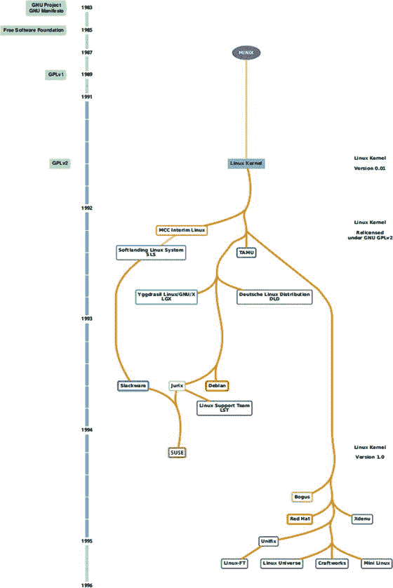
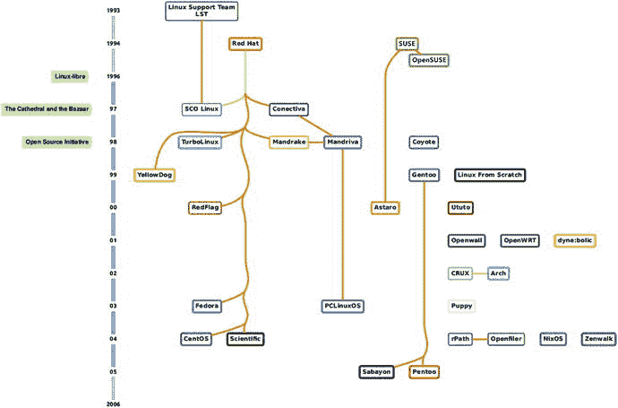
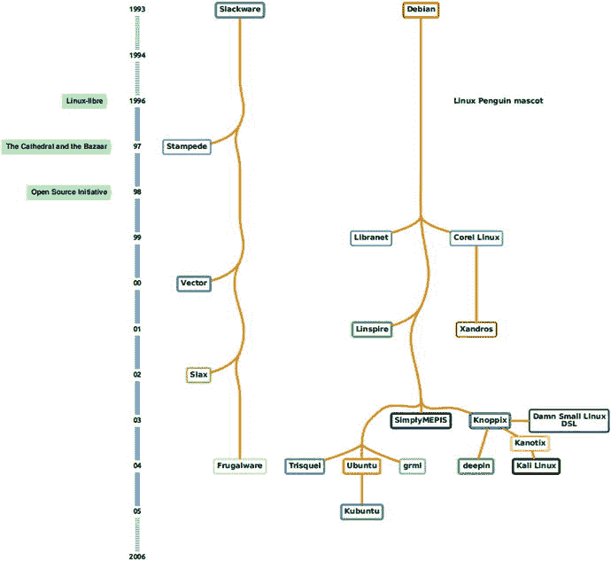
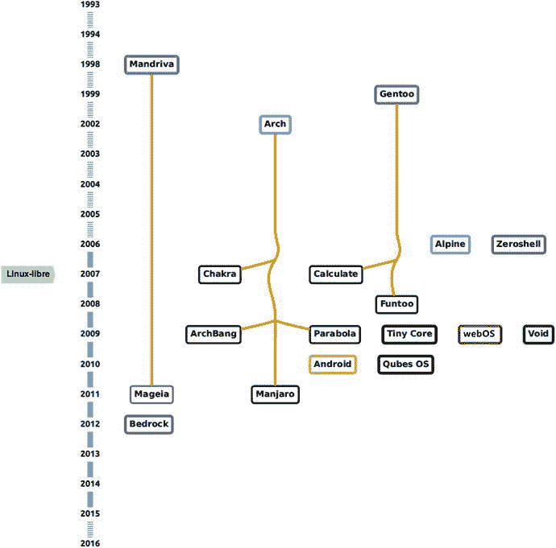

# 3.Linux 发行版家族树

第一个 Linux 发行版是从零开始创建的，只有 Linux 内核和一堆分散的工具(比如 GNU Project 的工具)可以使用。有必要创建一系列新的工具和脚本来组成我们所认为的 Linux 发行版。随着时间的推移，它们会变得更加复杂、先进和有用，但是第一个发行版就是这样从零开始创建的。

但是一旦有了一些足够好的发行版，并且因为其中一些是自由软件，基于这些早期的发行版创建新的发行版就开始有意义了，而不是经历所有的工作来重新创建所需的具体软件。因此，很快就有了基于以前版本的新发行版，但是进行了各种调整以实现创作者的目标。与内核一样，用户社区和免费许可证允许快速采用这种模式。

这种模式仍然是使用最多的，它催生了一系列 Linux 发行版的“家族”。事实上，只有少数 Linux 发行版是基于内核最初的方法创建和维护的。今天的大多数发行版都是从以前存在的发行版衍生而来，有时是从“原始”发行版衍生而来，有时是从衍生产品衍生而来。

创造衍生品的原因显而易见:

*   你已经喜欢上了一个特定的 Linux 发行版的大部分，但是你想改变一些东西。最好的方法是创建一个分支发行版，并根据需要进行修改。如果你保持同步所有你原封不动的东西，这将有助于多年来开发你的发行版。
*   您对 Linux 发行版应该是什么有不同的或个人的看法，并且您想创建一个个人发行版，但是您(或您的团队)没有足够的资源来完成所有必要的工作。获取以前的发行版并选择适合您项目的发行版是一个很好的起点。
*   你想创建一个面向任务的发行版，但是你不想处理从头开始创建一个完整发行版所带来的艰苦工作，所以你选择了一个你喜欢的发行版，因为大部分工作已经完成了。

有时，由于成员之间的意见分歧或不可调和的分歧，分叉起源于发行版社区本身。在 Linux 发行版的历史上有一些著名的例子。

## Linux 发行版系谱

在这一章中，我想让你对 Linux 发行版系谱从 Linux 内核诞生之日起是如何发展的有一个简单的了解。你可以通过一个发行版有多少分支或者有多老来看它的受欢迎程度。此外，系谱解释了为什么一些发行版以他们的方式做事情。我不会假装包含所有当前的发行版；这将是一个令人震惊的任务，而且，除了从学术的角度来看，没有太大的帮助；它甚至可能会令人厌烦和困惑。

我将这个谱系划分为三个时期来帮助你们吸收信息，并且我创建了三个时间表来快速展示这个进化。在这些图形中，发行版被表示为原始版本或衍生版本。一些作为 one 的分支创建的发行版可能会随着时间的推移切换到完全原始的方法，或者基于不同于原始版本的发行版。名字也是如此；我使用当前的名称(或最后一个，如果它已经停止使用)，但有时名称在其生命周期中会更改不止一次。您看到的日期是每个发行版首次发布的日期；为了清楚起见，我没有列出分发的结束日期。

此外，我不会对每个发行版进行详细的讨论，因为考虑到发行版的数量，这是没有意义的。一些发行版对历史没有重大影响，或者没有足够的不同来评价讨论。至于历史发行版，有这么少的信息可用。对这个话题的深入研究超出了本书的目标，也不是我的本意。

顺便说一下，关于 Linux 的历史，尤其是发行版的信息非常少(而且经常是矛盾的)。应该有人拿起火炬，进行研究，并发表出来。

让我们从图 [3-1](#Fig1) 所示的早期 Linux 发行版时间线开始。

图 3-1。

The Linux distro timeline: 1991- 1995

## 1991-1995 年:大爆炸

Linux 历史的前五年代表了 Linux 发行版宇宙中的大爆炸，从没有到第一个出现。这也是历史上最重要的四个发行版诞生的关键时刻:Debian、Slackware、SUSE 和 Red Hat。尽管那时有一些衍生产品，但这是基于原创概念的发行版占大多数的时期。

第一个发行版出现在 1992 年，也就是 Linux 内核出现的第一年。都是拓荒者，今天都灭绝了。第一个发行版是由一两个开发者发布的。它们是四大(Debian、Slackware、SUSE 和 Red Hat)的基础，无论是作为衍生品还是作为灵感的来源。让我们来了解一下这些先驱者。

*   MCC Interim Linux:这并不是第一个试图实现与 Linux 发行版相似目标的发行版，但它是第一个我们可以恰当地命名为 Linux 发行版的发行版。它于 1992 年 2 月在曼彻斯特大学(英国)发布，更确切地说是在曼彻斯特计算机中心，因此得名。一组终端用户和编程工具加上内核可以通过一个原始的菜单驱动的安装程序来安装。多亏了它的开发者 Owen Le Blanc 的工作，非 Linux 专家第一次可以在他们的系统中安装这个操作系统。目前已经停产。
*   软着陆 Linux 系统(SLS):这个名字很能代表第一个发行版的意图。它是由彼得·麦克唐纳于 1992 年 5 月在加拿大发行的。它曾一度是最受欢迎的，但也因其众多的漏洞而受到批评。它是第一个使用图形环境的发行版，X Window 系统(今天仍在使用，来自 UNIX 世界),灵感来自 MCC 发行版。它不复存在了。
*   TAMU:这个发行版是由德克萨斯 A&M 大学 Linux 用户组和 SLS 同时发布的。一些消息来源声称这个发行版是第一个包含 X Windows 系统的发行版。和 SLS 一样，它也是一个有问题的版本。它目前并不活跃，但直到 2010 年，人们还试图让它复活。已经停产了。
*   ygdrasil Linux/GNU/X(LGX):第一个背后有公司支持的发行版，Yggdrasil Computer Incorporated，使其成为第一个商业发行版。它以挪威神话中的世界树命名。它是由加利福尼亚州的亚当·j·里彻开发的，并于 1995 年发布。它有三个显著的成就:它是第一个作为 Live CD 发行的，第一个自动配置和检测硬件的，第一个兼容 UNIX 文件系统层次标准的。这也是另一个没能挺过那些日子的。
*   Deustche Linux 发行版(DLD):德国 Stuttgart 的早期发行版，于 1992 年发布。

Tip

如果你想探索更多，看看那些早期发行版到底是什么样子，你仍然可以在 [`www.oldlinux.org/Linux.old/distributions/`](http://www.oldlinux.org/Linux.old/distributions/) 下载其中一些的旧版本。

现在我们来看看四大。几乎在同一时间(1993 年夏天),但是在美国的两个不同的地方，两个对 SLS 发行版缺乏稳定性感到恼火的开发者有了相同的想法:开始他们自己的发行版。

*   Slackware:由 Patrick Volkerding 在 1993 年创建，最初是 SLS 发行版的一个分支，它是最老的发行版，仍然被积极地维护着。也许是为了避免 SLS 的错误，这个发行版专注于稳定性和简单性。它的创建没有进一步的意图，甚至它的名字也是基于一个笑话，但它是最成熟的，最受欢迎的，也是另一个大发行版的基础。这是第一部真正流行的电影。由于其保守的本质，它可能是当时早期发行版的最具代表性的版本。
*   Debian:伊恩·默多克在 1993 年创建了这个发行版，并以他当时的女友黛博拉和他自己的名字命名。它最初的灵感来自 SLS，但它不是一个叉子。它最大的贡献是 Debian Manifesto，它很早就包含在第一版中，旨在以自由开放的方式维护和开发发行版，就像 Linux 一样，创建了第一个 Linux 发行版社区。这个想法仍然是发行版的核心，并且通过 Debian Social Contract，它继续拥有关于自由和共享的强大价值观。随着时间的推移，它将成为历史上最分叉的发行版之一。

不久之后，另外两个大公司诞生了:

*   SUSE:1992 年 9 月首次发布的德国发行版，至今仍在使用。第一个大型的商业发行版，SUSE 在很长一段时间内是欧洲最常用的发行版之一。它最初是基于 Slackware 的，但很快它开始了自己的发行版，基于另一个发行版 Jurix(现已停产)，也是一个德国发行版。
*   红帽:红帽以销售 Linux 和 UNIX 软件附件起家，然后在 1994 年发布了自己的发行版。它是美国最大的商业发行版(就像 SUSE 在欧洲一样),现在仍然是美国乃至全世界最重要的发行版。它是第一个采用 RPM 包管理系统的，基于 Bogus 发行版之前的开发。

下一节将解释 Linux 发行历史中的中世纪。我把它视觉上分成两组，图 [3-2](#Fig2) 和 [3-3](#Fig3) 。

Figure 3-3 . The Linux distros timeline: 1996-2005, Part II

图 3-2。

The Linux distro timeline: 1996-2005, Part I

## 1996-2005:Linux 世界的扩张

1996-2005 年期间的特点是四大发行版成为最受欢迎的发行版，并且它们的系谱也在扩大。这是分叉模式普及的时代，四大是分叉最多的，尤其是红帽和 Debian。这也是三个发行版诞生的时候:Gentoo、Arch 和 Ubuntu，这三个发行版将成为许多分叉的来源。

### 红帽子

这个时代最流行的发行版之一，也是最分叉的发行版之一。一些最相关的基于 Red Hat (RH)的发行版有

*   SCO:最初命名为 Caldera，是第一个完全面向企业世界的发行版。它基于德国 LST 发行版，但也受到了 Red Hat 的启发。它不是 RH 的分支，但它采用了 RH 的许多解决方案。它向其他发行版展示了如何成为公司桌面的替代品，这使得它多年来非常受欢迎。它现在已经不存在了。
*   Mandriva:1998 年发布的法国发行版，在欧洲非常流行，被认为非常友好，易于安装和管理。它被广泛用作 Windows 桌面的替代品。目前已经停产。
*   Fedora:社区开发的 Red Hat 的替代产品，Fedora 得到了公司的支持。它于 2003 年发行。目前，它是一种社区实验室，用于开发/测试母发行版的一些新技术，但最初它是作为一个社区项目创建的，以提供对已经死亡的 Red Hat Linux(RH 的完全开源发行版)的替代。
*   CentOS:类似于 Fedora，CentOS 是部件的分叉。最初它是在 2004 年作为 RHEL 的克隆版创建的，它可能是世界上安装在公司服务器上最多的发行版。

### 注意

SUSE 在这些日子里没有很多分叉，但它有一个非常重要的分叉，OpenSUSE，它相当于 Red Hat 中的 Fedora。它实际上是 SUSE Linux 个人发行版的继承者。SUSE 是当时 Linux 发行版中最专业的方法，但这意味着大部分代码是私有的，只有几个月后才能免费获得，这严重影响了他的采用，因此也影响了少量的 forks。OpenSuse 发行版是这种模式的一个改变，它在过去的几年里获得了一些流行，但还不足以成为 Red Hat 和其他发行版的竞争对手。

### 一种自由操作系统

Debian 在这个时期有很多分支，但是最重要的三个是 Xandros、Knoppix 和 Ubuntu。

*   Xandros:Xandros 最初名为 Corel Linux，是一个基于 Debian 的商业发行版，于 1999 年首次发布。最重要的事实是 Linux 上 Corel WordPerfect Office 的可用性。这显然是 Corel 试图与 Windows/Office 二重奏竞争的一次尝试。已经停产了。
*   Knoppix:这是一个德国现场 CD/DVD 发行版，与许多计算机杂志一起发行，这在当时是一种流行趋势。它于 2000 年发布，由于其方法，很快变得非常流行。考虑到不需要安装它就可以运行/测试它，许多不熟悉 Linux 的用户测试并使用了它。
*   Ubuntu:显然是这个时代的大革命，Ubuntu 是最有助于推广 Linux 操作系统的发行版。对很多人来说，它是 Linux 的同义词。这是这个时代最分叉的一个，现在依然如此。最初在 2004 年作为 Debian fork 发布，许多 Debian 用户转而使用它。

### 原件

这一时期也有一些新的、原创的发行版，其中一些在几年后变得非常流行，并成为许多 forks 的基础。

*   gentoo:1999 年由丹尼尔·罗宾斯发行。它的目标是创建一个没有预编译二进制文件的发行版，该发行版可以专门针对当前的硬件进行调整，并根据用户的需求进行定制。高级用户非常喜欢这个新发行版。
*   从零开始的 Linux):这从来都不是一个受欢迎的发行版，但是它独特的方式使它成为这个时代的一个重要的输入。它不完全是一个 Linux 发行版；相反，它是一个制作你自己的 Linux 发行版的工具包。它最初发布于 1999 年。
*   Arch:受 CRUX(这一时期的另一个发行版)的启发，Arch 在高级用户中非常受欢迎，后来成为许多 fork 的基础。它的目标是极简主义和简单，以及权力和保持最新的能力。它于 2002 年 3 月发行。
*   NixOS:一个围绕革命性的包管理器 Nix 构建的发行版，它仍然是一个最先进的发行版。它并不广为人知，也没有叉子，但它仍然是那个时代的一个重大事件。

### 斯拉克语

Slackware 继续拥有忠实于该发行版的粉丝，但它不像 Debian 或 Red Hat 那样受欢迎。它有一些分支，像 Slax 和 Vector，但是远远少于 Debian/Red Hat 的分支数量。

图 [3-4](#Fig4) 和 [3-5](#Fig5) 显示了 Linux 发行版历史时间线上的最后一个时期。这一阶段将在下一节中解释。

图 3-5。

The Linux distro timeline: 2005-2015, Part II

图 3-4。

The Linux distro timeline: 2005-2015, Part I

## 2006-2015:整合——几颗恒星，许多行星

2006-2015 年期间是少数明星的巩固期，即 Ubuntu、Debian 和 Red Hat，它们都有许多分支(尤其是 Ubuntu ),并继续受欢迎。Slackware 和 SUSE 继续占据重要地位，但它们积极分流的时代早已过去。另一方面，Arch 和 Gentoo 已经成为流行的发行版，并且有许多分支。仍然有空间出现新的原创发行版，一些像 QubesOS(不流行)或 Android(目前世界上使用最多的 Linux 发行版)一样具有革命性。

*   mint:Ubuntu 最受欢迎的叉子，它太受欢迎了，以至于最近在 distrowatch 上超过了 Ubuntu 的名气(但我怀疑它有那么多安装)。Ubuntu 发布仅两年后，Mint 就诞生了，它提供了一种不同于最初发行版的“风味”。目前，它有基于 Debian 而不是 Ubuntu 的替代版本。
*   初级操作系统:它诞生于 2011 年，旨在提供更好更简单的 Ubuntu。事实上，发行版的起源是一个 Gnome 主题。
*   Mageia:诞生于 2010 年 Mandriva 的灰烬，它的目标是继续为之前发行版的孤儿用户提供相同的体验。
*   Android:严格来说，它不是一个 Linux 发行版，但它是一个基于 Linux 的操作系统，许多人认为它是一个发行版。它于 2008 年发布，专注于平板电脑和智能手机等移动设备。
*   Tails:对于那些关心隐私和匿名的人来说，Tails 是基于 Debian 的，最初是在 2009 年开发的。这是一个现场 CD 发行版，由于斯诺登的爆料，它在安全领域产生了重大影响。

## 摘要

本章简要回顾了 Linux 发行版的发展，以及如何根据它们的起源将它们归类为“家族”。现在想象一下，如果我列出了目前可用的大约 700 个发行版(其中一半以上已经停产)，这一章会有多长。我希望这一章能帮助你理解 Linux 发行版的起源以及它们之间的关系。

在下一章，我将向你展示 Ubuntu Linux 发行版。

Footnotes [1](#Fn1_source)

我只知道一本关于这个主题的书，Glyn Moody 为基础书籍写的《反叛代码:Linux 和开源革命》,但它只详细介绍了 Linux 的最初几年。