# 五、Fedora

Fedora 总是最受欢迎的 Linux 发行版的前五名，这一优势部分来自它的“老大哥”，Red Hat，它不仅将 Fedora 用作其发行版的社区版，还将其用作开发的原型。但是忽视 Fedora 本身的优点是不公平的。它有一个庞大的专家社区。它不是 Linux 新手的最爱，但是许多有经验的 Linux 用户、开发人员和系统管理员都把它作为他们的默认发行版。因为 Red Hat，虽然它最近在更容易使用或流行的发行版中失去了吸引力，但它仍然有很好的未来。

## 历史

Fedora 项目成立于 2003 年 9 月 22 日，当时 Red Hat 决定将 Red Hat Linux 拆分为 Red Hat Enterprise Linux (RHEL)和另一个基于社区的 OS Fedora。与此同时，另一个发行版，红帽专业工作站，被创建，目的是填补 RHL 曾经占据的地方，但没有一个明确的路线表。非企业 RHL 用户很快转而使用 Fedora。同年 11 月 6 日，Fedora 发行版首次发布。

Fedora 的名字来自于一个以前的志愿者项目，Fedora Linux，它制作附加软件；灵感来源于红帽标志(shadowman)的角色所戴的帽子。

## 哲学

Fedora 的理念是两个目标的结合:作为 Red Hat Enterprise Linux 的社区版，以及作为一种新技术的实验室，这些新技术可能会集成到 Red Hat 中。事实上，Red Hat 的新版本来自 Fedora 版本的稳定、安全和改进版本(它们还提供 Red Hat 专有的技术和软件)。因此，Fedora 专注于创新，专注于为 Linux 内核本身做出贡献并与之合作。Fedora 的目标是成为创新的领导者和创造 Linux 发展道路的发行版。多亏了 Fedora，新的 init 系统 systemd 被几乎每个发行版广泛采用。Linus Torvalds 在他的计算机上使用 Fedora，可能是因为 Fedora 社区和开发人员与内核社区和核心开发人员之间的紧密关系。

## 发行版选择标准

现在你已经知道了 Fedora 的简史，让我们看看它在第 [2](02.html) 章的选择标准上表现如何。

### 目的和环境

因为有了 Red Hat 的支持，Fedora 虽然是一个通用发行版，但也有针对不同环境和面向任务的版本。除了 Ubuntu，Fedora 还提供了官方支持的大多数版本/风格。

以下是 Fedora 的主要官方版本:

*   工作站:面向桌面/工作站的通用版本。这是我将在这里展示给你们的。
*   服务器:安装在服务器上，这是一个面向任务的版本。
*   云:为了在云环境中使用，它是一个专门的最小服务器版本。

像 Ubuntu 和它的不同风格(实际上只是桌面环境不同)一样，Fedora 提供 Fedora Spins，这是 Fedora 的版本，DE 与默认版本不同。您将在“桌面环境”部分看到它们。

Fedora 还提供了另一系列根据特定任务制作的图像，Fedora Labs ( [`https://labs.fedoraproject.org`](https://labs.fedoraproject.org/) )。因此，Fedora 在以下场景中是面向任务的发行版:

*   设计套件:面向出版、多媒体和视觉设计。
*   游戏:准备在 Fedora 下运行的游戏集合。
*   Jam:创建、编辑和制作音乐和音频。
*   机器人套件:针对机器人初学者和专家的软件包。
*   科学:用于科学研究和数值计算的工具。
*   安全实验室:用于安全审计、系统救援和取证。

最后，Fedora 为 ARM 架构、服务器和台式机提供了特殊的映像。对于台式机，有该处理器的官方版本，并且所有 Fedora Spins 也是可用的。对于服务器，有一个常规版本和一个最小版本(你可以把它看作是云的等价物，一个核心版本)。你可以在 [`https://arm.fedoraproject.org`](https://arm.fedoraproject.org/) 得到全部。

### 支持

Fedora 得到了相当好的支持(没有 Ubuntu 支持得好，但也足够了)。这种支持只来自社区和 Fedora 开发者；这个发行版没有商业支持。红帽公司赞助 Fedora，但只为其商业发行提供商业支持。

还有，Fedora 社区很大，但是没有 Ubuntu 那个大。然而，它并不缺乏支持其用户的方法。以下是从社区获得帮助的渠道:

*   文档: [`http://docs.fedoraproject.org/`](http://docs.fedoraproject.org/)
*   常见问题: [`https://fedoraproject.org/wiki/FAQ`](https://fedoraproject.org/wiki/FAQ)
*   Wiki: [`https://fedoraproject.org/wiki`](https://fedoraproject.org/wiki)
*   问 Fedora: [`https://ask.fedoraproject.org/en/questions/`](https://ask.fedoraproject.org/en/questions/)
*   Fedora 论坛: [`http://fedoraforum.org/`](http://fedoraforum.org/)
*   社区: [`http://fedoracommunity.org/`](http://fedoracommunity.org/)
*   邮件列表: [`https://lists.fedoraproject.org/mailman/listinfo/users`](https://lists.fedoraproject.org/mailman/listinfo/users)
*   freenode 上的 IRC: `#fedora`频道

### 用户友好性

从一个 Ubuntu 用户的角度来看，你可以说 Fedora 不太用户友好，但是从一个 Linux/Gentoo 铁杆用户的角度来看，它是一个非常容易使用的发行版。取决于你想用它做什么，Fedora 占据了一个中间点。例如，Fedora 有一个非常好的安装工具 Anaconda，这使得安装过程非常舒适。但是当您需要执行任何管理/维护任务时，您需要知道如何使用命令行工具。这是 Linux 多年来的标准，可能和 Debian 一样，但事实是还有其他发行版比 Fedora 更容易使用。

### 稳定性

虽然 Fedora 总是处于技术和创新的前沿，但它是一个非常稳定的发行版。从我的角度来看，它比 Ubuntu 更稳定，如果你以预期的方式做事(换句话说，不要使用外部回购，不要调整太多，等等)。).Fedora 为其版本提供的支持时间比 Ubuntu 短(13 个月，而 Ubuntu 的常规版本为 18 个月)。和 Ubuntu 一样，Fedora 使用标准发布方案的变体；两者的新版本发布周期相同；六个月。你可以在 [`https://fedoraproject.org/wiki/Releases`](https://fedoraproject.org/wiki/Releases) 了解更多关于 Fedora 发布周期的信息。

### 硬件支持

由于其不包含私有驱动的政策，Fedora 中的硬件支持不如 Ubuntu。然而，它从红帽的社区版本中得到好处，因为许多硬件支持红帽。此外，许多公司以`.rpm`包格式开发驱动程序，Fedora 支持这种格式。如果您愿意为发行版使用替代的、非官方的库，您可以使用各种私有驱动程序(尤其是显卡和网卡)。

请注意，使用最新的内核有助于检测它支持的新硬件。这对于笔记本电脑尤其重要。

### 美学

除了徽标、颜色和背景，Fedora 并没有努力定制发行版的设计。它提供标准版本和当前版本的 Gnome，没有定制，这与 Ubuntu、Mint 和其他版本相反。如果你喜欢现在的 DEs 开箱即用的设计，你会喜欢 Fedora 否则，您应该寻找定制。

### 桌面环境

Fedora 的默认和官方桌面环境是 Gnome，目前是这个 DE 的第 3 版。但是如前所述，Fedora Spins 以可用的 ISO 映像的形式提供了替代方案，这些映像使用其他 DEs 作为默认值。目前，可用的 Fedora Spins ( [`https://spins.fedoraproject.org`](https://spins.fedoraproject.org/) )如下:

*   KDE 等离子:使用 KDE 等离子。
*   XFCE:这里用的是 XFCE 德。
*   LXDE:这个选项的轻量级 LXDE 桌面。
*   MATE-COMPIZ:结合了 MATE(类似于经典的 Gnome 2)和 COMPIZ 合成效果。
*   CINNAMON:使用 Gnome 3 的 GTK3+工具包，但是看起来更古典。
*   SOAS: Sugar on a Stick 将 Sugar 学习平台与能够安装在 USB 驱动器上的移动性相结合。它被定位为教育/学习平台。

### 初始化系统

如果大多数 Linux 发行版最近都采用了 systemd init 系统，显然开发它(来自 Red Hat 开发人员)并首先采用它的发行版将继续使用它。

### 包装管理系统

Fedora 使用与 Red Hat、rpm 相同的包管理系统，以及相同的工具。尽管有一个名为 Software (gnome-software)的 GUI 应用程序来管理软件应用程序，但在 Fedora 中管理软件包的正确方式是通过终端中的`dnf`命令(以前的`yum`)。还有一些工具可以直接管理`.rpm`包。

Fedora 的官方资源库(只有一个)的软件包数量比 Debian 或 Ubuntu(少了约 5000 个软件包)要逊色，非免费的第三方软件包也不在其中。因此，有一个提供更多包和非自由包的外部非官方库的传统。正如我在 Ubuntu 一章中所说的，这种做法不仅损害了操作系统的稳定性，而且也是一个明显的安全风险，因为你必须信任库的维护者。

Fedora 受益于来自所有公司和开发人员的`.rpm`格式，这些公司和开发人员开发的软件可能不在任何存储库中，但通常可以在`.rpm`或`.deb`包中获得(或作为源代码 tarballs)。

### 体系结构

与许多发行版一样，支持两种主要的英特尔架构，32 位版本和 64 位版本。Fedora 最近宣布，他们将在未来的版本中只专注于 64 位版本，而将 i686 架构留在第二个平面上，并且可能不会在发布周期中同步。也支持 ARM。

### 安全性/匿名性

Fedora 是最安全的发行版之一，这是当之无愧的。例如，防火墙、PolicyKit 和 SELinux 在其他安全功能中是默认启用的。此外，您可以对所有磁盘或卷或文件进行加密；Fedora 是这一领域的佼佼者。更多信息见 [`https://fedoraproject.org/wiki/Security_Features`](https://fedoraproject.org/wiki/Security_Features) 。

在匿名方面，你可以在第一次启动 Gnome 初始设置时或稍后在设置应用程序中配置这些选项。你可以决定什么信息被共享，什么信息被发送回 Fedora 或 Gnome。

### 原则和道德

Fedora 非常注重只使用自由和开源软件，但这并不意味着他们不在内核中分发私有 blobs(非自由二进制固件)。除此之外，Fedora 对不使用驱动程序的专有软件的政策非常严格。它不包括显卡、mp3 软件、Flash 播放器等的专有驱动程序。想要使用这些软件的用户通常必须依赖其他非官方的存储库。关于这件事的官方 Fedora 政策可以在它的维基上看到 [`https://fedoraproject.org/wiki/Forbidden_items`](https://fedoraproject.org/wiki/Forbidden_items) 。

### 现场 CD

Fedora 的 ISO 映像作为发行版的实时版本工作得很好，因此您可以使用它们来启动 Fedora 的实时会话，而无需接触存储设备上的任何东西。

### 专业认证

Fedora 本身没有专业认证，但它的支持公司 Red Hat 有几个最负盛名的认证，如第 2 章所述。因此，因为 Fedora 是 Red Hat 的基础，所以您应该能够毫无问题地将通过这些认证考试获得的知识应用到 Fedora 中。

## 装置

如前一章所述，在这次安装中(以及在接下来的安装中),我将稍微偏离安装工具作为默认工作流给出的“预定义”方式。稍后你会看到，Fedora 中的这个小变化并没有带来很大的不同，但在其他发行版中却有(比如 Ubuntu)。

第一步总是下载发行版的 ISO 镜像以便能够安装它。显然我选择了工作站版本的发行版安装在这里，因为它是大多数用户使用的版本。所以去 Fedora 发行版的下载页面， [`https://getfedora.org/en/workstation/download/`](https://getfedora.org/en/workstation/download/) ，你会看到类似图 [5-1](#Fig1) 的东西。


图 5-1。

The download page of Fedora 23 Workstation

如果您单击下载按钮，下载将自动开始。撰写本文时的版本是 23，默认架构是 64 位。该图像目前的大小为 1.4GB，只能存储在 DVD 或 USB 驱动器上。如果你需要不同的建筑、形象或风格，你可以去页面底部，在那里你会看到类似于图 [5-2](#Fig2) 的东西。

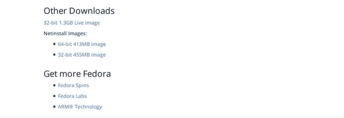

图 5-2。

Alternatives for downloading Fedora’s ISO images

您可以获得这两种体系结构的 32 位 ISO 映像(i686)或 netinstall 映像。您还可以访问 Spin 和 Labs 版本以及 ARM 版本。该页面还链接到 Fedora Wiki，以找到出售发行版 DVD 拷贝的在线或本地供应商，或者链接到他们的免费媒体请求程序，供那些无力购买的人使用。另一种方法是使用 BitTorrent 跟踪器来下载 ISO 映像。这些选项位于 [`https://torrents.fedoraproject.org/`](https://torrents.fedoraproject.org/) 。

Fedora 提供了对发行说明(我建议在升级到新版本时总是阅读这些说明)和该版本安装过程文档的访问，这非常好( [`http://docs.fedoraproject.org/en-US/Fedora/23/html/Installation_Guide/`](http://docs.fedoraproject.org/en-US/Fedora/23/html/Installation_Guide/) )。但是，您只需要在安装过程的第一步使用本指南；对于其余步骤，可以直接从安装程序中获得好的文档。

一旦你有了发行版的 ISO 镜像，你就可以第一次用它来启动你的系统了。出现的第一个屏幕是图 [5-3](#Fig3) 中的屏幕；它是一个经典的文本菜单(在 Linux 中很常见)。你可能认为它没有 Ubuntu 那么精致，但是不要被它的外观欺骗了。除非你按下任何键，否则这个屏幕在自动启动 Fedora Live 之前只持续 10 秒钟。因此，从这里你可以做四件有意义的事情:

*   Go to the other menu option, Troubleshooting (Figure [5-5](#Fig5)), which allows you to test your installation media or memory, or both, from your hard drive. It also allows you to start the Live version, avoiding problems with your graphics card (which is common in laptops). Do this when you experience rare things on your screen (like distortions or lines) with the default option.

    

    图 5-5。

    The troubleshooting menu of the Fedora Live boot process

*   没什么？Fedora 的现场版将在 10 秒后开始。
*   按 Enter 键立即启动 Fedora Live。
*   Press Tab to access to the configuration options, as you can see in Figure [5-4](#Fig4). This is for advanced users who usually customize the installation because of hardware or deployment requirements.

    

    图 5-4。

    The advanced configuration options of the installation boot

    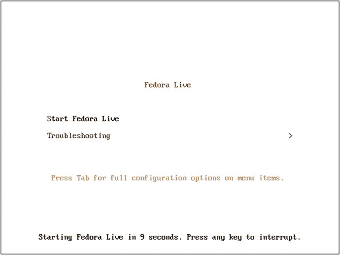

    图 5-3。

    First screen of the Fedora installation process

显而易见的选择是继续使用默认选项，然后等待 10 秒钟或按 Enter 键进入下一步。出现在你面前的下一个屏幕是一个黑色的屏幕，在底部有一个动画进度条，在这一步的最后是 Fedora 发布版本，如图 [5-6](#Fig6) 所示。


图 5-6。

The bottom of the screen when Fedora Live is booting up

当 Fedora Live 最终启动时，出现的欢迎屏幕(图 [5-7](#Fig7) )让您在两个选项之间进行选择:在系统的硬盘上安装发行版，或者继续在 Live 会话中测试 Fedora。如果你是 Gnome 环境的新手或者你想测试 Fedora，你可以选择稍后通过 Activities 菜单安装它。让我们选择“安装到硬盘”选项继续。

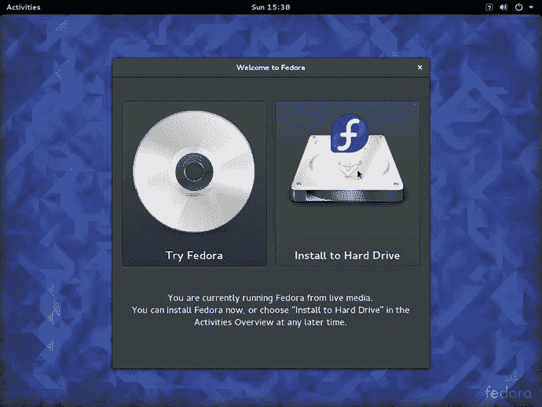

图 5-7。

Fedora Workstation Live welcome screen

这是安装过程中真正的第一步，首先要做的是选择在所有后续步骤中使用的语言(默认情况下是在发行版中)。如果你有一个互联网连接，它会试图通过你的 IP 广域网地址自动检测你的地区(准确地说是时区)，并自动为你设置语言。否则，它将默认选择英语(美国),如有必要，您必须手动更改。还有一个按钮叫帮助！，这是一个上下文帮助，可以在此过程中为您提供指导。选择语言后，按下“继续”按钮(图 [5-8](#Fig8) )。

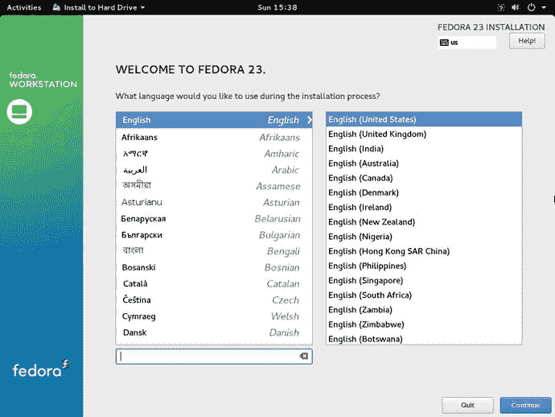

图 5-8。

The language selection screen

下一个屏幕包括几乎所有您必须做出的选择，以完成这个过程。与上一个屏幕一样，Anaconda(Fedora 安装程序)将尝试为您做出所有决定，在大多数情况下，这些决定都是正确的。然而，即使所有的选择都是正确的，如图 [5-9](#Fig9) 所示，程序也不会允许您继续，直到您完成安装目的地部分。原因是显而易见的:在您对硬盘进行任何更改之前，您需要检查它们。让我们浏览一下这里包含的所有四个部分。如果按下帮助按钮，将会出现如图 [5-10](#Fig10) 所示的帮助对话框。


图 5-10。

The context help that can guide you through all of the installation

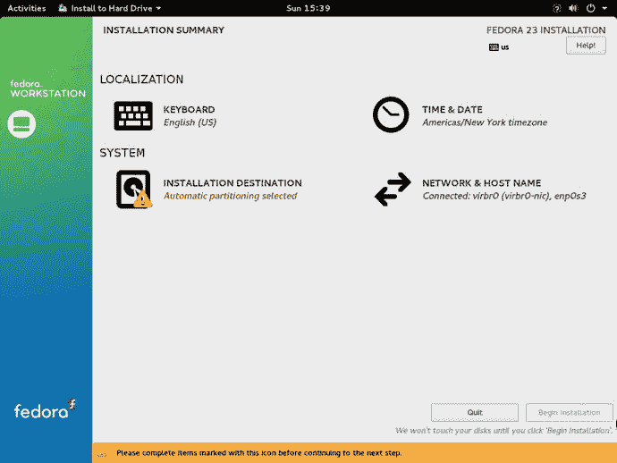

图 5-9。

The installation summary screen

在键盘部分(图 [5-11](#Fig11) )你可以选择你想在你的发行版中使用的键盘布局。像往常一样，自动选择正确答案的概率很大；如果没有，必须手动选择。这里有两个有趣的选择。首先，如果您用鼠标从列表中选择任何布局，您将看到它的交互式表示(帮助您直观地识别它)。其次，如果您添加了多个布局，您可以从列表中选择您想要用来在它们之间切换的键盘组合。要选择后一个选项，您必须使用选项按钮。


图 5-11。

The keyboard layout selection screen

时间和日期部分允许您在地图上交互选择您的时区，并手动设置时间和日期(图 [5-12](#Fig12) )。如果你在线的话，这个大概是自动选择正确的。与 Ubuntu 的区别之一是，除了能够手动调整时钟和日历，你还可以切换网络时间，甚至配置它。NTP(网络时间协议)意味着你的系统时钟总是正确的，因为它是通过检查互联网上的时间服务器定期调整的。如果您想要一个不同于 Fedora 默认设置的 NTP 服务器，也可以通过齿轮图标来设置。这在 Ubuntu 中是默认开启的，但是你可以看到 Fedora 对此有不同的处理方式。作为 Red Hat 遗产的一部分，也作为其不同哲学的一部分，您将继续看到 Fedora 是如何给用户更多的责任的，尽管它易于使用和安装。我建议您坚持使用默认的 NTP 选项。进行必要的调整或简单地检查一切是否正确，然后按下完成按钮。

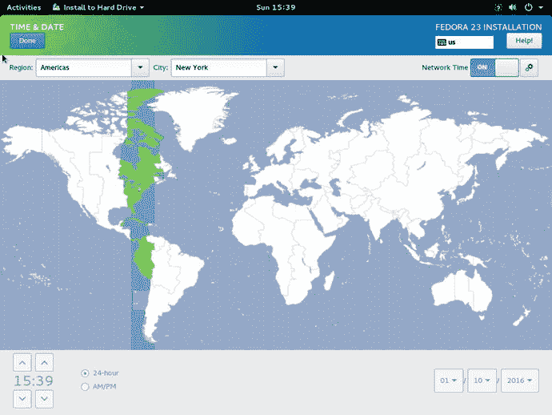

图 5-12。

Selection of time and date by region

网络和主机名部分(图 [5-13](#Fig13) )有点复杂，因为您只能在这里更改主机名。网络配置的其余部分在 Gnome 的配置选项下。如果您不在本地网络上或者您不理解该选项，请将主机名保留为默认值。剩下的配置可以通过顶部 Gnome 菜单栏右边的图标来访问，在那里你可以看到音量、网络和电源图标。如果你点击这个图标，你会看到如图 [5-14](#Fig14) 第二个对话框。在这个对话框中，您将看到 Anaconda 检测到的当前网络配置；它可以是有线或无线连接。您还会看到用户和音量设置以及用于访问配置、屏幕锁定和电源设置的图标。如果您单击网络连接图标，它会显示两个选项:打开/关闭连接和访问设置。点击设置，弹出对话框显示所有网络设置，如图 [5-14](#Fig14) 底部所示。

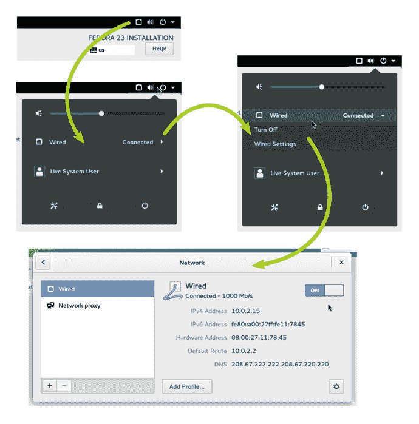

图 5-14。

How to access the network settings in the installation process


图 5-13。

The first part of the network configuration

左侧是检测到的所有可用连接(您可以添加更多)和代理配置的列表。右边是关于当前所选连接的信息和一个开关按钮。如果您通过带有 DNS 服务器的路由器(有线或 Wi-Fi)或通过本地网络连接到互联网，所有这些都会自动正确配置。如果没有，或者如果你想调整一些东西，你可以随时通过齿轮图标改变设置。还有，你可以通过添加配置文件按钮管理不同的配置文件，这对于笔记本电脑连接不同的网络非常有用(自动或每次都要求输入密码；这是你的选择)。

此安装摘要屏幕的最后一部分是安装目的地部分。这些信息对您来说是独一无二的，必须进行审核(这是强制性的)。如图 [5-15](#Fig15) 所示，该屏幕有四个重要部分:


图 5-15。

The Installation Destination section

*   本地标准磁盘。在这里，您可以找到系统上目前可用的普通硬盘(HDD、SDD、USB)。目前，只有一个常规的 1TB 硬盘；其他的例子，我会给你看其他的情况。
*   专用磁盘和网络磁盘。在这里你可以找到像 iSCSI 和 FCoE 那样的局域网磁盘。这些通常是为在本地网络上工作的高级用户准备的。我在这里跳过这一部分。
*   其他存储选项。这是您决定接受已经为您做好的自动设置或自定义它们的地方。这是我接下来要探讨的部分。
*   完整磁盘摘要。它看起来不重要，因为它只是底部的一个链接，但它是你的磁盘的汇总，你可以选择从哪个磁盘启动(通常你不需要改变它)。

在“其他储物选项”部分，您必须特别注意您正在做的事情。正如我在 Ubuntu 章节中解释的，你可以在这里决定是否加密你的数据(整个磁盘)。在这个安装示例中，我将跳过这一步。这是分区主题，我想花点时间解释一下选项。如前所述，这种配置通常是自动完成的，所以您可以简单地按下 Done 按钮并开始安装。我建议只有当你有一个空磁盘时才这样做(或者如果你不介意丢失当前的数据)。但是，如果您想留出一些磁盘空间(例如，安装另一个操作系统)，您必须选择“我想腾出额外的可用空间”选项。

让我们忽略所有这些，通过选择“我将配置分区”选项来手动配置分区。选择该选项后，请按“完成”按钮。您将看到如图 [5-16](#Fig16) 所示的屏幕。

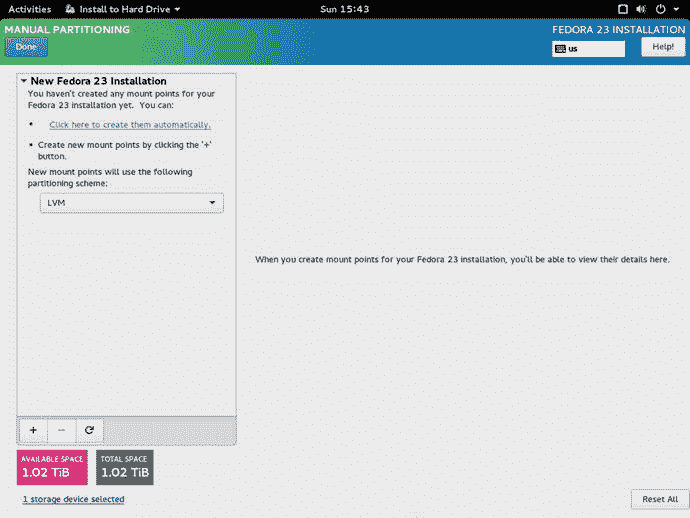

图 5-16。

Manual disk partitioning

这是一块空白的画布，您可以在这里制作完全定制的分区，或者从 Anaconda 获得帮助。这里最重要的是分区方案。Fedora 目前提供四种选择:

*   标准分区:默认情况下，常规分区和 ext4 文件系统的传统方案。
*   Btrfs:因为它处于技术的前沿，Fedora 提供了 Btrfs。Btrfs 是一个具有卷管理和容错能力的文件系统，它基于类似于 Solaris ZFS 的二叉树。
*   LVM:逻辑卷管理器比传统的分区提供了更多的灵活性和易用性(以及其他高级功能)。
*   LVM 精简配置:这是 LVM 的一项高级功能，可以在需要时为逻辑卷动态分配磁盘空间。如果您不是高级用户，请忽略这一点。

Fedora 默认选择 LVM 模式，因为它在特性/性能/易用性方面更平衡。如果你更喜欢传统的方式，你可以选择标准的。与 LVM 相比，Btrfs 提供了许多额外的功能，但它仍处于试验阶段，其性能比 ext4 fs 差。所以如果你没有什么特别的要求，就保持 LVM 方案吧。

Note

在选择 LVM 或 BTRFS 作为您的分区方案时，要考虑一个特殊的事情:虽然两者都提供了更多的管理分区的灵活性(比如分配或调整大小)，但是只有少数 GUI 工具可以正确地管理它(而且它们不是很好)，所以您应该通过命令行来管理这个卷。

选择分区方案后，您有两个选择:手动添加卷或让 Fedora 自动管理。Fedora 在这里不同于完成这项任务的传统方式；通常，您应该首先定义您的分区或逻辑卷，然后为每个分区或逻辑卷定义您的文件系统，然后选择挂载点。Anaconda 让您首先选择您的分区方案，然后选择您的挂载点，其余的是自动决定的(您可以稍后更改)。从我的角度和经验来看，这是一个好得多的方法，特别是对于非高级用户。

如果您决定手动添加挂载点，您必须使用屏幕底部的+图标。应出现类似图 [5-17](#Fig17) 的对话框。您选择一个挂载点，比如/、/boot、/swap 或/home，然后选择您想要分配给它的磁盘空间。在有可用空间的情况下，您可以根据需要创建任意数量的文件(您始终可以通过选择该挂载点来更改初始设置)。在这里，我想向您介绍我推荐的分区方案(它不同于 Ubuntu，我告诉过您我不喜欢 Ubuntu)。


图 5-17。

Dialog to add a new mount point

为了刷新你的记忆，Ubuntu 只创建了两个分区，两个挂载点，一个用于交换分区，另一个用于根(`/`)分区。系统中的所有文件加上你的个人数据都在同一个分区，根分区。这种方式易于管理，并且浪费较少的磁盘空间，但只是短期的。我不喜欢它，因为从长远来看，它通常会给你带来更多的头痛和问题，所以不值得。例如，如果您想将您的 Linux 发行版升级到一个新的版本，而升级过程并不顺利，那么如果您想进行全新的安装，而不是以一种不可管理的混乱结束，那么您必须以一种强制的方式对您的所有数据(至少是`/home`目录)进行备份/删除/恢复循环(尽管我建议定期这样做)。所以我建议您将`/`挂载点分成两个不同的挂载点:一个是`/`挂载点，用于所有的系统文件，另一个是`/home`挂载点，用于存储您的个人文件和程序配置。我建议增加一个额外的`/boot`分区来管理引导文件，避免将来系统升级、迁移或某些 BIOS 出现问题。为了做到这一点，我推荐最小 500MB 的引导分区(并使用标准分区)和 15GB 的`/`挂载点。

如果让 Anaconda 为您做这件事，结果将如图 [5-18](#Fig18) 所示。它还显示了默认的自动分区，如果您选择默认的自动方式而不是这种伪手动方式，Fedora 将应用该分区。正如你所看到的，Fedora 选择了我推荐给你的那个分区方案，而且它比 Ubuntu 默认选择的那个要好得多。Fedora 总是选择这种模式，不管您选择标准、LVM 还是 BTRFS。因此，Fedora 为带有 ext4 fs 的`/boot`挂载点创建了一个标准分区，并为其余部分创建了一个名为`fedora`的 LVM 卷组，作为带有 ext4 fs 的逻辑卷(`swap`用于交换挂载卷)。最终的可用空间很小，不到 1MB，因此它在这方面工作得很好。专用于`swap`卷的空间大小是根据您系统中的物理 RAM 大小来分配的，因为如果您想让系统休眠，内存中的数据将存储在该分区中。在每个卷/分区中，您有一系列可以更改的数据/选项，从挂载点和容量到文件系统和名称。我喜欢改变专用于`/`卷的磁盘空间大小；50GB 有点保守和安全，所以也许 35GB 就够了。您可以减少`/`音量中的空间并按下更新设置按钮，然后增加`/home`音量。如您所见，您可以在这里加密单个卷，而不是像前面的屏幕选项那样全局加密。此外，您可以通过卷组的“修改”按钮设置其他高级功能，如 RAID(此设置会影响所有逻辑卷)。您还可以将 LVM 卷与 BTRFS 卷混合使用，或者使用 ext4 之外的文件系统。最后一件事:如果您进行了任何更改，并且认为它们不好，您可以随时通过按下“宗卷/分区”列表底部的“↻”按钮，然后在出现的新对话框中按下“重新扫描磁盘”按钮，从头开始。好了，让我们保留这些设置，然后按屏幕左上角的完成按钮。

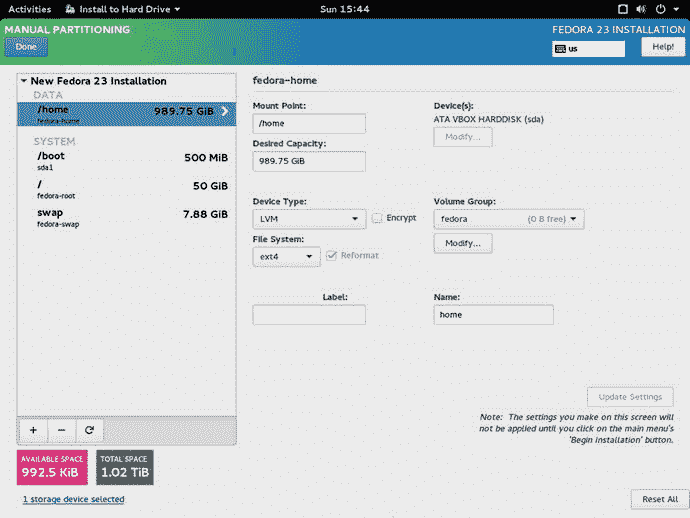

图 5-18。

The automatically defined partition scheme for LVM

出现一个对话框，显示将要对磁盘进行的更改。如果正常，按下接受更改按钮(图 [5-19](#Fig19) )。您将返回到安装摘要屏幕。“开始安装”按钮已启用；按下按钮，安装过程会将更改写入您的磁盘，并开始在您的系统上安装操作系统。然而，即使在分区和安装 Fedora 的过程中，您仍然需要设置两个以上的东西(图 [5-20](#Fig20) )。

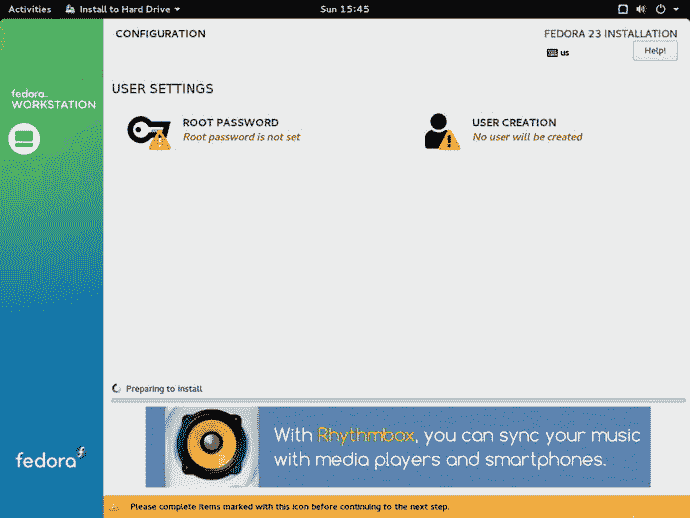

图 5-20。

The User Settings screen of the Fedora installation process


图 5-19。

The summary of changes to write to the disk

这里和 Ubuntu 的另一个很大的区别是，你需要为 root 用户(主账号和默认的 admin 账号)设置密码；这在 Ubuntu 中是默认禁用的(你使用的是普通用户，管理事务需要你的密码)。这是应该做的事情，尽管这不太容易，并且需要用户承担责任。如果你想模仿 Ubuntu 的行为，你可以随时将你的用户添加到`wheel`组。让我们在根密码部分建立根密码(图 [5-21](#Fig21) )。


图 5-21。

Setting the root password

这里要注意设置一个强密码，因为这是我们讨论安全性时最关键的攻击点之一。如果有人知道你的根密码，他可以拥有你的整个系统，小心！设置密码并返回到上一个屏幕后，您可能会注意到一些奇怪的事情。用户创建部分现在可以了，不需要创建另一个用户。您可以继续，但是我强烈建议您永远不要使用 root 帐户来使用您的系统。始终使用另一个普通用户来操作您的系统。这是一个严重的安全缺陷(也是多年来 Window 用户的主要缺陷)。我认为 Fedora 这样做是为了允许 OEM 安装。(以后你随时可以自己创造；事实上，如果你现在不做的话，你会在 Gnome 设置中做的)。无论如何，让我们创建一个新用户，它将是您的计算机图 [5-22](#Fig22) 的默认用户。

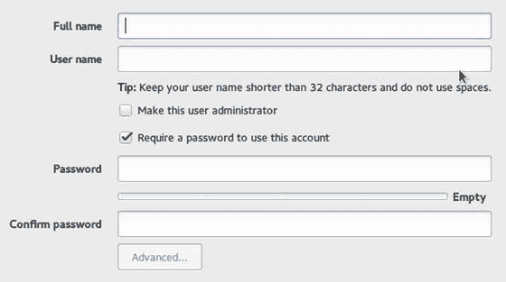

图 5-22。

Create a new user account

这里有两个主要选项:让该用户成为管理员，以及打开/关闭对密码的需求。如果你想模仿 Ubuntu 的行为，设置第一个选项；不应设置第二个选项(仅用于创建来宾帐户)。千万，绝对千万，不设置第二个就设置第一个选项；拥有管理员权限但没有密码的用户很容易导致灾难(尤其是当您的系统连接到互联网时)。在高级部分，你可以调整这些设置，但是如果你不理解就不要碰它们。设置这个新用户并返回到上一个屏幕后，您只需等待安装完成，然后重新启动系统就可以使用您的新 Fedora Linux 操作系统了(图 [5-23](#Fig23) )。


图 5-23。

The first screen of a fresh new Fedora Linux OS

重启系统后，出现的第一个屏幕很难看(图 [5-24](#Fig24) )，但在 Linux 中很常见；这是一个文本菜单，允许您在常规 Fedora 会话和救援会话之间进行选择(如果常规会话无法启动，您可以使用救援会话)。还有两个面向高级用户的选项，如“e”和“c”键。如果您按 Enter 键或稍等片刻，系统将继续启动过程。

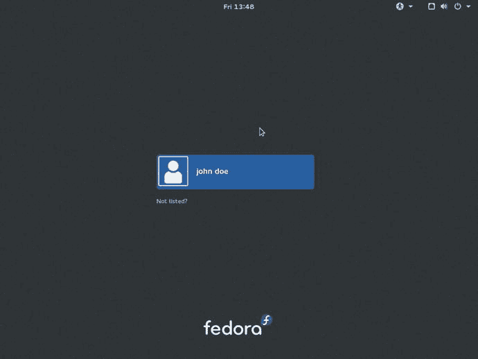

图 5-24。

The Fedora login screen

当 Fedora 完成启动过程时，您将看到 Gnome 登录屏幕(图 [5-24](#Fig24) ),其中列出了所有用户(此时，您只有一个用户)。如果您选择您的用户，它将询问您的密码。当您输入密码时，您会在登录按钮的右侧看到一个齿轮图标。此图标(图 [5-25](#Fig25) )让您在系统上安装的可用桌面环境之间进行选择。默认情况下你只有三个:Gnome (Gnome 3)、Gnome Classic (Gnome 2)和 Wayland 上的 Gnome(Gnome 3)。我建议您保留默认的 Gnome，因为 Classic 会导致一些应用程序出现问题。Wayland 是 Fedora 使用新技术的另一个例子；Wayland 的目标是取代古老的 X window 系统，但它仍然太新，可能会与一些应用程序崩溃，特别是一些显卡。


图 5-25。

The desktop environments available to you

现在你已经登录到了新的操作系统，但是一个新的惊喜在等着你:Gnome 初始设置。您可以在这里设置 Gnome 语言、键盘布局、隐私设置和在线帐户(如果您在安装过程中没有创建用户，还可以设置一个本地帐户)。这些设置通常是默认设置的，如果您不想更改任何内容，可以跳过所有这些设置。最后，Gnome 帮助系统的入门手册(图 [5-26](#Fig26) )会帮助新用户熟悉如何使用 Gnome。


图 5-26。

The Gnome initial setup and the Getting Started Help

就这样！你现在可以自由地享受你的 Fedora Linux 操作系统。在接下来的 Linux 发行版安装中，您将继续探索不同的东西。

## 保持

和 Ubuntu 一样(一般来说)，维护你的 Linux 发行版有三个基本任务:更新和升级你的发行版，管理你的应用程序。但与 Ubuntu 不同，Fedora 的这些任务需要用户使用终端，这是大多数用户害怕的。

### 管理应用程序

在 Fedora 中，管理应用程序首先是一项简单的任务；您可以使用软件应用程序(gnome-software)来安装和删除应用程序。这是一个非常易于使用的应用程序，与 Ubuntu 中的应用程序非常相似。在图 [5-27](#Fig27) 中可以看到。但是你不能在那里找到所有的 Fedora 应用程序；对于 Fedora 自己的大多数包，无论喜欢与否，都必须使用命令行。

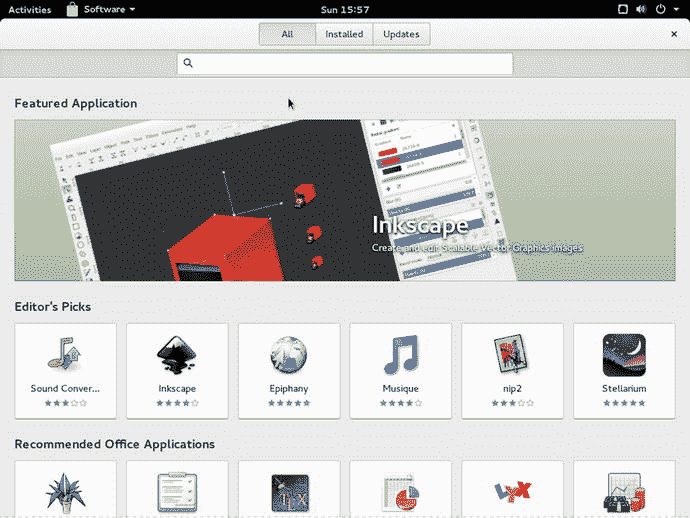

图 5-27。

The Software manager application of Gnome

### 更新

图 [5-27](#Fig27) 显示了一个更新选项卡，所以你可能认为你可以从这里更新你的 Fedora。错了。这又是一次您必须使用终端和命令行应用程序的时候。要从命令行管理 Fedora 中的包，必须使用命令`dnf`(以前的`yum`)，并且必须为此打开终端。如果您想更新 Fedora OS 的软件包，您应该使用以下命令:

```sh
$ sudo dnf update

```

基本上，这个命令从在线存储库中刷新关于包的信息(元数据)。如果有可用的更新，它会向您显示一个列表和一个摘要，并要求您确认更新所有更新。显然，您应该定期这样做，以使您的操作系统保持最新(至少可以避免安全问题)。

Note

我在这里使用`sudo`命令来执行管理任务(更新包),因为我假设您在安装时创建了具有管理权限的默认用户(正如我所建议的)。如果不是这样，您需要使用 root 用户来执行此任务。为此，请使用以下代码:

```sh
$ su root:      # you are going to switch here your user with root
Password:       # you have to introduce here the root password
# dnf update:   # then you can update, don't forget to log out (exit) after end

```

Tip

如果您不想再使用用户`root`，您可以将您的用户添加到`wheel`组，以便能够使用`sudo`命令和您的密码。使用此代码(来自`root`用户):

```sh
# usermod -a -G wheel youruser

```

图 [5-28](#Fig28) 是我告诉你的图形证明。软件应用程序说没有更新，一切都是最新的，而`$ sudo dnf update`命令告诉你一个完全不同的故事。所以，你要更新 552 个包(这也需要安装 11 个新的)，加起来总共 799MB。你不能相信这里的`gnome-software`应用。如果您选择 Fedora 作为您的 Linux 发行版，请学习如何使用 dnf 包。这并不难，而且你可以更好地控制你的系统。

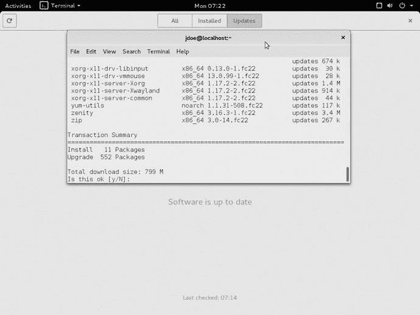

图 5-28。

The gnome-software vs. the dnf package updates search results

您也可以从 dnf 设置自动更新，但不建议这样做，因为您无法控制更新的内容和时间。

### 升级

如果您想在新版本到来时升级当前版本的 Fedora，命令行和终端是您的好朋友。您也可以使用 dnf 包来做到这一点，但是我将向您展示一种更好的方法。有一个专门用于此任务的包，FedUp(用于 Fedora 升级程序)。默认不安装，首先要做的就是安装。

```sh
$ sudo dnf install fedup

```

之后，你必须更新你的系统(我刚刚给你看了)。这样做是很重要的，以避免升级过程中的任何问题(这是一个非常微妙的问题，正如我在 Ubuntu 一章中告诉你的；这里同样适用)。我强烈建议您备份您的数据，因为即使您有一个专用的`/home`卷来存储您的所有个人文件，也会发生不好的事情，并且您不会是第一个在升级失败后尝试全新安装而忘记不格式化当前`/home`卷的人。如果我每次看到这个只有一美元…

现在是升级的时候了。为了做到这一点，你需要有一个互联网连接。命令是这样的:

```sh
$ sudo fedup --network 23    # 23 would be the number of the relese to update to

```

这将需要一段时间，这只是第一步。完成后，您应该重新启动。然后将出现不同的启动屏幕(图 [5-29](#Fig29) )。

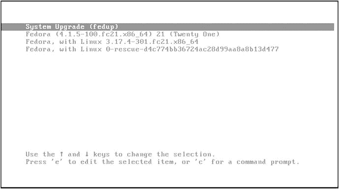

图 5-29。

The boot screen that appears after upgrading (21 to 22)

您应该选择第一个选项(或者什么都不做，等待)继续第二步，这也需要一段时间。如果一切顺利，你现在可以享受你的 Fedora 新版本。您还应该执行一系列命令来进行清理，避免在更新软件包时出现问题:

```sh
$ sudo rpm --rebuilddb
$ sudo dnf distro-sync --setopt=deltarpm=0
$ sudo dnf install rpmconf
$ sudo dnf install rpmconf

```

关于这个过程的更多信息，请访问 Fedora wiki 页面， [`https://fedoraproject.org/wiki/FedUp`](https://fedoraproject.org/wiki/FedUp) 。

## 利弊

以下是我个人认为 Fedora 发行版的利与弊。在这件事上总有讨论的余地，但我已经尽了最大努力做到尽可能客观。

### 赞成的意见

*   Fedora 在易用性和高级功能之间有很好的平衡。
*   默认情况下，这是一个非常安全的发行版。
*   它只使用免费的开源软件。
*   它有一个定期的发布计划，所以你知道什么时候会有新的发布。
*   它使用了最新的技术和创新，并给了 Linux 社区和其他发行版很多回馈。
*   它背后有一个庞大而有才华的社区，这推动了它。
*   红帽在 Fedora 后面，Fedora 是红帽的底座。
*   它使用了一个最扩展的包管理器，rpm。
*   这是一个原始的分配，而不是一个衍生物。
*   有许多面向任务的预定义图像(音乐、游戏等。).
*   它有一个非常好的安装应用程序。
*   它的 DevAssistant 工具与 Docker 和虚拟化工具集成在一起，为软件开发人员提供了一个最好的环境。

### 骗局

*   它在美学方面没有提供太多东西。
*   它没有商业支持。
*   它默认没有专有驱动，所以某些情况下硬件支持不好。
*   缺乏专有的第三方软件。
*   由于前面两点，许多人使用替代的存储库。这带来了安全和不稳定的风险。
*   Gnome 软件管理器是一个错误百出、运行缓慢的应用程序。
*   您必须使用终端来完成许多管理任务。

## 摘要

Fedora 是我为您分析的第二个 Linux 发行版。在本章中，您将看到 Fedora 如何处理某些问题。现在你可以看到两个发行版并不一定是同一个东西。这种对比将在以后的章节中增加，你将会理解为什么会有这么多发行版，为什么知道你需要什么是如此重要。

在下一章中，我将 Debian 发行版放到了显微镜下。