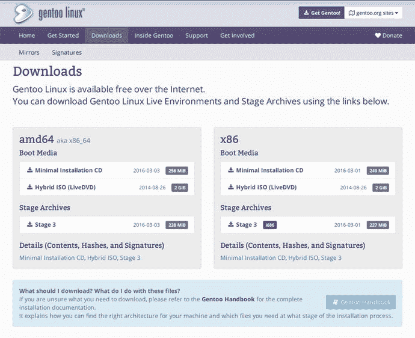
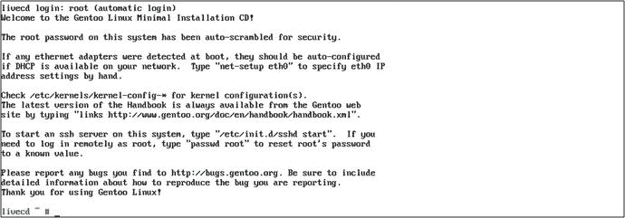
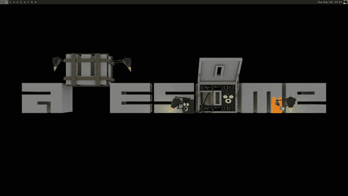

# 十二、Gentoo Linux

Gentoo Linux 是典型的定制 Linux 发行版。事实上，它的适应性如此之强，以至于 Gentoo 人更愿意称之为元分布。和 Arch Linux 一样，Gentoo 可以是您需要的任何东西。它也是一个滚动发布的发行版，但它更进了一步；您可以从源代码构建每个包，并根据您的系统和需求对它们进行优化。它的流行轨迹与 Arch Linux 相反:它曾经是一个非常受欢迎的发行版，但在过去几年里这一趋势有所减弱。然而，它背后仍然有一个强大而忠诚的社区。

## 历史

1999 年 4 月，美国程序员 Daniel Robbins 开始编写 Enoch Linux 发行版。这个想法是通过编译每个针对特定硬件的包来创建一个尽可能快的 Linux 发行版，而不是使用通用的预编译二进制文件。您只需要安装您真正需要/想要的包，所以这也是一个轻量级的通用发行版。

1999 年 5 月，在购买了一台新机器(双赛扬)后，Robbins 发现 Linux 内核无法在其上启动，因此当其他程序员继续维护 Enoch 发行版时，他转而使用 FreeBSD，直到错误被修复。在使用 FreeBSD 几个月之后，他重新开始开发 Enoch，他从两个重要的步骤开始:

*   他把发行版的名字改成了 Gentoo Linux(这个名字是另一个贡献者的建议)。
*   他结合了 FreeBSD 的一些想法来创建 Portage，一个现代的港口系统。

Gentoo Linux 的第一个版本(之前有一个版本叫做 Enoch)于 2002 年 3 月 31 日发布。

发布两年后，Daniel Robbins 作为首席架构师离开了 Gentoo 项目，并将所有的 Gentoo 知识产权转让给了他创建的非营利性的 Gentoo 基金会。Gentoo Linux 项目今天仍然在 Gentoo 基金会的保护下，所以它是一个基于社区的发行版。丹尼尔·罗宾斯现在在 Zenoss 工作，同时还参与了 Funtoo 项目，这是他在 2007 年创建的一个 Gentoo 衍生产品。

Gentoo 的定制化和多功能性的力量以及它所拥有的用户/用途类型的一个证明是，Google 在 2009 年 7 月使用 Gentoo 作为其自己的基于网络的操作系统 Chrome OS 的基础，以配合其云。

Note

Gentoo 的名字是鲍勃·穆奇的一个想法，它与 Linux 的吉祥物有关。如第 [1](01.html) 章所述，Linux 的吉祥物是一只企鹅。巴布亚企鹅是企鹅的一种；它们被认为是最快的水下游泳企鹅，速度可达 22 英里/小时(36 公里/小时)。这个想法是为了传递最快的企鹅和最快的 Linux 发行版之间的联系。

## 哲学

Gentoo 的哲学与 Arch Linux 有一些共同点，但是 Gentoo 采用了一种更激进的方法。一切都可以定制和优化，以适应用户。您可以从源代码编译内核和几乎所有的包，在非常基础的层次上进行定制，比如使用什么编译器选项或者您想要为每个包安装哪些依赖项(如果有的话)。因此，如果在 Arch 中你可以按照自己的意愿构建系统，那么在 Gentoo 中，你几乎可以完全控制发行版的每一个微小方面。最重要的是，Gentoo 还遵循滚动发布模型，所以最新更新的包是可用的。

我们的目标是拥有一个完全定制的 Linux 安装，它根据您的硬件和需求进行了更好的调整和优化。但是就安装(和更新)投入的时间而言，这是一个巨大的成本。如果安装一个 Arch Linux 系统需要几个小时来完成一个巨大的定制安装，那么 Gentoo 可能需要一天多的时间来编译您想要安装的包。因此，Gentoo 用户是非常特别的，他们喜欢完全控制，并准备花时间来实现这一点；这包括系统管理员、开发人员、爱好者以及一般的高级用户。如果我必须用一个词来定义巴布亚哲学，那就是“选择”

两个发行版强加的强大约束在任何发行版的两个关键方面都产生了相似的结果:一个非常友好和乐于助人的社区和高质量的文档。

## 发行版选择标准

现在你已经了解了一些历史，让我们来看看 Gentoo Linux 在第 2 章的选择标准上的表现。

### 目的和环境

显然，Gentoo 实际上是通用发行版的定义。因为您可以出于任何目的用 Gentoo 构建任何您想要的 Linux，所以它也可以用于创建面向任务的安装。因此，这个发行版只有一个版本。实际上，对于两种主要架构(amd64/x86 ),还有另一个版本叫做 Hardened Gentoo，但它本质上是一个相同的版本，已经预先定义了安全措施，以获得一个非常坚固的 Linux 系统。所以我几乎不认为这是一个不同的版本。

### 支持

Gentoo 从它的社区中获得支持，这个社区规模不大，但是他们精通技术并且乐于助人。社区维护着一份详细的高质量文档。也许它不像 Arch Linux 那样涵盖那么多主题，但是它涵盖了更多技术和更深层次的一些主题。支持渠道如下:

*   文档: [`www.gentoo.org/support/documentation/`](http://www.gentoo.org/support/documentation/)
*   Wiki: [`https://wiki.gentoo.org/wiki/Main_Page`](https://wiki.gentoo.org/wiki/Main_Page)
*   论坛: [`https://forums.gentoo.org/`](https://forums.gentoo.org/)
*   邮件列表: [`www.gentoo.org/get-involved/mailing-lists/`](http://www.gentoo.org/get-involved/mailing-lists/)
*   IRC: `#gentoo` at [`irc.freenode.org`](http://irc.freenode.org) 更 at [`www.gentoo.org/get-involved/irc-channels/`](http://www.gentoo.org/get-involved/irc-channels/)

### 用户友好性

这不是一个用户友好的发行版，不仅因为你需要自己完成所有的工作，没有工具来帮助你，还因为你需要编译软件包，这需要更多的知识。幸运的是，有优秀的文档指导您。另一个不友好的方面是只编译一个大的软件包(例如 OpenOffice、Mozilla Firefox 或桌面环境)所花费的时间；这可能是发行版受欢迎程度下降的主要原因。

一些没有经验的用户仍然被这个发行版所吸引，因为它是最好的初级 Linux 学习工具之一；该文档也很好地覆盖了 Linux 基础知识。除此之外，我不会向初学者推荐这个发行版，尤其是新手，因为编译过程是用来批评 Linux 的要点之一(这是不公平的，因为现在在更传统的发行版中你很少这样做)。但是如果你想真正了解一个操作系统是如何在底层工作的，Gentoo 肯定是我的推荐之一。

### 稳定性

和 Arch Linux 一样，Gentoo 本质上是不稳定的，因为它是一个滚动发行版。和 Arch 一样，你可以选择你的鲁莽程度；您可以从三个级别选择包的稳定性:

*   稳定:没有问题、安全或其他问题的稳定软件包。
*   关键字屏蔽:包仍然没有得到充分的测试。
*   硬屏蔽:它已经打破或非常不安全的包。

稳定的软件包可能有点过时(但仍然比经典发行版更新鲜)，但系统是相当稳定的。如果你遵循类似于第 11 章中概述的策略，你可以得到一个非常稳定的系统，一个滚动发布的发行版。此外，与 Arch Linux 相反，您可以非常有选择性地选择想要更新的包，而不会危及发行版的稳定性(在 Arch 中，不建议这样做)。此外，您可以选择单个包的稳定性，例如为核心系统设置稳定的包，为开发人员工具测试稳定的包。通过非常严格和一丝不苟地坚持这一实践，你可以实现一个非常健壮的系统，一个可以像 Debian stable 一样稳定的系统。毕竟，Gentoo 是您希望它成为的任何东西。

### 硬件支持

Gentoo 的硬件支持依赖于 Portage 树和覆盖层上可用的内核、固件和驱动程序。和这个发行版的其他方面一样，这个主题很大程度上依赖于用户及其学习能力或意愿。

### 美学

Gentoo 遵循构建适合您的独特安装的理念。它没有强加任何特定的审美。这里或那里只应用了一些品牌补丁，但它们大多是附带的(并且您必须使用该选项编译软件包)。

### 桌面环境

在这个发行版中几乎没有预定义的东西，这延伸到了桌面环境。你可以决定你想安装什么。您可以安装各种各样的桌面环境(Gnome、KDE、Unity、Mate、Cinnamon、Pantheon、LXDE、LXQt、Budgie 和 Xfce)。同样，如果你更喜欢一个窗口管理器，你也可以从多种软件中选择(Awesome、Xmonad、Dwm、i3、Openbox、Sawfish、Fluxbox、Enlightenment、Ratpoison、FVWM 和 Wm2)。与 Arch Linux 一样，您甚至可以决定是使用传统的 X.org 窗口服务器还是新的 Wayland，或者如果您只想使用命令行，就什么都不用。

### 初始化系统

Gentoo 是少数几个仍然没有将 systemd 实现为其 init 系统的发行版之一，而且将来也不打算这样做。Gentoo 使用 OpenRC，一个基于 BSD 的 init 系统。但是你可以选择安装和使用 systemd，例如，如果你想使用 Gnome 3，但是同样，这是你的选择。

### 包装管理系统

Gentoo 使用自己的包管理系统 Portage。Portage 基于 Robbins 在 FreeBSD 的经验；它基于它的 ports 系统，用 Python 编写。Portage 是 Gentoo 的灵魂，它定义了发行版。Portage 管理软件包的方式不同于传统的 Linux 软件包管理器。它不从存储库中获取二进制文件；它从源代码编译包。即使你也可以编译其他发行版中的包，或者其他一些发行版如 Arch Linux 有自己的基于端口的系统如 ABS，在 Portage 中标准是编译所有的包。

Portage 有一个 ebuilds (shell 脚本)的集合(通常称为 Portage tree ), ebuilds 是定义如何构建每个包的方法。为了解决这个问题，还有一个叫做 emerge 的工具，它可以作为 Portage 的接口。还有一个本地 ebuilds 集合，你可以把它看作是一种可以与主存储库同步的本地存储库，Portage 树，emerge 是管理这个本地存储库的工具。对此半信半疑；这里就不赘述了。我只是想让你大致了解一下它是如何工作的。

有一些 Portage 的 GUI 界面可以用来代替 emerge，比如 paradol 和 Himerge，但是通常选择 Gentoo 作为发行版的人更倾向于使用命令行工具。

Portage/emerge 是一个非常强大的工具，它允许您完全控制软件包和您的系统。您可以通过配置文件和“CFLAGS and USE flags”配置全局设置来编译所有的包您也可以通过软件包或临时设置来设置单独的设置。

编译包而不是使用预编译的二进制文件有一些不便，例如:

*   这是一个非常缓慢的过程:当使用设置`MAKEOPTS="-j2"`(两个同时执行的任务，一个内核)时，像 Chromium 这样的简单包花了我大约三个小时来编译，而使用英特尔 i7 处理器的`MAKEOPTS="-j5"`(五个任务，四个内核)大约一个小时。所以，想象一下，像默认安装 Fedora 或者 Ubuntu 一样，构建一个完整的系统。当然，你可以使用一些预编译的包(你可以使用`# eix *-bin`找到它们)；目前有 94 个包)，这将有所帮助，但仍然需要很长时间。然而，随着时间的推移，计算机速度越来越快，而封装尺寸的增长速度越来越慢，这个因素变得越来越不令人讨厌。
*   包构建可能会失败:有时甚至在更改编译选项后也不容易修复。在极少数情况下，这甚至是不可能的，只有上游的变化才能修复它。

但是它也有一些优点，例如以下(以及其他):

*   您可以选择依赖项/组件:例如，您可以选择删除对桌面环境 KDE/Qt 的支持，而只在支持两者的包中支持 Gnome/GTK。或者您可以删除支持它的工具的图形界面和服务器中的命令行。
*   您可以为您的硬件编译软件包:例如，这可以让您在过时的体系结构中构建更新的 Linux 系统，这些体系结构只受其他发行版的支持或者根本不受支持(例如 PowerPC)。它也非常适合利用计算/多媒体包。
*   您可以选择版本并维护各种版本:您可以从可用的版本中手动选择软件包的版本，甚至可以在具有插槽功能的同一系统中安装各种版本。在虚拟机和容器到来之前，这曾经是开发者的一大优势。
*   您可以更新一个无人维护的系统:您可以轻松地恢复一个很长时间没有更新的 Gentoo 系统。一如既往，不是立竿见影；这需要时间和精力，但是你不能在大多数发行版中做到这一点(即使是在 Debian 不稳定或 Arch Linux 中，这可能是非常痛苦的，这是我亲身经历的)，而且如果没有全新的安装，这可能是不可能的。

除了 Portage 主存储库，Gentoo 还支持覆盖，这是一种创建额外 ebuilds 存储库的方法，大致相当于 Arch 的 AUR(或 Ubuntu 的 PPAs)。有官方和非官方的覆盖；后者由社区支持和维护。有一些工具可以管理叠加，如外行、eix 和 emaint。目前 Gentoo 只在 Portage 树中保存了大约 19，000 个包，其余的包通常是从这些覆盖图中获得的。

几年前，性能的提高是编译所有适合你的硬件的包的优势，但是现在与二进制包发行版相比，性能上的差别并没有那么大，也不能弥补编译所花费的时间。只有当你需要一个特别调优的系统来完成特定的任务时，你才有理由在性能方面选择 Gentoo 而不是其他发行版。简而言之，性能不再是用户选择 Gentoo 作为他们发行版的原因，即使他们说是。

### 体系结构

Gentoo 支持广泛的硬件架构。它涵盖了常见的英特尔/AMD 32 位和 64 位选项，以及 Alpha、ARM、Sparc、PowerPC、安腾和 PA-RISC。另外三种仅作为实验性的支持:MIPS、S390 和 Super H。

### 安全性/匿名性

在这样的发行版中，这完全取决于你如何管理安全性和匿名性。然而，众所周知，Gentoo 非常重视这个话题。从一开始，用 Portage/emerge 编译的包在被合并到实际系统之前，就被可选地构建并安装在沙箱(隔离的)环境中。此外，稳定的软件包没有已知的安全缺陷，而且 Gentoo 包含了检查系统中不安全软件包的工具。

此外，二进制文件或内核可以根据您的硬件和喜好进行大量定制，这使得特定的软件包漏洞不太可能像在其他发行版中那样影响您。

有一个完整的项目可以帮助您强化您的 Gentoo 系统:强化的 Gentoo 项目。它在安全领域享有盛誉。您可以使用它来强化您的 Gentoo 系统，并获得一个非常安全的系统，甚至可以达到偏执的程度。可以在[`https://wiki.gentoo.org/wiki/Hardened_Gentoo`](https://wiki.gentoo.org/wiki/Hardened_Gentoo)[`https://wiki.gentoo.org/wiki/Project:Hardened`](https://wiki.gentoo.org/wiki/Project:Hardened)看到。

### 原则和道德

就原则和道德而言，Gentoo 是一个非常实用的发行版。它不强加任何特定的愿景；你选择你的方式来解决这些问题。但是你可以通过将 Portage 中的一个选项改为`ACCEPT_LICENSE="@FREE".`来轻松设置系统只安装免费软件

### 现场 CD

Gentoo 提供了一个 LiveDVD，它称之为 Hybrid ISO(在安装部分有更多的介绍)。显然，在这种情况下(与其他发行版不同)，这只是对您可以构建什么的概念证明，而不是您在安装过程结束时会得到什么(没有两个 Gentoo 安装是相同的)。还有，这张 DVD 是零星发行的；最后一个可用的是 2014 年 8 月的。

Note

Gentoo 也称他们的最小 ISO 映像为实时媒体。这是真的；这是一个实时的 Linux 系统，但不是我在本书中使用的那种。

### 专业认证

这种分配没有专业认证。

## 装置

Gentoo 哲学，通过选择来总结，是您从尝试安装 Gentoo 的第一瞬间就能感受到的东西。与其他发行版不同的是，你可以从它的最小安装 ISO 或者从它的 LiveDVD 开始安装 Gentoo，也可以从另一个 LiveCD/DVD，一个 netboot 镜像，另一个已经安装的发行版等等。基本上，您可以从几乎任何基本的最小 Linux 环境中安装 Gentoo。你可以在 Slackware 等其他发行版上做类似的事情，但是 Gentoo 从一开始就没有强加任何东西。

我不可能在这里涵盖所有可能的场景，尤其是像这样的发行版，所以我强烈建议在 [`https://wiki.gentoo.org/wiki/Handbook:Main_Page`](https://wiki.gentoo.org/wiki/Handbook:Main_Page) 看一看 Gentoo 手册。此外，我不打算花太多时间讨论我在第 [11](11.html) 章中提到的关于 Arch Linux 的主题，因为我想把重点放在特定于 Gentoo 安装的主题上。

我将使用 Gentoo 在其网站上提供的最小安装 CD，因为我认为这是大多数用户的选择，尽管他们中的许多人更喜欢使用 LiveCD，为他们提供一个像 Ubuntu one 这样的动态桌面环境，以准备安装，并使用 Gparted 这样的图形工具来进行分区。

和往常一样，首先进入 Gentoo 网站的下载页面 [`www.gentoo.org/downloads/`](http://www.gentoo.org/downloads/) 。你可以在图 [12-1](#Fig1) 中看到它目前的样子。注意这些图像是如何按照建筑来组织的；在每个体系结构中，您都有“引导介质”(ISO 映像)和“阶段归档”(稍后将详细介绍)。在页面底部(图中未显示)，您还可以选择其他体系结构或顶部已显示的体系结构的高级选项。其中一些选项包括“强化阶段 3”(仅适用于 amd64 和 x86)，您可以使用它来获得一个先前安全的环境，从而获得一个非常安全的 Gentoo 系统。在这种情况下，请下载 amd64 架构的最小安装光盘。这些最小安装 iso 每周发布一次，所以它们总是在更新。



图 12-1。

The Gentoo Linux downloads page

下载完成后，您必须从 ISO 引导您的系统。你看到的第一个屏幕(如图 [12-2](#Fig2) 所示)比你在本书前面的其他发行版中看到的更粗糙。如果你在 15 秒内没有按下任何键，它会尝试从你的硬盘启动。所以如果你想继续，按回车键，或者像在其他发行版中一样，你可以选择用 F1(内核)和 F2(选项)键来改变默认值。所以按回车键继续。


图 12-2。

The ISOLINUX boot loader of Gentoo's Minimal Installation CD

系统将开始启动，但过一会儿它会停下来询问你的键盘布局，如图 [12-3](#Fig3) 所示。在它自动选择默认布局之前，您只有几秒钟的时间来介绍您的布局或按回车键(如果您打算使用默认布局)。


图 12-3。

Keyboard layout configuration

那就继续。您最终会看到一个命令行提示符(就像在 Arch Linux 安装中一样)；见图 [12-4](#Fig4) 。



图 12-4。

The prompt of Gentoo's Minimal Installation CD

这是所有工作开始的地方。默认情况下，如果检测到您的网卡并且您有 DHCP 服务器，它应该已经设置了您的以太网连接。如果没有，请按照说明或者看一下 Gentoo 手册。通过文本浏览器链接打开手册(最好在另一个控制台中打开)。您可以通过 ping 到`gentoo.org`来检查连接，或者通过链接打开站点(记得用“q”键退出)。

```sh
# ping gentoo.org
# links gentoo.org

```

第一步是准备磁盘。在我的例子中，我将在一个有 2TB 磁盘的 BIOS 系统中安装发行版，所以我将使用 MBR 分区表(我可以使用 GPT，但是这个选项在某些情况下可能会导致一些问题)。在 Arch Linux 示例中，它首先显示了有多少设备以及它们是如何分区的。

```sh
# lsblk --paths
NAME            MAJ:MIN RM   SIZE RO TYPE MOUNTPOINT
/dev/sda          8:0    0     2T  0 disk
/dev/sr0         11:0    1   256M  0 rom  /mnt/cdrom
/dev/loop0        7:0    0 224.5M  1 loop /mnt/livecd
# parted /dev/sda
GNU Parted 3.2
Using /dev/sda
Welcome to GNU Parted! Type 'help' to view a list of commands.
(parted) u GiB
(parted) p
Error: /dev/sda: unrecognised disk label
Model: ATA QEMU HARDISK (scsi)
Disk /dev/sda: 2048GiB
Sector size (logical/physical): 512B/512B
Partition Table: Unknow
Disk Flags:

```

它显示的是一个没有任何分区或分区表的磁盘。让我们使用`parted`在磁盘中创建分区。使用一个非常简单的分区方案，只有根分区和`/home`分区，都是 ext4。

```sh
# parted /dev/sda
GNU Parted 3.2
Using /dev/sda
Welcome to GNU Parted! Type 'help' to view a list of commands.
(parted) u GiB
(parted) mklabel msdos
(parted) mkpart primary ext4 1MiB 50.5GiB
(parted) set 1 boot on
(parted) mkpart primary ext4 50.5GiB 100%
(parted) q
# lsblk --paths
NAME            MAJ:MIN RM   SIZE RO TYPE MOUNTPOINT
/dev/sda          8:0    0     2T  0 disk
├─/dev/sda1         8:2    0    50G  0 part
└─/dev/sda2         8:3    0     2T  0 part
/dev/sr0         11:0    1   256M  0 rom  /mnt/cdrom
/dev/loop0        7:0    0 224.5M  1 loop /mnt/livecd

```

现在格式化分区并挂载它们。

```sh
# mkfs.ext4 /dev/sda1
# mkfs.ext4 /dev/sda2
# mount /dev/sda1 /mnt/gentoo
# mkdir -p /mnt/gentoo/home
# mount /dev/sda2 /mnt/gentoo/home

```

Note

考虑到最小安装 CD，您只有制作 ext2、ext3 和 ext4 文件系统的工具。如果您想使用另一个文件系统，比如 btrfs，那么您应该使用另一种介质来安装它。

最后你有了一个硬盘分区方案，如图 [12-5](#Fig5) 所示。


图 12-5。

The disk partitioning scheme

接下来，检查日期，并在必要时进行更正。注意语法很讲究:MMDDhhmmYYYY。这代表月、日、小时、分钟和年。

```sh
# date

```

下一步是完全排除 Gentoo 的第一步。您将下载并安装您在 Gentoo 下载页面上看到的 Stage 3 tarball。阶段 3 是一个归档文件，包含一个最小的 Gentoo 环境，用于继续安装。这个过程的结果几乎类似于 Arch Linux 安装中的`pacstrap`脚本执行。下载阶段 3 文件的最佳方式是使用链接浏览器转到下载镜像，选择离您最近的一个，然后下载文件。你可以使用另一个工具，比如`wget`或者`curl`，但是你应该知道完整的 URL(并且写下来)。习惯了这种方式将会更容易适应 Gentoo 网站未来的变化。一旦你选择了一个镜像并打开它，你应该寻找`releases/amd64/autobuilds/`目录。在那里，寻找 amd64(或您的架构)的当前阶段 3 文件，并通过按“d”下载它。它应该是一个压缩的 tarball 文件(扩展名为`.tar.bz2`)，如图 [12-6](#Fig6) 所示。那里还有其他第三阶段的文件，但你并不关心它们。以后，如果你喜欢上了 Gentoo，你肯定会了解他们的。


图 12-6。

The directory for the stage 3 tarball file in a Gentoo mirror

```sh
# cd /mnt/gentoo

# links https://www.gentoo.org/downloads/mirrors/

```

下载完文件后，您需要在硬盘中提取并解压缩该文件(请记住，现在您位于`/mnt/gentoo`目录中，该目录实际上是`/dev/sda1`，您未来的根分区)。

```sh
# tar xvjpf stage3-*.tar.bz2 --xattrs

```

这需要一点时间，在我的机器里大概一分钟。接下来，您需要更改位于`/etc/portage/make.conf`的编译选项配置文件中的一些内容。您可以在这里更改一些东西来优化编译，但是让我们只更改两件事:第`CFLAGS`行和一个新的变量`MAKEOPTS`(参见下面的代码)。我为最后一个变量选择了值 7，因为我创建了一个具有六个内核的虚拟机，我想使用它们来加速编译。如果我保留默认值 2，我会花很多时间等待。为此，您可以使用以下文本编辑器之一:`nano`、`vi`和`Emacs`。

```sh
# vi /mnt/gentoo/etc/portage/make.conf
# cat /mnt/gentoo/etc/portage/make.conf
# These settings were set by the catalyst build script that automatically
# built this stage.
# Please consult /usr/share/portage/config/make.conf.example for a more
# detailed example.
CFLAGS="-march=native -O2 -pipe"
CXXFLAGS="${CFLAGS}"
# WARNING: Changing your CHOST is not something that should be done lightly.
# Please consult http://www.gentoo.org/doc/en/change-chost.xml before changing.
CHOST="x86_64-pc-linux-gnu"
# These are the USE flags that were used in addition to what is provided by the
# profile used for building.
USE="bindist mmx sse sse2"
PORTDIR="/usr/portage"
DISTDIR="${PORTDIR}/distfiles"
PKGDIR="${PORTDIR}/packages"
MAKEOPTS="-j7"

```

现在是开始安装基础系统的时候了。第一件事是指出您想要用来下载源代码的镜像。如果镜子快就更好了，通常这意味着离你最近的那个。这是用`make.conf`文件中的一个变量设置的，但是有一个工具允许你从一个列表中选择它们(我建议两个或更多)并将它们添加到文件中，而不是手动选择它们。接下来，将主要的 Gentoo 存储库配置文件复制到它的目的地，并复制 DNS 信息，以便在重新启动系统时保持 Internet 连接。

```sh
# mirrorselect -i -o >> /mnt/gentoo/etc/portage/make.conf
# mkdir /mnt/gentoo/etc/portage/repos.conf
# cp /mnt/gentoo/usr/share/portage/config/repos.conf /mnt/gentoo/etc/portage/repos.conf/gentoo.conf
# cp -L /etc/resolv.conf /mnt/gentoo/etc/

```

您还必须挂载某些必要的文件系统，以便在新环境中继续正常工作(一会儿您将被关进监狱)。

```sh
# mount -t proc proc /mnt/gentoo/proc
# mount --rbind /sys /mnt/gentoo/sys
# mount --make-rslave /mnt/gentoo/sys
# mount --rbind /dev /mnt/gentoo/dev
# mount --make-rslave /mnt/gentoo/dev

```

让我们以一个监狱根(chroot)进入新的环境。那么所有的命令都将应用于以硬盘为基础设置的环境，而不是实时环境。最后一行是一个很好的提示，提醒您处于 chroot 环境中。

```sh
# chroot /mnt/gentoo /bin/bash
# source /etc/profile
# export PS1="(chroot) $PS1"

```

接下来，配置 Portage。首先，获取当前 Portage 树的快照，然后将最新更新的版本与新的本地树同步。忽略关于`/usr/portage`位置的错误和关于新闻的警告(这是一个非常好的特性，我建议您在文档中查看它)。

```sh
# emerge-webrsync
# emerge --sync --quiet

```

您现在应该已经选择了一个概要文件，这个概要文件应该为将来的包的编译定义全局设置。因为我想向您展示类似于 Arch Linux 安装的东西，所以在这种情况下，正确的选择是选择“desktop”概要文件。

```sh
# eselect profile list
Available profile symlink targets:
  [1]   default/linux/amd64/13.0 *
  [2]   default/linux/amd64/13.0/selinux
  [3]   default/linux/amd64/13.0/desktop
  [4]   default/linux/amd64/13.0/desktop/gnome
  [5]   default/linux/amd64/13.0/desktop/gnome/systemd
  [6]   default/linux/amd64/13.0/desktop/kde
  [7]   default/linux/amd64/13.0/desktop/kde/systemd
  [8]   default/linux/amd64/13.0/desktop/plasma
  [9]   default/linux/amd64/13.0/desktop/plasma/systemd
  [10]  default/linux/amd64/13.0/developer
  [11]  default/linux/amd64/13.0/no-multilib
  [12]  default/linux/amd64/13.0/systemd
  [13]  default/linux/amd64/13.0/X32
...
# eselect profile set 3

```

接下来，您可以/应该配置`USE`变量来设置编译包的全局选项。这是重要的一步，但在这种情况下，您将使用默认设置。我建议您熟悉 Gentoo，并在处理这个问题之前仔细阅读文档。

让我们采取另一个步骤，所有发行版中的传统步骤:设置时区、语言和本地值。第一个命令将显示存储时区文件的目录树；然后，您必须设置一个并自动更新日期。接下来，编辑`locale.gen`文件(在这个环境中，您只有 nano 来编辑文件)并取消您想要使用的语言的注释(在本例中是`enUS.UTF-8 UTF-8`)。最后，再次使用`eselect`来选择系统范围的语言并重新加载环境。

```sh
# ls /usr/share/zoneinfo

# echo "America/New_York" > /etc/timezone
# emerge --config sys-libs/timezone-data
# nano -w /etc/locale.gen
# locale-gen
# eselect locale list
Available targets for the LANG variable:
  [1] C
  [2] POSIX
  [3] en_US.utf8
  [ ] (free form)
# eselect locale set 3
# env-update
# source /etc/profile
# export PS1="(chroot) $PS1"

```

现在是 Linux 新手中最艰巨的任务的时候了，这是许多谣言和神话的素材:安装和配置 Linux 内核。抱歉，但你必须这么做，所以让我们尽可能用最不痛苦的方式来做:自动地。我向你保证，这并不可怕，但我明白你可能需要一些经验来获得信心。首先，你需要安装它。

```sh
# emerge --ask sys-kernel/gentoo-sources

```

这需要一段时间，在我的系统上大约三分钟。要配置内核，您将使用一个名为`genkernel`的工具来自动完成。首先，您需要安装工具。

```sh
# emerge --ask sys-kernel/genkernel

```

现在您需要编辑`/etc/fstab`文件并注释`/boot`和交换行，因为您没有创建那些分区；您还需要为`/home`分区创建一个新行。

```sh
# nano -w /etc/fstab
# cat /etc/fstab
# /etc/fstab: static file system information.
#
# noatime turns off atimes for increased performance (atimes normally aren't
# needed); notail increases performance of ReiserFS (at the expense of storage
# efficiency). It's safe to drop the noatime options if you want and to
# switch between notail / tail freely.
#
# The root filesystem should have a pass number of either 0 or 1.
# All other filesystems should have a pass number of 0 or greater than 1.
#
# See the manpage fstab(5) for more information.
#

# <fs>          <mountpoint>    <type>      <opts>      <dump/pass>

# NOTE: If your BOOT partition is ReiserFS, add the notail option to opts.
#/dev/BOOT      /boot       ext2        noauto,noatime  1 2
/dev/sda1       /           ext4        noatime     0 1
/dev/sda2       /home       ext4        noatime     0 2
#/dev/SWAP      none        swap        sw      0 0
/dev/cdrom      /mnt/cdrom  auto        noauto,ro   0 0
#/dev/fd0       /mnt/floppy auto        noauto      0 0

```

接下来，用 genkernel 自动配置内核。

```sh
# genkernel all

```

这需要一段时间，在我的系统上大约需要 17 分钟。这是第一个速度不快的编译，向您展示了编译几乎所有东西需要什么。接下来，通过`/etc/conf.d/modules`配置需要自动启动的模块。在这种情况下，我们假设您不需要任何额外的模块。但我建议你安装固件，因为你永远不知道，有些驱动程序需要它(特别是在笔记本电脑)。

```sh
# emerge --ask sys-kernel/linux-firmware

```

继续配置系统。让我们现在设置网络。第一步是将默认主机名“hostname”更改为您想要的主机名。之后，将互联网配置为使用 DHCP，并使其成为启动时启动的网络。

```sh
# nano -w /etc/conf.d/hostname
# cat /etc/conf.d/hostname
# Set the hostname variable to the selected host name
hostname="does_pc"
# emerge --ask --noreplace net-misc/netifrc
# nano -w /etc/conf.d/net
# cat /etc/conf.d/net
config_eth0="dhcp"
# cd /etc/init.d
# ln -s net.lo net.eth0
# rc-update add net.eth0 default

```

您必须为 root 用户设置密码。请记住使用强密码，尤其是对于该用户。

```sh
# passwd

```

如果您的键盘布局不同于默认的 ANSI US，并且您在从最小安装映像启动时选择了“其他”,那么您现在应该配置键盘布局，以避免在重新启动系统时出现问题(例如，无法根据您使用的字符重新创建密码)。为此，您必须编辑`/etc/conf.d/keymaps`文件。

```sh
# nano -w /etc/conf.d/keymaps

```

让我们安装一些系统所需的工具。让我们从记录系统中发生的事情的日志工具开始，然后是 cron 工具、文件索引工具、一些文件系统工具和 DHCP 客户机。在这里，你使用经典或最简单的工具来完成每项任务，而不一定是最好的。

```sh
# emerge --ask app-admin/sysklogd
# emerge --ask app-admin/logrotate
# rc-update add sysklogd default
# emerge --ask sys-process/cronie
# rc-update add cronie default
# emerge --ask sys-apps/mlocate
# emerge --ask sys-fs/e2fsprogs
# emerge --ask net-misc/dhcpcd

```

您即将第一次启动新的 Gentoo 系统。首先，您需要安装和配置一个引导程序，在您的例子中是 Grub2。准备再等等；这将需要一段时间来编译(在我的系统上大约 10 分钟)。

```sh
# emerge --ask sys-boot/grub:2

# grub2-install /dev/sda
# grub2-mkconfig -o /boot/grub/grub.cfg

```

最后，退出并重启系统。交叉手指！

```sh
# exit
# cd
# umount -l /mnt/gentoo/dev{/shm,/pts,}
# umount /mnt/gentoo{/boot,/sys,/proc,}
# reboot

```

瞧啊。您第一次启动了全新的 Gentoo Linux 系统！在它完成启动后，你应该会发现一个如图 [12-7](#Fig7) 所示的屏幕。


图 12-7。

The first boot up of your brand new Gentoo system

所有这些工作，你最终在一个简单的命令提示符了！好吧，从现在开始就看你的了；你可以建造你想要的东西。您先前选择的概要文件和每个包的依赖项将会“花费您的时间”我给你举个例子:在我的新系统中，我没有安装我在最小安装环境中安装的工具，比如 emacs、vi 或 links。我想有链接，以便能够从终端访问文档，以防出错。这个包依赖于 X windows 服务器的某些组件。安装一个文本模式浏览器花了 20 分钟。计算一下:从源代码安装 Gnome 或 KDE 需要多长时间？另一方面，您只需安装这些依赖项一次。

但是首先您必须创建一个新用户。为此，您需要使用 root 帐户登录，然后添加它。将用户添加到滚轮组(使用`su`和`sudo`)和`audio`。

```sh
# useradd -m -G users, wheel,audio -s /bin/bash johndoe
# passwd johndoe

```

现在，您可以安全地从系统中删除 stage3 tarball 文件。

```sh
# rm /stage3-*.tar.bz2*

```

从这里开始，事情变得稍微复杂一些，并且它们严重依赖于您的特定硬件。如果你想要一个类似于我们在 Arch Linux 中设置的场景，第一步是为 X.org 安装一个视频驱动。但这就是事情变得混乱的地方，因为根据你的显卡，emerge 会告诉你需要向 use 变量添加一些选项，而这些选项并不总是相同的。因此，您应该在`/etc/portage/make.conf`文件中添加这些变量，并添加一对新的变量来定义输入设备和视频卡。在这种情况下，让我们假设你有一张英特尔卡:`INPUT_DEVICES="evdev synaptics"`和`VIDEO_CARDS="intel"`。而且越来越好；在这之后，你可能需要重新编译你的内核，并(等待它)更新你的整个系统，因为使用变量的变化(这可能需要一段时间！).最后，安装 X.org 服务器。作为一份粗略的简历，

```sh
# emerge --ask x11-drivers/xf86-video-intel

# genkernel all
# emerge --ask x11-base/xorg-server

```

接下来，让我们安装一个显示管理器。在这种情况下，尽管它已经过时了，我还是选择了 Slim，因为它很轻便，编译起来花费的时间更少。接下来，让我们安装一个平铺窗口管理器，真棒 WM。但是不要忘记，您还必须配置它们；为此，请查看文档。然后你应该初始化你的显示管理器，得到一个登录屏幕(图 [12-8](#Fig8) )，最后登录得到窗口管理器(图 [12-9](#Fig9) )。



图 12-9。

The Awesome WM window manager in Gentoo


图 12-8。

The Gentoo Slim login manager

```sh
# emerge --ask x11-misc/slim
# vi /etc/conf.d/xdm
# cat /etc/conf.d/xdm
DISPLAYMANAGER="slim"
# rc-update add xdm default
# emerge --ask x11-wm/awesome
$ mkdir -p ∼/.config/awesome/
$ cp /etc/xdg/awesome/rc.lua ∼/.config/awesome/rc.lua
# emerge --ask xterm
# emerge --ask feh
# /etc/init.d/xdm start

```

要得到一个合理的系统还有很多事情要做，所以要做好日常工作的准备。以这种速度，我至少需要另一章来涵盖所有这些。

如果你第一次失败了，没有得到一个工作的 Gentoo 系统，也不用担心；很正常。有很多事情要考虑；像打字错误这样简单的事情可能会使系统无法启动。这基本上是几年前 Linux 在几乎每个发行版中的安装方式，也是如此多关于 Linux 苛刻的谣言和神话的起源。如果你读了前面的章节，你已经知道以这种方式安装 Linux 和安装一个像 Ubuntu 这样的用户友好的发行版有很大的不同。但是我相信你也已经意识到，你可以从像 Gentoo 或 Arch 这样的高级发行版中得到的控制和定制水平与你从像 elementary OS 这样的发行版中得到的相差甚远。

## 保持

在 Gentoo 中，所有必要的维护都是通过 Portage/emerge 工具完成的。作为一个滚动版本，你可以保持它永久更新。基本上你不需要用传统的方式升级。

### 更新和管理应用程序

尽管我将向您展示执行这些任务的简单方法，但是请注意 Portage 是一个非常强大的工具。它让你完全控制如何编译和安装每个包。还有其他方法可以做到这一点，只是命令略有不同。如果你想使用这个发行版，你需要通过 Gentoo 的文档来熟悉这个工具。正如你已经知道的，要管理 Portage，你需要使用 emerge 工具和很大的耐心。

使用 emerge 安装应用程序可以像这样简单:

```sh
# emerge firefox

```

但通常情况下，最好先搜索应用程序，然后按照以下方式安装:

```sh
# emerge --search firefox
# emerge --ask www-client/firefox-bin

```

如果您想删除软件包:

```sh
# emerge --unmerge firefox

```

要更新你的系统，也很简单。首先，同步运输树。然后，启动自动更新。

```sh
# emerge --sync
# emerge --uD world

```

我提到过，你可以用类似于舷窗的图形工具来完成所有这些，但是通常那些愿意从命令行安装这个发行版的人是最不愿意在以后使用图形工具来维护它的。选择 Gentoo 的用户通常追求完全控制和细粒度设置。舷窗是一个非常好的工具，但它无法与 emerge 竞争。

### 升级

和 Arch Linux 一样，升级 Gentoo 对传统发行版来说有着完全不同的意义。尽管软件包总是在更新，但发行版的核心迟早会有变化。Arch 有一种特殊的方法来实现这一点:当做出一个更改时，它会被宣布，并给出关于必须做出的更改的说明(通常是手工操作)。这种方式有很大的不便，因为如果您让系统长时间无人管理，如果不进行全新安装，重新构建这些更改可能会非常痛苦，甚至是不可能的。换句话说，Arch Linux 不等人。如果你想更新它，你必须保持速度。

但是 Gentoo 非常擅长这个。它以一种聪明的方式解决了这个问题，让你可以按照自己的节奏顺利地进行“升级”。完成这项工作的工具是“概要文件”，如果您还记得“安装”一节中的话，它也用于确定您想要以某种方式构建的系统的类型。另外，请记住，新的 Gentoo 版本每周发布一次，其中一些版本会带来新的概要文件。当一个新的版本带有一个新的概要文件时，您可以选择迁移到新的概要文件或者只执行包更新。但不要误会我的意思；这些迁移可能很容易，也可能是一项艰巨的工作。您可以安全地忽略一个配置文件迁移，在它被否决后，执行该任务。这不是一个完美的解决方案，但至少是一个解决方案。你可以让一个系统长时间无人管理，然后通过耐心、时间、奉献和关心，你可以得到一个更新的系统，而不必进行全新的安装。建议你看看文档，对这个有个完整的了解(这是个小谎言；你永远不会真正理解这些事情，直到你亲自去做。

## 利弊

下面的列表是我个人认为 Gentoo Linux 发行版的优点和缺点。这件事总有讨论的余地，但我已经尽可能客观了。

### 赞成的意见

*   这是一个滚动发布的发行版，所以它总是处于最前沿。
*   它有很棒的文档。
*   它有一个很好的、有用的高级用户社区。
*   您可以编译针对您的硬件和需求优化的包。
*   它完全可定制，提供惊人的灵活性和全面控制。
*   它有一个令人震惊的软件包管理器，Portage。
*   它非常注重安全性。虽然这取决于你，但你有工具和文档。
*   这是一个原始的分配，而不是一个衍生物。
*   它支持多种架构，甚至是过时的架构。
*   如果你坚持使用这个发行版，你会学到很多关于 Linux 的东西。

### 骗局

*   编译几乎所有的包可能是浪费时间。
*   由于现代硬件，性能增益可以忽略不计(也有例外)。
*   它不是用户友好的。这是所有发行版中要求最高的一个。
*   维护它需要时间和奉献。
*   它没有商业支持。
*   它不注重审美。
*   本质上是不稳定的(除非你学得足够多，有很多空闲时间)。

## 摘要

这里你看到了一个允许最大程度定制的发行版。要走得更远，你只能再走一步:构建你自己的发行版。Gentoo 是一个面向高级的、有耐心的、非常细心的用户的发行版。这是一个例子，说明 Linux 可以以必要的知识为代价为用户提供自由和力量。

在下一章中，你将会看到一个历史悠久的发行版:Slackware。它以苛刻和不切实际而闻名，但它和 Gentoo 有一些共同点。