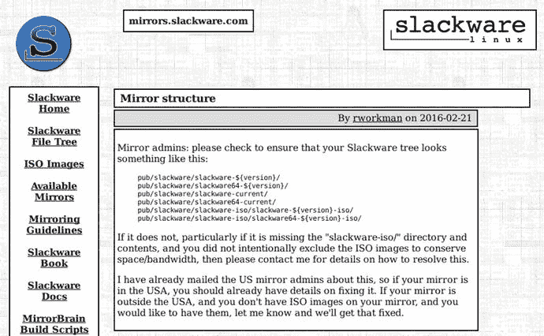
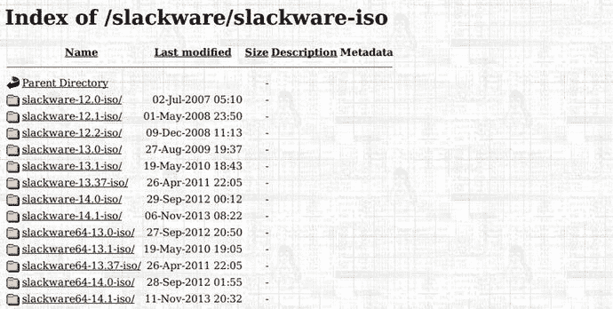
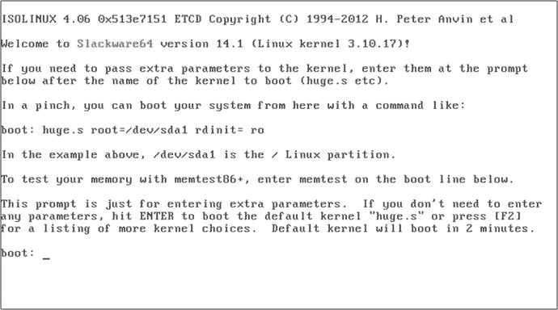

# 13.斯拉克语

Slackware 是现存的最古老的发行版。它比 Debian 早几个月诞生，看着两者的演变，这似乎很难相信。很多人认为 Debian 太保守了；这些人会称 Slackware 为恐龙。是的，Slackware 这些年来没有太大的变化，但是 Slackware 社区非但没有感到羞耻，反而为此感到自豪。Slackware 号称是最“像 Unix”的 Linux 发行版。

## 历史

Slackware 和 Debian 不仅仅分享了作为 Linux 发行版的悠久历史；它们还有一个共同的起源:SLS(软着陆 Linux 系统)发行版。虽然 Debian 是作为 SLS 的一个更好的替代品而创建的，但是 Slackware 是它的一个发展。

1993 年，Patrick Volkerding 是明尼苏达州立大学 MSUM 分校的一名学生，当时他的人工智能教授让他在计算机实验室安装 SLS，以便从其更好的 LISP 解释器中受益。Volkerding 照做了，然后他改进了发行版本身，修复了 bug，并在实验室为将来的安装做了修改。后来，看到 SLS 发行版没有任何新的发布，错误仍未修复，互联网上对好产品的需求很大，他问是否有人对他的工作感兴趣。在许多积极的回应和大学朋友的鼓励下，他在 1993 年 7 月 17 日上传了第一个 Slackware 1.00 版本到大学的一个匿名 FTP 服务器上。

时至今日，Volkerding 仍然是 Slackware 的主要开发者；他被称为“男人”或 Slackware 的 BDFL(仁慈的终身独裁者)。Slackware 仍然是一个小而流行的发行版。

Note

Slackware 名称的起源来自一个与 slack 术语相关的内部笑话，以此向 SubGenius 教会(当时在互联网亚文化中非常流行的模仿宗教)的名义领袖 J.R. "Bob" Dobbs 致敬。它从来没有打算成为发行版的最终名称；当他第一次发布这个发行版时，他保留了这个名字，目的是没有人会把它看得太重。

## 哲学

如果没有 UNIX 和 Linux 本身的历史知识，Slackware 的哲学是很难理解的。虽然该发行版声称在简单性、稳定性和功能(以及用户友好性)方面是保守的，但来自友好的操作系统/发行版的新用户可能会对此有非常不同的看法。首先，大多数人不会认为 Slackware 是一个友好的发行版；事实上，恰恰相反。他们会发现很难认为它简单而强大，因为它缺乏跟踪包的依赖性。但如果从 Slackware 的作者和社区的角度来看，似乎更容易理解。他们不想像当前的 BSD 那样偏离最初的 UNIX 设计太远，原因很简单，也很有说服力。一个有经验的 UNIX 用户会觉得使用 Slackware 就像在家里一样，而且她很容易就能使用它。不管你是否同意这个观点，你必须认识到时间支持他们的决定；其他友好的发行版早就消失了。

因此，Slackware 试图遵循 KISS 原则(在第 [11 章](11.html)中解释)，在其核心设计中保持保守，并且不在其包中引入变化。广义地说，Slackware 是一个带有 Linux 内核的 BSD。在追求简单和纯粹过程中，每个包都是独立配置的；没有全局配置。大部分配置是通过简单的文本文件完成的。默认情况下，没有预定义任何内容；你应该知道你在做什么，你想要什么。

不要误会我；对其核心设计持保守态度并不意味着它缺乏创新或必要的改变(比如对 64 位架构的支持)。Slackware 试图与时代同步，并支持“最近”的创新，如 UEFI 或 Btrfs 文件系统，当新版本出现时，软件包都是非常新的。但是通常 Slackware 遵循“如果它没有坏，就不要修理它”的座右铭

## 发行版选择标准

现在你已经了解了一些 Slackware 的历史，让我们来看看这个特殊的发行版在第 [2](02.html) 章的选择标准上表现如何。

### 目的和环境

Slackware 是一个通用发行版，有一个适用于所有用途和环境的独特版本。尽管如此，您仍然可以安装两个不同的风格分支:稳定版本和“当前”版本，后者是发行版的开发树。

### 支持

虽然 Slackware(和 Volkerding 本人)是由商店的销售支持的，并且它曾经有一个商业发行版(很短的一段时间)，但它不是一个纯粹的商业发行版(你仍然可以免费获得)，它根本没有商业支持。支持只来自它的开发者和它的小而忠诚的社区。获得社区支持的方式如下:

*   Slackware 图书项目: [`www.slackbook.org`](http://www.slackbook.org/)
*   Wiki: [`http://docs.slackware.com` /](http://docs.slackware.com/)
*   常见问题解答:
*   Slackware forum 论坛提问: [`www.linuxquestions.org/questions/forumdisplay.php?forumid=14`](http://www.linuxquestions.org/questions/forumdisplay.php?forumid=14)
*   邮件列表: [`www.slackware.com/lists/`](http://www.slackware.com/lists/)
*   IRC: `#slackware`在`irc.freenode.net`

### 用户友好性

Slackware 不适合初学者。虽然它比 Arch 或 Gentoo 更容易，但它不是一个用户友好的发行版。您仍然需要了解很多关于命令行和 Linux 本身的东西，并且您应该对 Slackware 如何管理其包感到满意。传统上，Slackware 用户被定型为典型的“长胡子”系统管理员等。虽然 Slackware 用户通常在技术上很精通，但这并不像描绘的那样困难。例如，许多用户在使用 Gentoo 时付出了更多的努力。

### 稳定性

Slackware，由于其固有的简单性、成熟的设计和频繁的发布，是一个非常稳定的发行版。它遵循标准的发布模型，没有固定的时间表；当一个新的版本准备好了，测试好了，足够稳定了，它就出现了(这是众所周知的)。因此，当前的版本 14.1 是 2013 年发布的，软件包已经过时。未来 14.2 版本的测试版目前正在开发中，它将会有新的软件包。一些人更喜欢使用“当前”开发版本作为他们的日常系统，因为这一点。而对于扶持部分，官方没有政策；有时，老版本会突然停止支持。

### 硬件支持

与 Arch 和 Gentoo 一样，您必须愿意学习如何支持不包含在内核或官方包/驱动程序中的硬件，并且非常依赖第三方维护的构建/二进制文件。

### 美学

除了休闲服商店的 DVD 包装和商品销售之外，没有对美学的关注。

### 桌面环境

Slackware 事实上的官方桌面是 KDE，但它也给你提供了安装 Xfce 和几个窗口管理器(Fluxbox，Blackbox，WindowMaker，FVM2 和 TWM)的选项。

### 初始化系统

Slackware 使用的 init 系统是一个基于 rc 文件的 BSD 风格的系统，它也与传统的 System V (sysv)脚本兼容。未来没有迁移到 systemd 的计划；社区中很大一部分人反对将来在发行版中实现 systemd。

### 包装管理系统

Slackware 有一种非常特别的管理软件包的方式。这些包是简单的 tarballs(压缩或未压缩)，其中的文件通常被简单地提取到它们各自的路径中，然后执行几个`doinst.sh`脚本。根本没有对依赖关系的管理；你应该照顾它。Slackware 中有两个管理包的官方工具:`pkgtools`和`slackpkg`。后者是最新的一个，它可以管理网络包，而不仅仅是像`pkgtools`这样的本地包。

有几个非官方的 Slackware 软件包库；SlackBuilds.org 在 [`http://slackbuilds.org`](http://slackbuilds.org/) 可能是最受欢迎的。还有几个非官方的工具来管理包，像`swaret`或`slapt-get`，它们都有依赖解析。这些存储库中的包可以从源代码构建；编译它们，并允许您创建自己的包。事实上，这些包附带了一个构建它们的方法(类似于 Gentoo 的 ebuilds 或 Arch 的 pkgbuild)，SlackBuilds 库就是基于此。

### 体系结构

Slackware 正式支持 32/64 位的 Intel/AMD 架构，但也有到 ARM 和 S/390 架构的端口。

### 安全性/匿名性

与 Arch 或 Gentoo 一样，与其他发行版相比，安全性更多地取决于用户(尽管用户总是任何操作系统中最薄弱的环节)，但官方软件包基数小，软件包的稳定性和年龄有助于控制漏洞。此外，软件包总是更新，以修复安全漏洞；它们是通过安全邮件列表公布的。Slackware 社区的很大一部分在技术上是内行，所以他们可以比大多数人更好地处理这些问题。

### 原则和道德

没有任何关于原则和道德的书面记录；你应该按照自己的意愿来管理它们。内核中有非自由二进制 blobs，一些非自由软件，没有什么可以阻止你在你的发行版中安装第三方软件包。

### 现场 CD

这个发行版没有官方的 Live CD 镜像，但是 Eric Hameelers(也称为 AlienBOB，Slackware 最伟大的贡献者之一)目前正在致力于一个项目，希望有一个 Slackware Live CD 版本。它可能会与 Slackware 14.2 一起发布，目前处于测试状态。

### 专业认证

Slackware 没有具体的专业认证。

## 装置

安装 Slackware 有点尴尬。它不像 Debian 或 Ubuntu 这样友好的发行版，也不像 Arch 或 Gentoo。它处于两种经历的中间。它使用了一个安装工具，有助于简化大部分安装过程，但是它需要在开始和结束时使用命令行。当它使用 ncurses 工具(一个基于文本的图形环境)来安装它时，它让我想起了 Arch 安装。当然，这让我想起了以前，几乎所有的 Linux 发行版都有非常相似的安装方式。换句话说，Slackware 比 Gentoo 或 Arch 更容易安装，但它仍然是一种老式的体验，而且对初学者来说很苛刻。

首先获取 ISO 镜像文件来安装发行版。在 [`www.slackware.com/getslack/`](http://www.slackware.com/getslack/) 访问 Slackware 网站的“获取松弛”部分(见图 [13-1](#Fig1) )。在这里，你必须选择是去商店还是购买物理 DVD/CD 来安装发行版，或者通过 BitTorrent 或 Slackware mirror 下载 ISO 映像。我一般会选择走最流行的路径，就是从镜像下载一个 ISO 镜像。这样做，并点击镜像链接重定向到镜像页面(如图 [13-2](#Fig2) 所示)。



图 13-2。

The mirrors section of the Slackware web site


图 13-1。

The section of the Slackware web site where you can obtain the ISO image

在这里，您可以从“可用镜像”中选择一个镜像，或者直接从“ISO 镜像”中获取 ISO 镜像这两个链接都显示在侧边菜单中。如果你跟随后一个链接，你会在主镜像的目录树中结束，如图 [13-3](#Fig3) 所示。最新版本是 2013 年 11 月的 z4.1，有 32 位和 64 位版本。转到 64 位版本所在的最后一个文件夹，下载其中的 DVD ISO 映像文件。



图 13-3。

The directory tree in the main Slackware mirror

当你第一次从 ISO 镜像启动时，你会看到如图 [13-4](#Fig4) 所示的屏幕。这是一个简单的文本屏幕，上面有如何启动系统的说明。如果您不想使用任何选项，您必须按 Enter 键并等待两分钟才能启动。



图 13-4。

The first screen after the boot from the Slackware ISO image

几秒钟后，它会询问你键盘布局(如图 [13-5](#Fig5) )。如果您使用不同于 US ANSI 的布局，请按 1 并按照说明操作(它将显示一个菜单，您可以在其中从各种选项中选择布局)。只需按回车键并继续。


图 13-5。

The option to select a different keyboard layout

此后，您将直接进入终端会话，在这里您必须以 root 用户身份登录，无需密码(如图 [13-6](#Fig6) 所示)。在此过程中，在登录之前和之后，将为您提供基本说明和您应该遵循的步骤。首先要做的是在启动安装工具之前准备好磁盘。说明书建议使用像`fdisk`或`gdisk`这样的经典工具，但我将使用`parted`。我喜欢使用这个工具，因为它可能是最通用的工具，因为它支持 MBR 和 GPT 分区。同样，我使用 2TB 的磁盘，并使用 MBR 分区表创建一个简单的分区方案(`/`和`/home`)。注意内核版本太旧了(3.10.17 ),同样的情况也发生在一些工具上，比如不能使用选项`--paths`的`lsblk`。


图 13-6。

The terminal login prompt where you end up after boot up

```sh
# parted /dev/sda
(parted) mklabel msdos
(parted) mkpart pri ext4 1MB 50GB
(parted) mkpart pri ext4 50GB 100%
(parted) set 1 boot on
(parted) u GiB
Model: ATA VBOX HARDDISK (scsi)
Disk /dev/sda: 2199GB
Sector size (logical/physical): 512B/512B
Partition table: msdos
Disk Flags:

Number   Start   End     Size    Type     File system  Flags
 1       1049kB  50.0GB  50.0GB  primary  ext4         boot
 2       50.0GB  2199GB  2149GB  primary  ext4
(parted) q
# lsblk
NAME       MAJ:MIN RM   SIZE RO TYPE MOUNTPOINT
sda          8:0    0     2T  0 disk
!─sda1       8:1    0    50G  0 part
`sda2        8:2    0     2T  0 part
sr0         11:0    1   2.3G  0 rom

```

完成磁盘分区后，您可以运行`setup`程序，这将帮助您几乎完成安装的其余部分。一个基于文本的界面(使用 ncurses 库)将会出现，如图 [13-7](#Fig7) 所示。


图 13-7。

The setup tool to help you with the installation

这是一个有多个选项的菜单，帮助条目是第一个。此帮助主要为您提供安装的第一部分(准备磁盘)的说明，您已经完成了安装。如果您已经设置了键盘布局，并且没有使用交换分区，您可以放心地忽略下面两个选项，就像本例一样。所以直接去目标入口，按回车键。在这里你可以看到可用的分区(如图 [13-8](#Fig8) )。选择它们中的每一个，工具将要求你格式化它(图 [13-9](#Fig9) )，然后选择一个可用的文件系统(图 [13-10](#Fig10) )。为两个分区选择 quick format 和 ext4 文件系统。对于第一个分区，该工具将假设它是`/`分区，对于最后一个分区，您必须输入挂载点(在本例中是`/home`)。最后，它显示了磁盘分区如何格式化和挂载的摘要，如图 [13-11](#Fig11) 所示。


图 13-11。

The summary of the current status of the disk partitions


图 13-10。

Select the file system of the partition


图 13-9。

Choose the type of formatting


图 13-8。

The current partition on the disk

下一步，该工具将询问您使用什么介质来安装 Slackware(图 [13-12](#Fig12) )。在这种情况下，选择第一个选项。选择后，它会要求您自动或手动扫描介质；选择自动。这需要一些时间。


图 13-12。

Select the installation media

一旦它扫描了介质并知道了您可以安装的软件包，就会要求您选择要安装的软件包。如果你有疑问，最好使用默认选中的或者全选。无论如何，分区足够大，你不需要太担心这个。你可以在图 [13-13](#Fig13) 中看到这一点。按确定。


图 13-13。

Select the packages that you want to install

下一个屏幕要求您选择想要如何安装软件包(图 [13-14](#Fig14) )。前两个条目是完全自动的，不需要您的干预；其余的用于选择你想要安装的软件包。如果你不确定安装哪些包，我建议你选择第一个选项，这也是最快的一个。然后按确定。软件包的安装需要几分钟时间(在我的系统中大约需要 9 分钟)。


图 13-14。

The packages installation mode selection

安装完所有软件包后，它会建议您创建一个 u 盘来引导系统(如果您的系统能够这样做的话)。参见图 [13-15](#Fig15) 。如果将引导加载程序写入磁盘的过程失败，或者如果您不想在磁盘上安装引导加载程序，而想从 u 盘引导，这将非常有用。这是你的选择；在我的例子中，我跳过了这一步。


图 13-15。

Create an optional USB stick to boot the system

下一步是在您的硬盘上安装引导加载程序(图 [13-16](#Fig16) )。要安装的工具是 LILO，这是一个传统的旧引导加载程序，现在已经停产；几乎没有其他发行版继续使用它。(但我们必须考虑到 Slackware 14.1 是 2013 年的，而 LILO 是在 2015 年 12 月停产的，所以鉴于 Slackware 的保守性质，这是可以理解的。)无论如何，LILO 毫不费力地完成了它的工作，所以让我们把它安装到硬盘上。我选择自动方法，因为它在大多数时候都很有效。接下来，你可以在几个屏幕分辨率之间进行选择(图[13-17](#Fig17))；在几乎所有的现代系统中，最后一个 1024x768x256 应该可以很好地工作。它将询问您关于 LILO 的另一个问题，即您是否希望添加任何可选参数，以便在引导时传递给内核，但是将其留空并继续。


图 13-17。

Choose a screen resolution to use with LILO


图 13-16。

The LILO boot loader installation step

接下来，它将询问您是否想在文本控制台(命令行)中使用 UTF-8 模式，并警告您可能的冲突。如果您不确定，请选择“否”,但是我用 UTF-8 测试过，到目前为止没有发现任何问题。因此选择是并继续(图 [13-18](#Fig18) )。


图 13-18。

Choose if you want to use UTF-8 in the text console

最后，它会问你在哪里安装 LILO。选择 MBR 将其安装在硬盘的主引导记录中，然后继续。下一个屏幕设置您将要使用的鼠标。大多数人都有 USB 鼠标，所以这是一个安全的选择；如果您仍在使用 PS/2 鼠标，并且您的鼠标不在列表中(这很有可能)，则“ps2”条目在这里是一个安全的选项。我选择“usb”(见图 [13-19](#Fig19) )并按下 OK。现在它会问你是否要安装`gpm`程序才能用鼠标在控制台中复制粘贴；选择是并继续。


图 13-19。

Select which mouse type you want to use

然后它会问你是否要配置你的网络。选择是，它会要求你设置一个主机名(图 [13-20](#Fig20) 和一个域名(图 [13-21](#Fig21) )。输入您希望用作系统名称的主机名，如果您不想设置域(您可能不想设置)，请输入一个空格。


图 13-21。

Set the domain of your system


图 13-20。

Set the hostname of your system

现在是时候在网络上设置系统的 IP 地址了(见图 [13-22](#Fig22) )。如果您想要一个固定的 IP 地址，请使用第一个选项。如果您有 DHCP 服务器，请使用第二台服务器(默认)。最后，如果你有无线适配器，使用最后一个。我选择默认。然后它会问你一个 DHCP 主机名；您通常不需要这个，所以将其留空并继续。


图 13-22。

Configure the IP address of your system

最后，它会显示您的网络配置摘要(参见图 [13-23](#Fig23) )。如果一切正常，进行下一步。


图 13-23。

The network configuration summary

现在你必须选择你想在启动时启动的服务(见图 [13-24](#Fig24) )。通常，如果您不想在您的系统中使用任何服务器(比如桌面系统)，默认选择就可以了。但是如果你想启动`bind`拥有一个本地 DNS 服务器作为本地缓存来更快的导航或者一个用于打印机的 CUPS 服务器等等。，在此做出选择。如果您不确定，请使用默认设置；您可以稍后再设置。对于询问您是否要设置控制台字体配置的问题，选择否并继续。


图 13-24。

Select what services to start at boot time

现在你必须配置时钟(图 [13-25](#Fig25) )和时区设置(图 [13-26](#Fig26) )。我要给你一个建议，但首先你要知道你的系统中有两个时钟:硬件时钟和软件时钟。这些在很久很久以前是一样的东西，但是现在它们是分开的。第一个在 BIOS/UEFI 中设置(也可以从操作系统中设置)，第二个在您的操作系统中设置。硬件时钟是系统启动时操作系统采用的基准，然后操作系统使用时区信息为您提供正确的本地时间。如果您的操作系统配置正确，它还会定期与互联网服务器上的时间同步(通过 NTP，网络时间协议)。因此，您可以将硬件时钟设置为本地时间或 UTC(协调世界时)。我的建议是，你总是把你的硬件时钟设置成 UTC 时间，然后把你的 OS 时间函数设置成你所在的时区。这样做可以在将来为您省去一些麻烦(比如一年两次忘记为夏令时事件更改时钟)，或者如果您在同一台机器上使用多个非 Window 操作系统或发行版。Windows 对这个话题非常挑剔，它遵循一种与几乎所有其他操作系统不同的方法；Windows 总是假设您的 BIOS 设置为您的本地时间。如果是这种情况，即你的 PC 上同时安装了 Windows 和 Linux，我建议你使用本地时间作为硬件时钟。


图 13-26。

Select your time zone


图 13-25。

The clock setting (use UTC)

下一步是选择桌面环境或窗口管理器作为默认图形环境(图 [13-27](#Fig27) )。你可能想选择 KDE 桌面环境，但我将选择 Fluxbox 来展示一个窗口管理器，它不同于你在本书中已经看到的其他窗口管理器。


图 13-27。

Select a default DE or WM as your graphic environment

您现在必须设置 root 密码。请记住，始终为该帐户创建一个非常强的密码。如图 [13-28](#Fig28) 所示。


图 13-28。

Set a strong password for the root account

就这样！您已经使用安装工具完成了工作。该工具将显示一条消息告诉您这一点。按 OK，将带您进入工具的主菜单(如图 [13-7](#Fig7) 所示)。选择 Exit，按 OK，然后在控制台中输入正确的命令来重新启动系统:

```sh
# reboot

```

首次启动新的 Slackware 系统时，您将看到如图 [13-29](#Fig29) 所示的屏幕。


图 13-29。

The LILO boot loader of your new Slackware system

您可以等待两分钟自动引导，也可以按 Enter 键开始引导系统。无论哪种方式，您都将进入一个终端会话，您必须以 root 用户身份登录。在给你看了一个 cookie fortune 消息(很久以前很多 Linux 发行版默认安装的一个包)后，你会得到一个 root 提示(图 [13-30](#Fig30) )。请注意，默认情况下，您不会在 windows 环境中启动；你现在可以用命令`startx`来做这件事，但是你应该先做别的事情。也许你注意到你从来没有被要求创建一个用户帐户。您应该现在创建一个用户帐户，这样您就不必在默认情况下使用 root 帐户(永远不要这样做)。使用`adduser`脚本来实现这一点:


图 13-31。

The Fluxbox window manger with Firefox and Emacs


图 13-30。

The first prompt in a fresh installed Slackware system Notice that you do not start in your windows environment by default; you could do it now with the command

```sh
# adduser
Login name for new user []: johndoe
User ID ('UID') [defaults to next available]:
Initial group [users]:
Additional UNIX groups:
...
Press ENTER to continue without adding any additional groups
Or press the UP arrow to add/select/edit additional groups
: audio cdrom plugdev video power
Home directory [ /home/johndoe]:
Shell [/bin/bash]:
Expiry date (YYYY-MM-DD) []:
...
Creating new account:
...
Full Name []: John Doe
Room Number []:
Work Phone []:
Home Phone []:
Other []:

...
New password:
Re-enter new password:
...
Account setup complete
# exit
myslack login: johndoe
password:
$

```

最后，在您使用新用户帐户登录后，您可以使用命令`$ startx`启动窗口管理器。Fluxbox 是一个非常简单的窗口管理器，但它可以用于 Firefox 等现代应用程序或 Emacs 等旧应用程序(见图 [13-31](#Fig30) )。当然，您可以对其进行配置，使其更加优雅。

这是一个非常基本的系统，你可能仍然需要安装一些软件包和做一些配置，以拥有一个合理的系统每天工作。

## 保持

像 Slackware 这样的发行版中的维护任务是通过命令行完成的。基本上你使用相同的工具来执行所有的操作:`pkgtools`或者`slackpkg`。

### 管理应用和更新

三是管理软件包的两个官方工具。我会告诉你如何用`slackpkg`来做。传统工具`pkgtool`也可以通过交互式菜单(见图 [13-32](#Fig32) )或通过命令使用。


图 13-32。

The pkgtool interactive menu

要安装一个包，使用以下代码(不要忘记通过在`/etc/slackpkg/mirrors`中取消注释来选择一个镜像):

```sh
# slackpkg update
# slackpkg search firefox
# slackpkg install mozilla-firefox-24.1.0esr-x86_64_1

```

要删除它:

```sh
# slackpkg remove mozilla-firefox-24.1.0esr-x86_64_1

```

要更新软件包:

```sh
# slackpkg upgrade mozilla-firefox-24.1.0esr-x86_64_1

```

不要忘记，这个工具不管理依赖项，在使用一个已安装的包之前，由您来确保它们已安装。

### 升级

Slackware 需要在每次发布新版本时进行升级(使用当前分支或选择全新安装)，因为它不遵循滚动发布方案。您可以使用`slackpkg`进行此操作:

```sh
# slackpkg update
# slackpkg install-new
# slackpkg upgrade-all
# slackpkg clean-system

```

升级软件可能因版本而异，因此执行此操作的最佳方式是遵循每张 DVD/CD 中的文件升级说明。根目录下的 TXT。这里有一系列的命令可以帮助你轻松地做到这一点。我建议你在另一个控制台中完成它。按 CTRL+ALT+F2 可以在第一个控制台中执行步骤时进行观察。

```sh
# mkdir /mnt/cdrom
# mnt /dev/sr0 /mnt/cdrom
# cd /mnt/cdrom
# less UPGRADE.txt

```

## 利弊

以下是我个人认为 Slackware 发行版的利与弊。在这个问题上总是有讨论的余地，但是我已经尽可能地保持客观。

### 赞成的意见

*   Slackware 是一个非常稳定的发行版。
*   它提供了一个非常简单的类似 UNIX 的设计。
*   这是一个原始发行版。
*   它是高度可配置的。
*   它通过脚本和文本文件提供非常简单的配置。
*   包几乎是纯上游的，没有修改。

### 骗局

*   包管理器不解析依赖关系。
*   这不是一个用户友好的发行版。
*   两次发布之间有很长时间，所以它有过时的软件包。
*   如果你想要额外的包，你必须使用第三方仓库。
*   它没有商业支持，社区也很小。
*   它的文档很差，而且已经过时了。
*   没有 Gnome 支持。
*   只有过时的 LILO 作为引导加载程序。

## 摘要

Slackware 是最后一个适合高级用户的发行版，至少在传统意义上是这样。Slackware 是一个老牌发行版:保守，有点苛刻，然而经过这么长时间，尽管困难重重，仍然存活并吸引了新用户，同时保持了一批非常热情和忠诚的用户。

在下一章，你将会看到一个引入新范例的发行版。它可能是 Linux 发行版的未来。NixOS 为发行版的发展提供了一些有趣的新想法，这是 Linux 发行版前沿设计的一个例子。