# 2.勘测风景

尽管本书的大部分内容都集中在让您熟悉命令行并真正接触 Linux 上，但是如果我们不首先向您展示如何使用您的 Pi 附带的图形界面，我们将会完全出错。它不像你在 PC 或 Mac 上看到的那样华丽，但它速度快，易于使用，可以让你做所有你习惯做的事情。当然，这一切都在一个可以放在口袋里的设备上，比它所连接的显示器或电视耗电更少。

我们从环顾桌面开始这一章，看看我们有什么有趣的东西可以玩。有些显然是有用的应用程序，而有些在这个阶段可能没那么有用(例如，除非你是用 Python 编程的，否则你不会对 Python 开发环境感兴趣)。然后我们将浏览各种菜单，看看我们找到了什么。

## 欢迎来到 LXDE

与 Windows 不同，Linux 没有集成特定的 GUI，而是使用单独的应用程序(在这种情况下是客户机和服务器)来提供 GUI。这个应用程序被称为 X-server，它曾经是 Linux 宇宙中最复杂、最难设置的东西。它已经变得更好，但在不久前，如果你想在你的新尖牙鼠标中使用滚轮，需要花费大量的时间和精力。不用说，这种乐趣很快就会消失。如今，X-server 几乎是一个黑匣子，你很少需要真正接触它。出于这个原因，我们在本书中不会对这个主题进行更深入的探讨，但如果你有点好奇想了解更多，请查看: [`http://en.wikipedia.org/wiki/X_Window_System`](http://en.wikipedia.org/wiki/X_Window_System) 。

X-server 提供了使用 GUI 的框架，但它实际上并没有提供我们习惯看到的漂亮桌面。这些是由桌面环境提供的。同样，我们不打算讨论所有这些是如何工作的，只是说，像 Linux 世界中的其他东西一样，您可以选择您更喜欢哪一个。对于大多数人来说，这取决于他们选择哪个 Linux 发行版，尽管大多数发行版都提供了选择。更先进的有各种各样的功能和特效，可以理解的是，它们在使用的时候会消耗大量的资源。在最新最棒的台式机或笔记本电脑上，这几乎不是问题，大多数人都抓住机会让他们昂贵的机器实际上做一些工作。然而，当你运行一个不那么高规格的机器，比如 Pi 时，这就成了一个问题。

不仅仅是 Pi 会有困难——仅仅几年前的计算机还能轻松运行 Linux，但可能会在新的高度图形化的界面上有困难。当你考虑甚至是经常被扔掉的旧机器时，有了合适的显示管理器，它们可以很容易地表现为一台非常有用的 PC。然而还有更多——现代上网本的设计是低功耗的，目标是高效的电池消耗和成本。当谈到桌面时，他们也受益于极简设计。

当您需要扩展您的处理预算时，最省钱的地方就是图形界面的特性集。你真的需要那些花哨的功能吗？透明的窗户对你正在做的事情是必要的吗？你真的需要那个 3D 渲染的时钟吗？如果没有，并且您想减少一些脂肪，像 LXDE 这样的桌面环境将会适合您。

LXDE(Lightweight X11 Desktop Environment 的缩写)是为那些对能效和在低端性能的硬件上运行的需求至关重要的机器设计的。它的目标是在 CPU 周期和内存使用方面有效率，虽然一些窗口管理器 eskew 所有不必要的功能，LXDE 试图在同一时间保持功能。

虽然我们现在知道 GUI 是由许多活动部件组成的，但是在使用它的时候，这基本上是透明的。实际上，将 LXDE 作为您的 Pi 的主要环境并没有什么坏处，如果您打算花大部分时间使用 GUI，那么我们认为将它作为操作系统的核心部分也没有什么坏处。你可以简单地使用它，并接受它是可用的。记住这一点，让我们继续探索我们在使用 LXDE 时实际拥有的东西。

### 这是什么？

一旦您安装并设置了您的 Pi，并且第一次启动了它，您应该会看到如图 [2-1](#Fig1) 所示的屏幕。

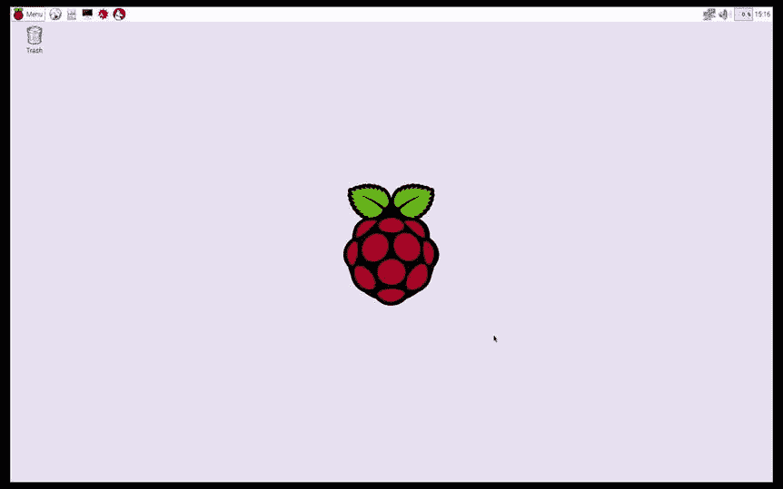

图 2-1。

First boot of your Pi

图标的布局实际上取决于您连接到 Pi 的屏幕。这应该是非常相似的，但可能唯一的真正区别是桌面图标本身的布局。

这里有一些关键区域很难在一个大的屏幕截图中看到，所以我们将分别分解每个部分。为了简单起见(更不用说它们已经成为常见的习惯用法了)，我们将用大多数人熟悉的名称来指代各种 GUI 元素。因此，我们将讨论开始菜单和任务栏。我们从屏幕左下方开始，如图 [2-2](#Fig2) 。

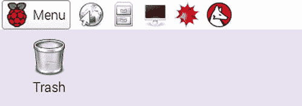

图 2-2。

Start button and friends

### 开始菜单和任务栏的左上角

左上角的第一个按钮实际上是 Pi 标志，充当开始按钮。“下一步”按钮启动默认的 web 浏览器，在 Pi 的情况下恰好是 Epiphany。像其他应用程序一样，你会发现大多数应用程序都是轻量级和高效的。下一步按钮将启动 PCManFM，LXDE 文件管理器。当你需要移动一些文件或做一些一般的整理工作时，这是你需要的工具。

目前为止一切顺利。这些应用程序与您可能习惯在您的主计算机上运行的程序没有什么不同。下一个有点不同。这是启动 LXTerminal 的按钮，这是在 Pi 上使用命令行的最佳方式(至少在图形界面中)。

接下来的两个特别有趣，对 Pi 来说相对较新(或者至少在我们写第一本书的时候它们还不存在)。第一个是 Mathematica，它是最强大的计算软件包之一，但是你需要知道你在做什么。如果你对数学和创建模型(数学模型)感兴趣，你肯定想看看这个。旁边的图标启动 Wolfram，这是 Mathematica 中使用的编程语言。这类似于 Linux 中的命令行，因为它让您可以使用 Mathematica 的引擎。这是一个很酷的特性，但是，这可能不是大多数人会使用的东西。

最后，桌面上还有唯一的图标——垃圾桶。这不需要太多的解释(当然，除非你来自 Windows 3.11)，它以你期望的方式工作。

### 在右手边…

在任务栏之后，我们还有一些图标，如图 [2-3](#Fig3) 所示。

图 2-3。

The right hand side of the task bar

第一个是代表您的网络的两台计算机的图片。在这种情况下，我们使用有线以太网，它是连接的，所以我们得到这个图标，但图标可以改变(例如，如果电缆被拔掉，图标上会有一个十字)。

下一个图标真的不需要介绍。扬声器控制您的 Pi 上的音量。像大多数设置一样，你也可以在这里静音，但是这个真的没有什么有趣的。

第三个图标看起来只是一个空框，但它实际上充当 CPU 监视器。你给你的圆周率做的越多，这个盒子就会变得越满。它就像一个图表，显示你的 CPU 是如何随着时间的推移而使用的。你实际上可以通过快速移动鼠标指针自娱自乐(至少几分钟)。你移动得越快，使用的 CPU 就越多，你就越能填满盒子。除了娱乐和游戏之外，这个显示器非常有用，因为如果你的 Pi 开始有点反应迟钝，快速看一下显示器就可以知道你是否正在最大限度地利用你的 CPU。

紧挨着 CPU 监视器的是时钟，它不需要太多的解释。在早期版本的 Pi 中，这个任务栏的远端有一个关机按钮。这是一个非常有用的功能，你仍然可以使用它，但你需要点击“菜单”按钮，然后选择“关机”(旁边有一个漂亮的退出标志)。这将调出熟悉的关机屏幕(图 [2-4](#Fig4) ):

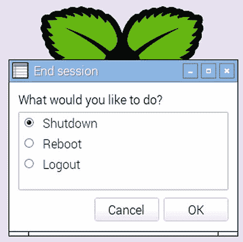

图 2-4。

Clicking the shut down button

点击“关机”将会像你期望的那样重启并注销。但是有一点值得记住，Pi 运行的是多用户操作系统 Linux。这意味着事情可能在你不知道的背景下发生。例如，有人可能正在从您的 Pi 中流式传输视频。如果您关机或重新启动，可以理解的是，您会断开连接到该 Pi 的任何其他人。很可能这对你来说现在还不是问题，但是你可能应该意识到这一点。

这就是你在屏幕上看到的。现在，让我们继续开始菜单的奥秘…

### 开始菜单

自从 Windows 95 引入开始菜单以来，开始菜单的概念在大多数操作系统中几乎无处不在(特别是 Mac)。虽然许多人可能会对此嗤之以鼻，并指出以前可能见过它的地方，或者坚持认为 Linux 中的开始菜单与 Windows 中的完全不同，但我们试图超越这一点。事实是，不管是谁想出来的，开始菜单的概念都非常好用，这也是它被广泛采用的原因。

肥皂箱说够了，让我们看看开始菜单能为我们提供什么(图 [2-5](#Fig5) ):

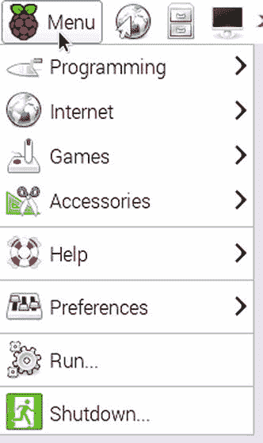

图 2-5。

The Start Menu

和以前一样，这里没有什么真正突破性的东西。第一部分列出了我们可以使用的所有应用程序，它们被整齐地组合在一起。在这种情况下，编程、互联网、游戏和带有帮助和偏好的配件排在最后。很难决定我们应该先研究这些选项中的哪一个。在我们这样做之前，我们需要包装剩下的项目，因为只剩下两个，应该不会花我们很长时间。

我们已经讨论了关闭，这相当简单。我们将查看一些设置(首选项),稍后您可以对其进行调整。列表中的最后一项是 run 命令。这让我们无需从菜单中选择命令、点击图标或打开终端就能执行特定的命令。就像在 Windows 下一样，这个选项非常方便。它还具有自动完成功能(图 [2-6](#Fig6) ):

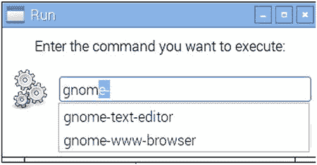

图 2-6。

The run command and auto complete

在这里你可以看到我们输入了“gnom ”,它突出显示了所有符合这个模式的应用程序。这可以节省你很多时间，因为随着时间的推移，你会知道你需要输入多少个字符，自动完成功能才会产生正确的答案。通常命令名(尤其是 GUI 应用程序)会很长，所以这可以节省时间！

## 附件

现在，让我们来看看配件下面有什么。像所有其他菜单一样，这里的项目可以随着您安装更多软件而改变，在较新版本的 Raspbian 上，它可能看起来有点不同。在我们的 Pi 上，配件菜单是这样的(图 [2-7](#Fig7) ):

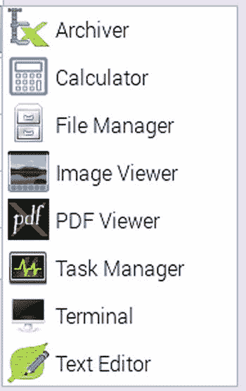

图 2-7。

The accessories menu

### xaarchiver(消歧义)

与 Image Viewer 相比，XArchiver 不太可能被直接调用，但它可能是一个在普通系统上使用相当多的应用程序。此工具允许您创建和解压缩各种格式的档案，这在您从互联网下载内容时是必不可少的。XArchiver 是这样的(图 [2-8](#Fig8) ):

图 2-8。

XArchiver when it’s opened by hand

在这里，我们将文档下载到了 Erlang 平台(当我们需要演示 XArchiver 时，这是我们首先想到的)。双击文件后，XArchiver 自动打开。到目前为止，我们使用过的唯一按钮是“全部提取”按钮，从右边数第二个。点击这个将提取所有的存档内容，这往往是你真正想要做的。

### 计算器

如果圆周率不附带计算器，感觉就不太对了——毕竟它几乎是所有计算机化设备的标准应用程序。有人记得计算器手表吗？我们不会把这个截图放进去，因为它看起来像一个计算器，但它仍然可以很好地完成工作。

### 文件管理器

如前所述，LXDE 附带了 PCManFM 文件管理器。当然你可以从任务栏访问它，所以你不太可能从这里运行它。从极简设计运动中领先，这个文件管理器是轻量级的，简单易用，但仍然有你需要的所有功能。它的工作方式与微软的 Windows 资源管理器非常相似，所以如果你来自 Windows 背景，你会感觉在 PCManFM 上如鱼得水。如果没有，只需点击几下，你就可以轻松地找到它(图 [2-9](#Fig9) ):

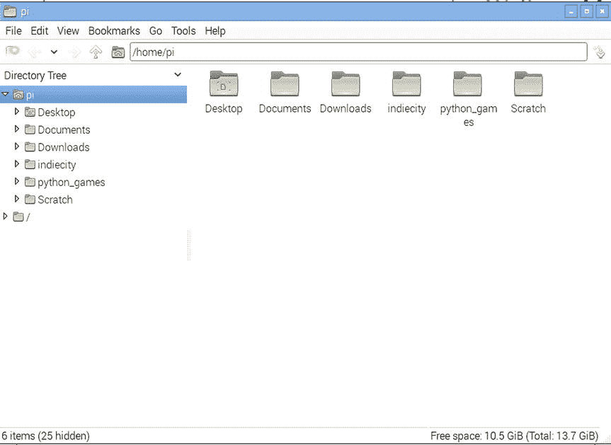

图 2-9。

The PCManFM File Manager

最初打开时，PCManFM 会将您放入您的家庭区域。它会在右下角显示你有多少可用空间(在 Pi 等存储空间相对有限的设备中总是有用的)，并在左上角列出最常见的地方。浏览时，您只需点击浏览文件夹，还可以使用工具栏上的导航图标来帮助您快速浏览文件。如果你想获得更多的实践经验，我们会在第 5 章中介绍如何操作文件。

### 图像查看器

图像浏览器是你可能永远不会直接打开的应用程序之一。你几乎总是通过双击一个图像文件来打开它，默认情况下会为你打开图像浏览器。虽然图像查看器可能很简单，但它并不缺乏功能，并且拥有您所期望的所有基本工具(图 [2-10](#Fig10) ):

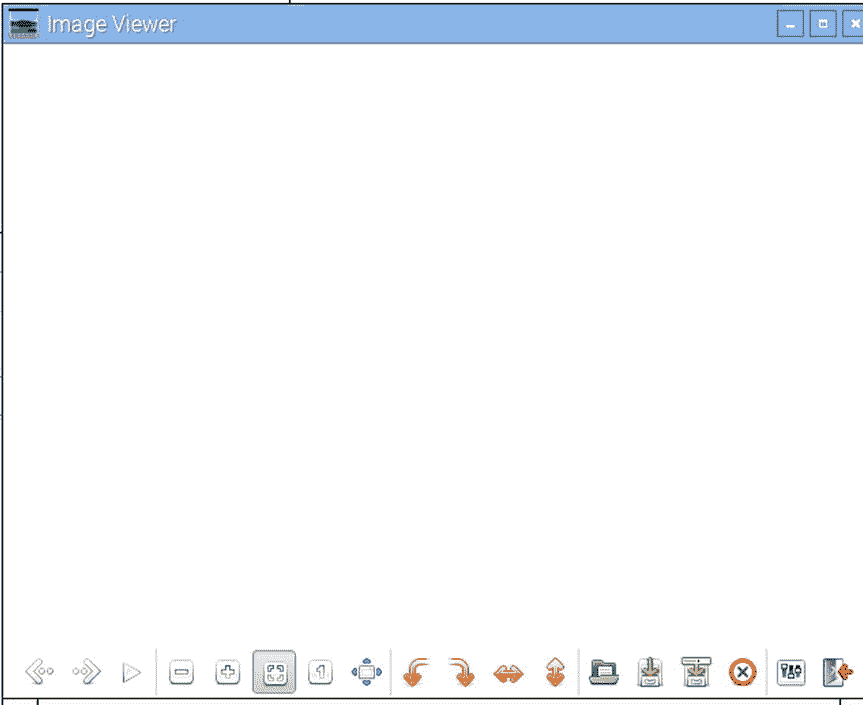

图 2-10。

Image Viewer’s main interface

前两个按钮让您可以在一组图像中来回移动。这实际上是非常有用的，因为这些天，很多时候人们都在访问相册而不是特定的照片。为了帮助你做到这一点，还有一个幻灯片功能，你可以通过按下播放按钮来访问。

下一部分有控制你想要如何实际查看图像。前两个是传统的缩放控件。第三个图标是“适合屏幕”，第四个是全尺寸显示(如果是数码相机的照片，这意味着你几乎肯定要滚动)，最后是全屏选项，以充分利用你刚刚得到的 60 英寸平板屏幕。

第三部分是改变图像本身的控件。前两个是旋转控件(分别向左和向右旋转)，第二对控件允许您水平和垂直翻转图像。当你从一个奇怪的角度拍照，并且不想把你的头倾斜 90 度来看你的照片时，这是非常方便的。

下一组是文件控件。它们分别允许您打开、保存、另存为和删除文件。最后两个图标提供了对 preferences 面板(这里没有什么有趣的东西)的访问，并允许您退出程序。

### PDF 查看器

你不太可能手动启动这个应用程序，而是当你双击一个 PDF 或者试图在网络浏览器中查看它时，它就会打开。截屏中没有太多东西可以显示(除了文档可能存在的大量灰色)，所以我们把它省略了，但是如果你以前看过 PDF，你不会有任何问题。

### 任务管理器

正如您在图 [2-11](#Fig11) 中看到的，CPU 此刻实际上是空闲的。考虑到它运行的是一个完整的操作系统(而且是一个高级操作系统)，看到 CPU 没有做任何繁重的工作可能会令人惊讶。虽然与高端英特尔处理器相比，Pi 中的 ARM 芯片并不令人印象深刻，但这确实证明了如果你小心的话，你可以用少得惊人的资源运行一台完美的台式机。我们的 RAM 使用情况讲述了一个类似的故事。诚然，我们目前没有太多的开放(尽管你可以从进程列表中看到我们正在运行 VNC 远程桌面会话)，但我们的使用率仍远低于 50%，新型号 B 的内存容量为 512MB，这将允许更多的应用程序同时运行。

图 2-11。

The task manager

进程列表可以很好地显示机器上正在运行什么，以及每个进程消耗了多少资源。这在您的 Pi 表现有点古怪，并且您需要查看某个应用程序是否突然决定吃掉您的所有 RAM 或让您的 CPU 着火时非常有用。如果您确实发现某个应用程序变得有点过于贪婪，您可以右键单击其名称，然后选择“Kill”，这将强制关闭它，从而有望使我们的 Pi 完全恢复健康(图 [2-11](#Fig11) )。

### 末端的

终端是一个 Linux 的终端模拟器，让您可以访问虚拟控制台。我们不打算深入探讨如何实际使用这一特定应用程序，因为我们将在下一章讨论细节。可以说，这个工具是用来让您直接通过命令行访问操作系统的。对许多人来说，这是一个天使不敢涉足的地方，但对经验丰富的管理者来说，这是他们称之为家的地方。不过要想知道命令行是否适合你，你必须等到第 4 章。

终端是一个简单的模拟器，但完成工作。它没有一些模拟器提供的所有花哨功能，但对大多数人来说非常好，看起来像这样(图 [2-12](#Fig12) ):

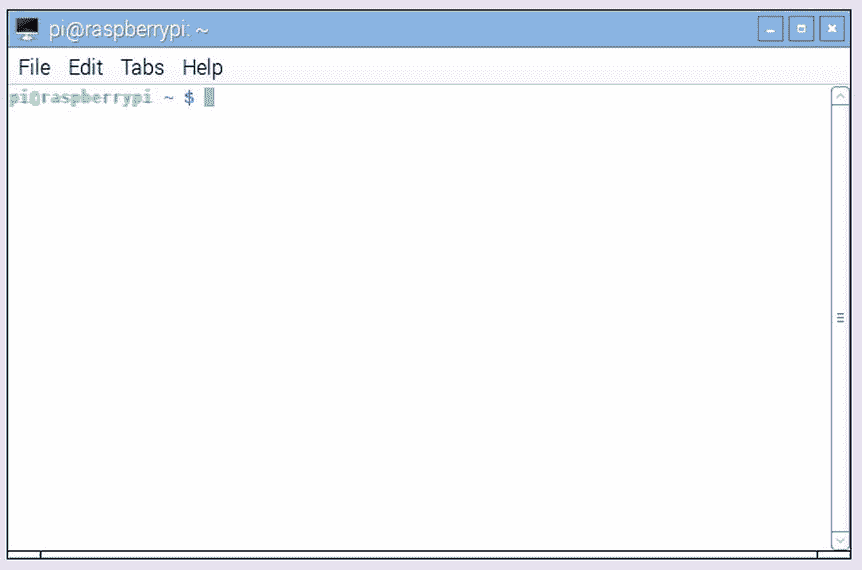

图 2-12。

LXTerminal up and running

这里我们将简要提及的一件事是提示。当字体颜色为绿色并且提示符的末尾是一个美元符号时，您知道您正在以普通用户的身份运行，并且您没有 root 权限，也就是说，您不能执行任何可能真正损害系统的命令。我们将在下一章更深入地讨论这个问题，但是我们需要在这里提到这个区别，这样下一个程序才有意义。

### 文字编辑器

为了与极简主义主题保持一致，Leafpad 文本编辑器做了基本的工作，仅此而已。它非常类似于微软记事本的新版本，同样易于使用。这对于写信给 Maude 阿姨或委员会抱怨隔壁的狗没有太大的好处，但当你需要做一些轻松的文本编辑时，它是完美的。

尽管它很简单，但它仍然提供了一些最有用的工具，即能够进行查找和替换，以及启用和禁用自动换行。有了这些工具，你几乎可以完成任何事情。

如果你觉得 Leafpad 对你的口味来说功能有点不足，那么你可能想翻到第 6 章，在那里我们会向你展示一些更强大的原生文本编辑器，你可以得到它们。

在大多数情况下，Leafpad 完全按照它在 tin 上所说的那样做-它编辑文本，如果这就是你所需要做的，Leafpad 是一个极好的选择(图 [2-13](#Fig13) )。

图 2-13。

Leafpad has a similar look and feel to Microsoft’s Notepad

## 比赛

游戏菜单只有两个项目，但它们仍然令人印象深刻，有一种发泄方式总是好的。对于一些轻松有趣的游戏，你不会发现 Pi 想要的。

### 《我的世界》

除非你过去几年一直住在月球上，否则《我的世界》对你来说并不陌生(图 [2-14](#Fig14) )。事实上，对许多人来说，这是一个家喻户晓的名字。甚至还有怎么玩的书！无论如何，现在有一个版本的 Pi，但要注意，虽然它不需要太多的电力来运行它，但它会以令人不安的速度榨取你的生命！我们不会在这里讨论如何玩这个游戏，但是在谷歌上快速搜索《我的世界》会给你所有你需要的，甚至更多。祝你好运！

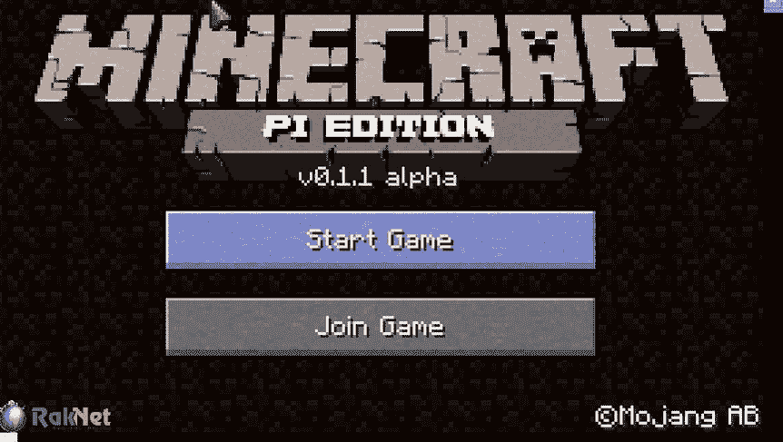

图 2-14。

Minecraft on your Pi!

### 圆周率游戏

对于那些年龄足够大，还记得像诺基亚 3310 这样的手机的人来说，你会记得它们曾经配备了一系列浪费时间(并且非常容易上瘾)的游戏。像《蛇》和《太空撞击》这样的经典作品可能非常有趣。Pi games 相当于 Raspberry Pi。所有这些游戏都很容易上手，但很难放下。带一些出去转一圈，看看你更喜欢哪一个(图 [2-15](#Fig15) ):

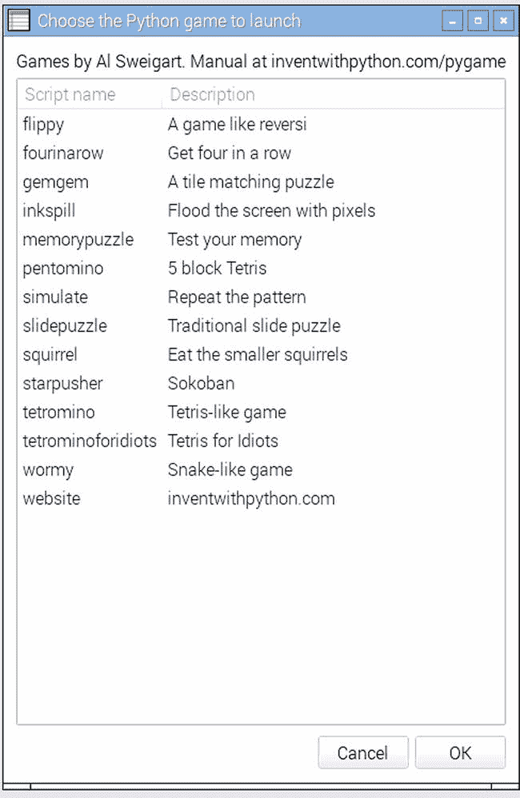

图 2-15。

Pi games, say goodbye to your free time

## 互联网

不出所料，互联网菜单包含专门用于访问互联网的应用程序。在我们的 Pi 上，互联网菜单是这样的(图 [2-16](#Fig16) ):

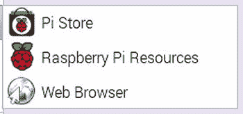

图 2-16。

The Internet menu

### 皮店

Pi Store 的目标是类似于 Android 的应用商店。我们实际上从来没有使用过它，因为我们想要的所有东西都可以通过标准库获得。也就是说，我们正在关注它，因为当应用程序首次出现在 Android 上时，它们并不那么有趣，但今天它们是整个手机体验的关键。所以试试这个吧，你可能会找到你真正喜欢的东西(图 [2-17](#Fig17) )。

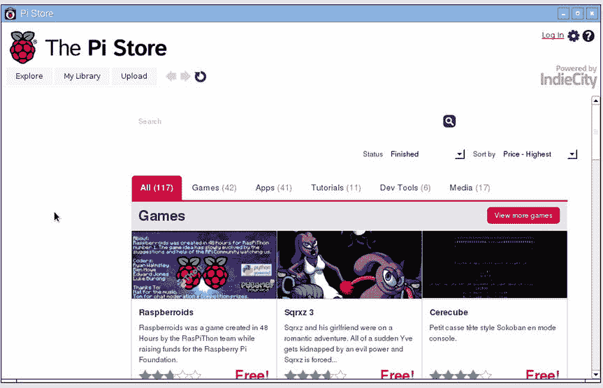

图 2-17。

Like the app store but for Pi

### 树莓资源

“Raspberry Pi Resources”基本上是一个链接到大量信息(也称为 Resources 咳咳)的网页，这些信息将为您提供有关 Pi 的信息以及大量学习、教学和制作东西的想法。如果你想探索你的 Pi 能做什么，还有一些文章和其他教程值得一读(图 [2-18](#Fig18) )。

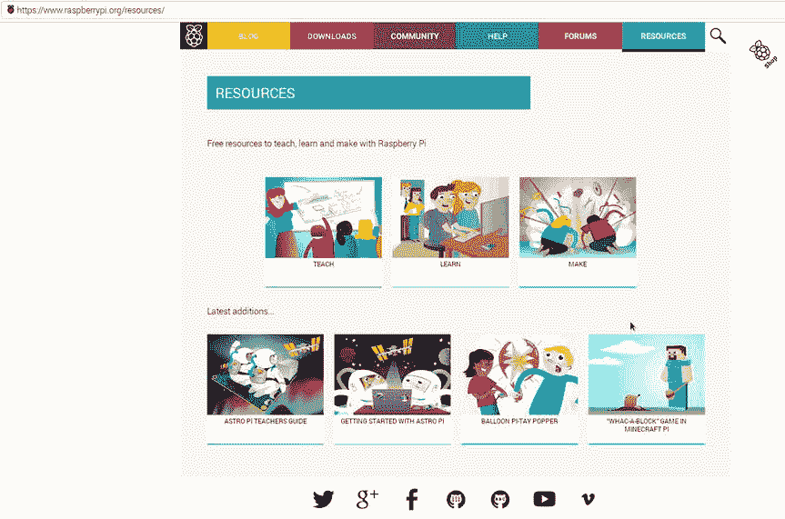

图 2-18。

Things to do with your Pi

### 网络浏览器

嗯，这个很标准，所以我们不会提供截图。Epiphany 是基于 webkit 的，所以你应该可以毫无困难地在 Pi 上享受所有你喜欢的网站。当然，正如我们之前提到的，你也可以从屏幕左上角的任务栏打开浏览器。

## 设计

编程菜单由四个项目组成，其中两个是我们在教育菜单下遇到的(图 [2-19](#Fig19) ):

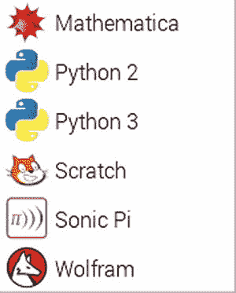

图 2-19。

The Programming menu

我们已经简单地介绍了 Mathematica 和 Wolfram，但是值得在这里重复一下，尽管这两个工具非常伟大，但是你确实需要知道你想用它们做什么。我们很高兴在这里看到他们，但不是数学家或需要做复杂的建模，我们真的不知道如何正确地为你演示。在任何情况下，它都有一个令人敬畏(也有些可怕)的标志(图 [2-20](#Fig20) ):

图 2-20。

Firing up Mathematica

### 擦

Scratch 是由 Mitchel Resnik 领导的终身幼儿园小组在麻省理工学院媒体实验室开发的。目的是创造一种方法来教人们如何编程，而不必先教所有的细节。这使得 Scratch 中的触觉方法(可以拖放逻辑块)更容易掌握。

我们不能自称是 Scratch 的专家(事实上我们第一次遇到它是在玩 Pi 的时候),但是我们确信，随着 Pi 在整个水域的扩展，这些种类的应用程序将会产生巨大的影响。让人们接触技术，并为他们提供一个强大的系统，让他们不必先掌握所有的基础知识就可以开始工作，这在我们的书中绝对是一个赢家。

如果你不相信，看看这张截图，它肯定让我们再看一眼(图 [2-21](#Fig21) ):

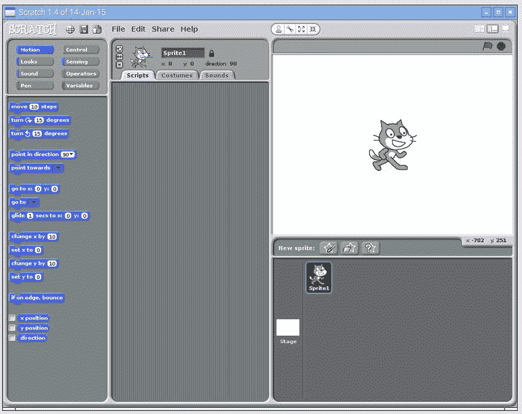

图 2-21。

Scratch programming environment

### 计算机编程语言

我们只剩下 Python 2 和 Python 3 了。实际上，这两者非常相似，因为它们都是 Python 编程语言的基于文本的接口。之所以有两个不同的版本，是因为有两个当前版本的 Python，由于各种原因，它们并不相互兼容。在许多方面，您可能为 Python 2 . x 版本编写的脚本在 3.x 中也能很好地工作，但是语言中有相当多的问题和变化，使得保证兼容性变得不可能。这就是为什么您会经常看到在任何给定的机器上安装了两个版本的 Python。

在撰写本文时，Python 2.x 仍然是大多数人使用的地方，许多项目仍然在使用它进行积极的开发。事实上，当我们编写新的 Python 脚本时，我们也使用 2.x，因为它有最多的库、文档、博客和论坛帖子的历史，并且通常有一个很大的社区。另一方面，Python 3.x 进行了许多调整和语言改进，但它们永远不会出现在 Python 2.x 上，当然所有的新想法和开发都集中在新系列上。最终，Python 3.x 是一条出路，如果你刚刚开始你的编程生涯，我们建议你从 Python 3.x 开始。它肯定不会有什么坏处，如果出于某种原因你需要使用它，你可以随时查看 Python 2.x，实际上从一个到另一个真的不是一个大问题。

由于的两个版本在使用方式上完全相同，我们将向您展示 Python 2(而不是 Python 3)(图 [2-22](#Fig22) ):

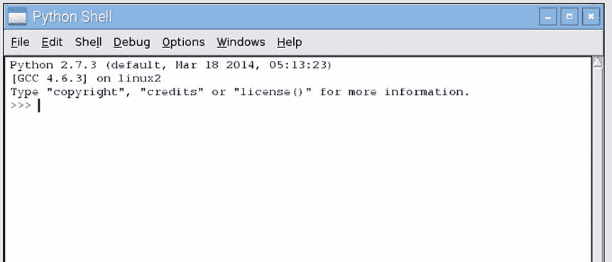

图 2-22。

Firing up Python

## 偏好；喜好；优先；参数选择

我们不打算在这份菜单中深入探讨。这是一个非常简单明了的菜单，学习这些东西的最好方法就是摆弄它们。我们以前试图给出很好的选项覆盖面，但是我们覆盖的越多，我们似乎遗漏的就越多，我们甚至不能在我们自己之间就覆盖哪些选项达成一致。所以，这一次我们建议你挽起袖子玩一玩——毕竟，你什么都破不了！

## 帮助

最后但同样重要的是帮助菜单。在这里你可以找到 Debian 参考指南的快捷方式和一个专门介绍 Raspberry Pi 的帮助指南。

《Debian 参考指南》问世已久，积累了很多关于理解和使用 Debian 的智慧和知识。这里的一个额外好处是这个文档直接安装在 Pi 上。这意味着，即使您无法在线获得 Pi，您也可以获得它。显而易见，这非常有用。

Raspberry Pi 帮助基本上是基金会网站上帮助页面的链接。焦点显然是在 Pi 上，这使得当您有想要解决的特定问题时，它是一个很好的去处。因为它是一个网站，所以您需要在线才能访问这个资源(尽管如果 Pi 出现问题，您可以很容易地从另一台机器上访问它)。这里的好处是资源不断更新，你总是要起床做日期信息。

这两个资源将为您提供愉快地使用 Pi 所需的几乎所有东西。然而，网络上有大量的信息，因为 Pi 有大量的追随者。您可以找到教程、常见问题解答、项目和一般帮助。所以，如果你在文档中找不到你需要的东西，就去你最喜欢的搜索引擎看看。

## 摘要

这就是桌面旋风之旅的基本内容！我们真的只是触及了表面，目的只是让你对可以开始自己探索的东西感到足够舒服。请记住，Pi 存在的原因是为了让人们能够试验和学习更多关于计算的知识，所以弄脏自己的手(即使您偶尔会弄坏 Pi)真的没什么好担心的。

在这一章中，我们介绍了默认安装的，可以通过开始菜单访问的应用程序，并且我们浏览了一些对于 Linux 世界来说有些独特的界面特性。

在下一章中，我们开始真正严肃地(有点)带你回到命令行，在那里我们向你介绍一个界面，一旦你习惯了它，你会想没有它你是怎么生活的。