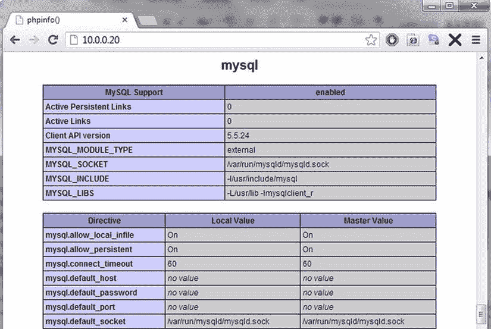
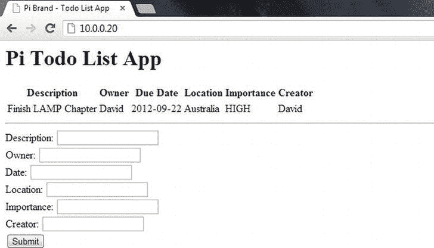
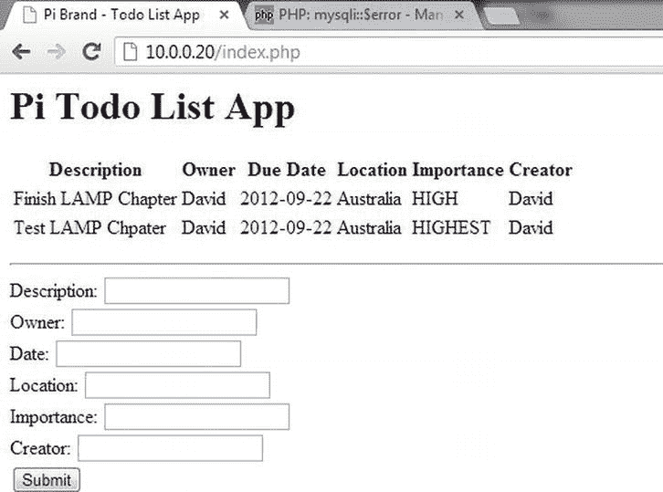
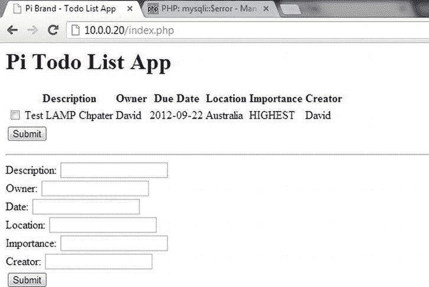

# 8.一盏你自己的灯

很多来到 Linux 的人都想知道的一个关键问题是，如何通过建立一个自己的小网站来建立自己。许多人很难找到开始的地方。哪些操作系统、哪些应用程序、哪些硬件，以及具体如何做到这一切？所有这些都是合理的问题，因为更大的 Linux 环境有如此多的方面，以至于很容易迷失。

我们的目标是为您提供能够在 Linux 环境中导航的第一批垫脚石。这条道路上的一个关键步骤是向您展示如何安装、配置和维护 web 服务器。虽然您可以将这个服务器连接到 Internet，但是在这些例子中，我们将只介绍如何将您的 Pi 用作本地网络服务器(换句话说，用于运行内部网)。此外，还有一个额外的挑战就是学习如何制作一个基本的交互式网站。虽然这可能看起来很难接受，并且其他人花费了整本书和生活来寻找这个问题的绝对最优的解决方案，我们的目标是在一章中涵盖它。

为此，我们将使用一盏灯。不，不是那些卧室发光设备中的一个，而是一个 Linux，Apache，MySQL 和 PHP 系统，旨在使传递网络内容变得容易。这是创建您自己的 web 服务器的最简单的方法之一，在最初的 LAMP 上有许多变体，包括但不限于以下内容:

*   WAMP (Windows、Apache、MySQL、PHP)
*   MAMP (Mac OS、Apache、MySQL、PHP)
*   用 Python 或 Perl 替换 Ps
*   用 MariaDB 替换 M

因此，从人们所做的大量混合、匹配和改进中可以看出，这是一个让强大的 web 服务器运行起来的好方法。最重要的是，它设置简单，可以在任何硬件上运行。

Pi 最常被引用的潜在用途之一是支持构建、运行和维护网站的能力。还有什么比教他们如何用最小的成本制作自己的网站更能激励一代年轻开发者的呢！

## 第一步

现在是时候面对现实了，我们可以在这里完成什么。在这一章中，我们将向你提供建立一个完整的网站堆栈的技巧，并向你展示如何使用 PHP 将 MySQL 数据库的功能集成到一个网站中，以动态生成网站内容。然而，有几件事我们不能在这里为你做:

*   设置和配置 DNS 或域名
*   高级 SQL 和数据库管理
*   HTML 和 HTML 开发方法的全面覆盖
*   全面覆盖 PHP 开发和 PHP 开发方法
*   Java Script 语言
*   半铸钢ˌ钢性铸铁(Cast Semi-Steel)

你可以利用许多资源来获得这些其他领域的帮助，包括其他重要的文章。我们还有工作要做，所以让我们开始吧。

## l 代表 Linux

设置灯组只有几个先决条件。你需要

*   安装并配置 Raspbian 操作系统(LAMP 的 L)
*   将内存分割设置为 240/16(运行`sudo raspi-config`)
*   熟悉使用命令行在 Raspbian 操作系统中工作
*   对如何编写简单的软件有一个基本的了解
*   让您的 Pi 连接到网络和互联网(否则我们如何提供内容？)

树莓灯只有几个其他的附带条件。我们将在 shell 中完成所有这些工作。鉴于网站将从 Pi 之外被查看，没有必要使用任何额外的资源来运行 GUI。既然我们知道我们需要做什么，那就开始吧。

## a 代表阿帕奇

可能任何 web 服务器最重要的部分就是 web 服务器应用程序。web 服务器是一个应用程序，它接受对网站的请求，然后返回所请求的网页内容。大多数 web 服务器还可以提供大量其他功能，这些功能有助于增强它们向最终用户提供 web 内容的能力。对于我们的 LAMP 堆栈，我们将使用 Apache web 服务器。

许多人认为 Apache 是世界上首屈一指的 web 服务器。它于 1995 年首次发布，并因向大众提供简单、强大、免费的 Web 服务器而在万维网的发展中发挥了作用而闻名。

作为这一事实的佐证，据估计，Apache 提供了世界上大约 54%到 58%的网站。

关于 Apache 的命名有两个故事:

*   第一个原因是，多年前首次开发时，它被命名为“一个拼凑的 web 服务器”。
*   第二个(从讲故事的角度来看更好)是，据说阿帕奇是以美国的阿帕奇部落命名的。

以一个部落命名并不是用词不当，因为表现得像一个部落是 Apache 的关键特性之一。Apache 启动时的第一个任务是创建自己的“工人”小部落，负责网站内容的实际服务。既然您对 Apache 有了更清晰的理解，那么第一步就是安装、启动并运行 Apache。

对于我们的安装，我们将(一如既往地)依赖始终如一的`apt-get`工具:

`$ sudo apt-get install apache2`

`Reading package lists... Done`

`Building dependency tree`

`Reading state information... Done`

`The following extra packages will be installed:`

`apache2-mpm-worker apache2-utils apache2.2-bin apache2.2-common libapr1`

`libaprutil1 libaprutil1-dbd-sqlite3 libaprutil1-ldap ssl-cert`

`Suggested packages:`

`apache2-doc apache2-suexec apache2-suexec-custom openssl-blacklist`

`The following NEW packages will be installed:`

`apache2 apache2-mpm-worker apache2-utils apache2.2-bin apache2.2-common`

`libapr1 libaprutil1 libaprutil1-dbd-sqlite3 libaprutil1-ldap ssl-cert`

`0 upgraded, 10 newly installed, 0 to remove and 71 not upgraded.`

`Need to get 1,348 kB of archives.`

`After this operation, 4,990 kB of additional disk space will be used.`

`Do you want to continue [Y/n]?`

现在您已经安装了 Apache，我们应该去验证它是否已经启动并运行。有几种方法可以做到这一点。首先，运行以下命令:

`$ ps -ef | grep apache`

`root      2306     1  0 Sep17 ?        00:00:09 /usr/sbin/apache2 -k start`

`www-data  2309  2306  0 Sep17 ?        00:00:00 /usr/sbin/apache2 -k start`

`www-data  2311  2306  0 Sep17 ?        00:00:00 /usr/sbin/apache2 -k start`

`www-data  2315  2306  0 Sep17 ?        00:00:00 /usr/sbin/apache2 -k start`

从这个输出中，您可以看到 Apache 确实已经启动并运行了。从这一点来看，还有几件重要的事情需要注意。下面一行列出的第一个过程不同于其他过程:

`root 2306 1 0 Sep17 ? 00:00:09 /usr/sbin/apache2 -k start`

这就是前面提到的阿帕奇部落的酋长。它归 root 所有(如第一列所示)，其进程 ID (PID)是 2306。另外三个由名为`www-data`的用户拥有，这是一个专门针对 Apache 的用户。虽然每个工作进程都有不同的 PID，但是它们都有一个 PPID(父进程 ID)2306，这意味着 Apache 主进程创建了它们(其 PID 是 2306)。

现在是第二个更有趣的测试。在这个测试中，我们实际上会让 Apache 显示它的默认起始网页！为此，您可以登录 GUI 或者使用`ifconfig`获取系统的 IP 地址。您的输出应该如下所示，并突出显示相关的 IP 地址:

`$ ifconfig`

`eth0      Link encap:Ethernet  HWaddr b8:27:eb:8a:46:ba`

`inet addr:``10.0.0.20`T2】

`UP BROADCAST RUNNING MULTICAST  MTU:1500  Metric:1`

`RX packets:213812 errors:0 dropped:0 overruns:0 frame:0`

`TX packets:5119 errors:0 dropped:0 overruns:0 carrier:0`

`collisions:0 txqueuelen:1000`

`RX bytes:19226371 (18.3 MiB)  TX bytes:495394 (483.7 KiB)`

`lo        Link encap:Local Loopback`

`inet addr:``127.0.0.1`T2】

`UP LOOPBACK RUNNING  MTU:16436  Metric:1`

`RX packets:8 errors:0 dropped:0 overruns:0 frame:0`

`TX packets:8 errors:0 dropped:0 overruns:0 carrier:0`

`collisions:0 txqueuelen:0`

`RX bytes:1104 (1.0 KiB)  TX bytes:1104 (1.0 KiB)`

假设您的系统(像我的一样)连接到网络，您可以使用第一个 IP 地址(10.0.0.20)。`eth0`块中的地址代表其网络端口。`lo`块中的地址为环回地址，用于内部自参考，始终为 127.0.0.1。

下一个测试是访问 Apache 默认网页；为此，您只需在浏览器中输入这些 IP 地址中的一个(当然，假设您与 Pi 在同一个网络上！).如果您想使用 Pi 的板载浏览器进行测试，那也完全没问题，您可以选择任何一个地址(10.0.0.20 或 127.0.0.1)。你还在等什么？打开浏览器窗口，查看默认网页，如图 [8-1](#Fig1) 所示。

图 8-1。

It works!

正如你现在应该知道的，它起作用了！这是 Apache web 服务器的默认网页，因为它表明还没有添加任何内容，我们将在后面介绍。现在，让我们看看这个缺省页面是如何生成的，因为这将让您对 Apache 的真正工作原理有所了解。

### Apache 配置

坦率地说，了解 Apache 配置有点像一场噩梦。如果你感兴趣，就去看看`/etc/apache2`中的内容，了解我的意思。这里有许多具有不同含义的文件夹，这些文件夹之间的相互关系会改变 Apache 服务器实例的工作方式。谢天谢地，一旦你明白你需要在哪里做出改变，一切都变得容易多了。

Apache 配置中第一个值得注意的文件是`apache2.conf`文件。这是一个控制配置文件，它说明了其他各个部分的位置，以及应用程序应该如何加载它们。第二件要注意的事情是`mods-available`和`mods-enabled`文件夹。如果你看一下`mods-available`文件，你会发现有大量的`.load`和`.conf`文件。这些文件分别表示 Apache 应该从哪里加载一个模块以及这个模块需要的任何配置信息。

接下来是`mods-enabled`，最初看这个文件夹会让它看起来就像`mods-available`。然而，如果你在这个目录上运行一个`ls –l`，你会看到这个:

`$ ls -l /etc/apache2/mods-enabled/`

`total 0`

`lrwxrwxrwx 1 root root 28 Sep 17 21:44 alias.conf -> ../mods-available/alias.conf`

`lrwxrwxrwx 1 root root 28 Sep 17 21:44 alias.load -> ../mods-available/alias.load`

`lrwxrwxrwx 1 root root 33 Sep 17 21:44 auth_basic.load -> ../mods-available/auth_basic.load`

`lrwxrwxrwx 1 root root 33 Sep 17 21:44 authn_file.load -> ../mods-available/authn_file.load`

`...`

这表明，实际上，`mods-enabled`中的每个文件实际上都是指向`mods-available`中的一个文件的链接！这是 Apache 配置的第一个复杂性，尽管在任何给定的时间都有许多可用的模块，但实际上只有一定数量的模块被加载。像这样使用符号链接意味着在给定时间只需要保存和维护配置的一个副本。更重要的是，对其中一个的任何更改都会影响到两个。

如果你查看`sites-available`和`sites-enabled`文件夹，你会看到相同的布局，除了可能有更少的站点。这将我们带到我们搜索的真正目标:Apache 系统中第一个可用的默认站点。所以要么开`/etc/apache2/sites-available/default`要么开`/etc/apache2/sites-enabled/000-default`，因为无所谓；他们是一回事！所以，现在你在里面了，回顾一下配置中的每一个东西的含义。如果你想添加额外的网站或者修改网站的显示方式，其中的许多对你来说是很重要的。

`<VirtualHost *:80>`

`ServerAdmin webmaster@localhost`

`DocumentRoot /var/www`

`<Directory />`

`Options FollowSymLinks`

`AllowOverride None`

`</Directory>`

`<Directory /var/www/>`

`Options Indexes FollowSymLinks MultiViews`

`AllowOverride None`

`Order allow,deny`

`allow from all`

`</Directory>`

`ScriptAlias /cgi-bin/ /usr/lib/cgi-bin/`

`<Directory "/usr/lib/cgi-bin">`

`AllowOverride None`

`Options +ExecCGI -MultiViews +SymLinksIfOwnerMatch`

`Order allow,deny`

`Allow from all`

`</Directory>`

`ErrorLog ${APACHE_LOG_DIR}/error.log`

`# Possible values include: debug, info, notice, warn, error, crit,`

`# alert, emerg.`

`LogLevel warn`

`CustomLog ${APACHE_LOG_DIR}/access.log combined`

`</VirtualHost>`

第一行可能是最重要的一行；它指定该 web 服务器可用于端口 80 上的任何传入地址。更改这意味着您可以在同一个站点上运行多个 web 服务器，方法是使用不同的端口来引用每个服务器。

Note

通过在 URL 末尾添加`:<port number>`,您可以在连接到几乎任何应用程序时指定一个端口。

在`VirtualHost`地址之后，下一个相关的东西是`DocumentRoot`。这很关键，因为它说明了 Apache 将从哪里加载所有 web 服务器内容。这意味着任何在`/var/www`文件夹中的东西都可以通过基本网站的 80 端口获得。例如，如果你进入`/var/www`文件夹，你会看到一个文件:`index.html`。如果您检查这个文件，您会看到一些非常熟悉的内容:

`<html><body><h1>It works!</h1>`

`
This is the default web page for this server.
`

`
The web server software is running but no content has been added, yet.
`

`</body></html>`

是的，这就是用来生成 Apache 当前显示的基本起始页的网站内容。我试着这样想:web 服务器为您提供对该文件夹(及其所有子文件夹和文档)的访问。为了证明这一点，请尝试以 root 用户身份执行以下命令:

`$ echo "Hello World" > /var/www/foo`

Note

执行`sudo su –`可以获得 root。

一旦你成功执行了这个命令，将你的浏览器指向`http://<IP` `Address>/foo`，你应该会看到`hello world`显示在那里。你可能想知道为什么我们不需要在对我们网站的第一个请求中使用`index.html`(即使用 [`http://10.0.0.2/index.html`](http://10.0.0.2/index.html) )。这是因为名为“index”的文件比较特殊。如果没有其他内容可用，则它们是显示的默认页面。

您应该知道的配置的下一部分是`Directory`配置部分。这些是目录列表，可以提供关于如何访问它们甚至谁可以访问它们的特殊规则。在这个实例中，Apache 对两个目录进行了配置设置:根目录`/`和`/var/www`。虽然您可以对目录值做许多非常有趣的事情，但是在这里我们不需要做太多。要了解更多信息，您应该访问 Apache 网站，通读那里提供的更详细的文档。

在目录细节之后是`ScriptAlias`，它控制应用程序如何访问 CGI 脚本。`ScriptAlias`是一个特殊的目录，这些 CGI 程序在其中运行和执行。由于 PHP 是一个很像 BASH 的脚本系统(在第 7 章的[中讨论过)，你可能认为这有直接的关系，但事实并非如此。PHP 由一个特殊的解释模块(`modphp`)运行，而不是由一个单独的 CGI 程序运行。](07.html)

`ScriptAlias`下面的目录值与之相关。最容易泄露是这两个引用`/usr/lib/cgi-bin/`。这个目录包含了`+ExecCGI`指令。同样，这与脚本和 PHP 之类的东西是如何执行的有关。最后，配置文件以几个非常有用的配置行结束。这些值是 Apache 服务器的日志文件指令；它们说明了日志文件将放在哪里，以及它们将写入哪些文件。这里包括了访问日志(这样你就可以监视每个访问你的人)和更多的标准错误日志。中间的`LogLevel`指令决定了关于服务器运行的日志应该在哪个级别输出，现在它被设置在`WARN`，这是合理的。

考虑到您以后在使用 PHP 时可能需要利用这些日志，您现在应该熟悉它们了。但是，首先让我们对 Apache 将包含的日志做一个小小的更改。让我们将日志级别更改为 notice，继续进行更改，然后保存新编辑的文件。一旦文件被更改，我们需要告诉 Apache 这一点，这样它将重新加载配置。与对您的网站进行内容更改不同，我们需要将配置更改通知 Apache。幸运的是，Apache 通过包含一个我们可以向它发出的重载函数使这变得容易了。继续发出这个:

`$ sudo /etc/init.d/apache2 reload`

`[....] Reloading web server config: apache2apache2: Could not reliably determine the server’s fully qualified domain name, using 127.0.1.1 for ServerName`

`. ok`

这告诉 Apache 重新加载它的配置并再次运行。现在看看日志文件，看看我们所做的更改。Apache 日志目录是`/var/log/apache2`，我们感兴趣的文件是`error.log`。一旦你往里面看，你应该会看到这样的东西:

`[Tue Sep 18 22:46:56 2012] [notice] SIGUSR1 received.  Doing graceful restart`

`apache2: Could not reliably determine the server’s fully qualified domain name, using 127.0.1.1 for ServerName`

`[Tue Sep 18 22:46:56 2012] [notice] Apache/2.2.22 (Debian) configured ˗˗ resuming normal operations`

这表示我的 Apache 实例收到了一个信号，它执行了一次优雅的重启；然后，它在同一秒钟内恢复正常运行。这是我们刚才执行的配置重新加载。我们还可以查看访问日志，看到我们自己正在访问 web 服务器上的内容，然后打开`/var/log/apache2`中的`access.log`文件进行查看。您应该会看到类似这样的内容:

`10.0.0.104 - - [18/Sep/2012:20:31:17 +1000] "GET / HTTP/1.1" 200 482 "-" "Mozilla/5.0 (Windows NT 6.1; WOW64) AppleWebKit/537.10 (KHTML, like Gecko) Chrome/23.0.1262.0 Safari/537.10"`

`10.0.0.104 - - [18/Sep/2012:22:21:22 +1000] "GET /favicon.ico HTTP/1.1" 404 498 "-" "Mozilla/5.0 (Windows NT 6.1; WOW64) AppleWebKit/537.10 (KHTML, like Gecko) Chrome/23.0.1262.0 Safari/537.10"`

`10.0.0.104 - - [18/Sep/2012:22:28:36 +1000] "GET /foo HTTP/1.1" 200 274 "-" "Mozilla/5.0 (Windows NT 6.1; WOW64) AppleWebKit/537.10 (KHTML, like Gecko) Chrome/23.0.1262.0 Safari/537.10"`

这几行显示 IP 10.0.0.104 上有人在 web 服务器的`/`上发出了一个`GET`请求，这个请求是`/var/www`文件夹和其中的`index.html`文件(因为 index 是默认文件)。它还显示有人正在访问这个目录中的 foo 文件。他们都是我按顺序访问网站。您还会注意到，在中间有一个请求，是对一个`favicon.ico`的请求。这表示我的浏览器试图请求该网站的收藏夹图标；不幸的是，没有。

### 解决纷争

在很大程度上，设置 Apache 服务器是轻而易举的事情。只有当你开始做很多改变时，你可能会遇到麻烦。但是，如果您发现自己遇到了问题，请尝试以下方法。检查您是否可以看到 Apache 进程使用`ps –ef`运行。如果 Apache 没有运行，请尝试启动它。如果失败，请尝试检查错误日志文件，因为它将包含 Apache 遇到的任何错误的信息。错误日志中的大多数条目都是不言自明的。然而，如果你发现自己不知所措，那就去 Apache 网站，那里有大量的帮助可以提供给那些有需要的人。

## m 代表 MySQL

现在你已经建立并运行了你的 web 服务器，你可能会问，“我发现你可以通过把内容写入 web 服务器来创建一个网站，然后它就会显示出来。我可能还需要什么软件？”这是真的。现在，你可以用基本的超文本标记语言(HTML)写一个网页，然后就完事了。单独用 HTML 编写的问题是 HTML 是静态的，这意味着任何时候你想改变显示的内容，你都需要打开并编辑文件来改变内容。当你想向不同的人展示不同的东西时，这不是很好的管理。你需要手动坐在那里编辑一大堆东西——这毫无意义。

这是我们开始看到整个灯堆的力量。我们有 Apache 来提供内容，PHP 将处理动态部分，MySQL 数据库实际上将包含您想要显示的各种不同的信息。只有当你拥有所有这些组件并一起工作时，你才能看到灯具系统的真正力量。

### 安装 MySQL

数据库是一个便于存储和检索数据的系统。它们接受大量的输入，然后对数据进行结构化，以便可以通过查询轻松检索信息。所有 SQL 数据库都是以结构化查询语言命名的，它们使用结构化查询语言来处理信息检索请求。MySQL 是世界上部署最广泛的开源数据库。这就是所谓的关系数据库系统，因为它易于建立和使用，因此被广泛采用。为了安装 MySQL，我们将再次求助于我们的老朋友`apt-get`；这一次，我们将安装`mysql-server`包。执行以下操作:

`$ sudo apt-get install mysql-server`

`Reading package lists... Done`

`Building dependency tree`

`Reading state information... Done`

`The following extra packages will be installed:`

`heirloom-mailx libaio1 libdbd-mysql-perl libdbi-perl libhtml-template-perl`

`libmysqlclient16 libnet-daemon-perl libplrpc-perl mysql-client-5.5`

`mysql-common mysql-server-5.5 mysql-server-core-5.5`

`Suggested packages:`

`libipc-sharedcache-perl libterm-readkey-perl tinyca`

`The following NEW packages will be installed:`

`heirloom-mailx libaio1 libdbd-mysql-perl libdbi-perl libhtml-template-perl`

`libmysqlclient16 libnet-daemon-perl libplrpc-perl mysql-client-5.5`

`mysql-common mysql-server mysql-server-5.5 mysql-server-core-5.5`

`0 upgraded, 13 newly installed, 0 to remove and 84 not upgraded.`

`Need to get 9,770 kB of archives.`

`After this operation, 91.5 MB of additional disk space will be used.`

`Do you want to continue [Y/n]?`

一旦实际的 MySQL 安装完成，您将被要求为您的数据库提供一个 root 密码；这是您的数据库的主管理员密码。一定要记住；你以后会需要它的。现在安装已经完成，请确认该过程已经开始，如下所示:

`$ ps –ef | grep mysql`

输出应该显示一些不同的东西，包括 MySQL 守护进程，这里突出显示了它:

`root      5254     1  0 20:23 ?        00:00:00 /bin/sh /usr/bin/mysqld_safe`

`mysql     5592  5254  3 20:23 ?        00:00:03 /usr/sbin/mysqld ˗˗basedir=/usr ˗˗datadir=/var/lib/mysql ˗˗plugin-dir=/usr/lib/mysql/plugin ˗˗user=mysql ˗˗pid-file=/var/run/mysqld/mysqld.pid ˗˗socket=/var/run/mysqld/mysqld.sock ˗˗port=3306`

`root      5593  5254  0 20:23 ?        00:00:00 logger -t mysqld -p daemon.error`

这是一个很大的进程命令，但它确实表明 MySQL 已经启动并运行了。我们可以查看 MySQL 的配置，但幸运的是，该系统将满足我们所有的基本需求，不需要修改配置。鉴于此，让我们开始研究一些插入和检索数据的基本方法。

### 结构化查询语言

结构化查询语言(SQL)是一种用于在 SQL 数据库中插入和检索信息的语言。在 SQL 中，您可以执行许多不同的查询，从简单到极其复杂。考虑到(和其他东西一样)许多其他资源花费了更多的时间和更多的关于语法和起源的细节，我们在这里就不讨论了。此外，出于我们的目的，我们只需要五种类型的查询:

*   基本管理命令
*   插入新数据
*   查找数据
*   更新数据
*   删除数据

虽然这听起来非常简单，但是如果你想做一些更复杂的事情，很容易迷失在语法中。如果是这种情况，并且您希望做一些比我们在这里介绍的稍微复杂的事情，请访问 MySQL 网页，因为它们有完整的文档说明如何准确地执行每个查询，以及每个命令需要的大量选项。如果你想了解更多关于 web 开发的知识，看看 Jason W. Gilmore 的《PHP 和 MySQL 5 入门》。

反正足够的植入式广告；让我们从基本的管理工作开始，做一个数据库。这个的语法非常简单:

`create database <database name>`

要在 MySQL 实例上执行命令，您需要连接到它并进入`mysql` shell。执行此操作的命令如下:

`mysql –uroot –p`

因此，进入 shell，提供您的 root 密码，并执行`create database pi;`,这会生成以下输出:

`mysql> create database pi;`

`Query OK, 1 row affected (0.00 sec)`

好吧，太棒了。我们有一个数据库叫做`pi`。在 SQL 数据库系统中，数据库是最高级别的构造。下面是一个表，它是保存数据的对象(一个数据库保存多个表)。表中的每一项数据都称为一行。所以我们的下一步是创建一个表；问题是我们需要给我们的表一些结构。我们需要告诉它应该保存什么样的数据，以及我们将如何布置这些数据，这意味着我们需要一个项目。现在最明显的是一个简单的待办事项列表，所以让我们做一个。

Note

所有 MySQL 命令都以分号(`;)`结尾。它表示这是一个语句的结束。这样做是因为您可以将一个命令的行放在多行中，这样更容易理解。

#### 创建表格

很快地，我稍微偏离了正常的项目计划方法，这样我们可以一起运行一个基本的数据库设置。当进行一个大项目时，最好提前做好计划，并在向数据库中添加任何数据之前很久就完全了解将会有什么内容进入数据库。

因此，对于我们的待办事项列表，我们希望为每个“待办事项”保留以下信息:

*   描述
*   执行任务的人(所有者)
*   截止日期(日期)
*   位置
*   重要
*   谁设置的任务(创建者)

好，有了这些信息，我们就有了粗略的表格结构；现在让我们继续创建它。创建表的语法如下:

`create table <tablename> (`

`<column name> <column type>,`

`<column name> <column type>,`

`...`

`<column name> <column type>`

`);`

这是基本的语法，但是在创建表时，我们还需要确保最后一件事:一个键。鉴于我们需要确保每次都能获得正确的价值，我们需要让每一份数据都具有独特性。除了一两个小的变化之外，这些任务中的许多可能以几乎相同的方式结束。出于这个原因，我们将需要所谓的主键，它是每一行的唯一标识符。在这种情况下，最好只使用一个简单的计数，它会随着我们添加的每一行而自动增加。现在我们知道我们想要什么；让我们把它充实到前面的语法中，看看我们有什么。

`create table todolist (`

`idnumber <column type>,`

`description <column type>,`

`owner <column type>,`

`date <colunm type>,`

`location <column type>,`

`importance <column type>,`

`creator <column type`

`);`

好了，看起来更好了，但是我们仍然没有那些`<column types>`，也没有任何东西会说我们的`idnumber`是主键，或者应该为每个新行自动更新。这很好地向我们介绍了列类型是什么。MySQL 将需要知道我们的每个数据元素将是什么类型的值，这样它就可以知道如何存储它们以及它们可以参与什么类型的查询。MySQL 中至少有 30 种不同的数据类型，它们可以执行各种操作，但是对于我们的简单目的来说，我们只需要关心三种:一种是称为`VARCHAR`的文本或文本串，并被赋予最大字符数，第二种是称为`INT,`的数字或整数，最后一种是称为`DATE`的日期值。假设我们现在知道了一些数据类型，我们可以将它们设置到我们的`create table`命令中。现在就开始吧，记住文本字符串(`VARCHAR`)需要被赋予最大长度的字符数:

`create table todolist (`

`idnumber INT,`

`description VARCHAR(200),`

`owner VARCHAR(40),`

`date DATE,`

`location VARCHAR(40),`

`importance VARCHAR(10),`

`creator VARCHAR(40)`

`) ;`

这看起来更好，可能会运行，但请记住，我们希望该号码是我们的唯一标识符，并自动更新，以使我们的生活更容易。`idnumber`自动递增(更新为+1)的语法是`PRIMARY KEY NOT NULL AUTO_INCREMENT`。这给了我们最后的命令:

`create table todolist (`

`idnumber INT PRIMARY KEY NOT NULL AUTO_INCREMENT,`

`description VARCHAR(200),`

`owner VARCHAR(40),`

`date DATE,`

`location VARCHAR(40),`

`importance VARCHAR(10),`

`creator VARCHAR(40)`

`);`

所以，继续运行它:

`ERROR 1046 (3D000): No database selected`

哦，哎呀。我们需要告诉 MySQL 我们正在使用哪个数据库，因此这个表将驻留在哪个数据库下。要改变我们正在使用的数据库，我们需要使用`USE`命令。要更改为使用 Pi 数据库，我们只需执行`USE pi;`，MySQL 会告诉我们数据库已经更改。如果你忘记了你的数据库名，你可以使用`SHOW`命令来查看东西，`SHOW DATABASES;`会显示你系统上的所有数据库。现在继续，再次执行表创建。这次你应该看到这个:

`Query OK, 0 rows affected (0.91 sec)`

太好了，我们有桌子了。我们来看看，看能不能看出来。发出`SHOW`命令，但这次是针对表。您应该看到下面的输出，它列出了 Pi 数据库中的所有表:

`mysql> SHOW TABLES;`

`+˗˗˗˗˗˗˗˗˗˗˗˗˗˗+`

`| Tables_in_pi |`

`+˗˗˗˗˗˗˗˗˗˗˗˗˗˗+`

`| todolist     |`

`+˗˗˗˗˗˗˗˗˗˗˗˗˗˗+`

`1 row in set (0.00 sec)`

雅虎！现在，比方说，你已经忘记了桌子到底是什么样子；您将希望 MySQL 描述该表是如何组成的。您可以使用`DESCRIBE`命令来做到这一点，所以让我们试着描述一下我们的新`todolist`表，这样我们就可以看到 MySQL 是如何理解它的。

`mysql> DESCRIBE todolist;`

`+-------------+--------------+------+-----+---------+----------------+`

`| Field       | Type         | Null | Key | Default | Extra          |`

`+-------------+--------------+------+-----+---------+----------------+`

`| idnumber    | int(11)      | NO   | PRI | NULL    | auto_increment |`

`| description | varchar(200) | YES  |     | NULL    |                |`

`| owner       | varchar(40)  | YES  |     | NULL    |                |`

`| date        | date         | YES  |     | NULL    |                |`

`| location    | varchar(40)  | YES  |     | NULL    |                |`

`| importance  | varchar(10)  | YES  |     | NULL    |                |`

`| creator     | varchar(40)  | YES  |     | NULL    |                |`

`+-------------+--------------+------+-----+---------+----------------+`

`7 rows in set (0.00 sec)`

牛逼；你甚至可以看到我们的`idnumber`是`PRI`键，在末尾有自动递增！一切注册成功。我们已经成功地创建了一个数据库和一个表。我们给我们的桌子赋予了结构。现在是时候好好利用它了，但是在我们开始处理数据之前，我还想介绍最后一个管理命令:创建一个非 root 用户。这样，我们就不必经常使用根用户，这将减少潜在的安全风险。该命令(称为`GRANT`)的语法如下:

`GRANT ALL ON <databse>.<table> TO ’<username>’@’<user location>’ IDENTIFIED BY ’<password>’;`

因此，假设我们想授予系统上的默认 pi 用户使用密码 raspberry 访问 todolist 表的权限。该命令将变成这样:

`GRANT ALL ON pi.todolist TO ’pi’@’localhost’ IDENTIFIED BY ’raspberry’;`

运行这个命令，然后通过键入`quit`退出 MySQL shell。现在尝试用新的用户名和密码重新登录。记住，它的语法是:

`$ mysql –u<username> -p`

Note

当在 MySQL 中输入任何不是 MySQL 已经“理解”的文本数据时(例如，表名和列名)，都需要引号。

#### 插入数据

现在你作为`pi`用户重新登录，让我们开始学习一些将数据插入 MySQL 的实际命令。第一个命令是插入数据的命令。如果没有可用的数据，我们还能指望如何处理 MySQL 数据呢！插入数据的命令是名副其实的`INSERT`命令。`INSERT`的基本语法如下:

`INSERT INTO <TABLE> (<FIELD1>, <FIELD2>, ... <FIELDX>) VALUES (’<VAL1>’, ’<VAL2>’, ... ’<VALX>’);`

现在我们知道了插入应该是什么样子，让我们继续在数据库中创建一个。让我们在待办事项列表中插入一对任务。第一个将是我写的这一章。所以命令应该是这样的(确保我们输入了`USE pi`):

`INSERT INTO todolist (description, owner, date, location, importance, creator) VALUES (’Finish LAMP Chapter’, ’David’, ’2012-09-22’, ’Australia’, ’HIGH’, ’David’);`

`Query OK, 1 row affected (0.43 sec)`

奏效了。让我们添加另一个，只是为了更好的措施。让我们现在让彼得做点什么:

`INSERT INTO todolist (description, owner, date, location, importance, creator) VALUES (’Finish GUI Chapter’, ’Peter’, ’2012-09-22’, ’Hong Kong’, ’HIGH’, ’David’);`

`Query OK, 1 row affected (0.48 sec)`

现在我们有两张唱片可以玩了。但是我们如何确定他们是正确的呢？假设我们甚至没有将它们添加到我们的`insert`语句中，我们如何检查`idnumber`是否增加了？为此，我们需要向我们的 SQL 数据库发出一个查询！

#### 查询数据库

与大多数其他语句不同，数据查询不是用`QUERY`命令完成的。这是因为我们一直在执行的所有命令都被认为是查询本身。检索数据的命令称为`SELECT`，其语法如下:

`SELECT <Fields1>, <Field2>... <FieldX> FROM <TABLENAME> WHERE <INFORMATION QUERY>`

是的，我知道语法有点奇怪，但是一旦我们把它填好，你会对它为什么是这样有更多的了解。首先，让我们把所有东西都拿走。通常，您可以输入您希望得到的字段名，这限制了传输的额外数据量，但是在这种情况下，我们可以使用特殊的通配符`*`。因此，为了查询我们的`todolist`表中的所有内容，我们将执行以下命令:

`mysql> SELECT * FROM todolist;`

`+----------+---------------------+-------+------------+-----------+------------+---------+`

`| idnumber | description         | owner | date       | location  | importance | creator |`

`+----------+---------------------+-------+------------+-----------+------------+---------+`

`|        1 | Finish LAMP Chapter | David | 2012-09-22 | Australia | HIGH       | David   |`

`|        2 | Finish GUI Chapter  | Peter | 2012-09-22 | Hong Kong | HIGH       | David   |`

`+----------+---------------------+-------+------------+-----------+------------+---------+`

`2 rows in set (0.00 sec)`

你会注意到我省略了`WHERE`，这已经完成了，因为我们想要的东西没有实际的限制，我们想要一切。在这之后，你可以看到我们输入的所有内容都是我们给定的格式，更重要的是 ID 号在递增！这将验证我们之前插入的所有内容。现在你已经理解了非常基本的语法，我们可以做一些稍微高级一点的查询。比方说，我想找出谁应该为分配给我(大卫)的任务负责。在这种情况下，相关的信息是创造者，因为这就是我们想要的，责备谁。这将给出查询的前半部分:

`SELECT creator FROM todolist`

现在，我们需要的下一部分是指定所有者必须是 David 的部分。其语法非常简单，给出了最终的查询:

`SELECT creator FROM todolist WHERE owner = "David";`

`+---------+`

`| creator |`

`+---------+`

`| David   |`

`+---------+`

`1 row in set (0.00 sec)`

太美了。我现在知道，这种混乱只能怪我自己。同样，让我们试试另一个。我想知道今天(在本例中是 9 月 20 日)之后到期的所有任务的描述和优先级。所以我们再次开始构建我们的查询。这次我们需要描述和重要性字段，所以它们进去了。我们还希望日期大于 2012 年 9 月 20 日。幸运的是，MySQL 理解日期数据，所以我们需要做的就是给它我们的日期和大于号，也就是`>`。这将为您提供以下查询:

`mysql> SELECT description, importance FROM todolist WHERE date > "2012-09-20";`

`+---------------------+------------+`

`| description         | importance |`

`+---------------------+------------+`

`| Finish LAMP Chapter | HIGH       |`

`| Finish GUI Chapter  | HIGH       |`

`+---------------------+------------+`

`2 rows in set (0.01 sec)`

一个`SELECT`查询的最后一个简单部分可能稍后会有关联。这是可以添加到查询末尾的`ORDER BY`语句。以我们的最后一个为例；假设我们希望它们按照添加的顺序排序(由`idnumber`)。这将使我们的疑问变成这样:

`mysql> SELECT description, importance, idnumber FROM todolist WHERE date > "2012-09-20" ORDER BY idnumber;`

`+---------------------+------------+----------+`

`| description         | importance | idnumber |`

`+---------------------+------------+----------+`

`| Finish LAMP Chapter | HIGH       |        1 |`

`| Finish GUI Chapter  | HIGH       |        2 |`

`+---------------------+------------+----------+`

`2 rows in set (0.00 sec)`

就这样，排序完毕。好的，所以我们看不到它，因为它是按升序排列的，之前也是这样显示的。为了撤销(或强制)订单，我们可以在语句的末尾添加一个`ASC`或`DESC`，所以让我们使用与之前相同的查询来尝试一下，并观察变化:

`mysql> SELECT description, importance, idnumber FROM todolist WHERE date > "2012-09-20" ORDER BY idnumber DESC;`

`+---------------------+------------+----------+`

`| description         | importance | idnumber |`

`+---------------------+------------+----------+`

`| Finish GUI Chapter  | HIGH       |        2 |`

`| Finish LAMP Chapter | HIGH       |        1 |`

`+---------------------+------------+----------+`

`2 rows in set (0.00 sec)`

那更好；您现在可以看到顺序的变化了！让东西按顺序返回是很棒的，因为这意味着数据库系统正在为您进行排序——这是编程很容易做到的事情。如果我们试图编写这样的排序，可能会比数据库执行起来花费更长的时间。现在我们已经讲述了第二个基本命令，我们可以插入和检索数据。我们将研究的下一个命令是更新数据的命令。

#### 更新数据库

现在我们已经过了使用`SELECT`命令进行查询的愚蠢阶段，我们又回到了使用`UPDATE`命令命名的领域。更新在某种程度上是插入和`SELECT`查询的混合，这是理所当然的，因为我们既需要找到某个东西，又需要更新那个东西。`UPDATE`的基本语法是这样的:

`UPDATE <table name> SET <column name1> = "<value1>",<column name2> = "<value2>"... <column nameX> = "<valueX>" WHERE <Information Query>`

让我们来看一个例子。比方说，我需要延长这一章的最后期限，因为我工作太努力了，想放松一晚上。这意味着我想把我的截止日期从 22 号增加到 23 号。所以我们知道我们想要更新什么，这给了我们这个命令:

`UPDATE todolist SET date="2012-09-23" WHERE`

现在我们只需要一个查询；我们不能选择 22 号的东西，因为有两件东西使用了那个日期；严重性和创造者也是如此。我们可以使用所有者或描述或`idnumber`。在这种情况下，我会选择 ID 号，因为我们已经将它设置为主键，因此是完全唯一的标识符。这使得我们的`UPDATE`查询变成

`mysql> UPDATE todolist SET date="2012-09-23" WHERE idnumber=1;`

`Query OK, 1 row affected, 1 warning (0.48 sec)`

`Rows matched: 1  Changed: 1  Warnings: 0`

你会注意到我没有在第一个数字的末尾加上引号。这是因为 MySQL 将数字视为`INT`不同于将数字视为`VARCHAR`；虽然这似乎是语义。这是一个重要的区别，因为数学运算不能针对`VARCHAR,`执行，但可以针对`INT`。MySQL 没有显示数据的实际输出；要查看它，我们需要发出另一个 select 命令，所以让我们继续检查更改:

`mysql> SELECT * FROM todolist WHERE idnumber=1;`

`+----------+---------------------+-------+------------+-----------+------------+---------+`

`| idnumber | description         | owner | date       | location  | importance | creator |`

`+----------+---------------------+-------+------------+-----------+------------+---------+`

`|        1 | Finish LAMP Chapter | David | 2012-09-23 | Australia | HIGH       | David   |`

`+----------+---------------------+-------+------------+-----------+------------+---------+`

`1 row in set (0.00 sec)`

这就是你要的。我刚刚给自己放了一晚上假。但正因为如此，彼得和我都必须更加努力地完成剩下的章节。这意味着我们需要将两个章节的重要性设置为最高！第一部分很简单:

`UPDATE todolist SET importance="HIGHEST" WHERE`

这是我们可以再次改变查询方式的地方。我们希望做所有的事情吗？并通过移除`WHERE`将一切设置为`HIGHEST`？让我们搜索`HIGH`，并将其设为`HIGHEST`，这是我们最后的查询:

`mysql>  UPDATE todolist SET importance="HIGHEST" WHERE importance="HIGH";`

`Query OK, 2 rows affected (0.49 sec)`

`Rows matched: 2  Changed: 2  Warnings: 0`

同样没有输出，因此我们必须再次检索数据:

`mysql> SELECT * FROM todolist;`

`+----------+---------------------+-------+------------+-----------+------------+---------+`

`| idnumber | description         | owner | date       | location  | importance | creator |`

`+----------+---------------------+-------+------------+-----------+------------+---------+`

`|        1 | Finish LAMP Chapter | David | 2012-09-23 | Australia | HIGHEST    | David   |`

`|        2 | Finish GUI Chapter  | Peter | 2012-09-22 | Hong Kong | HIGHEST    | David   |`

`+----------+---------------------+-------+------------+-----------+------------+---------+`

`2 rows in set (0.00 sec)`

我们能够将这两个`HIGH`值更新为`HIGHEST`。现在是剩下的最后一项任务:删除。

#### 删除数据

我们希望能够删除任务，因为他们已经完成。`DELETE`命令的语法构造与`SELECT`命令几乎完全一样:

`DELETE FROM <table name> WHERE <information query>;`

这是最后一个例子。假设我休息一晚的原因不是我累了；因为我提前看完了这一章！呜哇！所以让我们建立删除。再次让我们通过`idnumber`来确定。命令应该是这样的:

`mysql> DELETE FROM todolist WHERE idnumber=1;`

`Query OK, 1 row affected (0.42 sec)`

与`UPDATE`一样，除了简短的输出说我们删除了一行之外，没有返回任何信息。让我们再次发出一个`SELECT`，看看发生了什么变化:

`mysql> SELECT * FROM todolist;`

`+----------+--------------------+-------+------------+-----------+------------+---------+`

`| idnumber | description        | owner | date       | location  | importance | creator |`

`+----------+--------------------+-------+------------+-----------+------------+---------+`

`|        2 | Finish GUI Chapter | Peter | 2012-09-22 | Hong Kong | HIGHEST    | David   |`

`+----------+--------------------+-------+------------+-----------+------------+---------+`

`1 row in set (0.01 sec)`

只有彼得的那一章还在，他必须最努力地工作，因为它在最上面。好吧，让我们友好一点——最后一个命令。这个去掉了一张桌子；它被称为`DROP`命令，非常简单:

`DROP TABLE <table name>;`

让我们删除我们的`todolist`表，因为我们已经完成了这些 MySQL 示例，我们不希望它占用空间:

`mysql> DROP TABLE todolist;`

`Query OK, 0 rows affected (0.49 sec)`

好了，现在我们只剩下 pi 数据库了。如果你想删除它，你只需要在`DROP`命令中将世界`TABLE`替换为单词`DATABASE`。这取决于你；我们以后会重用这个。现在，让我们来看看 LAMP 堆栈的最后一部分:PHP。

## p 代表 PHP

PHP 是一个允许你在网页中添加动态功能的系统。最初，所有的网页都是由 HTML 单独制作的，这不允许基于输入和动作的太多灵活性。HTML 只是显示一个静态的内容页面，需要修改以显示不同的内容。为了解决这个最初的问题，开发了公共网关接口(CGI)。这为 web 服务器接受请求提供了一种方法，允许它们返回内容。

最初，大多数 CGI 是成熟的应用程序，根据它们的输入输出不同的 HTML 片段，这些应用程序的整个部分都致力于一遍又一遍地输出大块的相同 HTML。这就是 PHP 开发的由来。PHP 被设计成一种语言，在这种语言中，人们可以将实际的动态代码片段添加到静态 HTML 中，然后很快:一个动态网页就形成了。

自从 PHP 诞生以来，它已经变得非常普及，安装量达到了 2000 万。这一成功在很大程度上是因为与原始的应用程序表单 CGIs 相比，PHP 可以轻松地用作 CGI。现在你已经了解了 PHP 是什么，让我们把它安装到树莓 Pi 上。和以往一样，我们将依靠`apt-get`的服务来为我们获取和安装 PHP。要运行的命令是:

`$ sudo apt-get install php5`

`Reading package lists... Done`

`Building dependency tree`

`Reading state information... Done`

`The following extra packages will be installed:`

`apache2-mpm-prefork libapache2-mod-php5 libonig2 libqdbm14 php5-cli php5-common`

`Suggested packages:`

`php-pear`

`The following packages will be REMOVED:`

`apache2-mpm-worker`

`The following NEW packages will be installed:`

`apache2-mpm-prefork libapache2-mod-php5 libonig2 libqdbm14 php5 php5-cli php5-common`

`0 upgraded, 7 newly installed, 1 to remove and 84 not upgraded.`

`Need to get 5,707 kB of archives.`

`After this operation, 16.3 MB of additional disk space will be used.`

`Do you want to continue [Y/n]?`

注意，PHP 正在修改我们的 Apache 安装。这是为了将 Apache tribesman 模块替换为那些更适合使用 PHP 的模块。一旦 PHP 完成安装，我们就要继续测试它是否正常工作。我们可以编写一个简单的 PHP 页面，它将显示我们所有的安装设置，并确认 PHP 已经启动并运行。为了测试这个第一页，我们需要用一个新的`index.php`替换`/var/www`中的`index.html`,其中包含以下代码行:

`<?php phpinfo(); ?>`

一旦您删除了`index.html`并添加了`index.php`，将您的浏览器指向您的 Apache 服务器。图 [8-2](#Fig2) 将是你的奖励。

图 8-2。

PHP info page

这是 PHP 信息页面，它描述了新安装的 PHP 实例的整个当前配置。因为我们正在查看它，这也证明了 PHP 解释器工作正常。这也表明`index.php`已经被 Apache 选中为默认页面。我们添加的生成代码如下:

`<?php phpinfo(); ?>`

这是 PHP 代码的一个很好的例子；首先，我们有开始标记，显示这是 PHP，并被解释为 PHP(`<?php`和`?>`关闭)，我们有一个对`phpinfo();`的函数调用，显示我们所有的数据。

函数是对我们通过调用函数名运行的一段预定义代码的引用。函数总是以一对括号结束，括号中可以包含数据(将传递到函数中使用的变量)。除了函数，PHP 还使用数组，就像你在第 7 章中看到的数组一样。概括地说，数组是包含许多值而不是一个值的变量。数组可以作为一个整体来操作，也可以由每个单独的元素来操作。要访问数组元素，需要在数组变量的末尾添加一对方括号，并输入想要访问的元素的编号。这些元素编号从第一个元素 0 开始递增。

PHP 需要知道的其他重要事情是:

*   所有 PHP 语句都以分号结尾
*   所有 PHP 变量都以一个`$`符号开始(回想一下第 7 章中【BASH 的变量)；PHP 变量也用于同样的目的)
*   所有 PHP 数组变量都以一个`@`符号开始
*   所有 PHP 函数的内部代码都用花括号`{`和`}`括起来

接下来，我们需要浏览一下 PHJP 信息页面；从搜索 MySQL 开始。哦，亲爱的，没有提到它。PHP 将需要了解如何与 MySQL 通信，以便我们能够在网页上显示数据库内容。谢天谢地，又来救援了。这一次，我们需要安装`php5-mysql`包:

`$ sudo apt-get install php5-mysql`

`Reading package lists... Done`

`Building dependency tree`

`Reading state information... Done`

`The following extra packages will be installed:`

`libmysqlclient18`

`The following NEW packages will be installed:`

`libmysqlclient18 php5-mysql`

`0 upgraded, 2 newly installed, 0 to remove and 84 not upgraded.`

`Need to get 711 kB of archives.`

`After this operation, 3,547 kB of additional disk space will be used.`

`Do you want to continue [Y/n]?`

同样，您将看到这次安装添加了一个用于通信的新 MySQL 客户端库和新的 PHP MySQL interleave。它还会自动重启 Apache web 服务器，并为您更改几个 PHP 配置文件。再一次，打开浏览器，进入 Apache web 页面，搜索 MySQL，就这样！(参见图 [8-3](#Fig3) )。

图 8-3。

PHP MySQL config info

我们确认了以下内容:

*   我们有一个工作的 PHP 系统
*   Apache 可以呈现 PHP
*   MySQL 和 PHP 知道如何通信

这意味着我们刚刚完成创建一个工作灯设置！现在让我们使用它。

## 简单的 Web 应用程序

现在我们已经建立了新的灯堆栈，它已经在您的 Pi 上运行了，是时候好好利用它了。好的用途可以是你想要的任何东西，因为你现在有了自己的 web 服务器，可以在上面编写 web 应用程序。然而，对于你们中的许多人来说，这似乎是一项艰巨的任务，因为你们不熟悉 PHP 甚至 HTML。不要害怕；就像一般的 Linux 一样，这一开始看起来令人生畏，并且有错综复杂的地方，但是没有什么是不可克服的，也没有什么是你不需要一点帮助就能克服的。我总是发现最好的学习方法是实际去做，这意味着我们可以一起承担一个项目，这将说明如何使用您的新 LAMP 堆栈来创建一个 web 应用程序。

为了构建一个 web 应用程序，我们需要了解 HTML 和 PHP。最后一件事:这将是一个基本的网页，可能看起来有点粗糙。有很多方法可以改善你的网页的视觉效果，但是有整本书都致力于此，它们将涵盖更多的内容和交互。所以考虑到这一点，让我们来看看理解 HTML。

### 超文本标记语言

超文本标记语言(HTML)是创造互联网的语言。HTML 为所有传输的 web 应用程序内容提供了基础，它由一系列标签组成，并作为 HTML 文档发送到您的浏览器。然后，您的浏览器使用这些标签来组装您的网页版本。这意味着网页内容可以非常小，任何有能力解码 HTML 标签的系统都可以看到。这里的缺点是，不同的软件可以显示略有差异的网站。

HTML 标签是由尖括号括起来的单词。这些标签是用所谓的标记语言编写的。HTML 标签有两种类型，单独的或者成对的，成对的更常见。这里有两组 HTML 标签。

*   一个开始和一个结束的 HTML 标签(这些标签告诉你的浏览器 HTML 页面从哪里开始和结束)
*   `
`:一个单独的`hr`标签(`
`会在你的网页上画一条线，因为它代表标题规则)

第二个 HTML 标签前面的斜线表示这是这个标签的结尾。标签末尾的斜线表示它应该独立存在。看看一个很基础的网站:

`<html>`

`<head>`

`<title>Pi Brand - Todo List App</title>`

`</head>`

`<body>`

`<h1>Pi Todo List App</h1>`

`</body>`

`</html>`

如果你把它放到 Pi 上的`index.php`中，打开你的浏览器，你会看到一个基本的白色页面，上面用黑色大字体写着短语 Pi Todo List App。此外，你的浏览器顶部也应该显示同样的信息。这个网站完全由我们刚刚输入的 HTML 标签生成。让我们来看一下这些，作为对网站工作原理的解释:

*   首先，您会看到所有的内容都被包装在一对 HTML 标记中，这表示其中的所有内容都是 HTML。
*   下一级是`head`和`body`标签，它们代表下一级标签、页面的标题信息和页面的实际主体。
*   `title`标签用于设置页面顶部的标题栏。
*   正文中有一对`h1`标签，它们是一大块文本。`h1`是 header 1 的缩写，代表 header 标签的最大尺寸。你可以使用几乎无限数量的`hx`标签；只要定义了它们，大部分浏览器只会走到`h4`或者`h5`而不会单独定义一个。

所以我们现在已经讨论了五个基本的 HTML 标签，但是还有更多。要参考大量常见的 HTML 标签、一些例子和很棒的教程，可以去`wc3schools.com`或者看看 Craig Cook 和 David Schultz 的“用 CSS 和 XHTML 开始 HTML”。

这里还有一些 HTML 标签以及它们的用法:

*   `
`:段落标签，用于将文本创建到段落块中
*   ` ` : Break 标签，用于在页面中插入一个分隔符
*   `
`:水平标尺，在屏幕上创建一条水平线
*   `<a>`:超链接标签，用于链接到另一个页面
*   ``:图像标签，用于向页面添加图像
*   表格标签
    *   `<table>`:表格的顶层标签
    *   `<th>`:表格标题行的元素
    *   `<tr>`:表格的行
    *   `<td>`:表格行内的单元格
*   表单标签
    *   `<form>`:表单的顶层元素
    *   `<input>`:表单的输入元素

这些是一些基本的 HTML 标签，我们将在项目中使用它们来创建输出，并将输入驱动到待办事项列表中。除了 raw 标记之外，还有许多不同的选项可以用来改变这些元素显示的各个方面；不幸的是，要涵盖每一个元素需要的时间比本书的其余部分都要多，所以我们将不得不在它们出现的时候讨论它们。现在，您已经熟悉了 HTML 的功能和其中一些标签的外观，我们可以继续尝试在这里添加一些 PHP。但是首先，让我们来看看实际设计我们的网页。

### 开始我们的页面

我们的网页的基本概念将是一个网站分为两部分；首先将是一个包含待办事项列表的页面，列出了数据库中的所有元素。接下来将是一个表单，用于向底部的数据库提交新元素。我们还将添加一个复选框，允许您删除不再需要的元素。现在我们已经有了基本的布局，还需要做出一些关于如何处理页面的功能决策。由于设计和输出将保持不变，只进行一些处理来连接到数据库以加载元素或删除元素，因此我们可以继续前进并拥有一个页面，该页面将尝试执行它需要的任何操作(在显示页面之前进行添加和删除)。

现在我们可以开始写出这一页了。首先，将所有内容添加到页面，并获得输出。然而，首先我们需要建立我们的数据库，以便我们有数据显示。我们已经创建了 Pi 数据库，并且有了之前的待办事项列表结构，所以让我们使用它们。该表的`create`声明如下:

`create table todolist (`

`idnumber INT PRIMARY KEY NOT NULL AUTO_INCREMENT,`

`description VARCHAR(200),`

`owner VARCHAR(40),`

`date DATE,`

`location VARCHAR(40),`

`importance VARCHAR(10),`

`creator VARCHAR(40)`

`);`

既然我们有了要处理的数据集和数据布局，我们就可以开始添加显示元素了。因为我们的数据是表格形式的，所以我们可以使用表格元素来显示它。这将使安排数据变得容易得多。所以，我们有了之前的基本页面布局；接下来，我们应该建立我们的数据连接。MySQL PHP 连接使用`mysqli`接口。因此，为了建立到数据库的连接，我们必须创建一个新的`mysqli`,它包含我们的数据库和连接的详细信息:

`<?php`

`$mysqli = new mysqli(’localhost’, ’pi’, ’raspberry’, ’pi’);`

`if ($mysqli->connect_error) {`

`die(’Connect Error (’ . $mysqli->connect_errno . ’) ’`

`. $mysqli->connect_error);`

`}`

`$mysqli->close();`

`?>`

前面是一小段 PHP 代码，它执行以下操作:

*   创建一个新的`mysqli`对象来连接到系统，在本地机器上使用用户名`pi`和密码`raspberry`可以使用这个对象。
*   检查与数据库的连接是否成功；如果没有，则显示一条错误消息。
*   关闭连接，因为我们不想留下一个潜在的未使用的打开的连接。

现在我们有了这个数据库连接的代码块，将它添加到`index.php`中的原始代码块:

`<html>`

`<head>`

`<title>Pi Brand - Todo List App</title>`

`</head>`

`<body>`

`<h1>Pi Todo List App</h1>`

`<?php`

`$mysqli = new mysqli(’localhost’, ’pi’, ’raspberry’, ’pi’);`

`if ($mysqli->connect_error) {`

`die(’Connect Error (’ . $mysqli->connect_errno . ’) ’`

`. $mysqli->connect_error);`

`}`

`$mysqli->close();`

`?>`

`</body>`

`</html>`

### 显示数据库内容

我们现在有了之前的 HTML 的原始片段，并添加了一个小的`mysqli`连接对象。除非出现错误，否则这不会有太大作用，因为不会显示任何其他内容。现在是时候添加另一个代码块来显示待办事项列表了。这将采取两种形式:台块和台头。然后，我们需要显示 MySQL 表中的所有内容。显示它们意味着创建一个循环来显示每一行的内容，并将它放在正确的 HTML 标记集中。让我们从基本的 HTML 表格布局开始:

`<table>`

`<tr>`

`<th>Description</th>`

`<th>Owner</th>`

`<th>Due Date</th>`

`<th>Location</th>`

`<th>Importance</th>`

`<th>Creator</th>`

`</tr>`

`...`

`</table>`

这段代码显示了表格及其第一行，它们都被标记为表格标题元素。现在添加 PHP 来显示 MySQL 表中的所有内容:

`<?php`

`$result = $mysqli->query("SELECT * FROM todolist");`

`while($row = $result->fetch_assoc()){`

`print "<tr>";`

`print "<td>".$row["description"]."</td>";`

`print "<td>".$row["owner"]."</td>";`

`print "<td>".$row["date"]."</td>";`

`print "<td>".$row["location"]."</td>";`

`print "<td>".$row["importance"]."</td>";`

`print "<td>".$row["creator"]."</td>";`

`print "</tr>";`

`}`

`?>`

PHP 部分很好地完成了这一任务。首先，它创建一个新变量$ `result`，它包含在`mysqli`上执行查询的输出。查询的当然是`SELECT * FROM todolist`。然后，`$result->fetch_assoc()`调用在`while`循环中逐一传递结果的每一行，并将其分配给`row`变量。对于输出的每一行，我们打印我们请求的每个字段的行值。您可以看到 PHP 的输出部分和原始 HTML 之间的相似之处。这是故意的，因为我们希望 PHP 的输出与表头结合起来。

现在，我们应该将它添加回原始代码块，但是在这样做的时候，我们需要再做一处修改，即将`$mysqli->close();`移动到新代码块的底部，就在 PHP 代码段结束之前。需要进行这种移动，因为否则我们将在实际从数据库中提取数据之前关闭数据库连接。

`...`

`<body>`

`<h1>Pi Todo List App</h1>`

`<?php`

`$mysqli = new mysqli(’localhost’, ’pi’, ’raspberry’, ’pi’);`

`if ($mysqli->connect_error) {`

`die(’Connect Error (’ . $mysqli->connect_errno . ’) ’`

`. $mysqli->connect_error);`

`}`

`?>`

`<table>`

`<tr>`

`<th>Description</th>`

`<th>Owner</th>`

`<th>Due Date</th>`

`<th>Location</th>`

`<th>Importance</th>`

`<th>Creator</th>`

`</tr>`

`<?php`

`$result = $mysqli->query("SELECT * FROM todolist");`

`while($row = $result->fetch_assoc()){`

`print "<tr>";`

`print "<td>".$row["description"]."</td>";`

`print "<td>".$row["owner"]."</td>";`

`print "<td>".$row["date"]."</td>";`

`print "<td>".$row["location"]."</td>";`

`print "<td>".$row["importance"]."</td>";`

`print "<td>".$row["creator"]."</td>";`

`print "</tr>";`

`}`

`$mysqli->close();`

`?>`

`</table>`

`</body>`

`</html>`

### 网站数据插入

这个 HTML 现在与 PHP 协同工作，生成一整页的内容。静态 HTML 提供了一个框架，然后我们有两部分 PHP:一部分用于建立连接，另一部分用于从待办事项列表中提取结果并将其添加到页面中。现在我们已经有了基本的显示工作，我们需要添加一个表单来给自己一个提交新内容的表单。这个基本表单应该为我们将要插入到表中的每个元素提供一个输入流。我们还需要另外一个元素，一个特殊的隐藏元素，它将告诉我们的处理器对数据做什么。在这种情况下，我喜欢使用一个名为`"action"`的变量，并根据需要对其赋值。我们需要的最后一个元素是提交元素，它允许我们将数据推送到服务器进行处理。除了所有这些元素，我们还需要给表单一个`action`和`method`变量，说明如何在我们的 web 服务器上调用 CGI，以及应该使用什么方法。这块积木拼起来看起来像这样:

`...`

`</table>`

`<form action="index.php" method="POST">`

`<input type="hidden" name="action" value="insert" />`

`Description: <input name="description" /> `

`Owner: <input name="owner" /> `

`Date: <input name="date" /> `

`Location: <input name="location" /> `

`Importance: <input name="importance" /> `

`Creator: <input name="creator" /> `

`<input type="submit" />`

`</form>`

`</body>`

`</html>`

然后可以将这个代码块添加到表格下方，甚至用一个`
`标记分隔，这意味着您将拥有一个显示内容的表格，并且在表格下方有一个区域，您可以添加新内容。当把它们放在一起并安装到 web 服务器上时，它生成的内容将如图 8-4 所示。

图 8-4。

To-do list app with insert table

如果您按下 submit 按钮，您将回到页面上，但是您可以看到该页面在 URL 中被引用。这是发送 CGI 命令以在此页面上运行的动作块。所以现在我们需要在 PHP 中添加一些 CGI 处理来处理这些数据。

回想一下，我们之前设置了一个方法`POST`，这是我们可以用来将数据从页面传递到 CGI 系统进行处理的两种方法之一。另一种方法是`GET`，两者之间的区别是有限的，因为两者都以基本相同的方式传递数据。实际上，唯一的区别是`GET`会在网址上显示内容数据，而`POST`会将其隐藏。您可以通过将`POST`更改为`GET`，然后按下提交按钮来验证这一点。你的网址看起来会像`http://10.0.0.20/index.php?action=insert&description=&owner=&date=&location=&importance=&creator` `=`

实际上有大量的数据需要被传输和处理。幸运的是，PHP 有办法让这变得容易得多；它有特殊的变量，这些变量会自动填充来自 CGI 请求的数据。您可以访问三个特殊的变量(就像我们访问 SQL 关联变量一样):`_POST`、`_GET`和`_REQUEST`。

为了处理我们的 CGI，我们需要做很多事情。首先检查`action`变量是否置位，是否包含数据；当我们按下 submit 按钮时，它将被设置为 insert(稍后有一个 remove 动作)。一旦我们确保动作被设置，我们可以检查它被设置为什么。一旦我们知道我们正在执行哪个操作，我们就可以简单地分离输出的剩余部分，然后在数据库上执行所需的操作。最后，如果我们在主页面加载之前这样做，我们实际上会自动显示最新版本的数据！

我们的 CGI 应该看起来像这样:

`if(isset($_REQUEST["action"])){`

`switch($_REQUEST["action"]){`

`case "insert":`

`$SQL="INSERT INTO todolist (description, owner, date, location, importance, creator) VALUES (";`

`$SQL=$SQL."’".$_REQUEST["description"]."’,";`

`$SQL=$SQL."’".$_REQUEST["owner"]."’,";`

`$SQL=$SQL."’".$_REQUEST["date"]."’,";`

`$SQL=$SQL."’".$_REQUEST["location"]."’,";`

`$SQL=$SQL."’".$_REQUEST["importance"]."’,";`

`$SQL=$SQL."’".$_REQUEST["creator"]."’";`

`$SQL=$SQL.");";`

`if ($mysqli->query($SQL)=== FALSE) {`

`printf("Error – Unable to insert data to table " . $mysqli->error);`

`}`

`break;`

`case "delete":`

`print "Delete function yet to be added!";`

`break;`

`}`

`}`

首先要看表单内隐藏字段指定的`action`变量是否被设置。如果是，我们就可以确定需要执行一个动作。接下来，如果动作被设置，我们进入一个`switch`(或`case`)语句来计算出我们正在执行哪个功能。我已经为插入和删除添加了一个用例，但是删除函数只是打印，我们稍后将添加它。此外，如果没有一个针对它的`submit`方法和一个表单中的动作字段，我们将如何访问它呢？

### 插入到数据库中

在插入的情况下，我们只需要创建和构建 SQL 命令。我们试图构建的命令与前面的 SQL 插入完全一样。首先，我展示了静态内容:`INSERT`语句的框架、表名以及我们将要写入的字段。然后，我开始一个接一个地给这个语句添加变量。你可以看到增加的内容有很多有趣的东西，因为每个变量都需要用单引号括起来，并且在末尾有一个逗号。每一小段文本都需要这样对待，这意味着用一对双引号将它们括起来，如下所示:

`$SQL=$SQL."’".$_REQUEST["description"]."’,";`

这会将当前`SQL`值(由`$SQL=$SQL`给出)的值赋给`SQL`变量，然后给它(由句点标记)加上一个单引号(由`"’"`给出)和`REQUEST`变量描述的值，然后加上一个单引号，再加上一个逗号。我知道这看起来工作量很大，但我们已经能够提取出我们需要的每个变量，并在一个小变量中包含整个 SQL 语句。

Caution

在这一点上，还需要注意的是，上述内容并不安全。这些变量实际上可以是任何东西，您可以使用一些特殊的函数来对这些值进行健全性检查。执行这些健全性检查的推荐函数是`mysqli_real_escape_string`。

一旦我们创建了 SQL 变量，我们需要通过简单地再次调用`mysqli`查询函数来插入它。在这个例子中，我还添加了一个检查来查看查询的执行是否失败。仅此而已；这段代码将处理从 PHP 插入数据库的 CGI。剩下的工作就是将代码块正确地插入到代码中的正确位置。我选择将它附加到我们添加的第一个 PHP 代码块中，而不是给它自己的代码块。这意味着页面的流程首先是绘制页面的标题，然后创建数据库连接并执行任何 CGI 操作，然后显示待办事项列表的实际内容，最后显示最终的表单。一旦输入了代码，您就可以通过将值放入表单并按 submit 来测试它是否工作。这应该继续并添加一个额外的行将显示在你的表中，如图 [8-5](#Fig5) 所示。

图 8-5。

All work and no play...

### 删除条目

既然添加功能已经工作，我们需要创建一个删除功能。如同生活中的所有事情一样，有许多方法可以接近它。最简单的方法是为每个单独的行添加一个表单和删除选项，这意味着如果要删除，需要一次发出一个。第二个选项是有一系列的复选框，这些复选框将删除所有选中的元素。我是第二种选择的支持者，因为它在删除时提供了更多的灵活性。

我们需要做两个改变来实现这个过程。第一个变化是在表周围添加一个表单，它将成为删除表单，一个带有删除操作的隐藏字段，表单下面的提交按钮，以及每个元素的复选框。要添加复选框，我们还需要在表格标题行的开头添加一个空元素。图 [8-6](#Fig6) 是添加了复选框和提交按钮的页面的外观。

图 8-6。

Now with extra check boxes

表单内容生成的代码部分如下所示。您可以看到另一个包装表格的表单具有相同的方法和操作。接下来是新的隐藏输入值，它将操作设置为 delete，允许我们访问`case`语句中的正确部分。可能最重要的变化是添加了空的`td`对和类型复选框的额外输入。这个复选框可能是我们已经添加的最复杂的元素集—它包含复选框的类型，即专门配置为可作为数组访问的值，这是通过在前后添加方括号来实现的。最后一个元素是值，我已经将它设置为复选框的值。这意味着当我们进入 CGI 模式时，我们将获取复选框的数组值，它将包含我们希望删除的元素的`idnumber`值列表。

以下是我们为添加复选框而对表单所做的所有更改的简短摘要:

`...`

`<h1>Pi Todo List App</h1>`

`<form action="index.php" method="POST">`

`<input type="hidden" name="action" value="delete" />`

`<table>`

`<tr>`

`<td></td>`

`...`

`</tr>`

`<?php`

`$result = $mysqli->query("SELECT * FROM todolist");`

`while($row= $result->fetch_assoc()){`

`print "<tr>";`

`print "<td><input type=’checkbox’ name=’checkboxes[]’ value=’".$row["idnumber"]."’ /></td>";`

`print "<td>".$row["description"]."</td>";`

`print "<td>".$row["owner"]."</td>";`

`print "<td>".$row["date"]."</td>";`

`print "<td>".$row["location"]."</td>";`

`print "<td>".$row["importance"]."</td>";`

`print "<td>".$row["creator"]."</td>";`

`print "</tr>";`

`}`

`$mysqli->close();`

`?>`

`</table>`

`<input type="submit"/>`

`</form>`

`...`

### 从数据库中删除数据

我们要做最后一个更改，即在`case`语句中添加删除处理。我们可以使用与`insert`语句类似的逻辑，创建一个 SQL 变量，然后一个接一个地为`idnumber`添加 remove。在这种情况下，我们将需要一个`for`循环，该循环将遍历`_REQUEST[’checkboxes’]`变量的每个元素，我们可以从变量上运行的 count 函数中获得这些元素。这给了我们一个完整的`for`循环，如下所示:

`for($i=0; $i < count($_REQUEST[’checkboxes’]); $i++){`

一旦我们进入循环，我们只需要每次在循环中取出`_REQUEST[’checkboxes’]`数组的第`$i`个元素。此外，我们需要在每个元素的末尾添加一个`or`，这样我们就可以在`idnumber`之前删除每个元素；我们使用`or`,因为我们希望它删除变量，如果`idnumber`是第一个数字，第二个数字，或者第三个数字，等等。

然而，我们对`or`有一个问题:我们将把它添加到最后一个我们不想要的元素的末尾。我们将需要使用`rtrim`功能从末端修剪掉`or`。`rtrim`函数将从字符串的右边删除一个给定值，这将给出我们想要的 SQL。最后，我们执行与 insert 中相同的查询操作，并将再次检查是否有错误。这会给我们一个类似这样的代码块:

`$SQL="DELETE FROM todolist WHERE";`

`for($i=0; $i < count($_REQUEST[’checkboxes’]); $i++){`

`$SQL=$SQL . " idnumber=" . $_REQUEST[’checkboxes’][$i] . " or";`

`}`

`$SQL= rtrim($SQL, "or");`

`if ($mysqli->query($SQL)== FALSE) {`

`printf("Error Unable to delete value " . $mysqli->error);`

`}`

图 [8-7](#Fig7) 为最终结果。我已经使用 delete 删除了原来的条目，所以我们只剩下一个。请记住，本书中的所有示例都可以通过 Apress 网站在线获得。如果你不确定这些代码是如何组装的，请下载一份看看！

图 8-7。

Lowering my workload

### 解决纷争

现在，让我们来看看解决一些问题的一些方法。首先，尝试按顺序更改每个代码，然后重新加载页面。您可以使用`view source`命令查看 PHP 生成的完整 HTML，并查看值是否正确显示。如果您不能做到这一点，可以看看错误日志(从一开始我们配置 Apache 时的日志开始)。这个文件将列出所有发生的 PHP 错误。看一下，确保你的引号正确地打开和关闭，并且没有留下任何悬置。检查你的每条语句的末尾是否有一个分号(我总是忘记这个)。检查圆括号、方括号和圆括号是否正确打开和关闭，没有重叠。

PHP 和 web 开发中的许多东西都是反复试验的。您应该检查您添加的每个语句或代码块是否按预期运行和生成。您可以使用`print`语句在生成变量时输出变量，以查看您到底在做什么，这是诊断 SQL 语句问题的一个好方法。最后，请记住，您可以访问整个系统，继续测试将值插入到 SQL 中，并根据需要删除它们；使用系统找出它在做什么，什么导致了你的问题。

### 从这里去哪里？

我们已经完成了所有这些开发，我们有一个功能性的待办事项列表，您可以使用它来显示、添加和删除条目。我们使用了各种不同的编程工具来做事情，但是从这里我们可以做很多事情。以下是你可以对你的待办事项列表做出的一些改变:

*   向每个插入值添加`isset();`检查，以检查您实际插入的是值，而不仅仅是空格。
*   用`mysqli_real_escape_string`函数包装每个插入的值。这将增加待办事项列表的安全性，因为它防止人们将“讨厌的”值写入您的应用程序，这些值将作为单独的 SQL 查询执行。
*   更改每个提交元素的`value`选项，让它们说明我们使用它们的目的:插入或删除。
*   在表单元素周围创建一个表格用于插入，并为每个标签和插入字段指定它们自己的行和单元格。把它们放在桌子里会让展示更加统一。
*   开始研究 CSS，因为它可以让你的待办事项列表看起来有很大的不同。推特“自举”是一个很好的起点。

## 摘要

所以从我们开始以来，我们已经走了很长的路。我们已经做了很多。我们已经安装并配置了 Apache、MySQL 和 PHP。您已经学习了如何创建简单的 SQL 语句来创建和删除数据库和表，然后学习了如何在这些表中插入和删除数据。最后，您已经学习了如何从 Apache web 服务器显示 web 内容。然后，我们将所有内容结合起来，通过一些 PHP 和 HTML 生成一个完整的应用程序，提供对数据库待办事项列表的访问。

这是一项不朽的事业，因为我们不仅安装了三个不同的应用程序，创建了一个互连的应用程序堆栈，还使用了三种语言，在应用程序堆栈之上创建了一个应用程序。

祝贺您——干得好！