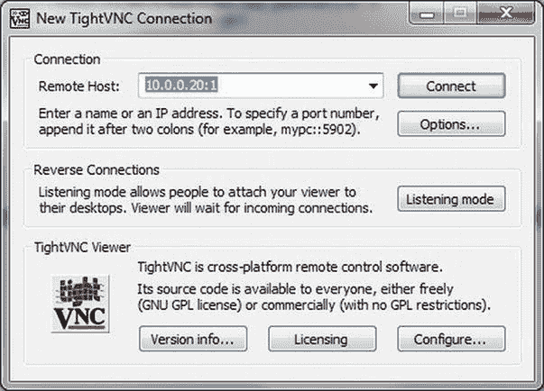
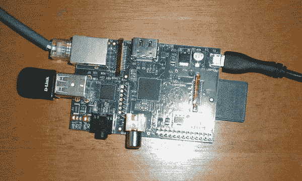
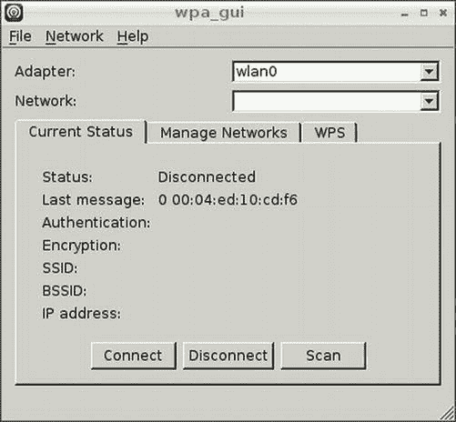
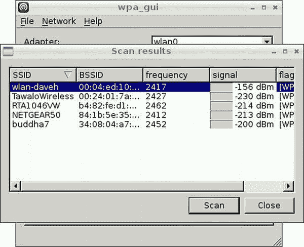
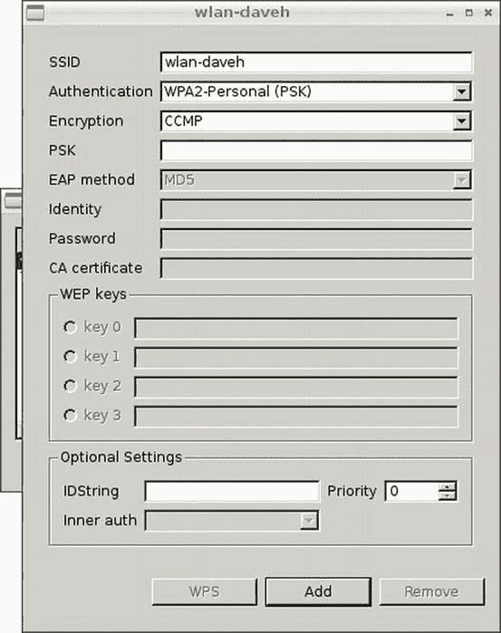
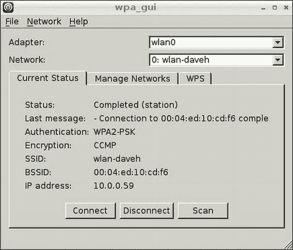
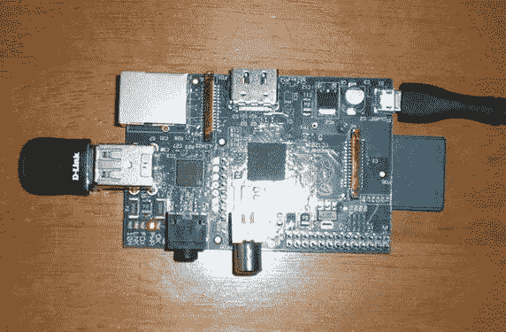
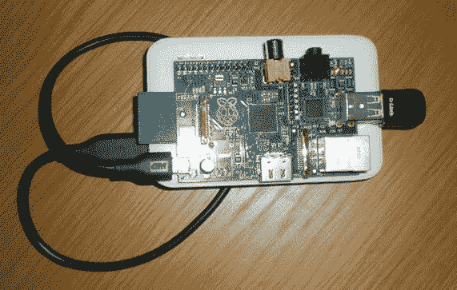
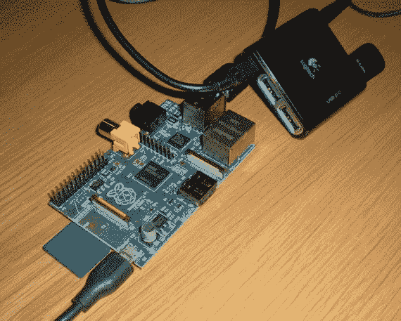

# 9.WiPi:无线计算

树莓派的最大优势之一是它很小，可以放入任何你想得到的小角落或缝隙。这就是为什么它一直被吹捧为人们在设计时使用的最佳选择——它可以放在任何地方，只要有合适的外围设备，几乎可以完成任何任务。此外，它的低功耗意味着在这些情况下使用它的障碍更少，因为它不需要大量的电气管道来“工作”也就是说，树莓派是一个超级小机器，为你的钱提供了巨大的帮助！

然而，这并非没有一些附加条件(见图 [9-1](#Fig1) )！如果没有少量的外部电力供应，所有这些电力都是徒劳的。虽然 5 伏并不多，但它确实需要神奇地进入你的树莓皮中才能打开灯。除了需要电源之外，Pi 本身几乎没有用处，因为除了让电源 LED 点亮和熄灭之外，Pi 在 5 伏电压下几乎没有什么作用。您需要连接设备以使 Pi 有用。要将 Pi 用作简单的家用电脑，您需要(至少)具备以下条件:

图 9-1。

Constrained Pi

*   HDMI 或复合视频电缆
*   用于互联网和网络访问的以太网电缆
*   用来输入数据的键盘
*   提供存储的 SD 卡

突然，你明白我的意思了；树莓派，这个小小的独立超级机器实际上被束缚住了。受限于人类可用性和交互性的需求，这些约束意味着将大量电缆连接到您的 Pi，只是为了从中获得一些基本功能。正如您可能猜到的那样，一切还没有结束！有很多方法可以分离你的 Pi，让它更具移动性，让你可以更灵活地使用它。这就是本章的目的:为您提供工具和一些背景知识来移除约束您的 Raspberry Pi 的电线。

## 准备 WiPi

除了在您的 SD 卡上加载一份 Raspbian 之外，您还需要确保您的 Raspbian 版本已经升级，因为九月份的版本在 WiFi 访问管理方面有了重大改进。要启动这个系统，首先需要运行几个快速命令:

`$ sudo apt-get update`

`$ sudo apt-get upgrade`

这两个命令将首先告诉您的`apt-get`实例进行更新，以了解哪些版本的软件可供您使用。第二个将告诉`apt-get`比较并安装系统上当前安装的所有软件的每个升级版本。可以想象，定期运行这些命令是一个非常好的主意，因为它可以让您的系统运行最新版本的软件。

## 简单约束移除

在你开始随意切断电缆之前，你需要明白你想用你的 Pi 实现什么。这将自动对你想用它做什么设置一些限制。我不能预先假定你想用你的圆周率做什么，因为真的有这么多选择。因此，鉴于此，我将尝试在这里提供一些个人的方法，你可以切断绳索(不是字面上的)和解开你的 Pi。你很可能能够利用你新学到的电缆切割技巧和后面章节中的一些内容来改进设计，或者使它们更好地满足你的目的。

### 移除人工输入设备

从最容易和最低挂的水果开始:显示器，键盘和音频电缆。我知道说一下子去掉三个外围设备是最容易的，这听起来很可笑，但是你真的在等式中去掉了非常不同的东西:你。到目前为止，最容易切断的连接是人机交互设备。事实上，这本书的大部分内容都是为了给你在没有显示器、键盘或扬声器的帮助下使用 Pi 的技巧。这并不是说你不能没有；您可以随时根据需要将它们插回去，以诊断任何真正关键的问题，但是您可以从移除它们并远程管理您的 Pi 开始。这里使用 SSH 是关键，因为您可以使用 SSH 通过网络连接远程连接到您的 Pi。一旦您连接到您的 Pi，您就有完全的命令行访问权来执行您需要的任何任务。还有一个额外的好处是，您可以使用`sudo raspi-config`改变 Pi 中的内存分配，并将`memory_split`的值设置为 240/16，这将把大部分内存放入空闲 RAM 供您的系统使用，并尽可能少地放入您通常不会使用的图形显示中。

在你认为这意味着不再使用显示器和键盘之前，停下来。您想用 Pi 做的所有事情都应该在一个工作环境中进行测试和配置，包括键盘、显示器、鼠标等等，所有这些都可以使用。一旦您的系统进入不受您干扰的工作状态，您就可以打开和关闭电源，而无需在每次您知道应该能够移除所有人机界面设备时跳回来进行管理。这对任何人来说都是一个很好的开始:能够移除所有电缆并远程与您的系统交互。这也意味着你可以做其他事情，如通过你的手机或互联网上的工作系统管理你的树莓派。一旦你有了跨越互联网来管理你的机器的感觉，我保证你会问自己以前没有它你是怎么做的。

### 添加远程 GUI

好吧，虽然我很乐意承认在控制台内工作有一些真正的好处——只是在远程环境中，有些人就是想不通。而且在很多情况下，不管出于什么原因，这都是不切实际的。在这些情况下，最好使用一种叫做虚拟网络计算(VNC)的工具，让您能够从另一台机器上与您的 Pi 桌面进行交互。

为此，您需要在您的 Pi 上安装一个 VNC 服务器，并且在您的机器上需要一个客户机。有许多不同的 VNC 解决方案，只要他们遵守 VNC 协议，他们应该都是兼容的。对于您的 Pi，您将使用 tightvnc，因为它的目标是高效和“紧凑”您可以在 [`www.tightvnc.com`](http://www.tightvnc.com/) 下载 Windows 和 Linux 系统的客户端。但是在您进入客户机之前，首先要在您的 Pi 上安装服务器。运行以下命令:

`$ sudo apt-get install tightvncserver`

此命令将使用包管理工具安装 tightvnc 您的输出应该类似于以下内容:

`Reading package lists... Done`

`Building dependency tree`

`Reading state information... Done`

`The following extra packages will be installed:`

`x11-xserver-utils xfonts-base xfonts-encodings xfonts-utils`

`Suggested packages:`

`tightvnc-java nickle cairo-5c xorg-docs-core`

`The following NEW packages will be installed:`

`tightvncserver x11-xserver-utils xfonts-base xfonts-encodings xfonts-utils`

`0 upgraded, 5 newly installed, 0 to remove and 91 not upgraded.`

`Need to get 7,824 kB of archives.`

`After this operation, 11.7 MB of additional disk space will be used.`

`Do you want to continue [Y/n]?`

一旦您安装了紧密的 VNC 服务器，您需要启动它并让它运行，这样您就可以连接。所以继续执行这个命令:

`$ tightvncserver`

然后会提示您输入一对密码:一个是实际的 VNC 密码，允许您使用鼠标和键盘来操作屏幕；第二个是可选的“仅查看”密码，允许您查看屏幕上的内容，但不能进行交互。执行后，您应该会看到以下内容:

`You will require a password to access your desktops.`

`Password:`

`Warning: password truncated to the length of 8.`

`Verify:`

`Would you like to enter a view-only password (y/n)? n`

`New ’X’ desktop is raspberrypi:1`

`Creating default startup script /home/pi/.vnc/xstartup`

`Starting applications specified in /home/pi/.vnc/xstartup`

`Log file is /home/pi/.vnc/raspberrypi:1.log`

现在您需要做的就是在您希望浏览的机器上连接 tightvnc 客户机。继续启动客户端。我在 Windows 环境下工作，你应该会看到如图 [9-2](#Fig2) 所示的屏幕。

图 9-2。

TightVNC Client

在图 [9-2](#Fig2) 中，你可以看到我已经输入了我的树莓派的 IP 地址和:1。通常 IP 地址后的一个冒号代表一个端口号，但在这种情况下，它代表一个屏幕号。如果你回过头来看一下从紧 VNC 启动的输出，你可以看到它说它创建了一个新的桌面`raspberrypi:1`，这就是我已经连接到的。现在，按下连接键，屏幕上就会出现可爱的粉红色树莓，你可以在树莓 Pi 环境中四处移动。

然而，如果您重新启动，您将再次失去 VNC 服务器，并且运行`tightvncserver`将再次要求您提供凭证。这不是执行此操作的最佳方式，因此，如果您希望重新启动服务器，可以运行以下命令:

`$ vncserver :1 -geometry 1920x1080 -depth 24`

该命令要求在尺寸为 1920 x 1080 的屏幕`:1`上运行一个`vncserver`，这是您的 Pi(全 1080p 高清)的最大分辨率，并将颜色深度设置为 24 位。如果需要，您可以降低这些值以适合您的客户端屏幕尺寸，或者降低您的 Pi 在托管 VNC 连接时使用的资源数量。除此之外，您可能希望在引导时运行您的 VNC 服务器，这样您就不需要 SSH 来建立视频连接。毕竟那只是多余的！简单的方法是将`vncserver`命令添加到`/etc/rc.local`中，因为该文件中的所有内容都会在引导过程中执行。

默认情况下，您的`rc.local`文件将如下所示:

`#!/bin/sh -e`

`#`

`# rc.local`

`#`

`# This script is executed at the end of each multiuser runlevel.`

`# Make sure that the script will "exit 0" on success or any other`

`# value on error.`

`#`

`# In order to enable or disable this script just change the execution`

`# bits.`

`#`

`# By default this script does nothing.`

`# Print the IP address`

`_IP=$(hostname -I) || true`

`if [ "$_IP" ]; then`

`printf "My IP address is %s\n" "$_IP"`

`fi`

`exit 0`

然后，您可以在`exit 0`之前添加下面一行来启动 tightvnc:

`vncserver :1 -geometry 1920x1080 -depth 24`

如果您想要一个正确的启动过程，您可以使用类似下面的脚本作为文件`/etc/init.d/tightvnc`:

`### BEGIN INIT INFO`

`# Provides: tightvnc`

`# Required-Start: $remote_fs $syslog`

`# Required-Stop: $remote_fs $syslog`

`# Default-Start: 2 3 4 5`

`# Default-Stop: 0 1 6`

`# Short-Description: Start Tight VNC Server at boot time`

`# Description: Start Tight VNC Server at boot time.`

`### END INIT INFO`

`#! /bin/sh`

`# /etc/init.d/tightvnc`

`USER=pi`

`HOME=/home/pi`

`export USER HOME`

`case "$1" in`

`start)`

`echo "Starting Tight VNC Server"`

`/usr/bin/vncserver :1 -geometry 1920x1080 -depth 24`

`;;`

`stop)`

`echo "Stopping Tight VNC Server"`

`/usr/bin/vncserver -kill :1`

`;;`

`*)`

`echo "Usage: /etc/init.d/tightvnc {start|stop}"`

`exit 1`

`;;`

`esac`

`exit 0`

创建此文件后，您需要执行以下命令来执行脚本:

`$ sudo chmod +x /etc/init.d/tightvnc`

然后就可以用`/etc/init.d/tightvnc`开始和停止脚本了。请注意，第一次运行该脚本时，您必须再次输入 VNC 密码，因为该脚本是以 root 用户而不是 Pi 用户的身份运行的。最后，您可以将脚本设置为自动启动，如下所示:

`$ sudo update-rc.d tightvnc defaults:`

`update-rc.d: using dependency based boot sequencing`

既然您已经在 Pi 上安装并配置了 VNC，并且能够消除使用 Pi 对人工输入设备的依赖，那么您就可以进入下一个领域了。

## 真正的带 WiFi 的 WiPi

从您早期使用 VNC 和 SSH 的工作中，您将逐渐意识到，在删除人工输入设备的过程中，您已经增加了对网络连接的依赖性。这种依赖性以管理的形式出现，因为你不能再通过键盘和显示器直接交互；您需要另一种访问方法:以太网连接。当然，这仍然是一根电线，所以你最好保留输入设备，对吗？这里有一个非常明显的解决方案——WiFi——但令许多人懊恼的是，Raspberry Pi 没有自带 WiFi。如果您想使用无线适配器，您需要出去为您的 Pi 购买一个无线适配器。

好吧，很简单，你说，然后你去当地的计算机硬件商店买一个无线适配器。你环顾四周。有这么多可用的无线适配器！那么，这几十种中哪一种最适合 Pi 呢？他们都可以和 Pi 一起工作吗？虽然大多数人会凭直觉去挑选最便宜的，适合他们家里 WiFi 设置的，但这不是正确的做法，因为还有其他因素在起作用。

首先，所有的 USB 设备都需要电源，正如你所知，树莓 Pi 需要 5 伏的电源。这意味着您将需要一个运行在较低电量的无线设备(如果您在 Pi 的 USB 上放置太多的消耗，您可能会使它崩溃)，或者您将需要投资一个连接到外部电源的供电 USB 设备(对您的目的来说不是很好，但我将在稍后介绍这一点，因为它们还有其他用途)。所以你需要留意权力；您还需要注意兼容性，因为一些陌生的无线适配器可能不支持 Linux 系统。我已经包含了一些来自 Raspberry Pi 社区的数据，这些数据是关于他们使用各种无线适配器的体验，以补充我自己的数据。

如图 [9-3](#Fig3) 所示，我选择使用从当地技术商店购买的 D-Link DWA-131 无线适配器。本例的其余部分将介绍使用 DWA-131 让您的 Pi 与您的本地无线网络通信的一些基础知识。

图 9-3。

D-Link DWA-131 802.11n wireless N nano adapter Note

当您连接无线适配器时，您的 Pi 可能会重新启动，因此请事先保存所有工作。

这并不意味着您需要单独使用这个特定的适配器；一旦您成功地让无线适配器正确注册，大多数无线适配器与您的 Pi 一起工作的设置过程应该是相同的。所以事不宜迟，开始并插入无线适配器，开始工作。板卡的当前状态如图 [9-4](#Fig4) 所示。

图 9-4。

Three down, two to go!

正如你所看到的，我仍然有我的以太网电缆连接到现在。我将向您展示如何从命令行和 GUI 在您的 Pi 上配置无线。在您直接进入配置之前，您需要确切地知道您正在处理什么，所以进入 shell 并运行`lsusb`命令，它就像`ls`命令一样，但是用于 USB 设备。

`$ lsusb`

`Bus 001 Device 001: ID 1d6b:0002 Linux Foundation 2.0 root hub`

`Bus 001 Device 002: ID 0424:9512 Standard Microsystems Corp.`

`Bus 001 Device 003: ID 0424:ec00 Standard Microsystems Corp.`

`Bus 001 Device 004: ID 07d1:3303 D-Link System DWA-131 802.11n Wireless N Nano Adapter(rev.A1) [Realtek RTL8192SU]`

完美！您可以从这个命令中看到，我的无线适配器已经被系统识别，应该可以正常工作了——太棒了。如果没有，不要害怕；您只需要为您的特定网卡安装驱动程序。少量的谷歌研究，你应该可以找到无线网卡的芯片组。芯片组是指无线适配器内“运行”无线适配器的小硅芯片。芯片组通常是由完全不同的公司制造的，与设备上显示的公司不同，您需要与芯片组进行交互，从而决定您需要找到哪些驱动程序。一旦你找到了芯片组，快速搜索应该会指出你需要安装什么驱动程序包。一旦您安装了您的驱动程序包，并且您可以在`lsusb`中看到您的无线适配器，您就可以进入下一步。

因为您已经安装并注册了设备，所以您应该检查该设备是否已正确注册为网络设备。在使用 Linux 时，最常用的网络管理工具是`ifconfig`。所以继续运行`ifconfig`并检查输出:

`$ ifconfig`

`eth0      Link encap:Ethernet  HWaddr b8:27:eb:8a:46:ba`

`inet addr:10.0.0.20  Bcast:10.0.0.255  Mask:255.255.255.0`

`UP BROADCAST RUNNING MULTICAST  MTU:1500  Metric:1`

`RX packets:6558 errors:0 dropped:0 overruns:0 frame:0`

`TX packets:268 errors:0 dropped:0 overruns:0 carrier:0`

`collisions:0 txqueuelen:1000`

`RX bytes:374403 (365.6 KiB)  TX bytes:28129 (27.4 KiB)`

`lo        Link encap:Local Loopback`

`inet addr:127.0.0.1  Mask:255.0.0.0`

`UP LOOPBACK RUNNING  MTU:16436  Metric:1`

`RX packets:0 errors:0 dropped:0 overruns:0 frame:0`

`TX packets:0 errors:0 dropped:0 overruns:0 carrier:0`

`collisions:0 txqueuelen:0`

`RX bytes:0 (0.0 B)  TX bytes:0 (0.0 B)`

`wlan0     Link encap:Ethernet  HWaddr 90:94:e4:51:81:7a`

`UP BROADCAST RUNNING MULTICAST  MTU:1500  Metric:1`

`RX packets:0 errors:0 dropped:0 overruns:0 frame:0`

`TX packets:0 errors:0 dropped:0 overruns:0 carrier:0`

`collisions:0 txqueuelen:1000`

`RX bytes:0 (0.0 B)  TX bytes:0 (0.0 B)`

之前的配置实际上显示了三个设备的信息，而不仅仅是无线适配器的信息(其中两个您在第 3 章中看到过):

*   它首先显示了作为物理以太网设备的`eth0`设备。
*   接下来是`lo`适配器；回想一下，这是系统的内部自引用设备，当您想要将流量从其自身寻址到 Pi(或任何系统)内部时，可以使用该设备。
*   最后你有`wlan0`，这是无线设备。您应该能够注意到`eth0`和`lo`设备与`wlan`设备之间的一些差异——它没有 IP 地址(用`inet addr`表示)或掩码。这些是您需要配置的内容，以便让它与您的无线网络进行对话，以及您的无线网络 SSID 和安全安排的详细信息。所以这将是你的下一步。

如果您的适配器没有出现，但是在`lsusb`中注册了，重新启动并执行相同的故障诊断步骤。系统可能能够识别您的设备，但无法与之正确连接。为您的系统安装一个驱动程序包可能是这里的解决方案。

首先，让这变得简单，通过 GUI 进行配置，具有讽刺意味的是，这涉及到通过命令行安装某些东西。继续启动`apt-get`来安装`wpa-gui`。WPA GUI 是最近添加到 Raspbian 中的一个应用程序，它使无线设备的安装和配置变得非常非常简单。事实上，这是最近的事，这一章需要重写以包含它，因为在第一轮写作中使用的 Raspbian 版本不包含它！如果您不确定是否有正确的版本，您应该运行这个命令，因为这样做没有坏处。安装该应用程序的命令如下:

`$ sudo apt-get install wpagui`

如果您有包含`wpagui`的 Raspbian 的最新版本，您将看到下面的输出，表明该包已经安装:

`Reading package lists... Done`

`Building dependency tree`

`Reading state information... Done`

`wpagui is already the newest version.`

`0 upgraded, 0 newly installed, 0 to remove and 0 not upgraded.`

如果您尚未安装该软件包，您的安装将如下所示:

`Reading package lists... Done`

`Building dependency tree`

`Reading state information... Done`

`The following extra packages will be installed:`

`libaudio2 liblcms1 libmng1 libqt4-svg libqtcore4 libqtgui4 menu`

`Suggested packages:`

`nas liblcms-utils qt4-qtconfig menu-l10n`

`The following NEW packages will be installed:`

`libaudio2 liblcms1 libmng1 libqt4-svg libqtcore4 libqtgui4 menu wpagui`

`0 upgraded, 8 newly installed, 0 to remove and 96 not upgraded.`

`Need to get 8,921 kB of archives.`

`After this operation, 22.6 MB of additional disk space will be used.`

`Do you want to continue [Y/n]?`

太棒了！现在你已经安装了`wpagui`，你应该可以通过用户界面很好地利用它。但是在您开始之前，请继续重新启动您的 Pi，因为您已经对 Pi 管理网络连接的方式进行了重大更改，并且您希望在继续之前确保它是防爆的。穿好了吗？你可以运行`ifconfig`并且输出看起来是一样的，很棒。

现在您可以开始配置您的无线适配器。您将从 GUI 开始，然后看看如何通过命令行来完成。

Note

如果您注意到您的 Pi 变慢或无法连接到 WiFi，可能是您的键盘消耗了太多的电量。尝试移除它并使用 VNC 或 SSH 来配置您的无线网络。

### GUI WiFi 配置

登录 GUI，应该会有一个名为 WiFi Config 的新图标，如图 [9-5](#Fig5) 所示。

图 9-5。

WiFi Config icon

双击此图标打开应用程序，您应该会看到 wpagui 窗口，如图 [9-6](#Fig6) 所示。

图 9-6。

wpa_gui window

在 wpagui 窗口中，按下扫描按钮。这需要一些时间，但是会弹出另一个窗口，如图 [9-7](#Fig7) 所示。

图 9-7。

Scan results window

这个窗口应该大家都很熟悉。这是选择无线网络的窗口。找到您的特定网络，然后双击它以打开配置窗口(参见图 [9-8](#Fig8) )。

图 9-8。

Network details

我假设您应该准备好了设置配置的详细信息。大部分都是直观的，但有几件事你需要注意:

*   SSID 是您的无线网络的“名称”,因此您需要键入此名称。
*   接下来是身份验证，它指定了您正在使用的身份验证类型:WEP、WPA、WPA2 等等。
*   接下来是加密，它选择您将使用的加密模式。
*   最后是 PSK，代表预共享密钥。这是你的 WiFi 密码。

现在转到“无线安全”选项卡，设置您用于 WiFi 的身份验证方法、加密方法和密码。这些信息通常在路由器的配置系统中，但也可以写在路由器本身或路由器手册中。现在点击添加。您的无线设置应该保存到系统中，系统将获取这些设置并开始尝试连接到您的适配器；过一会儿，您应该会看到类似图 [9-9](#Fig9) 的内容。

图 9-9。

WiFi connected!

如果您没有看到这一点，请查看鼠标悬停消息，它会让您了解您的连接出现了什么问题。检查您的设置是否正确，以及您是否选择了正确的安全方法。如果有疑问，请打开您的路由器配置进行仔细检查。最后，您可以回到控制台，再次发出`ifconfig`来检查您的无线适配器设置！

`wlan0     Link encap:Ethernet  HWaddr 90:94:e4:51:81:7a`

`inet addr:10.0.0.59  Bcast:10.0.0.255  Mask:255.255.255.0`

`UP BROADCAST RUNNING MULTICAST  MTU:1500  Metric:1`

`RX packets:772 errors:0 dropped:10 overruns:0 frame:0`

`TX packets:35 errors:0 dropped:0 overruns:0 carrier:0`

`collisions:0 txqueuelen:1000`

`RX bytes:100749 (98.3 KiB)  TX bytes:4254 (4.1 KiB)`

这看起来更像你所期望的；它有一个 IP 地址、掩码等等。它还显示它一直在无误地发送和接收数据包(即 RX 和 TX 数据包编号)。最后的测试是从第二台机器 ping 那个 IP 地址，就这样。现在，您可以移除以太网电缆了。作为最后的测试，继续并重新启动；重新启动后，您应该能够 ping 通系统的`wlan0` IP 地址，这表明您已经成功地保存了重新启动后存储的无线适配器详细信息。现在，您可以移除下一根电缆并重新启动，以确保您的系统默认使用无线适配器。

### 从命令行管理 WiFi

对于那些不太想使用 GUI 或者认为自己是真正的 Linux 传统的纯粹主义者(只使用命令行来管理系统)的人来说，这正是适合你的地方！为此，您将修改网络管理器配置。NetworkManager 系统决定如何管理以太网设备的基本方法有两种:

*   它检查是否设置了`/etc/NetworkManager/NetworkManager.conf`中的`managed`标志。
*   它接管在`/etc/network/interfaces`中配置的任何东西的管理；这些设置说明应该如何管理该设备。

您不希望 NetworkManager 系统从上面接管您的设置，所以您需要确保它不会这样做。只有在您之前安装了 GUI，或者 NetworkManager 与您的 Raspbian 映像捆绑在一起时，这才会是一个问题，但是最好是彻底的。所以继续检查`/etc/NetworkManager/NetworkManager.conf`并确保`managed`标志被设置为`false`。该文件应该类似于:

`[main]`

`plugins=ifupdown,keyfile`

`[ifupdown]`

`managed=false`

一旦完成，继续重新启动您的 Pi；您希望确保 Pi 正确启动，并且所有现有的以太网连接在第一次重新启动后都工作正常。现在您需要将配置添加到`/etc/network/interfaces`中，以便它知道如何管理设备并连接到您的 WiFi。所以请继续打开`/etc/network/interfaces`。您将看到该文件已经部分填充了以下行:

`auto lo`

`iface lo inet loopback`

`iface eth0 inet dhcp`

根据您的系统是否已经进行了一些无线配置，您可能还会在文件中看到以下几行。

`allow-hotplug wlan0`

`iface wlan0 inet manual`

`wpa-roam /etc/wpa_supplicant/wpa_supplicant.conf`

`iface default inet dhcp`

这些行分别对应于 loopback 和`eth0`设备，并提供一些关于它们管理的简单细节；在这种情况下，环回是一个自动管理的环回设备，`eth0`设备通过 DHCP 获得一个 IP 地址。您的`wlan0`设备可能也有一些现有配置；如果它们存在，您应该通过在它们前面添加一个`#`来注释掉它们，或者从文件中删除它们。您现在需要为`wlan0`无线设备添加一个新的配置，所以继续将以下内容添加到您的配置中现有内容的下方:

`auto wlan0`

`iface wlan0 inet dhcp`

`wpa-ssid <Your WiFi SSID>`

`wpa-psk <Your WiFi password>`

这个块表示您将拥有一个自动管理的`wlan0`设备，它通过 DHCP 获取其连接信息。你还把 SSID 和 PSK 传给它。此配置将适用于 WPA 和 WPA2 网络安全实施。完成后，就该测试您的新设备了，所以继续运行下面的代码，这将启动界面。这可能需要一些时间，但是您的输出应该类似于我的输出:

`$ sudo ifdown wlan0`

`$ sudo ifup wlan0`

`Internet Systems Consortium DHCP Client 4.2.2`

`Copyright 2004-2011 Internet Systems Consortium.`

`All rights reserved.`

`For info, please visit`[`https://www.isc.org/software/dhcp/`T3】](https://www.isc.org/software/dhcp/)

`Listening on LPF/wlan0/90:94:e4:51:81:7a`

`Sending on   LPF/wlan0/90:94:e4:51:81:7a`

`Sending on   Socket/fallback`

`DHCPDISCOVER on wlan0 to 255.255.255.255 port 67 interval 8`

`DHCPDISCOVER on wlan0 to 255.255.255.255 port 67 interval 15`

`DHCPDISCOVER on wlan0 to 255.255.255.255 port 67 interval 9`

`DHCPREQUEST on wlan0 to 255.255.255.255 port 67`

`DHCPOFFER from 10.0.0.1`

`DHCPACK from 10.0.0.1`

`bound to 10.0.0.59 ˗˗ renewal in 444671 seconds.`

所有这些都表明，该设备已经连接到我的无线网络，并通过 DHCP 获得了一个 IP 地址，这正是你告诉它要做的！现在假设你不想用 DHCP，而是宁愿给你的 WiFi 适配器一个静态 IP 地址。你只需要将`iface`行改为`static`而不是`dhcp`，然后添加你的 IP 地址、子网掩码和网关的详细信息。您的配置将改为如下所示:

`auto wlan0`

`iface wlan0 inet static`

`address 10.0.0.57`

`netmask 255.255.255.0`

`gateway 10.0.0.1`

`wpa-ssid <Your WiFi SSID>`

`wpa-psk <Your WiFi password>`

现在您已经成功地在系统上配置了无线，您可以继续并重新启动您的 Pi 来检查无线适配器是否自动启动。如果没有，返回并确保您设置了`auto wlan0`并且您在网络管理器配置文件中启用了`managed=false`标志。

如果这不起作用，请检查 SSID 和 WiFi 密码的配置设置。您可以使用`ifup wlan0`确认是否可以启动您的无线适配器；如果在连接和获取 IP 地址时出现问题，您的系统应该在这里显示出来，让您有机会找出问题所在。最后，如果你只是不能让它运行，尝试删除任何其他连接的 USB 设备；它们会从您的 WiFi 适配器吸取宝贵的能量。

命令行上最后一件可能对您有帮助的事情是`iw`系列命令:

*   您可以使用`scan`选项运行`iwlist`来扫描附近无线热点的信息。
*   或者您可以使用`iwconfig`来获取关于您的无线适配器的配置细节。

### 只剩一个

恭喜你，你即将拥有一个完全无线的树莓派！您已经成功消除了对以太网电缆的需求，现在您可以无线访问您的 Pi。现在应该只剩下一根电缆了！(参见图 [9-10](#Fig10) )。

图 9-10。

Last cable standing

## 消除对电源的需求

你能做的很少，以简化为你的树莓派供电的需求；它需要它，而这个问题的解决方案是有限的。到目前为止，最容易和方便的是获得一个大的 USB 电池。如今，这种充电器几乎随处可见，可以为人们经常随身携带的许多设备充电。这里的简单解决方案是将您的 Pi 连接到这些电池中的一个来使用，因为这种电池应该保证向您的 Pi 输出正确的功率水平，因为它们是为 USB 设备供电而设计的。当考虑用电池给你的 Pi 供电时，重要的是要确定它们能提供 1 安培的功率，因为一些 USB 电池可以充电，但不能提供足够的电量给 Pi 供电。图 [9-11](#Fig11) 显示了最终的 WiPi。

图 9-11。

WiPi at long last!

有一些将可充电电池和太阳能电池板结合起来的方法，对你来说会走得更远，但这些都超出了本书的范围。

## 供电 USB 适配器

我之前提到过，如果你在你的 Pi 的 USB 上放太多的电源，你可能会使它崩溃，因为它自己只有有限的电源。解决方案是把你的手放在一个通电的 USB 集线器上。这些供电集线器通常有一个输出连接和多个输入连接，还会有一个电源连接来供电。其原理是，人们很少使用 USB 的全部数据传输量，但经常会耗尽电量，因此，有一种方法可以用市电电源补充 USB 设备的电量，这是一种很好的方法，可以让人们更加灵活地使用他们的设备。如果您发现当您连接您的设备时，您的 Pi 会自动关闭，这是一个公平的赌注，您将需要类似这样的东西来帮助分散电力负载(见图 [9-12](#Fig12) )。

图 9-12。

Powered USB hub in action

## 摘要

做了这么多工作，你应该已经看到了很大的回报。您现在应该知道如何配置您的 Pi 以使其无线化。除了正常的 SSH 连接之外，您应该能够通过 VNC 客户端设置并连接到您的 Pi。您已经学习了如何配置您的 Raspberry Pi 来获取无线适配器，并可以将其连接到您现有的无线网络。最后，您应该了解 Pi 在功耗方面的一些限制，以及如何解决这些问题。