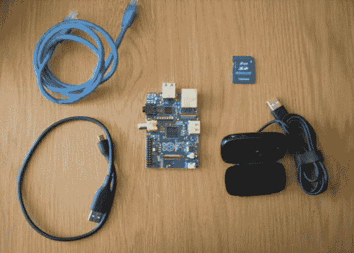
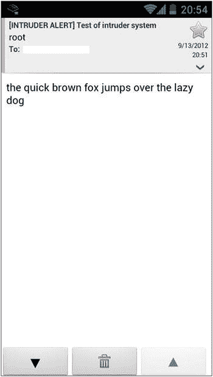
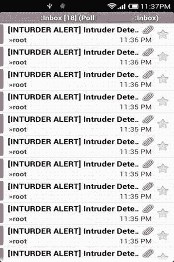
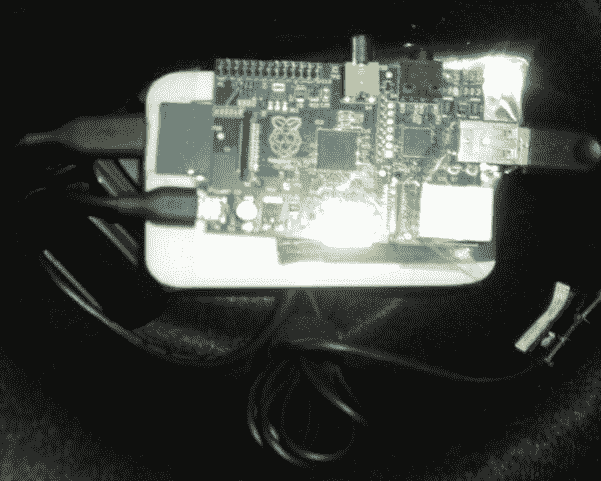

# 十、树莓派

每个人都想成为詹姆斯·邦德。或者至少我知道我有。他似乎陷入了各种各样的情况；然后拿出一个方便的小工具来拯救世界。正如我们所展示的，树莓派对于这样一个小小的硬件来说是极其通用的。这使得它成为一个特工的完美工具，因为只需要一点点能量，你就可以提供一个成熟的技术解决方案，而花费的成本只是雇佣约翰·克立斯的一小部分(不可否认，Pi 并不那么有趣)。考虑到这一点，我们现在可以穿上晚礼服，开始秘密特工的工作了。

所有优秀的特工都知道，你需要能够发现并警惕秘密藏身处的入侵者。因此，这是向您介绍树莓 sPi 的最佳时机！树莓 sPi 是一个间谍相机和警报系统的组合，是发现卑鄙的入侵者进入你的密室的完美解决方案！或者通过互联网监控你的宠物。这里的基本概念是我们将配置我们的 Raspberry Pi。所以事不宜迟，我们开始吧。

## 所需材料

以下是本项目所需的材料(也见图 [10-1](#Fig1) ):

图 10-1。

The Raspberry sPi kit

*   1 个树莓派
*   1 根微型 USB 电缆(用于电源)
*   1x 以太网电缆
*   1 个 USB 网络摄像头
*   1 张 SD 卡

在这一点上，你应该注意到并不是所有的网络摄像头都与 Raspberry Pi 兼容。此文档是用 Logitech C525 网络摄像头创建的。值得庆幸的是，Pi 社区维护了一个兼容硬件的列表，可在 [`http://elinux.org/RPi_VerifiedPeripherals#USB_Webcams`](http://elinux.org/RPi_VerifiedPeripherals#USB_Webcams) 获得。如果您有疑问，请在那里查看哪些外设可以与您的 Pi 配合使用。

## 预设

这里没什么特别的；只需连接微型 USB 以获取电源，连接以太网以访问网络，连接 SD 以进行存储，并确保相机保持独立——我们稍后会这样做。此过程的其余部分假设您熟悉以下内容:

*   安装 Raspbian 操作系统
*   了解如何在 Raspbian Linux 环境下工作

如果你对这两者都不熟悉，那也没关系。这就是这本书的目的，所以请回过头来阅读[第 1 章](01.html)以了解如何开始使用 Raspbian，以及这本书的第 2 部分以熟悉在 Raspbian Linux 环境中工作。

## 入门指南

所以，事不宜迟，我们开始吧。继续加载 Raspbian 并将您的 Pi 连接到您的网络。浏览 Raspbian 设置过程，并确保启用 SSH，因为稍后您将需要远程登录。(我们看不到詹姆斯·邦德带着键盘、HDMI 线和显示器，不是吗？)一旦你设置好了，继续 SSH 到你的 Pi(在[第 3 章](03.html)中讨论)。

好的，一旦你登录，继续发出命令`dmesg`并查看输出。

### dmesg-一般信息

`dmesg`命令是一个名为驱动程序消息的工具，它向内核显示所有消息的日志输出，包括来自设备和连接到您系统的驱动程序的消息。`dmesg`在确定连接了哪些设备，以及您应该在哪里以及如何与它们交互方面非常有用。它还列出了在诊断低级问题时非常有用的驱动程序和内核消息。那么，让我们来看看输出的相关部分。

Note

`less`是更。如果您发现某个命令的输出超出了屏幕的顶部，您再也看不到它了，重新发出该命令，然后通过管道将其发送到`less (`，即`dmesg | less`。这应该允许您使用箭头键和空格键向下翻页来浏览任何命令的输出。

`[    1.998581] Waiting for root device /dev/mmcblk0p2...`

`[    2.071268] mmc0: new high speed SD card at address 7d37`

`[    2.079917] mmcblk0: mmc0:7d37 SD02G 1.83 GiB`

`[    2.088723]  mmcblk0: p1 p2`

`[    2.132278] EXT4-fs (mmcblk0p2): mounted filesystem with ordered data mode. Opts: (null)`

`[    2.145275] VFS: Mounted root (ext4 filesystem) on device 179:2.`

`[    2.155272] Freeing init memory: 200K`

`[    2.187333] usb 1-1: new high speed USB device number 2 using dwc_otg`

`[    2.418045] usb 1-1: New USB device found, idVendor=0424, idProduct=9512`

`[    2.427750] usb 1-1: New USB device strings: Mfr=0, Product=0, SerialNumber=0`

`[    2.438708] hub 1-1:1.0: USB hub found`

`[    2.445041] hub 1-1:1.0: 3 ports detected`

`[    2.727674] usb 1-1.1: new high speed USB device number 3 using dwc_otg`

`[    2.837920] usb 1-1.1: New USB device found, idVendor=0424, idProduct=ec00`

`[    2.857413] usb 1-1.1: New USB device strings: Mfr=0, Product=0, SerialNumber=0`

`[    2.878968] smsc95xx v1.0.4`

`[    2.942985] smsc95xx 1-1.1:1.0: eth0: register ’smsc95xx’ at usb-bcm2708_usb-1.1, smsc95xx USB 2.0 Ethernet, b8:27:eb:8a:46:ba`

`[   11.006171] EXT4-fs (mmcblk0p2): re-mounted. Opts: (null)`

`[   11.426960] ### snd_bcm2835_alsa_probe c05c88e0 ############### PROBING FOR bcm2835 ALSA device (0):(1) ###############`

`[   11.442869] Creating card...`

`[   11.448268] Creating device/chip ..`

`[   11.454771] Adding controls ..`

`[   11.460340] Registering card ....`

`[   11.475463] bcm2835 ALSA CARD CREATED!`

`[   11.487786] ### BCM2835 ALSA driver init OK ###`

`[   18.493739] smsc95xx 1-1.1:1.0: eth0: link up, 100Mbps, full-duplex, lpa 0x45E1`

`[   24.672322] Adding 102396k swap on /var/swap.  Priority:-1 extents:1 across:102396k SS`

如您所见，`dmesg`的输出有点令人不快，难以理解。许多信息依赖于对`dmesg`系统如何工作的一些基本原则的理解。首先是方括号`[`和`]`内的数值。该值是一个定时器值，用于记录自系统启动以来经过的时间。这是一个很好的方法来跟踪你系统中的事件顺序，并把最近发生的和过去发生的区分开来。

接下来是内容本身。这些行中的大部分单独在诊断上是没有用的，但是它们合在一起形成了一幅非常有趣的画面，描绘了我的 Pi 中到底发生了什么。让我们从第一行开始:

`waiting on root device /dev/mmcblk0p2`

前几行很明显:系统在等待什么，但什么是`/dev/mmcblk0p2`？好吧，第一个赠品是`/dev`；这是 Linux 操作系统列出所有设备的地方，所以我们知道`/dev/mmcblk0p2`是一个设备。其次是`mmcblk0p2`，它看起来像一串垃圾，但实际上是一系列缩写。

*   `mmc`表示多媒体卡(闪存设备标准)
*   `blk`表示块存储设备
*   `0`表示这种类型的第一个逻辑设备
*   `p2`表示装置的两个隔板

所以我们在等 SD 卡。第二到第四行是我们正在等待的:SD 卡注册，你可以看到它实际上注册为我们提到的每一个子设备，按顺序没有减少！之后，接下来的两行是在这个设备上挂载可读文件系统的设备。继续往下，您可以看到 Pi 的 USB 设备的注册(第 8-15 行)，它的以太网端口(第 16、17 和 26 行)，最后是一个高级 Linux 声音架构(ALSA)设备，它是音频端口(第 19-25 行)。

现在你明白了我们为什么不一开始就连接网络摄像头，我想看看`dmesg`输出。既然你知道要找什么，现在继续连接你的网络摄像头并再次运行`dmesg`。看看出现的新系列。这些应该都和你新附加的网络摄像头有关！下面是我附加我的输出:

`[ 8168.793423] usb 1-1.2: new high speed USB device number 4 using dwc_otg`

`[ 8169.147691] usb 1-1.2: New USB device found, idVendor=046d, idProduct=081d`

`[ 8169.147736] usb 1-1.2: New USB device strings: Mfr=0, Product=0, SerialNumber=1`

`[ 8169.147758] usb 1-1.2: SerialNumber: 8627F4C0`

`[ 8169.314171] Linux video capture interface: v2.00`

`[ 8169.336482] uvcvideo: Found UVC 1.00 device <unnamed> (046d:081d)`

`[ 8169.402071] input: UVC Camera (046d:081d) as /devices/platform/bcm2708_usb/usb1/1-1/1-1.2/1-1.2:1.2/input/input0`

`[ 8169.402280] usbcore: registered new interface driver uvcvideo`

`[ 8169.402299] USB Video Class driver (1.1.1)`

`[ 8169.460903] usbcore: registered new interface driver snd-usb-audio`

那么，从这些线条中你能看出什么？首先，您可以在`dmesg`日志中看到这个特定条目的时间差异很大，它代表了从启动到我连接设备之间的延迟。接下来，您将认识到前四行代表 USB 端口接收新连接的设备；事实上，第一行引用了用于完成这个任务的模块`dwc_otg`(DesignWare Cores 的缩写——On The Go)。第 5 行显示它是一个视频捕获接口，第 6 行显示模块`uvcvideo`找到了一个它识别并注册的 USB 视频类(UVC)设备。最后，我们还可以看到网络摄像头的麦克风也已经在最后一行注册为`snd-usb-audio`设备。从这里我们可以看到我的网络摄像头已经连接上了，并通过驱动程序注册到了操作系统中。

既然设备已经注册，我们需要一种方法来引用它，以便它可以被应用程序使用。您会注意到,`dmesg`输出实际上并没有指定我们添加了哪个设备，所以让我们看一下，看我们是否能以另一种方式匹配它。先来列举一下`/` `dev`的内容(结果如图 [10-2](#Fig2) )。

图 10-2。

Contents of /dev directory

`$ ls /dev/`

那是一些设备。我们可以马上删除一些:所有的`tty`设备，因为它们是电传打字设备；所有的`ram`设备，因为那是 Pi 的 RAM 所有的`loop`设备，因为它们是回环连接器；所有的`memblck`设备，因为它们与 SD 卡相关；所有的`vcs`设备，因为它们是虚拟控制台。还是有几个，但是最好看的是`video0`。我们在找一个网络摄像头，对吗？它注册为视频捕获设备，不是吗？好吧，我们认为这是对的——但是我们怎么知道呢？

`udev`，更确切地说是`udev`管理函数，是 Linux 内核的设备管理器。它控制设备如何以及在哪里注册自己，以便它们可以作为操作系统的一部分被应用程序访问。在 Debian(以及 Raspbian)中，`udev`的内部工作方式可以通过`udevadm`命令访问，所以让我们开始使用它吧。执行以下操作:

`$ udevadm info -a -p  $(udevadm info -q path -n /dev/video0)`

`P: /devices/platform/bcm2708_usb/usb1/1-1/1-1.2/1-1.2:1.2/video4linux/video0`

`N: video0`

`S: v4l/by-id/usb-046d_081d_8627F4C0-video-index0`

`S: v4l/by-path/platform-bcm2708_usb-usb-0:1.2:1.2-video-index0`

`E: DEVLINKS=/dev/v4l/by-id/usb-046d_081d_8627F4C0-video-index0 /dev/v4l/by-path/platform-bcm2708_usb-usb-0:1.2:1.2-video-index0`

`E: DEVNAME=/dev/video0`

`E: DEVPATH=/devices/platform/bcm2708_usb/usb1/1-1/1-1.2/1-1.2:1.2/video4linux/video0`

`E: ID_BUS=usb`

`E: ID_MODEL=081d`

`E: ID_MODEL_ENC=081d`

`E: ID_MODEL_ID=081d`

`E: ID_PATH=platform-bcm2708_usb-usb-0:1.2:1.2`

`E: ID_PATH_TAG=platform-bcm2708_usb-usb-0_1_2_1_2`

`E: ID_REVISION=0010`

`E: ID_SERIAL=046d_081d_8627F4C0`

`E: ID_SERIAL_SHORT=8627F4C0`

`E: ID_TYPE=video`

`E: ID_USB_DRIVER=uvcvideo`

`E: ID_USB_INTERFACES=:010100:010200:0e0100:0e0200:`

`E: ID_USB_INTERFACE_NUM=02`

`E: ID_V4L_CAPABILITIES=:capture:`

`E: ID_V4L_PRODUCT=UVC Camera (046d:081d)`

`E: ID_V4L_VERSION=2`

`E: ID_VENDOR=046d`

`E: ID_VENDOR_ENC=046d`

`E: ID_VENDOR_ID=046d`

`E: MAJOR=81`

`E: MINOR=0`

`E: SUBSYSTEM=video4linux`

`E: TAGS=:udev-acl:`

`E: UDEV_LOG=3`

`E: USEC_INITIALIZED=8168852755`

哇，好吧，这是一大块看起来很吓人的输出。我相信你现在已经猜到了，我们刚刚请求`udev`系统给我们一个信息查询，查询与名为`/dev/video0`的设备相关的所有信息，它确实有。然而，在过度换气开始之前，实际上看一看前几行。第一行应该很熟悉——这是我们在`dmesg`中看到的连接网络摄像头时的设备标识符！事实上，这里的大部分信息都是在`dmesg`块中引用的数据。好了，既然我们可以将来自`dmesg`的设备与我们系统中的设备进行匹配，那么可以有把握地说，我们附加的 USB 网络摄像头在文件系统中的名称是`/dev/video0`。

### 解决纷争

如果和我的不同，你的网络摄像头在`dmesg`中注册内核时出现问题，你可能需要安装一个驱动程序。你应该向制造商查询，并上网查看是否有适用于你的摄像头的驱动程序。如果是这样，安装驱动程序，然后尝试重新连接您的网络摄像头，看看它是否可以注册。你甚至可能很幸运，你的设备驱动程序会有一个内核列表，在这个列表中，网络摄像头被注册在`dmesg`的`/dev`中——就像前面例子中我的 SD 卡一样。

此外，如果您没有列出像`/dev/video0`这样的设备，您应该检查其他设备是否与来自`dmesg`的与您的设备相关的输出相匹配。当 Linux 试图在`/dev`文件系统的布局上变得明智时，制造商和软件工程师可以做一些有趣的事情来试图脱颖而出——结果是你坐在那里尖叫着你怎么找不到一个设备。因此，请耐心地四处看看，并使用排除法来尝试找出您的设备连接到了哪里。这里的目标是确保您知道哪个`/dev`文件引用了您的网络摄像头。

## 动作捕捉

好的，系统配置完毕，检查完毕。已连接网络摄像头，请检查。现在让我们让这一切真正做点什么吧！为了进行网络摄像头捕捉，我们将使用 Linux 动作捕捉，讽刺地命名为运动。因此，让我们继续安装它。运行以下命令，指示 apt-get 下载并安装 motion 包:

`$ sudo apt-get install motion`

您的输出应该如下所示:

`Reading package lists... Done`

`Building dependency tree`

`Reading state information... Done`

`The following extra packages will be installed:`

`ffmpeg libav-tools libavcodec53 libavdevice53 libavfilter2 libavformat53 libavutil51 libdc1394-22 libdirac-You`

`libjack-jackd2-0 libmp3lame0 libpostproc52 libpq5 libraw1394-11 libschroedinger-1.0-0 libspeex1 libswscale2 libtheora0 libva1`

`libvpx1 libx264-123 libxvidcore4`

`Suggested packages:`

`jackd2 libraw1394-doc speex mysql-client postgresql-client`

`The following NEW packages will be installed:`

`ffmpeg libav-tools libavcodec53 libavdevice53 libavfilter2 libavformat53 libavutil51 libdc1394-22 libdirac-encoder0 libgsm1`

`libjack-jackd2-0 libmp3lame0 libpostproc52 libpq5 libraw1394-11 libschroedinger-1.0-0 libspeex1 libswscale2 libtheora0 libva1`

`libvpx1 libx264-123 libxvidcore4 motion`

`0 upgraded, 24 newly installed, 0 to remove and 71 not upgraded.`

`Need to get 8,365 kB of archives.`

`After this operation, 17.6 MB of additional disk space will be used.`

`Do you want to continue [Y/n]? y`

我不知道你怎么想，但是我太兴奋了，不想为所有的设置和配置费心；让我们启动 motion，看看它会做什么！以此开始:

`$ motion –s`

摄像机上的灯亮了，开拍！开始挥舞和移动，因为你想它抓住你！

`[1] Changes:  3374 - noise level: 15`

`[1] Changes:  3198 - noise level: 15`

`[1] Changes:  3011 - noise level: 15`

`[1] Changes:  2922 - noise level: 15`

`[1] Changes:  2555 - noise level: 15`

`[1] Changes:  2390 - noise level: 15`

`[1] Changes:  2491 - noise level: 15`

`[1] Changes:  2874 - noise level: 15`

`[1] Changes:  2817 - noise level: 15`

`[1] Changes:  3238 - noise level: 15`

`[1] Changes:  3093 - noise level: 15`

`[1] Motion detected - starting event 1`

`[1] File of type 1 saved to: ./01-20120910203217-05.jpg`

`[1] Changes:  2912 - noise level: 15`

`[1] File of type 1 saved to: ./01-20120910203217-06.jpg`

`[1] Changes:  2480 - noise level: 15`

`[1] File of type 1 saved to: ./01-20120910203217-07.jpg`

就这样，你可以看到它捕捉图像中的变化，并记录你移动时噪声水平的任何变化。最后，它捕捉图像！如果根据您的 SD 卡速度，可能需要一段时间来写出图像文件，请耐心等待。太棒了，工作起来很有魅力，要取消应用程序，您可以继续按 Ctrl+C。如果您愿意，您可以继续使用控制台登录，查看它捕获的任何图像。检查输出通常是一个好主意，因为您的网络摄像头驱动程序可能需要微调，或者可能不会生成有效的输出。如果不想出线缆和 HDMI，可以用`scp`之类的工具把这些图片复制下来。从 Windows 机器上，您可以使用 winscp 之类的工具来复制任何文件。如果要复制到 Mac 或 Linux 系统，只需发出以下命令来复制文件:

`$ scp <raspberry pi’s ip>:/home/pi/*.jpg`。

Note

请记住`scp`命令末尾的句号，这很重要，因为它是命令的目的标识符。

这个命令说要从目录`/home/pi`中 IP 标识的 Raspberry Pi 上的服务器复制`pi`用户的主目录和你登录时第一个会到的地方(我说我激动了吧？)并匹配任何以`.jpg`结尾的文件。末尾的最后一个句点是目的地:在 Linux 中，句点是对当前目录的引用，所以这就是我们要复制的地方。

好了，现在我们已经玩转了图片，让我们进入正题。树莓 sPi 的目标是在没有干预的情况下发挥其功能；这意味着我们将需要有运动应用功能，而不需要我们告诉它。拉斯边已经帮我们处理了大部分的事情，但是还有一些小事我们需要做。

Note

您将需要以 root 用户身份编辑这些文件，所以记得用`sudo`启动您的文本编辑器。

首先打开并编辑文件`/etc/default/motion`，将行`start_motion_daemon=no`改为`start_motion_daemon=yes`；这个文件决定了当我们发出守护进程的`start`命令时，守护进程是否会启动，让它按命令运行正是我们想要的。现在我们处理配置，所以继续打开它。文件是`/etc/motion/motion.conf`，所以打开它。首先你会注意到守护模式将被设置为`off`，所以继续设置为`on`，因为我们希望 motion 作为守护启动，这意味着它将在后台运行。接下来要检查的是`videodevice`行，确保列出的设备与我们之前确认的设备相匹配(对我们大多数人来说，应该是`/dev/video0`)。

接下来，我们开始深入了解具体情况。首先我们可以修改`height`、`width`和`framerate`。默认设置是以 320 x 240 的分辨率每秒捕捉两幅图像。这将创建一个大约 12 Kb 大小的文件，您可以通过检查我们之前在运动捕捉测试期间生成的文件来进行检查。你可以在你认为合适的时候增加这个数字；请记住，不要超过您的网络摄像头的最大可用分辨率，并且每个文件的大小都会随着分辨率的增加而增加。

接下来是`threshold`。阈值是捕获图像所需的变化量。您现在可以保留这个值，但以后要记住它，因为您可能希望使捕获更灵敏或更不灵敏。

接下来是`ffmpeg_cap_new`，它决定你是否要捕捉一个视频文件。我已经把这个关掉了，但是如果你想生成你的动作捕捉的视频文件，你可以开着它。这些文件生成为。swf 文件(想想 YouTube)但是你可以通过编辑`ffmpeg_video_codec`变量来改变它们。

最后，您可以更改`target_dir`，它表示当作为守护进程运行时，您将把图像文件输出到哪里。这一点很重要，因为你需要知道从哪里复制文件。此外，重要的是要意识到`/tmp`目录只是一个临时空间。每次重新启动操作系统时，这个临时空间都会被清空。

这种功能对我们来说是完美的，因为我们不想处理额外的文件，这些文件会留在磁盘上，直到我们把它清理掉；只需重新启动您的树莓 sPi，您就可以再次出发。然而，在某些情况下，我们可能希望在系统重启后保存这些文件——但以后会保存更多。

最后，保存所有更改并退出，这样我们就可以测试新配置了！我的配置显示在这里供您参考:

`daemon on`

`process_id_file /var/run/motion/motion.pid`

`setup_mode off`

`videodevice /dev/video0`

`v4l2_palette 8`

`input 8`

`norm 0`

`frequency 0`

`rotate 0`

`width 320`

`height 240`

`framerate 2`

`minimum_frame_time 0`

`netcam_tolerant_check off`

`auto_brightness off`

`brightness 0`

`contrast 0`

`saturation 0`

`hue 0`

`roundrobin_frames 1`

`roundrobin_skip 1`

`switchfilter off`

`threshold 1500`

`threshold_tune off`

`noise_level 32`

`noise_tune on`

`despeckle EedDl`

`smart_mask_speed 0`

`lightswitch 0`

`minimum_motion_frames 1`

`pre_capture 0`

`post_capture 0`

`gap 60`

`max_mpeg_time 0`

`output_all off`

`output_normal on`

`output_motion off`

`quality 75`

`ppm off`

`ffmpeg_cap_new off`

`ffmpeg_cap_motion off`

`ffmpeg_timelapse 0`

`ffmpeg_timelapse_mode daily`

`ffmpeg_bps 500000`

`ffmpeg_variable_bitrate 0`

`ffmpeg_video_codec swf`

`ffmpeg_deinterlace off`

`snapshot_interval 0`

`locate off`

`text_right %Y-%m-%d\n%T-%q`

`text_changes off`

`text_event %Y%m%d%H%M%S`

`target_dir /tmp/motion`

`snapshot_filename %v-%Y%m%d%H%M%S-snapshot`

`jpeg_filename %v-%Y%m%d%H%M%S-%q`

`movie_filename %v-%Y%m%d%H%M%S`

`timelapse_filename %Y%m%d-timelapse`

`webcam_port 8081`

`webcam_quality 50`

`webcam_motion off`

`webcam_maxrate 1`

`webcam_localhost on`

`webcam_limit 0`

`control_port 8080`

`control_localhost on`

`control_html_output on`

`track_type 0`

`track_auto off`

`track_motorx 0`

`track_motory 0`

`track_maxx 0`

`track_maxy 0`

`track_iomojo_id 0`

`track_step_angle_x 10`

`track_step_angle_y 10`

`track_move_wait 10`

`track_speed 255`

`track_stepsize 40`

这个测试将和之前的一样。我们只想启动 motion，并检查它是否能运行和捕捉图像。然而，这一次我们想要使用配置文件和 Linux start 命令，因为它允许我们模拟 Raspberry sPi 的加电。所以继续执行`sudo /etc/init.d/motion start`这应该开始运动。你应该看到你的相机灯亮了，如果你四处走动，你应该开始看到图像捕捉几乎立即出现在`/tmp/motion`(或任何你指向 target_dir 的地方)。您还可以通过键入以下命令来检查正在运行的运动进程，从而检查该进程是否正在运行:

`$ ps –ef | grep motion`

### 解决纷争

还不工作？回到连接网络摄像头的部分，拔下它，插回，并检查来自`dmesg`的输出。验证您在`dmesg`中看到的输出与您在检查您所说的网络摄像头设备时从`udev`中得到的匹配。运动套件安装正确吗？检查来自`apt-get`的输出，看它是否做到了；如果没有，请尝试重新安装或尝试以下方法:

`$ apt-get ʧ˗reinstall install motion`

用`motion –s`在命令行执行 motion 会运行吗？如果没有，检查屏幕上的消息，这将有助于您了解哪里出错了。

如果都失败了，检查你的运动配置文件。你是不是不小心设置错了一个变量？是不是忘了把`/etc/default/motion`里的值设置成`yes`？运动守护程序正在运行，但你看不到图像出现在你给定的输出目录？如果没有，检查文件`/var/log/messages`和`/var/log/syslog`，这是来自系统启动的守护进程的消息的存储库，包括 motion。之前屏幕上的输出现在应该在这个文件中。

我在测试这个设置时遇到的一个问题是，motion 守护程序无法写入到`/tmp/motion`目录，因为这个目录最初是由 root 用户创建的。我在`/var/log/syslog`中找到了下面一行，它清楚地显示了这个问题。

`Mar 24 20:58:22 raspberrypi motion: [1] Error opening file /tmp/motion/01-20150324205822-01.jpg with mode w: Permission denied`

为了解决这个问题，我必须更改该目录的权限，以授予“motion”用户启动 motion 守护程序的访问权限。这是通过下面的`chown`命令完成的

`sudo chown motion /tmp/motion/`

## 提醒自己

到目前为止，我们已经连接了一个网络摄像头，配置了网络摄像头，安装了运动检测软件，并将其配置为随着您的树莓 sPi 自动启动。现在我们有一个完全成熟的监控系统，你可以用它来监视你的敌人，并在入侵者进入你的密室时通知你。嗯，差不多了。您现在需要创建一个系统，允许您向自己发送消息，这样当入侵者进入时，您可以收到警报。

为此，我们将利用有史以来最古老、最有效的信息传递系统之一:电子邮件。然而，我们不会去建立我们自己的邮件服务器和域名；这是一个很大的任务，远远超出了我们在本章要做的范围。相反，我们的目标是建立一个轻量级的邮件客户端，将消息转发到邮件服务，然后通过你用来接收电子邮件的任何方便的间谍工具发送给你。既然你理解了这个计划，我们就开始吧。

### 安装 SSMTP

我们将用来把邮件发送到邮件服务器的应用程序叫做 SSMTP。SSMTP 是一个高度简化的邮件传输代理(MTA ),当系统管理员需要能够从服务器发送邮件时使用，但不需要设置为完全成熟的邮件域。这里的优势应该是显而易见的:一个明显不太密集的设置过程和低得多的开销——所有这些都应该让你尖叫树莓 Pi。

考虑到这些，我们开始吧。首先发出命令下载并安装 SSMTP 应用程序，然后安装它:

`$ sudo apt-get install ssmtp`

您的输出应该类似于我的:

`$ sudo apt-get install ssmtp`

`Reading package lists... Done`

`Building dependency tree`

`Reading state information... Done`

`The following extra packages will be installed:`

`libgnutls-openssl27`

`The following NEW packages will be installed:`

`libgnutls-openssl27 ssmtp`

`0 upgraded, 2 newly installed, 0 to remove and 71 not upgraded.`

`Need to get 272 kB of archives.`

`After this operation, 279 kB of additional disk space will be used.`

`Do you want to continue [Y/n]?`

一旦我们安装了 SSMTP，我们需要配置它。SSMTP 配置文件是`/etc/ssmtp/ssmtp.conf`。用你最喜欢的文本编辑器打开它，然后开始。

我们需要配置的第一件事是邮件的目的地。大多数阅读这本书的人会有一些不同的和具体的位置，他们希望他们的邮件去。尽管所有优秀的间谍都希望尽可能高效，但我只能处理我面前的事情，所以我们将为每个人配置最通用和免费的选项:Gmail。

因此，我们需要配置邮件要发送到哪里；在 SSMTP，这由`mailhub`值决定。该值是我们将用来发送出站邮件的域的邮件服务器的 DNS 名称。这个名字传统上是`mail.<yourdomain>.<whatever>`，但对我们来说将是`smtp.gmail.com:587`，这是谷歌的 SMTP 服务器。

设置好 Gmail 服务器后，你可能已经注意到我们在末尾加了一个`:587`。你们当中好学的人会认出这是一个端口号。更细心的人会知道 587 不是 SMTP 的默认端口(它是端口 25)。这是专用于传输层安全性(TLS)电子邮件的端口(SSL 上的安全电子邮件)。这意味着我们需要添加另一对选项来确保我们拥有加密的通信:

`UseTLS=YES`

`UseSTARTTLS=YES`

下一个要配置的选项是`hostname`选项，这是 Raspberry sPi 列出的主机名。如果您有域，请列出 sPi 的主机名。如果没有，就给它一个`raspberry.spi`之类的。下一个选项应该是`FromLineOverride=yes`，如果我们愿意，它允许我们在电子邮件上设置“发件人”字段。

最后，最后一组选项与身份验证相关。这里有三个选项需要配置。前两个是最明显的:用户名和密码。所以继续添加`AuthUser=username@gmail.com`和`AuthPass=password`。第三个选项有点复杂，是`AuthMethod`选项，用于指定允许用户向服务器注册的认证方法。我们将为 Google 使用的方法是`LOGIN`方法。尽管其他邮件服务器可能不要求指定这个，但是在 Google 中我们应该设置`AuthMethod=LOGIN`。

就是这样；您的配置现在应该看起来像这样:

`root=`

`Mailhub=smtp.gmail.com:587`

`UseTLS=YES`

`UseSTARTTLS=YES`

`Hostname=raspberry.spi`

`FromLineOverride=yes`

`AuthUser=username@gmail.com`

`AuthPass=password`

`AuthMethod=LOGIN`

Note

这是不言而喻的，但是你应该总是有一个安全的根密码。

要做的最后一个更改是保护这些数据，这样除了我们想要的人之外，没有人可以读取该文件。这非常重要，因为你已经把宝贵的 GMail 密码放在文件里了！解决方案是更改权限，这样除了目标用户，没有人可以读取它。执行以下操作:

`$ sudo chmod 640 /etc/ssmtp/ssmtp.conf`

这将更改该文件，以便只有 root 用户可以访问它，并且只有邮件组的成员可以访问它。

一旦配置了 SSMTP，您需要做的就是调用它来发送电子邮件，并让它发送捕获的...等等。我们需要更多的东西。我们需要一种方法来调用 SSMTP，以便我们可以告诉它将文件发送到我们的电子邮件，并提醒我们注意入侵者。我们需要一个可以从命令行完成所有这些工作的工具。这里最好的工具是一个叫做`mutt`的工具。

### 安装和使用 mutt

这个工具是一个基于文本的电子邮件客户端，有一句绝妙的格言“所有的邮件客户端都很烂”。这个就差一点了。”(我们使用它的原因不是很明显吗？与其他邮件客户端相比，`mutt`的另一个好处是它很乐意发送文件系统中文件的附件——这是我们让 sPi 发送入侵者图像的关键。

现在您知道我们正在安装的是`mutt`，继续使用以下命令安装它:

`$ sudo apt-get install mutt`

您的输出应该如下所示:

`Reading package lists... Done`

`Building dependency tree`

`Reading state information... Done`

`The following extra packages will be installed:`

`libgpgme11 libpth20 libtokyocabinet9`

`Suggested packages:`

`gpgsm gnupg2 urlview mixmaster`

`The following NEW packages will be installed:`

`libgpgme11 libpth20 libtokyocabinet9 mutt`

`0 upgraded, 4 newly installed, 0 to remove and 71 not upgraded.`

`Need to get 1,985 kB of archives.`

`After this operation, 7,181 kB of additional disk space will be used.`

`mutt`安装好了吗？很好。正如我前面提到的，`mutt`被设计成小巧、简单、易于使用和配置——这是崇高的目标。记住这一点，mutt 的设置过程非常简单:我们只需要告诉`mutt`如何使用我们的 MTA(也就是 SSMTP)。为此，我们需要创建一个隐藏在 Pi 用户主目录中的文件。文件是`.muttrc`，它将只包含一行:

`set sendmail="/usr/sbin/ssmtp""`

代替使用文本编辑器，我们将使用一个“欺骗”来做这件事。运行以下命令:

`$ echo "set sendmail=\"/usr/sbin/ssmtp\"" > ∼/.muttrc`

就这样。

Note

引号前的反斜杠是转义符。

您可以在 root 用户的主目录中查找文件`.muttrc`并检查其内容。是的，它就在那里，和预期的一模一样。`.muttrc`文件是一个配置文件，由`mutt`用来在启动时自动加载重要的配置选项。许多不同的应用程序使用以`rc`结尾的隐藏文件，所以如果你想知道一个应用程序是如何存储某些配置选项的，可以在你的主目录中查找以句号打头并以`rc`结尾的文件。

### 测试警报系统

既然我们已经安装并配置了 SSMTP 和`mutt`，我们需要对它们进行组合测试。奇怪的是，使用`mutt`的方法是运行`mutt`命令。语法相当简单，所以从命令行给自己发一封电子邮件。执行以下命令:

`$ echo "the quick brown fox jumps over the lazy dog" | sudo mutt –s "[INTRUDER ALERT] Test of intruder system" <your email>@gmail.com`

我知道这是一个很长的命令，但是不要担心，因为我马上会解释它。继续检查你的电子邮件；你应该有一个来自用户根的，如图 [10-3](#Fig3) 所示！

图 10-3。

E-mail from the Rasperry sPi

现在我将解释语法，以及我们将如何使用它从 sPi 发送警报消息。前面的消息可以分解成几个更小的片段。我使用的基本语法是:

`echo <mail content> | mutt –s <subject> <recipient>`

你可能想知道`echo`的用法。您需要生成将作为输出传递的值，然后让管道将其导入`mutt`，而不是作为参数提供。

Note

通过用引号将整个句子括起来，可以在 shell 命令中包含带有空格的整个句子。您甚至可以在命令中转义引号，以便在引号中创建引号！

我们还需要能够通过电子邮件发送附件。因为它提供了在发出的电子邮件中附加文件的功能。我选择使用`mutt`来创建 Raspberry sPi 的原因是因为它不仅易于配置，而且还提供了发送附件的能力。

用我们刚刚发送的电子邮件发送附件的语法如下:

`echo <mail content> | mutt –s <subject> -a <filename> ˗˗ <recipient>`

是的，就这么简单！`–a`表示附件，`–-`用于将附件与收件人分开。

### 解决纷争

一切都按预期进行了吗？如果没有，尝试从头开始配置 SSMTP 和`mutt`。当您发送电子邮件时，它是否会输出有关登录详细信息的错误？如果是这样，请仔细检查您的用户名和密码。这是关于不支持的登录类型的错误吗？如果是，检查 TLS 设置和`AuthMethod`设置。你的邮件服务器拼错了吗？它们的尾部是空白吗？即任何条目末尾的空格或制表符。当您更改权限时，您是否将它们移动得太远，以至于现在您无法再读取该文件？

如果您尝试以`pi`用户的身份发送电子邮件，而没有发送`sudo`，您也可能会遇到错误，因为`pi`用户不是您系统上`mail`组的成员。如果您希望允许`pi`用户或任何其他用户，您需要使用`gpasswd`添加他们，语法如下:

`$ gpasswd –a <username> mail`

好吧，都搞定了？你可以捕捉到入侵者的存在。你可以通过树莓 sPi 来提醒自己。您可以通过 sPi 将捕获的入侵者图像发送给自己。那还剩下什么？全部自动化。

## 将这一切结合在一起

到目前为止，我们已经完成了以下工作:

*   将网络摄像头连接到树莓 sPi
*   已安装并配置显示器应用程序以使用网络摄像头
*   使用网络摄像头和显示器应用程序作为运动传感器并捕捉图像
*   将 SSMTP 安装并配置为 MTA
*   安装并配置`mutt`邮件应用程序以使用 SSMTP
*   使用 SSMTP 和`mutt`从命令行向我们自己发送电子邮件

剩下的问题是，我们已经通过人工干预完成了大部分工作。我们需要一种解决方案，能够让图像捕获自动触发发送给我们的附有图像的电子邮件。尽管我确信有人已经想出了解决这个问题的软件方案，但是我们没有理由不能自己写一个解决方案！

### 理解问题

任何软件设计问题的第一步，不管多么小的工作，都是理解软件解决方案的确切需求是什么。让我们从列出我们的目标开始:

*   新图像的捕获应该触发解决方案
*   应发送包含任何新捕获图像的电子邮件
*   应自动运行，无需手动启动

好吧，这似乎是我们需要的解决方案。但是，有了这两个主要要求，还有其他一些事情需要考虑。这些额外要求是:

*   应该只发送新图像
*   应该只发送由运动捕获的图像
*   应用程序应该一直运行，不需要手动启动，就像 motion 一样

好吧，这似乎好一点了；我们现在非常确定我们的软件解决方案应该做什么。但是它应该如何做呢？也许我们应该对我们将要编写的应用程序如何实现其目标有一点具体的说明。

开发应用程序时我们应该考虑的一些事情包括:

*   我们应该发送图像被捕获的时间
*   我们应该定期检查和发送，但是考虑到电子邮件有延迟，半定期检查就足够了

好了，现在我们做饭。这些看起来像是构建我们的应用程序时需要记住的一些好的需求。我们明确了我们想要什么，以及我们应该如何实现它。既然我们确切地知道了我们的应用程序需要什么，我们就可以进入下一步了。

### 做决定

在确定了我们想要达到的目标后，下一步是决定如何达到目标。所以，第一个决定:我们应该怎么写？嗯，我们在这里想要实现的大部分是对 shell 命令的操作。我们希望列出图像文件，然后在另一个 shell 命令中使用这些图像文件向我们发送电子邮件警报。此外，您在本书的前面学习了 bash，因此它非常适合我们想要开发的内容。

好的，我们知道我们将用什么语言工作。接下来，我们将如何开始这一个？我认为有两种选择，这两种选择都将决定我们的发展方向:

*   一种是从`motion`的启动脚本中执行应用程序，因为我们希望它们一起运行。这意味着我们可以确保它们同时运行，并且脚本需要一直运行，然后定期检查。
*   第二个选项是让脚本定期自动执行。这意味着我们不需要启动它并保持脚本永久运行。这也意味着，如果最坏的情况发生，脚本死亡，我们不需要处理，并重新启动它，因为它会自动再次启动。这确实意味着我们需要一些东西来执行计时器上的脚本，但这可以由 cron 守护进程来处理。

所以，我们有两个选择来决定，但是让我们把这个决定推迟一会儿，因为我们需要首先考虑另一件事。

我们将如何处理这些图像？我们又有两个选择:

*   首先是在发送后删除每张图片。这很好，因为这意味着我们可以节省空间，因为我们清理自己。
*   第二种选择是跟踪我们所有的图片，只发送新的图片。这意味着要跟踪我们库存的图片，这样我们才能决定发送哪些图片。

所以，现在你明白了选项，是时候做决定了。我知道这很难决定，所以让我来帮你。不是四个可能的脚本，让我们把它缩小到两个:

*   一个脚本将从`cron`运行，将搜索图像，发送它们，然后删除它们
*   一个脚本，将开始与`motion`守护进程，将监测所有的文件，保持运行计数，然后识别何时有一个新的图像。

好了，现在我们有了两个工作设计，让我们进入下一步。

### 设计解决方案

“等等；你有两个解决方案，但你实际上没有选择一个。你这个大怪人。”我听你这么说，这是真的；我没有。因为我们有两种非常不同的方法来实现我们的目标，所以我们觉得最好是两种都涵盖，给你选择，并分享一些指导。所以，我们先来看看两者的共性；首先，它们都需要有一个文件夹的引用，用来存放`motion`捕获的文件。我们可以把它保存在一个变量中，当我们改变输出文件夹的时候再编辑它，但是要改变两个完整的文件，这需要很大的努力。这不是 Linux 的方式。所以让我们从`motion`配置文件中加载它，然后完成它。这意味着我们需要两个变量:一个变量将包含`motion`配置文件，第二个变量我们将动态创建以包含文件位置。使用`MOTIONCONF=/etc/motion/motion.conf`，包含文件名的变量足够简单。

Note

接下来的所有工作都是以根用户的身份完成的(您可以`sudo su`获得一个根 shell ),因为正是根用户将产生`motion`。

下一步是取出变量，最好的方法是结合使用两个命令:一个是`grep`，它将在包含特定模式的文件中查找任何信息，在本例中是包含行`target_dir`的任何行，但是我们还需要确保避免注释，所以我们需要获取以`target_dir`开头的行。这可以通过简单地添加一个额外的符号来实现，这样`grep`就可以知道我们正在寻找一个以我们想要的值开始的值。这给了我们一个`grep "^target_dir" $MOTIONCONF`的命令。如果执行此命令，您将看到以下结果:

`root @raspberrypi ∼ $ grep "^target_dir" $MOTIONCONF`

`target_dir /tmp/motion`

现在，我们命令的下一个问题出现了:我们需要去掉`target_dir`部分，这样我们就只有我们想要的位置了。要删除第一部分，我们需要使用`awk`命令，默认情况下，它会在空白值处分割给定的数据。这是完美的，然后我们只需要打印结果的第二个值。因此，在我们的命令中构建这个，我们得到这个: ''

`root@raspberrypi ∼ $ grep "^target_dir" $MOTIONCONF | awk ’{ print $2}’`

`/tmp/motion`

现在剩下的就是将结果放入一个变量中，这是用反勾符号完成的，给我们一个最终的结果:

`MOTIONDIR=’ grep "^target_dir" $MOTIONCONF | awk ’{ print $2}’’`

现在，有一件事你可能没有考虑到:如果这个目录没有创建，motion 会在捕捉到第一张图片时创建它，但这可能需要几个小时。我们现在就需要它，所以让我们检查一下它是否存在，如果不存在，就创建它。查看目录是否存在的检查是`if [ -d <` `directory name` `> ]`。我们还需要添加一个注释来查看该目录是否不存在，所以在`–d`前添加一个感叹号，表示不存在。最后，将这个与一个`mkdir`混合，你应该得到下面的`if`语句:

`if [ ! -d $MOTIONDIR ]; then`

`mkdir $MOTIONDIR`

`fi`

在创建目录的同时，您需要确保它属于正确的用户。`motion`守护进程是由 root 运行的，但是这个所有权被传递给了`motion`，所以您需要给这个命令添加一个`chown`，它给出了这个值:

`if [ ! -d $MOTIONDIR ]; then`

`mkdir $MOTIONDIR`

`chown motion $MOTIONDIR`

`fi`

好了，现在我们有了文件所在的目录，我们需要写一些代码来检查它并计算文件的数量。通常，您会认为“好极了，让我们使用`ls`来列出目录中的文件。”但是这在没有文件的情况下没有帮助，因为`ls`会给我们一个错误。为此，我们需要使用`find`命令。找到所有的。jpg 文件，我们需要向`find the following`添加一对参数:

*   表示不要在任何子目录中进行搜索
*   `–type f`告诉它只搜索文件

我还将命令放在一对括号中，这意味着该文件将被视为一个数组。这给了我们这个命令:

`LISTFILES=(’find $MOTIONDIR –maxdepth 1 –type f’)`

现在，如果有非图像文件，我们还应该添加一个`grep`来只取出。jpg 文件。一个简单的`grep`用于任何以。jpg(使用`$`操作符)应该足够了。这将为我们提供以下信息:

`LISTFILES=(’find $MOTIONDIR –maxdepth 1 –type f | grep jpg$’)`

现在我们需要使用`wc -l`命令获得列表中文件的数量。这将列出一个目录中的所有文件，如果我们用`-l`参数把它传给`wc`，我们将得到一个给定文件夹中文件的数量。这给了我们下一行:

`NUMFILES=’ find $MOTIONDIR -maxdepth 1 -type f | grep jpg$ | wc -l’`

我们现在可以编写最后一段两个脚本通用的代码:发送图像文件和消息的`mutt`邮件程序行。我们发送的原始文件很好，但是我在这里做了一点修改，为附件添加了一个变量名，即变量`IMAGEFILE`。我还添加了一个新的`–F /root/.muttrc`选项，强制`mutt`使用我们创建的根`muttrc`文件。新邮件行是这样的:

`echo -e "Warning,\nAn intruder was detected at ’date’\nPlease see the image attached for details"| mutt –F /root/.muttrc –s "[INTURDER ALERT] Intruder Detected" -a $IMAGEFILE ˗˗` `you@gmail.com`

如你所见，有点拗口。我添加了一些漂亮的正文，如下所示:

`Warning,`

`An intruder was detected at Sat Sep 15 22:50:32 EST 2012`

`Please see the image attached for details`

您可能会问自己，我是如何在那里获得这些换行符的，以及我是如何在电子邮件中获得非常好的日期和时间输出的。日期和时间来自 shell `date`命令，我将它放在反勾号中以给出输出。我还添加了一些`\n`，它们是对换行符的引用，但是只有当你给 echo 一个`–e`参数来告诉它解释特殊的转义值的时候。现在我们有了一个代码块，让我们从 1 号脚本开始，cron 执行了 run once 脚本。

### 脚本 1

首先，让我们回顾一下到目前为止我们所拥有的；我们可以得到正确的工作目录中文件的数量。下一步是检查该数字是否显示确实有文件要处理，也就是说`>` 0。这意味着我们需要下面的`if`语句:

`if [ $NUMFILES -gt 0 ]; then`

有了我们的`if`语句，我们现在应该知道是否有需要紧急发送的文件。现在我们只需要遍历列表，将每个列表作为电子邮件发送，然后删除它。要遍历任何东西，需要使用循环；在这种情况下，我们将使用一个`for`循环。这个循环将把列表中的每张图片作为它自己的变量分开，允许我们一个接一个地对每张图片采取行动。该循环将如下所示，其中`IMAGEFILE`是列表中的当前图像；每次`for`循环再次开始时，该图像变为列表中的下一个图像。当列表中没有更多的图像需要处理时,`for`循环将会结束。

`for IMAGEFILE in $LISTFILES`

Note

记得`chmod +x`你的脚本，以便它可以被执行！

好吧，就这样。我们有所有的代码块，所以让我们组装。最终的脚本应该是这样的:

`#!/bin/bash`

`MOTIONCONF=/etc/motion/motion.conf`

`MOTIONDIR=’ sudo grep "^target_dir" $MOTIONCONF | awk ’{ print $2}’’`

`if [ ! -d $MOTIONDIR ]; then`

`mkdir $MOTIONDIR`

`chown motion $MOTIONDIR`

`fi`

`LISTFILES=(’find $MOTIONDIR -maxdepth 1 -type f | grep jpg$’)`

`NUMFILES=’ find $MOTIONDIR -maxdepth 1 -type f | grep jpg$ | wc -l’`

`if [ $NUMFILES -gt 0 ]; then`

`for IMAGEFILE in $LISTFILES`

`do`

`echo -e "Warning,\nAn intruder was detected at ’date’\nPlease see the image attached for details" \`

`| mutt -s "[INTURDER ALERT] Intruder Detected" \`

`–F /root/.muttrc \`

`-a $IMAGEFILE ˗˗ <your email>`

`rm $IMAGEFILE`

`done`

`fi`

### 脚本 2

因为我们已经讨论完了剧本 1，所以让我们开始写剧本 2。这个稍微复杂一点。我们需要做的第一件事是添加一个计数器，它会告诉我们已经处理了多少图像。最初，我们可以将其设置为 0。所以我们用`LASTCOUNT=$ NUMFILES`来初始化这个变量。下一步是创建一个简单的循环，让应用程序永远运行下去；事实上，这是最简单的一种循环，简单来说就是`while true`(关于`while`循环的更多信息，参见[第 7 章](07.html))。

现在在循环中，我们需要更新`LASTCOUNT`和`NUMFILES`，所以让这些命令再次运行来更新它们的值。我们需要进行比较，看看我们是否添加了新的东西(例如，`NUMFILES`大于`LASTCOUNT`)。如果是，我们需要读出最新的文件并发送出去。通常，这听起来像是一个`if`语句的位置，但在这种情况下，我们将使用一个`while`循环，因为我们希望在`LASTCOUNT`大于`NUMFILES`时执行操作，所以我们的第二个内部`while`循环是这样的:

`while [ $LASTCOUNT -lt $NUMFILES ]`

现在我们只需要更新；首先，我们需要给每个新图像一个文件名。谢天谢地，它们是按顺序排列的，因为运动包是按顺序给它们命名的。这意味着我们只需要去掉顶部的 X 来弥补差额。这意味着我们需要一个迭代器值，这样我们就可以计算出前 X 个值。因此，在第二个循环之外但在第一个循环之内创建一个设置为 0 的`ITERATOR`,所以我们在每一轮都重置它。

现在我们有了这个迭代器，我们可以用它和`LISTFILES`来提取每个数字。因为我们将`LISTFILES`视为一个数组，所以我们只需要使用`ITERATOR`来访问该数组元素。我们需要用一对花括号将整个数组输出括起来，因为这将执行数组解引用并给出输出值:

`IMAGEFILE=${LISTFILES[$ITERATOR]}`

最后，我们需要增加`LASTCOUNT`和`ITERATOR`,这样它们就可以在我们处理每张图像时计数。这是通过以下方式完成的:

`LASTCOUNT=’expr $LASTCOUNT + 1’ and ITERATOR=’expr $ITERATOR + 1’`

`expr`函数将给定的值视为数学表达式并返回它们的结果，这在我们想要将值增加 1 时非常理想。

所以，现在我们需要组装每一项代码。当它们放在一起时，应该是这样的:

`#!/bin/bash`

`MOTIONCONF=/etc/motion/motion.conf`

`MOTIONDIR=’ sudo grep "^target_dir" $MOTIONCONF | awk ’{ print $2}’’`

`if [ ! -d $MOTIONDIR ]; then`

`mkdir $MOTIONDIR`

`chown motion $MOTIONDIR`

`fi`

`LISTFILES=’find $MOTIONDIR -maxdepth 1 -type f | grep jpg$’`

`NUMFILES=’find $MOTIONDIR -maxdepth 1 -type f | grep jpg$ | wc -l’`

`LASTCOUNT=0`

`while true`

`do`

`LISTFILES=(’find $MOTIONDIR -maxdepth 1 -type f | grep jpg$’)`

`NUMFILES=’find $MOTIONDIR -maxdepth 1 -type f | grep jpg$ | wc -l’`

`ITERATOR=0`

`while [ $LASTCOUNT -lt $NUMFILES ];`

`do`

`IMAGEFILE=${LISTFILES[$ITERATOR]}`

`echo -e "Warning,\nAn intruder was detected at ’date’\nPlease see the image attached for details" \`

`| mutt –F /root/.muttrc \`

`-s "[INTURDER ALERT] Intruder Detected" \`

`-a $IMAGEFILE ˗˗ <your email> LASTCOUNT=’expr $LASTCOUNT + 1’ ITERATOR=’expr $ITERATOR + 1’ done sleep 1`

`done`

### 测试

所以，让我们来看看这个超级剧本。确保 motion 启动并运行，然后执行您的脚本。

Note

若要取消运行脚本，请按 Ctrl + c 停止执行。这是停止脚本 2 的唯一方法。

您不应该期望看到任何输出，所以只需查看您的电子邮件收件箱(见图 [10-4](#Fig4) )。

图 10-4。

One full inbox!

如你所见，这很有效。事实上，它工作得相当好；我有 18 封来自入侵检测系统的未读邮件。完美！现在，我们已经测试了该脚本可以向我们发送来自 motion 的新图像的电子邮件，我们需要配置该脚本，以便它可以自动启动——这是仍未满足的最后一个要求。回过头来看，我们决定以不同的方式启动这两个脚本:脚本 1 将被添加到`cron`中，脚本 2 将被添加到运动启动脚本中，这样它将与运动一起运行！

对于脚本 1，事情相当简单。`cron`将自动评估它是否应该每分钟运行一次，所以我们需要做的就是有一个将一直运行的`cron`作业。所以以 root 用户身份(因为我们想以 root 用户身份运行它)，打开带有`crontab –e`的`cron`表，并输入以下内容:

`* * * * * /root/script1.sh`

就是这样；我们没有添加脚本 1 来每分钟从一个`crontab`条目开始运行。这样我们每分钟都会检查一下`/tmp/motion`里有没有文件，发给我们然后删除，这就满足了我们所有的要求。

第二个脚本的`launch`方法需要修改动作`/etc/init.d/motion`的`launch`脚本，所以继续打开它作为 root 编辑。任何这些启动脚本的基本格式都有一个大型 case 语句，用于处理要执行的给定操作，如启动、停止、重启或任何其他数量的必需 case。所以找线`start`，这是我们要增强的动作。在这里，我们可以看到有许多嵌套的检查和准备工作；我们希望我们的脚本只在 motion 之后启动，这是由`start` - `stop` - `daemon`命令调用的。

因此，在这之后，继续添加一个链接到您的脚本；然后在末尾加一个`&`。“与”符号表示“运行这个脚本，然后让它在后台运行。”如果我们不这样做，启动脚本会认为它的下一个功能是等待脚本结束，但它不会！您最终更新的开始部分应该如下所示:

`start)`

`if check_daemon_enabled ; then`

`if ! [ -d /var/run/motion ]; then`

`mkdir /var/run/motion`

`fi`

`chown motion:motion /var/run/motion`

`log_daemon_msg "Starting $DESC" "$NAME"`

`if start-stop-daemon ˗˗start ˗˗oknodo ˗˗exec $DAEMON -b ˗˗chuid motion ; then`

`/root/script2.sh &`

`log_end_msg 0`

`else`

`log_end_msg 1`

`RET=1`

`fi`

`fi`

`;;`

一旦你完成了编辑，就去重启你的 Pi；然后重新登录并执行检查，看看脚本是否正在运行！是吗？太棒了，你现在有了自己的全自动树莓 sPi！

`$ ps -ef | grep script`

`root      2058     1  0 11:23 pts/0    00:00:00 /bin/bash /home/pi/script2.sh`

### 解决纷争

我相信您现在已经意识到，在进行软件开发时，有太多的事情可能会出错。所以有足够的空间进行故障排除。这让我给你建议去哪里找有点困难。也就是说，你可以做很多事情来简化诊断。

我开始写脚本的原因是写出每一小段代码，然后添加进去。这是所谓的隔离测试的一个版本，它涉及尽可能多地隔离代码的特定部分，以使用受控输入来执行它，然后评估输出，以查看它们是否如您所愿地工作。

可以想象，一个模块一个模块地做意味着您可以在应用程序成长的过程中测试它的每一点。

下一件事是利用`echo`命令输出一个工作值或代码中的一个位置。您可以看到应用程序正在处理什么，以及它在代码中的什么位置运行，这让您可以发现意外的值以及软件在什么地方出现了故障。

最后，如果所有其他方法都失败了，将 shell 从`#!/bin/bash`更改为`#!/bin/bash –x`。添加`–x`会将 bash 实例置于调试模式，并输出它经历的每个变量、每个操作和每个更改。虽然可能会有很多输出，但这是查看一个麻烦的应用程序中发生了什么的理想方式。

## 从这里去哪里

哇哦。我们已经从起点走了很长一段路。我们有:

*   将网络摄像头连接到我们的树莓 sPi
*   已安装并配置显示器应用程序以使用网络摄像头
*   使用网络摄像头和显示器应用程序作为运动传感器并捕捉图像
*   将 ssmtp 安装和配置为 MTA
*   安装并配置`mutt`邮件应用程序以使用 SSMTP
*   使用 SSMTP 和`mutt`从命令行发送电子邮件给我们自己
*   写了两个脚本来自动获取任何新的图像文件，然后使用上述所有内容通过电子邮件发送给我们自己

这是相当大的成就，但是现在呢？作为间谍，你们都知道适应性是成功的关键。我们在这里所经历的应该是一个如何利用 motion、`SSMTP`和`mutt`等软件的指南。你现在应该也熟悉了使用`dmesg`，以及如何定位新加载的设备，并将它们集成到你的系统中。最后，您应该看到如何使用 bash 编写的脚本来填补应用程序堆栈中的空白并解决复杂的问题。那么你在这里能做什么？

*   你可以添加一个无线适配器，这样你就不需要布线，给你一个无线树莓 sPi，你可以藏在最无害的地方。
*   您可以添加一个 USB 电池组，这样就不需要使用电源插座了。
*   您可以在`/tmp`之外更改文件存储的目录。这样，您可以将图像保存到磁盘上，以便日后查看。
*   Or you can go full Bond. I’ve taken my inspiration further afield, modified the software to capture full video, and disabled the image capture. I changed the storage location to be away from `/tmp` and I’ve attached a USB battery pack. I then added a little tape to hold this all together and mounted the webcam inside a hat (see Figure [10-5](#Fig5)).

    

    图 10-5。

    Maybe I should have invested in a stetson!

## 摘要

你应该能看懂`dmesg`的输出，知道`udev`是怎么工作的。您还应该能够配置运动应用程序、SSMTP 应用程序和`mutt`应用程序。最后，您应该能够发送具有不同收件人、正文、主题和附件的电子邮件。