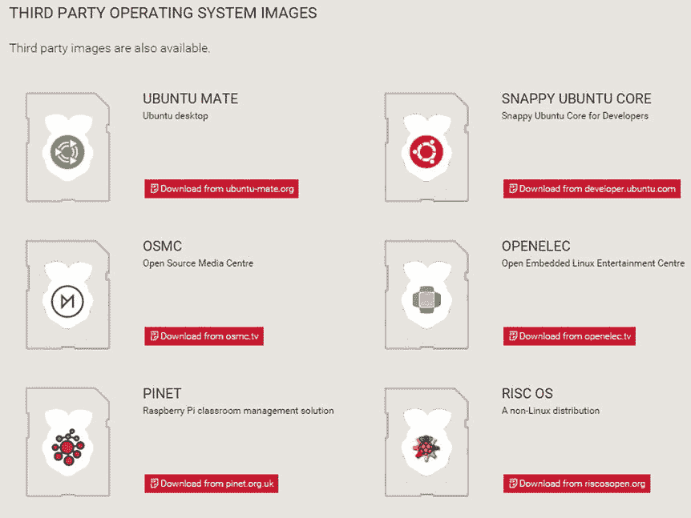
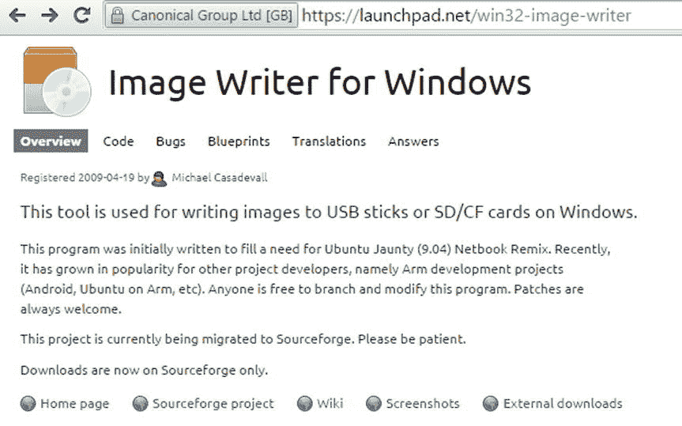
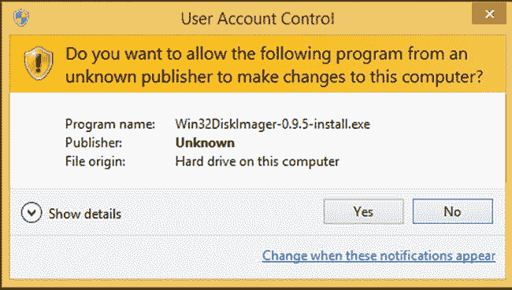
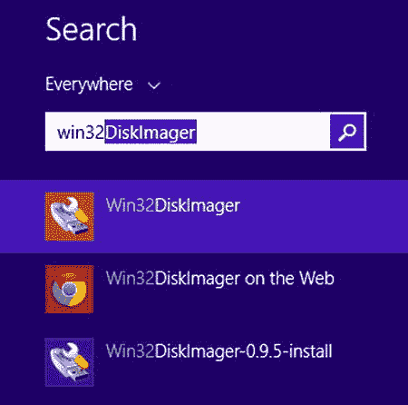
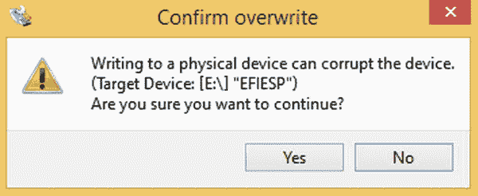
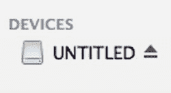

# 手动操作–写入 SD 卡映像

在本书的第一章中，我们强调了为什么今天不再需要将操作映像直接写入 SD 卡，因为 NOOBS 会为您处理这些。事实上，NOOBS 让它变得如此简单，你可能会奇怪为什么我们仍然包括这些信息。

好吧，事实是，当 NOOBS 运作并做你想做的事情时，它一切都很好。具体来说，如果你是一个新用户，想安装 Raspbian 或轻松尝试不同的操作系统，那么 NOOBS 可以满足你。但是如果你想做其他事情，比如多次安装不同的操作系统，而不必重新下载镜像 10 次，或者你想把 Raspbian 放在 100 个 SD 卡上(谁知道呢，你可能会这么做)，那么你自己直接写 SD 卡，完全绕过 NOOBS，这样会快得多，而且更具有讽刺意味。你可能还记得第一章中的内容，我们的私人侦探拒绝和 NOOBS 友好相处，并且在没有大量劝说的情况下不会上线——在这种情况下，手动下载图像可能是你最好的选择。

## 获取一些图像

首先，在我们将图像写入 SD 卡之前，我们需要获取图像。幸运的是，Pi 选择的最流行的操作系统(当然包括 Raspbian)在主下载页面上都有图片:

[T2`http://raspberrypi.org/downloads/`](http://raspberrypi.org/downloads/)

这是你之前下载 NOOBS 的同一个地方，你会在 NOOBS 提供的图片下面找到原始图片。在这个例子中，我们将再次覆盖 Raspbian，但是当然你可以使用图 [A-1](#Fig1) 中显示的页面上的任何选项来这样做。

图 A-1。

Plenty to choose from!

对于 Raspbian(上一张截图中没有显示)你可以选择直接下载或者通过 Bit Torrent 下载。Bit Torrent 是下载 Raspbian 的首选方式，因为它减轻了项目服务器和镜像的负载。然而，你需要一个 Bit Torrent 客户端，有些地方你可能不应该启动它(例如在工作中)，有些连接由于 BitTorrent 的工作方式而表现很差(例如移动 3G)。同样，至少在香港，下载性能远不如本地镜像。如果可以的话，试着使用 Bit Torrent，否则，使用直接链接是完全可以接受的。

请记住，我们下载的图像是卡片上应该有的图像的直接表示。如果你只是将图像复制到卡片上，它仍然只是一张上面有 Raspbian 图像副本的卡片。我们需要做的是把图像直接写到卡片上，为此我们需要一些我们之前简单提到过的便利工具。

Note

您下载的图像文件是一个压缩的 ZIP 文件。在 Windows 8.1 上，双击该文件将打开一个压缩文件夹。您需要将图像文件本身复制到另一个位置，如“我的文档”或您的桌面。在 Mac 上，只需双击文件就可以提取图像并将其放入下载文件夹。

### 在 Windows 上使用图像编写器

推荐用于在 Windows 上编写图像的工具是一个名副其实的图像编写器。您可以在 Raspberry Pi 下载页面上找到该链接，或者访问该链接并选择“外部下载”，这将使其自动下载(参见图 [A-2](#Fig2) ):

图 A-2。

Downloading Image Writer

[T2`https://launchpad.net/win32-image-writer`](https://launchpad.net/win32-image-writer)

在撰写本文时，Image Writer 已知无法与 Windows 10 一起工作，尽管这可能在您阅读本文时得到解决。如果需要使用 Windows 10，也可以看看树莓 Pi 2 的 Windows IoT(物联网)版本。该工具包包含一个替代的图像写入工具，应该能够毫无困难地将这些图像写入 SD 卡，因为它来自微软，所以它应该可以在 Windows 10 上正常工作。

一旦你下载了 Image Writer，你会发现它是一个可以运行的可执行文件。以前它是以 zip 文件的形式提供的，需要先解压缩，但是看起来他们已经为你编写了一个很好的安装程序。所以首先要做的是——运行安装程序来安装 Image Writer。你首先会从 Windows 得到一个有用的警告(见图 [A-3](#Fig3) )。

图 A-3。

The usual Windows warning

我们没有注意到安装和使用该软件的任何问题，但一如既往，请确保您在使用该工具安装未签名的第三方软件时感到舒适。

到目前为止一切顺利——我们已经准备好了成像工具。现在我们只需要提取图像文件。因为它是一个 zip 文件，只要双击它，你就会看到里面的图像文件。您可以看到压缩率(至少在我们看到的版本上)为 69%，这非常令人印象深刻。重要的是在写入之前提取这个文件，否则你将会在你的 SD 卡上简单地写出一个 zip 文件，这根本不能很好地工作。您可以按“提取”按钮，也可以将图像拖到桌面上。两种解决方案都一样有效。

好了，现在你只需要找到图像作者。最简单的方法是按下开始按钮，开始输入“win32DiskImager”，Windows 会自动为你完成(见图 [A-4](#Fig4) )。

图 A-4。

Finding image writer in the start menu

一旦你让它运行起来，它将看起来像图 [A-5](#Fig5) 。

图 A-5。

Image Writer reader to go

在图 [A-5](#Fig5) 中可以看到，已经有相关的细节填写了。您可以看到图像的路径(实际上我已经将它提取到了桌面)，并且可以看到它将被写入的设备(在本例中是 E)。这个版本的 Disk Imager 似乎能够检测到应用程序启动后添加的设备。一旦你填写了细节，你只需要按“写”按钮。这应该会给你一个警告提示，如图 [A-6](#Fig6) 所示。

图 A-6。

Last chance to change your mind

在这里检查设备名称绝对是值得的，并且最好确保您没有插入任何其他外部设备。例如，你真的不想不小心把图像写到相机的 SD 卡上。我们以前见过这种情况，所以它肯定会发生！

一旦你开始写，你将得到如图 [A-7](#Fig7) 所示的屏幕。

图 A-7。

Writing in progress

并且最终是图 [A-8](#Fig8) 中所示的那个。

图 A-8。

Just what it says on the tin

一旦你得到上面的弹出窗口，你就知道取出 SD 卡并在 Pi 中使用它是安全的。通常，当写入这类介质时，您需要弹出设备以确保应该写入的所有内容都已写入(因此，当您“不正确地”移除设备时，Windows 会抱怨是有原因的)。当你写一个磁盘映像的时候，你可以绕过文件系统直接写到设备上。

对，就这样，你完了！如果你选择了 Raspbian 并且正在寻找一些帮助来设置它(也许 NOOBS 因为某些原因不适合你)，你可以回到第一章并且从第一次启动开始继续。

### 在 Mac 上使用 dd

如果您使用的是 Mac，我们希望向您展示将图像写入 SD 卡是多么简单。唉，我们做不到这一点，因为没有一个简单、容易的方法来做到这一点(尽管在您阅读本文时可能有一些，所以如果您不想使用 dd，请务必与 Google 核实)。擅长许多其他事情的磁盘工具，只是不知道如何处理我们的标准图像文件。我们试着把它转换成一个`.dmg`文件(Mac 的原生图像格式)，也不行。我们还查看了您可能已经下载的帮助解决问题的在线工具，但我们没有发现任何比首先手动完成任务更容易的东西。

因此，我们将比原计划提前一点接触命令行。我们不会深入讨论我们实际在做什么，因为这些命令中的大部分稍后会在它们的 Linux 版本中看到。现在，你只需要相信我们。

#### 寻找终点站

首先，我们需要打开终端。可以在`Applications`下的`Utilities`目录中找到。为了将下面的内容放入上下文中，我们用我们使用的所有命令的完整副本来结束这一部分。这个过程相当简单；它只是有相当数量的活动部件。

我们打开了终端，现在我们需要使用`sudo`成为根用户，相当于 Windows 机器上的管理员。

现在，出于安全原因，修补低级设备是危险的(例如，你不希望病毒能够直接写入硬盘)，所以普通用户不允许发出该级别的命令。因为我们需要将 Raspbian 映像直接写入 SD 卡，所以我们别无选择:我们需要直接访问 sd 卡。幸运的是，root 可以不受限制地访问机器，所以作为 root，我们可以将映像写入卡中。我们需要使用的命令是:

`sudo –i`

该命令以 root 用户身份打开一个交互式提示符，并授予“超级用户”权限。您可以使用`sudo`来直接执行命令，但是因为我们将要执行其中的一些命令，所以这样做更方便。`sudo`然后会提示您输入密码(通常用于您的用户帐户的密码)。一旦`sudo`能够确认坐在键盘前的真的是你，你将会在根提示符下结束。

Caution

我们现在有权限在系统上做任何我们想做的事情，虽然这意味着我们现在可以制作我们的图像，但这也意味着如果我们不小心，我们真的会把事情搞砸。在 Unix 下，假设 root 知道自己在做什么，并且几乎没有安全防护。以 root 用户身份运行任何命令时都要非常小心，仔细检查(然后再次检查)，只有在完全确定的情况下才应该按回车键。完成后，您还应该关闭终端窗口，以防万一。

好吧，现在怎么办？向 SD 卡写入数据的挑战之一是知道 sd 卡实际上是系统上的哪个设备。你不会想不小心把你的主硬盘误认为它，因为那会有一些不愉快的后果。您通常可以做出一些假设(例如，我们知道/dev/disk0 几乎总是会成为系统盘，所以您永远也不会想要写入这个磁盘),但是为了限制风险，我们将按数字来做这件事。

首先，确保您的 SD 卡没有连接到 Mac，然后像这样运行 mount 命令:

`mbp:∼ root# mount`

`/dev/disk0s2 on / (hfs, local, journaled)`

`devfs on /dev (devfs, local, nobrowse)`

`map -hosts on /net (autofs, nosuid, automounted, nobrowse)`

`map auto_home on /home (autofs, automounted, nobrowse)`

`mbp:∼ root#`

现在，你可能会看到类似的东西，但可能会有一点不同。我们可以忽略 devfs 和地图线，因为它们实际上只是操作系统的一部分。我们感兴趣的是/上标识/dev/disk0s2 的第一行。这是系统盘，我们要确保不碰这个。如果您映射了任何网络驱动器或附加了磁盘映像，列表中可能会有其他条目。没关系，因为在这个阶段我们并不真的在寻找什么特别的东西，我们只是想为你的系统建立一个基准。

好了，现在是插入 SD 卡的时候了。SD 卡是预先格式化的，可以在相机中使用(尽管现在很多相机都会重新格式化它们)，所以你应该可以在 Finder 的 Devices 下看到它。对于我们的特殊卡片，它看起来像图 [A-9](#Fig9) 。

图 A-9。

What you’ll see in Finder after inserting your SD Card

由于卡已经自动挂载，我们现在可以返回并重新运行 mount 命令，看看发生了什么变化。这是我们重新运行时得到的结果:

`mbp:∼ root# mount`

`/dev/disk0s2 on / (hfs, local, journaled)`

`devfs on /dev (devfs, local, nobrowse)`

`map -hosts on /net (autofs, nosuid, automounted, nobrowse)`

`map auto_home on /home (autofs, automounted, nobrowse)`

`/dev/disk2s2 on /Volumes/UNTITLED (msdos, local, nodev, nosuid, noowners)`

`mbp:∼ root#`

这里我们关心的是添加一个新磁盘，在本例中是 disk2。我们可以从它的挂载位置(/Volumes/UNTITLED)看出这是我们感兴趣的磁盘。所以现在我们知道我们想在哪里写我们的形象。

Info

BSD 系统将磁盘分割成片。在我们的示例中，挂载的文件系统位于 disk2s2 上。这相当于磁盘 2，片 2。这允许您直接引用一个片，但出于我们的目的，我们希望写入设备本身。因此，在我们的例子中，我们将写入/dev/disk2。

不过有一个小问题。当我们安装并使用 SD 卡时，我们不能直接写入 sd 卡。如果我们从 Finder 中弹出它，它不仅会卸载文件系统，还会弹出设备。这对我们没有帮助，因为我们仍然需要设备存在才能写入数据。为了解决这个问题，我们将使用名为“diskutil”的 Mac 专用命令手动卸载文件系统。Mac 确实有通用的 Unix umount 命令(我们将在后面的章节中介绍)，但是如果您的 Mac 上的任何东西碰巧在查看 SD 卡，umount 将失败，并声称设备正忙。另一方面，Diskutil 知道这一点，并且通常可以卸载设备而不会有任何问题。对于我们，我们运行以下命令:

`mbp:∼ root# diskutil unmount /dev/disk2s2`

`Volume UNTITLED on disk2s2 unmounted`

`mbp:∼ root#`

在这一切之后，我们获得了超级用户权限，隔离了要写入的设备，卸载了文件系统，这样我们就可以直接写入卡本身。我们现在要做的就是开始写作了！

这项任务选择的工具称为“dd”。这个工具有点老派，因为它只关心从设备读取和向设备写入。它对文件系统不感兴趣，也不知道硬盘和 SD 卡之间的细微差别。它只是读取和写入，而不关心它从哪里读取或写入。这是一个基本的 Unix 原则，我们将在后面的章节中再次讨论。现在，我们将利用这一点在您的 SD 卡上制作一份图像文件的精确副本。

dd 只需要知道两件事，从哪里读取(if=参数)和向哪里写入(of=参数)。我们已经搞清楚了写入位(它将是/dev/disk2 ),但是源代码呢？如果您按照前面的说明进行了操作，那么您应该将图像文件放在您的主区域的下载目录中。将我们需要的信息输入终端的最简单方法是键入:

`dd if=`

然后，转到 Finder 中的下载目录(或您提取图像文件的位置)，单击并按住图像文件，然后将其拖到您的终端窗口。这将为您粘贴完整的路径，而无需您键入任何内容。这意味着您将得到与此非常相似的结果:

`dd if=/Users/myuser/Downloads/2012-08-16-wheezy-raspbian.img`

现在我们已经指定了输入文件，我们需要做的就是指定我们希望 dd 将它写入的确切位置。由于我们之前的实验，我们知道这将是/dev/disk2。我们还将添加“bs=1M ”,让 dd 以更大的块写入映像(这意味着您不必等待四个小时才能完成)。因此，dd 所需的完整命令如下所示:

`dd if=/Users/miggyx/Downloads/2012-08-16-wheezy-raspbian.img of=/dev/disk2 bs=1M`

运行此命令可能需要一些时间(即几小时而不是几秒钟)。图像本身的大小约为 2GB，您的普通智能卡阅读器并不是特别快。使用我们的 USB 适配器，我们最近的 MacBook Pro 花了整整 25 分钟。稍后回来后，您应该会发现 dd 已经完成了它的任务，并且您又回到了命令提示符下。

好吧，不可否认，这并不像在 Windows 上写图像那样简单或直接，但是如果你看看我们必须做的一切，使用命令行允许我们以一种非常紧凑和精确的方式表达我们想要的。这是我们在第 4 章中回顾的内容，在那里我们看到了学习使用命令行的各种好处。

这是我们为了将映像写入磁盘而输入的命令的完整副本。如果我们上面的解释不太符合，或者你不完全确定最终结果应该是什么样的，你可以使用下面的文字记录作为参考，将你的版本与我们的进行比较:

`Last login: Wed Sep 19 13:48:40 on ttys000`

`mbp:∼ pmembrey$ sudo -i`

`Password:`

`mbp:∼ root# mount`

`/dev/disk0s2 on / (hfs, local, journaled)`

`devfs on /dev (devfs, local, nobrowse)`

`map -hosts on /net (autofs, nosuid, automounted, nobrowse)`

`map auto_home on /home (autofs, automounted, nobrowse)`

`<<SD Card inserted>>`

`mbp:∼ root# mount`

`/dev/disk0s2 on / (hfs, local, journaled)`

`devfs on /dev (devfs, local, nobrowse)`

`map -hosts on /net (autofs, nosuid, automounted, nobrowse)`

`map auto_home on /home (autofs, automounted, nobrowse)`

`/dev/disk2s1 on /Volumes/UNTITLED (msdos, local, nodev, nosuid, noowners)`

`mbp:∼ root# diskutil unmount /dev/disk2s1`

`Volume UNTITLED on disk2s1 unmounted`

`mbp:∼ root# dd if=/Users/pmembrey/Downloads/2012-08-16-wheezy-raspbian.img of=/dev/disk2 bs=1M`

`mbp:∼ root#`

对，有了我们(辛辛苦苦)准备的 SD 卡，终于可以启动 Pi 了！如果你已经安装了 Raspbian 并且你想按照初始配置进行操作，你可以跳回第一章并按照第一次启动时的说明进行操作。祝你好运！