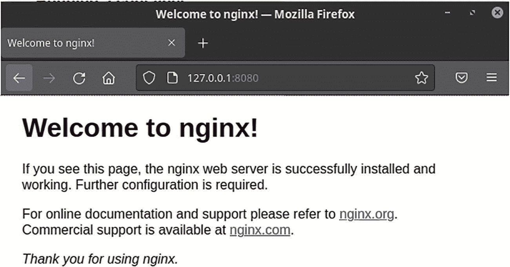
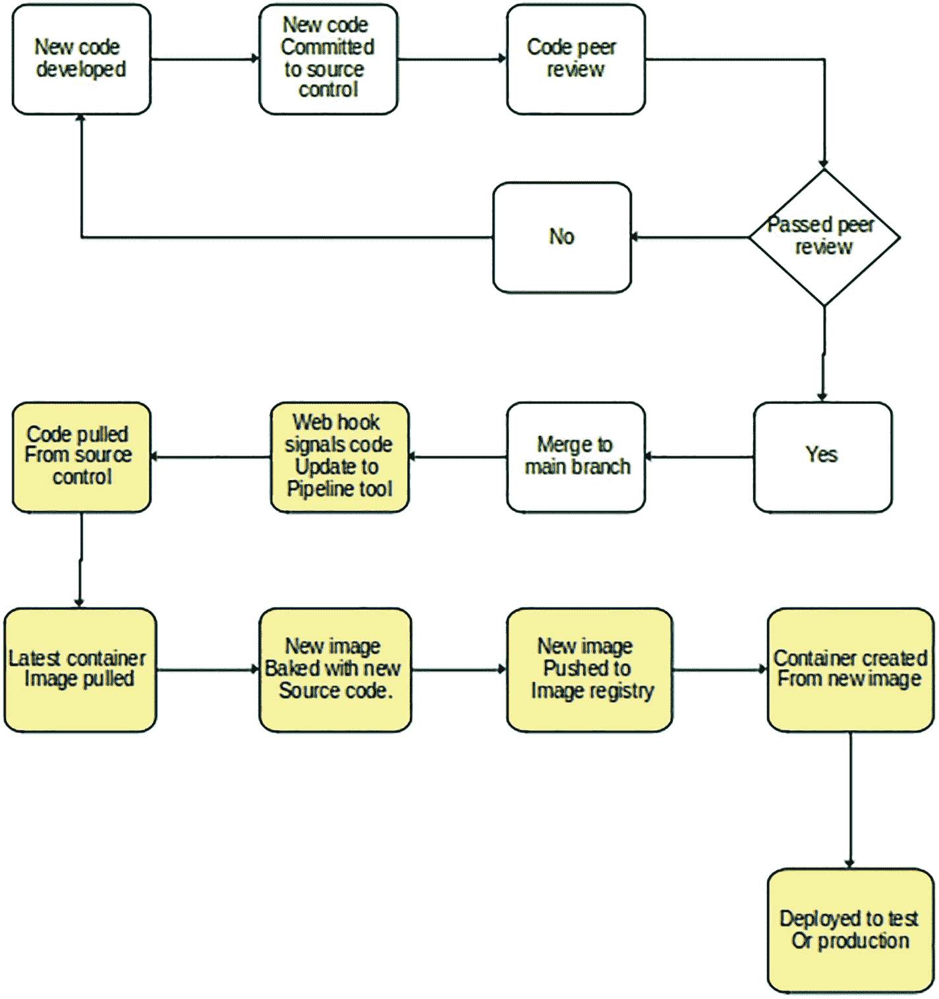
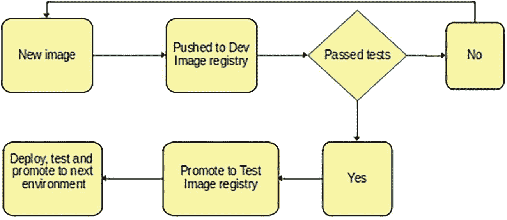
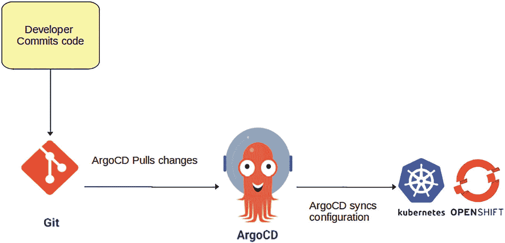

# 6.容器

这一章与前几章的方向略有不同。这将是我们讨论组织工作量以及如何管理该工作量的第一章。之前，我们讨论了平台、自动化和一般的 Linux 系统管理。在这一章的最后，我们将会更多地讨论平台，但是将会围绕本章的主题:容器展开。

本章将深入探讨集装箱化的世界，以及如何在其中管理工作负载。我们将讨论什么是容器，你如何开始使用它们，你应该做什么来管理它们，以及应该做什么和不应该做什么。最后，我们将结束这一章，讲述如何使用当今可用的工具来管理集装箱的全部资产。

本章的目标是帮助您对容器和用于管理它们的编排工具有一个基本的了解。

## 入门指南

作为一名 Linux 系统管理员，您很可能已经听说过容器；您可能已经在您的组织中使用它们了。

容器是 Linux 产业的下一个重大发展。作为一名 Linux 系统管理员，您必须完全了解它们是什么，它们是如何构建的，最重要的是，它们是如何管理的。

简而言之，容器是在它自己的隔离环境中管理的一个或多个进程和文件的集合。

### 虚拟机与容器

虚拟机是一个完整的操作系统，拥有自己的文件和资源，而容器是操作系统的一个独立部分，不仅拥有自己的二进制文件和文件，还与其主机操作系统共享库和二进制文件。容器是在被称为容器运行时的系统层之上创建和运行的(图 [6-1](#Fig1) )。


图 6-1

演示虚拟机和容器所需的不同层

虚拟机和容器的区别如图 [6-1](#Fig1) 所示。

### 集装箱历史

容器的概念根本不是一个新概念，这个概念比 Linux 本身存在的时间还要长。容器在 20 世纪 70 年代末和 80 年代初开始了他们的概念之旅，首次引入了使用 chroot 来创建隔离环境。在 21 世纪早期，Solaris 和 FreeBSD 扩展了这一思想，实现了提供隔离的平台。

直到 Google 后来通过引入 Cgroups 引入了分离 CPU 和内存等资源的能力，容器世界才真正开始发展。有了 Cgroups 的概念，像 LXC (Linux 容器)和 systemd-nspawn 这样的公司可以创建他们自己的早期容器。LXC 着眼于创建完整的系统容器，其中 systemd-nspawn 可以管理命名空间进程并由 systemd 控制。两者都是容器的早期领导者。Docker 早期的大部分开发都基于 LXC，但后来放弃了 LXC，转而支持开始一个容器标准。这就是开放容器倡议(OCI)的诞生，并成为所有容器运行时的标准。

现在有许多容器运行时可以用来创建容器，这主要是因为所有的容器运行时都遵循这个标准。

### 容器运行时

容器运行时使得在您的系统上运行容器成为可能。容器运行时允许容器与主机内核对话并运行进程。

最初的容器运行时很简单，可以在隔离的环境中运行，但是随着时间的推移，这些运行时变得越来越复杂，需要多个层来管理复杂环境中的容器。为了理解当今创建和管理容器的完整流程，您需要了解容器运行时的三个类别:

*   低级运行时或 OCI 运行时

*   容器运行时接口

*   集装箱发动机

#### 低级或 OCI 运行时

使用容器时，最底层是 OCI 运行时。OCI 运行时主要关注容器生命周期。这是容器的基本创建和运行。

低级运行时有两种变体，本地的和“虚拟化的”

##### 本机运行时

本地 OCI 运行时在运行 OCI 运行时的主机系统的同一个内核上运行它们的进程。

Note

由于主机与本机运行时共享其内核，因此人们担心受损的容器可能会影响运行它的主机。出于这个原因，您应该始终了解您可能构建到容器中的所有安全问题。

一些本地 OCI 运行时的例子是 runc、crun 和 containerd。

##### 虚拟和沙盒运行时

与本机运行时不同，虚拟和沙盒运行时与主机内核更加隔离。

###### 沙盒运行时

沙盒运行时创建了一个称为 unikernel 的代理层，它将请求代理到主机内核，减少了容器被破坏时可能出现的问题。截至本文撰写之时，可用的沙盒运行时是 gVisor 和 nabla-containers。

###### 虚拟运行时

虚拟运行时不使用代理层，而是创建一个虚拟机来代替主机内核。这些运行时可能较慢，但提供了另一个强大的保护层。截至本文撰写之时，可用的虚拟运行时有 Katacontainers、Sysbox 和 bracket-container d 等。

#### 容器运行时接口

随着容器工作负载的增长和 Kubernetes 等工具的发展，有必要摆脱内置于 kubelet 守护进程中的硬编码运行时。想法是创建一个新的接口，允许像 Kubernetes 这样的工具与任何容器运行时对话，而不需要在每次使用新的运行时重新编译 kubelets。这种新的接口允许更大的灵活性来切换出本地运行时。

CRI 需要能够做到以下几点:

*   启动和停止窗格

*   管理 pod 内的启动、停止和终止类型操作

*   从容器注册表中提取和推送图像

*   协助度量和日志检索

目前有两种主要的 CRI 选项能够完成上述步骤。它们是集装箱和 CRI-O。

##### 包含在内

Containerd 是 Docker 用 runc 开发的一个高级运行时，它包含了 CRI 的所有功能，被认为是 CRI 的一个很好的例子。

##### 把他养大

CRI-O 是一个更精简的 CRI 实现。Red Hat 目前支持将 CRI-O 集成到 Kubernetes 及其 OpenShift 产品中。Docker 被移除以支持迁移到 CRI 类型的架构，从而支持切换低级运行时的灵活性。

#### 集装箱发动机

您需要理解的最后一类容器运行时是您可以实际创建一些容器的层。这一层是容器引擎。就像虚拟机需要虚拟机管理程序才能运行一样，容器需要容器引擎。

从“虚拟机与容器”一节的图表中，您可以看到容器引擎层在容器和操作系统之间的位置。这是集装箱发动机。

表 [6-1](#Tab1) 列出了目前使用的两种常见集装箱引擎；他们是多克和波德曼。在本章中，我们将使用 Podman 作为任何容器示例或练习的容器引擎。

表 6-1

容器引擎示例

<colgroup><col class="tcol1 align-left"> <col class="tcol2 align-left"></colgroup> 
| 

工具名称

 | 

描述

 |
| --- | --- |
| `Docker` | 发布于 2013 年 3 月。首批大量使用的容器运行时之一 |
| `Podman` | 与 Docker 不同，Podman 不运行底层守护进程来运行容器 |

##### 码头工人

今天，当我和人们谈论集装箱时，他们仍然经常称集装箱为“码头集装箱”Docker 是大多数人使用的第一个真正的容器引擎；许多人仍然在使用 Docker，并且仍然信赖它。

如果你是一个 Docker 或 Podman 的人，如果你只是在你的笔记本电脑或测试实验室使用它，这并没有太大的关系；最后，您想要做的就是基于图像创建一个容器。

然而，自从我第一次使用 Docker 以来，它已经变得有点难以安装了。过去，Docker 二进制文件可以与 dnf 或 yum 一起安装，但现在您可能需要启用单独的存储库或进行特殊订阅。如果你想选择 Docker，你需要阅读文档。

我已经使用以下命令在我的 Fedora 系统上安装了“Docker ”:

```sh
# dnf install docker -y

```

一旦安装了 Docker，您可能想要阅读关于如何使用 Docker 的手册页。

您需要了解如何启动容器，了解容器是否正在运行，以及完成后如何删除容器。表 [6-2](#Tab2) 列出了一些可以使用的 docker 参数选项。

表 6-2

Docker 帮助中的 Docker 示例选项

<colgroup><col class="tcol1 align-left"> <col class="tcol2 align-left"></colgroup> 
| 

工具名称

 | 

描述

 |
| --- | --- |
| `start` | 启动一个或多个停止的容器 |
| `stop` | 拦住集装箱 |
| `ps` | 列出正在运行的容器 |
| `attach` | 将本地标准输入、输出和错误流附加到正在运行的容器 |
| `search` | 在 Docker 注册表中搜索容器映像 |
| `history` | 显示图像的历史 |
| `images` | 显示所有已经提取到本地系统的图像 |
| `create` | 创建新容器 |
| `build` | 从 Dockerfile 文件构建映像 |
| `events` | 从服务器获取实时事件 |
| `kill` | 终止一个或多个正在运行的容器 |
| `rmi` | 移除容器图像 |

##### 托普曼

Podman 是在 Docker 之后出现的，在如何创建和管理容器方面与 Docker 相似。Podman 和 Docker 的一个主要区别是，Podman 不需要运行服务或守护程序。这是因为 Docker 运行在 runc 容器之上，而 Podman 不是。相反，波德曼直接使用 runc 容器。

所有 Docker 命令都应该与 Podman 一起工作；当您开始时，Podman 的帮助和手册页也将是一个很好的信息来源。

Podman 和 Docker 可以使用相同的图像和 Docker 文件，所以如果你找到任何 Docker 的例子，他们也应该和 Podman 一起工作。

安装 Podman 非常简单，只需为您的本地软件包管理系统运行 install 命令。对于 Fedora，安装 Podman 的命令是

```sh
# dnf install podman -y

```

要查看 Podman 的手册页，您可以运行

```sh
# man podman

```

如果手册页太长而无法阅读，而您只想开始阅读，请运行

```sh
# podman help

```

类似于 Docker，可以搜索图像，可以列出本地图像和容器。如果您有任何 docker 文件，您可以使用它们来构建自定义图像，最重要的是，您可以创建容器。

Podman 简单到足以让你摸不着头脑，在线上有大量 Podman 和 Docker 的例子。

如果你不熟悉码头工人或波德曼，不要太担心。我们将快速浏览一些实例，供您尝试。

### 容器图像

如果您要构建一个虚拟机，您需要在虚拟机管理程序中创建一个“虚拟机外壳”，启动虚拟机，并安装操作系统。由于容器与操作系统共享库，它们通常不需要安装自己的操作系统。相反，容器映像是用容器运行其工作负载所需的文件和库创建的。

一个例子是将被用作 nginx web 服务器的容器映像。基本配置和库需要安装在映像中，因为不是所有运行容器运行时的主机都安装了 nginx。对于可能需要的任何应用服务器二进制文件，也是如此。

正是这种为应用程序传送二进制文件和文件的能力，真正允许容器完全可移植。在这一章中会有更多的介绍。

#### 集装箱登记处

您可以想象容器图像变化会变得非常大；光是想想几个例子，你就能看到这个数字在增长。因此，存储这些图像以备后用非常重要。没有人会希望每次部署特定的工作负载时都创建新的映像。如果您有过构建应用服务器的经验，您会理解一些配置可能相当耗时。我不建议为每个新环境重复配置过程。

这就是容器注册变得有用的地方；它们不仅存储您为组织创建的自定义映像，还存储您可能拥有的特定工作负载的下载映像库。例如，您可以找到一个 php 容器映像，其中包含运行 php 应用程序所需的一切，而不是构建一个 php 映像。

您可以通过几种方式使用容器注册表。有云或互联网注册表，你可以从中提取你可能需要的图片。然后，您可以自定义这些映像，并将其推送到您的私有云存储库(如果您愿意),或者您也可以将它们推送到您的本地本地注册表。

##### 云注册表

如果您要管理的资产不多，云注册表是处理图像的一个很好的方式。就像为您的资产中的少量系统构建资产管理平台没有意义一样，对于小型容器资产也是如此。如果您使用容器只是为了一些不经常改变的基本应用程序，那么将您的图像托管在云注册表中是非常合理的。

像 IBM 和 Google 这样的公司有云注册选项，可以让你托管你的容器映像。根据您的组织需求，Google 可能是一个不错的起点。他们提供 300 美元免费测试谷歌服务，包括注册表选项。审判结束后，当然会有一笔费用；就像评估遗产管理工具一样，你需要找出最适合你的方法。

##### 本地注册表

如果您对容器映像存储有更深层次的需求，您可能希望考虑本地容器注册选项。可用的选项很大程度上取决于您需要的服务级别。这可能很简单，只是在一个断开的或有空气间隙的环境中有一个存储容器图像的地方，也可能更复杂，因为出于安全原因，您需要进行图像扫描。无论你的需求是什么，尝试和测试来确认什么适合你。

#### 容器注册提供者

如果您需要一个容器注册表，有许多选项可供选择。就像我们在本书中讨论的大多数东西一样，有社区产品，也有企业产品。使用社区产品，您可以获得基本的功能，并且在大多数情况下还可以获得非常好的特性。借助企业产品，您可以获得安全性和合规性扫描的所有优势。

选择时，你需要再次考虑从价格到功能的一切。

## 实践中的集装箱

现在，理论上已经涵盖了容器的基础知识，让我们获得一些创建容器工作负载的实践经验。

### 先决条件

对于本书的这一部分，如果您希望测试将要讨论的一些配置，您需要准备好以下内容。

#### 购物单

*   具有 root 权限的 Linux 系统

*   从 Linux 系统访问互联网

*   安装软件包的能力

#### 系统准备

在我们创建任何容器或配置之前，您需要准备您将使用的系统。

##### 安装软件包

如果您不熟悉这个过程，请使用官方文档安装 Podman、Docker 或任何运行时包。在大多数情况下，这将像运行“`dnf install podman -y`”或“`apt-get -y install podman`”一样简单。

Docker 安装可能与 Podman 有点不同，因为您可能需要启用额外的存储库来获得所需的包。请查看官方文档以确定这一点。

Note

对于这一部分，我将使用波德曼；出于这个原因，使用 Podman 来避免额外的配置或谷歌搜索可能是值得的。

### 创建容器

在接下来的几页中，我们将介绍开始使用基本容器所需的基本实践经验。本节的目标不是让您成为容器专家，而是向您展示如何创建一个简单的容器环境来积累经验。

Warning

以下练习不适用于生产或实际环境。他们没有足够的弹性，会给你带来比他们的价值更多的问题。对于生产类型的环境，您将需要更多地关注容器编排工具。

#### 拖动容器图像

在创建或运行容器之前，您需要从云注册中心获取一个基础映像，或者，如果您走在前面，从本地注册中心获取。

要从注册表中提取正确的映像，您应该知道容器工作负载将运行什么。容器会是 nginx 服务器吗？你打算运行一个 php 应用程序吗？还是你有完全不同的想法？

##### 查找容器图像

一旦您知道您将运行什么类型的容器，您就可以搜索与您的预期工作负载非常相似的容器映像。如果您想找到一个 nginx 映像来运行一个基本的 web 服务器容器，您应该运行类似下面的内容:

```sh
#podman search nginx

```

输出将列出包含 nginx 关键字的所有可用图像。注意星星的数量，如果图片来自官方来源:

```sh
INDEX      NAME                     DESCRIPTION              STARS  OFFICIAL
docker.io  docker.io/library/nginx  Official build of Nginx.   15732  [OK]
...output reduced

```

##### 拖动容器图像

从您使用 podman search 命令发现的可用容器映像列表中，您现在可以将映像提取或下载到您的本地系统。正是这个过程允许您在本地对任何想要运行的容器使用映像。

要从前面的搜索命令中提取容器图像，可以使用与下面非常相似的命令:

```sh
# podman pull docker.io/library/nginx

```

输出应该类似于以下内容:

```sh
#root@localhost ~]# podman pull docker.io/library/nginx
Trying to pull docker.io/library/nginx:latest...
Getting image source signatures
Copying blob fca7e12d1754 [==============>-------] 20.6MiB / 25.4MiB
Copying blob 858292fd2e56 done
Copying blob 1c84ebdff681 done
Copying blob a4723e260b6f done
Copying blob b380bbd43752 done
Copying blob 745ab57616cb done

```

如果您需要将容器映像保存到另一个系统的便携式存储设备上，可以将其作为归档文件下载。

##### 本地容器图像

要查看您下载了哪些容器映像，您可以运行类似下面的命令。这些映像可用于在本地系统上创建容器。

```sh
# podman images

```

输出应该类似于以下内容:

```sh
[root@localhost ~]# podman images
REPOSITORY                 TAG         IMAGE ID      CREATED        SIZE
docker.io/library/nginx    latest      87a94228f133  3 weeks ago    138 MB

```

#### 运行容器

如果您找到了想要使用的容器映像，并且成功地下载或获取了它，那么您可以在您的测试系统上运行该映像的一个基本容器实例。要从以前下载的 nginx 映像运行基本的 nginx 容器，您可以运行类似于下面的命令:

```sh
[root@localhost ~]# podman run -d --name kentest -p 8080:80 nginx

```

输出将是创建的容器的 ID:

```sh
95bf289585a8caef7e9b9ae6bac0918e99aaac64d46b461180484c8dd1efa0a4

```

命令中的“-d”选项告诉 podman 从正在运行的容器中分离出来，让它在后台运行。“-p”设置容器将监听的端口。

#### 运行容器

一旦创建了容器，您可能想看看它是否正在运行。最简单的方法是运行容器列表命令，如下所示:

```sh
[root@localhost ~]# podman container list
CONTAINER ID  IMAGE   COMMAND   CREATED  STATUS PORTS                NAMES
95bf289585a8  dock....  nginx...  7 sec...   Up     0.0.0.0:8080->80/tcp kentest

```

从这个列表中，您可以看到您已经设法在本地系统上启动的所有容器。nginx 示例运行在所有接口上，并监听端口 8080。

图 [6-2](#Fig2) 中的截图显示了 nginx 在本地主机的 8080 端口上服务请求。



图 6-2。

### 自定义图像和容器

既然我们知道了如何从在线映像注册中心下载和运行基本容器，我们就可以探索如何定制一个映像来承载您自己的工作负载。

#### 创建一个波德曼图像注册表

在接下来的几节中创建的定制图像需要存储在本地注册表中。无需购买或支付任何在线服务来充当容器注册表，我们可以在您的本地系统上设置一个。为此，我们将创建一个基本的 podman 注册中心，并将我们的新图像推送到本地容器运行注册中心。

##### 为要存储的数据创建目录

```sh
# mkdir -p /var/lib/registry

```

##### 创建注册表容器

创建运行容器的命令如下:该命令包含一个“-v”参数，它告诉容器将一个目录从主机系统挂载到正在运行的容器。在这种情况下，这是为了在容器重启时帮助容器注册中心保留容器映像。

```sh
# podman run --privileged -d --name registry -p 5000:5000 -v /var/lib/registry:/var/lib/registry --restart=always registry:2

```

##### 将 Podman 设置为使用不安全的注册表

因为容器注册中心通常希望是安全的，所以您需要告诉 podman 使用不安全的注册中心。您可以将您的注册中心配置为使用签名证书，但是您应该遵循 podman 文档。

要设置 podman 使用不安全的注册表，您需要编辑“/etc/containers/registries . conf”文件并找到“[registries . unsecured]”部分。在“[registries . unsecure]”部分下，找到“registries = [ ]”行，并将其更新为“registries = ['localhost:5000']”。

最后，在保存 registries.conf 文件后，您需要重新启动 podman 服务:

```sh
# systemctl restart podman

```

#### 使用波德曼注册表

现在，有了上一节中配置的自己的本地 podman 注册表，您现在可以将自己的映像添加到注册表中进行保护。然后，在构建新的应用程序或映像时，您可以从自己的注册表中提取映像。

##### 标记图像

当您下载了本地图像后，您需要做的第一件事是用您的内部 podman 注册表标记它们。这样，您可以指示 podman 将图像推送到本地注册中心，而不是远程注册中心。可以把它看作是改变容器图像路径的一种方式。

要标记图像，可以运行 podman tag 命令。如果我们以目前使用的 nginx 为例，我们可以用下面的命令标记 nginx 图像:

```sh
# podman tag docker.io/library/nginx localhost:5000/nginx

```

##### 推送图像

标记好 nginx 映像后，下一步是将 nginx 映像推送到或上传到本地存储库。这可以通过以下命令完成:

```sh
# podman push localhost:5000/nginx

```

##### 远程注册表

如果您在不同的主机上创建了一个 podman 注册表，并在网络接口而不是回送地址上公开了该注册表，如果您愿意，也可以标记您的映像并将其推送到该地址。只需确保打开所有防火墙端口，允许流量通过 podman 注册表。

这同样适用于任何内部映像注册表；只要您拥有推送图像的能力和权限，podman 标记和推送命令将允许您使用本地注册表。

#### 自定义图像

到目前为止，我们所做的只是使用容器图像，而没有添加任何我们自己的定制。

没有任何内容的 web 服务器有什么用呢？容器图像也是如此；如果你不在 nginx 或 apache web 服务器上托管任何 web 内容，那么运行它们又有什么意义呢？

让我们来看看如何向 web 服务器添加我们自己的定制内容。

##### Dockerfile

为了理解如何向容器映像添加一些基本的定制，我们需要使用一个构建文件。这个构建文件通常被称为 Dockerfile 文件。Podman 和 Docker 都可以使用 Dockerfiles。

这些 docker 文件用于在容器映像中创建您想要的任何定制。将这些文件视为映像安装文件。

要使用 Dockerfile，您只需创建一个名为 Dockerfile 的新文件。不要更改名称或添加任何扩展名。该文件需要存在于当前目录中，或者您需要在运行 podman build 命令时指定位置。

##### 例子

像以前一样，我们来看一个例子。对于本例，我们将构建一个安装了 apache httpd 的 CentOS 映像。一旦安装了 web 服务器包，该示例将从我的 GitHub 帐户中下载一个示例 HTML 文件。最后，我们将运行一个包含新图像的新容器。

###### 下拉 CentOS 图像

在我们开始之前，您需要下载 CentOS 的一个版本:

```sh
# podman pull docker.io/library/centos

```

###### Dockerfile

接下来，您需要创建一个 Dockerfile 文件。请记住，Dockerfile 应该准确地命名为“Dockerfile”当您尝试构建新映像时，请确保您与 docker 文件在同一个目录中。

在我的例子中，Dockerfile 将获取它所能找到的最新的 CentOS 图像，如果您还没有获取的话。一旦映像可用，yum 将安装“httpd”和“git”包。这些将构成我们的自定义映像所需的所有包。随意添加任何你想用的东西，比如 PHP。一旦安装了这些包，git 克隆将下载我们的 web 内容的源代码，并将其移动到/var/www/html 目录供 web 服务器使用。在这个例子中，我写了一个非常基本的 HTML 页面。这可以是你想要的任何东西，所以如果你想尝试一些不同的东西，可以根据你自己的内容来改变。

下面是我用的 Dockerfile 的样子:

```sh
FROM centos:latest
RUN yum -y install httpd git; \
git clone https://github.com/kenhitchcock/basicwebapp.git; \
mv basicwebapp/index.html /var/www/html/index.html
CMD ["/usr/sbin/httpd", "-D", "FOREGROUND"]
EXPOSE 80

```

###### 构建图像

要基于我们之前的 docker 文件构建映像，您需要确保与您的 docker 文件在同一个目录中，然后运行 podman build 命令:

```sh
# podman build -t centos .

```

Note

的“.”告诉 podman 命令使用当前目录。这就是为什么在运行 build 命令时，需要与 Dockerfile 在同一个目录中。构建的图像的名称可以是您想要的任何名称，只需更改“-t”参数后面的文本。此示例使用 CentOS 名称。

###### 创建容器

使用新构建的容器映像和定制内容，我们可以运行并测试新映像:

```sh
# podman run  -p 80:80 -dit localhost/centos

```

Challenge

apache web 服务器的默认端口是 80。作为一项挑战，尝试找出如何定制您的 docker 文件以使用不同的端口。

###### 确认容器正在运行

要仔细检查您的容器是否已经实际启动，您可以运行以下命令:

```sh
# podman ps

```

输出应该类似于以下内容:

```sh
# podman ps
CONTAINER ID   IMAGE                      COMMAND               CREATED       STATUS             PORTS               NAMES
08832f29f46e   localhost/centos:latest    /usr/sbin/httpd -...  24 hours ago  Up 12 minutes ago  0.0.0.0:80->80/tcp  elated_jepsen

```

###### 删除容器

要删除容器，首先需要停止容器，然后才能删除它。这可以通过类似于下面的命令来完成:

```sh
# podman stop 08832f29f46e
# podman rm 08832f29f46e

```

输出应该类似于

```sh
# podman rm 08832f29f46e
08832f29f46edab6bdd41227a542bf494f926831d099a0a83ee8838bfe71fdf9

```

## 集装箱业务

随着对什么是容器以及如何管理它们有了更好的理解，您现在需要理解什么是好的和坏的实践。

### 云原生

在处理容器化工作负载时，您需要理解的第一件事是云原生意味着什么。

对云原生的最简单解释是，它是使用云技术以轻量级和快速的方式部署工作负载的实践。

云原生工具通常涉及在私有或公共云中使用自动化、可扩展的平台、容器、服务网格，并且通常具有不可变的基础设施。使用这些工具和许多其他工具可以实现高速度的产品工作负载发布。网飞就是一个很好的例子。网飞每天发布大约 100 个生产版本，通过使用自动化和其他工具将轻量级、快速的工作负载简化到生产中。

### 良好做法

#### 保持小规模

运行任何容器或云原生工作负载的首要规则是保持工作负载尽可能小。不建议创建千兆字节大小范围内的工作负载。工作负载越小，部署和可伸缩性就越好。如果您的工作负载需要更高的规模，那么您可能需要重新设计工作负载的编写方式。这可能是将工作负载分解为微服务，并从那里开始工作。

如果您被迫创建大型工作负载部署，请始终向后推。从长远来看，运行较小工作负载的好处是值得的。

#### 动态部署

永远不要手动部署工作负载。代码应该提交到您的源代码控制中，并推向生产。利用管道工具、源代码控制 webhooks 和任何其他可以触发工作负载部署的工具。

在图 [6-3](#Fig3) 中可以看到这样一个基本示例。



图 6-3。

#### 可攀登的

任何将部署在云类型环境中或被视为云原生的工作负载或应用程序都必须是可扩展的。当需求增加时，扩展能力对于良好的云工作实践至关重要。如果您正在部署的工作负载不能动态扩展，您需要考虑重新架构工作负载。无法动态扩展是过时工作负载和潜在旧代码的症状。

#### “会云吗”？

仅仅因为您正在部署到云平台中，并不意味着您的工作负载是云本地的。还有许多其他事情可以使工作负载成为云本地的，但是当您想知道您的工作负载是否是针对云的时，您应该问的三个问题是

*   工作量小吗？

*   工作负载可以扩展吗？

*   工作负载可以动态部署吗？

带着前面的问题，你现在可以问自己，“它会云吗”？如果您对任何一个问题的回答都是否定的，那么在有效地迁移或部署到云环境之前，您还有很多工作要做。

不要试图将虚拟机构建到容器或云原生风格的超大规模服务器中，以免落入陷阱。仅仅因为你能并不总是意味着你应该。当你不能利用云计算的优势时，这样做的陷阱会回来咬你。大型工作负载可能会导致效率低下和浪费，抵消您可能期望的成本节约。

如果您需要大型工作负载，那么容器或云平台可能不是您现在需要的。后退一步，首先仔细观察工作负载，重构代码，将整体分解成更小的应用程序，这些应用程序可以按照云的意图“云”。

### 不良做法

有很多好的做法，也有很多不好的做法。这些被称为反模式。这里有几个应该尽可能避免的常见做法。

#### 容器不是虚拟机

容器与虚拟机不同，不应被同等对待。容器是一个只有一个用途的简化实体。这种实践确保云原则保持不变。如果您试图复制虚拟机所做的事情，那么您可能还没有准备好使用容器。

#### 不同的图像

诱惑可能是对不同的环境使用不同的映像，因为这似乎是构建工作负载映像的更安全的方法。但是，构建用于测试的测试映像、用于开发的开发映像和用于生产的生产映像可能会出现未经测试和签署的差异。测试环境中使用的映像很可能没有漏洞，但生产环境中使用的映像却有。因此，在您的环境中迁移应用程序烘焙的映像。通过这种方式，您可以确保安全检查已经完成，代码已经过适当的测试，并且最重要的是，已经签字同意投入生产使用(图 [6-4](#Fig4) )。



图 6-4。

关于如何测试和提升图像的基本想法应该类似于图 [6-4](#Fig4) 。

#### 从代码构建产品

这一点和上一点类似。不要将容器映像直接投入生产。您的映像应该在开发中构建，然后通过不同的登台环境进行提升。您最终可能会遇到不同代码被部署到不同系统的情况。拥有一个从中央映像注册表进入生产环境的单一入口点将大大降低发生这种情况的风险。您还可以确信测试的代码就是部署的代码。

#### 核心秘密或配置

应用程序应该不知道平台配置或秘密。硬编码的需求应该是应用程序不是云原生的警钟。配置和机密应该由将要部署应用程序的平台来管理；其他任何事情通常都被认为是不好的做法和潜在的安全风险。

#### 构建幂等容器

构建容器应该是一个幂等的过程。您的 docker 文件不应该试图对它正在构建的映像进行外部更改。不应提交任何代码或推送任何外部更改。简单地说，容器构建应该遵循类似于图 [6-5](#Fig5) 的流程。


图 6-5。

构建容器映像应该只关注容器运行所需的内容。流程应该如图 [6-5](#Fig5) 所示一样简单。

## 集装箱发展

到目前为止，在这一章中，我们已经简单地介绍了如何开发容器。我们探讨了一些简单的好的和坏的实践，希望能让您对什么是原生云有一个好的了解。对于本节，让我们了解如何使用容器开发来创建有意义的工作负载。

### 发展考虑

#### 编码语言

为容器编写代码与为本地开发环境或笔记本电脑编写代码没有什么不同。您仍然可以选择和使用您喜欢的开发语言，并且仍然可以将代码推送到您喜欢的源代码控制平台。没有硬性规定说你不能使用某一种语言。然而，并不是所有的开发语言都是一样的。使用旧语言可能不会像新语言那样有效地转换到云中。在开始编写任何新的应用程序之前，花些时间看看下面的一些选项。表 [6-3](#Tab3) 列出了目前在容器化应用中使用的一些开发语言选项。

表 6-3

开发语言或框架

<colgroup><col class="tcol1 align-left"> <col class="tcol2 align-left"></colgroup> 
| 

语言名

 | 

描述

 |
| --- | --- |
| `Quarkus` | 针对云环境优化的 API Java 框架 |
| `React` | 用于 UI 开发的 Java 框架 |
| `Python, Ruby` | 通用高级编程语言 |
| `Golang` | 快速而强大，通常用于物联网设备 |
| `.Net` | 如果你需要坚持使用基于微软的语言 |

#### 代码编辑器

要编写有用的代码，你需要练习，并且拥有一个足够好的编辑器，而不会倾家荡产。有几个可供你使用，但它总是归结为个人喜好和你愿意生活中没有什么功能。表 [6-4](#Tab4) 列出了一些可以使用的代码编辑器选项。

表 6-4

代码编辑器

<colgroup><col class="tcol1 align-left"> <col class="tcol2 align-left"></colgroup> 
| 

工具名称

 | 

描述

 |
| --- | --- |
| `VSCode` | 免费使用，简单易懂，并有一个伟大的插件和附加选择 |
| `Eclipse` | 强大的编辑器，能够添加应用服务器进行代码测试。通常是一个 Java 开发工具 |
| `NetBeans` | 另一个 Java 编辑器 |
| `Notepad++` | 比标准文本编辑器更高级，当您选择有限时，这是一个有用的选择 |
| `Vim` | 并不总是安装在 Linux 系统上，但是可以用来开发代码。插件可以安装，但往往比 GUI 选项更受限制 |
| `Nano, Emacs` | 可以使用更多的命令行编辑器，但是缺少 GUI 工具提供的丰富特性 |

Tip

VSCode 可以免费使用，有很棒的插件，而且使用起来非常简单。在你花太多时间在其他编辑器上之前，试试 VSCode，如果发现更好的就改。

#### 源代码管理

不管你希望使用哪种源代码控制平台，只要确保你使用一个就行了。不使用源代码控制对于任何开发人员或组织来说都是一个巨大的错误。您失去了以有效的集中方式对代码进行同行评审的能力，并且您面临着代码丢失的风险。不值得冒这个险。表 [6-5](#Tab5) 列出了可用于控制源代码的源代码控制选项。

表 6-5

源代码管理选项

<colgroup><col class="tcol1 align-left"> <col class="tcol2 align-left"></colgroup> 
| 

工具名称

 | 

描述

 |
| --- | --- |
| `Git` | 基本 git 可以部署在任何 Linux 系统上；代码可以被推和拉 |
| `GitHub` | 基于互联网的 Git 源代码控制平台 |
| `GitLab` | 类似于 GitHub，只是您可以在内部运行自己的 GitLab |
| `Bitbucket` | 另一个可以在内部运行的 Git 产品 |
| `Subversion` | Git 之前流行的选项，目前正在失去流行性 |
| `Mercurial` | 处理各种规模的项目，这是一项免费的分布式控制管理服务 |
| `Microsoft Team Foundation Server` | 微软开发的源代码控制系统 |

Note

Git 可能是当今最流行的源代码控制系统。尽快熟悉它。

### 集装箱加工

一旦您开发了代码并且有了容器的想法，您将想要开始简化您的容器映像创建。有很多方法可以做到这一点，既有正确的，也有不那么正确的。您还将有相当多的工具可供选择。

#### CI/CD

首先要研究的领域是您的集装箱运输系统。这就是所谓的持续集成和持续交付系统。这些将有助于将您的工作负载部署到您的各种环境中，并使您能够灵活地利用您的容器映像或工作负载部署做更多的事情。表 [6-6](#Tab6) 列出了 CI/CD 管道的一些可用选项。

表 6-6

CI/CD 选项

<colgroup><col class="tcol1 align-left"> <col class="tcol2 align-left"></colgroup> 
| 

工具名称

 | 

描述

 |
| --- | --- |
| `Jenkins` | 流行的免费开源工具，易于使用，有很多插件选项 |
| `TeamCity` | 与 Visual Studio 集成，对 Windows 开发和测试很有用。有免费和专有选项 |
| `GitLab` | 能够直接从 GitLab 存储库构建和运行任务 |
| `Travis CI` | 可以自动检测 GitHub 中的提交，并在托管的 Travis CI 平台上运行测试 |
| `Tekton` | 另一个开源 CI/CD 工具，支持跨不同云或本地平台的部署 |

##### Jenkins 示例

Jenkins 是当今最流行的流水线工具之一，可以免费用于测试。要了解 Jenkins 管道代码的样子，下面是一个使用伪代码的基本示例:

```sh
node {
    def app

    stage('Clone repository') {
        /* Basic comment about cloning code*/
        checkout scm
    }

    stage('Build image') {
        /* Build your container image */
        app = docker.build("jenkinsproject/helloworld")
    }

    stage('Test image') {
        /* Run your unit testing of some type */
        app.inside {
            sh 'echo "Tests passed"'
        }
    }

    stage('Push image') {
        /* With a verified image, push your image to a registry */
        docker.withRegistry('https://someregistry.com', 'registry-credentials') {
            app.push("${env.BUILD_NUMBER}")
            app.push("latest")
        }
    }
}

```

从这个 Jenkins 示例中，您可以看到在管道中使用了阶段；您可以为不同的任务添加任意多的任务。例如，您可能希望添加一个安全图像扫描阶段。理想情况下，您希望构建尽可能多的自动化和测试。

Challenge

作为一个学习挑战，在您的沙盒环境或笔记本电脑上部署一个 Jenkins 容器。看看您是否可以编写自己的定制 Jenkins 文件来构建一个新的容器映像，该映像是由 git 中更新的源代码触发的。

#### 专门的映像构建者

利用非 Docker 组件构建容器映像。像 Buildah ( [`https://buildah.io/`](https://buildah.io/) )和 Kaniko ( [`https://github.com/GoogleContainerTools/kaniko`](https://github.com/GoogleContainerTools/kaniko) )这样的工具更安全，因为它们在用户空间的 docker 文件中运行每个命令。Buildah 和 Kaniko 都不需要运行 Docker 守护进程来构建映像。

#### 图像注册表

当您开发应用程序和容器内容时，您将需要一个地方来存储这些图像。如果您想在需要时进行测试和构建，这是可以的，但是作为一个良好的实践，建议您在开始构建应用程序组合时就开始存储容器映像。如果您打算将任何东西部署到一个真实的环境中，那么强烈推荐这种做法。

在本章前面，我们讨论了如何建立一个波德曼图像注册表；为了扩展这一点，考虑提供存储以确保您的容器不是短暂的。例如，波德曼有能力创建卷；当您创建这些卷时，可以将它们装入您的容器中。

使用像 OpenShift 或 Kubernetes 这样的编排平台可以提供图像注册，但默认情况下通常是短暂的。确保装载了存储卷，以免丢失任何映像。

#### 开发编辑器插件

使用您选择的开发编辑器，查找并安装有助于容器开发调试的插件。可以帮助 Dockerfile 或 Jenkinsfile 创建的插件肯定会对你有所帮助。

Tip

如果您需要免费且易于使用的东西，VSCode 是一个很好的选择。总的来说，对我来说这是一个赢家，但你自己测试一下。

#### 林挺工具

在推送或提交任何类型的代码之前，无论是 YAML 还是 Dockerfiles，都要使用林挺工具。对于 Dockerfiles，有一个很好的在线林挺工具，你可以复制并粘贴你的 docker files 内容进行检查。

[T2`www.fromlatest.io/#/`](http://www.fromlatest.io/%2523/)

## DevSecOps

当今平台管理领域的一个关键词是 DevOps。DevOps 是一套重要的实践和工具，它在开发人员和运营团队之间架起了一座桥梁。DevSecOps 是对这一概念的补充，其中每个人都对安全负责。

### DevSecOps 工具

DevSecOps 使开发人员和操作团队能够理解安全性需求，并将安全性构建到他们的工具中。

#### 管道

在没有使用 DevOps 或 DevSecOps 实践的标准情况下，安全团队需要在每次构建新系统或平台时扫描并报告问题。安全团队负责组织的安全，如果发生违规事件，他们必须回答一些棘手的问题。因此，他们在扫描时非常小心，确保在真实环境中不会暴露任何漏洞。此过程可能涉及额外的安全工具，可能需要一段时间才能完成。如果新的平台或系统不断发布，这也可能是一项令人沮丧的工作。

通过遵循 DevSecOps 实践，可以将安全性考虑因素构建到管道或映像构建工具中。有了这个过程，开发人员和运营团队负责安全，从而大大减少了与安全团队的来回奔波。

#### 安全门

借助 Jenkins 等管道工具中内置的安全性，可以构建安全门，如果某个映像由于某种原因未能通过安全扫描，可以停止构建过程，从而在发布到实际环境之前进行补救。

## GitOps

当今庄园管理和容器平台管理的另一个关键词是 GitOps。

“GitOps 是一个运营框架，采用了用于应用程序开发的 DevOps 最佳实践，如版本控制、协作、合规性和 CI/CD 工具，并将它们应用于基础架构自动化。”

[T2`https://about.gitlab.com/topics/gitops/`](https://about.gitlab.com/topics/gitops/)

### GitOps 工具箱

下面是一些有用的工具，可以帮助你学习 GitOps。您可以使用许多其他工具和变体，但是由于这个主题可以单独作为一本书的主题，所以我只提到了几个。

#### 饭桶

使用 GitOps 的第一步是开始使用 Git。这可以是 GitLab、Bitbucket 或 GitHub，任何允许 CI/CD 管道检测合并请求的 Git 平台。

#### 基础设施作为代码

然而，从技术上讲，它不是一个工具，你为自动化或配置你的平台所写的一切都应该是代码的形式。这可能是 YAML 为您的 OpenShift 或 Kubernetes 配置或 Ansible 建立一个新系统。一切都应该从代码中构建或配置；任何地方都不应使用手动配置。

#### 管道工具

选择管道工具，并将其配置为在 git 环境中检测合并或拉取请求。每次进行新的更改时，都应该启动管道来构建或部署新的应用程序版本或构建新的系统。

#### 阿尔古德

另一个越来越常用的 GitOps 工具是 ArgoCD。ArgoCD 有助于 GitOps 工作流，可用作独立工具或 CI/CD 管道的一部分。

在配置 OpenShift 或其他 Kubernetes 变体时，ArgoCD 与 Git 一起充当“事实的来源”。维护容器编排平台的状态很有用。这与 SaltStack 等资产管理工具如何维护其管理的资产中的系统状态非常相似。

ArgoCD 通过 pull 或 merge 请求的方式关注任何配置文件的更改，从而与 Git 协同工作。当 Git 中合并了一个变更时，ArgoCD 会提取新的配置，并配置该配置所针对的平台(图 [6-6](#Fig6) )。



图 6-6。

图 [6-6](#Fig6) 显示了 ArgoCD 配置应采用的基本流程。

## 容器编排

在定期部署应用程序的环境中，几个容器可能会迅速增加到数百个甚至数千个。为了管理这种增长，对容器编排的需求变得更加重要。Kubernetes、Docker Swarm 和 OpenShift 等工具为管理员提供了管理大量容器工作负载并确保其可用性的能力。每种工具都有自己的优点和缺点，可能需要花更多的章节来详细讨论；然而，由于我们目前并没有过多地关注容器编排，所以现在让我们只涉及一些基础知识。

### 它是做什么的？

容器编排是在最终用户使用容器之前必须存在于容器之上的层。一个好的容器编排工具应该具有以下特性:

*   可攀登的

*   灵活的

*   安全的

*   自动化的

*   使用方便

这些属性确保容器工作负载能够得到有效和安全的管理，能够插入到 CI/CD 系统中，并具有动态更新的内容。

### 为什么不用波德曼？

例如，使用像 Podman 这样的东西来托管一系列 pod 和 Kubernetes 之间的区别在于，Podman 不能让您监控性能和调整 pod 的数量来自动处理额外的负载。

Podman 不具备为特定工作负载在不同节点之间创建隔离网络的灵活性。

由 Kubernetes 或 OpenShift 等编排层提供的所有这些更高级别的配置和自动化服务都是针对大型资产部署的。波德曼有能力容纳大量内部装有许多容器的容器，但缺乏大规模管理这些容器的能力。添加更多的节点和连接 pod 网络将被证明更加复杂，并且会破坏容器编排层易于使用的目的。

Podman 适用于本地或小型部署，但不适用于大规模部署。你可以开发自己的包装工具来管理 Podman，但是你只是在重复发明轮子。最好的办法是投入时间使用 Kubernetes 或其他企业产品，如 OpenShift，如果你能得到它的话。如果不行，你还可以使用名为 OKD 的社区产品。

### 业务流程选项

#### 忽必烈忽必烈忽必烈忽必烈忽必烈忽必烈忽必烈忽必烈忽必烈忽必烈

Kubernetes，或 K8s，是一个开源项目，最初由 Google 开发，基于他们最初的“Borg”系统(集群管理器系统)。

红帽是 Kubernetes 正式上线前的首批贡献者之一。

2015 年，谷歌向 CNCF(云原生计算基金会)捐赠了 Kubernetes 项目。

##### 库伯内斯·福克斯

由于 Kubernetes 是开源的，今天有许多 Kubernetes 的下游版本，如 Red Hat 的 OpenShift，VMware 版本的 Kubernetes，以及许多云平台，如 AWS 和 Azure，它们提供自己的托管服务。

这些云托管服务允许终端用户部署其容器工作负载，而无需构建自己的编排平台或管理任何与之相关的系统。用户注册一个帐户，获得分配的资源，并部署工作负载。

OpenShift 和 Kubernetes 可以部署在云中和本地，它们需要安装、配置和管理。如果您需要部署非常大的资产，并且乐于自己完成所有管理工作，这将非常有用。

##### 主组件

Kubernetes 有一些基本的集群组件，使它能够为 pod 和其中的容器提供编排。

###### 控制平面

控制平面由以下部分组成:

*   存储所有集群配置的 ETCD 键值数据库

*   通过 JSON over http 提供 Kubernetes API 的 API 服务器

*   负责调度节点上工作负载的调度程序

*   控制器管理器用于管理不同的 Kubernetes 控制器

控制平面由一群主节点提供；这些节点在它们之间复制配置，以确保控制继续提供群集功能。

###### 节点

节点是 Kubernetes 集群的工人。他们负责托管用户部署的容器工作负载。节点由几个子组件组成:

*   Kubelet 确保节点的状态和运行在其上的容器的健康。

*   Kube-proxy 负责将流量路由到您的容器。

*   容器运行时。

###### 命名空间

名称空间旨在提供一种方法来隔离一个 Kubernetes 集群，以便多个用户可以部署工作负载，而无需相互通信。

###### 达蒙塞特

通常，调度程序负责将 pod 放在资源可用的节点上，以确保不会只有一个节点过载。然而，当您需要强制一个 pod 在每个节点上运行时，可以使用 Daemonsets。日志容器通常就是这种情况。

##### 工作节点组件

工作负载对象是在工作节点上部署和使用的对象。如果不是所有工作节点，也是大多数工作节点都使用以下内容。

###### 分离舱

集装箱在吊舱中运行；这些豆荚是在工作者节点上产生的。通常，一个容器在一个 pod 中运行，但是这并不是一个硬性的规则。

###### 服务

服务是将同一应用程序的多个单元绑定在一起的东西。当不同的工作节点上产生多个 pod 时，您需要平衡它们之间的流量。服务是提供该“服务”的层

###### 卷

默认情况下，所有容器都是短暂的，这意味着在 pod 重新启动或重新创建后，它们无法存储数据。通过将卷或永久卷安装到 pod，您可以从以前销毁或重启的 pod 中恢复任何数据。

###### 配置映射

在容器中，有时需要配置配置文件。例如，web 服务器可能需要配置有关其托管的网站的详细信息。Configmaps 使您能够将配置从容器映像抽象到编排平台。当使用 configmap 部署 pod 时，将在部署阶段应用配置，类似于使用 Dockerfiles 配置容器映像的方式。

#### openshift(打开 hift)

OpenShift 之前是 OpenShift，是一家叫 Makara 的公司的 PaaS 产品。Red Hat 在 2010 年收购了 Makara 的 PaaS 平台，该平台在当时是基于 Linux 容器技术的专利。

##### 早期开班

在 OpenShift 3.0 之前，Red Hat PaaS 平台是专有的和定制开发的。收购后，Red Hat 花了两年时间发布了第一个开源版本，然后又花了三年时间从定制平台转向当时更“成熟”的 Kubernetes。

OpenShift 3.0 是 Red Hat 首次将 Docker 用于容器运行时，将 Kubernetes 用于编排层。

OpenShift 3.11 是 OpenShift 3 的最后一个次要版本，也是 Docker 用作容器运行时的最后一个版本。

##### 当前 OpenShift

Red Hat 目前有 OpenShift 4.9 可供公众使用。“硬编码”Docker 的分离已经允许 OpenShift 4.x 转移到容器运行时接口方法，在该方法中可以使用任何低级容器运行时。

OpenShift 已经发展成熟，成为企业的领先容器编排平台，因此已经成为许多组织的头号容器编排产品。Red Hat 的持续投资继续增长 OpenShift 新功能和收购。

高级集群安全性(StackRox)、高级集群管理、监控、日志记录和许多其他企业级功能使 OpenShift 成为任何大型混合云组织的首选产品。

##### OpenShift 组件

由于 OpenShift 是基于 Kubernetes 的，所以大多数组件都非常相似，并且以非常相似的方式命名。当然也有一些变化，比如 Kubernetes 中的名称空间在 OpenShift 中被称为项目。Kubernetes 的 kube 命令是 OpenShift 的“oc”命令，但最重要的是，以下是一些主要的区别。

###### 产品

OpenShift 是一个产品，不是 Kubernetes 那样的项目。Kubernetes 是一个任何人都可以参与的社区项目。如果 Red Hat 认为这些变化有用的话，它们会进入 OpenShift。

###### 企业

企业与社区的争论再次强调，OpenShift 是一个企业产品，而 Kubernetes 是一个社区项目。像 Google 这样的公司提供付费的企业支持选项，但是仍然基于社区项目。

###### 安全

OpenShift 的构建考虑到了安全性，为安全性意识更强的组织提供了采用机会。最近对 StackRox 的收购进一步强化了这一观点。

###### Web 控制台

OpenShift 默认有一个 web 控制台。Kubernetes 要求您单独部署它，并让集群 kube-proxy 将流量导向控制台。

##### 更多的

虽然没有列出所有的差异，但 Red Hat OpenShift 在 Kubernetes 上还提供了其他功能，如图像管理和企业存储解决方案。如果你感兴趣，你应该按照本书中推荐的大多数产品去做。建立一个概念证明，并自己比较不同之处。

## 摘要

在本章中，向您介绍了以下内容:

*   概述什么是容器，它们的运行时，如何构建容器，以及如何定制容器

*   容器的一些实际用途以及如何创建本地容器注册表

*   云原生意味着什么以及使用容器的各种好的和坏的实践

*   不同的容器工具以及 DevSecOps 和 GitOps 实践

*   容器编排以及可供您使用的选项