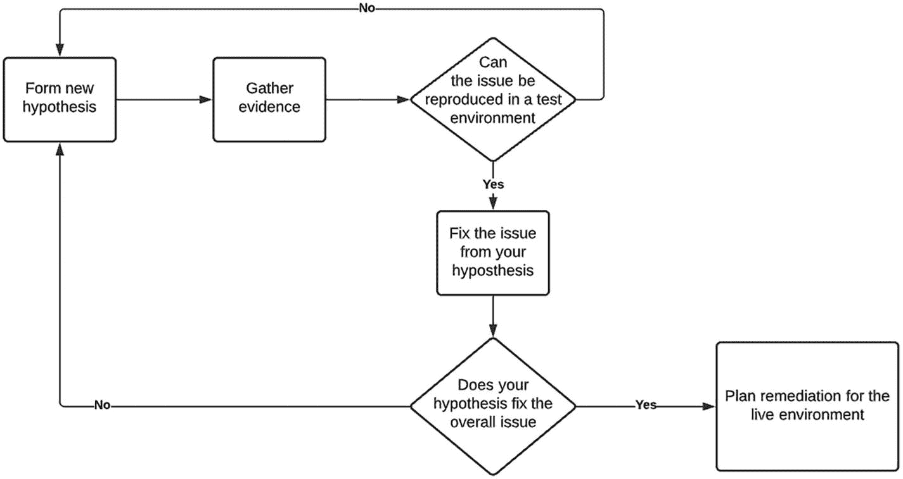

# 11.解决纷争

如果您不了解正确的方法，故障排除可能是一项难以掌握的技能。仅仅挖掘日志或配置文件可能有助于解决简单的问题，但是理解如何找到问题的根本原因才是真正的技能所在。在这一章中，我们将看看应该如何看待一个问题，应该如何分析这个问题，最后你应该如何根据你所看到的信息采取行动。在猜测之前花时间去理解对更快更有效地解决你的问题是至关重要的。

一旦我们讨论了应该如何处理问题，我们将讨论在社区中提问时应该使用的适当礼仪。第一步是学会不要让别人替你做工作，或者至少用一种你似乎已经尝试过的方式来提出你的问题。在这一章中，我们将探讨寻求帮助的最佳方式。

最后，我们将讨论您应该尽量避免的不太好的故障排除方法。

## 观察，分析，然后行动

成为一名有效的故障排除者的艺术是成为一名调查者。跟着线索，问正确的问题。注意每一个小细节，最重要的是理解为什么问题会首先出现。太多时候，绷带被用于症状，而根本问题并没有得到解决。解决了根本原因，你就可以省去以后所有的痛苦。

### 理解问题

为了完全理解如何修复一个问题，你需要理解问题的影响是什么；这很可能会给你第一个线索，告诉你从哪里开始找。

为了有效地解决问题，你需要了解你正在诊断的是什么，如果你不知道它是如何工作的，猜测是没有意义的。你将只能得到部分答案，并有可能浪费时间在错误的地方寻找答案。

例如，如果你有一个网络问题，但不知道如何跟踪网络流量，你最好找一个知道如何解决这个问题的人。边走边学是我们获取经验的方式，所以不要害怕寻求帮助。适当的做就好；我们很快会谈到这一点。

#### 知道从哪里开始

知道从哪里开始是让你彻底了解问题的一半。从顶部开始听起来像是老生常谈，但这就是你如何通过证据沿着面包屑工作，最终将你带到根本原因。

开始时问正确的问题会让你知道从哪里开始挖掘。当问题被描述为“它坏了”或“它坏了”时，这意味着你的问题需要从简单开始，然后随着你的深入变得更加复杂。请记住，您的问题要基于与您一起工作的人的知识水平，并且要有耐心。

##### 开始时要问的标准问题

当您初次遇到某个问题时，您需要从报告该问题的人的角度来理解该问题。为此，你应该问我们在 IT 学校都学过的标准问题。类似于下面的问题:

*   你能告诉我发生了什么吗？

*   问题是可重复的还是间歇性的？

*   有什么变化吗？

Note

问自己这些问题没有错。如果有的话，它可能会让你加深对这个问题的理解。

#### 解释问题

当一个问题很复杂时，它需要深入思考、质疑和理解。只有通过解释，它才变得更加清晰。通过多次解释和提问，你增加了对问题的了解，直到得到答案。

这里有一些技巧可以用来解释你的问题。

##### 向自己解释

几十年来我们已经知道，向自己解释一个问题可以大大增加我们解决它的机会。通过向自己解释这个问题，你获得了关于这个问题的新知识，你问自己问题，并且挑战自己对这个问题的理解。如果有帮助的话，大声对自己说，继续对自己谈论这个问题。不要沉默不语，如果有必要的话，找一个安静的房间，彻底解决这个问题。

##### 橡皮鸭

如果在向自己解释完问题后，你仍然没有什么有形的东西，那就抓住一个无生命的物体(橡皮鸭)，向它解释你的问题。只是第二次解释的过程可能会有帮助。

##### 另一个人

如果橡皮鸭选项失败了，试着向另一个人解释你的问题；他们甚至不必是技术性的。事实上，如果他们不是，可能会更好。这可以让你简化你的解释，让他们理解，并可能在这个过程中帮助你发现一些你可能忽略的东西，因为它太简单了。

##### 使用工具

解释时使用白板或碎纸片也能让你把想法和想法从脑子里赶出去。向自己重读解释可能会更加清晰。

#### 分解问题

复杂的问题会涉及许多不同的活动部件。一点一点地理解这些部分不仅会让你对问题更加清晰，还会让你开始消除可能的原因。

将问题分解成各个部分，开始向自己解释这些部分的作用，询问问题是否存在于每个部分，然后排除可能不是问题的部分。

使用白板或一张纸是一种很好的方法，可以将您的问题可视化到不同的部分。

##### 洋葱，它们有层次

当你分解问题时，记得考虑所有相关的层面。如果您遇到应用程序问题，请查看从应用程序到物理硬件的所有内容。通过排除所有的不可能，你只剩下最有可能的。

#### 五个为什么

虽然不是每个人都喜欢自言自语或涉及无生命的物体，但有另一种类似的方法可以用来解决复杂的问题:一种称为五个“为什么”的技术

在这种方法中，故障诊断人员通过五个问题来解释为什么会出现问题。

##### 例子

如果我们假设一个场景，在晚上的维护之后，你组织的内部内部网无法加载，那么可以问一下图 [11-1](#Fig1) 中所示的“为什么”。


图 11-1

尝试确定潜在问题时“为什么”应遵循的流程示例

内部网坏了。为什么呢？应用了更新，系统重新启动。为什么呢？web 服务器没有监听任何端口。为什么呢？启动后 web 服务器服务不会启动。为什么呢？配置文件中有语法错误。为什么呢？最后一个为什么会让你找到根本原因。有人更改了 web 服务器配置，但没有测试语法。这种改变并没有通过重启 web 服务来实现，只有在应用了系统更新后重新启动 web 服务器时，真正的问题才显现出来。

在这个例子中，问题归结于发生在内部网 web 服务器上的一个未记录的变更。该更改从未在语法检查中测试过，并且该服务从未重新启动以应用该更改。在服务器更新和重新启动后，web 服务器尝试在启动时启动，但由于语法错误而失败。

### 基于证据的理论

在对困难或间歇性问题进行故障诊断的过程中，您可能需要找到不同的调查途径。每种途径都需要调查，并需要证据来证明它是确凿的证据，然后才能将修复应用到受影响的实际环境中。

#### 假设构建

图 [11-2](#Fig2) 所示的工作流程可以通过建立一系列假设来帮助你进行根本原因分析。



图 11-2

建立故障排除假设时应遵循的流程

Tip

在建立你的假设之前，不要太快忽视不可能的事情，除非你 100%确定它不是问题所在。

#### 建立你的理论

一个好的理论应该总是从一个好的假设或有根据的猜测开始。为了检验假设，需要收集关于可疑区域的所有信息。这可能包括配置文件、系统负载、内存使用情况或任何有助于您重现实际环境中遇到的问题的信息。

##### 因果关系

在建立你的假设时，要避免陷入不理解某个组件的因果的陷阱，例如，因为一个新的显卡加载失败而责怪内核版本。即使内核负责设备驱动程序，它仍然需要在内核中编译的硬件驱动程序。

#### 证明你的理论

因为在真实环境中调试和测试从来都不是一个好主意，所以在你可以将任何东西应用到真实环境之前，你的理论需要坚实的证据来支持你的主张。为此，你需要证明你的理论。

##### 重现问题

为了证明你的理论，你首先必须重现这个问题。收集到证据后，您必须尝试复制与真实环境相同的条件，看看您是否会遇到相同的问题。如果你不能重现问题，可能你有错误的理论，或者你没有收集所有的证据。

##### 在测试环境中修复

如果您能够重现该问题，则可以测试您的潜在修复方法，并证明问题已经解决。理想情况下，整个过程应该是可重复的。

#### 补救

最后，通过验证您的理论和准备好的解决方案，可以在几乎没有风险的情况下修复实际环境。

## 请求帮助

在我职业生涯的早期，我被告知要经常寻求帮助，不要浪费超过解决问题所需的时间。如果我被卡住了，我不应该在问之前“敲打我的头”太久。毕竟，我们都还在学习；我们在一个不断发展变化的行业中工作。坐在你旁边或在互联网上的某个人可能已经经历了你遇到的同样的问题，并且可能有你可能正在挣扎的答案。

### 在寻求帮助之前应该做什么

当你寻求帮助时，你是在要求别人放弃一些时间来帮助你解决你的问题。帮助你的人必须花精力去理解你的问题；他们需要想出一个他们过去可能用过的可能的解决方案，然后试着用你能理解的方式向你解释。

为此，作为请求者，您至少应该在提出问题之前完成以下工作:

*   尝试修复问题，但失败了

*   阅读软件或硬件供应商提供的文档

*   在互联网上搜索其他人已经尝试过的例子，并检查没有人已经问过你想要帮助的问题

#### 培养

如果你足够幸运，可以接触到培训材料，检查一下你在练习中可能学到的东西是否有帮助。

如果你从未接受过任何培训，可以和你公司的经理谈谈，让你参加合适的培训课程。如果做不到这一点，你也可以利用大量的在线资源来学习。

### 如何寻求帮助

以下是你在寻求帮助时需要考虑的一些非常重要的要点。

#### 适当的语法

尽可能使用正确的语法和拼写。如果英语不是你的第一语言，那么尽你所能，用类似这样的话开始你的问题:

“很抱歉我的英语不好，希望我的问题有意义。”

尽量避免使用俚语，尽可能使用正确的单词拼写。记住你是在寻求帮助，确保你的问题尽可能清楚。

#### 拼写

使用任何可用的工具对你的问题进行拼写检查。谷歌文档有不错的拼写检查功能(我希望如此，因为这本书是用它写的)，而且是免费的。

将您的问题写或复制到一个新文档中，并检查语法和拼写错误。

#### 如何表达你的问题

现在，随着正确拼写和语法的使用，你需要理解你的问题应该如何措辞的重要性。

简单地问“有人知道为什么我的显卡不能在我的 Linux 桌面上工作吗？”不够或者写得不好。

问一个让人们立即向你询问更多细节的问题不会给你想要的答案或任何答案。

将你的问题改为包含以下信息，你会得到更好的回答:

*   陈述你尝试过的。

*   给出所有组件的详细信息，比如显卡的品牌和型号。告诉读者你用的是什么 Linux 发行版。

*   说明您已经阅读了文档并浏览了其他示例。

*   在你的问题主体中非常具体地说明你的问题，并在上面用一行字概括你的问题。

##### 一个更好的问题

*镭龙 RX 5700xt 驱动程序不支持 Fedora 34*

我正在尝试在新安装的 Fedora 34 中安装镭龙 RX 5700XT 显卡。在阅读了 AMD 网站上的官方文档并查看了 install 命令的帮助后，我仍然无法找到解决方案。

*我已经尝试运行命令*

```sh
./amdgpu-install-pro --opencl=pro,legacy

```

*和* `./amdgpu-install-pro --opencl=rocr,legacy`

但是两者都给了我错误。

*“找不到设备”*

下面是我的日志文件的输出。

*“日志文件条目”*

任何帮助我都会非常感激，或者你可能有的任何我可能错过的文件也会非常有帮助。

Tip

不要急着提问；花点时间以清晰、平和的方式问问题。人们会对花时间和精力正确提问的人提出的问题做出回应。

#### 在哪里提问

如何提问对于获得积极的回应至关重要，但在哪里问措辞正确的问题同样重要。

##### 正确区域

人们真的不喜欢被问到与你提问领域无关的问题。在提问之前，请确保您选择了正确的论坛或聊天室，甚至支持电子邮件。

一般礼貌的回答会把你引向正确的地方，但是没有耐心的人可能会给你一个稍微有点讽刺的回答。所以一定要避免尴尬或至少浪费你的时间。在应该提问的地方提出你的问题。

##### 论坛

如果你对某个特定的产品或项目有问题，检查一下他们是否有你可以提问的论坛。确保首先检查您的问题是否还没有被问过。

##### GitHub，堆栈溢出

在很多网站上，你可以就你可能遇到的任何问题提出技术问题。Stack Overflow 是一个我能找到答案的常见网站，但是像 GitHub 这样的地方也能提供一些很好的见解。

##### 支持案例

如果您的问题与您或您的组织付费订购的企业产品有关，请向他们的帮助台提出支持案例。这毕竟是你花钱买的东西。

但是，一定要清楚你的问题是什么。尽可能附加日志文件和潜在的诊断输出。只需添加所有相关文件，有时就可以更快地解决问题。

## 排除故障时要避免的事情

故障排除通常不是我们为了好玩而做的事情；它通常有时间压力，要求你尽快解决问题。

为了避免浪费时间，有几件事你应该尽量避免。

### 现场调试

不要在真实环境中调试；谁要是说现场调试还可以，那就是如履薄冰。只需一个语法错误或一个配置文件留在调试模式中，就会导致停机。

构建测试环境和非生产环境是有原因的。用它们来找到根本原因，而不是你的生活环境。

### 相关性与因果关系

当你寻找问题的根本原因时，运用逻辑思维关注问题可能出在哪里。将问题从可能有责任的组件中分解出来，避免关注依赖于可能有故障的组件的组件。基本上，避免浪费时间在可能是根本原因的受害者而不是原因的地方。

在服务没有启动的情况下，如果您没有首先检查应用程序配置，就不要浪费时间查看服务文件。我并不是说不要检查服务文件的语法问题或潜在的变化，只是不要区分它的优先级。

### 做一只孤独的狼

不要默默忍受；寻求帮助，两人一组。两对眼睛总会比一对好。两个大脑思考问题的方式不同，会从不同的角度处理问题。不要花几个小时独自战斗。

### 猜测和撒谎

这确实与团队故障排除有关。如果你对已经发生的事情负有责任，并且你已经请求帮助你摆脱困境，那么 100%诚实，不要猜测你可能在哪里犯了错误。

承认一个错误通常只会被当作“一个错误”对问题撒谎，由于缺乏诚实而导致延误，很可能对你没有好结果。拥抱你的错误，并从中吸取教训。

### 鬼

不是每个人都理解“红鲱鱼”这个词，但在英国我们用这个词来指代不存在的东西。一个幻影。避免寻找不太可能成为你问题根源的东西。当你寻找根本原因时，要坚持运用逻辑思维。

### 所有的小事

不要认为所有的大问题都有大的原因。不要忘记检查简单的事情，如域名系统或磁盘已满？

通常，我们最意想不到的事情会导致最大的问题；坚持从基础做起，然后从基础做起。

### 记录你已经尝试过的事情

阿尔伯特·爱因斯坦说过:“疯狂的定义是重复做同样的事情，却期待不同的结果。”说到故障排除，没有什么比这更不真实的了。如果你有健忘的天性，记录下你检查的地方和结果。这样你就会避免重复自己，浪费时间。

### 测量两次，切割一次

这句老话同样适用于解决方案。为了让事情立即工作而应用肮脏的变通方法，但随后不得不在短时间内修复相同的问题是徒劳的。找到根本原因并应用永久修复应该是你的首要任务。

如果您的实际环境出现故障，您最好在灾难恢复站点或辅助站点中运行。如果不是这样，那么我会担心比停机更大的问题。

什么更有意义？

修复问题以便它不会再次中断，还是应用会导致另一次中断的解决方法？

争论用更长的时间来修复潜在的问题比解释为什么现场环境再次下降要好得多。

### 别忘了你的回顾展

故障排除的最终目的是找到问题的根源。第二个目标应该是永远不要让它再次发生。为此，与所有相关人员进行讨论并计划如何避免该问题至关重要。

记录问题以及问题是如何解决的。如果问题不知何故再次发生，有一些参考资料可以节省时间。

## 摘要

在本章中，我们探讨了以下有关故障排除的内容:

*   通过向自己和“他人”解释，学会理解你的问题

*   把你的问题分解成最小的部分，然后从那里着手。

*   五个为什么以及简单地问为什么一个东西坏了可以帮助你找到罪魁祸首。

*   在将任何解决方案应用到您的生活环境之前，如何建立一个关于可能导致您的问题的原因的理论，并证明您的理论。

*   寻求帮助的正确方法，包括在寻求帮助之前应该做些什么。

*   排除故障时要避免的事情。