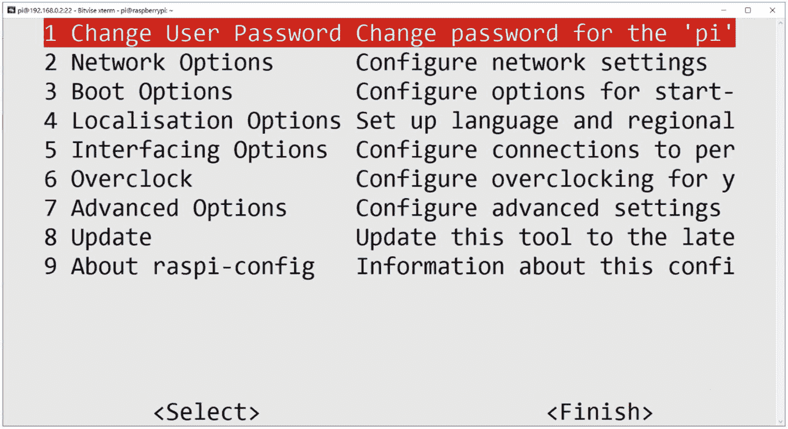

# 四、更多命令

在上一章中，我们学习了有用的文件和目录相关命令。我们还结识了一些测试编辑。在这个过程中，我们还学会了使用 APT 工具来管理 Debian 上的包。

在本章中，我们将看到更多的 Linux 命令。以下是我们将在本章学习的主题列表:

*   配置 RPi 板

*   获取命令帮助

*   网络相关命令

*   命令:文件操作

*   打印字符串

*   控制运算符

*   文件名全球绑定

*   命令:历史

*   管道

完成这一章后，我们将会非常熟悉 Linux 中各种有用的命令。本章将向用户灌输更多关于命令提示符的信心。

## 配置 RPi 板

在安装 RPi OS 时，我们已经看到了用于配置 RPi 板的 GUI 工具。同一工具的命令行版本被称为`raspi-config`实用程序。我们可以用下面的命令调用它:

```sh
sudo raspi-config

```

该实用程序的主菜单如图 [4-1](#Fig1) 所示。



图 4-1

命令提示符下的 Raspberry Pi 配置实用程序

它拥有我们在图形工具中学到的所有选项。作为本节的一个练习，您可能想进一步探索它。

Note

这个命令在 Linux 的其他发行版中不起作用。它特定于 RPi 板上的 RPi 操作系统。

### sudo 是什么？

到这个时候，你一定已经注意到我们在几个命令前使用了命令`sudo`。您也可能试图在没有 sudo 的情况下运行它们，并且肯定得到了以下错误:

```sh
pi@raspberrypi:~ $ raspi-config
Script must be run as root. Try 'sudo raspi-config'

```

这是因为一些命令和实用程序需要另一个用户(在本书中通常是超级用户或 root 用户)的安全权限。`sudo`是类 Unix 操作系统中的程序。它允许用户以另一个用户的安全特权运行程序。默认情况下，另一个用户是超级用户(在我们的例子中，用户 root)。该命令扩展为“替代用户 do”或“超级用户 do”

如果任何命令需要`sudo`，而我们在没有`sudo`的情况下运行它，它会返回我们在前面的例子中了解到的错误。

## 获取命令帮助

我们可以通过命令`man`和`info`获得各种命令的帮助。我们可以将命令 man 与任何其他命令一起使用，如下所示:

```sh
man ls

```

我们将看到一个屏幕，显示命令`ls`的信息。这就是所谓的手册页，它是类 Unix 系统中的一种文档形式。我们可以通过按键盘上的 **Q** 键退出这个文档界面。

我们可以使用命令`info`找到类似的信息，如下所示:

```sh
info ls

```

它将显示关于命令用法的信息。我们也可以通过按键盘上的键 **Q** 来退出这个信息屏幕。

## 网络相关命令

让我们来看看几个与网络相关的命令。第一个命令是`ifconfig`。它是一个系统管理实用程序，在引导时运行。此命令用于设置 IP 地址和网络掩码。如果我们在没有任何参数的情况下运行它，它将显示如下网络详细信息:

```sh
pi@raspberrypi:~ $ ifconfig
eth0: flags=4099<UP,BROADCAST,MULTICAST>  mtu 1500
        ether dc:a6:32:12:0c:e8  txqueuelen 1000  (Ethernet)
        RX packets 0  bytes 0 (0.0 B)
        RX errors 0  dropped 0  overruns 0  frame 0
        TX packets 0  bytes 0 (0.0 B)
        TX errors 0  dropped 0 overruns 0  carrier 0  collisions 0

lo: flags=73<UP,LOOPBACK,RUNNING>  mtu 65536
        inet 127.0.0.1  netmask 255.0.0.0
        inet6 ::1  prefixlen 128  scopeid 0x10<host>
        loop  txqueuelen 1000  (Local Loopback)
        RX packets 17  bytes 1004 (1004.0 B)
        RX errors 0  dropped 0  overruns 0  frame 0
        TX packets 17  bytes 1004 (1004.0 B)
        TX errors 0  dropped 0 overruns 0  carrier 0  collisions 0

wlan0: flags=4163<UP,BROADCAST,RUNNING,MULTICAST>  mtu 1500
        inet 192.168.0.2  netmask 255.255.255.0  broadcast 192.168.0.255
        inet6 fe80::7d45:b9a:284a:26bf  prefixlen 64  scopeid 0x20<link>
        ether dc:a6:32:12:0c:e9  txqueuelen 1000  (Ethernet)
        RX packets 4650  bytes 422988 (413.0 KiB)
        RX errors 0  dropped 0  overruns 0  frame 0
        TX packets 4297  bytes 2465513 (2.3 MiB)
        TX errors 0  dropped 0 overruns 0  carrier 0  collisions 0

```

目前，RPi 连接到我家的 WLAN 网络。这就是启用输出的 wlan0 部分(最后一部分)中的条目的原因。对于有线局域网，我们可以查看输出中的 eth0 段(第一段)。

在这里，我们可以看到 IPV4 和 IPV6 地址、网络掩码、广播地址和 MAC 设置等重要信息。我们还可以看到接收和发送的数据包数量等详细信息。

Note

命令`ifconfig`与 Windows 和 Mac 中的命令`ipconfig`有很多相似之处。

另一个显示类似信息的命令是`iwconfig`。它显示当前连接的 WiFi 信息，如下所示:

```sh
pi@raspberrypi:~ $ iwconfig
eth0      no wireless extensions.

lo        no wireless extensions.

wlan0     IEEE 802.11  ESSID:"Ashwin_Ion"
          Mode:Managed  Frequency:2.432 GHz  Access Point: 6C:72:20:43:89:31
          Bit Rate=81 Mb/s   Tx-Power=31 dBm
          Retry short limit:7   RTS thr:off   Fragment thr:off
          Power Management:on
          Link Quality=50/70  Signal level=-60 dBm
          Rx invalid nwid:0  Rx invalid crypt:0  Rx invalid frag:0
          Tx excessive retries:13  Invalid misc:0   Missed beacon:0

```

我们可以使用命令`ping`测试内部或外部网络中主机的可达性，如下所示:

```sh
pi@raspberrypi:~ $ ping -c4 www.google.com
PING www.google.com (172.217.27.196) 56(84) bytes of data.
64 bytes from bom07s15-in-f4.1e100.net (172.217.27.196): icmp_seq=1 ttl=119 time=8.80 ms
64 bytes from bom07s15-in-f4.1e100.net (172.217.27.196): icmp_seq=2 ttl=119 time=8.15 ms
64 bytes from bom07s15-in-f4.1e100.net (172.217.27.196): icmp_seq=3 ttl=119 time=7.86 ms
64 bytes from bom07s15-in-f4.1e100.net (172.217.27.196): icmp_seq=4 ttl=119 time=8.03 ms

--- www.google.com ping statistics ---
4 packets transmitted, 4 received, 0% packet loss, time 8ms

```

在本例中，-c4 表示我们正在向目标主机发送四个数据包。它是可选的，如果没有它，该命令将无限期运行。

我们可以用 wget 命令从互联网上下载一个文件，如下所示:

```sh
wget ftp://ftp.gnu.org/pub/gnu/wget/wget-latest.tar.gz

```

这将把提到的文件下载到当前目录。我们可以使用 ls 命令看到下载的文件，如下所示:

```sh
pi@raspberrypi:~ $ ls *.gz
wget-latest.tar.gz

```

这些是 Linux 中非常常用的网络相关命令的几个例子。

## 命令:文件操作

我们可以对文件执行各种操作。使用以下命令在当前目录中创建一个空文件和一个空目录:

```sh
touch abc
mkdir practice

```

让我们学习几个与文件相关的有用命令。让我们看看如何复制文件。我们可以用不同的名称将它复制到相同的位置，如下所示:

```sh
cp abc abc1

```

我们可以通过命令`ls`看到原件和复印件，如下所示:

```sh
pi@raspberrypi:~ $ ls abc* -la
-rw-r--r-- 1 pi pi 0 Aug 22 15:33 abc
-rw-r--r-- 1 pi pi 0 Aug 22 15:33 abc1

```

在输出中，我们也可以看到文件属性。我们将在本书的后面了解它们。

我们可以将它复制到一个文件夹中，如下所示:

```sh
cp abc ./practice/

```

文件夹(或目录)练习在同一个文件夹中。所以我们可以提供相对路径。如果它不在同一个文件夹中，那么我们必须提供绝对路径。此外，我们可以通过提供绝对路径将文件从任何源复制到任何目标。

我们可以使用命令 mv 重命名原始文件，如下所示:

```sh
mv abc1 abc2

```

原始文件将被重命名为另一个名称。我们也可以像命令`cp`一样在目录之间进行这种操作。

让我们再看几个命令。在文本编辑器中打开创建的文件，添加 15-20 行并保存。然后运行以下命令:

```sh
cat abc

```

它将显示文件的内容:

```sh
head abc

```

它显示了前十行。head 命令显示输入给它的任何源中的顶行。在这里，我们正在处理文件。我们可以自定义想要查看的行数，如下所示:

```sh
head -5 abc

```

我们可以看到另一个命令`tail`的底线，如下所示:

```sh
tail abc
tail -5 abc

```

让我们详细研究另一个与文件相关的命令`cut`。它用于提取输出中每一行的部分。一个很好的例子是从逗号分隔值(CSV)文件中提取数据。在 CSV 文件中，数据以列的形式排列，并用逗号(或其他分隔符，如`:`)分隔。数据可以通过由分隔符分隔的字节、字符或字段来提取。以下命令从文件中提取前两个字符:

```sh
cut -c 1-2 abc

```

我们可以使用`-f`来选择由`-d`指定的分隔符分隔的字段。我们也可以用`-b`来表示字节。

## 打印字符串

我们可以用命令 echo 打印一个字符串。以下是一些例子:

```sh
pi@raspberrypi:~ $ echo test
test
pi@raspberrypi:~ $ echo 'test'
test
pi@raspberrypi:~ $ echo "test"
test

```

## 控制运算符

让我们看看几个控制操作符。Unix 及其衍生物有许多控制操作符。让我们一个一个地学习它们。

按顺序运行以下命令:

```sh
ls
echo $?

```

最后一个命令返回`0`。这是因为$？存储执行最后一个命令的退出代码。如果成功，它存储`0`和其他代码。

我们可以用分号(`;`)分隔两个命令，如下所示:

```sh
echo test1 ; echo test2

```

让我们看看运算符&的用法。当一行以它结束时，shell 不会等待命令执行完毕。我们得到了 shell 提示符。

在 GUI 中或使用 VNC 打开 **lxterminal** 程序。然后运行命令 leafpad 打开文本编辑器。您会注意到，只要编辑器在运行，命令提示符就会被锁定，并且不会运行键入的命令。一旦我们关闭编辑器，它将一个接一个地运行这些命令(它们实际上存储在一个缓冲区中)。如果我们运行以下命令

```sh
leafpad &

```

它在提示中打印程序的 PID(进程 ID)，提示可供我们使用。它不会等待编辑器关闭。

让我们看看运算符& & #的用法。它是一个逻辑运算符。让我们看一个如下的例子:

```sh
echo abc && echo xyz

```

在两个命令之间使用时，如果第一个命令成功，则执行第二个命令。如果第一个命令失败，则不会执行第二个命令。在前面的示例中，两个命令都运行良好。让我们看另一个例子:

```sh
fecho abc && echo xyz

```

在这种情况下，两个命令都不会执行。

另一个逻辑运算符是||。这是逻辑或。当放置在两个命令之间时，如果第一个命令成功，则第二个命令不会执行。只有当第一个命令失败时，第二个命令才会执行。通过运行以下示例进行自我检查:

```sh
echo abc || echo xyz
fecho abc || echo xyz

```

我们可以将这两个操作符结合起来，如果命令成功，它将打印一条成功消息；否则，它会打印一条失败消息。下面是一个例子:

```sh
rm file1 && echo SUCCESS || echo FAIL

```

最后，我们可以使用反冲运算符`\`作为转义字符。我们需要在命令提示符下打印`;`，但是 shell 将其解释为命令结束。我们可以使用反斜杠来避免这种情况，如下所示:

```sh
pi@raspberrypi:~ $ echo We want to print \;
We want to print ;

```

## 文件名全球绑定

文件名全球绑定是 UNIX shell 的一个特性。这意味着通过使用称为通配符的特殊字符和单个文件名来表示多个文件名。通配符是用来替代一个或多个字符的符号。我们可以使用通配符来创建表示多个文件名的字符串:

*   *表示零个或多个字符。

*   ？仅代表一个字符。

让我们看几个例子。运行以下命令:

```sh
ls a?c

```

它列出了文件 abc。截至目前，在 **home** 位置，只有一个文件符合这个标准。文件名的第一个和最后一个字符是 a 和 c。

让我们看另一个例子。让我们列出文件名中以字符 a 开头的所有文件:

```sh
ls a*

```

我们还可以列出扩展名为 txt 的文件，如下所示:

```sh
ls *.txt

```

这就是我们如何在 ls 命令中使用 filename globbing。

## 命令:历史

操作系统维护所执行命令的历史。我们可以通过命令历史来找出在 shell 中执行命令的顺序。以下是该命令的输出示例:

```sh
  125  tail -5 abc
  126  cut cut -c 1-2 abc
  127  echo test
  128  echo 'test'
  129  echo "test"
  130  echo abc && echo xyz
  131  fecho abc && echo xyz
  132  echo abc || echo xyz
  133  fecho abc || echo xyz
  134  rm file1 && echo SUCCESS && echo FAIL
  135  rm file1 && echo SUCCESS || echo FAIL
  136  history

```

我只显示了整个输出的结尾部分，因为它将占据几页来显示整个输出。正如我们所看到的，它显示了最近在命令提示符下执行的命令。

## 管道

管道是重定向的一种形式。使用这个，我们可以将一个命令的输出重定向到另一个命令。假设我希望只查看最近执行的十个命令的历史记录。那么我必须使用如下管道:

```sh
history | tail -10

```

在前面的命令中，|是管道运算符。我们将命令历史的输出提供给命令尾。输出如下所示:

```sh
  131  fecho abc && echo xyz
  132  echo abc || echo xyz
  133  fecho abc || echo xyz
  134  rm file1 && echo SUCCESS && echo FAIL
  135  rm file1 && echo SUCCESS || echo FAIL
  136  history
  137  hist
  138  history
  139  ls -l
  140  history | tail -10

```

在编写 shell 脚本时，通常会创造性地使用管道来过滤所执行命令的输出。

## 摘要

在这一章中，我们从几个中等难度的命令开始。这些命令在编写 shell 脚本时非常有用，我们将在本书的后面学习。现在，我们都非常熟悉命令提示符的基本和中级用法。

在下一章，我们将学习一些更有用的命令和更复杂的概念。