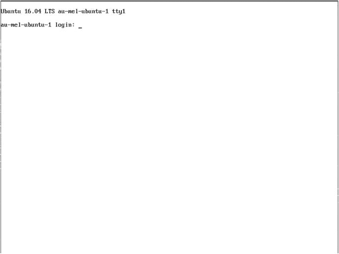
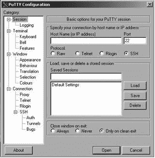
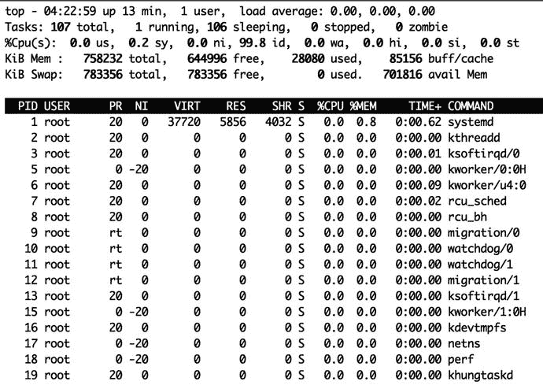
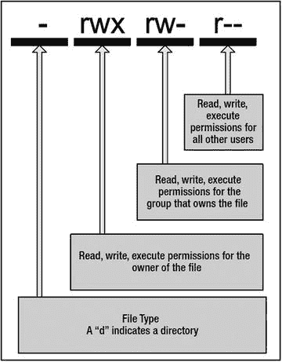

# 4.Linux 基础知识

By James Turnbull and Dennis Matotek

在第 [1](01.html) 章，我们谈了一点什么是 Linux，它来自哪里，在第 [2](02.html) 章，我们安装了我们的第一台 Linux 主机。在这一章中，我们将向你介绍一些基本的 Linux 概念和技能。有些人觉得 Linux 令人生畏，因为它看起来像带有奇怪开关和神秘选项的神秘命令。我们将解码一些你需要知道的神秘命令，并演示这些命令及其功能。

本章重点介绍入门、登录、本地和远程登录，以及使用和导航命令行和文件系统。我们还将介绍一些基本的 Linux 概念:用户、组、包、服务。然后，我们将深入研究文件系统，以及如何处理文件和目录，包括文件类型，如何设置权限，然后读取、编辑和管理它们。在接下来的章节中，我们将扩展这些概念，并向您介绍为了操作和管理您的 Linux 主机您需要知道的关键活动。

在这一章中，我们将主要讨论在命令行上运行的命令。这将向您介绍如何使用命令行，并帮助您熟悉如何操作它。这并不是说 Linux 没有广泛的图形管理工具。如果您更喜欢类似 Windows 的图形化环境，您仍然可以轻松有效地找到管理 Linux 主机的机制。对于我们将要向您展示的大多数命令行工具，都有一个图形等价物。然而，您会发现 Linux shell 在一个或多个 Linux 系统上运行起来更容易、更快。

Note

这一章是对 Linux 的广泛介绍。这不会让你成为专家。相反，它将为您迈出部署 Linux 基础设施的第一步做好准备。

## 入门指南

如果您还没有安装 Linux 主机，那么在开始安装 Linux 之前，尝试 Linux 命令的最简单方法是尝试一个 LiveCD。LiveCDs 是 CD、DVD 或 USB 上的 Linux 发行版。要使用 LiveCD，您需要下载 ISO 文件格式的图像。您可以选择任何 LiveCD 并将该图像刻录到 CD、DVD 或 USB 上。以下是一些描述如何将 ISO 文件刻录到 CD、DVD 或 USB 上的 URL:

*   [T2`http://pcsupport.about.com/od/toolsofthetrade/ht/burnisofile.htm`](http://pcsupport.about.com/od/toolsofthetrade/ht/burnisofile.htm)
*   [T2`www.petri.co.il/how_to_write_iso_files_to_cd.htm`](http://www.petri.co.il/how_to_write_iso_files_to_cd.htm)
*   [T2`https://help.ubuntu.com/community/BurningIsoHowto`](https://help.ubuntu.com/community/BurningIsoHowto)
*   [T2`www.ubuntu.com/download/desktop/create-a-usb-stick-on-windows`](http://www.ubuntu.com/download/desktop/create-a-usb-stick-on-windows)

刻录完 LiveCD 后，您可以将光盘或 USB 插入电脑并重新启动。大多数计算机会自动检测 LiveCD，并为您提供从它启动的选项。

Note

如果您的主机不提供从 CD/DVD 启动的选项，您可能需要调整 BIOS(基本输入/输出系统)设置来更改启动顺序，以便 CD、DVD 或 USB 在硬盘启动之前启动。

LiveCD 将加载并向您展示一个可运行的 Linux 发行版，您可以进行试验。默认情况下，这不会在您的主机上安装任何东西，当您取出 CD/DVD 并重新启动计算机时，您的原始桌面配置将可用。

LiveCDs 可用于各种发行版。一些可以尝试使用其 LiveCDs 的好发行版包括:

*   Ubuntu:你可以在 [`www.ubuntu.com/download/desktop`](http://www.ubuntu.com/download/desktop) 找到 Ubuntu 的 LiveCDs，叫做桌面 CD。
*   Fedora:你可以在 [`https://getfedora.org/`](https://getfedora.org/) 找到 Fedora 的 LiveCD(名为 Fedora Desktop Live Media)。
*   CentOS:最新发布的 CentOS 7 提供了一个 LiveCD，来自 [`https://wiki.centos.org/Download`](https://wiki.centos.org/Download) 列出的镜像站点之一。

Tip

在 [`http://en.wikipedia.org/wiki/Comparison_of_Linux_LiveDistros`](http://en.wikipedia.org/wiki/Comparison_of_Linux_LiveDistros) 有一些可用的 Linux LiveCDs 的比较列表。

你也可以考虑使用流浪者，就像我们在第 [3](03.html) 章给你展示的那样。使用 vagger 是探索和学习 Linux 的一个很好的方法，不需要安装物理服务器，它运行在 VirtualBox 虚拟化环境中。

### 登录

在您的 Linux 主机或 LiveCD 启动后，您将看到一个登录提示:命令行或 GUI(图形用户界面)登录提示。

在图 [4-1](#Fig1) 中，您可以看到 Ubuntu Linux 主机的典型命令行登录提示，在图 [4-2](#Fig2) 中，您可以看到 CentOS 主机的图形化登录。


图 4-2。

Graphical login prompt



图 4-1。

Command-line login prompt Note

如果您的初始屏幕与这些略有不同，不要惊慌，因为不同版本之间确实会出现一些微小的变化。

在任一登录提示符下，您都需要提供您的用户名和密码或类似形式的身份验证。(和 Windows 一样，Linux 也可以使用智能卡、令牌或其他机制来验证用户。)

如果您刚刚安装了一个 Linux 主机，系统会提示您创建一个用户，现在您可以使用该用户登录了。如果您正在用 LiveCD 测试 Linux，您可能会看到一个默认的用户名和密码，系统会提示您使用该用户名和密码登录，或者您甚至可以自动登录。例如，Ubuntu LiveCD 的默认用户名为`ubuntu`，密码为 Ubuntu，它通常会自动让您登录。如果您没有看到默认的用户名和密码，您可能需要查看 LiveCD 的联机文档，或者系统可能会提示您创建用户名和密码。

一旦您的主机验证了您的访问权限，您就可以登录了，根据您的配置，您的主机将显示命令行或 GUI 桌面环境。

## Linux 与微软视窗系统

这部分的标题可能听起来有点像我们即将呈现一场职业摔跤比赛。然而，更多的是 Linux 和微软 Windows(以下简称 Windows)之间的相似之处，而不是它们的不同之处。Windows 和 Linux 都是操作系统，虽然在许多技术方面不同，但它们有许多相同的概念。因此，我们将研究这些相似之处，以帮助您利用一些关于 Windows 的现有知识来理解 Linux 中的相关概念。

在这本书里，我们将看看如何与你的 Linux 主机接口。有两个主要的界面:GUI 桌面和命令行。我们将在本书中探索这两种接口。

### 图形用户界面桌面

Linux 和 Windows 都可以有图形用户界面。与最近的 Windows 版本不同，Linux 总是能够引导到 GUI 或命令行。一旦启动，你也可以在这两种模式之间切换，我们将在本章后面的“Shells”一节中讨论如何切换，在第 [5](05.html) 章中会有更详细的介绍。

在 Linux 上，GUI 是几个应用程序的组合。基本的应用程序被称为 X 窗口系统(你也会看到它被称为 X11 或简称为 X)。X 应用程序提供了一个底层的“窗口”环境。

Note

您不需要担心安装或管理 x。如果您安装了 GUI 桌面，您的发行版通常会为您安装它。如果你没有安装一个 GUI 桌面，例如，如果你正在安装一个服务器，X 将不会被安装，你通常将通过命令行界面与 Linux 交互。默认情况下不加载 GUI 的发行版的一个例子是我们在第 [2](02.html) 章安装的 Ubuntu 服务器发行版。

然后在 X 之上添加一个桌面环境来提供“外观”和桌面功能，比如工具栏、图标、按钮等等。Linux 上流行两种主要的桌面环境:Gnome 和 KDE。大多数发行版都将这些桌面环境之一作为默认环境；例如，Gnome 是 Debian、CentOS、Red Hat 和 Fedora 发行版的默认桌面环境，KDE 是 ubuntu 衍生版 Kubuntu 和 SUSE 的默认桌面环境，而 Ubuntu 使用 Unity，这是一个 Gnome shell(基于 Gnome)。

Tip

为了保持 Linux 的灵活性，您可以在所有这些发行版上更改默认的桌面环境。Unity、Gnome 和 KDE 也不是唯一的选择。有关当前可用桌面的讨论，请勾选 [`www.techradar.com/au/news/software/operating-systems/best-linux-desktop-which-is-ideal-for-you--1194516`](http://www.techradar.com/au/news/software/operating-systems/best-linux-desktop-which-is-ideal-for-you%2D%2D1194516) 。

在图 4-3 中，你可以看到 Ubuntu 发行版上默认的 Gnome 桌面。


图 4-3。

Ubuntu Unity desktop on the Xenial Xerus release

Unity 桌面提供了许多底层的 Gnome 工具。在本书中，我们将主要讨论例子中的 Gnome 桌面，这些例子也适用于 Unity 桌面。

### 命令行

在 Linux 世界中，命令行是您可以使用的最强大的工具之一。命令行可以被称为“控制台”、“终端”或“Shell”；每一个都有稍微不同的上下文，但是最终它是您键入 Linux 命令的地方。在本书中，大量的重点将放在命令行上。这是您至少要执行一些管理任务的地方，理解并使用命令行非常重要。事实上，在某些情况下，您将没有可用的 GUI 环境。如果您的 GUI 环境不起作用，您将需要能够使用命令行管理您的主机。命令行还提供了一些强大的工具，可以使您的管理任务更快、更有效。

Note

这并不是说我们要忽略 GUI。我们还将向您展示如何使用 GUI 工具管理您的 Linux 主机。

让我们来看看 Linux 命令行。您可以通过几种方式之一访问命令行。如果您的主机已经引导至命令行提示符，如图 [4-1](#Fig1) 所示，您可以简单地登录并使用该提示符。

在 Gnome 或 KDE GUI 中，您有两种选择。第一种是使用虚拟控制台——一种默认运行在大多数 Linux 发行版上的 Linux 管理控制台。或者您可以启动一个终端模拟器应用程序，如 Gnome 终端或 Konsole。在图 [4-3](#Fig3) 中，你可以看到我们如何在 Unity 桌面中访问终端仿真器。

Note

终端模拟器是一种在另一个应用程序中模拟文本终端的工具。例如，当您在 Windows 中启动命令提示符或命令行 shell 时，您已经启动了一个 Windows 终端模拟器。

要从 Gnome 或 KDE GUI 中启动虚拟控制台，请使用组合键 Ctrl+Alt 和 F1 到 F7 中的一个键。每个可以打开的窗口都是一个新的虚拟控制台。有六个虚拟控制台可用。您可以使用 Crtl+Alt+F1 到 F7 键在控制台之间切换。每个终端都是独立和分离的。Ubuntu 和 CentOS 在不同的控制台上有 GUI。使用 Ctrl+Alt+F7 访问 Ubuntu GUI，使用 Ctrl+Alt+F1 访问 CentOS。

Tip

如果您没有运行 GUI 界面，虚拟控制台仍然可用，您可以使用 Alt+F1 到 F6 键以及 Alt+左箭头键和 Alt+右箭头键来导航它们。

您也可以启动终端模拟器。例如，在 Gnome 中，你点击应用程序菜单，打开附件标签，选择终端应用程序。这将启动 Gnome 终端应用程序，如图 [4-4](#Fig4) 所示。


图 4-4。

Launching the Gnome Terminal application

在 KDE，情况略有不同。在早期版本的 KDE 上，您可以通过单击应用程序，打开系统工具，然后选择 Konsole 应用程序来启动 Konsole 应用程序。在 KDE 版本 4 和更高版本上，您可以通过单击应用程序，然后单击系统，并选择 Konsole 应用程序来启动 Konsole。在图 [4-3](#Fig3) 中，我们可以看到我们需要通过选择 Ubuntu 符号并键入 Terminal 来调出 Unity 中的搜索。在图 [4-3](#Fig3) 中，我们可以看到它已经出现，无需我们搜索终端，因为它是最近使用的应用程序。

### 贝壳

向您显示什么命令行取决于为您的用户运行什么 shell。Shells 是操作系统和主机内核的接口。例如，Windows 主机上的命令行也是一个 shell。每个 shell 都包含一组内置命令，这些命令允许您与您的主机进行交互(这些命令由您的发行版安装的附加工具进行补充)。

有多种 shell 可供使用，其中最常见的是 Bash(或 Bourne-again) shell，它默认用于许多发行版，包括流行的 Red Hat、Ubuntu 和 Debian 发行版。

Note

我们在第 [1](01.html) 章和第 [2](02.html) 章中更多地谈到了一些具体的发行版。

我们将在本章的所有例子中使用 Bash shell，因为它很可能是您默认找到的 shell。

### 命令行提示符

登录到 Linux 主机后，您应该会看到如下所示的提示:

```sh
jsmith@au-mel-centos-1 ∼$

```

那么这意味着什么呢？好吧，让我们来分析一下。

```sh
user@host directory$

```

在大多数 Linux 发行版中，基本提示由您登录时的用户名、主机名、当前目录和$符号构成，该符号表示您登录时的用户类型。

Tip

您可以自定义提示以包括附加信息、添加或更改颜色，或者实现各种其他选项。点击 [`http://tldp.org/HOWTO/Bash-Prompt-HOWTO/`](http://tldp.org/HOWTO/Bash-Prompt-HOWTO/) 了解更多信息。

在我们的例子中，jsmith 是我们登录的用户名；接下来是`@`符号，后面是我们登录的主机名称，即 au-mel-centos-1 上的`jsmith`。

Note

这部分提示看起来像一个电子邮件地址，这是有原因的。电子邮件就是这样开始的——在相连的 Unix 机器上拥有登录帐户的人们互相发送信息。@符号首次用于此目的是在 1971 年！你可以在 [`http://openmap.bbn.com/~tomlinso/ray/ firstemailframe.html`](http://openmap.bbn.com/%7etomlinso/ray/firstemailframe.html) 了解一下。

接下来你会看到一个`∼`符号，这是一个引用你的主目录的缩写方法。在 Linux 主机上，大多数用户都有一个特殊的目录，称为主目录，它是在创建用户时创建的。像 Microsoft Window 的用户配置文件一样，用户的首选项、配置文件和数据都存储在这个目录中。任何时候你看到使用的`∼`符号，它表示一个快捷方式，意思是主目录。我们之前讨论过主目录，它们大致等同于 Windows 文档和设置配置文件的概念和`My Documents`文件夹的组合。您通常会在名为`/home`的目录下找到主目录。

Note

Linux 是一个多用户操作系统，多个用户可以多次登录并同时工作。与 Windows 一样，用户可以拥有自己的环境、存储、访问控制和权限。

最后，您会看到`$`符号。这个符号告诉你你是什么类型的用户；默认情况下，主机上的所有普通用户都会将`$`作为他们的提示。有一个特殊的用户，叫做`root`，他的提示使用了`#`符号:

```sh
root@au-mel-centos-1 ∼#

```

`root`用户是超级用户。在 Windows 上，我们称这个用户为管理员。与 Windows 上的管理员用户一样，`root`用户可以控制和配置一切。因此，如果您看到`#`符号，您就知道您是以`root`用户的身份登录的。

在某些发行版中，您可以作为根用户登录，在安装过程中，通常会提示您为`root`用户指定一个密码。其他发行版，最著名的是 Ubuntu 发行版，禁用了`root`用户的密码。在 Ubuntu 上，假设你从来不使用`root`用户，而是使用一个叫做`sudo`的特殊命令。`sudo`命令允许您以`root`用户的权限运行命令，而无需以该用户的身份登录。我们将在第 [5](05.html) 章中讨论`sudo`命令。要使用`sudo`命令，您只需键入 sudo 和您希望运行的命令。通常会提示您输入密码，如果您输入了正确的密码，就会执行该命令。

```sh
$ sudo passwd root

```

这个命令将改变`root`用户的密码，这是在 Ubuntu 上启用`root`用户的一种方法。

用户是全能的，可以在你的主机上做任何事情。因此，当以`root`用户身份登录时，很容易意外出错，这可能会删除数据或中断您的应用程序和服务。因此，出于安全原因，您永远不应该以`root`用户的身份登录。我们将在第 [5](05.html) 章的后面讨论不使用`root`用户管理你的主机的其他方法。

Note

近年来，已经引入了其他安全控制来帮助减少对`root`用户的依赖，并提供更细粒度的安全控制。这些控件包括像 SELinux 和 AppArmor 这样的工具，我们在第 [2](02.html) 章中简要讨论过。

### 键入您的第一个命令

现在是时候尝试输入命令了。命令可以是二进制可执行文件(如 Windows 可执行文件或 EXE 文件)，或者命令可以作为 shell 的一部分提供。让我们键入一个名为`whoami`的命令，并按回车键执行它:

```sh
$ whoami
jsmith

```

`whoami`命令返回您登录的用户名。你可以看到我们的主机已经返回`jsmith`。这告诉我们，我们以用户`jsmith`的身份登录到我们的主机。

每个 shell 都包含一系列内置命令和函数来帮助您使用命令行。现在让我们试一试这些。我们从再次运行`whoami`命令开始。但是这一次，我们犯了一个拼写错误，键入了错误的命令名:

```sh
$ whoamii

```

Note

在本书中，我们将把 shell 提示符缩写成最后一个提示符字符，或者是`$`或者是`#`。

然后，我们按 Enter 键运行命令，发现 Bash 返回了以下响应:

```sh
-bash: whoamii: command not found

```

发生了什么？嗯，Bash 告诉我们主机上不存在名为`whoami`的命令。我们可以解决。让我们从更正命令开始。我们可以通过使用向上箭头键返回先前键入的命令。现在这样做，您可以看到前面的命令已经返回到命令行:

```sh
$ whoamii

```

Bash 有一个有用的命令历史，它记录了以前输入的许多命令。Bash 允许您使用上下箭头键浏览这些命令。

Tip

保留的历史数量可由用户配置，并可使用`history`命令进行操作。现在输入命令`history`查看您的命令历史。如果您刚刚登录，您可能会发现此历史记录为空。在这种情况下，使用几个命令并重试。您将看到一个编号行列表，显示您之前键入的命令。您可以通过在命令旁边输入前缀为！的数字来检索这些命令中的任何一个。符号。例如，`!12`会检索并执行你历史中的第 12 条命令。如果您键入`!!`，您将重新运行您上次输入的命令。

您也可以使用左右箭头键沿着命令行移动光标来编辑命令。使用箭头键移动到命令的末尾，删除多余的 I，留下

```sh
$ whoami

```

现在按 Enter 键，您将在命令行上看到结果:

```sh
jsmith

```

这一次，更正后的命令`whoami`再次返回登录用户的名称。

Tip

另一个有用的 Bash 特性是自动完成。开始输入命令，然后按 Tab 键，Bash 将搜索您的路径，试图找到您试图发出的命令。键入更多字符，Tab 键将进一步缩小搜索范围。

The Path

当 Linux 通知您它找不到二进制文件或命令时，可能是您拼错了命令的名称，或者它找不到那个特定的命令。像 Windows 一样，当执行命令时，Linux 搜索目录列表，试图找到那个特定的命令。默认情况下，大多数发行版都设置了默认路径，通常包含包含可执行二进制文件的典型位置。大多数时候你不需要设定你的道路；默认路径将是合适的。如果你想改变路径，你需要更新一个名为`$PATH`的环境变量。您可以通过键入`$ echo $PATH`来查看它当前的设置。我们将在第五章[中讨论环境变量。](05.html)

## 远程存取

在上两节中，我们已经讨论了 GUI 桌面和命令行。在这两种情况下，我们都假设您在本地登录到您的主机(即，坐在屏幕前，用键盘直接向主机键入命令)。但是在很多情况下，人们远程访问 Linux 主机。对于作为服务器运行的 Linux 主机来说尤其如此，这些服务器可能托管在数据中心或其他地理位置，或者存储在机架或机柜中。在许多情况下，这些主机甚至没有屏幕或键盘，只能通过网络访问。

使用 Linux，很容易远程连接到这些主机，这样您就可以管理它们。您可以使用许多不同的方法来完成这个远程连接。这些包括桌面共享协议，如虚拟网络计算(通常称为 VNC)、远程桌面协议(RDP)，它通常用于提供对 Windows 主机的远程访问，以及广泛使用的安全Shell(SSH)。

### 使用 SSH

我们很快就会看到使用 SSH 来提供对 Linux 主机的远程命令行访问。你也可以用 SSH 访问你的 GUI 桌面，但是我们会在第 10 章讨论这个。

SSH 既是一个应用程序，也是一个安全协议，用于多种目的，但主要用于主机的远程管理。在 Linux 主机上，SSH 由一个名为 OpenSSH 的开源版本的应用程序提供(参见 [`www.openssh.com/`](http://www.openssh.com/) `).`

SSH 在客户端-服务器模型中通过 TCP/IP(传输控制协议/互联网协议)网络进行连接。您的连接主机是客户端。例如，如果您从笔记本电脑连接到远程主机，那么您的笔记本电脑就是客户端。您正在连接的主机称为服务器，它接收和管理您的连接。

使用 SSH 的远程连接是加密的，需要身份验证，要么是密码，要么是公钥加密。要建立 SSH 连接，您需要知道远程主机的 IP 地址或主机名。然后在客户端启动一个连接，并通过 TCP 在端口 22 上连接到服务器(您可以更改这个端口，我们将在第 [10](10.html) 章中讨论如何更改)。

Note

您可能以前遇到过 IP 地址和主机名，但是您可能没有遇到过端口。端口是 SSH 等服务使用的通信端点。端口号范围从 0 到 65535，一些常见的端口是 HTTP 端口 80、SMTP 端口 25 和 FTP 端口 21。1 到 1023 之间的端口通常是为系统服务保留的，而 1024 和更高的端口(也称为临时端口)是更随意分配的。我们将在第 [7](07.html) 章对此进行更详细的讨论。

初始连接后，服务器会提示客户端输入用户名和身份验证凭证，如密码。如果用户存在于服务器上，并且提供了正确的凭据，则允许客户端连接到服务器。

在大多数发行版中，SSH 是作为默认应用程序之一安装的，默认情况下会启动一个服务器。这个 SSH 服务器或 SSH 守护进程(服务器在 Linux 世界中也称为守护进程)允许远程连接到您的主机的命令行或 GUI。

您可以通过命令行或从多个客户端之一使用 SSH。通过命令行，使用名为`ssh`的命令建立客户端连接。大多数 Linux 和类 Unix 操作系统(例如，Mac OS X)都安装了 SSH，并提供了`ssh`命令。要使用`ssh`命令，您需要指定您的用户名和您想要连接的主机，用@符号隔开，如清单 [4-1](#Par94) 所示。

```sh
$ ssh  jsmith@us-ny-server-1.example.com
Password:
Listing 4-1.SSH Connections

```

在清单 [4-1](#Par94) 中，我们以用户`jsmith`的身份连接到一个名为`us-ny-server-1.example.com`的主机。然后系统会提示我们输入密码。如果我们输入了正确的密码，我们将登录到远程主机的命令行。

Caution

实际上，如果您运行这个确切的命令，它不会工作，因为主机`us-ny-server-1.example.com`不存在。如果您想测试这一点，您需要指定一个实际的活动主机。

还有各种 SSH 客户端或终端模拟器可用，例如，流行的免费 PuTTY 客户端(可从 [`www.chiark.greenend.org.uk/~sgtatham/putty/`](http://www.chiark.greenend.org.uk/%7Esgtatham/putty/) 获得)，它运行在 Windows 上(也运行在 Linux 上)。你也可以使用 Git Bash 自带的，我们在第三章安装了它，当然，它运行在 Windows 上。

SSH 客户端允许您从 GUI 向 Unix 或 Linux 主机的命令行运行文本终端。您可以在图 [4-5](#Fig5) 中看到 PuTTY 客户端的配置屏幕。



图 4-5。

The PuTTY client

使用像 PuTTY 这样的 GUI 客户端非常简单。与命令行一样，您需要指定希望连接的主机的主机名(或 IP 地址)和端口。有了像 PuTTY 这样的客户端，您还可以做一些有用的事情，比如保存连接，这样您就不需要再次输入您的主机名。

使用 Git Bash，我们可以从 Bash 终端访问 ssh。我们在第 3 章中展示了如何安装 Git Bash。看一下图 [4-6](#Fig6) ，我们在这里连接到`us-ny-server-1.example.com`。


图 4-6。

Using Git Bash to make an ssh connection

如清单 [4-1](#Par94) 所示，我们正在连接美国服务器。您会注意到，当我们第一次连接到从未连接过的主机时，系统会要求我们接受 RSA 密钥指纹。这来自您正在连接的 SSH 服务器。接受该密钥后，它将根据服务器名称存储在一个名为 known_hosts 的文件中。到该主机的每个后续 SSH 连接都将检查指纹以查看它是否被更改。如果有，您将被要求在重新连接前清理密钥。这使您有机会验证主机或您的通信是否已被篡改。同样，我们将在第 10 章[中详细讨论这一点。](10.html)

在图 [4-6](#Fig6) 中，我们在理想情况下首先检查我们正在连接到我们认为正在连接的主机之后接受指纹(在网络世界中，这很难做到，因为您可能会连接到域外的主机)。完成后，我们存储指纹，然后提示我们输入密码。

如果您打算从 Windows 管理 Linux 服务器，我们建议您下载一个像 PuTTY 这样的客户端，如果您更喜欢 GUI 的话；否则你可以安装并使用 Git Bash 终端，就像我们在第 [3](03.html) 章中展示的那样。这两种方式都将有效地允许您从自己熟悉的环境中远程连接和管理您的 Linux 主机。基于 Unix 的 Mac OS 内置了一个 SSH 客户端。

Tip

SSH 客户端也适用于 Windows Mobile、Android、Symbian 和 Apple iPhone 等操作系统，允许出差族在旅途中连接到他们的 Linux 主机！

## 获得帮助

那么，如何在 Linux 主机上获得帮助呢？你可能在想，“我不能用 F1 键，对吧？”事实上你可以。在 Gnome 和 KDE 的 GUI 中，F1 键会显示界面的帮助文本。但是在命令行上，也有各种各样的工具来告诉您事情是如何工作的，帮助您找到您想要的命令，然后解释该命令可用的选项。

最简单的方法就是查看命令或者应用的`man`页面(手动页面的简称)。一个`man`页面告诉您该命令可以做什么，有哪些选项可用，以及关于它的各种其他信息。您可以通过键入 man 和您希望查看其`man`页面的命令的名称来访问`man`页面，如清单 [4-2](#Par107) 所示。

```sh
$ man ls
Listing 4-2.The man Command

```

`man`命令将返回一个描述`ls`(或 list)命令及其各种选项的文档。

Note

`ls`或 list 命令列出主机上的文件和目录。在本章的后面，我们将向您展示更多关于使用`ls`命令的文件，敬请关注。

如果你在一个命令上有困难，它的`man`页面是你应该寻求帮助的第一个地方。不是所有的命令都有`man`页面，如果某个命令的`man`页面不存在，您会得到一条错误消息。在这种情况下，尝试在命令中添加`--help`开关通常很有用，如清单 [4-3](#Par112) 所示。

Note

开关是可以添加到特定命令中的命令行选项。它们使用一个破折号(`-`)或两个破折号(`--`)和单字母缩写或交换机名称来指定，例如`-l`或`--name`。您可以使用缩写或更长的版本。在编写脚本时，较长的版本有时会更有帮助，而且不那么模糊。比如，确保人们知道您在使用–v 时指的是–version，而不是–verbose。

```sh
$ ls --help
Listing 4-3.The --help Switch

```

Tip

通过`man`命令还可以获得对 Linux 的一般性介绍。要查看这个介绍，使用命令`man intro`。

您可以搜索与简短描述中的单词相匹配的相关`man`页面。

```sh
$ man –k user
adduser (8)                   - create a new user or update default new user information
applygnupgdefaults (8) - Run gpgconf - apply-defaults for all users.
arpd (8)                         - userspace arp daemon.

```

或者您也可以使用`-K`选项在主机上的所有`man`页面中搜索关键字。

```sh
$ man -K user

```

这将在所有的`man`页面中搜索关键字`user`，并返回包含该关键字的所有`man`页面的列表。然后会提示您查看返回的每一页，跳过一页并转到下一页，或者退出搜索。

这个搜索可能有点慢，因为你的主机通常有很多`man`页面，所以有两个更简单的搜索命令可以提供你所寻找的快捷方式:`whatis`和`apropos`。`whatis`命令搜索大多数 Linux 发行版上都有的命令摘要数据库，以获得完整的单词匹配，如下所示:

```sh
$ whatis useradd
useradd(8) – create a new user or update default new user information

```

`whatis`搜索返回了`useradd`命令，并包含了该命令的简要描述。

`apropos`命令也搜索`whatis`数据库，但是搜索字符串而不是完整的单词。

```sh
$ apropos whoam
ldapwhoami(1) – LDAP who am i? tool
whoami(1) – print effective userid

```

`apropos`搜索已经在`whatis`数据库中搜索了对字符串`whoami`的所有引用，并返回了许多包含该字符串的命令和函数。

还有一些其他有用的命令可以告诉您主机上的命令。例如，`info`命令有时会对命令的功能和选项提供更详细的解释；尝试`info ls`来阅读关于`ls`命令的更多细节。

Note

`info`界面不是很直观。它，以及`man`页面，出现在互联网(或者优秀的 UX 设计)无处不在之前。它们被设计成在本地系统上有尽可能多的信息，以防你不能连接到互联网，但这并不意味着是漂亮的。

## 用户和组

Linux 是多用户操作系统。这意味着它允许多个用户通过多个命令行或 GUI 会话同时连接。Linux 通过用户和组帐户控制对主机及其资源的访问。还为特定的系统组件创建用户，并用于运行服务；例如，如果您安装了一个`mail`服务器，也可能会创建一个名为 mail 的用户来使用该服务，或者一个名为`lp`(行式打印机)的用户来控制打印机资源。

Linux 也依赖于组，组是相似用户的集合。用户可以是一个或多个组的成员，通常被放在一个组中，以便他们可以访问某种资源。例如，所有需要访问应付账款系统的用户可能会被添加到一个名为`accounts`的组中。

Tip

您的用户和组信息主要包含在两个文件中:`/etc/passwd`保存您的用户信息，`/etc/group`保存您的组信息。我们将在第六章[中详细讨论这些文件。](06.html)

用户和组很重要，我们将在第 [6](06.html) 章解释它们是如何工作的以及如何创建它们。从概念上讲，用户和组的操作方式与他们在 Windows 主机上的操作方式非常相似。每个用户都有一个通常用密码保护的帐户。创建大多数普通用户时，也会创建一个类似于 Windows 配置文件的主目录。这个主目录为用户提供了一个存储数据的地方，也是许多应用程序存储用户特定配置的默认位置。用户也属于组，就像他们在 Windows 上一样，这为他们提供了对附加资源或服务的访问。

## 服务和流程

在 Windows 主机上，许多后台活动和服务器应用程序作为服务运行。服务可以启动和停止，当应用程序重新配置时，通常必须重新启动。这些服务通常通过控制面板中的服务管理器来控制。在 Linux 主机上，服务的概念也存在。服务也称为守护程序，在您的主机上运行许多关键功能。

Note

术语“Daemon”是 demon 的希腊文拼写，基于在热力学第二定律的麦克斯韦妖思想实验中对分子进行分类的假想存在。更多信息，请参见 [`https://en.wikipedia.org/wiki/Daemon_(computing`](https://en.wikipedia.org/wiki/Daemon_(computing) `)`

像在 Windows 主机上一样，每个服务或守护进程都是在您的主机上运行的一个或多个进程。这些过程都有名字；例如，我们前面讨论的安全 Shell 守护进程通常作为一个名为 sshd 的进程运行。其他常见的守护进程包括`master`(Postfix 邮件服务器)、`httpd`(Apache web 服务器)和`mysqld`(MySQL 数据库服务器)。默认情况下，这些进程中的一些可能与执行各种系统和应用程序功能的许多其他进程一起在您的主机上运行。大多数守护进程的名称通常以“d”结尾。

在清单 [4-4](#Par135) 中，我们使用了带有`-A`标志的 ps 命令(针对所有)来列出我们的主机上当前运行的所有进程。

```sh
$ ps -A
  PID TTY          TIME CMD
    1 ?        00:00:00 systemd
    2 ?        00:00:00 kthreadd
    3 ?        00:00:00 ksoftirqd/0
    4 ?        00:00:00 kworker/0:0
    5 ?        00:00:00 kworker/0:0H
    6 ?        00:00:00 kworker/u4:0
...<snip>...
    445 ?    00:00:00 crond
    1571 ?  00:00:00 sshd
Listing 4‑4.The ps Command

```

在清单 [4-4](#Par135) 中，您可以看到在我们的主机上运行的进程的删减列表。这个列表是使用带有`-A`(或列出所有进程)选项的`ps`命令生成的。主机上运行的每个进程按照其进程 ID (PID)的顺序列出，在清单 [4-4](#Par135) 中由左边的列表示。PID 用于控制进程，我们将在第 [6](06.html) 章中查看启动和停止进程时使用它们。你的主机上最重要的进程叫做`systemd`。`systemd`进程是 Linux 主机上的基础进程，它派生出主机上的所有其他进程。此主进程始终使用 PID 1，并且必须运行才能使您的主机正常工作。

Note

根据您选择的操作系统，您可能会注意到在 PID `1`中没有`systemd`进程，而是有一个`init`进程。Systemd 是主流 Linux 操作系统的新成员，已经被 Fedora 和 Debian 等不稳定的操作系统接受了一段时间。在较旧的系统上，您会看到`init`。我们在第 6 章[中帮助解释这两者的区别。](06.html)

很多名字以“k”开头的进程并不是真正的进程，而是内核线程。这些线程是一种特殊的服务，在操作系统的核心——内核中执行管理任务。这些“轻量级进程”允许内核进程在后台处理不同的任务，比如处理当有人插入 USB 驱动器时发生的事情。清单`<thread>/0`表示线程的名称，而`/0`是它运行的处理器。

清单 [4-4](#Par135) 中的进程`445`和`1571`是在您的系统上运行的守护进程的例子。我们看到了 crond 和 SSHd 守护进程，crond 是一个作业调度服务，sshd 是 OpenSSH 守护进程，用于处理来自 ssh 客户端的连接。

还有另一个有用的命令可以告诉您哪些进程正在您的主机上运行，哪些进程消耗了最多的 CPU 和内存。这个命令叫做`top`，我们在清单 [4-5](#Par141) 中运行它。

```sh
$ top
Listing 4-5.The top Command

```

`top`命令启动一个交互式监控工具，该工具每隔几秒钟更新一次您主机上正在运行的顶级进程。你可以在图 [4-7](#Fig7) 中看到`top`命令输出的快照。



图 4-7。

The top process-monitoring command

这是一个非常安静的系统的输出。顶部显示了许多详细信息，包括系统正常运行时间、系统平均负载、CPU 使用率和内存利用率。默认情况下，Top 每三分钟刷新一次，当进程消耗资源时，它们会在列表中时隐时现。大量消耗资源的进程，如 CPU，将始终列在列表的顶部，但您也可以按其他资源(如内存使用)列出。

## 包装

Microsoft Windows 世界中的应用程序通常通过运行二进制应用程序并遵循安装过程来安装。有些应用程序还附带卸载程序，如果您不再需要它们，卸载程序会将其删除。在某些情况下，您可以使用控制面板中的“添加或删除程序”工具来添加或删除应用程序。

在 Linux 世界中，包管理器相当于添加或删除程序工具。包管理器包含一组预打包的应用程序，例如 Apache web 服务器或 LibreOffice 套件。毫不奇怪，这些预打包的应用程序被称为包。打包成包的应用程序包含所需的二进制文件、支持文件，通常还包含配置文件，它们在安装后可以直接运行。

在第 [8](08.html) 章中，我们将广泛涵盖两种常用的包管理系统:RPM 和 Deb。它们分别由基于 Red Hat 和 Debian 发行版的发行版使用。所以 Red Hat Enterprise Linux，CentOS，Fedora Project，甚至 SUSE(一个基于非 Red Hat 的发行版)都是使用 RPM 的发行版。使用 Deb 的发行版包括 Ubuntu、Debian 和许多其他发行版。

## 文件和文件系统

在 UNIX 中，有一句话是这样说的，“Unix 中的所有东西要么是文件，要么是进程。”Linux 也坚持这种说法。文件有几种类型，但我们将从文件和目录开始。在 Linux 中，目录只是包含其他文件名称的文件。让我们仔细看看 Linux 文件和文件系统。

我们将从使用一个名为`pwd`的命令开始，或者打印工作目录。

```sh
$ pwd
/home/jsmith

```

`pwd`命令允许您通过识别我们的工作目录或当前目录来确定自己在文件系统中的位置。从这里，您可以导航文件系统；首先使用`cd`或更改目录命令将目录更改为根目录，如清单 [4-6](#Par151) 所示。

```sh
user@host:∼$ cd /
user@host:/$
Listing 4-6.Changing Directories

```

如果您可以暂时忽略清单 [4-6](#Par151) 中的`user@host`，您可以看到我们已经从当前目录转移到了`/`，它被称为根目录。把`∼$`改成`/$`就知道了。根目录是目录树的基础。Linux 文件系统是一个单一的目录。这意味着，与 Windows 不同，Linux 有一个单一的层次目录结构。不同于多个驱动器，例如`C:\`和`D:\`，它们下面有单独的目录树，所有的驱动器、分区和存储都位于根目录或`/`目录之外。

这是如何工作的？安装 Linux 驱动器和设备(这可以在引导时自动进行，也可以手动进行)。这些挂载的驱动器和设备在文件系统中显示为“/”根目录下的子目录。我们在第 [6](06.html) 章解释了“/”目录最初是如何挂载的。

Note

我们还将在第 [9](09.html) 章中讨论更多关于存储和安装设备的内容。

使用`cd`命令，您可以遍历其他目录和子目录。Linux 将遍历文件系统的步骤称为路径。有两种类型的路径—绝对路径和相对路径。绝对路径总是以斜杠符号(/)开始，代表根目录，并指定您所描述的位置的最终位置；例如，`/home/jsmith/`是绝对路径。

相对路径允许您指定相对于当前位置或起点的位置。例如，该命令

```sh
$ cd foobar

```

尝试从当前目录切换到名为 foobar 的目录。如果不存在这样的目录，`cd`命令将失败。

还有几个符号经常与相对路径一起使用:

```sh
$ cd ..

```

这..表示我们希望在目录树上向上遍历一级(如果我们已经在顶部，我们就不会再去任何地方)。

我们还可以使用这种机制以其他方式遍历目录树，正如您在下面一行中看到的:

```sh
$ cd ../foo/bar

```

在这个例子中，我们有

1.  如符号`..`所示，向上遍历一个目录级别
2.  改变到上一级的一个名为`foo`的目录中
3.  然后改成了`foo`目录下的一个名为`bar`的目录

让我们在图 [4-8](#Fig8) 中对此进行说明。


图 4-8。

Directory traversal to ../foo/bar Note

如果您习惯使用 Microsoft Windows 命令行，您可能会注意到分隔目录的斜杠是正斜杠或/，而不是反斜杠或\。这确实需要一点时间来适应，但你很快就会适应的！

我们还可以使用以下结构引用目录中的相对对象:

```sh
$ ./make

```

在命令前面添加的`./`在我们当前的目录中执行 make 命令。

您可以遍历哪些目录取决于它们的权限。许多目录只允许特定用户和组访问(用户可以去任何地方)。如果您尝试更改到您没有适当权限的目录，您将会收到一条错误消息:

```sh
$ cd /root
-bash: cd: /root: Permission denied

```

Note

我们将在本章后面的“权限”一节中讨论权限。

现在您知道如何在目录树中移动了。但是你的主机上的所有东西都在哪里呢？大多数 Linux 发行版都遵循非常相似的目录结构。这并不是说所有的发行版都是相同的，但是一般来说，文件和目录都位于一个逻辑和一致的模型中。在表 [4-1](#Tab1) 中可以看到根目录下的典型目录结构。每个条目都有每个目录的简短描述。

表 4-1。

Linux Directory Structure

<colgroup><col> <col></colgroup> 
| 目录 | 描述 |
| --- | --- |
| `/bin/` | 用户命令和二进制文件。 |
| `/boot/` | 引导加载程序使用的文件。(我们将在第 [6](06.html) 章中讨论引导加载程序。) |
| `/dev/` | 设备文件。 |
| `/etc/` | 系统配置文件。 |
| `/home/` | 用户的主目录。 |
| `/lib/` | 共享库和内核模块。 |
| `/media/` | 可移动媒体通常安装在这里(参见第 [8](08.html) 章)。 |
| `/mnt/` | 临时安装的文件系统通常安装在这里(参见第 [8](08.html) 章)。 |
| `/opt/` | 附加应用软件包。 |
| `/proc/` | 内核和进程状态数据以文本文件格式存储在这里。 |
| `/root/` | root 用户的主目录。 |
| `/run/` | 应用程序可以存储操作所需数据的目录。 |
| `/sbin/` | 系统二进制文件。 |
| `/srv/` | 此主机提供的服务的数据。 |
| `/sys` | 虚拟文件系统，包含信息和对 Linux 内核子系统的访问。 |
| `/tmp/` | 临时文件的目录。 |
| `/usr/` | 用户实用程序、库和应用程序。 |
| `/var/` | 可变或瞬时文件和数据，例如日志、邮件队列和打印作业。 |

Note

不是每个发行版都有这些目录(其他发行版可能有附加目录)，但通常这个列表是准确的。

让我们看看根(/)目录下的一些关键目录，这些目录在表 [4-1](#Tab1) 中列出。第一个，也是最重要的一个，是`/etc/`。以 etcetera 命名的`/etc/`目录是主机上大多数重要配置文件所在的位置。在向主机添加应用程序和服务时，您将经常使用位于此目录中的文件。

接下来，`/home/`目录包含用户的所有主目录(除了根用户——其主目录通常是`/root/`)。`/tmp`目录是你通常会找到临时文件的地方。类似的还有`/var`目录，其中存储了临时数据，比如日志。您将经常看到包含在`/var/log/`目录中的日志文件，这些文件是由应用程序或通过主机的 syslog(或系统日志程序)守护进程创建的。这些日志文件包含关于应用程序、守护程序和服务状态的各种信息。

让我们仔细看看文件和目录，以及如何使用它们。首先转到根目录或/，目录:

```sh
$ cd /

```

现在你在根目录，你想看看目录中包含了什么。为此，您可以使用`ls`或 list directory 命令，如清单 [4-7](#Par183) 所示。

```sh
$ ls
bin dev etc lib lost+found mnt proc root sys usr
boot home  lib64  media opt sbin srv tmp var
Listing 4-7.Listing the Contents of a Directory

```

在清单 [4-7](#Par183) 中，您可以看到`ls`命令返回了根目录中的文件和目录列表。你会看到它看起来非常接近表 [4-1](#Tab1) 中的列表。

默认情况下，`ls`列出一个目录中的所有文件，但是您可以通过在命令行中列出该文件，将其限制为显示单个文件名或多个文件名，如下所示:

```sh
$ ls foobar

```

该命令将显示任何名为`foobar`的文件或目录。我们也可以使用通配符或星号来选择文件。

```sh
$ ls foo*

```

这将返回任何名为`foo`的文件加上任何以`foo`开头的文件，比如`foobar`，以及任何名称以`foo`开头的目录的内容。单独指定星号符号会列出所有文件和所有目录及其内容。

Tip

您将会看到更多的*符号，因为它在 Linux 上的使用与在 Windows 上一样多。它表示用于替换一个或多个字符的通配符；例如，您刚刚看到了`foo*`，它表示以`foo`开头的任何东西。使用`?`符号匹配单个字符；例如，指定`?at`将匹配`cat, mat, bat`，等等。这个活动统称为 globbing，你可以在 [`www.faqs.org/docs/abs/HTML/globbingref.html`](http://www.faqs.org/docs/abs/HTML/globbingref.html) 阅读它在 Linux shells 中的使用。

您也可以通过指定目录名来列出其他目录中的文件:

```sh
$ ls /usr/local/bin

```

这将列出`/usr/local/bin`目录中的所有文件。

不过，在清单 [4-7](#Par183) 中，您看不到关于这些文件和目录的很多细节。它只显示一个名单。要找到关于这个列表的更多信息，您可以在`ls`命令中添加开关，如清单 [4-8](#Par195) 所示，以显示更多信息。

```sh
$ ls -la
total 192
drwxr-xr-x      25  root  root         4096  2016-07-22 12:47  .
drwxr-xr x      25  root  root         4096  2016-07-22 12:47  ..
-rw-r--r--          1   root  root              0  2016-07-15 20:47  .autofsck
drwxr-xr-x       2   root  root         4096  2016-05-18 04:11  bin
drwxr-xr-x       6   root  root         3072  2016-05-25 21:57  boot
drwxr-xr-x     14   root  root         4100  2016-07-19 12:26  dev
drwxr-xr-x   116   root  root       12288  2016-07-22 12:47  etc
drwxr-xr-x      7   smtpd smtpd    4096  2016-05-02 12:00  home
drwxr-xr-x    12   root  root          4096  2016-05-17 18:14  lib
drwxr-xr-x      8   root  root          4096  2016-06-06 10:19  lib64
drwx------       2   root  root        16384  2016-06-11 16:01  lost+found
drwxr-xr-x      2   root  root          4096  2016-06-11 16:14  media
drwxr-xr-x      4   root  root          4096  2016-06-12 11:28  mnt
...
Listing 4-8.Getting More Information from ls

```

在清单 [4-8](#Par195) 中，`l`和`a`开关被添加到`ls`命令中。`l`开关是 long 的缩写，它使用长列表格式，如您所见，它显示了更多信息。`a`开关告诉`ls`列出所有文件和目录，甚至是“隐藏的”文件，也就是众所周知的“点”文件。

Tip

在 Linux(和 Unix)中，“隐藏”或“点”文件以句号或句号为前缀(例如清单 [4-8](#Par195) 中的`.autofsck`文件)，通常用于保存配置和历史信息或作为临时文件。它们是普通文件，但是有些实用程序，比如`ls`，默认情况下不显示它们。当您在目录中查找占用大量空间的文件时，它们也会让您大吃一惊。一个`ls -lh`将显示人类可读大小的正常文件(`-h`)，一个`ls -lah`将显示文件大小，包括点文件。稍后我们会详细讨论这一点。

通过阅读命令的`man`页面，你可以看到`ls`命令可用开关的完整列表——只需输入`man ls`。

那么长的列表格式告诉你关于你的文件和目录什么呢？在清单 [4-8](#Par195) 中，每一项都有一个小的信息集合。在清单 [4-9](#Par200) 中，您可以看到该清单的一个子集，显示了一个文件和一个目录，我们将对此进行更详细的研究。

```sh
-rw-r--r--      1 root  root        0  2016-07-15 20:47 .autofsck
drwxr-xr-x   2 root  root   4096  2016-05-18 04:11  bin
Listing 4-9.File Listing Subset

```

清单的每一行都包含关于每个对象的七条信息:

*   Unix 文件类型
*   许可
*   硬链接的数量
*   用户和组所有权
*   大小
*   日期和时间
*   名字

清单中包含的一些信息还介绍了一些关键的 Linux 概念，比如权限和用户、组和所有权。我们将利用这一介绍，不仅解释每一项，而且探索它们所代表的一些更广泛的概念。

### 文件类型和权限

文件类型和权限包含在前十个字符中，类似于`-rw-r--r--`。这个潜在的令人生畏的字符集合实际上很容易破译:第一个字符描述文件的类型，接下来的九个字符描述文件的权限。

#### 文件类型

Linux 文件系统上的几乎所有东西都可以被描述为一个文件。清单的第一个字符告诉我们文件的确切类型。这里的破折号(-)表示可能包含数据或文本的常规文件，或者是二进制可执行文件。一个`d`表示一个目录，本质上是一个列出其他文件的文件。一个`l`表示一个符号链接。符号链接允许您在文件系统的多个位置显示文件和目录。它们很像微软视窗中使用的快捷方式。

表 [4-2](#Tab2) 列出了可用的文件类型。

表 4-2。

File Types

<colgroup><col> <col></colgroup> 
| 类型 | 描述 |
| --- | --- |
| `-` | 文件 |
| `d` | 目录 |
| `l` | 环 |
| `c` | 字符设备 |
| `b` | 阻止设备 |
| `s` | 窝 |
| `p` | 命名管道 |

我们将在这里简要介绍其他类型。你不会经常需要大多数类型，但它们会在后面的章节中偶尔出现。`b`和`c`文件类型用于不同类型的输入和输出设备(如果你查看`/dev`目录，你会看到这些设备文件的例子)。设备允许操作系统与特定的硬件设备交互；例如，许多发行版都有一个名为`/dev/usb`的设备，代表连接到主机的 USB 驱动器。

Tip

当我们向您展示如何在您的主机上加载 USB 时，您将在第 [9](09.html) 章中了解更多关于设备的信息。

最后，套接字和命名管道是允许不同类型的进程间通信的文件。它们允许进程之间相互通信。您将在本书的后面看到一些套接字和命名管道。

##### 许可

接下来的九个字符详细说明了分配给文件或目录的访问权限。在 Linux 上，权限用于确定用户和组对文件的访问权限。控制您对文件和应用程序的权限和访问对于您的 Linux 主机的安全性至关重要，在本书中，我们将经常使用权限来提供对文件的适当访问。因此，理解权限如何工作以及如何更改它们是很重要的。

有三种通常分配的文件权限类型:

*   阅读，由字母`r`表示
*   写，用字母`w`表示
*   执行，由字母`x`表示

Note

还有另外两种类型的权限，sticky 和 setuid/setgid 权限，分别用`t`或`s`字符表示。我们将在本章后面的边栏“Setuid、Setgid 和粘性权限”中讨论这些内容。

读取权限允许读取或查看文件，但不允许编辑。如果在目录上设置，则可以读取目录中的文件名，但看不到其他详细信息，如权限和大小。写权限允许您对文件进行更改或写入。如果在目录上设置了写权限，您可以在该目录中创建、删除和重命名文件。执行权限允许您运行文件；例如，所有二进制文件和命令(二进制文件类似于 Windows 可执行文件)都必须标记为可执行，这样您才能运行它们。如果在一个目录上设置了该权限，您就能够遍历该目录，例如，通过使用`cd`命令来访问子目录。因此，对目录设置的读取和执行权限的组合允许您遍历目录并查看其内容的详细信息。

主机上的每个文件都有三类权限:

*   用户
*   组
*   其他(其他所有人)

每个类代表一个不同的文件访问类别。User 类描述了拥有该文件的用户的权限。这是我们清单中的前三个字符。Group 类描述拥有该文件的组的权限。这些是我们清单中的第二组三个字符。

Note

Linux 中的组是用户的集合。组允许出于允许访问应用和服务的目的将相似的用户聚集在一起；例如，会计部门的所有用户可以属于同一个组，以允许他们访问您的应付帐款应用程序。我们将在第 [6](06.html) 章讨论群组。

最后，另一个类描述了所有其他人对该文件拥有的权限。这是清单中最后一组三个字符。

图 [4-9](#Fig9) 描述了这些等级及其位置。



图 4-9。

File permission breakdown Note

任何位置的破折号都意味着根本没有设置特定的权限。

您可以在清单 [4-10](#Par233) 中看到一个文件，我们将更详细地检查它的权限，然后您将了解如何对这些权限进行一些更改。

```sh
-rw-r--r--   1 root  root     0 2016-07-15 20:47 myfile
Listing 4-10.Permissions

```

在清单 [4-10](#Par233) 中，我们有一个文件，如清单开头的破折号(-)所示。该文件归`root`用户和`root`组所有。前三个权限是`rw-`，表示`root`用户可以读写文件，但是破折号表示没有设置执行权限，用户不能执行文件。接下来的三个权限，`r--`，表示属于`root`组的任何人都可以读取该文件，但是不能对其做任何其他事情。最后，我们有最后三个权限的`r--`，它告诉我们另一个类有什么权限。在这种情况下，其他人可以读取该文件，但不能写入或执行它。

现在您已经看到了权限的样子，但是您如何着手更改它们呢？使用`chmod`(更改文件模式位)命令更改权限。更改权限的关键是只有拥有文件的用户或`root`用户才能更改文件的权限。因此，在清单 [4-10](#Par233) 中，只有`root`用户可以更改`myfile`文件的权限。

`chmod`命令的语法很简单。在清单 [4-11](#Par237) 中，您可以看到一些权限被更改了。

```sh
# chmod u+x myfile
# chmod u-x,og+w myfile
# chmod 654 myfile
Listing 4-11.Changing Permissions

```

在清单 [4-11](#Par237) 中，我们已经三次更改了`myfile`文件的权限。权限更改是通过指定类、要执行的操作、权限本身以及要更改的文件来执行的。在我们的第一个例子中，你可以看到`u+x`。这相当于向用户类添加执行权限。

Note

执行权限通常只在本质上可执行的文件上设置，如脚本和二进制文件(也称为应用程序或程序)以及目录。On directories】的意思是遍历，也就是说你可以列出父目录中的目录，但是不能再往前了。

更新后，我们文件的权限将如下所示:

```sh
-rwxr--r--   1 root  root      0  2016-07-15 20:47 myfile

```

您可以看到在 User 类中添加了 x。那么`chmod`是如何知道这样做的呢？嗯，我们的变化中的 u 代表用户类。使用`chmod`，每个类都被缩写成一个字母:

*   `u`:用户
*   `g`:组
*   其他人或所有人
*   `a`:全部

课后，您可以指定希望对该课程采取的行动。在清单 [4-11](#Par237) 的第一行中，+号代表添加一个权限。您可以指定-符号来删除某个类的权限，或者指定=符号来设置该类的绝对权限。最后，指定动作的权限，在本例中是`x`。

您还可以在一个命令中指定多个权限更改，如清单 [4-11](#Par237) 的第二行所示。在第二行，我们有变化`u-x,go+w`。这将从用户类中删除`x`或执行权限，并向组和其他类添加`w`或写入权限。您可以看到，我们用逗号分隔了每个权限更改，并且我们可以列出多个要操作的类。(也可以列出多个权限；例如，`u+rw`会将读写权限添加到 User 类。)

因此，清单 [4-11](#Par237) 中的第二行将我们的文件权限保留为

```sh
-rw-rw-rw-   1 root  root      0  2016-07-15 20:47 myfile

```

对于`chmod`，还可以使用`a`类的缩写，表示一个动作应该应用于所有的类；例如，`a+r`将向所有类添加读取权限:用户、组和其他。

我们还可以通过使用`=`符号将一个类的权限应用到另一个类。

```sh
# chmod u=g myfile

```

在前一行中，我们已经将用户类权限设置为与组类权限相同。

您还可以为多个文件设置权限，方法是列出每个文件，用空格分隔，如下所示:

```sh
# chmod u+r file1 file2 file3

```

与`ls`命令一样，您也可以引用其他位置的文件，如下所示:

```sh
# chmod u+x /usr/local/bin/foobar

```

前一行为位于`/usr/local/bin`目录中的 foobar 文件的 User 类添加了执行权限。

您还可以使用星号来指定所有文件，并添加`-R`开关来递归到更低的目录，如下所示:

```sh
# chmod -R u+x /usr/local/bin/*

```

前一行中的`chmod`命令会将用户类的执行权限添加到`/usr/local/bin`目录中的每个文件。

清单 [4-11](#Par237) 中的最后一行略有不同。我们指定了一个数字`654`，而不是类和权限。这个数字被称为八进制记数法。每个数字代表三个类别之一:用户、组和其他。此外，每个数字是分配给该类的权限的总和。在表 [4-3](#Tab3) 中，您可以看到分配给每个权限类型的值。

表 4-3。

Octal Permission Values

<colgroup><col> <col> <col></colgroup> 
| 同意 | 价值 | 描述 |
| --- | --- | --- |
| `r` | four | 阅读 |
| `W` | Two | 写 |
| `x` | one | 执行 |

每个权限值加在一起，得到每个类的一个从`1`到`7`的数字。因此清单 [4-11](#Par237) 中`654`的值将代表以下权限:

```sh
-rw-r-xr-- 1 root root 0  2016-08- 14 22:37 myfile

```

第一个值`6`，相当于为用户类分配值为 4 的读权限和值为`2`的写权限。第二个值`5`，为组类分配值为`4`的读取权限和值为`1`的执行权限。最后一个值`4`，只将读取权限分配给另一个类。为了更清楚起见，您可以在表 [4-4](#Tab4) 中看到从`0`到`7`的可能值列表。

表 4-4。

The Octal Values

<colgroup><col> <col> <col></colgroup> 
| 八进制的 | 许可 | 描述 |
| --- | --- | --- |
| `0` | `---` | 没有人 |
| `1` | `--x` | 执行 |
| `2` | `-w-` | 写 |
| `3` | `-wx` | 编写并执行 |
| `4` | `r--` | 阅读 |
| `5` | `r-x` | 阅读并执行 |
| `6` | `rw-` | 直读式记录 |
| `7` | `rwx` | 读取、写入和执行 |

在表 [4-5](#Tab5) 中，可以看到一些常用的八进制数以及它们所代表的相应权限。

表 4-5。

Octal Permissions

<colgroup><col> <col></colgroup> 
| 八进制数 | 许可 |
| --- | --- |
| `600` | `rw-r--r--` |
| `644` | `rw-r--r--` |
| `664` | `rw-rw-r--` |
| `666` | `rw-rw-rw-` |
| `755` | `rwxr-xr-x` |
| `777` | `rwxrwxrwx` |

Tip

`chmod`命令有一些改变权限的附加语法，你可以在命令的`man`页面中读到它们。

最后，有一个叫做 umask 的重要概念，您也需要理解它才能完全理解权限是如何工作的。umask 规定了创建文件时分配给文件的默认权限集。默认情况下，如果没有设置 umask，创建文件的权限为`0666`(或者设置所有者、组和其他人的读写权限)，创建目录的权限为`0777`(或者所有者、组和其他人的读写权限)。您可以使用 umask 命令修改这些默认权限。我们来看一个例子。

```sh
# umask 0022

```

这里我们指定了一个 umask 为`0022`。这看起来很熟悉，不是吗？是的，这是一种八进制记数法。在这种情况下，它表明什么没有被授予。因此，这里我们将获取文件的默认权限`0666`，并减去`0022`值，得到的权限为 0644。使用 umask`0022`，将创建一个新文件，文件所有者拥有读和写权限，组和其他人拥有读权限。新创建的目录(默认权限为 0777)现在将拥有`0755 with a umask of 0022`的权限。另一个常用的 umask 是`0002`，它导致文件的默认权限为`0664`，目录的默认权限为 0 `775`。这也允许对组进行写访问，此 umask 通常用于位于共享目录或文件共享中的文件。

在大多数主机上，umask 是由 shell 中的设置自动设置的。对于 Bash shells，您通常可以在`/etc/bashrc`文件中找到全局 umask，但是您也可以使用`umask`命令或使用`pam_umask`模块在每个用户的基础上覆盖它(我们将在第 [5 章](05.html)中提供关于 PAM 的更多信息)。

Tip

`umask`命令也可以使用替代语法设置 umasks。我们刚刚描述了最简单和最容易的。您可以在`umask man`页面找到更多详细信息。

Setuid, Setgid, and Sticky Permissions

还有另外两种类型的权限，setuid/setgid 和 sticky，理解它们也很重要。

setuid 和 setgid 权限允许用户运行命令，就好像他是拥有该命令的用户或组一样。那么，为什么需要这样做呢？这允许用户执行他们通常被限制执行的特定任务，或者允许用户共享资源，例如使用相同的组 id 访问文件服务器上的共享文件。

一个很好的例子就是`passwd`命令。`passwd`命令允许用户更改自己的密码。为此，该命令需要写入密码文件，这是一个限制访问的文件。通过添加 setuid 权限，用户可以执行`passwd`命令并运行它，就像她是`root`用户一样，因此允许她修改自己的密码。

您可以通过使用权限列表中的`s`或`S`来识别 setuid 和 setgid 权限。例如，passwd 命令的权限是

```sh
-rwsr-xr-x 1 root root 25708  2016-09- 25 17:32 /usr/bin/passwd

```

在 User 类的执行位置可以看到`s`，这表示`passwd`命令设置了 setuid 权限。现在看一下下面的目录清单。

```sh
-rwSrwSr-- 1 jsmith jsmith     0 Jun  5 09:55 adirectory

```

这也说明“adirectory”目录的 setuid 和 setgid 已经设置，但这次是用“`S”`指定的。这意味着该目录没有与用户和组相关联的“执行”权限。换句话说，这个目录(和一个文件)的权限应该已经用`‘u+rws,g+rws,o+r’.`设置好了

在大多数发行版中，setuid/setgid 权限被用来允许这种类型的访问。很少使用它们，因为你通常不希望一个用户能够以另一个用户的身份运行应用程序或者拥有特殊的特权(另一种方法是通过`su`和`sudo`命令，我们将在第 [6 章](06.html)中进一步描述)。由于它们也有可能被滥用，并带来安全风险，因此不应该不加选择地使用它们。在本书中，您可能会看到一两个使用 setuid/setgid 权限的应用程序。

粘性权限略有不同，用于目录(对文件没有影响)。当在目录上设置粘滞位时，该目录中的文件只能由拥有它们的用户、目录的所有者或根用户删除，而不管在该目录上设置的任何其他权限。这允许创建公共目录，其中每个用户都可以创建文件，但只能删除他们自己的文件。你可以从另一个类的执行位置的`t`中识别出一个带有粘性权限的目录。最常见的是在`/tmp`目录下设置:

```sh
drwxrwxrwt 4 root root 4096 2016-08-15 03:10 tmp

```

在八进制表示法中，setuid/setgid 和 sticky 权限由表示法前面的第四个数字表示，例如，`6755`。和其他权限一样，每个特殊权限也有一个数值:setuid 用`4`，setgid 用`2`，sticky 用`1`。所以要在目录上设置粘滞位，你可以使用类似`1755`的八进制符号。如果没有设置 setuid/setgid 或 sticky 权限，则该前缀数字为 0，如下所示:

```sh
# chmod 0644 /etc/grub.conf

```

### 链接

让我们再来看看清单 [4-9](#Par200) 中的例子:

```sh
-rw-r--r--        1 root  root        0   2016-07-15 20:47   .autofsck
drwxr-xr-x     2 root  root   4096  2016-05-18  04:11   bin

```

在我们的清单中，文件类型和权限之后是文件的硬链接数量。硬链接是将文件连接到存储卷上的物理数据的引用。一个特定的数据可以有多个链接。然而，硬链接不同于我们前面介绍的符号链接(由文件类型`l`表示)，尽管这两种链接都是用同一个命令`ln`创建的。我们将在本章后面的“链接文件”一节中讨论`ln`命令

### 用户、组和所有权

清单中的下一项是文件的所有权。每个对象由一个用户和一个组拥有；在清单 [4-9](#Par200) 中，根用户和根组拥有对象。在讨论权限时，我们简要讨论了用户和组的所有权。我们解释了只有拥有文件的用户才能更改其权限，而组是用户的集合。组通常用于允许访问资源；例如，需要访问打印机或文件共享的所有用户可能属于提供对这些资源的访问的组。正如我们在本章前面所讨论的，在 Linux 主机上，用户必须至少属于一个组，称为主要组，但是也可以属于一个或多个附加组，称为补充组。

您可以使用`chown`命令更改文件的用户和组所有权。只有根用户有权更改文件的用户所有权(尽管您可以使用我们在本章前面讨论过的`sudo`命令来获得这一权限，并将在第 [6](06.html) 章中更详细地介绍)。

在清单 [4-12](#Par293) 中，我们展示了一些如何使用`chown`命令来改变用户和组所有权的例子。

```sh
# chown jsmith myfile
# chown jsmith:admin myfile
# chown -R jsmith:admin /home/jsmith/*
Listing 4-12.Changing Ownership

```

在清单 [4-12](#Par293) 中，我们有三个`chown`命令。第一个命令将拥有`myfile`文件的用户更改为`jsmith`。第二个命令更改文件的用户和组的所有权，用户更改为`jsmith`，组更改为`admin`，所有者和组用冒号分隔。第三个也是最后一个命令使用`-R`开关来启用递归。该命令会将`/home/jsmith`目录中每个文件和目录的所有者更改为`jsmith`，将组更改为`admin`。

Note

也可以使用`chgrp`命令。它允许用户更改他们拥有的文件组。用户只能将组所有权更改为该用户所属的组。你像使用`chgrp` groupname 文件一样使用它。

### 尺寸和空间

接下来，在我们的列表中，您将看到磁盘上对象的大小。文件的大小以字节为单位列出(1024 字节是一千比字节，即 K)。我们还可以通过添加如下的`-h`开关，以更易于阅读的格式显示尺寸:

```sh
$ ls -lh
-rw-rw-r--  1 jsmith jsmith  51K  2016-08- 17 23:47 myfile

```

在前一行中，您可以看到`myfile`文件的大小为 51 千比字节。

在清单中，目录旁边的大小不是其总大小，而是目录元数据的大小。要获得一个目录中所有文件的总大小，可以使用`du`或 disk usage 命令。指定(或切换到)您想要查找其总大小的目录，并使用`-s`和`-h`开关运行命令。`-s`开关汇总总数，`-h`开关以人类可读的形式显示大小。

```sh
$ du -sh /usr/local/bin
4.7M     /usr/local/bin

```

`du`工具有许多额外的开关和选项，你可以通过查看它的`man`页面看到。

除了文件和目录的大小，您还可以使用另一个命令`df`查看主机上已用和可用的总磁盘空间。此命令显示所有磁盘和存储设备以及它们的可用空间。您可以在清单 [4-13](#Par303) 中看到`df`命令。

```sh
$ df -h
Filesystem                                           Size     Used  Avail   Use%  Mounted on
/dev/mapper/VolGroup00-LogVol01  178G     11G   159G    6%      /
/dev/sda1                                             99M     37M    58M    39%    /boot
tmpfs                                                  910M       0     910M    0%      /dev/shm
Listing 4-13.Displaying Disk Space

```

我们已经执行了命令并添加了`-h`开关，它返回人类可读的尺寸。它显示了我们当前的文件系统及其已用和可用空间，以及已用的百分比。还有一些额外的选项可以和`df`命令一起使用，你可以在命令的`man`页面查看这些选项。我们将在第 [9](09.html) 章中重温`df`和`du`命令。

### 日期和时间

清单中的倒数第二项和最后一项是文件上次修改的日期和时间(称为 mtime)以及文件或目录的名称。Linux 还跟踪文件的最后访问时间(称为 atime)和创建时间(称为 ctime)。您可以使用`-u`开关列出文件的最后访问时间，如下所示:

```sh
$ ls -lu

```

您可以使用`-c`开关列出创建日期:

```sh
$ ls -lc

```

Note

我们将在第 17 章中重温 atime。

如果您想知道当前主机上的实际时间和日期，您可以使用有用且强大的 date 命令。在没有任何选项的命令行上使用`date`将返回当前时间和日期，如下所示:

```sh
$ date
Tue Aug 19 13:01:20 EST 2016

```

您还可以在`date`命令中添加开关，将输出格式化为不同的日期或时间格式；例如，要显示 Unix 纪元时间(自 1970 年 1 月 1 日以来的秒数)，您可以如下执行`date`命令:

```sh
$ date +%s
1219116319

```

这里我们使用+符号添加了一个格式，然后指定了格式，在本例中是`%s`，以显示纪元时间。在计算时差或作为后缀添加到文件以获得唯一性时，纪元时间会很有用。您可以在`date`命令的`man`页面中看到其他格式。您也可以使用`date`命令来设置时间。键入 date，然后以 MMDDhhmm[[CC]YY]格式指定所需的日期和时间。你可以在 [`http://en.wikipedia.org/wiki/Unix_time`](http://en.wikipedia.org/wiki/Unix_time) 找到更多关于 Unix 纪元时间的信息。

Note

这只是设置时间的一种方法，我们将在第 [10](10.html) 章讨论其他更有效的方法，如网络时间协议。

## 使用文件

因此，在探索我们的简单文件列表的过程中，我们涵盖了许多概念，向您介绍了一些 Linux 命令，并教您如何执行一些关键的管理任务。从这些任务开始，我们将通过讲述如何查看、编辑、搜索、复制、移动和删除文件来结束本章。为了管理您的 Linux 主机，您需要知道如何处理所有这些任务。

### 读取文件

你要学的第一件事是如何读取文件。Linux 主机上的许多文件，尤其是配置文件，都是基于文本的，可以使用一些简单的命令行工具来读取。

Note

请始终记住，为了读取文件，您必须拥有该文件的读取权限。这意味着您需要拥有该文件，或者属于对该文件具有读取权限的组，或者该文件为其他类设置了读取权限。

这些工具中的第一个是`cat`。`cat`命令如此命名是因为它“连接并打印文件”在清单 [4-14](#Par320) 中，您可以看到`cat`命令在文本文件中的使用。

```sh
$ cat /etc/hosts
# Do not remove the following line, or various programs
# that require network functionality will fail.
127.0.0.1               localhost.localdomain localhost localhost
::1             localhost6.localdomain6 localhost6
Listing 4-14.Using the cat Command

```

在清单 [4-14](#Par320) 中，我们已经将`/etc/hosts`文件输出到屏幕上。`/etc/hosts`文件包含我们的 Linux 主机的主机条目(就像 Windows 下的`\WINDOWS\System32\services\etc\hosts`文件),它们将主机名与 IP 地址相匹配。但是`cat`命令是一个非常简单的工具，它直接输出文本。如果文件非常大，文本将继续输出并在屏幕上向下滚动，这意味着如果您想查看文件开头的内容，您需要向后滚动。

Tip

您可以通过 Shift+Page Up 和 Shift+Page Down 组合键上下滚动虚拟控制台。

为了解决这个问题，我们将看看另一个名为`less`的命令。

Note

您可以在`/etc/passwd`和`/etc/group`文件上尝试使用`cat`命令来查看您的主机上的用户和组的完整列表。

`less`命令允许你向前和向后滚动文件，一次滚动一个屏幕。每次显示页面时，都会提示您如何继续。我们通过如下指定文件名来运行`less`:

```sh
$ less /etc/services

```

从`less`界面内部，您可以滚动浏览文件。要转到下一页，可以使用空格键，要一次前进一行，可以使用`Enter`键。要向后滚动，可以使用 B 键。你也可以使用箭头键滚动，要退出`less`命令，你可以使用 Q 键。

Note

通过查看命令的`man`页面，您可以看到使用`less`导航文件的其他方法。

除了在文件中导航之外，还可以在一个或多个文件中搜索特定信息。为此，我们可以使用非常强大的`grep`命令。`grep`命令允许您在一个或多个文件中搜索字符串或模式(使用正则表达式)并返回搜索结果。

Note

“grep”一词已经成为 IT 界常用的搜索术语，就像“google”一词用于在线搜索引擎一样。2003 年，牛津英语词典增加了“grep”这个词，它既是名词又是动词(例如，“John grep ' ed his mailbox to find the e-mail”)。

在清单 [4-15](#Par332) 中，您可以看到一个非常简单的`grep`搜索文件`/etc/hosts`中的字符串`localhost`。

```sh
$ grep localhost /etc/hosts
127.0.0.1      localhost.localdomain localhost localhost
::1                 localhost6.localdomain6 localhost6
Listing 4-15.Introducing grep

```

要使用`grep`，您需要指定您要搜索的字符串，在本例中是`localhost` ( `grep`区分大小写，所以它只会找到这个小写的字符串)，然后是您要搜索的文件的名称。

Note

您可以通过在命令中添加`-i`开关来使`grep`不区分大小写。

默认情况下，`grep`返回文件中包含我们正在搜索的字符串的那些行。您还可以使用星号来搜索多个文件，就像我们在本章前面对其他命令所做的演示一样，例如:

```sh
$ grep localhost /etc/host*
$ grep localhost /etc/*

```

第一个命令将搜索`/etc/`目录中以`host*`开始的所有文件，第二个命令将搜索`/etc/`目录中的所有文件。两次搜索都是针对字符串`localhost`。

您还可以通过添加`-r`开关递归地向下搜索到更低的目录，如下所示:

```sh
$ grep -r localhost /etc

```

Tip

在 Ubuntu 和 Debian 主机上，`rgrep`命令自动递归到目录中。

您还可以指定更复杂的搜索词，例如多个单词，如下所示:

```sh
$ grep "local host" /etc/hosts

```

您可以看到，我们指定了单词“local”和“host ”,它们之间有一个空格。为了告诉`grep`这些单词被组合在一起并正确解析，我们需要用引号将它们括起来。引号通常用在许多命令上，以防止输入被不恰当地解析。在本例中，我们正在搜索精确的字符串“`local host`”，而`grep`没有返回任何结果，因为该字符串不在`/etc/hosts`文件中。

命令的功能远不止这些简单的例子。您可以使用`grep`在文件中进行复杂的正则表达式搜索，例如:

```sh
$ grep 'J[oO][bB]' *

```

这将在当前目录的所有文件中找到字符串`JOB, Job, JOb,`或`JoB`(记住，`grep`在默认情况下是区分大小写的，所以我们的正则表达式已经明确指定了大写和小写的变体)。正则表达式允许你在你的主机上做一些非常强大的搜索。

让我们看看其他一些使用`grep`的有用的正则表达式搜索。

```sh
$ grep 'job$' *

```

在前一行中，我们搜索了当前目录中的所有文件，寻找以`job`结尾的字符串。符号`$`告诉`grep`在字符串末尾搜索文本。

您可以使用`^`符号依次搜索以特定字符串开始的字符串，如下所示:

```sh
$ grep '^job' *

```

这将返回任何以`job`开头的字符串。你会发现有无数其他的正则表达式可以经常使用。

Regular Expressions

正则表达式是一种用于识别文本字符串的正式语言；例如，正则表达式可能标识文件中对字符串`job`的所有引用。各种非常相似的正则表达式语言被像`grep`这样的工具和编程语言使用，例如 Perl。大多数正则表达式语言的语法非常相似，但偶尔也会有细微的差别。你可以在 [`http://en.wikipedia.org/wiki/Regular_expression`](http://en.wikipedia.org/wiki/Regular_expression) 进一步了解正则表达式。

您可以使用三种版本的正则表达式，BRE(基本正则表达式)、ere(扩展正则表达式)和 PCRE (Perl 正则表达式)。根据你对`grep`的理解，BRE 和 ere 没有区别。要使用 PCRE，您需要 Perl 中的以下包:libpcre3-dev (Ubuntu)或 pcre-devel (CentOS)。

要测试正则表达式，可以使用以下两种正则表达式编辑器之一:

*   [T2`http://rubular.com/`](http://rubular.com/)
*   [T2`http://pythex.org/`](http://pythex.org/)

了解一些常见的模式非常有用:

```sh
grep –o –E "([0-9]{1,3}[\.]){3}[0-9]{1,3}" /var/log/auth.log

```

以上将匹配`/var/log/auth.log` (Ubuntu 日志文件)中的所有 IP 地址。`–o`表示只打印比赛的结果，否则你将看到整行比赛的结果。`–E`说使用 ERE 版本(尽管我们已经说过 ERE 和 BRE 在这里是一样的)。看看表达式本身，首先我们寻找 1 到 3 个出现在 0 到 9 之间的数字`{1,3}``[0-9]`，后面跟一个点。

```sh
[0-9]{1,3}\.

```

这将匹配 0。高达 999。我们期待看到这些:

```sh
([0-9]{1,3}[\.]){3}

```

然后，我们希望看到后面没有点的另一组八位字节。

```sh
([0-9]{1,3}[\.]){3}[0-9]{1,3}

```

将所有这些放在一起，实际上将匹配从 000.000.000.000 到 999.999.999.999 的任何 IP 地址，我们知道这在技术上是错误的，但选择它是因为它更清楚地解释了只匹配 0 到 255 之间的数字是一个更复杂和长的正则表达式(但在互联网上广泛记录)。

另一个有用的正则表达式是在邮件日志中搜索电子邮件地址。

```sh
egrep -o "[A-Za-z0-9._-]+@example.com" /var/log/mail.log

```

这里你可以看到我们正在使用`egrep`命令，它只是执行带有`–E`标志的`grep`。在本例中，我们正在搜索与`<username>@example.com`匹配的电子邮件地址。我们首先查找任何字母(仅拉丁文)，大写或非大写、`[A-Za-z...],`、数字、`[...0-9]`、点、`[.]`或破折号、`[...-]`。

```sh
[A-Za-z0-9._-]

```

这些可以出现一次或多次`[...]+`。

```sh
[A-Za-z0-9._-]+

```

其次是我们感兴趣的领域:

```sh
[A-Za-z0-9._-]+@example.com

```

为了改进我们的匹配，让我们考虑下面的示例文本文件:

```sh
email: root@example.com
email: jsmith@example.com
iam a sentence with somewordroot@example.comsomeotherword
email: bjuice@example.com

```

使用“`[A-Za-z0-9._-]+@example.com`”正则表达式，我们将在“`somewordroot@example.com`”上得到一个匹配，这不是我们想要的。我们可以使用一个单词边界锚' \b '，它将只捕获'`root@example.com`'。这将使正则表达式如下所示:

```sh
"\b[A-Za-z0-9._-]+@example.com\b"

```

现在，如果我们对文本文件示例运行`grep`,我们只匹配我们想要的电子邮件地址:

```sh
$ egrep -o "\b[A-Za-z0-9._%+-]+@example.com\b" file.txt
root@example.com
jsmith@example.com
bjuice@example.com

```

带有正则表达式的`grep`命令可能非常强大，您可以执行一些非常复杂的表达式，但是请记住这个老笑话:

“我用正则表达式解决了我的问题。。。现在我有两个问题，”这意味着复杂的正则表达式可能很难维护。

对于进一步的阅读，我们建议拿起一本书，如 Jeffrey Friedl (O'Reilly，2006)的《掌握正则表达式》来帮助你学习正则表达式。

### 搜索文件

我们已经向您展示了如何读取文件，但是如果您需要找到文件的位置呢？Linux 主机上的许多命令和工具允许您以与 Windows 搜索功能非常相似的方式查找文件。在图 [4-10](#Fig10) 中，可以看到 Gnome 搜索功能。


图 4-10。

Gnome search function

在命令行上，您也可以使用`find`命令搜索文件。让我们使用`find`命令在`/home`目录中搜索一个名为`myfile`的文件:

```sh
$ find /home/ -type f -iname myfile*

```

find 命令使用起来非常简单。首先指定要搜索的位置，在本例中是在`/home/`目录中。您还可以指定`/`作为根目录(从而搜索整个目录树)，或者您可以访问的任何其他位置。

Note

如果您没有搜索特定目录的权限，您会收到一条错误消息，指出您的搜索已被拒绝。

接下来，我们指定了两个选项，`-type`和`-iname`。第一个选项，`-type`，指定了我们要搜索的文件类型；在这种情况下，正常文件由`f`表示。例如，您还可以为目录指定`d`或为套接字指定`s`(用于进程间通信的特殊文件)(参见`man`页面，了解您可以搜索的所有可能类型)。`-iname`选项搜索不区分大小写的模式，在本例中，是以`myfile`开头的所有文件。这些选项只是可能的搜索选项中非常小的一部分；您还可以按所有者、组、权限、创建或修改的日期和时间以及大小等进行搜索。然后,`find`命令将搜索指定的位置，并返回符合搜索标准的文件列表。

您还可以使用`find`命令来定位不属于任何用户或组的文件和目录。如果用户或组已被删除，并且相关文件没有随该用户或组一起重新分配或删除，则通常会出现这些问题。我们将在第六章[中详细讨论这一点。使用下面的`find`命令，您可以列出处于这种状态的所有文件:](06.html)

```sh
# find / -nouser -o -nogroup

```

这个命令作为`root`运行，将在整个目录树中搜索不属于有效用户或组的任何文件。

Tip

您可能还想看看其他一些与搜索相关的命令，包括`locate`、`whereis`和`which`。你应该阅读他们的`man`页面了解更多信息。

### 复制文件

除了查看文件之外，管理主机时需要执行的最常见操作之一是复制文件。关于复制文件，首先要理解的是，像读取文件一样，为了复制，你需要有适当的权限。要复制文件，您需要两种权限:对要复制的文件的读取权限和对要复制到的目标的写入权限。

要复制文件，使用`cp`命令(复制的简称)。在清单 [4-16](#Par396) 中，您可以看到一个简单的`cp`命令。

```sh
$ cp /home/jsmith/myfile /home/jsmith/yourfile
Listing 4-16.Copying Files

```

在清单 [4-16](#Par396) 中，我们已经将文件`/home/jsmith/myfile`复制到了`/home/jsmith/yourfile`。你需要小心使用`cp`命令。默认情况下，`cp`命令会在不提示您的情况下复制现有文件。如果您已经有一个与要复制到的文件同名的文件，这可能会很糟糕。您可以通过添加`-i`开关来改变这种行为。`-i`开关启用交互模式，如果您要复制的文件已经存在，系统会提示您是或否。您回答`y`覆盖或 n 中止复制。

Note

在一些较老的 Red Hat、Fedora 和 CentOS 发行版上，`cp, mv,`和`rm`命令的`-i`开关是通过别名化每个命令自动设置的；例如，`cp -i`别名为`cp`。您可以使用`alias`命令在其他发行版上这样做；详见 [`www.ss64.com/bash/alias.html`](http://www.ss64.com/bash/alias.html) 。

如果我们没有权限读取该文件，我们会得到如下错误:

```sh
cp: cannot open `/home/jsmith/myfile' for reading: Permission denied

```

如果我们不能写入目标，我们会得到一个类似的错误。

```sh
cp: cannot stat `/home/jsmith/yourfile': Permission denied

```

还可以用`cp`多做几件事。您可以使用星号复制多个文件，如下所示:

```sh
$ cp /home/jsmith/* /home/jsmith/backup/

```

前一行中的目标`/home/jsmith/backup/`必须是一个目录，我们将把`/home/jsmith`目录中的所有文件复制到这个目录中。

您也可以选择文件的子集。

```sh
$ cp -i /home/jsmith/*.c ./

```

在前一行，我们复制了所有后缀为。`c`到当前目录(使用。/快捷方式)。我们还添加了`-i`开关，以确保如果文件已经存在，我们会得到提示。

您还可以通过添加`–r`开关，使用 cp 复制目录及其内容。

```sh
$ cp -r /home/jsmith /backup

```

前一行将`/home/jsmith`目录及其下的所有文件和目录复制到`/backup`目录。

Caution

使用`-r`开关时，注意不要像在 Windows 上一样使用`*.*`通配符。当在 Linux 上使用时..目录也将被递归复制，这可能不是你的意图！

最后，当使用`cp`命令复制文件时，一些关于文件的项目，如日期、时间和权限，可以被更改或更新。如果您想在副本上保留原始值，您可以使用`-p`开关。

```sh
$ cp -p /home/jsmith/myfile /home/jsmith/yourfile

```

Working with Directories

除了文件，您还可以操作目录。要创建一个目录，使用`mkdir`命令。您必须对创建目录的位置拥有写权限。如果你想复制目录并递归地复制它们的内容，你可以通过添加`-r`开关用`cp`命令来完成。

您也可以使用`mv`命令移动目录，就像移动文件一样。

最后，如果你想删除一个目录，使用`rmdir`命令。`rmdir`命令将只删除空目录(即其中没有文件的目录)。

我们之前研究过的`cat`命令也可以通过一个名为重定向的命令行功能来复制文件。

```sh
$ cat /home/jsmith/myfile > /home/jsmith/yourfile

```

使用`>`符号将一个命令的输出发送到`>`符号另一侧的命令或动作。在这种情况下，`cat`命令的输出被重定向到一个名为`yourfile`的文件中。如果该文件不存在，将会创建它。如果它确实存在，其内容将被覆盖。

Caution

使用重定向时要小心，因为你的目标文件会被覆盖而没有警告。

您还可以使用相同的机制向文件追加内容。

```sh
$ cat /home/jsmith/myfile >> /home/jsmith/yourfile

```

使用`>>`语法将把来自`myfile`的`cat`的输出附加到`yourfile`的末尾。如果`yourfile`不存在，它将被创建。

Tip

许多其他命令也可以使用重定向来将输出从一个命令定向到另一个命令。它还与另一个 Bash 功能 piping 紧密相关(参见侧栏“Piping 和其他 Bash 技巧”)。

Piping and Other Bash Tips

您已经快速浏览了 Bash 命令行以及使用它可以做的一些事情。这包括使用带有>或>>符号的重定向将输出从一个命令重定向到另一个命令。这个概念可以使用|或管道符号来扩展。例如，管道将一个命令的输出传递给另一个命令

```sh
$ cat /etc/passwd | grep ataylor

```

在前一行中，我们已经输出了`/etc/passwd`文件的内容，然后将结果传送给`grep`命令来搜索术语`ataylor`。这将输出包含术语`ataylor`的任何一行或多行。您几乎可以用任何在命令行上接受输入的命令来做到这一点。可以与管道一起使用的一些有用的命令有`sort`(以各种方式对输入进行排序)、`uniq`(生成唯一的列表)和`wc`(计算行数、字数等)。).你可以在他们的`man`页面中读到这些命令。

您还可以进一步进行重定向，多次重定向，或者同时使用管道和重定向。让我们看一个例子。

```sh
$ cat *.txt | sort | uniq > text

```

在本例中，我们要求主机输出所有带有后缀`.txt`的文件，按字母顺序对它们进行排序，删除重复的行(使用`uniq`命令)，然后将结果输出到一个名为`text`的文件(如果不存在，将创建该文件，如果存在，将覆盖该文件)。

您还可以重定向输入和输出。

```sh
$ grep accounts < /etc/group > matched_accounts

```

在前面的例子中，我们使用<符号将文件`/etc/group`导入 grep 命令。然后，我们告诉`grep`搜索术语`accounts`，并使用>符号将该命令的输出指向一个名为`matched_accounts`的文件。

另一个有用的技巧是能够在一个命令行上运行多个命令，用分号分隔每个命令。

```sh
$ ./configure; make; make test

```

这个命令行将运行当前目录中的`configure`脚本，然后运行`make`和`make test`命令。这些命令将依次运行，一个接一个。

这些只是 Bash 命令行、重定向和管道功能的一些非常简单的例子。通过查看 Bash 的`man`页面、`man bash`，或者查看在线 Bash 教程之一，如 [`www.hypexr.org/bash_tutorial.php`](http://www.hypexr.org/bash_tutorial.php) 和 [`http://tldp.org/LDP/Bash-Beginners-Guide/html/`](http://tldp.org/LDP/Bash-Beginners-Guide/html/) ，或者查看位于 [`www.gnu.org/software/bash/manual/bashref.html`](http://www.gnu.org/software/bash/manual/bashref.html) 的 Bash 参考手册，可以发现更多 Bash 功能。

### 移动和重命名文件

在 Linux 中移动文件非常简单。使用`mv`命令，您可以将文件或目录从一个位置移动到另一个位置。要移动文件，您必须对该文件具有写权限，并且对要将其移动到的位置具有写权限。

清单 [4-17](#Par441) 演示了如何移动文件。

```sh
$ mv -i ∼/myfile /home/bjones/yourfile
Listing 4-17.Moving Files

```

清单 [4-17](#Par441) 中的命令将名为`myfile`的文件从主目录移动到`/home/bjones`，并将其重命名为`yourfile`。`-i`选项再次确保我们在目标文件已经存在时得到提示。你也可以用`mv`命令来重命名文件。

```sh
$ mv -i ∼/myfile ∼/mynewfile

```

您可以对目录做同样的事情。

### 删除文件

使用`rm`(删除)命令删除文件。与任何主机一样，删除文件应该小心谨慎。然而，在 Linux 上，与 Windows 不同，没有快速简单的方法来恢复删除的文件，所以在删除文件之前，您需要小心谨慎，采取一些预防措施。第一个预防措施是使用带有`rm`命令的`-i`开关。`-i`开关启用交互模式，每次删除文件时都会提示您。您必须用一个`y`或`Y`来响应，以删除文件或中止任何其他操作，如清单 [4-18](#Par446) 所示。

```sh
$ rm -i /home/jsmith/myfile
rm: remove regular file `/home/jsmith/myfile'? n
Listing 4-18.The rm -i Switch

```

Tip

许多发行版使用别名命令`rm`到`rm -i`来强制删除检查。您可以输入命令`alias`来查看您的主机上所有当前别名的列表。您也可以创建自己的别名。有关说明，请查看`alias`命令的手册页。

您也可以使用`-r`开关递归删除目录及其内容，如下所示:

```sh
$ rm -r /home/jsmith/backup

```

这将删除`/home/jsmith/backup`目录及其所有内容。

您也可以使用`-f`或强制开关来覆盖`-i`开关，如下所示:

```sh
$ rm -fr /home/jsmith/backup

```

这也将删除备份目录及其所有内容，但不会提示您确认删除。使用该开关时要小心，并且在执行命令时要始终意识到自己在目录树中的位置——不恰当使用该命令的结果可能是毁灭性的！

Caution

与 Windows 的回收站不同，在 Linux 上删除文件往往是相当持久的，除非你有备份。有一些方法可以恢复文件，例如: [`http://unix.stackexchange.com/questions/80270/unix-linux-undelete-recover-deleted-files`](http://unix.stackexchange.com/questions/80270/unix-linux-undelete-recover-deleted-files) 。你用这些方法的成功会有很大的不同。您应该非常小心地删除文件，并且应该确保您有一个适当的备份。这在编辑配置文件时尤其重要。在编辑、移动或删除文件之前，请务必备份文件。有时最好移动文件或目录，等待一段时间，然后在确定不需要时删除。

### 链接文件

在 Linux 主机上，您还可以创建指向文件的链接。链接可以像 Windows 快捷方式一样使用，但有两种形式——硬链接和软链接或符号链接。硬链接不像 Windows 快捷方式。它们是对物理文件的实际引用。如果删除文件的所有硬链接，它们引用的文件也会被删除。

Note

因此，只能在物理分区或硬盘上创建硬链接；您不能链接到位于另一个驱动器或分区上的文件。

软链接或符号链接更像 Windows 快捷方式:如果它们被删除，原始文件仍然存在，只有链接被删除。

使用`ln`命令创建链接。默认情况下创建硬链接，通过添加`-s`开关创建软链接。有几种方法可以使用`ln`命令，但最简单的是创建一个到目标文件的链接，如下所示:

```sh
$ ln -s /home/jsmith/myfile

```

前一行将创建一个名为`myfile`的符号链接到`/home/jsmith/myfile`文件。通过查看其手册页，您可以看到其他可以与`ln`命令一起使用的选项。

### 编辑文件

Linux 提供了各种各样的文件编辑工具，包括 GUI 和命令行工具。在 GUI 中，您可以找到类似于`kate`或更简单的`gedit`的编辑器。这些是简单的编辑器，但它们不是文字处理器——很像 Windows 记事本。还有一些工具允许你从命令行编辑文件，比如流行的`vim, nano, joe,`或者奇怪的流行的`emacs`。

我们将从快速浏览一下`vim`开始，这是一个文本编辑器，是一个名为`vi`的旧 Unix 编辑器的增强版。要编辑一个文件，运行`vim`命令并指定要编辑的文件名。

```sh
$ vim ∼/newfile

```

Tip

一些发行版还将`vim`命令别名为`vi`,以方便习惯旧名称的人使用。

这将在您的主目录中打开一个名为`newfile`的文件。要在文件中插入一些文本，请键入 I，它是 insert 的缩写。您将看到屏幕底部出现单词`-- INSERT --`。这意味着您处于插入模式，这允许您添加到文件中。现在，您可以输入文件了。我们输入 hello jsmith。您也可以使用箭头键在文件行和文件间移动。回车键可用于向文件中添加行。

Tip

您可以使用`touch`命令创建空文件。只需输入`touch`和您想要创建的文件名，即可创建一个空文件，例如`touch /home/jsmith/newfile`。

完成后，按下 Esc 键。Esc 键使您退出插入模式(您将看到文本`--   INSERT  --`从屏幕底部消失)。您现在可以通过输入冒号(:)和字母`wq`作为`:wq`的组合来保存您添加到文件中的内容。这意味着写和退出。您也可以只指定`w`，它会写但不会退出。如果您退出回到命令行，您现在可以查看您的文件并看到您键入的文本:

```sh
$ cat newfile
hello jsmith

```

Tip

你可以在 [`www.openvim.com/`](http://www.openvim.com/) `,`找到关于 vim 的介绍，或者你也可以在命令行上运行`vimtutor`来开始一个`vim`教程(取决于你是否安装了 vim 增强包)。

各种 GUI 编辑器也是可用的。有些是简单的，风格类似于微软窗口的记事本或写字板应用程序，而其他的是完全成熟的文字处理器和文本编辑器。

Gnome 默认文本编辑器`gedit`就是一个例子。您可以在 Gnome 中启动`gedit`,方法是点击应用程序菜单，打开附件标签，然后选择文本编辑器应用程序。这将启动`gedit`编辑器，如图 [4-11](#Fig11) 所示。


图 4-11。

The `gedit` editor

这些编辑器的另一个例子是 KDE GUI 附带的凯特`(` [`http://kateeditor.org/`](http://kateeditor.org/) `),`。在图 [4-12](#Fig12) 中，你可以看到一个`kate`打开的 KDE 桌面。


图 4-12。

The `kate` editor

## 摘要

你学到了什么？首先，Linux 并不难理解，命令行是一个非常强大的工具。与 Window 或 MAC 相比，它包含了许多相似的概念和原则，这将帮助您开始使用 Linux。你应该从本章中吸取的一些重要的东西如下:

*   您可以使用 LiveCDs 测试很多东西，而不会对您现有的主机和数据带来任何风险，或者使用虚拟机。
*   学会使用命令行——它有用而且强大(有时你别无选择！).Bash shell 特别强大，您会发现自己不知道没有命令 shell 是怎么过的。
*   了解更多关于 globbing 和正则表达式的知识——在管理您的主机时，您会发现您的武器库中既有用又强大的工具。
*   不要使用`root`用户来管理你的主机。相反，可以使用 sudo 命令。下一章将详细介绍`sudo`命令。
*   使用 Linux `man`页面找到关于每个命令的更多信息。这些都是有用的信息资源。
*   学习使用`vim`编辑器(或者您选择的其他编辑器)来帮助您在命令行上处理配置文件。
*   如果你需要帮助，不要忘记在线资源或 Linux 社区。很多人都在使用 Linux，有人可能已经找到了解决您遇到的问题的方法。使用谷歌或你最喜欢的搜索引擎找到这些解决方案。

在下一章，我们将更多地讨论用户和组，以及如何在您的主机上管理它们。