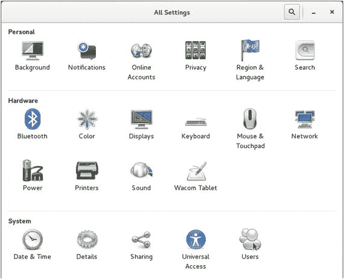
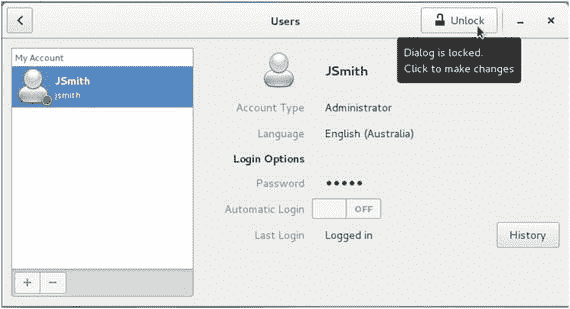
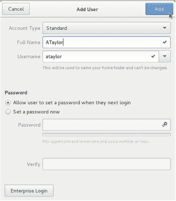

# 5.用户和组

By James Turnbull and Dennis Matotek

第 4 章介绍了 Linux 基础知识以及用户和用户组的概念。我们解释了用户和组如何拥有文件和对象。我们还演示了所有权如何与权限相结合来控制对这些文件和对象的访问。用户和组也用于启动和运行流程。

在本章中，我们将详细介绍用户和组是如何工作的，从您登录时会发生什么以及如何控制其中的一些过程开始。我们将演示如何创建用户和组，为您提供更多关于密码的信息，并解释 Linux 控制对您的主机的访问的过程。

我们将要谈论的话题包括`su`和`sudo`命令。这些命令允许您以其他用户的身份运行命令，特别是`root`用户。因此，这些命令允许您避免作为`root`用户登录来执行管理任务。`su`和`sudo`命令对于安全管理您的主机至关重要。

## 登录后会发生什么？

在第 [4](04.html) 章中，我们讨论了让用户登录到 Linux 主机，您看到了一些示例屏幕，显示了如何输入您的用户名和密码。在这一章中，我们将进一步解释当你登录时会发生什么，并且我们将开始探索在这个过程中你可以管理的一些选项和安全控制。

那么，在输入用户名和密码之后，在进入命令行提示符或图形用户界面(GUI)屏幕之前，实际上会发生什么呢？这个过程在不同的发行版之间略有不同，但通常会执行一个名为`login`的应用程序，并执行以下操作:

*   检查用户和组是否存在，以及是否允许用户登录
*   检查是否允许用户从特定位置登录(例如，只有一些用户可以登录到控制台，或者连接到 Linux 主机的屏幕)
*   检查密码是否正确，如果密码不正确，允许指定次数(通常为三次)的重试
*   检查密码是否有效，如果密码过期，则提示用户输入新密码
*   设置环境变量，如用户的主目录和路径
*   启动Shell进程
*   向用户显示命令行提示符或 GUI 屏幕

在接下来的小节中，我们将带您完成这些过程，并解释如何配置和更改其中的一些步骤以适应您的环境。您将从学习如何创建、删除和管理用户和组开始。

Note

在本章中，我们将演示命令行用户管理，但是如果您喜欢以这种方式管理您的用户和组，我们向您展示的大多数内容也可以从 GUI 工具中获得。在应用程序搜索栏中，键入“用户”，你会找到用户应用程序(CentOS)或用户帐户(Ubuntu)——或者打开设置或系统设置菜单，你会在那里找到它们。

## 使用用户和组

管理对 Linux 主机的访问的核心是用户和组的概念。我们在第 4 章中介绍了用户和用户组，您会发现它们很像微软 Windows 平台上的用户和用户组。

您可以通过两种方式组织主机上的用户和组。一种方法是向域中的每个主机添加用户和组；另一种方法是将用户管理集中在一个或两个身份验证服务器上。在本章中，我们将解释前者，在第 [16 章](16.html)中，我们将解释后者。

与在 Microsoft Windows 主机上一样，每个需要登录到您的主机的人都需要创建一个用户。许多应用程序，如 web 和邮件服务器，也需要创建用户。当它们启动时，这些应用程序将利用该用户的权利和特权来访问系统资源，如文件、网络或主机的其他方面。

Linux 主机上的每个用户还需要至少属于一个组，但是也可以属于任意数量的其他组。组是用户的集合，因为他们相似或需要访问特定资源而聚集在一起。例如，您组织的销售部门中的所有用户可能属于一个名为`sales`的组。您可以配置您的主机，确保只有`sales`组中的用户可以访问销售部门的应用程序和文件。

Note

安装应用程序时，他们通常会安装运行这些应用程序所需的其他用户和组。

使用两个命令很容易创建用户和组:`useradd`(创建用户)和`groupadd`(创建组)。此外，我们可以使用两个命令来修改现有的用户和组，它们是`usermod`和`groupmod`。最后，为了完成生命周期，可以使用`userdel`和`groupdel`命令删除用户和组。

Tip

在 CentOS 和 Ubuntu 上使用用户和组是一个非常相似的过程，使用许多相同的命令和选项。我们会告诉你发行版之间的任何微小变化。

### 介绍 sudo

在我们开始解释如何创建用户和组之前，我们想讨论一下`sudo`命令，我们在第 [4 章](04.html)中已经讨论过一点。`sudo`命令允许用户运行命令，就好像这个人是以`root`用户的身份登录的，这是 Linux 的 Windows 管理员帐户。这种能力非常有用，原因有三:

*   它增加了安全性。
*   它允许更好地控制特权命令。
*   它为您提供了更好的审计跟踪，以了解谁在您的主机上做了什么。

Note

在 Ubuntu 上使用`sudo`而不是`root`用户的另一个好理由是 Ubuntu 默认不启用`root`用户。您根本无法以`root`用户的身份登录。

本章中我们将需要`sudo`，因为几乎所有用于管理用户和组的命令都需要`root`用户的特权才能运行。例如，只有`root`用户可以创建另一个用户。

当您运行`sudo`命令时，它会提示您输入密码(以确认您确实是您所说的那个人)，然后您可以在 CentOS 上使用`sudo`命令 5 分钟，在 Ubuntu 上使用 15 分钟。这段时间过后，系统会提示您再次输入密码。

Tip

第一次运行`sudo`命令时，它可能会警告您小心使用`sudo`命令的威力。

在 Ubuntu 上，`sudo`命令是可用的，并且是为您在安装 Ubuntu 时创建的用户配置的。如果您以该用户身份登录，您已经可以使用`sudo`命令了。您还可以通过将其他用户添加到`admin`组来为他们启用`sudo`访问。您可以使用`usermod`命令(您将在本章后面看到更多)将用户添加到组中。

```sh
$ sudo usermod -G admin ataylor

```

这里我们使用了`sudo`和`usermod`命令来修改一个名为`ataylor`的用户。我们通过指定`-G`选项和用户要添加到的组的名称，将用户添加到了`admin`组。(注意，我们已经使用了`sudo`命令来进行用户修改。唯一允许这样做的用户是您在安装主机时创建的用户；因此，您必须以该用户身份登录才能进行更改。)

在 CentOS 上，如果您没有将用户(`jsmith`)创建为管理员，默认情况下不会启用`sudo`命令，您需要启用它。为此，您需要使用一个名为`visudo`的命令来编辑`sudo`命令的配置文件`/etc/sudoers`。为此，您需要作为`root`用户登录并运行`visudo`命令。

```sh
# visudo

```

正如您在`#`命令提示符下看到的，您以`root`用户的身份登录，并且正在执行`visudo`命令。这将打开一个看起来很像`vi`或`vim`编辑器的编辑应用程序。该文件中有下面一行:

```sh
# %wheel ALL=(ALL) ALL

```

如上所示，这一行中的`#`表示您正在处理的行是一个注释。您需要取消对该行的注释。为此，将光标放在`#`附近，并按下`x`键两次。这将删除行中的散列(或井号，#)和一个空格字符。完成后，使用与使用`vim`相同的命令编写并退出文件，方法是键入冒号、`:`、`w`和`q`，然后输入 Enter 或`:wq`。这使得名为`wheel`的组中的任何成员都可以使用`sudo`命令。然后，您可以将用户添加到`wheel`组，如下所示:

```sh
# usermod –a wheel ataylor

```

同样，您使用`-a`选项和您想要最后添加到组中的用户名来指定组`wheel`。现在`ataylor`用户可以使用`sudo`命令了。您也可以使用`–G <group1>,<group2>`为用户设置群组，这将替换分配给用户的任何现有群组。

### 创建用户

现在您已经知道如何启用和使用`sudo`命令，我们可以开始查看用户和组了。让我们首先使用`useradd`命令创建一个新用户，如清单 [5-1](#Par41) 所示。

```sh
$ sudo useradd –m –c 'John Smith' jsmith
Listing 5-1.Creating a New User

```

Note

在清单 [5-1](#Par41) 中，您可以看到我们在`useradd`命令前面加上了`sudo`命令，以避免作为`root`用户登录。

命令有很多选项，我们在清单 [5-1](#Par41) 中只使用了几个。第一个参数`-m`告诉主机为用户创建一个主目录。主目录的名称和位置格式通常类似于`/home/` `username`。

Tip

例如，您可以用通用配置文件预填充新的主目录。为此，将文件添加到`/etc/skel`(skeleton 的缩写)目录。创建新的主目录时(使用`–m`选项)，该目录中包含的所有文件都被复制到用户的新主目录中。

`–c`选项添加了我们新用户的描述。该描述存储在`/etc/passwd`文件中。所有用户在这个文件中都有一个条目，我们将在本章后面检查这个文件和用于存储组数据的`/etc/group`文件。最后，我们指定了新用户的名字`jsmith`。

默认情况下，新用户将被禁用，并且没有设置密码。您将需要使用`passwd`命令更改用户的密码(我们将在本章后面更详细地介绍)。

表 [5-1](#Tab1) 列出了一些其他有用的`useradd`命令行选项。

表 5-1。

Some `useradd` Command-Line Options

<colgroup><col> <col></colgroup> 
| [计]选项 | 描述 |
| --- | --- |
| `-c` | 添加用户的描述 |
| `-d homedir` | 用户的主目录 |
| `-m` | 创建用户的主目录 |
| `-M` | 不要创建用户的主目录(仅限 CentOS) |
| `-s shell` | 指定用户将使用的Shell |

`–d`选项允许您指定用户的主目录。主目录是用户登录后所在的目录。这是用户拥有的用于用户文件的私有目录，适用于系统用户(如运行数据库的用户)或普通用户。`–M`选项告诉 Red Hat 派生的发行版不要创建主目录。该选项强调了在 CentOS 和 Ubuntu 发行版上创建用户的主要区别。在 Red Hat 衍生的发行版中，主目录是自动创建的。

Ubuntu 要求使用`–m`选项执行`useradd`命令；否则，不会创建主目录。

Note

关于在 Ubuntu 上创建用户的另一种方法，请参见侧栏“Adduser:Ubuntu 上的另一种方法”。

最后，`–s`选项允许您为用户指定不同于默认的 shell。

Tip

我们建议您阅读`useradd`命令的`man`页面，了解关于该命令的更多详细信息。

#### 用户默认设置

您的新用户也将使用各种默认设置创建(例如，用户 shell 的设置)。那么,`useradd`命令从哪里得到这些默认值呢？在 CentOS 和 Ubuntu 发行版中，默认值都包含在`/etc/default/useradd`文件中，您可以使用以下命令显示当前默认值:

```sh
$ sudo /usr/sbin/useradd -D

```

清单 [5-2](#Par56) 展示了这个文件的一个例子。

```sh
$ sudo cat /etc/default/useradd
# useradd defaults file
GROUP=100
HOME=/home
INACTIVE=-1
EXPIRE=
SHELL=/bin/bash
SKEL=/etc/skel
Listing 5-2.The /etc/default/useradd File

```

该文件通常在安装主机时默认填充，但您可以修改它以适应您的环境。

Note

当用户登录时，会为系统设置系统范围的默认值。这些可以在`/etc/login.defs`文件中找到。它包含创建用户时使用的 uid 和 gid 范围等内容。

表 [5-2](#Tab2) 显示了可以包含在`useradd`文件中的可能选项。

表 5-2。

The `/etc/default/useradd` File

<colgroup><col> <col></colgroup> 
| [计]选项 | 描述 |
| --- | --- |
| `SHELL` | 默认 shell 的路径 |
| `HOME` | 用户主目录的路径 |
| `SKEL` | 用于提供用户新主目录的默认内容的目录 |
| `GROUP` | 默认组 ID |
| `INACTIVE` | 密码过期后可以更改密码的最大天数 |
| `EXPIRE` | 用户帐户的默认到期日期 |

文件中的每个选项控制一个指定的默认值；例如，shell 选项为用户指定默认 SHELL。HOME 选项指定应该在其中创建所有新主目录的目录。SKEL 选项指定使用哪个目录来填充用户的主目录，正如我们前面讨论的，这默认为`/etc/skel`。GROUP 选项指定要使用的默认组 ID (GID)。它被设置为 group 100，或者“users”组，通常您不需要更改它。在接下来的部分中，我们将更多地讨论组、成员和 GID。

最后，非活动和过期这两个选项控制两种不同类型的用户帐户过期。非活动值控制用户密码过期后用户可以重置其密码的天数。这允许您指定如果用户的密码过期，用户在被标记为非活动之前有有限的时间重置该密码。然后，用户需要一些交互来重新启用它进行访问。设置为-1 将禁用此设置，设置为 0 将在密码过期后立即禁用该帐户。

Note

我们将在本章后面更多地讨论密码过期。

`EXPIRE`选项对于创建临时帐户很有用，因为它以`YYYY-MM-DD`的格式指定了帐户过期和禁用的日期。默认的`EXPIRE`允许你为所有账户指定一个日期。您也可以使用以下命令在命令行上创建个人帐户:

```sh
$ sudo useradd –e 2016-09-15 temp_account

```

此命令创建一个名为 temp_account 的帐户，该帐户将于 2016 年 9 月 15 日被禁用。

您可以通过执行带有`-D`选项的`useradd`命令来更改该文件中的许多默认设置。清单 [5-3](#Par67) 向您展示了如何为您的新用户更改默认 shell，表 [5-3](#Tab3) 显示了可用于`-D`选项的附加选项。

表 5-3。

The `useradd -D` Defaults

<colgroup><col> <col></colgroup> 
| [计]选项 | 描述 |
| --- | --- |
| `-b path/to/default/home` | 指定新用户主目录的路径前缀 |
| `-e date` | 指定默认到期日期 |
| `-f days` | 指定在密码过期多少天后帐户将被禁用 |
| `-g group` | 指定了默认组 |
| `-s shell` | 指定了默认Shell |

```sh
$ sudo useradd -D -s /bin/bash
Listing 5-3.Changing useradd Defaults with the -D Option

```

Tip

您还可以使用 chsh 命令更改您的默认 shell。使用 CentOS 上的`chsh -l`查看所有可用Shell的列表。在 Ubuntu 上，你可以在`/etc/shells`文件中看到列表。

### 创建组

我们之前提到过，每个用户必须至少属于一个组。默认情况下，在大多数 Linux 发行版上，包括 CentOS 和 Ubuntu，当您创建一个新用户时，还会创建一个与该用户同名的新组。新用户始终是该组的唯一成员。

但是之前我们说过`useradd`的默认组是 100？为什么不用那个？如果对 useradd 使用–N(无用户组)选项，或者如果 login.defs 文件中的用户组 _ENAB 设置为“否”,则将分配默认的 100(用户)组。默认情况下，`useradd`命令将创建一个与用户同名的组。

Note

为每个用户创建一个唯一的组称为用户专用组(UPG)方案。这是一种灵活的管理组权限的模型。你可以在 [`https://wiki.debian.org/UserPrivateGroups`](https://wiki.debian.org/UserPrivateGroups) 了解 UPG 的一些细节

在我们的例子中，我们的第一个用户`jsmith`，将自动属于一个名为`jsmith`的组。这个组被称为主要组。我们的用户也可以属于其他组，这些附加的组称为补充组。

那么，我们如何判断我们的新用户属于哪个组呢？要检查特定用户的详细信息，我们可以使用清单 [5-4](#Par74) 中所示的 id 命令。

```sh
$ id jsmith
uid=1001(jsmith) gid=1001(jsmith) groups=1001(jsmith)
Listing 5-4.The id Command

```

在清单 [5-4](#Par74) 中，我们使用`id`命令查询我们的新用户`jsmith`。但是这个命令返回了一些关于`uid`和`gid`的相当神秘的信息，我们用户的名字，以及一些数字。那么这些到底是什么？

每个用户和组在创建时都会被分配一个唯一的用户 ID (UID)和 GID。UID 的范围从 0 到 65535，根用户的 UID 始终为 0。GID 的范围也是从 0 到 65535，其中`root`用户的 GID 也总是为 0。

如果您为 root 用户运行`id`命令，您可以在下面一行看到结果:

```sh
$ id root
uid=0(root) gid=0(root) groups=0(root)

```

这显示了 UID 为 0、GID 为 0 的 root 用户。

Note

主机上的每个用户和组都必须有唯一的 UID 和 GID。不能在您的主机上创建与现有用户或组具有相同 UID 或 GID 的用户或组。您的操作系统将自动分配号码，并防止任何冲突。

大多数发行版为特定类型的用户和组保留了号码范围。在你的系统中有两种用户。一类是系统用户，如运行服务的用户和组，例如运行数据库或 web 服务器的用户。所以像“apache”和“www-data”这样的系统用户已经设置并知道了 UID。其他类型的用户是需要登录系统的“人”(例如，您和我)。

CentOS 发行版为分配的系统 UID 保留了从 1 到 200 的 UID 和 GID 范围(如 apache)。它们通过在创建用户时指定 UID 来实现这一点。从 201 到 999 的 UID 用于动态分配的系统 UID—这些是尚未定义 UID 的守护程序，将在安装时选择 UID。这是通过在创建用户时指定`--system`选项来完成的。普通用户是用 1000 及以上的 uid 创建的。

Ubuntu 为指定的系统用户保留 UID 和 GID 范围 1 到 99。100 到 999，用于动态分配的系统用户(同样通过传递`--system`选项)。在 Ubuntu 上，第一个新用户的 UID 和 GID 也是 1000。

Tip

您可以控制在`/etc/login.defs`文件中提供给用户的 uid 和 GID 的范围。编辑 uid 的`UID_MIN`和`UID_MAX`范围以及 GID 的`GID_MIN`和`GID_MAX`范围。你不太可能想这么做，但是选择就在那里。您也可以设置`SYS_UID_MIN`和`SYS_UID_MAX`以及群组。

因此，在清单 [5-4](#Par74) 中，我们为`jsmith`用户执行了`id`命令，并显示了用户的 UID 1001 和 GID 1001(UID 和 GID 后面的括号中是用户名和组名)。最后一个字段`groups`，显示主要组和任何补充组。

有两种方法可以将用户添加到一个或多个组中。首先，您可以在创建时使用`useradd`命令将用户添加到一个或多个组中。其次，您可以使用`usermod`命令修改现有用户并添加组。

在下面一行，我们将创建第二个名为`ataylor`的用户，并在创建她时将她添加到一些组中。

```sh
$ sudo useradd –m –c 'Anne Taylor' –G printing,finance ataylor

```

我们已经指定了`–G`选项，这允许我们提供一个逗号分隔的组列表，我们希望新用户`ataylor`加入这些组。`-G`选项允许我们的用户加入除主组之外的其他组，主组是在创建用户并共享她的用户名时创建的唯一组。这里的用户`ataylor`是一个名为`ataylor`的独特的 UPG 计划主组的成员，我们试图将她添加到附加的补充组`printing`和`finance`。

但是，如果我们现在执行该命令，它将会失败，因为在我们可以向这些组添加用户之前，每个组都需要存在，否则我们将会得到一条错误消息，用户将无法创建。这是在 Ubuntu 上的这种情况下会产生的错误消息:

```sh
useradd: unknown group printing
useradd: unknown group finance

```

所以在这种情况下，我们需要首先创建我们的组，我们可以用`groupadd`命令来完成，如清单 [5-5](#Par93) 所示。

```sh
$ sudo groupadd printing
$ sudo groupadd finance
Listing 5-5.Creating New Groups

```

表 [5-4](#Tab4) 显示了一些可用于`groupadd`命令的命令行选项。

表 5-4。

The groupadd Command-Line Options

<colgroup><col> <col></colgroup> 
| [计]选项 | 描述 |
| --- | --- |
| -我也想 | 设置组的 GID。这必须是一个唯一的数字。 |
| -r | 创建系统组(GID 在系统 GID 范围内)。 |

如果您希望用特定的数字覆盖自动生成的 GID，请使用`-g`选项。仅在 CentOS 上提供的`–r`选项允许您创建一个系统组，并确保为该组分配一个系统组范围内的 GID。

当我们尝试创建`ataylor`用户时，我们成功了，因为先决条件组现在已经存在。

```sh
$ sudo useradd -m -c 'Anne Taylor' -G printing,finance ataylor

```

我们还可以使用`usermod`命令将现有用户添加到组中。

```sh
$ sudo usermod -a -G accounts ataylor

```

usermod 命令用于修改现有用户。通过指定`–a`(用于追加)选项、`-G`选项和要加入的新组的名称(该组必须已经存在)，我们将`ataylor`用户添加到`accounts`组。

Tip

您可以使用`usermod`命令改变用户的许多方面，我们建议您阅读其`man`页面以获取更多信息。如果用户当前已登录，则在用户注销并再次登录之前，更改不会生效。

还可以使用`gpasswd`命令来管理组，该命令允许您委派管理组及其成员的责任。您可以为特定用户分配权限，以便在特定组中添加或删除用户。例如，您可以让销售团队中的某个人管理`sales`组的成员资格。你可以在`man`页面上更详细地了解`gpasswd`。

### 删除用户和组

除了创建和修改用户和组之外，您还希望能够删除它们。您可以使用以下两个命令来完成此操作:`userdel`和`groupdel`。`userdel`命令删除用户，`groupdel`命令删除组。现在让我们删除我们之前使用`userdel`命令创建的`ataylor`用户，如清单 [5-6](#Par104) 所示。

```sh
$ sudo userdel ataylor
Listing 5-6.Deleting a User

```

`userdel`命令删除用户，但是默认情况下，它不会删除用户的主目录。您可以使用`userdel`命令的`–r`选项强制 Linux 删除用户的主目录。这将删除`/home/` `username`目录和其中的所有文件，但不会删除该目录之外可能也属于该用户的任何文件。`userdel`命令也不会删除当前登录到主机的用户。

删除拥有文件的用户可能会有问题。如果您删除某个用户，那么该用户的所有对象将不再归该用户所有。您可以识别这些对象，因为用户名将在文件列表中被替换为以前的 UID(这同样适用于任何已删除的组)。因此，如果您创建另一个使用相同 UID 或 GID 的用户，该用户现在将拥有已删除用户的文件。在删除用户之前，确认用户拥有的文件和目录，并确定您将如何处理它们是一个非常好的主意。我们将在本章的后面向您展示如何分配文件和目录的所有权。鉴于此问题，有时禁用用户比删除用户更好。但是如果您决定删除一个用户，您可以运行命令`find / -user UID –o –group GID`来查找与您刚刚删除的用户相关联的所有文件。

要删除一个组，使用`groupdel`命令并指定要删除的组的名称。

```sh
$ sudo groupdel finance

```

此命令将从主机中删除该组。需要注意的是，`groupdel`命令不会删除任何用户的主要组——例如，在删除`ataylor`用户之前，不能删除`ataylor`组。如果要删除用户的主要组，必须先删除该用户。与用户一样，删除组会使这些组拥有的文件成为孤立文件。

Adduser: An Alternative on Ubuntu

Ubuntu 附带了两个额外的用户管理工具，`adduser`和`addgroup`。这些为`useradd`和`groupadd`命令提供了易于使用和方便的替代方法。运行`adduser`的正常方式是使用你想要创建的新用户的用户名。然后，该实用程序会要求您提供附加信息。例如，让我们为用户 Anne Taylor 添加一个帐户。

```sh
$ sudo adduser ataylor
Adding user `ataylor' ...
Adding new group `ataylor' (1001) ...
Adding new user `ataylor' (1001) with group `ataylor' ... Creating home directory `/home/ataylor' ...
Copying files from `/etc/skel' ... Enter new UNIX password:
Retype new UNIX password:
passwd: password updated successfully
Changing the user information for ataylor
Enter the new value, or press ENTER for the default
    Full Name []: Anne Taylor
    Room Number []:
    Work Phone []:
    Home Phone []:
    Other []:
Is the information correct? [Y/n] y

```

`adduser`命令要求提供它需要的所有变量，然后用正确的参数调用`useradd`命令来创建帐户。这意味着即使你使用`adduser`命令，你在`/etc/default/useradd`中配置的默认`useradd`选项仍然有效。

您还可以通过运行以下命令，使用`adduser`脚本快速将用户添加到组中:

```sh
$ sudo adduser username groupname

```

用户和组都需要已经存在于主机上。

adduser 和 addgroup 脚本本身也可以通过`/etc/adduser.conf`文件进行配置。默认情况下，他们将创建指定名称的用户，将他们放在同名的组中，创建主目录，并分配最低的可用用户和组 id。

### 通过 GUI 管理用户和组

CentOS 和 Ubuntu 都有管理用户的 GUI。在 CentOS 和 Ubuntu 上，通过选择应用程序➤系统工具➤设置(见图 [5-1](#Fig1) )启动设置面板，即可访问管理用户帐户的 GUI 工具。



图 5-1。

Accessing users from the system settings

您可以使用此设置面板在中更改用户。但是首先您需要获得 root 权限(或者在 GUI 中也称为管理员权限)才能在这里更改设置。图 [5-2](#Fig2) 显示您需要点击解锁按钮，然后会提示您输入密码。



图 5-2。

Unlocking the Users settings interface

在图 [5-2](#Fig2) 中，当前用户的列表在左侧面板中。要添加用户，请单击列表底部的+按钮。您可以通过单击–按钮删除用户。在图 [5-3](#Fig3) 中，我们添加了一个名为`ataylor`的新用户。



图 5-3。

Adding user ATaylor

在图 [5-3](#Fig3) 中，我们正在添加用户 ataylor。通过选择允许用户在下次登录时设置密码，ATaylor 将被允许在下次登录时创建自己的密码。我们可以添加两种类型的用户，标准用户或管理员。您还可以选择将用户的企业登录添加到 Active Directory 域或 IPA(身份策略审计)域。在第 16 章[中，我们将对此进行更深入的探讨。通过单击“Add”按钮，我们将在再次通过系统验证后添加用户 ataylor。](16.html)

Caution

允许用户在下次登录时创建自己的密码确实会带来安全风险。任何以`ataylor`身份登录的人都会被提示设置一个新密码，这样，他就可以访问`ataylor`所做的一切。在这种情况下，最好确保让`ataylor`尽快登录并确认访问。

最后，在图 [5-4](#Fig4) 中，我们展示了如何查看用户 JSmith 的登录历史。


图 5-4。

Login history for JSmith

在图 [5-4](#Fig4) 中，我们可以看到 JSmith 在 21:17 退出，并在 21:18 再次登录。使用标题栏中的箭头滚动浏览历史记录，查看更早的时间。

虽然您可以通过此应用程序添加和删除用户，但您不能管理组设置。为此，您必须使用命令行。

Note

请记住，Ubuntu Server 版本默认不附带 GUI，您应该使用提供的命令行工具。Ubuntu 桌面版确实附带了合适的 GUI 工具，因为它默认安装了一个 GUI。

### 密码

当您通过命令行创建帐户时，不会为该帐户设置密码。您现在可能想要设置或在某个时候更改用户的密码。为此，您可以使用`passwd`命令。根据运行命令的人的不同，`passwd`命令有两种工作方式。如果一个普通用户，比如`ataylor`，已经设置了一个密码并且运行了这个命令，那么系统会提示她修改自己的密码。您可以在清单 [5-7](#Par127) 中看到`passwd`命令的运行。

```sh
$ passwd
Changing password for ataylor.
(current) UNIX password:
Enter new UNIX password:
Retype new UNIX password:
Listing 5-7.Changing Your Password

```

你输入当前密码，然后输入新密码。系统会提示您输入两次新密码，以确保其正确无误。你还必须提供一个合适的密码。默认情况下，在大多数发行版中，会执行一些基本的密码检查，以防止您提供一个脆弱的或容易猜到的密码。在大多数发行版中，这些检查通常如下:

*   最小密码长度为四个字符
*   不是回文(即最后一个密码的反码)
*   与之前的密码不同，只是大小写发生了变化(即，从密码到密码)
*   一些基本的相似性检查
*   基于密码长度和字符组合(全是字母、全是数字等)的一些简单测试。)
*   简单的旋转检查(即旋转密码中的字母，例如`ginger`被更改为`ingerg`)

如果您提供的密码不够复杂，您会收到一条错误消息，指出您的密码有什么问题。然后会提示您提供一个更容易接受的密码。

或者，如果您以 root 用户身份运行 passwd 命令，您可以更改其他用户的密码，如清单 [5-8](#Par137) 所示。

```sh
$ sudo passwd jsmith
Listing 5-8.Changing Someone Else’s Password

```

在清单 [5-8](#Par137) 中，`passwd`命令提示您为用户`jsmith`提供一个新密码。

Tip

值得注意的是，作为`root`用户，您可以忽略任何关于错误密码的警告，并将用户密码更改为弱密码或容易被猜到的密码。

### 密码老化

密码时效允许您指定密码有效的时间段。该时间段到期后，用户将被迫选择新密码。这有利于确保密码定期更改，并且被盗、被破解或被前雇员知道的密码将具有时间限制值。不幸的是，对于许多用户来说，定期更改密码的需要增加了他们写下密码的愿望。我们建议您对大多数密码使用 30 到 60 天的密码期限，这取决于主机的性质和鼓励密码管理员。更重要的是，主机应该具有更短的密码到期期限(例如 30 天)，而不太重要的主机可以具有更长的期限。一些组织选择单个过期期限，以便该期限对所有主机上的所有用户保持一致。

有两种方法可以处理密码老化。第一种方法使用名为 chage 的命令行工具来单独设置或更改用户帐户的密码到期时间。清单 [5-9](#Par142) 显示了这个命令。

```sh
$ sudo chage -M 30 ataylor
Listing 5-9.The chage Command

```

清单 [5-9](#Par142) 使用`-M`选项将用户`ataylor`的密码有效期设置为 30 天。30 天后，用户密码将过期，系统会提示用户输入新密码。表 [5-5](#Tab5) 显示了其他几个你可以设置的变量。

表 5-5。

The chage Command Flags

<colgroup><col> <col></colgroup> 
| [计]选项 | 描述 |
| --- | --- |
| `-m days` | 设置密码更改的最小间隔天数。零允许用户随时更改密码。 |
| `-M days` | 设置密码保持有效的最大天数。 |
| `-E date` | 设置用户帐户过期并自动停用的日期。 |
| `-W days` | 设置在密码过期前警告用户更改密码的天数。 |
| `-d days` | 设置自 1970 年 1 月 1 日以来最后一次更改密码的天数。 |
| `-I` `days` | 设置密码过期后帐户被锁定的天数。 |

Tip

在 Unix/Linux 世界中，您会多次遇到日期 1970 年 1 月 1 日。这个日期也称为 Unix 纪元或 Unix 时间。它用于描述时间点，从 1970 年 1 月 1 日开始以秒为单位进行测量(例如 1229519557)。您可以使用命令`date +%s`在您的主机上找到 Unix 时间。

第一个选项`-m`，允许您指定密码更改之间的最短时间。设置为 0 允许用户随时更改密码。选项`-W`指定用户密码到期前的天数，用户将收到密码即将到期的警告。`-d`选项主要用于立即终止密码。通过将`-d`选项设置为`0`，用户的最后一次密码更改日期变为 1970 年 1 月 1 日，如果`–M`选项大于`0`，则用户必须在下次登录时更改密码。最后一个选项`-I`提供了一个以天为单位的时间框架，在该时间框架之后，密码过期且未更改的用户帐户将被锁定，从而无法用于登录。

如果不带任何选项运行`chage`，并且只指定用户，它将启动一系列交互式提示来设置所需的值，如清单 [5-10](#Par147) 所示。方括号[ ]之间的值表示该用户密码时效设置的当前值。

```sh
$ sudo chage ataylor
Changing the aging information for ataylor
Enter the new value, or press return for the default
Minimum Password Age [0]:
Maximum Password Age [30]:
Last Password Change (YYYY-MM-DD) [2016-06-27]:
Password Expiration Warning [7]:
Password Inactive [-1]:
Account Expiration Date (YYYY-MM-DD) [2016-07-28]:
Listing 5-10.Running chage Without Options

```

用户还可以使用带有`-l`选项的`chage`命令来显示密码何时到期。

```sh
$ chage -l ataylor

```

另一种处理密码老化的方法是在`/etc/login.defs`文件中为所有用户设置默认值。

清单 [5-11](#Par152) 显示了`/etc/login.defs`中可用于密码老化的控件。

```sh
PASS_MAX_DAYS    60
PASS_MIN_DAYS    0
PASS_WARN_AGE    7
Listing 5-11.The login.defs Password-Aging Controls

```

在清单 [5-11](#Par152) 中，我们使用`PASS_MAX_DAYS`选项将最长密码期限设置为 60 天，通过将`PASS_MIN_DAYS`选项设置为 0，允许用户随时更改密码，并使用`PASS_WARN_AGE`选项警告用户其密码将在密码到期日期前七天到期。

### 禁用用户

作为`root`用户，您还可以使用`passwd`命令来禁用和启用使用`–l`或锁定选项的用户帐户。例如，考虑以下情况:

```sh
$ sudo passwd –l ataylor

```

前面的命令将锁定`ataylor`用户，并阻止`ataylor`使用她的密码登录主机。然后，您可以使用`–u`或解锁选项解锁用户。

```sh
$ sudo passwd –u ataylor

```

但是，此命令不会完全禁止对主机的访问。用户可以通过其他身份验证机制访问主机，例如使用 SSH(安全Shell)进行远程访问的公钥。

还有一种方法可以完全禁止用户使用带有`--expiredate`选项的`usermod`命令:

```sh
$ sudo usermod --expiredate 1 ataylor

```

这会将帐户到期日期设置为 1970 年 1 月 1 日，并立即禁用该帐户。用户现在无法在主机上执行任何操作。

最后，您可以将登录 shell 设置为`/bin/false`或`/usr/sbin/nologin`。这不会锁定用户，但会禁止用户访问 shell。

```sh
$ sudo usermod –s /bin/false ataylor

```

Note

您还可以将用户的 shell 设置为命令。例如，您可以将用户的 shell 设置为`/bin/mail`命令，这是一个小的命令行邮件阅读器。当用户登录时，她只能访问该命令。

### 存储用户数据

首先，您的主机检查您的用户是否存在并被允许登录。Linux 发行版将用户、组和其他信息的详细信息存储在主机上的三个文件中:`/etc/passwd`、`/etc/shadow`和`/etc/group`。您通常不需要编辑这些文件，因为有一些命令和工具允许您添加、删除和管理用户和组。然而，知道它们包含什么信息是有用的。

Tip

如果您使用其他形式的身份验证，如 NIS(网络信息服务)、LDAP(轻量级目录访问协议)或 Active Directory，我们将在第 [16](16.html) 章中介绍，那么您的主机通常会查询这些身份验证存储之一，以确认您的用户存在并被允许登录。

第一个文件`/etc/passwd`，包含所有用户及其详细信息的列表。清单 [5-12](#Par168) 显示了一些`passwd`条目的例子。

```sh
root:x:0:0:root:/root:/bin/bash
daemon:x:2:2:daemon:/sbin:/sbin/nologin
Listing 5-12.
/etc/passwd Entries

```

每个条目都可以分成几个组成部分，用冒号分隔。

```sh
username:password:UID:GID:GECOS:Home Directory:Shell

```

用户名最多可包含 32 个字符，区分大小写(尽管通常都是小写)。下一个字段中的 x 是密码的标记。实际的密码存储在`/etc/shadow`文件中，我们将在侧栏“影子密码”中讨论它

接下来是 UID 和 GID。如前所述，在 Linux 主机上，每个用户帐户和组都被分配一个数字 ID；为用户分配一个 UID，为组分配一个 GID。根据发行版的不同，编号较低的 uid 和 GID 表示系统帐户和组，如 root 或 daemon。在 CentOS 和 Ubuntu 上，你通常会看到系统账户 uid 和 GID 低于 1000。

Note

如前所述，`root`用户的 UID 和 GID 是`0`。这应该是主机上 UID 和 GID 为 0 的唯一用户。

下一项是 GECOS 或注释字段。该字段通常包含诸如用户名、办公室位置和电话号码等数据。如果 GECOS 字段中有多个数据项，则用逗号分隔每个数据项。

接下来是用户的主目录。正如我们在第 4 章[中描述的](04.html)，它通常位于`/home`目录中(例如`/home/jsmith`)。

最后一项是用户的默认 shell。正如我们在第 4 章[中讨论的，shell 是一个命令行环境，用户通过它与主机交互。每个 shell 都是通过运行二进制文件来初始化的。例如，要启动 Bash shell，需要执行`/bin/bash`二进制文件。这个二进制文件在`/etc/passwd`文件中指定。如果默认 shell 指向一个不存在的文件，那么用户将无法登录。](04.html)

清单 [5-12](#Par168) 中的第二行使用 shell `/sbin/nologin`，这是一个伪 shell，它不仅阻止用户登录，还记录对`syslog`守护进程的登录尝试。

Note

`syslog`守护进程是 Linux 日志服务器。它从操作系统和应用程序接收日志条目，并将它们写入文件，通常在`/var/log`目录中。我们将在第 18 章[中讨论更多关于登录的内容。](18.html)

除非用户被设置为不登录，否则大多数用户都会有一个 shell 条目，引用启动其 shell 的二进制文件，例如，`/bin/bash`。

Shadow Passwords

您可能已经注意到在`/etc/passwd`中没有出现密码，而是出现了字母`x`。这是因为现代发行版使用影子密码来处理密码管理。

以前，密码作为单向散列存储在`/etc/passwd`中，这提供了有限的安全性，并将用户名和密码暴露给暴力破解方法。暴力破解是一种攻击密码的方法，其中尝试数千或数百万个不同的密码，直到找到匹配的密码。`/etc/passwd`文件特别容易受到这种攻击，因为应用程序对它的使用要求它对所有用户都可读，或者对所有人都可读。当 passwd 文件的副本可能从主机上被窃取并在离线时被暴力破解时，这尤其危险。鉴于这种类型的密码存储在`passwd`文件中的安全性较低，现代计算机可以在几分钟内破解简单的密码，或者在几天内破解更难的密码。

影子密码通过将用户和密码分开并将密码作为散列存储在`/etc/shadow`文件中来帮助降低这种风险。默认情况下，使用 SHA512 哈希。这些 SHA512 哈希更难破解，为了进一步保护密码，`/etc/shadow`文件由`root`用户所有，`root`是唯一可以访问该文件的用户。下一行显示了来自`shadow`文件的一个典型行:

```sh
root:$6$RwETwzjv$ifht......7L/HiLCPR8Zc935fd0:13675:0:99999:7:::

```

您也可以将`shadow`文件分解成组件，像`passwd`文件一样，用冒号分隔每个组件。`shadow`文件的组成如下:

*   用户名
*   密码
*   上次更改密码的日期
*   密码更改的最小间隔天数
*   密码过期时间(天)
*   密码过期警告期限(天)
*   密码过期后该帐户被禁用的天数
*   自帐户被禁用以来的日期

用户名与`passwd`文件中的用户名相匹配。密码本身是加密的，两种类型的特殊字符可以告诉您可以作为密码字段前缀的用户帐户的状态。如果密码字段以`!`或`*`为前缀，则帐户被锁定，用户不允许登录。如果密码字段以`!!`为前缀，则从未设置过密码，用户无法登录主机。其余条目涉及密码老化，我们将在“密码老化”一节中讨论这些内容

### 存储组数据

在 Linux 主机上，关于组的信息存储在`/etc/groups`文件中。清单 [5-13](#Par195) 展示了这个文件的一个例子。

```sh
root:x:0:root
ataylor:x:501:finance,printing
Listing 5-13.Sample of the /etc/groups File

```

`/etc/group`文件的结构很像`/etc/passwd`文件，数据用冒号分隔。该文件分为组名、密码、GID 和该组成员的逗号分隔列表。

```sh
groupname:password:GID:member,member

```

组文件中的密码允许用户使用`newgrp`命令登录该组。如果启用了影子密码，那么像`passwd`文件一样，组文件中的密码被替换为 x，真实密码存储在`/etc/gshadow`文件中。

Login Messages

用户首先看到的是你的登录界面。在登录屏幕中放置一些重要的警告和信息是一个好主意。为此，您需要编辑`/etc/issue`和`/etc/issue.net`文件的内容。当您通过主机控制台上的命令行登录时，会显示问题文件，当您通过 SSH 会话登录到命令行时，会显示`issue.net`文件。大多数发行版都使用这些文件，包括 CentOS 和 Ubuntu。这些文件可以包含纯文本和特殊转义字符的组合，例如，允许您输出颜色、换行和回车。

您还应该包括一条警告消息，说明未经授权访问主机是被禁止的，并且将被起诉。您可以在文件中使用一系列转义字符中的一个来用来自您的主机的数据填充登录屏幕。我们建议您使用如下所示的登录消息:

```sh
^[c
\d at \t
Access to this host is for authorized persons only.
Unauthorized use or access is regarded as a criminal act
and is subject to civil and criminal prosecution. User
activities on this host may be monitored without prior notice.

```

^[c 转义字符清除屏幕，\d 和\t 转义字符分别显示主机上的当前日期和时间。如果你查看问题、issue.net 和 getty `man`页面，你还可以找到其他的转义字符。

除了`/etc/issue`和`/etc/issue.net`文件之外，`/etc/motd`文件的内容会在命令行登录后直接显示，您可能希望调整它们以包含可接受的使用策略或类似信息。

如果您使用的是贵由，可以在登录屏幕上设置消息。你可以按照这些 CentOS 的指令来做: [`https://access.redhat.com/documentation/en-US/Red_Hat_Enterprise_Linux/7/html/Desktop_Migration_and_Administration_Guide/customizing-login-screen.html`](https://access.redhat.com/documentation/en-US/Red_Hat_Enterprise_Linux/7/html/Desktop_Migration_and_Administration_Guide/customizing-login-screen.html)

对于 Ubuntu，您需要看到以下内容: [`http://askubuntu.com/questions/193357/how-do-i-create-a-popup-banner-before-login-with-lightdm`](http://askubuntu.com/questions/193357/how-do-i-create-a-popup-banner-before-login-with-lightdm) `.`

### 配置您的 Shell 和环境

在用户被认证和授权之后，他们的 shell 被启动。大多数 shell 都是高度可定制的，许多用户最终会调整 shell 环境的各个方面，以帮助他们更快、更有效地工作。

Bash shell 从`/etc/profile`文件中读取它的初始配置。该文件通常包含对其他全局配置文件的引用，用于为主机上除 root 用户之外的所有用户配置 Bash。最后，处理用户主目录中的所有配置文件。`.bash_profile`和`.profile`文件是最常用的，每个用户的主目录中都有这些文件。

Note

您可以在`bash man`页面的`INVOCATION`部分查看其他配置文件的完整列表。

#### 环境变量

定制 shell 的一个主要原因是设置环境变量。这些变量充当许多应用程序使用的默认选项。他们可以定义一些特性，比如你喜欢的文本编辑器，你喜欢的语言，以及用`ls`列出文件和目录时使用的颜色。您还可以定义自己的变量，用于自己的脚本。

要获得所有环境变量的完整列表，使用`env`命令。表 [5-6](#Tab6) 列出了最常见的定制变量。

表 5-6。

Environment Variables

<colgroup><col> <col></colgroup> 
| 名字 | 用于 |
| --- | --- |
| `HOME` | 用户的主目录 |
| `LANG` | 定义应用程序应该使用的语言文件 |
| `LS_COLORS` | 定义`ls`命令使用的颜色 |
| `MAIL` | 用户邮箱的位置 |
| `PATH` | 一个用冒号分隔的目录列表，shells 在其中查找可执行文件 |
| `PS1` | 定义正常提示 |
| `SHELL` | 当前Shell |
| `_` | 包含在此会话中执行的最后一个命令 |

您可以通过`echo`命令显示环境变量的内容。在想要显示的变量名称前加上`$`。

```sh
$ echo $PS1
\u@\h:\w\$

```

前面是一串特殊的转义码，在提示符下显示用户名`\u`，主机名`\h`，当前工作目录`\w`，以及最后一个字符`\$`。`\$`如果提示显示为 root 用户，则显示一个英镑(`#`)符号，否则显示一个美元符号(`$`)。有关可用转义码的完整列表，请参见`bash man`页的`PROMPTING`部分。

您可以通过在任何 Bash 配置文件中定义环境变量或者从命令行设置它们来更改环境变量。如果我们想改变我们的提示，使其包含一个时间戳，并打破它，给我们更多的空间来键入命令，我们可以添加`\T`和`\n`代码:

```sh
$ PS1="[\T] \u@\h:\w\n\$ "
[12:50:59] jsmith@au-mel-ubuntu-1:∼
$

```

Tip

你可能已经注意到我们有时用$有时不用。这里的简单规则是，如果我们引用变量并在它前面加上$前缀，那么我们感兴趣的是变量的值(即变量的内容)。没有$，我们说的就是变量本身。

另一个有用的例子是在路径中添加目录。您可以快速在路径中添加前缀或后缀目录。您可以在路径的开头添加一个目录，如下所示:

```sh
$ PATH=/home/ataylor/scripts:$PATH

```

这里，我们将目录`/home/ataylor/scripts`添加到路径的前面，然后通过用冒号分隔并指定`$PATH`值来包含现有路径。这允许您将二进制文件、脚本或其他应用程序放入路径中，每次运行命令或应用程序时都会搜索该路径。在这种情况下，当执行命令时，Linux 会先在`/home/ataylor/scripts`目录中查找命令，然后再在主机上的其他地方查找。

您可以使用相同的基本结构将目录添加到路径的末尾:

```sh
$ PATH=$PATH:/home/ataylor/scripts

```

然后，当您运行一个命令时，Linux 将搜索您的路径中的所有目录，如果没有找到匹配的命令或应用程序，它将搜索您的后缀目录。

任何类型为`KEY=value`的字符串都被 Bash 假定为环境变量赋值。将变量改为大写是一种惯例。

当然，在命令行上设置环境变量只会在会话期间改变它们。如果您注销，它们将恢复到以前的配置。要使这样的更改永久化，请将它们放在位于您的主目录中的`.bash_profile`文件中，例如，

```sh
PATH=$PATH:/home/ataylor/scripts
export PATH

```

这里我们指定了新的路径，然后使用一个特殊的命令`export`来传播更改。通常情况下，对环境变量的更改只会更改进行更改的当前会话或脚本。为了在其他会话或脚本中使用它们，您需要导出它们。为了对所有用户进行路径或其他环境更改，将更改添加到`/etc/profile`文件中，或者通常将这些更改添加到`/etc/profile.d/`目录中的文件中。该文件由所有用户使用(除了`root`用户；使用`/root`目录下的`.bash_profile`文件修改`root`用户变量)来设定值。

Tip

你可以在 [`http://tldp.org/HOWTO/`](http://tldp.org/HOWTO/) `Bash-Prompt-HOWTO/`找到更多关于配置你的 Bash 提示符的信息。

#### 命令别名

配置 shell 的第二个原因是创建命令别名。别名允许您为常用命令创建快捷方式或设置默认选项。一个主要的例子是我们在第 [4 章](04.html)中看到的`ls`命令的别名。

当用`ls`列出文件时，我们在第 [4 章](04.html)中看到，我们得到了一个目录中文件的简单列表。通过使用别名，您可以让 shell 在每次键入`ll`时执行`ls -lah`，这样您就可以一直拥有一个完整的目录列表。您可以通过`alias`命令创建一个别名。

```sh
$ alias ll='ls -lah'
$ ll
total 40K
drwx------. 4 vagrant vagrant 4.0K Mar  9 06:07 .
drwxr-xr-x. 4 root    root    4.0K Mar  3 05:37 ..
-rw-------. 1 vagrant vagrant 2.2K Mar  9 06:08 .bash_history
-rw-r--r--. 1 vagrant vagrant   18 Nov 20 00:02 .bash_logout
-rw-r--r--. 1 vagrant vagrant  225 Mar  9 06:04 .bash_profile

```

您可以通过将别名添加到主目录中的`.bash_profile`配置文件来使其永久化。

要获得 shell 中定义的所有别名的列表，运行不带任何参数的`alias`命令。

```sh
$ alias
alias egrep='egrep --color=auto'
alias fgrep='fgrep --color=auto'
alias grep='grep --color=auto'
alias l.='ls -d .* --color=auto'
alias ll='ls -lah'
alias ls='ls --color=auto'

```

在这里，您可以看到我们定义的列表别名、其他列表别名，以及我们从`/etc/profile.d/colorgrep.csh`文件中获得的几个别名。

除非设置默认选项，否则不应定义与现有命令同名的别名。通过指定可执行文件的完整路径，您仍然可以运行原始命令，但是这可能会在您没有预料到的时候产生令人讨厌的意外(例如，在自动化脚本中)。

要删除别名，使用`unalias`命令。要删除我们的交互式删除，我们将使用:

```sh
$ unalias ll

```

要了解有关别名的更多信息，请参见`bash man`页面的`ALIASES`部分。

Bash shell 极其强大和灵活，它可以使日常管理任务变得非常容易。如果你想知道更多关于 Bash 的知识以及你可以用它做什么，请看 [`www.tldp.org/LDP/Bash-Beginners-Guide/html/`](http://www.tldp.org/LDP/Bash-Beginners-Guide/html/) 和 [`http://tldp.org/HOWTO/Bash-Prog-Intro-HOWTO.html`](http://tldp.org/HOWTO/Bash-Prog-Intro-HOWTO.html) 。

## 控制对主机的访问

您可以控制相当多的用户特征，包括用户何时以及如何登录，他们的密码是什么样的，以及他们更改和重置密码的频率。这些控件都是用户登录主机时检查的，一般由一系列模块管理。这些模块统称为可插拔身份验证模块(PAM)。几乎所有的 Linux 发行版，包括 CentOS 和 Ubuntu，都依赖 PAM 来控制用户如何以及何时与主机交互。

在本节中，我们将向您介绍 PAM 及其工作原理。您通常不需要对 PAM 配置进行太多的更改，但是理解它的工作原理是很重要的。

Note

我们将在第 [16](16.html) 章中详细讨论 PAM 如何与其他认证机制一起使用(例如，与 Active Directory 和 LDAP 的集成)。

PAM 最初是由 Sun Microsystems 设计的，用于提供插件认证框架。它在 Linux 世界中得到了大量的使用和开发，并且存在大量的 PAM 模块来执行从检查密码到创建主目录的各种功能。PAM 模块最初用于为缺乏身份验证或特定身份验证功能的应用程序提供身份验证和其他服务。后来，随着更复杂的身份验证类型的出现，如智能卡和一次性密码(或令牌)，PAM 成为集成和扩展身份验证机制的一种方式。不必为新的身份验证方法重写每个应用程序，只需添加 PAM 支持。然后，PAM 负责通过标准 API 进行身份验证的艰巨工作。

### 配置 PAM

本质上，PAM 是一个身份验证和授权检查的层次结构，当应用程序想要执行某个操作时，就会执行这些检查。这些支票叠在一起；例如，当登录时，我们检查用户是否存在，然后检查用户的密码是否有效，然后检查密码是否过期。这个堆栈通常由多个 PAM 模块组成，每个模块执行一些检查功能。此外，某些检查必须通过(例如，您的用户必须存在)，而其他检查可能是可选的。理解 PAM 的最好方法是检查一些 PAM 配置文件。

在大多数 Linux 发行版中，您有两个可能的位置来查找 PAM 配置信息。遗留文件`/etc/pam.conf`用于保存 Linux 发行版上的 PAM 配置信息，但是现在它已经被弃用，并被目录`/etc/pam.d`所取代。大多数现代版本的 CentOS 和 Ubuntu 都使用这个目录来保存 PAM 感知服务的配置文件集合。该服务与其要验证的应用程序同名；例如，`passwd`命令的 PAM 配置包含在一个名为`/etc/pam.d/passwd`的文件中。这些文件称为服务配置文件。

有各种各样的服务配置文件——例如，当用户登录到主机时，我们使用一个名为`login`的应用程序。当用户登录时，登录应用程序被触发，在`pam.d`目录中，您会发现一个名为`login`的文件，其中包含应用程序的认证配置。类似地，您会发现一个名为`sshd`的文件，它为通过 SSH 连接登录的用户执行类似的工作。

默认 PAM 配置中的其他常见服务以及在`/etc/pam.d`目录中找到的服务是`passwd`命令和 cron 调度守护进程。在这些文件中，您会发现这些应用程序使用的身份验证配置。

Note

我们将在第 [6](06.html) 章讨论 crontab 以及如何调度作业和动作。

不过，我们不会查看每个特定的文件，因为大多数服务都依赖于一些通用的身份验证配置。CentOS 和 Ubuntu 都有单独的文件定义通用认证配置。许多服务文件都引用并包含这种通用配置。在 CentOS 上，这个文件是`/etc/pam.d/system-auth`，它是在您安装主机时自动生成的，并使用一个名为`authconfig`的特殊命令进行更新。在 Ubuntu 上，同样的角色由四个独立的文件执行:`common-auth`、`common-password`、`common-session`和`common-account`。让我们看看清单 [5-14](#Par250) 中 CentOS `system-auth`文件的内容。

```sh
#%PAM-1.0
# This file is auto-generated.
# User changes will be destroyed the next time authconfig is run.
auth        required      pam_env.so
auth        sufficient    pam_unix.so nullok try_first_pass
auth        requisite     pam_succeed_if.so uid >= 1000 quiet_success
auth        required      pam_deny.so

account     required      pam_unix.so
account     sufficient    pam_localuser.so
account     sufficient    pam_succeed_if.so uid < 1000 quiet
account     required      pam_permit.so

password    requisite     pam_pwquality.so try_first_pass
local_users_only retry=3 authtok_type=
password    sufficient    pam_unix.so md5 shadow nullok
try_first_pass use_authtok
password    required      pam_deny.so

session     optional      pam_keyinit.so revoke
session     required      pam_limits.so
-session     optional      pam_systemd.so
session     [success=1 default=ignore] pam_succeed_if.so service
in crond quiet use_uid
session     required      pam_unix.so

Listing 5-14.The 
login PAM File

```

`system-` `auth`和其他服务配置文件有四个可能的指令。让我们使用清单 [5-14](#Par250) 中的一行来更详细地检查它们。

```sh
auth         sufficient    pam_unix.so nullok try_first_pass

```

我们行中的第一个指令是 auth，这是我们正在配置的管理组。PAM 中有四个主要的管理组，它们代表了可以配置的身份验证和授权过程的不同部分:

*   `auth`:这些模块执行用户认证，例如检查密码。
*   `account`:该管理组处理帐户验证任务，例如，确认用户帐户是否解锁，或者是否只有根用户可以执行操作。
*   这些模块设置密码，例如，检查以确保您的密码足够强。
*   这些模块检查、管理和配置用户会话。

Note

记得我们讨论过设置强而复杂的密码；密码管理组是您可以设置复杂性密码规则的地方之一。

通常为每个管理组分配一个或多个模块，通常按照指定的顺序检查这些模块，每个模块将返回成功或失败的结果。在 PAM 配置中，一个特定的模块也可能被多次指定。例如，在清单 [5-14](#Par250) 中，您可以看到所有四个管理组都指定了`pam_unix.so`模块。

```sh
auth        sufficient    pam_unix.so nullok try_first_pass
account     required      pam_unix.so
password    sufficient    pam_unix.so m5 shadow nullok try_first_pass use_authtok
session     required      pam_unix.so

```

这表明`pam_unix.so`模块可以为每个管理组执行检查和功能，该模块负责大多数标准 Unix 身份验证功能，如输入传统密码。例如，它可以确认用户在 auth 组中的密码是正确的，还可以确认该用户存在于`account`组中。

下一个指令`sufficient`称为控制标志，它告诉 PAM 如何处理模块的结果。如前所述，有些检查比其他检查更重要。控制标志告诉 PAM 如何处理成功或失败的结果，以及该结果如何影响整个身份验证过程。表 [5-7](#Tab7) 列出了四个 PAM 控制标志。

表 5-7。

PAM Control Flags

<colgroup><col> <col></colgroup> 
| 旗 | 描述 |
| --- | --- |
| `required` | 要使身份验证成功，必需的模块必须成功。 |
| `requisite` | 如果一个必要的模块失败，那么认证将立即失败。 |
| `sufficient` | 如果模块成功，认证立即成功。 |
| `optional` | 模块的成功或失败不影响认证。 |

`required`标志表示模块结果必须成功，认证过程才能成功。如果这个模块的结果是失败，那么整个认证也是失败的。如果多个模块堆叠在一起，堆栈中的其他模块也将被处理，但整体身份验证仍然会失败。

`requisite`标志还指示模块结果必须成功，认证才能成功。此外，与`required`标志不同，该模块的成功或失败将立即通知请求认证的服务，认证过程将完成。这意味着，如果任何模块堆叠在一起，并且一个带有`requisite`控制标志的模块出现故障，那么剩余待处理的模块将不会被执行。相比之下，利用所需的控制标志，堆栈中的剩余模块继续被处理。

下一个控制标志是`sufficient`。`sufficient`标志意味着该模块的成功足以使认证过程成功，或者如果模块被堆叠，则足以使堆叠成功。这取决于在该模块出现故障之前没有处理其他所需的模块。然而，如果一个`sufficient`模块出现故障，那么整个堆栈不会出现故障。

最后一个控制标志是`optional`。一个`optional`模块对于认证过程或模块堆栈的整体成败并不重要。它的成功或失败不会决定整个认证过程的成功或失败。

下一个指令`pam_unix.so`指示将使用什么 PAM 模块及其位置。如果您指定一个没有路径的 PAM 模块，那么该模块被假定位于`/lib/security`目录中。您还可以通过提供模块的路径，从这里的另一个位置指定模块，如下面一行所示:

```sh
auth required /usr/local/pamlib/pam_local.so id=-1 root=1

```

最后的指令是要传递给 PAM 模块的参数——在本例中，我们将参数`try_first_pass`和`nullok`传递给`pam_unix.so`模块。`try_first_pass`参数告诉模块查看模块是否已经收到密码，如果收到，则使用该密码进行身份验证。`nullok`参数告诉模块可以使用空白密码。大多数模块将忽略传递给它们的无效或不正确的参数，模块将继续被处理，尽管有些模块确实会生成错误消息或失败。

Tip

您可以找到大多数 PAM 模块的`man`页面(例如，`man pam_unix`将返回`pam_unix man`页面)。也可以在 [`www.linux-pam.org/Linux-PAM-html/Linux-PAM_SAG.html/`](http://www.linux-pam.org/Linux-PAM-html/Linux-PAM_SAG.html/) 找到文档。

还有最后一个我们需要提到的 PAM 函数:`include`。`include`函数允许您将一个 PAM 文件包含在另一个中。这就是我们的通用配置被包含在特定服务配置文件中的方式。为了查看这个函数，让我们来看看清单 [5-15](#Par272) 中 Ubuntu `login` PAM 服务配置文件的一个片段。

```sh
@include common-auth
@include common-account
@include common-session
@include common-password
Listing 5-15.The Ubuntu login PAM

Service Configuration File

```

该文件中有更多的配置，但是我们可以看到，使用格式`@include`，您可以在 PAM 服务配置文件中包含其他文件。所以`@include common-account`会将文件`common-account`的内容包含在`login`文件中。当使用`login`文件时，该文件中指定的每个模块将被处理。文件在被包含的地方被拉进来并被解析，被包含的文件中的任何模块都按顺序执行。

您也可以使用`include`选项作为控制标志，如下所示:

```sh
auth    include system-auth

```

这将包括来自文件`system-auth`的所有`auth`类型行。

## 更多关于须藤的信息

正如本章前面所讨论的，`sudo`命令允许您以另一个用户的权限运行一些命令，在大多数情况下是`root`用户。该命令的工作方式很像微软 Windows 中的`RunAs`命令，允许一个用户以另一个用户的身份运行命令。

Note

另一个名为`su`的命令，也称为替代用户或切换用户，允许您以特定用户的身份打开子 shell。通常用来改变`root`用户来执行某个动作。你可以通过它的`man`页面了解它。请注意，如果`root`账户被锁定，那么`su`将无法工作，因为它在 Ubuntu 上。您可以通过为`root`用户设置密码来解锁帐户，但通常您只会使用`sudo su`来临时打开根 subshell。使用`sudo su <user>`，您不需要知道您试图访问的用户的密码，因为您通过`sudo`使用权限。

要使用这个命令，您可以键入`sudo`，然后键入您想要执行的命令。如果您被允许在那个命令上运行`sudo`，您将被提示输入一个密码，通常是您自己的用户密码。那么指定的命令将以`root`用户的身份执行，除非您使用`–u <username>`选项为 sudo 指定一个不同的用户..这允许您执行`root`用户可以执行的操作，比如创建用户，而不需要以`root`用户的身份登录。您可以在清单 [5-16](#Par280) 中看到`sudo`在工作。

```sh
$ sudo userdel ataylor
We trust you have received the usual lecture from the local System Administrator.
It usually boils down to these three things:
    #1) Respect the privacy of others.
    #2) Think before you type.
    #3) With great power comes great responsibility.
Password:
Listing 5-16.
Using sudo

```

这个相当吓人的消息通常在你第一次使用`sudo`命令时出现；之后，您只会得到密码提示。

正确输入密码后，`sudo`命令不会在每次使用时提示您输入密码。输入密码后，`sudo`命令会给你一个宽限期，在此期间不会提示你输入密码。这个时间段在 CentOS 上是 5 分钟，在 Ubuntu 上是 15 分钟。过了这段时间后，当您下次运行`sudo`命令时，系统会再次提示您输入密码。

在 Ubuntu 和 CentOS 上，默认安装`sudo`命令。Ubuntu 其实连`root`用户的密码都不设置；相反，我们鼓励您总是使用`sudo`来运行特权命令。Ubuntu 上 admin 组的任何成员都可以运行`sudo`命令。在 CentOS 上，我们之前对其进行了配置，如果您是`wheel`组的成员，那么您可以使用`sudo`命令运行命令。

`sudo`命令也是高度可配置的。您可以使用`sudo`命令精确地指定可以执行哪些命令，包括将命令分组为不同的命令类别。您可以配置`sudo`命令，允许用户执行所有命令、部分命令，甚至执行命令时不提示输入密码(尽管不建议这样做)。

Tip

正如你在本章开始时学到的，你可以通过使用一个叫做`visudo`的特殊命令编辑一个叫做`/etc/sudoers`的文件来配置`sudo`能做什么。我们强烈建议你只使用`visudo`来编辑这个文件，因为糟糕的配置会使所有的`sudo`命令失败。我们将在“配置 sudo”一节中详细讨论这一点

那么，如果不允许您执行`sudo`命令，会发生什么呢？在清单 [5-17](#Par287) 中，我们尝试以用户`ataylor`的身份使用`sudo`命令，他没有使用`sudo`命令的正确权限。

```sh
$ sudo useradd –m –c 'Illegal User' iuser
ataylor is not in the sudoers file. This incident will be reported.
Listing 5-17.
Unauthorized sudo

```

使用`sudo`命令的失败尝试将被你的主机的`syslog`(或系统日志程序)服务记录，然后消息被发送到`/var/log/`目录中的一个文件。在 CentOS 上，你可以在`/var/log/secure`文件中看到`sudo`命令失败，在 Ubuntu 上它们出现在`/var/log/auth.log`文件中。将生成一条日志消息，显示日期、时间、试图执行`sudo`命令的用户以及用户试图执行的未授权命令。

```sh
Sep 1 20:27:43 au-mel-centos-1 sudo:       ataylor : user NOT in sudoers ; TTY=pts/1 ;
PWD=/home ; USER=root ; COMMAND=/usr/sbin/useradd –m –c 'Illegal User' iuser

```

这些消息允许您监视试图在您的主机上执行不适当操作的人，并且它们可用于检测企图的安全漏洞。

Note

在第 [18](18.html) 章中，我们将更多地讨论日志记录，以及如何监控类似本节中详述的消息，并发送警报或采取某种措施。

### 配置 sudo

`sudo`命令检查`/etc/sudoers`文件以获得运行命令的授权。使用`visudo`，您可以配置`sudoers`文件来限制特定用户、特定命令和特定主机的访问。

我们来看一下`/etc/sudoers`文件。首先，你需要使用命令`visudo`来编辑`/etc/sudoers`文件。`visudo`命令是一个特殊的编辑器，设计用来和`sudo`命令一起使用，它是编辑`sudoers`文件最安全的方式。该命令锁定文件以防多次同时编辑，提供基本的健全性检查，并检查任何解析错误。如果当前正在编辑`/etc/sudoers`文件，您将收到一条消息，提示您稍后再试。

我们将从如何允许用户`ataylor`运行`userdel`命令开始。我们已经将清单 [5-18](#Par295) 的内容添加到`sudoers`文件中。

```sh
ataylor ALL=/bin/userdel
Listing 5-18.Sample sudoers

```

我们可以把这条线分解成它的组成部分。

```sh
username host = command

```

清单 [5-18](#Par295) 显示用户`ataylor`被允许在所有主机上(使用变量`ALL`)使用命令`/bin/userdel`，就好像她是根用户一样。在命令选项中指定的任何命令都必须用其完整路径来定义。您还可以指定多个命令来授权使用，每个命令之间用逗号分隔，如下一行所示:

```sh
ataylor ALL=/bin/userdel,/bin/useradd

```

在前一行中，`ataylor`现在被授权使用`userdel`和`useradd`命令，就像她是`root`用户一样。在`sudoers`文件中的所有配置行必须只在一行，你可以使用\来表示配置在下一行继续。

单个`sudoers`文件设计用于配置多个主机。因此，它允许特定于主机的访问控制。您将在中央主机上维护您的`sudoers`文件，并将更新后的文件分发给您的所有主机。

Note

在第 [19](19.html) 章中，我们将讨论配置管理以及如何将这个文件分发给多个主机。

通过主机访问控制，您可以为不同的主机定义不同的授权，如清单 [5-19](#Par304) 所示。

```sh
ataylor au-mel-centos-1=/bin/userdel,/bin/useradd
ataylor au-syd-ubuntu-1=ALL
Listing 5-19.Using sudo Authorization on Multiple Hosts

```

在清单 [5-19](#Par304) 中，用户`ataylor`仅被允许在主机 au-mel-centos-1 上使用`userdel`和`useradd`命令，但是在主机 au-syd-ubuntu-1 上，她被允许使用由`ALL`选项表示的所有命令。

Caution

当使用`ALL`变量来定义对主机上所有命令的访问时，您应该小心。`ALL`变量不允许授权配置的粒度。

通过授予对特定目录中命令的访问权限，您可以更有选择性地进行授权:

```sh
ataylor au-mel-centos-1=/bin/*

```

这只适用于定义的目录，而不适用于它的任何子目录。例如，如果您授权访问`/bin/*`目录，那么您将不能运行`/bin/extra/`目录中的任何命令，除非您明确定义了对该目录的访问，如下一行中的配置所示:

```sh
ataylor au-mel-centos-1=/bin/*,/bin/extra/*

```

有时，您希望将特定命令的访问权限授予某个用户，但希望该命令以另一个用户的身份运行。例如，假设您需要作为特定用户启动和停止一些守护进程，比如 MySQL 或`named`守护进程。您可以通过将用户名放在命令前面的括号中来指定希望命令启动的用户，如下所示:

```sh
ataylor au-mel-centos-1=(mysql) /usr/bin/mysqld,(named) /usr/sbin/named

```

可以想象，授权命令、用户和主机的列表会变得很长。`sudo`命令还带有定义别名的选项。别名是相似用户、命令和主机的集合。通常在`sudoers`文件的开头定义别名。我们来看一些别名。第一种别名是`User_Alias`，它将用户分组。

```sh
User_Alias ADMIN = ataylor,jsmith

```

您以正在使用的别名类型的名称开始别名，在本例中为`User_Alias`，后面是您正在定义的特定别名的名称，在这里为`ADMIN`。接下来，指定属于该别名的用户列表。然后，您可以在配置行中引用此别名。

```sh
ADMIN=/bin/userdel,/bin/useradd, \
(named) /usr/sbin/named

```

在前一行中，我们已经指定别名`ADMIN`中的用户能够使用命令`userdel`、`useradd`和`named`。

您可以定义的下一种别名是命令别名`Cmnd_Alias`，它对命令集合进行分组。

```sh
Cmnd_Alias USER_COMMANDS = /bin/userdel,/bin/useradd

```

您可以将此别名与刚刚创建的用户别名结合使用。

```sh
ADMIN ALL=/bin/groupadd,USER_COMMANDS

```

现在，别名`ADMIN`中定义的所有用户都可以在`ALL`主机上使用命令`/bin/groupadd`以及命令别名`USER_COMMANDS`中定义的所有命令。

您还可以指定对主机集合进行分组的别名。`Host_Alias`别名可以指定主机名、IP 地址和网络的列表。

```sh
Host_Alias SERVERS = au-mel-centos-1, au-mel-centos-2, au-syd-centos-1

```

您可以将此别名与之前定义的别名结合使用。

```sh
ADMIN SERVERS=USER_COMMANDS

```

现在，`ADMIN`别名中指定的所有用户都可以在`SERVERS`别名组中定义的主机上运行`USER_COMMANDS`中指定的命令。

您也可以通过放置感叹号(！idspnonenote)来否定别名。)在他们面前。让我们来看一个例子。首先，您用一些您不希望用户使用的命令定义一个命令别名，然后您可以将该别名与 sudo 配置行结合使用。

```sh
Cmnd_Alias DENIED_COMMANDS = /bin/su,/bin/mount,/bin/umount
ataylor au-mel-centos-1=/bin/*,!DENIED_COMMANDS

```

在这里，用户`ataylor`可以使用 au-mel-centos-1 主机上`/bin`目录中的所有命令，除了那些在`DENIED_COMMANDS`命令别名中定义的命令。

让我们看看授权用户使用`sudo`的另一种方式。在`sudoers`文件中，您可以基于主机中的组信息定义另一种类型的别名，方法是在组名前面加上%。

```sh
%groupname ALL=(ALL) ALL

```

然后，您可以用主机上定义的组名替换`groupname`。这意味着定义的组的所有成员都能够执行您授权给他们的任何命令，在本例中是在`ALL`主机上的`ALL`命令。

在 CentOS 主机上，已经有一个名为`wheel`的组用于此目的，如果您在 CentOS 主机上取消注释`/etc/sudoers`文件中的以下行，那么添加到`wheel`组的任何用户都可以使用`sudo`命令在您的主机上获得`root`权限。在 Ubuntu 上这个组被称为`admin`而不是`wheel`。

```sh
%wheel ALL=(ALL) ALL

```

此外，`sudoers`文件本身有许多选项和缺省值，您可以定义它们来改变`sudo`命令的行为。例如，您可以配置`sudo`在使用`sudo`命令时发送电子邮件。要定义将电子邮件发送给谁，您可以使用以下行中选项:

```sh
mailto "admin@au-mel-centos-1.yourdomain.com"

```

然后，您可以使用更多选项修改`sudo`发送电子邮件的时间。

```sh
mail_always on

```

为了让您对可用的默认和选项有个概念，表 [5-8](#Tab8) 定义了一个与电子邮件相关的选项列表。

表 5-8。

Sending E-mail When `sudo` Runs

<colgroup><col> <col></colgroup> 
| [计]选项 | 描述 |
| --- | --- |
| `mail_always` | 每次用户运行`sudo`时发送电子邮件。该标志默认设置为`off`。 |
| `mail_badpass` | 如果运行 sudo 的用户没有输入正确的密码，则发送电子邮件。该标志默认设置为`off`。 |
| `mail_no_user` | 如果运行 sudo 的用户不在`sudoers`文件中，则发送电子邮件。默认情况下，此标志设置为开。 |
| `mail_no_host` | 如果运行`sudo`的用户存在于`sudoers`文件中，但无权在该主机上运行命令，则发送电子邮件。该标志默认设置为`off`。 |
| `mail_no_perms` | 如果运行`sudo`的用户存在于`sudoers`文件中，但无权执行他试图运行的命令，则发送电子邮件。该标志默认设置为`off`。 |

`sudoers`手册页详细介绍了许多其他选项和缺省值。

`sudo`命令本身也有一些你可以使用的命令行选项。表 [5-9](#Tab9) 显示了一些最有用的选项。

表 5-9。

`sudo` Command-Line Options

<colgroup><col> <col></colgroup> 
| [计]选项 | 描述 |
| --- | --- |
| `-l` | 为当前主机上的当前用户打印允许(和禁止)的命令列表 |
| `-L` | 列出在`sudoers`文件中设置的任何默认选项 |
| `-b` | 在后台运行给定的命令 |
| `-u user` | 以`root`以外的用户身份运行指定的命令 |

`-l`选项特别有用，它允许您确定当前主机上的当前用户被授权和禁止运行什么命令。

```sh
$ sudo -l
Password:
User ataylor may run the following commands on this host:
    (root) ALL

```

为了提高可读性，将您的规则分解成逻辑分组的文件并将它们放在`/etc/sudoers.d`目录中也是一个好主意。您将发出以下命令:

```sh
$ sudo visudo –f /etc/sudoers.d/01_operators

```

在上面的文件中，我们将放置特定于 operators 组的内容。Sudo 将浏览`/etc/sudoers.d/`目录并加载它找到的任何文件，如果存在的话，按顺序，如上。

`sudo`命令很复杂，如果执行不当，会使您的主机面临安全漏洞。我们建议您在实现任何`sudo`配置之前仔细测试它，并彻底研究`sudo`和`sudoers`手册页的内容。

Auditing User Access

跟踪用户在做什么是用户管理的一个重要部分。在第 [18](18.html) 章中，我们将讨论日志记录，事实上，记录用户行为的第一资源就是日志文件的内容。但是其他命令和资源对于跟踪用户及其活动也很有用。

`who`命令显示当前登录到主机的所有用户，以及他们登录到的终端。如果用户远程连接，该命令会显示他们连接的 IP 地址或主机名。

```sh
$ sudo who
root     tty1        Jul  3 12:32
ataylor      pts/0       Jul  8 11:39 (host002.yourdomain.com)

```

您可以修改`who`命令的输出，并且可以在 who `man`页面中看到选项的完整列表。可能最有用的命令行选项是–a，它结合了各种命令行选项，提供了登录到您的主机的用户、登录过程以及主机重启和运行级别详细信息的详细概述。

同样有用的还有`last`和`lastb`命令，它们分别显示用户最后一次登录主机的记录和不良用户登录的记录。如果您在没有任何选项的情况下执行最后一个命令，它将打印上次登录主机的报告。

```sh
$ sudo last
root       tty1                          Sat  Jul   3 12:32   still logged in
ataylor    pts/0         192.168.0.23    Sat  Jul   3 14:25 - 14:26  (00:01)
reboot     system boot   2.4.20-28.8     Sat  Jul   3 12:31         (4+05:40)

```

如您所见，`last`命令告诉您`root`已经登录，并且仍然处于登录状态。该列表还显示了用户`ataylor`，他从 IP 地址 192.168.0.23 登录，并保持登录一秒钟。最后一个条目显示了一个`reboot`条目。每次主机重新引导时，都会记录一个条目，给出重新引导的时间和主机引导到的内核的版本。

`lastb`命令产生相同风格的报告，但是只列出那些“坏”的登录换句话说，它列出了那些输入了不正确的密码或者由于其他错误导致登录失败的登录。

与`last`和`lastb`命令相关的是`lastlog`命令。`lastlog`命令显示一份报告，其中显示了主机上所有用户的登录状态，包括那些从未登录过的用户。该命令显示所有用户及其上次登录日期和时间的列表，或者如果该用户从未登录过，则显示一条指示`**Never Logged In**`的消息。使用命令行选项，您可以搜索特定用户的记录。阅读`lastlog`命令的`man`页了解更多详情。

## 摘要

在本章中，您学习了如何从命令行或通过 GUI 界面创建用户和组。您还了解了登录主机时会发生什么，以及 PAM 和如何控制对主机的访问。

本章还详细介绍了`sudo`命令以及如何使用它来避免使用`root`用户来管理您的主机。此外，我们研究了如何配置`sudo`来控制谁可以访问特定的命令，以及如何报告`sudo`的使用情况。最后，我们讨论了如何监控用户的登录。

在下一章，我们将看看当你的主机启动时会发生什么，以及如何启动、停止和管理服务。