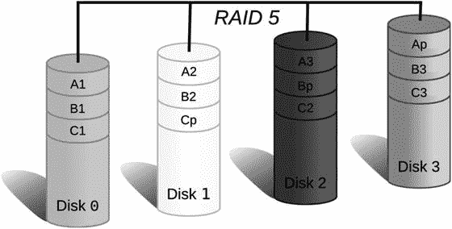
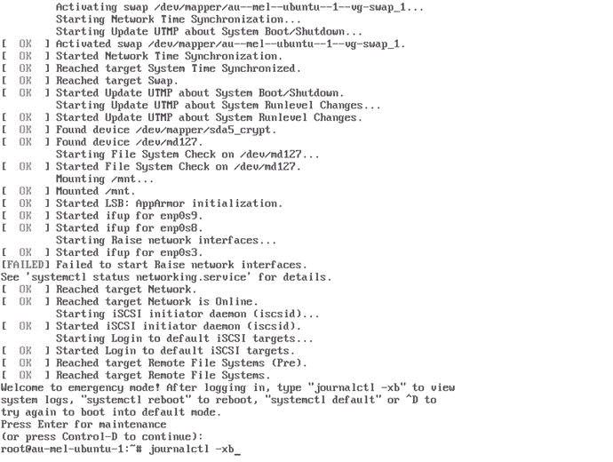
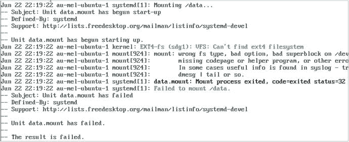
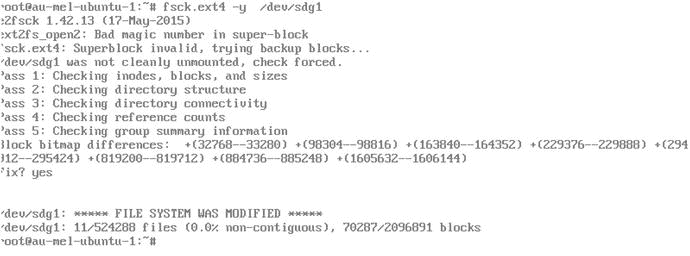
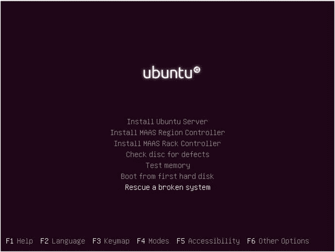
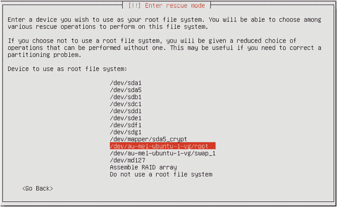
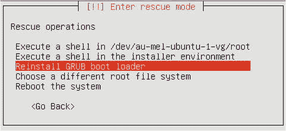
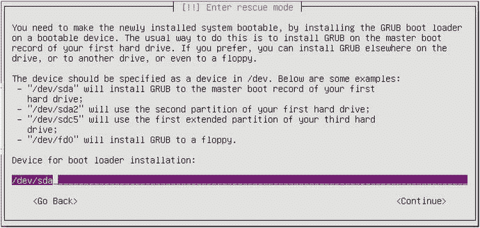
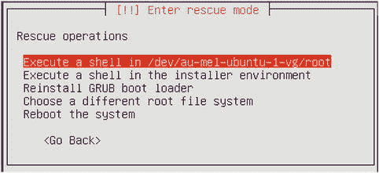
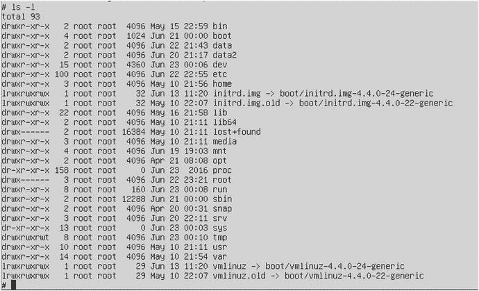

# 九、存储管理和灾难恢复

当您安装第一台 Linux 主机时，您接受了设置磁盘和分区的所有默认设置。现在，您已经掌握了一些基本的系统管理知识，让我们重新回顾一下存储配置，看看如何更改它以满足您的需求。我们将了解各种类型的存储硬件，以及如何利用存储管理软件为您带来优势。任何业务的关键部分都是数据，因此您需要确保数据既安全又可访问，并保持这种状态。

在本章中，我们将解释如何创建和管理磁盘分区和 RAID，如何使应用程序可以访问您的存储，以及如何从崩溃中恢复。

Note

在第 [14](14.html) 章中，我们将介绍如何备份和恢复您的数据。

## 存储基础知识

我们将从 Linux 如何处理存储开始。为此，我们将添加各种新磁盘，对这些磁盘进行分区，然后格式化和管理这些存储。

格式化后，Windows 下的驱动器显示为驱动器号，但 Linux 的工作方式不同。它没有驱动器号的概念，格式也不完全相同。相反，驱动器和存储显示为可以分区的设备。这些分区又可以被格式化或聚集到逻辑卷中，然后被格式化。

让我们从设备开始，设备是 Linux 存储的基本构建块。然后，我们将继续讨论分区和文件系统。

### 设备

我们在第 [4 章](04.html)中简单提到了设备文件。这些文件是 Linux 使硬盘驱动器、USB 和 DVD 驱动器等硬件设备可以从操作系统内部访问的方式。主机中的大多数(但不是全部)设备由`/dev`目录中的文件表示。

`/dev`目录是一个特殊的目录，由名为`udev`的服务填充。当主机启动时，内核检测到一个设备，它告诉`udev`，然后在`/dev`目录中创建该设备的一个表示。这些设备文件是内核为应用程序和服务提供访问设备的方式。

设备文件有很多种，但是在这一章中，我们将只讨论那些处理存储的文件，它们都属于块设备的范畴。此类别包括硬盘、USB 驱动器、磁带驱动器以及 CD 和 DVD 驱动器。所有类型的硬盘(例如 ATA、串行 ATA、SCSI、SAS 和 SSD)都由名称以`sd`开头的设备文件表示，它代表 SCSI 磁盘，因为所有这些不同类型的驱动器都像 SCSI 驱动器一样被访问。

Note

SCSI 是代表小型计算机系统接口的首字母缩略词，它是计算机如何连接和访问存储设备的规范。您可以在 [`http://en.wikipedia.org/wiki/SCSI`](http://en.wikipedia.org/wiki/SCSI) `.`了解更多关于此规范的信息

您可以通过使用`ls`命令列出主机上可用的磁盘设备，如清单 [9-1](#Par12) 所示。

```sh
$ $ ll /dev/sda*
brw-rw---- 1 root disk 8, 0 Jun  7 22:45 /dev/sda
brw-rw---- 1 root disk 8, 1 Jun  7 22:45 /dev/sda1
brw-rw---- 1 root disk 8, 2 Jun  7 22:45 /dev/sda2
brw-rw---- 1 root disk 8, 5 Jun  7 22:45 /dev/sda5
Listing 9-1.Listing Device Nodes

```

清单 [9-1](#Par12) 显示了四个块设备，或设备节点。它们对`root`用户和`disk`组是可读和可写的。接下来，通常显示文件大小的地方是由逗号分隔的两个数字。这些是设备主要编号和次要编号。主号告诉内核使用哪个设备驱动程序来访问设备，次号给出内核关于设备的特定信息，在本例中是分区号。最后，显示上次修改设备文件的日期和时间。

实际的设备文件名由前缀`sd`和一个表示它属于哪个磁盘的字母组成。第一个检测到的磁盘是`sda`，第二个是`sdb`，第三个是`sdc`，依此类推。最后，磁盘上的每个分区也有自己的设备节点，分区号是名称的最后一部分。这意味着`sda1`是磁盘`sda`上的第一个分区，`sdb2`是磁盘`sdb`上的第二个分区，依此类推。我们将很快讨论分区。

您可能会看到的其他设备有:

<colgroup><col> <col></colgroup> 
| 设备名称 | 你会在哪里找到它 |
| --- | --- |
| 巨人十六号 | Xen 虚拟机 |
| /dev/vda | KVM 虚拟机 |
| /dev/hda | KVM 虚拟机，较旧的 ATA 主机 |
| /dev/md | Linux 软件 raid |
| /dev/sda | 配备 SAS、SSD 等设备的物理服务器。 |

Note

旧系统不能支持很多驱动器，因为设备次编号范围从 1 到 255，每个磁盘只能有 16 个编号，所以 Linux 可以容纳 16 个硬盘，每个硬盘有 16 个分区，在耗尽设备节点之前从`/dev/sda1`到`/dev/sdp16`。现在你的系统理论上可以支持 10000 个驱动器( [`https://access.redhat.com/articles/rhel-limits`](https://access.redhat.com/articles/rhel-limits) )。这是关于 Linux 内核中块和字符设备的权威文档: [`www.kernel.org/doc/Documentation/devices.txt`](http://www.kernel.org/doc/Documentation/devices.txt) 。

如果您有硬件 RAID 控制器，它可能会以不同的方式命名您的阵列和任何分区。RAID 控制器将多个磁盘组合成廉价磁盘冗余阵列(RAID)。我们将在本章的后面详细讨论 RAID。要找出 RAID 阵列的设备节点，您可以使用以下命令列出`/dev/`目录中的所有块设备:

```sh
$ ls -l /dev | grep ^b

```

该命令将只列出以`b`开头的行。然而，检查内核内部日志缓冲区的内容会更准确。每当内核事件发生时，它都会被添加到内核内部日志缓冲区中。然后，日志守护程序将这个缓冲区写入日志文件，您可以使用`dmesg`命令直接查询它。

```sh
$ dmesg |less

```

大多数 RAID 控制器也至少使用部分内核 SCSI 子系统，您可以通过`less`中的内置搜索功能来搜索检测到的 SCSI 设备。在`less`窗口中输入`/scsi`并按回车键搜索包含字符串`scsi`的任何行。你可以按 n 键跳到下一场比赛。

## 划分

将磁盘添加到主机后，需要执行一些步骤来使其可用。首先，您可以在该磁盘上创建一个或多个分区。如果创建一个分区，系统需要能够找到关于分区几何的信息。它将这些信息存储在磁盘的开始处(有时会在磁盘的其他地方存储一份副本——稍后会详细介绍)。

我们之前已经描述过分区是将一块蛋糕分割成更小的块，这就是我们可以对物理磁盘做的事情。我们把磁盘分成小块。例如，这样您可以将日志和用户数据与操作系统分开，这样日志或用户就不会填满您的系统磁盘并导致问题。

在第 [6](06.html) 章中，我们向您介绍了两种不同的分区管理器，主引导记录(MBR)和 GPT (GUID 分区表)。您可能还记得，存储在磁盘前 446 个字节中的 MBR 描述了分区信息，它存储在引导记录之后的 64 个字节中。你不能在 64 字节中存储大量数据，所以一个磁盘可以容纳的分区数量最初是相当有限的。另一方面，GPT 最多可以容纳 128 个分区。

Disks and Partitions

我们之前已经解释了 MBR 和 GPT 分区之间的区别。如果您记得 MBR 保存在磁盘的前 512 个字节中，并且只能保存小于 2 Tb 的磁盘大小的足够信息。GPT 没有这种限制，可以在任何大小的磁盘上使用。这导致了分割磁盘方式的不同。

使用 MBR，分区有三种风格:物理的、扩展的和逻辑的。这是因为只有有限数量的分区信息可以存储在可供此类数据使用的 64 个字节中。一个分区需要 16 个字节的数据来描述，所以有了四个分区的信息，就满了！

作为一种变通方法，人们发明了扩展分区的概念。四个可用的物理分区中的一个被标记为扩展分区，然后作为无限数量的逻辑分区的容器。

这 16 个字节描述了每个分区，包括关于分区类型的信息，在磁盘上的什么地方可以找到它，以及它是否是可引导的，尽管 Linux 不关心后者。

您将使用 fdisk 实用程序来管理 MBR 磁盘。

对于 GPT，我们之前说过我们可以对高达 2ZiB 的磁盘进行分区。GPT 的默认限制是 128 个分区。GPT 使用 64 位逻辑块地址。它增加了校验和的可靠性。分区被赋予 UUIDs 和名称以避免冲突。

您可以使用`parted`或`gdisk`工具来管理 GPT。

您可以在 [`https://wiki.manjaro.org/index.php?title=Some_basics_of_MBR_v/s_GPT_and_BIOS_v/s_UEFI`](https://wiki.manjaro.org/index.php?title=Some_basics_of_MBR_v/s_GPT_and_BIOS_v/s_UEFI) 找到关于这些分区管理器的更多详细信息。

您可以使用`fdisk`实用程序创建和删除分区，或者如果您使用的是 GPT，`gdisk`或`parted`实用程序。让我们通过列出 Ubuntu 主机上第一个磁盘上的分区来看看已经有哪些分区(参见清单 [9-2](#Par34) )。因为只允许 root 用户读写原始磁盘设备，所以需要使用`sudo`。

*   引导分区的物理分区
*   容纳其他分区的扩展分区
*   与 LVM 一起使用的分区

```sh
$ sudo fdisk -l /dev/sda
Disk /dev/sda: 8 GiB, 8589934592 bytes, 16777216 sectors
Units: sectors of 1 * 512 = 512 bytes
Sector size (logical/physical): 512 bytes / 512 bytes
I/O size (minimum/optimal): 512 bytes / 512 bytes
Disklabel type: dos
Disk identifier: 0x105922fd

Device     Boot   Start      End  Sectors  Size Id Type
/dev/sda1  *       2048   999423   997376  487M 83 Linux
/dev/sda2       1001470 16775167 15773698  7.5G  5 Extended
/dev/sda5       1001472 16775167 15773696  7.5G 83 Linux

As you can see in the output of Listing 9-2), the installer created three partitions:

Listing 9-2.Listing Partitions with fdisk

```

你不想修改你的系统盘，但是假设你买了一个新硬盘，需要分区，你就可以开始用它存储数据了。首先，您需要检查磁盘是否被操作系统检测到，以及它的设备名称是什么。内核在启动时会打印它检测到的所有设备的信息，一旦登录，您就可以通过`dmesg`命令访问这些信息。

```sh
$ dmesg | grep sd
[    1.838874] sd 2:0:0:0: [sda] 16777216 512-byte logical blocks: (8.59 GB/8.00 GiB)
[    1.839510] sd 2:0:0:0: [sda] Write Protect is off
[    1.839824] sd 2:0:0:0: [sda] Mode Sense: 00 3a 00 00
[    1.839834] sd 2:0:0:0: Attached scsi generic sg1 type 0
[    1.840183] sd 2:0:0:0: [sda] Write cache: enabled, read cache: enabled, doesn't support DPO or FUA
[    1.842304]  sda: sda1 sda2 < sda5 >
[    1.842784] sd 2:0:0:0: [sda] Attached SCSI disk
[    2.178862] sd 3:0:0:0: [sdb] 16777216 512-byte logical blocks: (8.59 GB/8.00 GiB)
[    2.179508] sd 3:0:0:0: [sdb] Write Protect is off
[    2.179863] sd 3:0:0:0: [sdb] Mode Sense: 00 3a 00 00
[    2.179874] sd 3:0:0:0: Attached scsi generic sg2 type 0
[    2.180268] sd 3:0:0:0: [sdb] Write cache: enabled, read cache: enabled, doesn't support DPO or FUA
[    2.181498] sd 3:0:0:0: [sdb] Attached SCSI disk
[   25.702112] EXT4-fs (sda1): mounting ext2 filesystem using the ext4 subsystem
[   25.711836] EXT4-fs (sda1): mounted filesystem without journal. Opts: (null)

```

通过使用`grep`只显示包含`sd`的行，您可以将输出限制为关于 SCSI 磁盘子系统的信息。

Dmesg and the Kernel Ring Buffer

内核将关于它正在做什么的消息写入内核环形缓冲区。这个缓冲区保存一定量的消息，当它满了时，新的消息进来，旧的消息被丢弃。内核并不认为会有一个日志守护进程将这些消息写到一个文件中，例如在系统启动时。因此，内核将其所有消息写入环形缓冲区，您可以通过`dmesg`访问这些消息。

内核的环形缓冲区包含诸如内核是如何被调用的，内核找到的硬件，以及一旦找到它它做了什么。您可以使用`dmesg`找到您的网络设备以及您的磁盘是如何配置的。它还可以显示内核某个组件出现严重故障或问题的时间。

一些对`dmesg`有用的选项有:

*   -C 清除内核环形缓冲区
*   -H 人类可读
*   -T 人类可读时间戳
*   -w 关注或等待新消息
*   -l <level>仅显示特定级别的消息，如信息、紧急、错误、紧急</level>

在`dmesg`的输出中，我们可以看到系统已经检测到两个磁盘，`sda`和`sdb`。当它检测到`sda`时，它也发现了分区`sda1`、`sda2`和`sda5`。分区`sda5 (<sda5>)`周围的尖括号表示这是一个逻辑分区。另一个磁盘是新的，没有分区表(`sdb`)，所以让我们使用`gdisk`命令创建一个。

```sh
$ sudo gdisk /dev/sdb
sudo gdisk /dev/sdb
GPT fdisk (gdisk) version 1.0.1

Partition table scan:
  MBR: not present
  BSD: not present
  APM: not present
  GPT: not present

Creating new GPT entries.

Command (? for help): ?
B       back up GPT data to a file
c       change a partition's name
d       delete a partition
i       show detailed information on a partition
l       list known partition types
n       add a new partition
o       create a new empty GUID partition table (GPT)
p       print the partition table
q       quit without saving changes
r       recovery and transformation options (experts only)
s       sort partitions
t       change a partition's type code
v       verify disk
w       write table to disk and exit
x       extra functionality (experts only)
?       print this menu

```

如果您打算使用 MBR 分区表，那么`gdisk`实用程序反映了您可以在`fdisk`中使用的许多选项。如果我们使用`gdisk`实用程序中的`?`选项，就会得到帮助输出。让我们快速浏览一下这些选项。

您可以使用`l`选项列出设备上的分区。`d`选项允许你删除一个(小心，删除分区是危险的)。要删除当前的分区表并创建一个新的空分区表，使用`o`选项，这比较危险，但有时需要删除分区表。此选项将破坏您磁盘上的所有分区。

要创建一个分区，使用`n`选项，这将启动一个向导来引导您完成创建过程，您马上就会看到。

要列出当前分区表，请按 p。这将按分区表在内存中的位置列出，而不是按它在磁盘上的位置列出。

如果您做出了不想保存的更改，请按 q。这将退出`gdisk`，而不会将修改后的分区表写入磁盘。

分区还包含关于它们所包含的文件系统类型的信息。我们从`l`选项获得的十六进制标识符可以使用`t`选项进行设置。

当您对新的分区图满意时，您可以按 w 键将它保存到磁盘。最后，x 允许您访问高级的`gdisk`选项，例如恢复和转换选项、更改 GUID、更改磁盘几何和移动分区中包含的数据。我们不包括这些很少使用的专家选项的使用。

现在按 p 键打印当前磁盘上的分区列表。你会发现它是空的。通常，我们建议在一个数据存储磁盘上只创建一个分区，但是让我们来玩玩这个磁盘，创建几个分区。我们将创建一个 4 GiB 分区和两个 2 GiB 分区。

首先创建一个 2gb 大小的分区，按 n。

```sh
Command (? for help): n
Partition number (1-128, default 1):
First sector (34-16777182, default = 2048) or {+-}size{KMGTP}:
Last sector (2048-16777182, default = 16777182) or {+-}size{KMGTP}: 2G
Current type is 'Linux filesystem'
Hex code or GUID (L to show codes, Enter = 8300):
Changed type of partition to 'Linux filesystem'

```

首先要求您输入分区号，一个介于 1 和 128 之间的数字。我们将采用默认值 1。接下来要求我们选择磁盘扇区，每个扇区为 512 字节。现代系统在扇区边界对齐，这里我们选择从扇区 2048 或 1024 千比字节开始。接下来，输入`2G`表示您想要创建一个 2 GiB 大小的分区。最后，我们选择一个分区 ID，用十六进制代码表示，缺省值是 8300，即 Linux 文件系统。

重复该过程以创建另一个分区。

```sh
Partition number (2-128, default 2):
First sector (34-16777182, default = 4196352) or {+-}size{KMGTP}:
Last sector (4196352-16777182, default = 16777182) or {+-}size{KMGTP}: +2G

```

对于分区 2，我们再次采用分区号和第一个扇区的默认值。对于最后一个扇区，我们必须添加一个+2G，这样该实用程序将额外添加 2 GiB。

为了创建最后一个 4gb 分区，我们再次选择分区号、第一个扇区和最后一个扇区的默认值。

```sh
Partition number (3-128, default 3):
First sector (34-16777182, default = 8390656) or {+-}size{KMGTP}:
Last sector (8390656-16777182, default = 16777182) or {+-}size{KMGTP}:

```

这将创建一个分区所有剩余的磁盘空间。现在我们可以通过选择 p 选项来打印我们一直在做的事情。

```sh
Command (? for help): p
Disk /dev/sdb: 16777216 sectors, 8.0 GiB
Logical sector size: 512 bytes
Disk identifier (GUID): 1C42CAB1-754B-4B21-A7A9-D7CE87C8965B
Partition table holds up to 128 entries
First usable sector is 34, last usable sector is 16777182
Partitions will be aligned on 2048-sector boundaries
Total free space is 4061 sectors (2.0 MiB)

Number   Start (sector)      End (sector)      Size      Code     Name
   1               2048           4194304      2.0 GiB   8300     Linux filesystem
   2            4196352           8390655      2.0 GiB   8300     Linux filesystem
   3            8390656          16777182      4.0 GiB   8300     Linux filesystem

```

我们还没有把这个分区表写到实际的磁盘上；如果这看起来不对，我们可以使用`q`选项放心退出。如果我们满意，我们选择`w`选项来编写我们的 GPT 表。

```sh
Command (? for help): w

Final checks complete. About to write GPT data. THIS WILL OVERWRITE EXISTING
PARTITIONS!!

Do you want to proceed? (Y/N): y
OK; writing new GUID partition table (GPT) to /dev/sdb.
The operation has completed successfully.

```

前面我们提到了分区类型和 id。Linux 本身通常不关心分区类型，但是为了使管理更容易，我们建议您更改分区类型以匹配预期用途。正如我们已经说过的，分区 id 是一个十六进制代码。您可以通过发出一个`l`来获得所有可能选项的列表。在表 [9-1](#Tab1) 中，我们给你一个与 Linux 相关的列表。

表 9-1。

Linux Partition IDs and Types

<colgroup><col> <col></colgroup> 
| 十六进制代码/分区 id | 分区类型 |
| --- | --- |
| Eight thousand two hundred | `Linux swap` |
| Eight thousand three hundred | `Linux filesystem` |
| Eight thousand three hundred and one | `Linux reserved` |
| Eight thousand three hundred and two | `Linux /home` |
| Eight thousand three hundred and three | `Linux x86 root (/)` |
| Eight thousand three hundred and four | `Linux x86-64 root (/)` |
| Eight thousand three hundred and five | `Linux ARM64 root (/)` |
| Eight thousand three hundred and six | `Linux /srv` |
| Eight thousand three hundred and seven | `Linux ARM32 root (/)` |
| 8e00 | 使用 |

如果您想改变您的分区类型，您可以通过发出以下命令来实现。我们将在刚刚分区的`/dev/sdb`驱动器上再次查看 gdisk。在这里，我们将把第一个 2 GiB 分区从 Linux 文件系统类型改为 Linux 交换。

```sh
$ sudo gdisk /dev/sdb
Command (? for help): t
Partition number (1-3): 1
Current type is 'Linux filesystem'
Hex code or GUID (L to show codes, Enter = 8300): 8200
Changed type of partition to 'Linux swap'

```

这里，我们使用 gdisk 来管理分区表，并发出了`t`选项来更改分区的类型代码。我们选择分区 1，它显示我们当前的类型，“Linux 文件系统”。接下来，我们输入代码 8200，它现在已经将类型更改为 Linux swap。当我们打印结果时，我们会看到以下内容:

```sh
Command (? for help): p
Disk /dev/sdb: 16777216 sectors, 8.0 GiB
Logical sector size: 512 bytes
Disk identifier (GUID): 1C42CAB1-754B-4B21-A7A9-D7CE87C8965B
Partition table holds up to 128 entries
First usable sector is 34, last usable sector is 16777182
Partitions will be aligned on 2048-sector boundaries
Total free space is 4061 sectors (2.0 MiB)

Number  Start (sector)  End (sector)  Size        Code  Name
   1    2048            4194304       2.0 GiB     8200  Linux swap
   2    4196352         8390655       2.0 GiB     8300  Linux filesystem
   3    8390656         16777182      4.0 GiB     8300  Linux filesystem

```

我们必须选择`w`将此更改写入表格，选择`q`退出。内核现在重新加载分区图，并为您的分区创建新的设备节点。您将在`dmesg`的输出中看到磁盘检测例程已经运行并找到了您的新分区。您还可以检查它们的设备节点现在是否存在于磁盘上。

```sh
$ ls -l /dev/sdb*
brw-rw---- 1 root disk 8, 16 Jun 16 23:56 /dev/sdb
brw-rw---- 1 root disk 8, 17 Jun 16 23:56 /dev/sdb1
brw-rw---- 1 root disk 8, 18 Jun 16 23:56 /dev/sdb2
brw-rw---- 1 root disk 8, 19 Jun 16 23:56 /dev/sdb3

```

有时内核无法重新读取分区表，这意味着在重新启动主机之前，您无法访问新的分区设备文件。如果您正在编辑的磁盘上的其中一个分区仍处于装载状态，则会发生这种情况。若要避免重新启动，请确定您正在分区的磁盘上没有装载任何分区。我们将在这一章的后面讨论安装。

Note

您还可以通过运行`partprobe`命令让内核重新检测分区——无需重启。

另一个创建和删除分区的工具是 parted。与`gdisk`和`fdisk`不同，该实用程序允许您编辑分区的大小和顺序。我们建议你不要走用`parted`调整分区大小的道路，因为这些操作可能是灾难性的，而是使用 LVM。我们将在本章后面详细介绍 LVM。更多关于`parted`的信息，请访问 [`www.gnu.org/software/parted/index.shtml`](http://www.gnu.org/software/parted/index.shtml) 。

Caution

调整分区大小会导致不可恢复的数据丢失。务必首先备份您的数据！

Gibibytes VS. Gigabytes

当硬盘制造商为其产品做广告时，它希望可用的存储空间看起来尽可能大，因此它将每千兆字节计算为 1，000 兆字节，依次是 1，000，000 千字节，即 1，000，000，000 字节。

但是因为计算机上的所有计算都是通过二进制算术来完成的，所以实际的乘法值是 1024(gibi 的意思是 2 <sup>30</sup> )。但是，如果一家存储制造商使用了这一因素，那么与竞争对手相比，它的设备似乎会更小，所以它不会。

为了避免这些计算大小的方法之间的混淆，使用 1，024 因子的值创造了新的术语:kibibyte、mebibyte、gibibyte 等等。它们用 KiB、MiB、GiB 等表示。Linux 文件系统工具使用 1，024 因子，因此如果您购买一个 500 GB 的磁盘，当通过 Linux 查看时，它的大小将总是小于 500 GiB。

更多信息，请参见 [`http://en.wikipedia.org/wiki/Gigabyte`](http://en.wikipedia.org/wiki/Gigabyte) `.`

## 文件系统

您现在已经创建了分区，但是还没有准备好使用它们。接下来您需要做的是创建一个文件系统。你可能知道这就是格式化。

文件系统有点像库。它存储大量数据，并有一个目录，以确保您可以找到您正在寻找的东西。过道和货架的布局以及目录的设计决定了查找和检索任何特定信息所需的时间。创建文件系统就像初始化目录并将书架移到一个空的库中。

正如没有适合所有图书馆的最佳过道和书架布局一样，也没有适合所有用途的“最佳”文件系统。我们不会涉及太多细节，但是让我们看看一些最常用的 Linux 文件系统。表 [9-2](#Tab2) 列出了它们的主要特征。

表 9-2。

Linux Filesystems and Their Main Features

<colgroup><col> <col></colgroup> 
| 文件系统 | 特征 |
| --- | --- |
| Ext2 | 稳定，通用，可收缩或膨胀 |
| Ext3 | 稳定，通用，快速恢复，可收缩或膨胀 |
| Ext4 | 稳定、通用、快速恢复，比 ext3 有所改进 |
| XFS | 稳定，通用，恢复快，可在线扩展 |
| btr 护堤 | 不稳定、容错、写时拷贝(COW)、池化和多设备跨转 |

ext2 和 ext3 文件系统是较老的文件系统。这些文件系统的一般用途是在其上存储许多小文件。对于电子邮件存储、网站存储或 office 文件存储来说，它们是文件系统的良好选择，因为这些文件通常由许多大小高达数百千字节的文件组成。在较新的系统上，你很少看到 ext3，但是在 Ubuntu 16.04 上，默认情况下，你会看到 ext2 作为`/boot`分区的文件系统。

ext2 和 ext3 的主要区别之一是日志支持。对于 ext2，如果发生崩溃，在可以再次挂载磁盘之前，fsck 会等待很长时间。为了解决这个问题，创建了日志文件系统。Ext3、ext4 和 XFS 就是这样的日志文件系统，因此没有 ext2 那样长的恢复等待时间。有关更多信息，请参见侧栏“日志文件系统”。

有了 ext3 的经验教训，ext4 得到了进一步的发展。它提供了一些 ext3 中没有的特性，比如在线碎片整理、更好的日志可靠性和更快的文件系统检查。Ext4 旨在成为一个性能卓越的全方位文件系统。它可以支持高达 1 兆字节的卷和 16 兆字节的最大文件大小。这是 Ubuntu 16.04 发行版的默认选择。

存储视频、大型图像或数据库文件的另一个选择是 XFS 文件系统。它提供了一些与 ext4 相同的优点；但是，您不能收缩 XFS 分区(在线)。它的性能不亚于 ext4。它最多可以支持 8ex bibyte 和 8ex bibyte 的文件大小。这是 CentOS 7 的默认选择。

最后，Btrfs 是一个更新的文件系统，具有与 XFS 和 ext4 不同的特性。首先，它可以支持大得离谱的卷(16 兆字节)和相同的最大文件(16 兆字节)。在如此大的规模下，ext4 和 XFS 上的日志记录变得非常慢而且不可能。它旨在自然地支持快照和池化等操作和组织。它还具有自动碎片整理和清理等功能，使用校验和来自动检测和纠正错误。根据工作负载的不同，Btrfs 可能是一个不错的选择，而且在一定规模下，它是唯一的选择。由于 Raid5/6 配置中最近出现的一些写入漏洞问题，我们在表 [9-2](#Tab2) 中将它列为不稳定。查看此页面以了解文件系统的最新状态: [`https://btrfs.wiki.kernel.org/index.php/Status`](https://btrfs.wiki.kernel.org/index.php/Status) 。

Note

Btrfs 不是唯一的大规模文件系统，但它是 Linux 默认安装中可用的文件系统。像 ZFS 这样的其他软件也很受欢迎，性能也很好，但是 ZFS 由于其许可证的原因不能再发行(它不能成为 Linux 发行版的一部分)。尽管如此，您仍然可以在 Linux 上使用它；不过需要自己下载安装: [`http://zfsonlinux.org/`](http://zfsonlinux.org/) 。

您可以在 [`http://en.wikipedia.org/wiki/List_of_file_systems`](http://en.wikipedia.org/wiki/List_of_file_systems) 和 [`http://en.wikipedia.org/wiki/Comparison_of_file_systems`](http://en.wikipedia.org/wiki/Comparison_of_file_systems) 找到文件系统的详尽列表及其特性对比。

Journaled Filesystems

想象一下，在一个图书馆里，一本书被归还后，图书管理员会走开，在书架上找一个空的地方放书，然后更新目录，然后回到前台处理下一本书——在此期间，任何人都不可能借到书。还书的顾客也可能会想，仅仅因为他们站在图书馆里，图书馆目录就知道他们已经还书了。这不是一个有效的系统，顾客可能会排队等着还书，或者更糟糕的是，把书放在地上就走了。

有了退书滑槽，这个问题就可以解决了。一旦书被放入返回槽，顾客就可以回去工作了，因为他们知道书已经被图书馆安全地接受了。当图书馆不忙于人们借阅新书时，图书管理员可以处理还书。即使图书馆关门前没有处理好斜道里的书，它们也不会丢失。他们第二天还会在滑槽里。

日志文件系统利用了循环缓冲区，它的工作方式有点像一个带有书籍滑道的图书馆。这是文件系统上的一个区域或日志，保存尚未提交到文件系统存储主要部分的更改。任何需要写入磁盘的信息都放在日志中，然后当操作系统有空闲时间时，再放在磁盘的最终位置。同样，如果计算机崩溃，日志中的数据也不会丢失。如果系统崩溃，可以在重新装载磁盘后重新应用日志。这有助于防止应用部分更改，并在系统出现故障时避免损坏。

不过，我们的比喻在这里失效了。在我们的文件系统库中，人们也可以从还书槽借书，如果还书槽太满，图书管理员可以忽略想借书的人。

大多数现代文件系统使用日志，尽管有些文件系统仅将日志用于文件元数据。像 Btrfs 这样的文件系统可以用不同的方式处理元数据。您可以选择不同于文件数据的元数据布局(例如，元数据为 raid1，数据为 raid10)。对于频繁更新的文件数据，Btrfs 使用日志树，这是一个按子卷记录更改的日志，有助于在崩溃或重新启动时保持一致性。

### 创建交换文件系统

我们将使用您之前创建的第一个分区`/dev/sdb1`作为交换分区。为这个文件系统选择文件系统很容易，因为只有一种交换文件系统格式。让我们首先使用`mkswap`命令来设置它，如清单 [9-3](#Par102) 所示。

```sh
$ sudo mkswap /dev/sdb1
Setting up swapspace version 1, size = 2 GiB (2146430976 bytes)
no label, UUID=6d0ce2f6-f9f6-4ac2-91f6-3099a40d5624
Listing 9-3.Setting Up Swap Space

```

您正在使用`mkswap`实用程序将`/dev/sdb1`标记为交换空间。您可以使用生成的 UUID 在`/etc/fstab`文件中添加一个条目，该文件列出了将在主机上使用的所有文件系统(参见侧栏“UUID”了解什么是 UUID)。我们将在本章的后面回到`/etc/fstab`文件。从技术上讲，您没有格式化分区；相反，您正在编写少量的信息向内核表明它可以用作交换空间。

您可以通过`swapon`命令立即激活新的交换分区。这个命令告诉内核它可以使用指定的分区作为交换空间。

```sh
$ sudo swapon /dev/sdb1

```

该命令将完成，但不打印任何内容，但是您可以检查`dmesg`以了解发生了什么。将输出输入`tail`，将显示的行数限制在指定的数量。

```sh
$ sudo dmesg | tail -n 1
[13066.031700] Adding 2096124k swap on /dev/sdb1\.  Priority:-2 extents:1 across:2096124k FS

```

检查交换的另一种方法是查看`free`命令是否报告了交换空间。指定`-h`选项，以人类可读的形式显示尺寸。

```sh
$ sudo free -h
         total       used     free      shared  buff/cache   available
Mem:     992M        520M     62M       12M     409M         321M
Swap:    3.0G        0B       3.0G

```

或者，您可以使用`swapon`命令:

```sh
$ swapon –s
Filename        Type               Size           Used        Priority
/dev/dm-1       partition          3145728000        0              -1

```

该命令报告了总共 3.0 G 的交换空间，这是我们已经拥有的原始 1 G 加上我们刚刚添加的 2 G。当我们讨论绩效管理时，我们将在第 [17 章](17.html)中回到`free`命令。

UUID

在安装软件时或在某些网站的 URIs 中，您可能会看到长而随机的十六进制字符串，如“6 d0ce 2 f 6-f9f 6-4 ac2-91 F6-3099 a40d 5624”。这些字符串是通用唯一标识符(UUIDs)。

UUIDs 提供了一种方便且计算成本低廉的识别信息的方法，而不需要检查生成的 ID 是否已经在使用。因为 UUIDs 是随机或半随机生成的，所以它们很难猜测，因此也能提供一点安全性。

在 Linux 上，UUIDs 越来越多地被用来区分 RAID、逻辑卷和文件系统的组件。它使我们能够管理设备，并使它们在重启后保持不变。虽然标记设备也可以达到这个目的，但是 UUIDs 不太可能发生命名冲突。

你可以在 [`http://en.wikipedia.org/wiki/Universally_Unique_Identifier`](http://en.wikipedia.org/wiki/Universally_Unique_Identifier) 了解更多。

### 创建 Ext4 分区

对于您的数据分区，从另一个新的 2 GiB `/dev/sdb2 partition`开始。您将使用`mkfs.ext4`实用程序将其格式化为 ext4，如清单 [9-4](#Par118) 所示。如果你想创建一个 ext2 文件系统，有时用于创建一个引导分区，只需运行`mkfs.ext2`即可。

```sh
$ sudo mkfs.ext4 –L mail /dev/sdb2
mke2fs 1.42.9 (28-Dec-2013)
Filesystem label=mail
OS type: Linux
Block size=4096 (log=2)
Fragment size=4096 (log=2)
Stride=0 blocks, Stripe width=0 blocks
131072 inodes, 524288 blocks
26214 blocks (5.00%) reserved for the super user
First data block=0
Maximum filesystem blocks=536870912
16 block groups
32768 blocks per group, 32768 fragments per group
8192 inodes per group
Superblock backups stored on blocks:
       32768, 98304, 163840, 229376, 294912

Allocating group tables: done
Writing inode tables: done
Creating journal (16384 blocks): done
Writing superblocks and filesystem accounting information: done

Listing 9-4.Creating an Ext4 Filesystem

```

在清单 [9-4](#Par118) 中，我们创建了一个 ext4 文件系统，并使用`-L`参数指定了一个标签。这个标签将允许您通过标签名来引用分区，而不是设备名或 UUID。在没有太多格式化分区的系统上(命名冲突的可能性更小)，使用标签有助于提高可读性。在这种情况下，我们为将要使用的内容选择了一个标签。

使用 Ext 文件系统，您可以看到一系列关于文件系统大小和存储空间如何分配的统计数据。在输出中，您可以看到“Block size”、“Maximum filesystem blocks”和“Inodes”的设置，这些设置描述了您的文件系统是如何设置的。请看侧栏“块和索引节点”中对这些的简短解释。值得注意的是为超级用户和超级数据块备份保留的数据块。

```sh
26214 blocks (5.00%) reserved for the super user
...<snip>...
Superblock backups stored on blocks:
       32768, 98304, 163840, 229376, 294912

```

超级块是文件系统元数据的一部分。它包含关于文件系统的信息，例如文件系统的大小、文件系统中的可用空间量以及文件系统中可以找到数据的位置。如果发生崩溃，这个超级块被损坏，您将无法确定文件系统的哪些部分包含您的数据。为了在出现这种问题时帮助您，超级块的几个备份副本被保存在众所周知的块号中。我们将在本章的后面重新讨论恢复。

超级用户百分比的保留块的存在使得普通用户不能将文件系统填充到超级用户(`root`)不能再登录的程度，或者作为`root`用户运行的服务不能将数据写入磁盘。

5%的限制是历史的，适合于根文件系统`'/'`，它通常不会大于几千兆字节。但是，当您使用 1 TiB 文件系统时，这一限制相当于 50 GiB 的空间，您不能用它来存储用户数据，因此在数据存储卷上更改或删除它是有意义的。

您可以在创建文件系统时为`mkfs.` `ext4`指定`-m 0`选项，以将保留块的百分比设置为`0`，或者您可以稍后更改该值(稍后将详细介绍)。

Blocks and Inodes

当您创建文件系统时，可用磁盘空间被划分为特定大小的单元。这些单元称为块，默认情况下，它们的大小为 4 KB。

一个数据块只能容纳一个文件或一个文件的一部分，因此一个 1 KB 的文件仍然会用完整个数据块，也就是 4 KB 的磁盘空间，浪费 3 KB 的存储空间。较大的文件分布在多个块中。如果您主要存储小于 4 KB 的文件，您可以选择为您的文件系统使用不同的、更小的块大小。同样，如果您的文件预计比 4 KB 大得多，您可以选择更大的块大小。

为特定任务设置服务器时，试验和测试不同块大小的性能非常重要。数据库、共享文件系统和邮件系统都有不同的块大小最佳点来获得最佳性能。如果您可以模拟预期的工作负载，那么您应该对文件系统的最佳调优有更好的想法。

Inodes 是符合 posix 标准的文件系统存储元数据的地方，比如文件或目录的创建和修改日期、权限和所有权，以及指向哪些块包含实际文件数据的指针。这意味着文件系统只能包含与它拥有的 inodes 一样多的文件和目录。因此，在 Ext 文件系统的情况下，块很小而文件很多，您可以在用完磁盘空间之前用完索引节点。要了解关于 inodes 的更多信息，请参见 [`http://en.wikipedia.org/wiki/Inode`](http://en.wikipedia.org/wiki/Inode) 。

### 调整 ext2、ext3 和 ext4 文件系统选项

要在创建后更改 ext2、ext3 和 ext4 文件系统参数，可以使用 tune2fs 实用程序。要获得可用选项的概述，首先运行不带任何参数的实用程序。也可以通过`man` `tune2fs`调出整本手册。

```sh
$ tune2fs
tune2fs 1.42.13 (17-May-2015)
Usage: tune2fs [-c max_mounts_count] [-e errors_behavior] [-g group]
       [-i interval[d|m|w]] [-j] [-J journal_options] [-l]
       [-m reserved_blocks_percent] [-o [^]mount_options[,...]] [-p mmp_update_interval]
       [-r reserved_blocks_count] [-u user] [-C mount_count] [-L volume_label]
       [-M last_mounted_dir] [-O [^]feature[,...]]
       [-Q quota_options]
       [-E extended-option[,...]] [-T last_check_time] [-U UUID]
       [ -I new_inode_size ] device

```

虽然没有明确说明，但是`-l`参数列出了当前的文件系统选项。让我们在您的新 ext4 分区上运行它(参见清单 [9-5](#Par133) )。

```sh
$ sudo tune2fs -l /dev/sdb2
tune2fs 1.42.13 (17-May-2015)
Filesystem volume name:   mail
Last mounted on:          <not available>
Filesystem UUID:          71bd5774-33cb-491b-8ffe-49cb33935001
...<snip>...
Filesystem features:      has_journal ext_attr resize_inode dir_index filetype extent flex_bg sparse_super large_file huge_file uninit_bg dir_nlink extra_isize
Filesystem flags:         signed_directory_hash
Default mount options:   user_xattr acl
Filesystem state:         clean
Errors behavior:          Continue
Filesystem OS type:       Linux
Inode count:              131072
Block count:              524288
Reserved block count:     26214
Free blocks:              498900
Free inodes:              131061
First block:              0
Block size:               4096
Fragment size:            4096
...<snip>...
Last mount time:          n/a
Last write time:          Sun Jun 19 10:42:04 2016
Mount count:              0
Maximum mount count:      -1
Last checked:             Sun Jun 19 10:42:04 2016
Check interval:           0 (<none>)
...<snip>...
Journal backup:           inode blocks
Listing 9-5.Displaying Ext2, Ext3, or Ext4 Filesystem Options

```

显示了很多信息，但我们最感兴趣的是文件系统 UUID 和状态，它们告诉我们如何引用文件系统及其健康状况。“错误行为”表明如果有文件系统错误会发生什么。在这种情况下，如果我们检测到错误，我们会“继续”，但其他选项是“remount-ro”(以只读方式重新挂载文件系统)或“panic”，这会导致内核崩溃，从而暂停系统。对诊断容量问题有用的其他信息是“空闲信息节点”和“空闲块”“上次写入时间”、“上次装载时间”和“上次装载时间”也很有用。

Note

当我们讨论容量规划和性能时，我们将在第 [17](17.html) 章中更仔细地研究一些文件系统特性。

我们现在将使用 tune2fs 将保留块百分比设置为 0，因为我们不需要该分区上的保留空间。

```sh
$ sudo tune2fs -m 0 /dev/sdb2
tune2fs 1.42.9 (28-Dec-2013)
Setting reserved blocks percentage to 0% (0 blocks)

```

表 [9-3](#Tab3) 列出了你最有可能使用的`tune2fs`选项。

表 9-3。

Commonly Used `tune2fs` Options

<colgroup><col> <col></colgroup> 
| [计]选项 | 功能 |
| --- | --- |
| `-c N` | 将文件系统检查强制执行前的装载次数设置为 N |
| `-l` | 列出了当前的文件系统选项 |
| `-m N` | 将保留块百分比设置为所有块的 N% |
| `-r N` | 将保留块数设置为 N |
| `-j` | 在这个文件系统上创建一个日志(将 ext2 转换成 ext3) |
| `-L label` | 将标签“label”分配给文件系统 |
| `-O` `feat` | 打开或关闭文件系统功能“feat” |

Note

当我们讨论性能和容量规划时，我们将在第 [17 章](17.html)中回到`-O`选项和高级文件系统特性。

### XFS 文件系统

XFS 文件系统最初是专有的和封闭源代码的。XFS 是由硅图形公司为其 IRIX 操作系统开发的。

几年前，XFS 的文件系统驱动程序是开源的，IRIX 帮助将其集成到 Linux 内核中，因为当时 Linux 缺少日志文件系统。社区热情地接受了这些新的开源文件系统，因为它们都提供了新的特性和出色的性能。现在它们在 Linux 平台上被广泛接受和支持，包括作为 CentOS 7 的默认设置。

#### XFS

您已经创建了一个 ext4 分区来存储一些小文件。让我们使用 XFS 文件系统格式化另一个分区。为此，我们将使用`mkfs.xfs`工具。根据发行版的不同，您可能没有管理 XFS 文件系统所必需的实用程序。这些实用程序是由`xfsprogs`包提供的，在您开始之前，您应该已经安装了它。在 Ubuntu 上，您可以按如下方式安装它们:

```sh
$ sudo aptitude install xfsprogs

```

在 CentOS 上，您可以使用命令(尽管它是作为默认文件系统安装的)

```sh
$ sudo yum install xfsprogs

```

安装包之后，您可以使用默认选项创建您的文件系统，如清单 [9-6](#Par147) 所示。

```sh
$ sudo mkfs.xfs /dev/sdb3
meta-data=/dev/sdb3 isize=512    agcount=4,     agsize=262079 blks
                 =  ectsz=512    attr=2,        projid32bit=1
                 =  crc=1        finobt=1,      sparse=0
            data =  bsize=4096   locks=1048315, imaxpct=25
                 =  sunit=0      swidth=0       blks
          naming =  version 2    bsize=4096     ascii-ci=0 ftype=1
             log =  internal log bsize=4096     blocks=2560, version=2
                 =  sectsz=512   sunit=0 blks,  lazy-count=1
        realtime =  none         extsz=4096     blocks=0, rtextents=0
Listing 9-6.Creating an XFS Filesystem

```

创建文件系统时，会显示一些关于其配置的信息。我们将在第 [17](17.html) 章中进一步利用这些信息来研究性能和容量规划。

所有这些选项，例如控制块大小和日志大小，都可以在创建文件系统时设置，但是`mkfs.xfs`工具会根据需要格式化的分区的大小选择合理的默认值。

Note

XFS 不会为 root 用户保留 5%的可用空间，也不会在特定时间过后自动强制进行文件系统检查。

XFS 文件系统可以通过几个命令来管理。这些命令以 xfs_ 开头，您可以通过键入 xfs_ 并按 tab 键两次来查看可用的选项。表 [9-4](#Tab4) 显示了您感兴趣的主要产品。

表 9-4。

Common xfs_ Commands

<colgroup><col> <col></colgroup> 
| 命令 | 目的 |
| --- | --- |
| xfs_repair | 帮助修复受损或损坏的文件系统 |
| xfs_growfs | 扩展 XFS 文件系统。 |
| xfs_freeze | 创建快照时很有用。 |

## Btrfs 文件系统

我们已经解释了 Btrfs 文件系统的许多好处，现在我们将向您展示如何创建和管理它。如果您还没有安装实用程序，您可以通过安装 btrfs-progs 包来完成，类似于我们安装 XFS 包的方式。

我们说过 Btrfs 使用 COW(或写时复制)。但那是什么？当数据被修改时，数据被复制、修改，然后写入新的空闲位置，而不是在先前的数据位置上写入修改的数据。然后，元数据(文件的位置)以同样的方式更新，以反映数据的新位置。

我们将快速演示如何创建 Btrfs 分区并挂载它。我们有一个连接到主机的新磁盘。我们通过 dmesg 发现这个新磁盘被赋予了设备`/dev/sdc`。我们将把整个磁盘用于该分区。创建 Btrfs

```sh
$ sudo mkfs.btrfs /dev/sdc
btrfs-progs v4.4
See http://btrfs.wiki.kernel.org for more information.

Label:              (null)
UUID:               e1c6cbb0-4fbf-4a61-a912-0a9cda611128
Node size:          16384
Sector size:        4096
Filesystem size:    8.00GiB
Block group profiles:
  Data:             single            8.00MiB
  Metadata:         DUP             417.56MiB
  System:           DUP              12.00MiB
SSD detected:       no
Incompat features:  extref, skinny-metadata
Number of devices:  1
Devices:
   ID      SIZE     PATH
    1      8.00GiB  /dev/sdc

```

我们现在可以简单地挂载这个分区了。我们已经创建了一个名为`/data1`的目录，并将它挂载在那里。

```sh
$ mount /dev/sdc /data1

```

我们可以看到文件系统已经挂载。

```sh
$ df -h /data1
Filesystem      Size   Used    Avail   Use%    Mounted on
/dev/sdc         8.0G   60M    7.2G   1%         /data1

```

Btrfs 附带了一个管理 Btrfs 文件系统的实用程序。我们将向您展示该实用程序的一些特性:首先是如何调整文件系统的大小。我们将把我们的文件系统减少 2 GiB，然后再把它加回来。

```sh
$ sudo btrfs filesystem resize -2G /data1
Resize '/data1' of '-2G'

```

Btrfs 实用程序的一个子命令是`filesystem`。这里我们传递了选项`resize -2G /data1`,它告诉实用程序将文件系统减少 2 GiB。使用`filesystem show`子命令，我们可以看到结果。

```sh
$ sudo btrfs filesystem show /data1
Label: none  uuid: e1c6cbb0-4fbf-4a61-a912-0a9cda611128
       Total devices 1 FS bytes used 42.03MiB
       devid    1 size 6.00GiB used 1.64GiB path /dev/sdc

```

我们现在要添加 2 个 GiB。所以我们简单地使用下面的:

```sh
$ sudo btrfs filesystem resize +2G /data1
Resize '/data1' of '+2G'

```

在下一个示例中，我们有四个连接到主机的备用磁盘。我们将把这些磁盘用作一个组合磁盘。dmesg 的输出显示它们已被分配给以下设备:

```sh
[   47.815498]  sdb: unknown partition table
[   47.833520]  sdc: unknown partition table
[   47.848420]  sdd: unknown partition table
[   47.868448]  sde: unknown partition table

```

有了 Btrfs，我们可以用 RAID 对设备进行分组。它使用多设备文件系统来做到这一点，我们将在“RAID”一节中详细讨论我们可以使用的一种可能的 RAID 类型是 RAID 10。这种 RAID 类型为我们提供了镜像和条带化，这意味着设备是成对镜像的，然后进行条带化。这将给我们带来冗余和速度。

为了创建 Btrfs RAID 分区，我们发出以下命令:

```sh
$ sudo mkfs.btrfs -d raid10 -m raid10  /dev/sdb  /dev/sdc /dev/sdd /dev/sde
btrfs-progs v3.19.1
See http://btrfs.wiki.kernel.org for more information.

Turning ON incompat feature 'extref': increased hardlink limit per file to 65536
Turning ON incompat feature 'skinny-metadata': reduced-size metadata extent refs
adding device /dev/sdc id 2
adding device /dev/sdd id 3
adding device /dev/sde id 4
fs created label (null) on /dev/sdb
       nodesize 16384 leafsize 16384 sectorsize 4096 size 32.00GiB

```

这里我们发出了`mkfs.btrfs`命令。我们已经指定了为数据块组设置配置文件的`–d`选项。`–m`选项设置元数据块组的配置文件。然后，我们指定了正在使用的四个磁盘。

最后，它说我们已经在`/dev/sdb`上创建了一个 fs 标签。让我们获取该设备的 UUID，以便将其放入 fstab 中。

```sh
$ sudo blkid /dev/sdb
[sudo] password for jsmith:
/dev/sdb: UUID="0cd0e135-feb8-4f99-a973-5751549d2e4f" UUID_SUB="4d327afb-1330-43e5-b392-0e676ebab1b5" TYPE="btrfs"

```

我们将我们的行添加到 fstab 中，如下所示:

```sh
UUID=0cd0e135-feb8-4f99-a973-5751549d2e4f  /data btrfs defaults 0 0

```

让我们知道使用 mount 命令挂载我们的磁盘:

```sh
$ sudo mount /data2

```

最后，让我们用`df –h`命令来看看我们在`/data2`分区上有多少空间:

```sh
$ df –h /data2
Filesystem                          Size    Used     Avail  Use% Mounted on
/dev/sdb                             16G     18M      14G     1%    /data2

```

我们有四个 8 GiB 的磁盘组合在一起，形成一个 14 GiB 的可用分区。我们现在将向您简要展示创建子卷和快照的能力。

子卷是一个“POSIX 命名空间”或容器。它不是像`/dev/sda`或 LVM(逻辑卷管理)逻辑卷那样的块设备。也就是说，您不能单独挂载它或者在它上面创建一个不同的文件系统，但是您可以将它挂载为一个子卷，Linux 内核可以读写它。

您可以像使用普通目录一样使用子卷。它们具有以下优点:

*   您可以重命名和删除子卷
*   您可以轻松快速地拍摄子卷的快照
*   您可以装载快照
*   您可以嵌套子体积
*   您可以对子卷应用配额

我们将创建一个名为 mail 的子卷，并挂载它。

```sh
$ sudo btrfs subvolume create /data2/mail
Create subvolume '/data2/mail'

```

我们现在已经创建了一个名为`/srv/mail`的目录，我们将在那里挂载我们的邮件子卷:

```sh
$ sudo mount -t btrfs -o subvol=mail /dev/sdc /srv/mail

```

我们现在可以看到该文件系统已经挂载。

```sh
$ df -h /srv/mail
Filesystem      Size  Used    Avail  Use%  Mounted on
/dev/sdb         16G   18M      14G    1%   /srv/mail

```

BtrFS 子体积的最大特点是快照的速度。我们可以创建两种类型的快照:只读子卷快照或可写子卷快照。因为这是一个 CoW 文件系统，所以在我们对数据进行修改之前，我们不会改变磁盘空间。现在，让我们创建子卷的快照，我们可以将它挂载到其他地方，例如在`/mnt/snap_mail`中。

```sh
$ sudo btrfs subvolume snapshot /data/mail /data2/snap_mail

```

现在将它安装在`/mnt/snap_mail`上。

```sh
$ sudo mount -t btrfs -o subvol=snap_mail /dev/sdc /mnt/snap_mail
$ df -h /mnt/snap_mail
Filesystem      Size  Used Avail Use% Mounted on
/dev/sdb         16G   18M   14G   1% /mnt/snap_mail

```

快照是子卷的时间点副本。您可以使用它来复制繁忙的文件系统上的数据，或者制作子卷的时间点备份。要制作只读快照，您需要发出`btrfs subvolume snapshot –r (vol_target) (vol_dest)`。

### 数据共享的文件系统

到目前为止，我们已经讨论了只能由 Linux 访问的文件系统。如果您需要在不同的操作系统之间传输数据——例如，当您的笔记本电脑和客户的机器之间没有网络时——您可能希望使用 Windows 和 Mac OS X 以及 Linux 都可以访问的文件系统。

用于此目的的事实上的标准是 FAT 文件系统，它是由微软为 MS-DOS 开发的。脂肪有几种口味。最新版本是 FAT32，它支持超过 32 GiB 的磁盘大小和高达 4 GiB 的文件大小。

要创建 FAT32 文件系统，可以使用`mkfs.vfat`实用程序。这个工具在 Ubuntu 和 CentOS 上都由`dosfstools`包提供，所以你需要确保安装了`dosfstools`。

插入想要格式化的 USB 驱动器后，通过内核日志检查它的设备节点名，如清单 [9-7](#Par203) 所示。

```sh
$ dmesg
[   52.464662] usb 1-1: new high speed USB device using ehci_hcd and address 2
[   52.887506] usb 1-1: configuration #1 chosen from 1 choice
[   52.967324] usbcore: registered new interface driver libusual
[   52.981452] Initializing USB Mass Storage driver...
[   52.986046] scsi3 : SCSI emulation for USB Mass Storage devices
[   52.987804] usbcore: registered new interface driver usb-storage
[   52.987831] USB Mass Storage support registered.
[   52.988661] usb-storage: device found at 2
[   52.988687] usb-storage: waiting for device to settle before scanning
[   58.982976] usb-storage: device scan complete
[   59.350262] usb 1-1: reset high speed USB device using ehci_hcd and address 2
[   59.772402] scsi 3:0:0:0: Direct-Access     SanDisk  Cruzer
8.01 PQ: 0 ANSI: 0 CCS
[   59.789834] sd 3:0:0:0: [sdg] 15682559 512-byte hardware sectors (8029 MB)
[   59.792747] sd 3:0:0:0: [sdg] Write Protect is off
[   59.792754] sd 3:0:0:0: [sdg] Mode Sense: 45 00 00 08
[   59.792766] sd 3:0:0:0: [sdg] Assuming drive cache: write through
[   59.805772] sd 3:0:0:0: [sdg] 15682559 512-byte hardware sectors (8029 MB)
[   59.815884] sd 3:0:0:0: [sdg] Write Protect is off
[   59.815891] sd 3:0:0:0: [sdg] Mode Sense: 45 00 00 08
[   59.815894] sd 3:0:0:0: [sdg] Assuming drive cache: write through
[   59.816480]  sdg: sdg1
[   59.831448] sd 3:0:0:0: [sdg] Attached SCSI removable disk
[   59.831942] sd 3:0:0:0: Attached scsi generic sg7 type 0
Listing 9-7.Determining the Device Node for a USB Key

```

在清单 [9-7](#Par203) 中，SanDisk Cruzer USB 驱动器被检测为`/dev/sdg`。一旦您知道 USB 驱动器是哪个设备节点，您就可以创建一个类型为`c - W95 FAT32 (LBA)`的主分区，然后您可以使用`mkfs.vfat`格式化这个分区。使用`-n`选项标记分区，并通过`-F 32`选项指定您想要一个 FAT32 文件系统。

```sh
$ sudo mkfs.vfat -n "USB Key" -F 32 /dev/sdg1
mkfs.vfat 2.11 (12 Mar 2005)

```

### 其他文件系统

Linux 有太多不同的文件系统，所以你可能会问为什么我们只讨论了其中的三种。尽管存在许多其他文件系统，但我们认为它们中的大多数不适合或不适合在生产环境中使用。文件系统需要具备的最重要的特性是稳定性，我们讨论的文件系统提供了这一点，以及出色的性能。如果您根据存储的数据类型选择 ext4、XFS 或 Btrfs，您应该会看到出色的可靠性和速度。为您的服务器选择一个更快但不太稳定的文件系统不会有任何帮助，如果您因此需要花费时间每月一次从备份中恢复数据的话。

对于 Linux 内核支持的其他文件系统的简要概述，您可以阅读`filesystems`手册页。

Note

Linux 可以通过`ntfsprogs`包中的`mkntfs`工具创建 NTFS 文件系统。但是，我们建议您不要在 Linux 下使用 NTFS 文件系统来存储数据。

## 使用您的文件系统

现在，您已经在新磁盘`/dev/sdb`上创建了分区，并且已经用您选择的文件系统格式化了这些分区。然而，在使用文件系统存储数据之前，您需要挂载它。

正如我们在第 4 章[和本章开始时简要解释的，Linux 上的文件系统不会被分配一个驱动器号。相反，它们被挂载为一个目录，位于根文件系统或子目录下。在第 4 章](04.html)[中，我们提到过`/mnt`目录通常被用作临时挂载文件系统的地方。接下来，您将创建一个名为`/mnt/data`的目录，并将其用于新的 ext4 分区。](04.html)

```sh
$ sudo mkdir /mnt/data

```

挂载分区是通过`mount`命令完成的。使用`-t`选项指定文件系统类型，然后是设备文件，最后是希望文件系统可用的目录。

```sh
$ sudo mount -t ext4 /dev/sdb2 /mnt/data/

```

如果一切顺利，`mount`命令将不会打印任何信息，而只是退出。要验证分区现在是否已经挂载，请使用`df`命令。

```sh
$ df -h
Filesystem                                  Size   Used    Avail  Use%   Mounted on
udev                                        478M      0     478M    0%   /dev
tmpfs                                       100M   3.3M      96M    4%   /run
/dev/mapper/au--mel--ubuntu--1--vg-root     6.3G   2.6G     3.4G   44%   /
tmpfs                                       497M      0     497M    0%   /dev/shm
tmpfs                                       5.0M      0     5.0M    0%   /run/lock
tmpfs                                       497M      0     497M    0%   /sys/fs/cgroup
/dev/sda1                                   472M   147M     301M   33%   /boot
tmpfs                                       100M      0     100M    0%   /run/user/1000
/dev/sdb2                                   2.0G   3.0M     1.8G    1%   /mnt/data

```

我们的分区列在输出的底部，所以`mount`命令成功了。我们将在本章的后面重新讨论`df`,并更详细地解释这个输出意味着什么。

您还可以通过使用`dmesg`命令检查内核日志来查看一些更详细的信息。

```sh
$ dmesg
[37881.206060] EXT4-fs (sdb2): mounted filesystem with ordered data mode. Opts: (null)

```

内核检测到一个 ext4 文件系统，并使用默认选项“有序数据模式”挂载它(这意味着我们首先将数据写入主文件系统，然后将元数据提交给日志)。它还启动了一个内核线程，每五秒钟将日志中的数据刷新到文件系统中——我们的图书管理员正在清空图书槽。

看看新挂载的分区内部，我们可以使用 ls 来查看它是否包含任何内容:

```sh
$ cd /mnt/data && ls -l
total 16
drwx------ 2 root root 16384 Jun 19 10:42 lost+found

```

您全新的文件系统包含一个名为`lost+found`的目录，这个目录不是您创建的！这是一个特殊的目录，存在于所有 ext2、ext3 和 ext4 文件系统中。这个目录由 Linux 的文件系统修复工具使用，我们将在后面的“从故障中恢复”一节中研究它

当您不再需要文件系统时，可以使用`umount`命令将其从主机上卸载。

```sh
$ sudo umount /mnt/data
umount: /mnt/data: target is busy
        (In some cases useful info about processes that
         use the device is found by lsof(8) or fuser(1).)
$ pwd
/mnt/data

```

这里发生了什么事？命令 umount 拒绝卸载目录，因为它包含正在使用的文件或目录。在这种情况下，这是因为我们当前的工作目录是`/mnt/data`,当我们在目录中时，我们的主机不能卸载设备——也就是说，我们位于我们试图卸载的目录中！设备繁忙的原因有很多，而且并不总是清楚哪个用户或应用程序打开了哪个文件或目录。为了帮助您找到答案，`lsof`命令列出了打开的文件和目录:

```sh
$ sudo lsof /mnt/data
COMMAND     PID     USER      FD     TYPE   DEVICE  SIZE/OFF   NODE     NAME
bash        2750    jsmith    cwd    DIR      8,18      4096      2     /mnt/data
sudo        3999    root      cwd    DIR      8,18      4096      2     /mnt/data
lsof        4000    root      cwd    DIR      8,18      4096      2     /mnt/data
lsof        4001    root      cwd    DIR      8,18      4096      2     /mnt/data

```

除了`lsof`本身，还有一个用户`jsmith`拥有的`bash`流程。您可以通过返回到您的主目录来停止使用该目录。键入 cd 和主目录的快捷方式，然后使用`lsof`再次检查`/mnt/data`。

```sh
$ cd ∼
$ lsof /mnt/data

```

这一次,`lsof`命令没有返回任何打开的文件和目录，由于目录不再被列为使用中，您现在可以安全地卸载它了:

```sh
$ sudo umount /mnt/data

```

Note

正确卸载文件系统会将您在`tune2fs`输出中看到的`Filesystem state`标志设置为`clean`，因为它会要求内核处理整个日志文件，并确保所有数据都写入磁盘。这可以防止下次主机启动时自动检查文件系统。

当您作为非`root`用户运行`lsof`时，它将只列出该用户拥有的进程。其他人可能仍在使用您试图卸载的文件系统上的文件或目录。使用`sudo`运行`lsof`进行检查总是一个好主意。

Note

如果某个系统服务正在使用一个已挂载的文件系统，您必须先停止该服务，然后才能卸载该文件系统。

### 自动化安装

您可能已经注意到，您的其他分区不需要手动挂载。当您启动主机时，它们已经被装载。这是启动过程的一部分。您希望在启动时自动挂载的每个分区都需要在`/etc/fstab`文件中列出。清单 [9-8](#Par235) 显示了来自我们 Ubuntu 主机的一个。

```sh
# /etc/fstab: static file system information.
#
# Use 'blkid' to print the universally unique identifier for a
# device; this may be used with UUID= as a more robust way to name devices
# that works even if disks are added and removed. See fstab(5).
#
# <file system>                  <mount point>   <type>    <options>          <dump>  <pass>
/dev/mapper/au--mel--ubuntu--1--vg-root     /      ext4    errors=remount-ro  0         1
# /boot was on /dev/sda1 during installation
UUID=d036bc4a-6f9b-4989-a377-7778a29bf16c   /boot  ext2     defaults          0         2
/dev/mapper/au--mel--ubuntu--1--vg-swap_1    none  swap     sw                0         0
Listing 9-8.An fstab File

```

文件中的每一行由六个字段组成，由空格或制表符分隔。这些字段指定了每个文件系统的挂载方式和位置，以及在执行检查时应该做什么。所有以散列符号`(#)`开始的行都是注释。

文件系统字段包含要挂载的文件系统的设备节点名称。您还可以通过指定`LABEL=label`或文件系统 UUID 来替换文件系统标签，如示例所示。我们将使用 UUID 引用，因为即使以不同的顺序检测到磁盘，它们也不会改变，因此可能会以不同的方式命名。Ubuntu 将原始设备节点名放在正上方一行的注释中。接下来是挂载点，它只是文件系统上任意位置的一个目录。挂载点可以位于也是单独挂载的分区上。

Tip

请记住，`/etc/fstab`文件中的条目是按照从上到下的顺序处理的。

文件系统类型告诉系统预期的类型。如果不匹配，装载将会失败。您可以指定要尝试的逗号分隔的类型列表，例如 DVD-ROM 驱动器`/dev/scd0`。这将首先尝试`udf` DVD 文件系统，然后尝试 CD-r om 使用的`iso9660`。

挂载选项也以逗号分隔的列表形式传递。在我们的示例`fstab`中，您可以看到 ext4 文件系统使用了两种不同的选项。选项`errors=remount-ro,`控制文件系统出错时会发生什么。在这种情况下，文件系统将立即以只读模式挂载。这可以防止额外的数据损坏，同时保持文件对服务和用户可读。

错误行为的另外两个可能值是`continue`，这将导致系统写入一个日志条目，但忽略问题，以及`panic`，这将导致系统不正常地崩溃。默认的错误行为也可以通过`tune2fs -e`命令在文件系统中指定。在清单 [9-5](#Par133) 中，我们向您展示了如何使用`tune2fs`来列出选项，对根挂载“/”这样做表明使用了以下默认挂载选项:

```sh
Default mount options:    user_xattr acl

```

`user_xattr`是允许支持“用户”扩展属性(可用于提高文件系统的安全性，有关更多详细信息，请参见 man attr)。acl 选项允许使用 posix acl，这同样可以用于细粒度的目录访问(有关详细信息，请参见 man acl)。

还有许多挂载选项，用于定义对文件系统上的文件和目录的访问，这可能会调整性能，还有一些选项用于不支持 Unix 风格的文件权限的文件系统，如 FAT32 和 NTFS。每个支持的文件系统的选项可以在`mount`手册页中找到。

dump 字段包含一个数字(0 或 1)，它告诉系统在执行文件系统检查时是否转储某些文件系统元信息。文件系统修复工具可以使用这些转储信息。`0`意味着文件系统不需要被转储。我们将在后面的“从失败中恢复”一节中更详细地介绍这一点

最后，pass 字段用于确定检查文件系统的顺序。在我们的`fstab`文件中，根文件系统被列为 1，所以首先检查它。之后，将检查`/boot`文件系统。最后检查该列中带有`0`的文件系统。您可以在`fstab`手册页上找到这些字段的详细描述。

#### 将分区添加到/etc/fstab

为了将您的新分区添加到我们的`/etc/fstab`中，我们将把我们的设备 id(设备路径、标签或 UUID)映射到我们的挂载点。我们将使用 UUID，因此我们需要知道它的 UUID。

您可以在 Ext 文件系统的`tune2fs -l`清单中找到它，XFS 文件系统的`xfs_admin -u`清单，BtrFS 的`btrfs filesystem show`清单，或者您可以使用`blkid`实用程序。如果您不带任何参数运行后者，它将打印所有检测到的块设备的 UUID，如清单 [9-9](#Par249) 所示。

```sh
$ sudo blkid
/dev/mapper/sda5_crypt: UUID="MdUlYF-y6Ol-XcB5-mS9L-mxPN-jNLF-ATAImA" TYPE="LVM2_member"
/dev/mapper/au--mel--ubuntu--1--vg-root: UUID="0b9eec02-06a4-46e4-b9ac-1e1ea871ff89" TYPE="ext4"
/dev/sda1: UUID="d036bc4a-6f9b-4989-a377-7778a29bf16c" TYPE="ext2" PARTUUID="105922fd-01"
/dev/sda5: UUID="33dcd288-27f0-4f09-ab74-617db851a552" TYPE="crypto_LUKS" PARTUUID="105922fd-05"
/dev/mapper/au--mel--ubuntu--1--vg-swap_1: UUID="e45b953f-284f-45f5-b16d-8f5be5d5a970" TYPE="swap"
/dev/sdb2: LABEL="mail" UUID="71bd5774-33cb-491b-8ffe-49cb33935001" TYPE="ext4" PARTLABEL="Linux filesystem" PARTUUID="b704ec19-833d-4727-a572-189f214f2ecf"
/dev/sdb1: UUID="6d0ce2f6-f9f6-4ac2-91f6-3099a40d5624" TYPE="swap" PARTLABEL="Linux swap" PARTUUID="db962e77-53f3-4cfe-847c-f53133f063f7"
/dev/sdb3: UUID="ccd60fc3-bbaf-40e5-a93e-43743f9176d9" TYPE="xfs" PARTLABEL="Linux filesystem" PARTUUID="f9d90e5f-0186-4cd5-a2be-9b89e7286abb"
Listing 9-9.Displaying All UUIDs

```

要让它只打印单个设备的 UUID，请将设备节点名作为参数传递，比如

```sh
$ sudo blkid /dev/sdb2

```

要使用默认挂载选项挂载 ext4 分区(`uuid`命令也会打印文件系统类型),请在`/etc/fstab`文件中添加下面一行:

```sh
UUID="71bd5774-33cb-491b-8ffe-49cb33935001"  /mnt/data       ext4  defaults          0            0

```

在挂载 ext4 文件系统时,“defaults”选项为我们提供了以下挂载选项。它们是`rw`，读/写；`relatime`，这意味着系统相对于修改或更改时间更新信息节点访问时间(一种性能改进)；以及`data=ordered`，这意味着系统将首先将数据写入主文件系统，然后将元数据提交给日志。

如果您想使用设备节点，可以执行以下操作。但是，我们更希望您使用标签或 UUID，因为设备路径可能会改变。

```sh
/dev/sdb2      /mnt/data      ext4     defaults            0        0

```

现在，您可以测试这个条目，而不需要重新启动。如果您使用`mount`命令，并且只将挂载点作为参数传递，它将检查`/etc/fstab`文件中的匹配条目，并使用文件中指定的选项挂载它。

```sh
$ sudo mount /mnt/data

```

如果`mount`命令退出而没有显示任何错误，那么`fstab`条目是正确的，并且您的文件系统将在您每次引导主机时自动挂载。如果您传递文件系统类型，比如用一个`mount -t ext4`，它将挂载所有的 ext4 文件系统。你可以用一个`mount –a`挂载`fstab`文件中的所有挂载点。您可以通过运行清单 [9-10](#Par260) 中的`mount`来仔细检查文件系统是否已经挂载。

```sh
$ sudo mount –t ext4
/dev/mapper/au--mel--ubuntu--1--vg-root on / type ext4 (rw,relatime,errors=remount-ro,data=ordered)
/dev/sdb2 on /mnt/data type ext4 (rw,relatime,data=ordered)
Listing 9-10.All Mounted Filesystems

```

我们使用参数–t ext 4 在输出中只指定 ext4 fs-types，您可以看到我们的`/dev/sdb2`挂载在`/mnt/data`上。或者，要添加 XFS 分区，创建挂载点目录并将正确的 UUID 或设备节点名称和文件系统类型添加到`/etc/fstab`:

```sh
UUID="ccd60fc3-bbaf-40e5-a93e-43743f9176d9" /mnt/data2 xfs defaults  0  0

```

Caution

文件`fstab`中的错误可能会导致系统无法启动。如果是这样，您可能需要遵循“从故障中恢复”一节中讨论的一些步骤，或者使用第 [6](06.html) 章中描述的单用户模式来引导并修复错误。

内核可能没有注册文件系统上的 UUID 已经改变。如果发生这种情况，尝试使用 UUID 引用来装载文件系统将导致如下错误:

```sh
$ sudo mount /mnt/datax
mount: special device /dev/disk/by-uuid/ccd60fc3-bbaf-40e5-a93e-43743f9176d9
    does not exist

```

您可以通过重新加载`udev`服务来重新检测 UUID，并在`/dev/disk/by-uuid`中创建正确的符号链接。我们可以通过以下方式做到这一点:

```sh
$ sudo udevadm control --reload

```

### 检查文件系统使用情况

当您开始使用文件系统进行数据存储时，您会希望能够留意可用空间的数量。当文件系统填满时，使用它的服务可能会拒绝启动、停止工作或崩溃。

您可以通过`df`命令列出整个文件系统的空间使用情况，该命令通常与`-h`选项一起使用。该选项产生人类可读的输出，用 KiB、MiB、GiB 或 TiB 的数字代替块，如清单 [9-11](#Par270) 所示。

```sh
$ df -h
Filesystem                                 Size   Used   Avail   Use%   Mounted on
udev                                       478M      0    478M     0%   /dev
tmpfs                                      100M   4.6M    95M      5%   /run
/dev/mapper/au--mel--ubuntu--1--vg-root    6.3G   2.6G   3.4G     44%   /
tmpfs                                      497M      0   497M      0%   /dev/shm
tmpfs                                      5.0M      0   5.0M      0%   /run/lock
tmpfs                                      497M      0   497M      0%   /sys/fs/cgroup
/dev/sda1                                  472M   147M   301M     33%   /boot
tmpfs                                      100M      0   100M      0%   /run/user/1000
/dev/sdb2                                  2.0G   3.0M   1.8G      1%   /mnt/data
/dev/sdb3                                  4.0G    33M   4.0G      1%   /mnt/data2
Listing 9-11.Filesystem Usage

```

输出显示了总大小、已用空间量和可用空间量，以及这相当于每个已挂载文件系统的百分比。这个命令很快，因为它只是查询文件系统元数据。如您所见，您还可以传递装载路径，以便只返回该装载的信息。

```sh
$ df -h /data
Filesystem      Size  Used    Avail   Use%   Mounted on
/dev/sdb         16G   22M    14G     1%       /data

```

Note

要检查索引节点的数量，请使用`df -i`命令。当应用程序报告磁盘已满时，请使用此命令，即使显然还有大量剩余空间。

您可以使用`du`命令检查目录及其包含的所有文件的累积大小。这个命令需要递归扫描运行它的目录下的文件，所以可能需要很长时间才能完成。我们将再次使用`-h`选项来给出人类可读的输出。默认情况下，它还会打印每个子目录的大小。为了避免这种情况，我们传递了`-s`选项，所以它只显示最终的总数。

```sh
$ du -sh *
2.5M    Documents
44G     src

```

这里我们列出并计算了主目录中的文件和目录。我们有两个目录，Documents 和 src，我们可以看到这些目录中每个文件的总大小。当我们尝试一个像`/etc`目录这样的系统目录时会发生什么？

```sh
$ du -sh /etc
du: cannot read directory '/etc/ssl/private': Permission denied
du: cannot read directory '/etc/lvm/archive': Permission denied
du: cannot read directory '/etc/lvm/backup': Permission denied
du: cannot read directory '/etc/polkit-1/localauthority': Permission denied
7.0M    /etc

```

因为它扫描`/etc`中的子目录，所以该命令可能会遇到您无权访问的目录。它无法计算这些目录的大小，因此在这种情况下，它报告的总数是不正确的。为了总是得到正确的总数，您可以以`root`用户的身份运行`du`:

```sh
$ sudo du -sh /etc
7.0M    /etc

```

虽然我们的结果中显示了相同的数量(7.0 M)，但这是由于四舍五入的原因。如果我们使用`–k`(代表 KiB)而不是`–h`，我们会看到值分别为 7，084 和 7，116。如果文件系统已满，这对于确定将哪些目录移动到自己的分区很有帮助。另一种解决方案是调整文件系统的大小，我们很快就会谈到这一点。

Tip

在第 [17](17.html) 和 [18](18.html) 章中，当我们讨论监控和日志记录时，我们将讨论如何自动化文件系统监控。

## 袭击

将数据存储在硬盘上有助于保持数据在服务器上的可访问性，但是当硬盘出现故障时，您会丢失数据。有几种方法可以解决这个问题。一种是使用 LVM，它可以将多个磁盘分组并作为一个设备呈现，或者您可以使用 BtrFS，它可以做类似的事情。在本节中，我们将向您展示另一种替代方案，RAID。

RAID 允许您使用多个磁盘，就像它们是一个更大的磁盘一样，并具有可选的内置冗余。RAID 实施的三大类型如下:

*   硬件 RAID
*   假突袭
*   软件 RAID

硬件 RAID 使用专门的硬件控制器，通常称为 RAID 控制器，它从操作系统透明地管理 RAID。企业级服务器通常带有这些专用的硬件控制器。在这样的系统上，你通常会通过 BIOS(基本输入/输出系统)或 UEFI(统一可扩展固件接口)来配置 RAID(我们在第 [6](06.html) 章中简要讨论过)。Linux 将会看到一个 RAID 阵列，您可以像使用普通硬盘一样使用它。

伪 RAID 是一种较小形式的硬件 RAID，用于较小的系统或台式机。在这里，制造商可能已经通过芯片为主板添加了 RAID 功能。我们建议您不要使用假 RAID，因为使用此实现创建的任何 RAID 阵列都只能在共享相同控制器的主机上工作。它的性能还取决于制造商提供的专有代码。这些控制器通常可以配置为作为简单的串行 ATA 控制器运行，而不是 RAID。在 [`https://raid.wiki.kernel.org/index.php/DDF_Fake_RAID`](https://raid.wiki.kernel.org/index.php/DDF_Fake_RAID) 可以找到最常见的假冒 RAID 控制器的简短列表。

Note

如果你用 Windows 设置了伪 RAID，并且想要双引导，你仍然可以通过 dmraid 系统在 Linux 下使用大多数伪 RAID 阵列。禁用假 RAID 会导致 Windows 停止工作，您可能会丢失数据。

第三种 RAID 实现类型是通过 Linux 内核中包含的软件。这个系统被称为 md 或多磁盘。md 系统的性能通常比假 RAID 好得多，并且 md RAID 阵列可以在主机之间转移。在本节中，我们将重点介绍 md RAID 的使用。

### RAID 的类型

RAID 有几种类型或级别。你使用的级别取决于什么对你最重要。不同的级别提供了可用磁盘空间、可靠性和速度之间的平衡。表 [9-5](#Tab5) 列出了最常用的 RAID 级别。

表 9-5。

Commonly Used RAID Levels

<colgroup><col> <col> <col></colgroup> 
| Raid 级别 | 功能 | 存储容量 |
| --- | --- | --- |
| RAID 0 | 速度 | N *尺寸 |
| RAID 1 | 裁员 | N *尺寸/ 2 |
| RAID 5 | 冗余，速度 | n-1 *大小 |
| RAID 6 | 冗余、可靠性、速度 | n-1 *大小 |
| RAID 10 | 冗余、可靠性、速度 | N / 2 *尺寸 |
| RAID 50 | 冗余，速度 | n–1 *尺寸 |

存储容量的计算方法是 raid 阵列中的 N(磁盘总数)(减去所有奇偶校验磁盘)乘以磁盘大小。你可以在 [`http://en.wikipedia.org/wiki/Redundant_array_of_independent_disks`](http://en.wikipedia.org/wiki/Redundant_array_of_independent_disks) 找到 RAID 等级的详尽列表和描述。

使用一个硬盘作为备用也是很常见的。如果阵列中的一个磁盘出现故障，备用磁盘可以立即取代它的位置。

Note

没有任何备用设备也可以运行 RAID，但是您需要立即更换故障设备，以避免数据丢失。

#### 条带化和镜像

使用 RAID 的最基本方式是使用两个磁盘，这使您可以选择使用 RAID 级别 0 或 RAID 级别 1。

RAID 0，也称为条带化，使 Linux 将两个磁盘视为两倍大小的组合磁盘。当向这样的 RAID 阵列写入数据时，部分数据将最终出现在每个磁盘上。因为这是 Linux 可以在两个磁盘上同时执行的操作，所以写入 RAID 0 比写入单个磁盘更快。但是，缺点是当其中一个磁盘出现故障时，分布在两个磁盘上的文件的任意部分都会消失。所以你丢失了所有的数据。

Caution

避免在服务器或任何保存持久数据的机器上使用 RAID 0。

RAID 1，也称为镜像，允许您在阵列上仅存储单个磁盘所能容纳的数据。它在两个磁盘上存储所有文件的相同副本，因此，如果一个磁盘出现故障，您仍可以从另一个磁盘检索数据。因为所有数据都需要写入每个磁盘，所以 RAID 1 没有提供任何改进的写入性能。

图 [9-1](#Fig1) 显示了使用 RAID 0 或 RAID 1 时文件是如何存储在磁盘上的。在 RAID 1 上，每个磁盘包含每个文件的完整副本。在 RAID 0 上，每个磁盘只包含每个文件的部分副本。


图 9-1。

RAID 0 and RAID 1 file storage

当您有更多的磁盘可以使用时，您将有更多的选项来选择 RAID 级别，从而提高性能并增加冗余。最简单的扩展是 RAID 1+0 (RAID 10)，它使用多个 RAID 1 镜像作为 RAID 0 条带的元素。这样，所有条带化数据都保存到至少两个磁盘上，这为您提供了 RAID 0 速度和 RAID 1 冗余的优势。但是，您只能存储组合磁盘大小一半的数据。当磁盘既大又便宜，并且服务器中有足够的插槽来容纳至少四个磁盘时，这可能是一个不错的选择。

#### 处理器拯救世界

为了获得最好的结果——冗余、存储容量和速度——你可以借助一些处理能力。RAID 级别 5 最少使用三个磁盘，可让您更有效地利用可用存储空间，并提高读写速度。它通过在多个磁盘上对数据进行分条并将每个分条的校验和写入不同的磁盘来实现这一点(也称为块奇偶校验-有关如何计算的详细信息，请参见 [`http://searchstorage.techtarget.com/definition/parity`](http://searchstorage.techtarget.com/definition/parity) )。如果磁盘出现故障，校验和可用于重建丢失条带中的数据。

权衡的结果是，这种方法使用处理能力来计算校验和。当数据写入阵列时，需要计算校验和并将其存储在其中一个磁盘上。如果一个磁盘出现故障，校验和可以与其余磁盘上的数据结合使用，以重新计算丢失的数据部分。你的 CPU 越快，这个过程就越快。

图 [9-2](#Fig2) 显示了一个简单的图表，说明了数据和校验和是如何在磁盘之间分割的。B1、B2 和 B3 是文件 b 的一部分。Bp 是校验和，即奇偶校验。如果磁盘 1 出现故障，可以从 B1、B3 和 Bp 计算 B2，因此当添加替换磁盘时，可以恢复其内容。



图 9-2。

RAID 5 stripe layout across multiple disks

请记住，使用 RAID 不能替代创建常规备份，这一点很重要。它将保护您免受硬件故障，但不会被故意删除。如果您不小心从 RAID 阵列中删除了一个文件，该文件将从阵列中的所有设备中删除。我们将在第 [14 章](14.html)中讨论数据备份和恢复。

#### 创建数组

您希望保护主机上的数据免受磁盘故障的影响，因此您希望在主机上使用 RAID。为了更好地概述常见的 RAID 级别，我们将向您展示 RAID 1 和 RAID 5。您使用哪一种取决于您可用的硬盘数量。首先，您需要确保至少有三个磁盘，并在所有磁盘上创建大小相同的分区。

Note

如果没有足够的磁盘来使用 RAID，您可以在单个磁盘上创建多个大小相同的分区，并将它们用作 RAID 阵列中的组件。这将允许您测试 RAID 安装和管理。请注意，这种配置的性能会非常慢，因为数据需要多次写入同一个磁盘的不同部分。它也不能提供更多的磁盘故障恢复能力。如果单个磁盘出现故障，那么您的 RAID 阵列也会出现故障。

在我们的示例主机上，我们将再次使用三个新磁盘，sdc、sdd 和 sde，它们的大小都相同。磁盘大小必须相同，RAID 才能工作，如果大小不同，您需要在相同大小的磁盘上创建分区。这里我们创建一个 2 G 分区，并将分区类型设置为 fd00–Linux RAID，如清单 [9-12](#Par308) 所示。

```sh
$ sudo gdisk /dev/sdc
GPT fdisk (gdisk) version 0.8.6

Partition table scan:
  MBR: not present
  BSD: not present
  APM: not present
  GPT: not present

Creating new GPT entries.

Command (? for help): n
Partition number (1-128, default 1):
First sector (34-16777182, default = 2048) or {+-}size{KMGTP}:
Last sector (2048-16777182, default = 16777182) or {+-}size{KMGTP}: 2G
Current type is 'Linux filesystem'
Hex code or GUID (L to show codes, Enter = 8300): fd00
Changed type of partition to 'Linux RAID'

Command (? for help): w

Final checks complete. About to write GPT data. THIS WILL OVERWRITE EXISTING
PARTITIONS!!

Do you want to proceed? (Y/N): y
OK; writing new GUID partition table (GPT) to /dev/sdc.
The operation has completed successfully.

Listing 9-12.Clearing the Partition Table and Creating a RAID Partition

```

您需要对`/dev/sdd`和`/dev/sde`重复这个过程。但是，如果您的磁盘都是相同大小的(因此最好是来自同一制造商的相同驱动器)，则根本不需要对驱动器进行分区。因为我们的驱动器大小相同，所以我们不会先对它们进行分区。

现在，您已经准备好了三个磁盘，可以创建 RAID 阵列了。为此，您将需要 RAID 管理实用程序，它由`mdadm`包提供。

管理 RAID 配置所有方面的命令也称为`mdadm`，您可以通过模式选项指定它应该对您的阵列做什么。要创建一个阵列，您需要指定`create`模式，您想要使用哪个 RAID 级别，以及哪些分区需要成为阵列的一部分。清单 [9-13](#Par312) 展示了如何创建一个 RAID 1 阵列。

```sh
$ sudo mdadm --create /dev/md0 --level=raid1 --raid-devices=2 /dev/sdc /dev/sdd
   --spare-devices=1 /dev/sde
mdadm: Note: this array has metadata at the start and
    may not be suitable as a boot device.  If you plan to
    store '/boot' on this device please ensure that
    your boot-loader understands md/v1.x metadata, or use
    --metadata=0.90
Continue creating array? y
mdadm: Defaulting to version 1.2 metadata
mdadm: array /dev/md0 started.
Listing 9-13.Creating a RAID 1 Array with a Hot Spare

```

在这里，我们创建了一个名为`/dev/md0`的可挂载设备，这是一个由两个分区`/dev/sdc`和`/dev/sdd`组成的`RAID 1`设备，其中`/dev/sde`作为热备盘。如果我们要从这个设备启动(例如，可能创建一个 MBR 分区并在其上安装 grub ),我们需要改变我们希望使用的元数据格式。我们可以通过指定- metadata=0.90 来实现(这是原始的超级块格式，更多细节请参见`man mdadm`页)。

创建或启动 RAID 阵列将导致加载 md 内核模块并显示一些状态信息。您可以通过`dmesg`查看内核日志，如清单 [9-14](#Par315) 所示。

```sh
$ sudo dmesg
[ 9508.794689] md: bind<sdc>
[ 9508.795609] md: bind<sdd>
[ 9508.795996] md: bind<sde>
[ 9508.806492] md: raid1 personality registered for level 1
[ 9508.807304] md/raid1:md0: not clean -- starting background reconstruction
[ 9508.807306] md/raid1:md0: active with 2 out of 2 mirrors
[ 9508.807318] md0: detected capacity change from 0 to 8584626176
[ 9508.809302] RAID1 conf printout:
[ 9508.809305]  --- wd:2 rd:2
[ 9508.809306]  disk 0, wo:0, o:1, dev:sdc
[ 9508.809307]  disk 1, wo:0, o:1, dev:sdd
[ 9508.812318] md: resync of RAID array md0
[ 9508.812320] md: minimum _guaranteed_  speed: 1000 KB/sec/disk.
[ 9508.812321] md: using maximum available idle IO bandwidth (but not more than 200000 KB/sec) for resync.
[ 9508.812323] md: using 128k window, over a total of 8383424k.
[ 9508.821845]  md0: unknown partition table
[ 9550.509411] md: md0: resync done.
[ 9550.516479] RAID1 conf printout:
[ 9550.516481]  --- wd:2 rd:2
[ 9550.516483]  disk 0, wo:0, o:1, dev:sdc
[ 9550.516484]  disk 1, wo:0, o:1, dev:sdd
[ 9550.517712] RAID1 conf printout:
[ 9550.517715]  --- wd:2 rd:2
[ 9550.517716]  disk 0, wo:0, o:1, dev:sdc
[ 9550.517717]  disk 1, wo:0, o:1, dev:sdd
Listing 9-14.Kernel RAID Information

```

因为您的新阵列从未同步过，所以内核将首先确保两个磁盘上的数据是相同的。它会通知您它将尽可能快地执行同步，但不会慢于每个磁盘每秒 1，000 KB，并且总速度不会超过每秒 200，000 KB。

Tip

我们将在第 [17](17.html) 章告诉你如何改变同步速度。

要检查我们的 RAID 设备的状态，您可以在查询模式下使用带有`--detail`选项的`mdadm`实用程序。这将显示关于指定 RAID 设备的大量信息，如清单 [9-15](#Par319) 所示。

```sh
$ $ sudo mdadm --query --detail /dev/md0
/dev/md0:
Version          : 1.2
Creation Time    : Mon Jun 20 09:41:18 2016
Raid Level       : raid1
Array Size       : 8383424 (8.00 GiB 8.58 GB)
Used Dev Size    : 8383424 (8.00 GiB 8.58 GB)
Raid Devices     : 2
Total Devices    : 3
Persistence      : Superblock is persistent
Update Time      : Mon Jun 20 09:42:00 2016
State            : clean
Active Devices   : 2
Working Devices  : 3
Failed Devices   : 0
Spare Devices    : 1

Name             : au-mel-centos-1.example.com:0  (local to host gateway.example.com)
UUID             : ca66c4e2:49e8c87e:94d311de:01ca4f55
Events           : 17

Number   Major   Minor   RaidDevice      State
     0       8      33            0      active sync   /dev/sdc
     1       8      49            1      active sync   /dev/sdd

     2       8      65            -      spare         /dev/sde

Listing 9-15.Querying RAID Device Status

```

清单 [9-15](#Par319) 显示了关于阵列的元信息，以及每个组件的详细状态。在我们的 RAID 1 阵列中，您可以看到`/dev/sdc`和`/dev/sdd`都处于活动状态并且同步。这意味着写入 RAID 设备的任何数据都会立即写入`/dev/sdc`和`/dev/sdd`。如果这些设备中的任何一个出现故障，我们的备用`(/dev/sde)`将自动启动并同步。

您还可以通过查询/proc 文件系统来快速查看您的 RAID 设备:

```sh
$ cat /proc/mdstat
Personalities : [raid1]
md0 : active raid1 sde[2](S) sdd[1] sdc[0]
      8383424 blocks super 1.2 [2/2] [UU]

unused devices: <none>

```

我们可以看到`[UU]`，这告诉我们两个设备`[2/2]`都已启动。如果一个被降级或关闭，它可能会出现这样的`[U_]`。设备指示其正被用作备用设备后的`(S)`。

在引导时，您的 Linux 主机将调用`mdadm`实用程序。根据其配置，该实用程序将扫描所有分区或已定义磁盘的 RAID 超级块。如果它发现任何，它将分析它们，并尝试组装和启动所有 RAID 阵列。您还可以在`mdadm`配置文件中显式定义 RAID 阵列，以确保它们的设备节点名称不会改变。定义阵列的配置文件在 CentOS 上是`/etc/mdadm.conf`，在 Ubuntu 上是`/etc/mdadm/madadm.conf`。我们在清单 [9-16](#Par325) 中包含了一个来自 Ubuntu 的默认`mdadm.conf`文件。

```sh
# mdadm.conf
#
# Please refer to mdadm.conf(5) for information about this file.
#

# by default (built-in), scan all partitions (/proc/partitions) and all
# containers for MD superblocks. alternatively, specify devices to scan, using
# wildcards if desired.
#DEVICE partitions containers

# auto-create devices with Debian standard permissions
CREATE owner=root group=disk mode=0660 auto=yes

# automatically tag new arrays as belonging to the local system
HOMEHOST <system>

# instruct the monitoring daemon where to send mail alerts
MAILADDR root

# definitions of existing MD arrays

# This file was auto-generated on Tue, 10 May 2016 21:55:12 +1000
# by mkconf $Id$

Listing 9-16.Default mdadm.conf

```

这个配置文件将使主机在启动时扫描阵列，并创建属于`root`用户和磁盘组的设备节点，就像普通硬盘驱动器一样。它指定当`mdadm`在监控模式下运行时，任何关于设备故障的电子邮件都会发送给`root`用户。

Note

我们将在第 [12 章](12.html)中向您展示如何将`root`用户的所有电子邮件重定向到不同的地址。

最后，还有一个空间可以添加 RAID 阵列的配置。您将在这里为您的 RAID 1 阵列添加一个定义。根据`mdadm.conf`手册页，您需要以下内容:

```sh
ARRAY /dev/md0 level=raid1 num-devices=2 spares=1
    UUID=ca66c4e2:49e8c87e:94d311de:01ca4f55 devices=/dev/sdc,/dev/sdd,/dev/sde

```

注意，添加这个数组定义并不是绝对必要的。`mdadm`将自动检测和组装阵列，即使您在配置文件中没有这个阵列定义。

我们已经提到，如果事件发生，`mdadm`将向`root`用户发送电子邮件。稍后，当我们开始让阵列中的设备出现故障时，我们将向您展示一个示例。

The /Proc Filesystem

你可能已经注意到本章中提到了一个名为`/proc`的目录。这是一个特殊的目录，包含内存文件系统中的虚拟或伪目录，提供了一种与内核交互的方式。例如，您可以通过`cat /proc/cpuinfo`获得关于主机处理器的信息，或者您可以通过发出`echo 1 > /proc/sys/net/ipv4/ip_forward`来改变内核网络栈以转发 IPv4 包。

内部内核变量可以通过`/proc/sys`目录下的文件访问。我们将在第 17 章回到这些。

`/proc`文件系统实际上并不存在于磁盘上，所以它不使用任何空间，即使它看起来包含一些非常大的文件。

你可以在 [`http://en.wikipedia.org/wiki/Procfs`](http://en.wikipedia.org/wiki/Procfs) 阅读更多关于`/proc`文件系统的内容。

如果您至少有四个硬盘，您可以创建一个 RAID 5 阵列。这样做可以让您更有效地使用可用的存储空间，在某些情况下，还可以提高性能。要创建新的 RAID 5 阵列，您需要首先拆卸 RAID 1 阵列。通过停止它，您可以释放它使用的所有设备:

```sh
$ sudo mdadm --manage /dev/md0 --stop
mdadm: stopped /dev/md0

```

现在，您可以将这些设备用于新的 RAID 5 阵列。注意删除添加到`mdadm.conf`文件中的条目。您将添加一个磁盘`/dev/sdf`，并在其上创建一个类型为“Linux RAID”的主分区。

完成后，您可以创建一个 RAID 5 阵列，其中有三个活动设备和一个备用设备，如清单 [9-17](#Par340) 所示。

```sh
$ sudo mdadm --create /dev/md0 --level=raid5 --raid-devices=3 --spare-devices=1 /dev/sdc /dev/sdd /dev/sde /dev/sdf
mdadm: /dev/sdc appears to be part of a raid array:
       level=raid1 devices=2 ctime=Mon Jun 20 09:41:18 2016
mdadm: /dev/sdd appears to be part of a raid array:
       level=raid1 devices=2 ctime=Mon Jun 20 09:41:18 2016
mdadm: /dev/sde appears to be part of a raid array:
       level=raid1 devices=2 ctime=Mon Jun 20 09:41:18 2016
Continue creating array? y
mdadm: Defaulting to version 1.2 metadata
mdadm: array /dev/md0 started.
Listing 9-17.Creating a RAID 5 Array

```

其中一些设备是以前的 RAID 1 阵列的一部分，它们仍然包含带有阵列信息的旧 RAID 超级块。您想要创建一个新的阵列，覆盖旧的数据，所以回答 y。因为旧的 RAID 1 阵列是同步的，所以所有设备现在都包含一个文件系统，即使您最初只在/dev/sdc 上创建了一个文件系统。您可以通过`/proc/mdstat`再次检查阵列状态。

```sh
$ cat /proc/mdstat
Personalities : [raid1] [raid6] [raid5] [raid4]
md0 : active raid5 sde[4] sdf[3](S) sdd[1] sdc[0]
      16765952 blocks super 1.2 level 5, 512k chunk, algorithm 2 [3/2] [UU_]
      [===>.................]  recovery = 15.2% (1280840/8382976) finish=0.7min speed=160105K/sec

```

在这里，您可以看到我们有[3/2][UU_]，这意味着其中两个驱动器运行正常，另一个驱动器已降级但正在恢复，这意味着它正在获取将数据放入 RAID 阵列所需的数据拷贝。在此系统上，阵列启动不需要很长时间。

```sh
$ cat /proc/mdstat
Personalities : [raid1] [raid6] [raid5] [raid4]
md0 : active raid5 sde[4] sdf[3](S) sdd[1] sdc[0]
      16765952 blocks super 1.2 level 5, 512k chunk, algorithm 2 [3/3] [UUU]

```

现在，您有了一个 RAID 5 阵列，其中有三个活动设备和一个备用设备。如果您有足够的硬盘，您也可以增加 RAID 5 阵列的大小。这将导致数据被转移，校验和被重新计算，因此需要一些时间来完成。您将向您的主机添加第六个磁盘`/dev/sdg`，这样您就可以扩展阵列，并且仍然有一个备用设备可用。然后，您可以将新设备添加到您的阵列中，并通过`--add`选项在管理模式下使用 mdadm 扩展阵列，如清单 [9-18](#Par346) 所示。

```sh
$ sudo mdadm --manage /dev/md0 --add /dev/sdg
mdadm: added /dev/sdf
Listing 9-18.Expanding a RAID 5 Array

```

要在一个命令中添加多个设备，只需在`--add`选项后列出所有设备。快速检查`/proc/mdstat`现在显示 sde1 和 sdf1 都被列为备件。

```sh
$ cat /proc/mdstat
Personalities : [raid1] [raid6] [raid5] [raid4]
md0 : active raid5 sdg[5](S) sde[4] sdf[3](S) sdd[1] sdc[0]
      16765952 blocks super 1.2 level 5, 512k chunk, algorithm 2 [3/3] [UUU]

unused devices: <none>

```

现在，您可以在增长模式下使用 mdadm 将阵列从三个活动磁盘扩展到四个。其中一个备件将自动用于此目的。此过程的一部分是破坏性的，因此如果在扩展阵列时发生电源故障，您可能会丢失数据。为了防止这种情况，指定`--backup-file`选项。确保不要将该备份文件存储在`/tmp`目录中，该目录在启动时会被清空！

```sh
$ sudo mdadm --grow /dev/md0 --raid-disks=4 --backup-file=/root/raid-backup-file
mdadm: Need to backup 384K of critical section..
mdadm: ... critical section passed.

```

您可以再次通过`/proc/mdstat`文件关注进度。

```sh
$ cat /proc/mdstat
Personalities : [linear] [multipath] [raid0] [raid1] [raid6] [raid5] [raid4]
    [raid10]
md0 : active raid5 sdg1[5](S) sde1[4] sdf1[3] sdd1[1] sdc1[0]
      16771584 blocks super 0.91 level 5, 64k chunk, algorithm 2 [4/4] [UUUU]
      [=======>.............] reshape = 35.8% (3008512/8385792) finish=22.2min
    speed=4022K/sec

unused devices: <none>

```

现在，您有四个活动设备和一个备用设备。在整形完成之前，无法访问数组的完整新大小。如您所见，整形运行的速度比 RAID 1 重新同步慢得多。

Tip

不用手动重新运行`cat /proc/mdstat`命令，您可以通过`watch`命令以指定的时间间隔自动运行它。登录第二个控制台，运行`watch –n 5 cat /proc/ mdstat`，每五秒钟自动运行一次命令。按 Ctrl+C 退出`watch`

我们将在“从故障中恢复”一节中再次讨论 RAID，并向您展示如何处理磁盘故障关于 Linux 上 md RAID 的更多信息，可以访问 [`http://linux-raid.osdl.org/index.php/Linux_Raid`](http://linux-raid.osdl.org/index.php/Linux_Raid) 。

接下来，我们将向您展示如何利用这些 RAID 设备，而无需对它们进行分区。

## 逻辑卷管理

我们已经看到了如何对磁盘进行分区，并在磁盘上创建不同的文件系统。问题是，一旦对磁盘进行分区，就很难调整分区大小或添加额外的分区。即使您添加了磁盘和分区，您的数据也可能分布在不同的位置和目录中。这使得整合、备份和管理您的数据变得更加困难，并且有可能使您的用户更难找到他们的数据。为了解决这个问题，创建了逻辑卷管理(LVM)。

LVM 将一个或多个分区或设备合并成一个逻辑卷组，而不是将磁盘分割成固定数量的分区，存储在磁盘的固定区域。然后，您可以动态地创建、调整和删除卷组中的卷，从而无需卸载卷或重新启动系统来更新分区图。

LVM 系统有三层。底层由物理卷组成:磁盘、分区或 RAID 阵列。物理卷用于创建卷组。卷组可以由一个或多个物理卷组成。最后，卷组可以包含任意数量的逻辑卷，这些逻辑卷是分区的 LVM 等价物。

Ubuntu 和 CentOS 都有一个图形用户界面(GUI)，可以用来管理磁盘，但它们不支持 LVM(有一个应用程序叫做“disks”)。我们将带您通过命令行进行管理，从 LVM 卷和组开始。

### 创建组和卷

如果想使用 LVM 分区，需要使用 gdisk 将其类型设置为`8e00 - Linux LVM`。您也可以使用整个磁盘或 RAID 阵列作为 LVM 的存储。这很方便，因为您通常不会在软件 RAID 阵列上创建分区。

对于我们的示例，我们将在前面创建的 RAID 5 阵列上设置 LVM。在 RAID 1、单个分区或整个磁盘上设置 LVM 时，步骤是相同的。

LVM 使用的每个存储设备都称为一个物理卷(PV)。您可以通过`pvcreate`命令对设备进行标记。

```sh
$ sudo pvcreate /dev/md0
  Physical volume "/dev/md0" successfully created

```

这个命令在设备的开头写一个小水印，标识它用于 LVM。您可以通过`pvs`命令列出系统中的所有此类设备。

```sh
$ sudo pvs
PV            VG         Fmt     Attr     PSize       PFree
/dev/md0                 lvm2    ---     15.99g       15.99g
/dev/sda2    centos      lvm2    a--      7.51g       40.00m

```

Note

如果使用`pvdisplay`命令，您将获得关于物理卷的更多详细信息。

回想一下，当我们第一次安装 CentOS 系统时，我们选择了使用 LVM。您现在可以看到，它使用了`/dev/sda2`分区作为物理卷。第二列标记为 VG，表示卷组，这是 LVM 系统中的下一层。

您可以通过`vgs`命令列出系统上的所有卷组。

```sh
$ sudo vgs
VG      #PV   #LV    #SN    Attr      VSize     VFree
centos    1     2      0    wz--n-    7.51g     40.00m

```

Note

如果使用`vgdisplay`命令，您将获得更多关于卷组的详细信息。

有一个名为`centos`的卷组，是由安装程序创建的。它跨越一个物理卷，包含两个逻辑卷。您可以通过`lvs`命令列出这些。目前有两卷，`root`和`swap_1`。

```sh
$ sudo lvs
    LV      VG  Attr        LSize  Pool  Origin  Data%  Meta%  Move  Log  Cpy%Sync  Convert
  root  centos  -wi-ao---   6.67g
  swap  centos  -wi-ao--- 820.00m

```

Note

如果使用`lvdisplay`命令，您将获得更多关于逻辑卷的详细信息。

现在，您可以通过`vgextend`命令将您的物理卷添加到现有组中:

```sh
$ sudo vgextend centos /dev/md0
  Volume group "centos" successfully extended

```

为了进行检查，您可以使用`pvs`和`vgs`来显示物理卷。

```sh
$ sudo pvs
  PV         VG        Fmt    Attr    PSize    PFree
  /dev/md0   centos    lvm2   a--    15.99g   15.99g
  /dev/sda2  centos    lvm2   a--     7.51g   40.00m

$ sudo vgs
  VG      #PV   #LV   #SN     Attr       VSize    VFree
  centos    2     2     0     wz--n-    23.50g   16.03g

```

新的物理卷现在是`centos`卷组的一部分。将新的物理卷添加到组中意味着它现在有 23.50 GiB 的未分配空间。

另一种方法是创建一个新的卷组，并使用您的物理卷。您仍然可以通过`vgreduce`命令从`centos`组中移除`/dev/md0`来完成:

```sh
$ sudo vgreduce centos /dev/md0
Removed "/dev/md0" from volume group "centos"

```

它现在可用于不同的卷组，该卷组是使用`vgcreate`命令创建的。您将把`/dev/md0`设备分配给新的`raid-volume`卷组。完成后，您可以使用`vgs`命令检查新卷组是否存在。

```sh
$ sudo vgcreate raid-volume /dev/md0
  Volume group "raid-volume" successfully created

$ sudo vgs
  VG               #PV    #LV    #SN     Attr       VSize     VFree
  centos             1      2      0     wz--n-     7.51g    40.00m
  raid-volume        1      0      0     wz--n-    15.99g    15.99g

```

现在您有了一个新的卷组，可以用来创建逻辑卷。为了准备后面的章节，我们为什么不为网站创建一个存储区呢？有了 LVM，我们可以很容易地在磁盘上给每个函数分配一个专用的区域。

首先，您需要创建一个逻辑卷，这可以通过`lvcreate`命令来完成。您需要指定名称、大小和要在其中创建卷的卷组。然后您可以通过`lvs`将其列出。

```sh
$ sudo lvcreate --name www --size 2G raid-volume
  Logical volume "www" created
$ sudo lvs
  LV    VG           Attr         LSize  Pool Origin Data%  Meta%  Move Log Cpy%Sync Convert
  root  centos       -wi-ao----   6.67g
  swap  centos       -wi-ao---- 820.00m
  www   raid-volume  -wi-a-----   2.00g

```

现在剩下要做的就是在逻辑卷上创建一个文件系统，并将其挂载到某个地方。为此，您需要逻辑卷的设备节点名。这由名为 device-mapper 的驱动程序管理，它为您创建的任何卷创建一个设备节点条目。

逻辑卷可通过`/dev/mapper/<vgname>-<lvname>`访问，从`/dev/<vgname>/<lvname>`开始进行符号链接。所以对于新“www”的吕，可以使用`/dev/raid-volume/www`。我们将使用以下内容为这个逻辑卷创建一个 XFS 文件系统:

```sh
$ sudo mkfs.xfs /dev/raid-volume/www

```

您可以像使用普通分区一样使用该卷，并将其添加到`/etc/fstab`文件中，这样当您的主机启动时，它会自动挂载到`/var/www`上。为此，您可以使用设备节点名或刚刚创建的文件系统的 UUID。blkid 会为你提供这两者。`/etc/fstab`条目如下所示:

```sh
# /dev/mapper/raid--volume-www
UUID=0814d564-b61c-407a-8483-9b176c684816  /var/www  xfs   defaults  0  0

```

创建了`/var/www`目录后，可以使用以下命令挂载它:

```sh
$ sudo mount /var/www

```

### 扩展逻辑卷

到目前为止，使用 LVM 似乎只是一种更复杂的磁盘使用方式，但是如果您的网站超过 2gb 会怎样呢？如果没有 LVM，您将需要在一个未使用的磁盘上创建一个分区，然后复制所有数据并确保`/etc/fstab`得到更新。然而，使用 LVM，您可以简单地扩展逻辑卷，然后在其上调整文件系统的大小。如果卷组中没有剩余空间，您可以先向组中添加一个物理卷。

您需要完成两个步骤来安全地调整逻辑卷中包含的文件系统的大小。首先，您需要调整逻辑卷本身的大小，其次，您需要调整文件系统的大小。LVM 可以为你做这些，我们很快会告诉你怎么做。

可以使用`lvextend`命令扩展卷。您需要指定新的总大小或所需的大小增量，以及卷的名称。通过在 size 参数前加+前缀，可以表明您希望将指定的大小添加到现有大小中。

```sh
$ sudo lvextend --size +2G --resizefs /dev/raid-volume/www
  Size of logical volume raid-volume/wwwl changed from 2.00 GiB (512 extents) to 4.00 GiB (1024 extents).
  Logical volume spool successfully resized.
meta-data=/dev/mapper/raid--volume-www isize = 256 agcount=4, agsize=131072 blks
                                            = ectsz=512     attr=2, projid32bit=1
                                            = crc=0         finobt=0
                                       data = bsize=4096    blocks=524288, imaxpct=25
                                            = sunit=0       swidth=0 blks
                                     naming = version 2     bsize=4096 ascii-ci=0 ftype=0
                                        log = internal      bsize=4096 blocks=2560, version=2
                                            = sectsz=512    sunit=0 blks, lazy-count=1
                                   realtime = none          extsz=4096 blocks=0, rtextents=0
data blocks changed from 524288 to 1048576

```

如您所见，我们已经指定要向`/dev/raid-volume/www`逻辑卷添加 2 G ( `+2G`)。我们也希望它能为我们调整大小`(--resizefs`。这告诉 LVM 只需在调整逻辑卷大小后执行`xfs_growfs`。

Note

在调整文件系统大小时，您会受到文件系统功能的限制——lvextend 和 lvreduce 使用底层的文件系统工具来调整文件系统的大小，不需要添加任何特殊的东西。因此，您将能够使用 LVM 扩展和缩减 Ext 系列的文件系统，但只能扩展 XFS，因为您不能缩减 XFS 文件系统。

要指定新的总大小，您也可以使用以下命令，而不是将 2G 添加到卷中:

```sh
$ sudo lvextend -s 4G  /dev/raid-volume/www
  Size of logical volume raid-volume/www changed from 2.00 GiB (512 extents) to 4.00 GiB (1024 extents).
  Logical volume www successfully resized.

```

在这种情况下，两种方法产生相同的结果:逻辑卷 4 GiB。但是，在这种情况下，我们没有告诉 lvmextend 调整文件系统的大小，因此文件系统的大小仍然是 2gb。虽然我们可以让 lvextend 使用`–r`(或`--resize`)选项来调整文件系统的大小，但是我们将自己手动完成。

我们现在将告诉文件系统它所包含的设备的新大小，为此您可以使用`xfs_growfs`实用程序。如果我们有一个 Ext4 文件系统，我们将使用`resize2fs`实用程序。您将从一个 2 GiB 的文件系统开始，如清单 [9-19](#Par404) 所示。

```sh
$ df -h /var/www
Filesystem Size Used Avail Use% Mounted on
/dev/mapper/raid--volume-www 2.0G 135M 1.9G 7% /var/www

$ sudo xfs_growfs /dev/raid-volume/www
meta-data=/dev/mapper/raid--volume-www isize=256 agcount=8, agsize=65408 blks
                                            = sectsz=512    attr=2, projid32bit=1
                                            = crc=0         finobt=0
                                       data = bsize=4096    blocks=523264, imaxpct=25
                                            = sunit=128     swidth=256 blks
                                     naming =version 2      bsize=4096 ascii-ci=0 ftype=0
                                        log =internal bsize=4096 blocks=2560, version=2
                                            = sectsz=512 sunit=8 blks, lazy-count=1
                                   realtime =none extsz=4096 blocks=0, rtextents=0
data blocks changed from 523264 to 1048576

$ df -h /var/www
Filesystem                     Size     Used   Avail    Use%   Mounted on
/dev/mapper/raid--volume-www   4.0G     136M    4.0G     3%      /var/www

Listing 9-19.Resizing an Ext3 Filesystem

```

现在您有了一个 4 GiB 的文件系统。

### 缩小逻辑卷

除了扩展文件系统之外，您还可以收缩一些文件系统。要收缩文件系统和逻辑卷，可以反向执行前面的步骤，并使用`lvreduce`命令。只需确保不要将逻辑卷缩小到比它包含的文件系统更小。

我们创建了一个新的 4g LVM 组和 LVM 卷。我们将其格式化为 Ext4 文件系统，并准备将其大小调整为 2 G。与增加文件系统不同，如果您正在减少的卷已装入，以下命令将卸载并重新装入它。

```sh
$ sudo lvreduce --size -2G -r /dev/vg-mail/spool
Do you want to unmount "/tmp/block"? [Y|n] y
fsck from util-linux 2.23.2
/dev/mapper/vg--mail-spool: 11/262144 files (0.0% non-contiguous), 53326/1048576 blocks
resize2fs 1.42.9 (28-Dec-2013)
Resizing the filesystem on /dev/mapper/vg--mail-spool to 524288 (4k) blocks.
The filesystem on /dev/mapper/vg--mail-spool is now 524288 blocks long.

  Size of logical volume vg-mail/spool changed from 4.00 GiB (1024 extents) to 2.00 GiB (512 extents).
  Logical volume spool successfully resized.

```

现在我们的文件系统已经减少了。

```sh
$ df -h /tmp/block
Filesystem                  Size  Used Avail Use% Mounted on
/dev/mapper/vg--mail-spool  1.9G   12M  1.8G   1% /var/spool

```

### LVM 命令

虽然这比简单的分区要多做一点工作，但是 LVM 允许你以更灵活的方式使用你的存储空间。表 [9-6](#Tab6) 列出了你最常用的 LVM 命令。

表 9-6。

Basic LVM Commands

<colgroup><col> <col></colgroup> 
| 命令 | 用于 |
| --- | --- |
| `pvcreate` | 与 LVM 一起使用的标签装置 |
| `pvremove` | 从物理卷中删除 LVM 标签 |
| `pvdisplay / pvs` | 显示系统上指定设备或所有物理卷的信息 |
| `vgcreate` | 创建新的卷组 |
| `vgremove` | 移除(删除)卷组 |
| `vgextend` | 向卷组添加物理卷 |
| `vgreduce` | 从卷组中删除物理卷 |
| `vgdisplay / vgs` | 显示系统上指定组或所有卷组的信息 |
| `lvcreate` | 创建新的逻辑卷 |
| `lvremove` | 移除(删除)逻辑卷 |
| `lvextend` | 增加逻辑卷的大小 |
| `lvreduce` | 减小逻辑卷的大小 |
| `lvdisplay / lvs` | 显示系统上或指定卷组中的所有逻辑卷 |

## 从失败中恢复

如果您的主机发生崩溃，导致文件系统处于不一致的状态，系统将在引导时自动尝试修复问题。图 [9-3](#Fig3) 显示了我们主机上的根文件系统是如何被自动检查的，以及`/dev/mapper/au--mel--ubuntu--1--vg--root`上的日志是如何在崩溃后被重放的。


图 9-3。

Automatic filesystem recovery

虽然我们不建议这样做，但是您可以通过在引导时将`fsck.mode=force`添加到内核来强制您的系统在引导时运行`fsck`,或者通过编辑 grub 永久地运行，或者通过中断引导并通过 grub 控制台添加来一次性关闭。根据文件系统的大小，`fsck`可能会花费大量的时间——长达几个小时！这些自动恢复通常是有效的，但是有时修复工具会发现他们不能自动修复的问题。

如果存储修复实用程序的根文件系统出现这种情况，您可以尝试使用 systemd 紧急目标(`systemctl emergency`)或者需要从安装 DVD 或 USB 引导。你可能还记得第二章中，从 DVD 或 USB 引导包括一个选择，以救援或恢复模式引导。这种模式从安装盘引导至最小系统，并让您进入根 shell。从这个 shell 中，您可以执行恢复文件系统所需的任何步骤。我们稍后将更详细地解释引导至救援模式。

最简单的步骤是运行适当的文件系统检查器。表 [9-7](#Tab7) 详细说明了您最可能使用的文件系统的系统检查和修复工具。

表 9-7。

Filesystem Check and Repair Tools

<colgroup><col> <col></colgroup> 
| 文件系统 | 修理工具 |
| --- | --- |
| Ext2、ext3 和 ext4 | `e2fsck or its aliases fsck.ext2, fsck.ext3 or fsck.ext4` |
| XFS | `xfs_repair` |
| btr 护堤 | `btrfs check --repair <device>` |

要运行这些修复工具，您需要确保您正在检查的文件系统不是为了写入而挂载的。修复以读/写模式挂载的文件系统肯定会破坏数据，因为修复工具会直接修改文件系统，而内核对此一无所知。

要检查文件系统，需要将适当的设备节点名作为参数传递给修复工具。

Note

当通过从根文件系统本身运行工具来修复根文件系统时，确保首先以只读方式挂载文件系统。

让我们带您了解一下我们的一个磁盘的问题。如果文件系统出现问题，系统将通知您文件系统无法挂载并进入维护模式，如图 [9-4](#Fig4) 所示。



图 9-4。

A filesystem problem prevents an automatic mount

您可以按 enter 键进入维护模式，在这种模式下，我们将查看日志日志(journalctl，它是 systemd 日志记录实用程序)。通过输入我们访问的`journalctl –xb`,我们向消息(-x)添加了更多的细节，并指定了 boot (-b)。在图 [9-5](#Fig5) 中，我们看到了我们停止系统的原因。



图 9-5。

Error message on disk mount

我们可以看到，我们未能在/data 目录中挂载`/dev/sdg1`。它说它找不到文件系统。我们将退出日志，并将手动运行`fsck`检查(参见图 [9-6](#Fig6) )。



图 9-6。

Manually running fsck

这里`fsck`调用了 e2fsck 并试图修复文件系统。我们告诉它对所有问题都“假设是”(-y)，因此它会自动尝试修复您的文件系统。我们现在可以重启我们的系统，或者用 ctrl-d 继续启动。

有时，ext2、ext3 或 ext4 文件系统的超级块出现问题，这意味着文件系统检查工具无法找到修复文件系统所需的文件系统元数据。因此，这些文件系统也保留备份超级块。您可以使用`dumpe2fs`工具显示它们在磁盘上的位置，然后使用`-b`选项为`e2fsck`指定这个位置(使用另一个超级块)，如清单 [9-20](#Par424) 所示。

```sh
$ sudo dumpe2fs /dev/sdg1 | grep Backup
dumpe2fs 1.42.13 (17-May-2015)
Journal backup:           inode blocks
  Backup superblock at 32768, Group descriptors at 32769-32769
  Backup superblock at 98304, Group descriptors at 98305-98305
  Backup superblock at 163840, Group descriptors at 163841-163841
  Backup superblock at 229376, Group descriptors at 229377-229377
  Backup superblock at 294912, Group descriptors at 294913-294913
  Backup superblock at 819200, Group descriptors at 819201-819201
  Backup superblock at 884736, Group descriptors at 884737-884737
  Backup superblock at 1605632, Group descriptors at 1605633-1605633
Listing 9-20.Finding Backup Superblocks

```

一旦您知道备份超级块的位置，您可以尝试运行`e2fsck`并使用`-b`选项指定备份超级块的位置。

```sh
$ sudo e2fsck -b 98304 -y /dev/sdg1
e2fsck 1.42.13 (17-May-2015)
/dev/sdg1 was not cleanly unmounted, check forced.
Pass 1: Checking inodes, blocks, and sizes
Pass 2: Checking directory structure
Pass 3: Checking directory connectivity
Pass 4: Checking reference counts
Pass 5: Checking group summary information

/dev/sdg1: ***** FILE SYSTEM WAS MODIFIED *****
/dev/sdg1: 11/524288 files (0.0% non-contiguous), 70287/2096891 blocks

```

`e2fsck`命令现在可以运行并修复文件系统了。

如果出现问题，并且在索引节点中发现了`e2fsck`无法放置的文件数据，这些数据将存储在您正在检查的文件系统上的`lost+found`目录中的文件中。文件名是与数据相关联的索引节点号。虽然这并不能告诉您哪些文件已经不在它们应该在的位置，但是您可以手动检查这些编号的文件，并了解哪些数据可能丢失了。如果发生了大量损坏，并且在`lost+found`目录中有数百个文件，那么从备份中恢复您的数据可能会更好。

### 引导加载程序问题

如果硬盘出现问题，系统可能会因为引导扇区损坏而完全无法引导。在这种情况下，引导加载程序无法启动，您会在屏幕上看到奇怪的错误，正如我们在第 [6](06.html) 章中向您展示的那样。

使用安装介质上的 Rescue 模式修复引导加载程序相当简单。如果由于某些问题需要重新安装引导加载程序，您可以使用安装介质(DVD、USB)并进入救援部分(参见图 [9-7](#Fig7) )。



图 9-7。

Enter Rescue Mode

接下来，我们将经历一个类似的安装过程，就像我们第一次安装系统时执行的一样，注意，这是一个 Ubuntu 系统。进入救援模式的 CentOS 程序在概念上非常相似。

救援过程最终会扫描您的磁盘，并向您提供一个可能的根分区列表，您可以选择安装。在这个 Ubuntu 系统上，我们的根分区类似于图 [9-8](#Fig8) 所示:



图 9-8。

Selecting the root partition to mount

我们的根分区是 LVM 卷 au-mel-ubuntu-1-vg/root。我们选择该选项，然后进入救援菜单，如图 [9-9](#Fig9) 所示。



图 9-9。

The rescue menu

我们选择了重新安装 GRUB 引导加载程序，进入后，我们将看到下一个屏幕，选择我们希望安装 GRUB 的磁盘(参见图 [9-10](#Fig10) )。



图 9-10。

Re-installing the GRUB boot loader

我们将把引导加载程序重新安装到我们的`/dev/sda`设备上。如果我们使用 UEFI，我们将有一个不同的分区来安装引导加载程序。

您还可以挂载根分区并执行 shell 来修复您可能遇到的其他问题，比如执行其他类型的磁盘修复和维护。

从图 [9-11](#Fig11) 所示的救援菜单中选择以下选项:



图 9-11。

Opening a shell on the root partition

这向我们提出了几个问题，并告诉我们它在做什么(见图 [9-12](#Fig12) )。


图 9-12。

Mount /boot ?

就像它说的那样，您的单独的引导分区可能已损坏，您可能不想在此时挂载它。相反，您可能希望保持未安装状态，然后对其运行`e2fsck`以进行任何修复。在这种情况下，我们将挂载/boot 分区。

图 [9-13](#Fig13) 是信息性的，表示如果您将分区挂载到文件系统的其他区域，可能还需要挂载其他分区。您可以在这里继续，并采取任何必要的措施来挂载任何分区。


图 9-13。

Information about other mounts

现在我们有了救援Shell(见图 [9-14](#Fig14) )。这是您的系统通过 chroot 特别安装的。chroot 是一种特殊的坐骑，我们很快会解释。



图 9-14。

The rescue shell Rescue and Chroot

chroot 命令允许您运行“带有特殊根目录的命令或交互式 shell”当我们在救援模式下运行时，我们首先挂载我们的磁盘，然后使用 chroot 切换到我们挂载的设备上的根目录。这允许我们访问我们系统上的所有数据和命令，就像我们已经引导进入它一样。

当使用救援模式时，您可以改为进入“安装程序环境”并自己设置 chroot 环境。在运行`chroot`之前，我们需要确保我们可以通过动态`/dev`和`/proc`文件系统访问设备文件和内核接口。我们可以将现有的挂载到根文件系统上，我们将通过绑定挂载在根文件系统上运行`chroot`。绑定挂载是一种无需使用符号链接就可以在系统的多个位置使用目录的方式。在这种情况下，我们不能使用符号链接，因为它们会指向`chroot`外部的目标，而从`chroot`内部是无法访问的。

```sh
# mount –o bind /dev /mnt/dev
# mount –o bind /proc /mnt/proc

```

当绑定挂载完成后，我们可以`chroot`到挂载的根文件系统，并在那里运行 Bash shell。这个提示看起来有点奇怪，因为 Bash 启动脚本不会运行。

```sh
# chroot /mnt && /bin/bash
bash-2 #

```

现在我们有了一个 shell，我们可以运行命令在第一个磁盘上重新安装引导加载程序。

```sh
bash-2 # /usr/bin/grub-install /dev/sda

```

完成后，我们从`chroot`注销，并以相反的顺序卸载文件系统。如果我们不卸载它们，我们的固定根文件系统就不能被卸载，并且在我们下次启动时会再次强制检查。

```sh
bash-2 # exit
# umount /mnt/proc
# umount /mnt/dev
# umount /mnt

```

我们现在可以使用 Ctrl+Alt+Delete、`reboot`命令或`shutdown -r now`命令重新启动主机。移除安装介质，以便主机从硬盘启动。

有关 chroot 的更多信息，请参见 [`www.cyberciti.biz/faq/unix-linux-chroot-command-examples-usage-syntax/`](http://www.cyberciti.biz/faq/unix-linux-chroot-command-examples-usage-syntax/) 。

### 磁盘故障

迟早你的一个硬盘会出故障。当您使用 RAID 时，这不再是一个问题，但是您将需要采取措施来确保阵列在下一个磁盘出现故障之前再次完全工作。正如您在本章前面所看到的，您可以将一个磁盘标记为备用磁盘，这将自动完成该过程的一部分。

为了模拟磁盘故障，我们将使用`mdadm`告诉内核`/dev/sdb1`已经发生故障，如清单 [9-21](#Par455) 所示。

```sh
$ sudo mdadm --manage /dev/md127 --fail /dev/sdd1
mdadm: set /dev/sdd1 faulty in /dev/md127
Listing 9-21.Testing Our RAID Array

```

RAID 子系统现在知道设备出现了故障。这与 RAID 驱动程序检测到阵列中的某个设备出现错误时的情况相同。让我们再看一下`/proc/mdstat`文件。

```sh
$ cat /proc/mdstat
Personalities : [raid6] [raid5] [raid4] [linear] [multipath] [raid0] [raid1] [raid10]
md127 : active raid5 sdc1[1] sde1[3] sdb1[0] sdf1[5] sdd1[4](F)
      25148928 blocks super 1.2 level 5, 512k chunk, algorithm 2 [4/3] [UU_U]
      [======>..............]  recovery = 34.0% (2852268/8382976) finish=2.3min speed=39764K/sec

unused devices: <none>

```

`sdd1`磁盘现在用`(F)`标记为故障，而我们的备用磁盘`sdf1`正在更新。我们可以检查系统日志，以确保 RAID 监控器已经注意到这些变化并采取了适当的行动。我们可以使用`journalctl –xb`命令来查看任何消息。

```sh
Jun 23 01:06:01 au-mel-ubuntu-1 kernel: md/raid:md127: Disk failure on sdd1, disabling device.
                                        md/raid:md127: Operation continuing on 3 devices.
Jun 23 01:06:01 au-mel-ubuntu-1 kernel: RAID conf printout:
Jun 23 01:06:01 au-mel-ubuntu-1 kernel:  --- level:5 rd:4 wd:3
Jun 23 01:06:01 au-mel-ubuntu-1 kernel:  disk 0, o:1, dev:sdb1
Jun 23 01:06:01 au-mel-ubuntu-1 kernel:  disk 1, o:1, dev:sdc1
Jun 23 01:06:01 au-mel-ubuntu-1 kernel:  disk 2, o:0, dev:sdd1
Jun 23 01:06:01 au-mel-ubuntu-1 kernel:  disk 3, o:1, dev:sdf1
Jun 23 01:06:01 au-mel-ubuntu-1 kernel: RAID conf printout:
Jun 23 01:06:01 au-mel-ubuntu-1 kernel:  --- level:5 rd:4 wd:3
Jun 23 01:06:01 au-mel-ubuntu-1 kernel:  disk 0, o:1, dev:sdb1
Jun 23 01:06:01 au-mel-ubuntu-1 kernel:  disk 1, o:1, dev:sdc1
Jun 23 01:06:01 au-mel-ubuntu-1 kernel:  disk 3, o:1, dev:sdf1
Jun 23 01:06:01 au-mel-ubuntu-1 kernel: RAID conf printout:
Jun 23 01:06:01 au-mel-ubuntu-1 kernel:  --- level:5 rd:4 wd:3
Jun 23 01:06:01 au-mel-ubuntu-1 kernel:  disk 0, o:1, dev:sdb1
Jun 23 01:06:01 au-mel-ubuntu-1 kernel:  disk 1, o:1, dev:sdc1
Jun 23 01:06:01 au-mel-ubuntu-1 kernel:  disk 2, o:1, dev:sde1
Jun 23 01:06:01 au-mel-ubuntu-1 kernel:  disk 3, o:1, dev:sdf1
Jun 23 01:06:01 au-mel-ubuntu-1 kernel: md: recovery of RAID array md127
Jun 23 01:06:01 au-mel-ubuntu-1 kernel: md: minimum _guaranteed_  speed: 1000 KB/sec/disk.
Jun 23 01:06:01 au-mel-ubuntu-1 kernel: md: using maximum available idle IO bandwidth (but not more than 200000 KB/sec) for recovery.
Jun 23 01:06:01 au-mel-ubuntu-1 kernel: md: using 128k window, over a total of 8382976k.

```

重建完成后，我们应该会看到类似这样的内容:

```sh
Jun 23 01:09:21 au-mel-ubuntu-1 kernel: md: md127: recovery done.
Jun 23 01:09:21 au-mel-ubuntu-1 kernel: RAID conf printout:
Jun 23 01:09:21 au-mel-ubuntu-1 kernel:  --- level:5 rd:4 wd:4
Jun 23 01:09:21 au-mel-ubuntu-1 kernel:  disk 0, o:1, dev:sdb1
Jun 23 01:09:21 au-mel-ubuntu-1 kernel:  disk 1, o:1, dev:sdc1
Jun 23 01:09:21 au-mel-ubuntu-1 kernel:  disk 2, o:1, dev:sde1
Jun 23 01:09:21 au-mel-ubuntu-1 kernel:  disk 3, o:1, dev:sdf1
Jun 23 01:09:21 au-mel-ubuntu-1 mdadm[1341]: RebuildFinished event detected on md device /dev/md127
Jun 23 01:09:21 au-mel-ubuntu-1 mdadm[1341]: SpareActive event detected on md device /dev/md127, component device /dev/sde1

```

太好了。监控器发现了故障，激活了备用设备，开始重建，并完成了阵列的重建。RAID 系统保护了我们的数据，阵列仍然完好无损。我们剩下要做的就是从阵列中移除故障磁盘，然后更换它。

首先，我们将调用`mdadm`从 RAID 阵列中移除故障磁盘。

```sh
$ sudo mdadm --manage /dev/md127 --remove /dev/sdd1
mdadm: hot removed /dev/sdd1

```

下一步取决于你的硬盘控制器。如果它支持热插拔驱动器，您可以拔下损坏的磁盘并用新磁盘替换它。否则，您将不得不关闭主机，以物理方式更换驱动器。

安装新驱动器并启动主机后，您需要对新磁盘进行分区，因为阵列中有其他磁盘。新磁盘可能与它替换的磁盘具有相同的设备节点名称。分区完成后，您可以通过`mdadm`将新分区添加到数组中，如清单 [9-22](#Par467) 所示。

```sh
$ sudo mdadm --manage /dev/md127 --add /dev/sdd1
mdadm: added /dev/sdd1
$ cat /proc/mdstat
Personalities : [raid6] [raid5] [raid4] [linear] [multipath] [raid0] [raid1] [raid10]
md127 : active raid5 sdd1[4](S) sde1[6] sdc1[1] sdb1[0] sdf1[5]
      25148928 blocks super 1.2 level 5, 512k chunk, algorithm 2 [4/4] [UUUU]

unused devices: <none>

Listing 9-22.Adding a New Device to a RAID Array

```

新磁盘作为备用磁盘添加，准备在另一个磁盘出现故障时接管。

有可能是某个问题阻止了 RAID 阵列自动启动。如果您从 DVD 或 USB 以救援模式启动，阵列可能也不会被检测到和启动。如果发生这种情况，您可以手动组装阵列。要从现有组件重新创建 RAID 阵列，请在汇编模式下使用`mdadm`。这将尝试从您指定的组件组装阵列。有关更多信息，请查看`mdadm`手册页。

## 摘要

在本章中，您学习了如何在 Linux 上管理存储，以及如何利用 RAID 和 LVM 最安全、最灵活地存储数据。

*   我们探索了 Ubuntu 和 CentOS 附带的不同文件系统
*   我们看了 XFS 的 ext4
*   我们看到了如何创建 Btrfs RAID 卷和子卷
*   我们看了安装和自动安装分区
*   我们学习了如何设置软件 RAID
*   我们查看了 LVM，并调整了卷和文件系统的大小。
*   在磁盘出现故障的情况下，您现在已经知道如何从 RAID 阵列中移除组件以及向其中添加组件
*   现在您可以修复基本的文件系统错误了。

在第 [10](10.html) 章中，我们将向您展示如何设置 SSH 服务器等基础设施服务，讨论如何使用 NTP(网络时间协议)管理主机上的时间，并介绍 DNS(域名系统)和 DHCP(动态主机配置协议)。