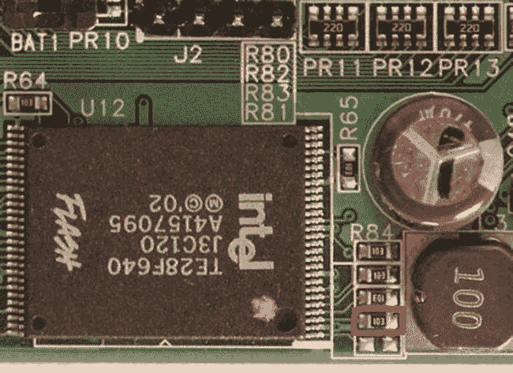
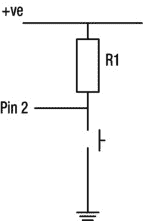
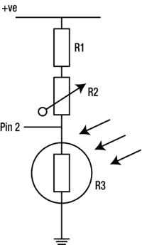
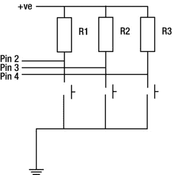
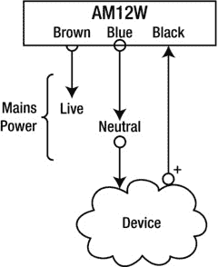
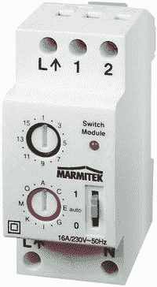

# 二、设备黑客：转换现有技术

Abstract

黑客行为有三种经典形式:软件、硬件和湿件(也称为社会工程)。最近，固件黑客攻击变得突出，因为利用嵌入式 Linux 的低成本硬件为无法构建硬件的软件黑客打开了大门。我将在本章中讨论硬件黑客及其相关软件。

黑客行为有三种经典形式:软件、硬件和湿件(也称为社会工程)。最近，固件黑客攻击变得突出，因为利用嵌入式 Linux 的低成本硬件为无法构建硬件的软件黑客打开了大门。我将在本章中讨论硬件黑客及其相关软件。

## 软件黑客

对于大多数开发人员来说，软件是一个更容易的黑客，因为与入侵硬件相比，不可挽回地破坏某些东西的机会大大减少了。事实上，当史蒂夫·沃兹尼亚克和史蒂夫·乔布斯在家酿电脑俱乐部制造机器时，他们推断，每一个对硬件感兴趣的黑客，就有 100 个对软件感兴趣的黑客，所以他们专注于苹果电脑的软件功能。当 Acorn 在 1981 年建立 BBC A 和 BBC B 时，一个类似的主题是真实的，因为他们努力开发软件，使其适合学校的学习。

历史肯定会重演，Raspberry Pi 利用这些理念提供了一台小型机器，其中的软件是最容易破解的部分。他们甚至通过将树莓 Pi 模型的前两次迭代命名为 A 和 B，向最初的 Acorn 机器致敬！树莓派如此成功，以至于很难保证供应能满足需求。因此，有时有必要在易贝寻找旧的二手设备来完成更适合树莓派的任务！

### Linksys NSLU2

这种旧设备也被亲切地称为“Slug”，是一种小型的嵌入式 Linux 设备，旨在用作网络可寻址存储(n as)设备。你插上电源，一根网线，和(最多)两个 USB 硬盘，你就可以使用 Samba 协议从同一网络子网上的任何机器上检索存储在上面的数据。

该机器本身是无声的，由 Intel XScale IXP420 驱动，并包含 32MB 的 SDRAM 和 8MB 的闪存，用于存储软件。它的低价位和固件的开放性对想要添加或改变机器上的软件的黑客来说很有吸引力。该机已于 2008 年正式停产，但仍可在各种商店和网上买到。

就其预期形式而言，当只需要文件服务器时，Slug 是一种合适的机器，既可以作为桌面工作的远程备份(可能位于楼梯下或阁楼上)，也可以为家中的媒体播放器提供音乐。但是，通过更改其固件，它可以变成以下形式:

*   Web 服务器(Apache、PHP、Perl 和 Python 都受支持)
*   电子邮件服务器
*   打印机服务器(Slug 的成本可能低于 USB 打印机与其联网的同类产品之间的差异，尽管这种差异不如以前大)
*   媒体服务器(通过 Squeezebox 服务器、iTunes 或 Samba 共享)

在任何软件更改发生之前，您必须首先将一个不受限制的 Linux 版本安装到设备的固件中，这是通过其内置的 web 界面进行的。这里有两个主要的变体:Unslung(使用 Optware 包)和基于 OpenEmbedded 的 SlugOS(正式名称为 OpenSlug)。

#### 从悬挂处取下

对于基本的改进和最少的麻烦，Unslung ( [`www.nslu2-linux.org/wiki/Unslung/HomePage`](http://www.nslu2-linux.org/wiki/Unslung/HomePage) )是首选，因为它安装在现有固件之上，看起来与最终用户非常相似，因为它基于原始 Linksys 代码。该固件提供了额外的功能，例如使用 FAT 格式化磁盘的能力，如果您想使用现有的硬盘驱动器，这是必要的，因为 Slug 中使用的任何磁盘都需要在使用前进行特殊格式化(到 ext3)。

还可以使用如下命令通过 Optware 安装额外的软件包:

`ipkg install apache`

但是，您需要小心，因为它们被安装到内部闪存，这可能会很快耗尽，从而导致设备无法启动。为了防止这种情况发生，您需要将操作系统移动到其中一个外部驱动器上(USB 记忆棒或整个硬盘驱动器，具体取决于您打算添加的内容的范围和大小)，这一过程称为“解除您的 Slug”或者，您可以执行硬件破解来增加内存。

数百种包装可用于非悬挂式废料浆，包括:

*   BitTorrent 客户端
*   Xbox 媒体服务器的流媒体工具
*   Apache web 服务器
*   星号 VoIP
*   杯子
*   饭桶
*   关系型数据库
*   嘘

正如你所看到的，大多数主要的软件包都是可用的，这使得这是一个非常低功耗的机器，能够提供大多数家庭任务。但是，它们都受到 2.4 内核的限制，所以对于更奇特的硬件(如蓝牙)，您将需要采用 SlugOS。

#### 斯拉格洛斯

SlugOS 是一个更大的努力，它像对待任何其他硬件一样对待 Slug，它有一个基本的操作系统和用于主要功能的独立包，符合传统的 Unix 思想“做一件事并把它做好”。这也删除了特定于 Slug 的功能，如基于 web 的配置工具和基本服务，如 Samba，因此您必须显式安装。

如果您使用 Slug 作为一个更大的家庭自动化服务器的基础，那么这在升级路径中提供了更大的范围，因为它让您可以访问 SlugOS 所基于的 OpenEmbedded 项目提供的数千个包。但这样做需要您将一个连接的硬盘驱动器的一部分或全部专用于操作系统，这是一个需要您将一个小系统安装到闪存中，然后将操作系统引导到硬盘驱动器上的过程。这样，SlugOS 允许使用基于 2.6 的内核以及 RAID 和 NFS 功能。

当使用外部 USB 驱动器保存操作系统时，请始终使用硬盘驱动器(而不是记忆棒)。这是因为一些应用程序(如 MySQL)会向交换文件中写入大量内存，并且因为闪存在大约 100，000 次写入后变得不可用，所以这种情况迟早会发生。或者，您可以将交换文件分配到第二个(硬盘)驱动器，允许操作系统从只读记忆棒启动和运行。

### 在弹头上发展

要为 Slug 编写您自己的软件，您应该从 SlugOS 开始，因为这使您可以访问标准开发工具，这些工具运行在允许在 Slug 上编写、编译和测试代码的设备上。这就是所谓的本地开发。首先，您需要运行以下命令，以及其他标准构建包(详见 [`www.nslu2-linux.org/wiki/HowTo/SlugOSNativeCompileEnvironment`](http://www.nslu2-linux.org/wiki/HowTo/SlugOSNativeCompileEnvironment) )，然后再正常开发您的代码:

`ipkg install slugos-native`

然而，如果没有屏幕，你将无法使用 GUI 调试器，比如`kdbg`，这对一些人来说可能是一个可怕的降级。然而，无头运行机器是完全可能的，因为你可以通过`ssh`或`telnet`远程连接。这是优选的，因为机器的速度使得 GUI 方法对于大型应用不切实际。您更有可能为您的桌面机编写和测试您的应用程序，然后，当它准备好了，为 Slug 进行交叉编译。

交叉编译是一个过程，通过这个过程，运行在机器 A 上的编译器能够生成适合于机器 b 的代码。为此，您需要一套新的编译器、工具、头文件和库(统称为工具链)，它们是专门为另一种体系结构构建的。这些文件与您现有的开发文件分开存储，因为它们会与运行您机器的文件冲突。然后，编译过程照常进行(通过`make`或`gcc`的变体，如`armeb-linux-gnu-gcc`)以产生合适的可执行文件，或者 Linux 术语中的 elf。

安装这些工具的最佳介绍在 [`www.nslu2-linux.org/wiki/DebianSlug/CrossCompiling`](http://www.nslu2-linux.org/wiki/DebianSlug/CrossCompiling) 。

请注意，如果您只使用现有的包，那么任何形式的编译工具都是不必要的，您可以完全依赖预构建的包。

### 黑客入侵游戏机

游戏机非常适合玩游戏。旧游戏机非常适合玩旧游戏——也适合入侵 Linux 机器！随着上一代机器变得便宜并且技术过时，旧的游戏控制台为媒体播放器、网络服务器、控制单元等提供了良好的嵌入式平台，因为它们总是具有适合于电视的连接器，并且在客厅中看起来很自然。在这一节中，你将学习如何让这些机器按照你的意愿运转，而不是它们的具体用途。

唉，这并不是一帆风顺的，因为制造商没有向计算机游戏行业以外的任何人提供编译器或开发环境，即使这样，也只有严格的保密协议(NDAs)才能实现。虽然这应该足以满足过分热心的法律部门，但他们随后建立了安全措施，通过加密光盘格式、BIOS 或可执行文件来使在其上运行自制代码变得困难。对于黑客来说，这本身就是一个有趣的问题。因为大多数制造商在游戏机上赔钱(知道他们会在游戏上收回)，颠覆性的黑客更喜欢这个过程。

尽管成本不断下降，但不值得为了将一台新主机黑进 Linux 机器而购买它，但慈善商店和在线拍卖可以为黑客提供上一代硬件，其成本使时间和 geek-cred 值回票价。(尽管这是一个更简单的命题，只需使用一个树莓派！)然而，面对所有的技术挑战，随着更新更强大的机器的出现，或者随着时间效益超过替代设备的成本，领导这些控制台黑客项目的人的兴趣往往会减弱。所以，很可能是部分(或者全部！)在你读到这篇文章的时候，这些项目可能已经失宠了，因为 Xbox 360 已经过时了，而 PlayStation 4 是当前的游戏机。

#### "梦幻女郎"

Dreamcast 是 1998 年在命运多舛的世嘉土星之后发布的一款游戏机。它是由 IBM 研究员 Tatsuo Yamamoto 和世嘉硬件工程师 Hideki Sato 领导的两个工程师团队在世嘉内部竞争中的获胜者。最终的控制台采用了两种设计的元素，并基于 200MHz 日立 SH4 RISC 处理器和 VideoLogic 的 PowerVR2 图形芯片，对于视频播放来说速度足够快。

它还配备了一个光学 GD-ROM 驱动器，支持标准的 CD-ROM 分区(包括操作系统)，以及游戏的专有格式部分。这款游戏机也标志着微软首次将 Windows CE 操作系统与其 DirectX 技术相结合，进军硬件领域。

该控制台还包括一个视觉内存单元(VMU)，除了是一个基本的内存盒外，还具有 8 位处理，48 ×32 像素 LCD 屏幕，D-pad 和四个基本按钮。它原本是用来作为一个辅助游戏设备，而不是一个掌上游戏机本身，需要插入控制器才能发挥作用。这是一个好主意(几年后，索尼在其 PocketStation 设备中再次使用了这一想法，该设备也具有红外控制功能)，但与当时的同等技术相比，它对于任何重要的工作来说都不够强大。

世嘉还通过为 Dreamcast 提供鼠标、键盘和以太网(俗称宽带适配器，或 BBA)等外围设备走在了前列。后两者被认为是安装和使用 Linux 的基础。

LinuxDC ( [`http://linuxdc.sourceforge.net`](http://linuxdc.sourceforge.net/) )是一个古老的——几乎已经不存在了——的项目，最近已经看到了一点新的生机。这是一个相当完整的发行版，适合 web 浏览(带 BBA)、电影回放和仿真。这本身是一个很好的技巧，但也有电缆提供双向串行通信，要么在 Dreamcast 和 PC 之间，要么在红外(IR)发射器和接收器等外围设备之间。您可以使用 [`http://mc.pp.se/dc/serifc.html`](http://mc.pp.se/dc/serifc.html) 所示电路中的一个芯片和三个电容器自己构建这种电缆，或者购买类似的兼容电缆，即众所周知的 DC 编码电缆。

还有一种用于 Linux 的 Dreamcast 仿真软件叫做 LXDream，它提供了一种快速的方法来验证各种 Dreamcast 软件黑客是否工作。你可以在 [`www.lxdream.org`](http://www.lxdream.org/) 找到这个，它还提供了从 [`www.lxdream.org/wiki/index.php?title=Dreamcast_Linux`](http://www.lxdream.org/wiki/index.php?title=Dreamcast_Linux) 到 LinuxDC 的预建磁盘映像 iso 的所有重要链接。

Note

像 LXDream 这样的模拟器需要机器原始 BIOS 的映像。因为这些通常仍受版权保护，所以它们不与模拟器打包在一起，必须从一台机器(您合法拥有的机器)中提取。

除此之外，还有各种独立软件可以交叉编译，并通过串行 DC 编码电缆上传到 Dreamcast。其中一些显示在 [`http://mc.pp.se/dc`](http://mc.pp.se/dc) 的页面上。这包括文本、图形、声音和串行通信的示例源代码。通过避免操作系统，您可以更好地利用相对较小的 16MB 内存和 200MHz 处理器，但这是以降低开发难度为代价的。

#### 索尼游戏机

索尼现在正在推广其第三代游戏机，富有想象力地命名为 PS3。把整台机器变成一个家庭自动化设备(因为它已经是一个非常强大的媒体播放设备)仍然太新，在经济上不可行，但如果你想的话，你可以在上面安装 Linux，前提是你使用 3.15 或更早版本的固件，或者使用其他 OS++。 [2](#Fn2) (注意，Slimline 版 PS3 不支持这个。)对于软件工程师来说，这是一个学习 CELL 架构的好平台，但因为内核不是为这种芯片优化的，所以操作系统相对较慢，这意味着同样的钱和电可以更好地用于标准 PC。然而，这台机器的新颖意味着有两个旧的游戏机被忽视了，可以用很少的钱买到。

##### 游戏机 1

1994 年发布的第一款 PlayStation(现在称为 PlayStation 1，以区别于 PlayStation 品牌)只有 2MB 的 RAM，33.8MHz 的 CPU，没有内存管理单元(MMU)，这意味着只有 uClinux 内核适合移植，但即使在那时，转换系统的其余部分也很困难。似乎只存在一个安装，Runix(最初称为 PSXLinux)，尽管现在几乎不可能找到。这并不是很大的损失，因为与现代游戏机不同，它没有硬盘，这限制了它作为 Linux 机器的使用。

不使用现有的 Linux 软件，仍然有可能使用 Net Yaroze 和利用 128KB 存储卡进行临时存储来从头开发应用程序。它包括一个黑色的 PlayStation、控制器、电缆、软件和软件开发手册，旨在通过提供一种在 PC 上编译软件并通过串行电缆(也用于调试)上传到 PlayStation 的方法，让爱好者进入该领域。这台机器是通过邮购和向大学出售的，但并不成功。最终，这些设备并不多，所以它们主要是在发烧友之间进行交易，以获得额外的金钱。然而，该机的速度使其不适合视频播放， [3](#Fn3) 以及缺乏通信端口进一步限制了其潜力。

PlayStation 1 更好的用途不是作为电脑，而是作为 CD 播放器，尤其是第一版。这是因为与后来的版本相比，最初的控制台内部有一个大大改进的 DAC，在播放 CD 时，它可以提供专业的音频质量输出。该型号可以通过型号 SCPH 100x 和独立的音频和视频 RCA 输出来区分。

##### PlayStation 2

索尼的第二台机器于 2000 年发布，名为 PlayStation 2(你可能会在这里发现一个命名模式！)，并且它提供了比其前身更大的功率。它有 32MB 的内存，包含独立的 I/O、声音和图形芯片，还有一个名为 Emotion Engine 的主 CPU(运行频率为 294.9MHz 或 299MHz，取决于它是原始设备还是后来的设备)。这使得它成为 Linux 的一个更现实的规范。此外，索尼公司提供了一条简单的途径，它出售自己的补充套件，名为 PS2 Linux。它为最终用户提供了硬盘、键盘、鼠标、以太网适配器以及开发软件所需的软件和手册。这些套件不再出售或支持，但有些可以从旧库存和二手经销商处获得。如果你忽略电视输出而使用显示器，开发起来会更容易——你需要一个绿色同步的显示器。所提供的发行版最终是基于带有 2.2.x 内核的 Red Hat 的旧版本，尽管现在存在更新的版本，以及 Mozilla、XChat 和各种轻量级 GUI 应用程序；使用 USB 端口的实用程序，如打印机和照相机；和网络端口。虽然工具包和软件磁盘偶尔还会出现在易贝，但这个网站已经被关闭了。在 [`http://web.archive.org/web/20130303202328/http://playstation2-linux.com`](http://web.archive.org/web/20130303202328/http://playstation2-linux.com) `.`仍然有一些网页内容可以通过返程机获得

除了官方的 Linux 发行版之外，还有大量的自制软件可供选择，比如媒体播放器和模拟器。你可以从像 [`http://sksapps.com`](http://sksapps.com/) 或者旧的 [`exploitstation.com`](http://exploitstation.com) `site (now languishing at` [`http://web.archive.org/web/20100712044012/http://www.exploitstation.com`](http://web.archive.org/web/20100712044012/http://www.exploitstation.com) 这样的网站下载它们作为 elf，或者你可以在 PC 上使用一套交叉编译工具自己构建它们，并从光盘、存储卡、网络或者 USB 记忆棒上运行。

说服 PS2 运行未经许可的软件不再困难，因为已经发现了几个纯软件漏洞，以及所谓的 modchip 被物理焊接到计算机本身的硬件黑客。

一种软黑客被称为 PS2 独立漏洞，其中一个 PlayStation 1 游戏的光盘被用来从存储卡加载一个特殊的文件，这反过来会触发缓冲区溢出，允许未签名的代码运行。这在 [`http://sksapps.com/index.php?page=exploitinstaller.html`](http://sksapps.com/index.php?page=exploitinstaller.html) 有详细解释。

免费的 McBoot ( [`http://freemcboot.psx-scene.com`](http://freemcboot.psx-scene.com/) )是一个较新的软黑客，它还允许你通过安装捆绑在特定存储卡上的特殊软件来运行自制软件。它还可以在超薄 PS2 和大多数新机器上工作(不同于独立漏洞)，目前已知的唯一例外是日期代码为 8c 和 8d 的机器(BIOS 版本 2.30)。

最近的黑客攻击和解放努力导致了一个名为 kernelloader ( [`http://kernelloader.sourceforge.net/`](http://kernelloader.sourceforge.net/) )的项目，该项目利用这些方法在您的 PS2 上创建一个完整的 Linux 发行版(一个苗条的 PS2 需要从直播 DVD 而不是网络启动)，此时您可以正常使用机器。

除了列出的站点之外，一些视频共享网站还包括描述该过程的可视教程。而且，一如既往，你也许能找到合适的 modchips 进行硬件黑客攻击。

##### 便携式游戏机

还有一个最终的 PlayStation 产品需要提及，因为 PS3 太新了，PS Vita 也没有得到充分利用，所以我们不会关注它！PlayStationPortable (PSP)于 2004 年发布，基于 PS2。这是一个手持设备，通过 802.11b WiFi 连接为 HA 黑客带来好处。IrDA 也是老的 PSP-1000 型号的特色，新版本(PSP Go)支持蓝牙。所有这些都有双 MIPS R4000 芯片，运行频率为 333MHz [4](#Fn4) 和 32MB 的 RAM，使它们成为功能强大的设备。

然而，像大多数游戏机一样，PSP 被设计成只能运行索尼创造的签名代码，因此在任何真正意义上它都不能成为一台可编程计算机。而且，像大多数游戏机一样，黑客们通过利用最初 1.5 固件中的一个问题找到了规避这一问题的方法。这最终导致索尼公司进行了一场猫捉老鼠的固件升级游戏，以堵塞这些漏洞(并通过包括网络浏览器等新功能来贿赂用户进行升级)，因为黑客试图重新打开这些漏洞，或想办法降级到 1.5(不触发索尼公司在固件中放置的木马代码，这将“砖化”你的机器)以利用旧的漏洞。

PSP 有各种各样的自制软件，包括 YouTube viewer PSPTube 和 Xbox Media Center 的控制应用程序；好的出处是 [`http://dl.qj.net/PSP/catid/106`](http://dl.qj.net/PSP/catid/106) 。然而，这款设备的一个真正好处是，你甚至不需要侵入它就可以安装一个网络浏览器，因为(从 2.0 版本开始)NetFront 浏览器已经默认包含在内，从 3.90 版本开始，它已经包含了用于 VoIP 通话的 Skype。因为大多数家庭自动化设备都带有 web 服务器，或者可以很容易地编写一个 web 服务器，所以 web 浏览器足以实现相当高水平的家庭控制。

Note

如果你打算使用定制的或破解的固件来运行自制软件，那么一定要在设备的生命周期中尽早这样做。这样，如果固件更新过程中出现问题，您不会丢失任何个人数据。

#### 游戏机种

像索尼 PlayStation 3 一样，微软目前的游戏主机 Xbox 360 太新太贵，不值得黑进其他东西，尽管许多人都致力于解决这个问题，并为此创建了 [`www.free60.org`](http://www.free60.org/) 项目，该项目现在能够运行自制代码。

Xbox 游戏机于 2001 年推出，这可能是许多人第一次考虑使用(接近)标准的 PC 连接到标准电视的可能性。这无疑得益于微软在该部门使用了 Windows 和 DirectX 技术，这两种技术都是众所周知的，从而为黑客提供了非常低的准入门槛。

作为一个单元，Xbox 基于 733MHz Pentium III 芯片，64MB 内存，以及 DVD-ROM 和 10GB 硬盘驱动器——默认情况下，这是唯一的上一代游戏机。它还支持以太网和 USB 端口，但具有专有的外形和布线。这种抗议性的疏忽导致许多公司仅仅围绕 Xbox USB 转换器的销售制定商业计划，这种转换器有很多！

作为一个物理单元，它非常大(320×100×260 毫米)，并且有一个相当嘈杂的风扇，尽管硬件黑客可能能够将它压缩到笔记本电脑的大小，并用一个安静的风扇代替风扇。在任何情况下，您肯定希望机器远离您的耳朵和正在使用的扬声器系统。

##### 运行 Linux

在微软的首款旗舰游戏机上运行 Linux 有一种反常的极客乐趣。此外，由于我们正处于其生命周期的末期，任何损坏、无效保修或机器损坏对我们来说都没有几年前那么重要了。此外，黑客社区有足够的时间来改进黑客攻击过程，以便即使那些害怕烙铁的人也可以毫无畏惧地进行攻击。主站点是 [`www.xbox-linux.org`](http://www.xbox-linux.org/) 。

Note

虽然所有的 Xboxes 都能够运行 Linux，但 1.6 版存在许多问题，因为 BIOS 不再存储在可以(重新)刷新的芯片中。这种芯片被称为薄小外形封装(TSOP)，而是硬连线的，需要使用加载了克伦威尔 Linux BIOS 的额外硬件修改芯片，即使这样，由于使用不同的图形硬件，可能的输出分辨率也大大降低(只有复合和 S-video 以及过扫描，以及高达 480p HDTV)。您可以通过 [`www.xbox-linux.org/wiki/Xbox_Versions_HOWTO`](http://www.xbox-linux.org/wiki/Xbox_Versions_HOWTO) `(`处的图表确定版本号，可能需要通过 [`http://web.archive.org/web/20100728124622/`](http://web.archive.org/web/20100728124622/http://www.xbox-linux.org/wiki/Xbox_Versions_HOWTO) [`http://www.xbox-linux.org/wiki/Xbox_Versions_HOWTO`](http://www.xbox-linux.org/wiki/Xbox_Versions_HOWTO) 处的存档版本进行访问。

和通常的控制台黑客一样，有硬件和软件两种方式。硬件方式包括购买和焊接 modchip 尽管使用它们的合法性值得怀疑，但这为黑客攻击提供了最广阔的空间，因为您可以执行以下操作:

*   增加硬盘大小(但仍建议小于 137GB)
*   用另一个硬盘或 DVD-RW 更换 DVD
*   使用 Linux 下的所有磁盘空间

安装芯片后，你需要欺骗 Xbox 运行允许你使用它的代码。这是通过漏洞利用来实现的，例如 MechAssault 漏洞利用，它使用游戏中的破损代码和精心制作的保存游戏文件，此时你可以将任意数据传输到 Xbox 上(通过网络)并运行应用程序来用它刷新 BIOS。这个过程很简单，但很复杂，因为你需要适配器电缆、正确版本的游戏和一台单独的机器。如前所述，这是将 Xbox Linux 引入 1.6 版机器的唯一(相对)安全的方式。

硬件黑客的缺点是 Xbox 游戏(换句话说，Xbox Live)的在线组件不可用，因为微软将禁止任何人在其机器上使用 Linux。

软件破解包括大部分相同的步骤，在 [`www.xbox-linux.org/wiki/Software_Method_HOWTO`](http://www.xbox-linux.org/wiki/Software_Method_HOWTO) (或 [`http://web.archive.org/web/20100728124622/http://www.xbox-linux.org/wiki/Xbox_Versions_HOWTO`](http://web.archive.org/web/20100728124622/http://www.xbox-linux.org/wiki/Xbox_Versions_HOWTO) 如果网站离线)详细解释了一些额外的复杂情况。自然地，作为软件，Linux 安装会在每次重启时消失——您的数据会保留，但您必须恢复启动 Linux 的黑客程序才能访问它。

曾经有一个 Xbox 巧克力项目，Xbox Linux 用户将帮助潜在用户修改他们的机器。它仍在进行，但志愿者越来越少。询问您当地的 Linux 用户组(又名 LUG 见 [`www.linux.org/groups`](http://www.linux.org/groups) 为你的本地组)可能是另一种想法。

黑一个 Xbox 的原因，看你自己了。如果你只是想让它播放 DVD，那么微软 DVD 播放套件是一个更好的选择，它自带 IR 遥控器。作为一个机顶盒，按照今天的标准，与我已经提到(并将提到)的其他解决方案相比，它可能有点嘈杂。但是作为一个次要的(甚至主要的)文件服务器，web 服务器，甚至桌面机，它有着非常积极的极客凭证。

##### 播放器

尽管名为 Xbox Media Center (XBMC ),但在非 Xbox 平台上运行的版本比 Xbox 平台上的多，包括 Raspberry Pi 和 Live CD 的版本，所有这些都可以从 [`www.xbmc.org`](http://www.xbmc.org/) 获得！这是因为该软件只能使用 Xbox 开发工具包(XDK)进行编译，该工具包只提供给获得许可的开发人员。因为微软不喜欢 Linux 开发者在它的控制台上编写开源软件，所以爱好者不能以任何形式使用它。因此，在野外运行的 XBMC 的唯一本地版本是那些由授权开发者编译的版本和那些开发者泄露的版本。这种版本的合法性受到严重质疑。在这两种情况下，你仍然需要一个修改过的 Xbox 来运行代码，就像在 Xbox Linux 上一样。

Note

如果您可以使用 Xbox 软件，那么您可以使用 XBMC 的 Microsoft DVD 播放套件附带的红外遥控器。

作为软件，XBMC 包含许多高端功能，仍在积极开发中。这包括一项减少启动时间的倡议，使它看起来更像一个机顶盒，而不像一台运行软件的计算机——这是所有家庭自动化设备都应该追求的目标。

它的功能包括播放几乎所有格式的媒体(来自硬盘、光学媒体、网络共享、在线流和源，以及 iTunes 的 DAAP)，显示照片，运行 Python 编写的插件(用于天气预报等)，以及玩游戏。它还能够通过 IMDb(亚马逊拥有的互联网电影数据库)和 FreeDB(用于 CD 曲目列表)的数据服务来支持媒体。对许多人来说，XBMC 最大的乐趣在于它的可剥除性，它允许任何一个只有最低限度知识的人为软件创建定制界面。

尽管它很突出，但 XBMC 有几个分支:Boxee，集成到社交网络应用程序中；MediaPortal，一个具有 PVR 处理的以 Windows 为中心的版本；Plex，专注于 Mac OS X 和相关的面向苹果平台的功能(如 iTunes 应用商店)；以及支持来自其(商业)视频点播网站的媒体流的 Voddler。

## 硬件黑客

这类攻击包括对现有硬件或新硬件的更改，您可以轻松构建新硬件来控制现有计算机或受现有计算机控制。

### Linksys NSLU2

现有的 NSLU2 单元(又名 Slug)不需要任何硬件改造就可以运行前面提到的任何定制的 Linux 固件。然而，你可以用各种方法来改进这个单元。

#### 永远在线

像大多数消费类硬件一样，Slug 有一个开/关按钮。对于正常操作，这是可以的。但是对于家庭自动化系统来说，它通常是 24/7 工作的(像房子的其他部分一样)，这可能会在短暂停电时引起问题，因为机器需要手动重新打开。此外，如果你正在远程控制 Slug 的电源，可能是通过一个定时 X10 设备模块或独立的定时器，它不会完全打开，因为它需要按下按钮。

在第一种情况下，这里有显而易见的解决方案，例如将 Slug 放在 UPS 上或保持其可访问性，以便您可以手动控制它。然而，这些都否定了它便宜、隐蔽、可控(对 HA 来说很重要)的优势。

您可以通过执行几个硬件破解中的一个来使您的保修无效，以确保机器在通电时始终开机，从而解决这个问题。从在各种配置中使用 USB Y 形电缆到将元件焊接到电路板上，不一而足。皆详之，以其优劣在线( [`www.nslu2-linux.org/wiki/HowTo/ForcePowerAlwaysOn`](http://www.nslu2-linux.org/wiki/HowTo/ForcePowerAlwaysOn) )。

#### 超频

在 2006 年之前，尽管芯片被设计为以 266MHz 运行，但所有 Slugs 的运行速度都低于必要的速度，因为它们的 CPU 主频为 133MHz。这在技术上意味着原始版本是欠频的，这意味着下面的黑客被称为去欠频，而不是超频。如果您登录到您的 Slug(通过`telnet`或`ssh`，取决于您的固件)并键入以下内容:

`cat /proc/cpuinfo`

你会看到一个 BogoMIPS 值，表示当前的速度。如果这在 133 值的 10%以内，那么您可以通过移除图 [2-1](#Fig1) 中所示的电阻器来提高速度。

图 2-1。

The de-underclocking resistor (second from the bottom in the R84 stack). Image from [`http://www.nslu2-linux.org/gallery/hardware`](http://www.nslu2-linux.org/gallery/hardware) released under cc-by-sa

你可以用指甲钳、烙铁、锯子或以上任何方法的组合来移除它。请确保不要损坏任何其他组件。

#### 串行端口

你可以使用一个标准的串行端口在许多旧技术之间进行双向通信，例如游戏杆、LCD 文本显示器和其他形式的自制电子设备。它还提供了一种在网络等其他路径出现故障时通过`getty`控制阻塞的方法。

已经有一个串行端口隐藏在 J2 的 Slug 主板上。唉，它的控制电压为 0/+3.3v，而不是标准 RS-232 串行端口所需的+/-12V，这意味着您需要一个功率电平转换器。(然而，严格来说，该标准要求硬件区分+/-3–15V 范围内的电压。)一些转换器可以作为单个芯片购买(如 MAX3232)，或者已经包含在一些移动电话数据线中。你可以在网站上找到全部细节( [`www.nslu2-linux.org/wiki/HowTo/AddASerialPort`](http://www.nslu2-linux.org/wiki/HowTo/AddASerialPort) )。

还有一些电路可以让您轻松地将 LCD 字符显示器(如 HD44780)连接到 Slug，提供基本的(非常低功耗的)显示器来报告当前的媒体播放或机器状态。然而，这也需要打开您的 Slug 进行硬件调整。

### 乐高 Mindstorms

乐高 Mindstorms 于 1998 年首次发布，最初被称为 Mindstorms 机器人发明系统(RIS)套件，包含一个名为 RCX 的控制砖块，您可以向其上传红外程序。然后，该软件将运行，控制连接到 RCX 砖的各种电机和传感器，并通过红外与其他人通信。这自然会产生与 IR 相关的常见问题，如第 1 章所述(主要是视线)。有两个版本的 RCX 发布，都在不同的载波频率操作红外(虽然两个 RCX 模块可以在任一频率上传输)，但功能相同。

编程可以用多种语言完成，包括 Java、C/C++、Lisp 等的精简版本，只要将其编译成适合内部微控制器(Renesas H8/300)的代码。由于年代久远，它现在相当便宜，尽管提供的红外发射器不支持任何 64 位操作系统，并且正在失去对较新的 32 位操作系统的支持。

2006 年，乐高从 RCX 搬到 Mindstorms NXT。这通过改进处理器(现在是 32 位 ARM7/TDMI 芯片)和通信设备(现在包括 USB、蓝牙和板载 100 × 64 像素 LCD 矩阵)提高了主模块的规格。处理器的升级使得控制软件的改变成为必要，但这是意料之中的，大部分 RIS 代码现在已经移植到 NXT 上。乐高组件也有所改进，如表 [2-1](#Tab1) 所示。

表 2-1。

LEGO Mindstorms Specifications

<colgroup><col> <col> <col> <col> <col> <col> <col></colgroup> 
| 装备 | 发动机 | 触摸传感器 | 光传感器 | 超声波传感器 | 声音传感器 | 颜色传感器 |
| --- | --- | --- | --- | --- | --- | --- |
| 远端软体安装服务(Remote Installation Service) | Two | - | Two | one | - | - |
| NXT | 3* | one | one | one | one | - |
| NXT 2.0 | 3* | Two | one | one | - | one |
| NXT 教育 | 3* | Two | one | one | one | - |

* These are servo motors, which internally monitor their position for greater positional accuracy.

自 2009 年以来，Mindstorms 已经进行了第三次迭代(NXT 2.0)，包括与 NXT 2.0 版本相同的 RCX 砖块，一些替代的乐高技术砖块，以及从声音到颜色的传感器变化。这是一个奇怪的变化，因为现在所有的 NXT 2.0 机器人默认都是聋的！这可能是销售更多附加传感器的一种策略，但是对于狡猾的黑客来说，使用网络上或各种书籍中的说明，例如 Extreme NXT，使用标准电子元件可以更便宜地制造这些传感器。 [6](#Fn6)

乐高 Mindstorms 的优势在于它能够快速制作出可以由电脑控制的硬件原型，以及可以将信息反馈给电脑的远程传感器。这提供了一种方法，通过这种方法，计算机的状态可以由现实世界中的某些东西来演示。同样，它允许计算机在某种程度上理解现实世界。

家庭自动化充满了创意，一旦新鲜感消失，并不是所有的创意都有持久力来改善你的生活。这使得乐高成为一种完美的手段，可以在投入时间和金钱购买 PIC 芯片、电机和仅用于一个项目的机箱之前，构建概念验证硬件。以下是一些想法:

*   创建一个机器人，当收到电子邮件、私人即时消息或电话时，它会挥手或做手势
*   使用 NXT 处理器模块上的 LCD 来传递信息，例如天气
*   创造一个机器人打开冰箱，把啤酒带进客厅 [7](#Fn7)
*   为房子周围的传感器和设备创建一个蓝牙网关(用于猫的皮瓣或压力垫)

每个传感器和电机的处理都非常简单，因为这只是一个编程问题，使用一个可用的 Linux 环境，如 leJOS NXJ(LEGO Mindstorms 的 Java)或 NXC(不完全是 C)。关于这个主题的书籍和网络文章比比皆是，包括这个有用的起点: [`http://www.eggwall.com/2011/08/lego-nxt-mindstorm-with-linux.html`](http://www.eggwall.com/2011/08/lego-nxt-mindstorm-with-linux.html) 。

### Arduino 作为 I/O 设备

Arduino 及其许多克隆和变体是微控制器板，您可以将其视为成熟的乐高——它提供了一种简单的方式来将现实世界与计算机进行交互，在芯片上(而不是在软件中)处理基本处理任务，并与硬件电机和传感器一起工作。

基于简单的微控制器，目前有 16 种形式的 Arduino，但现在最流行的开发版本是基于 ATmega168 芯片的 Arduino Diecimilanove，尽管它正被使用 ATmega328 的 Arduino Uno 取代。它支持 14 个可配置为输入或输出的数字引脚和 6 个模拟输入。这里缺少的部分是模拟输出，可以通过在 14 个现有数字输出中的 6 个上使用脉宽调制(PWM [8](#Fn8) )或使用额外的电子设备来提供。电源可以通过 USB 端口、电源插座或连接电池夹和电路板的电线来提供。板载跳线用于在 USB 和外部电源之间切换。

对于那些习惯于大型机器的人来说，Arduino 芯片组的规格显得相当小:

*   14KB 可用闪存(ATMega328 版本为 30KB)，用于软件
*   2KB 闪存，由引导加载程序使用
*   1KB SRAM 存储器(ATMega328 版本为 2KB ),用于存储数据
*   512 字节的 EEPROM(atmega 328 版本为 1KB)，用于永久数据；相当于一个迷你硬盘
*   16MHz 时钟速度

即使是内存容量翻倍的 ATMega328，甚至是 256KB 的 ATMega2561，似乎也不够用，尤其是与 Raspberry Pi 相比。然而，Arduino 通常执行的任务非常简单，通常是在比较各种输入和执行简单逻辑的领域，所以这个规范已经足够大了。操作系统中的复杂任务，如 TCP/IP 堆栈，通常是不必要的，因为您可以将这些任务的请求传输到连接的 PC。当它们不匹配时，问题通常通过构建适当的电路并为该硬件组件包含必要的驱动软件在硬件中解决。

如果你有使用其他微控制器或 PIC 芯片的经验，Arduino 在技术上与它们没有任何不同，所以你可以继续使用你以前用过的任何芯片。然而，Arduino 为那些对电子产品缺乏经验的人提供了许多好处:

*   一个基于 C 语言的开发环境，代替汇编程序
*   标准 USB 输入/输出控制
*   一个庞大的黑客社区，发布项目设计并分享技巧
*   强大的开发板，不太可能在错误连接时爆炸
*   各种预建的兼容电路板(称为屏蔽板)可提供更复杂的功能，如无线通信。在本章后面的“Arduino 硬件”一节中，你会看到一些例子
*   对于纯粹主义者来说，开源硬件和架构。这是一个经常被忽视的点。硬件开源使得像 Seeeduino 这样的克隆人制造者得以存在。克隆可以更便宜、更耐用，并且可以使用表面贴装元件，同时仍然保持与 Arduino 及其配套屏蔽的引脚兼容

可能的项目范围类似于 LEGO Mindstorms，尽管现在电路可以小得多，包含更多的分立元件，并通过上述防护罩实现更广泛的功能。LEGO 设备可能会发出嘟嘟声或播放简短的声音来指示电子邮件的到达，而 Arduino 可以使用语音合成或完整的音频回放。

#### 安装和设置

所有 Arduino 软件都写在 PC 上，通过 USB 传输到板卡。这也用于接收 Arduino 选择传输的任何数据，默认情况下通过`/dev/ttyUSB0`。(记得将您的用户添加到`dialout`组，以便可以访问`/dev/ttyUSB0`。)开发可以按照您希望的任何方式进行，但是使用基于 Java 的 IDE 是最简单的。即使您采用命令行方式，代码也需要使用`avr-gcc`工具链进行编译，该工具链可以安装在 Debian 下，如下所示:

`apt-get install gcc-avr avr-libc avrdude`

Java，如果卸载，将需要一个额外的行，像这样:

`apt-get install openjdk-6-jre`

从这里开始，安装 IDE 就很简单了。这是从位于 [`http://arduino.cc/en/Main/Software`](http://arduino.cc/en/Main/Software) 的网站上作为单个档案提供的。将它解压到一个适当的目录(这些步骤都不需要 root 访问权限)，并从该目录运行`./arduino`。然后，在使用之前，您应该设置适当的 USB 设备和 Arduino 类型(分别为工具➤串行端口和工具➤板)。

您可以通过从菜单中选择文件➤新建来开始项目。这就创建了 Arduino IDE 所称的草图。这包括 Arduino 工作文件夹中的一个子目录和一个主源文件。其他源文件可以添加到草图中(通过草图➤添加文件)，并将自动包含到项目构建中。这里没有`Makefile`等价，每一个添加到草图的文件，即使是另一个目录下的库文件，都被复制到草图目录下。注意，尽管在视觉上与 C 代码相似，但为了清楚起见，所有文件都被赋予了扩展名`.pde`。

Note

不能创建给定名称的草图。相反，您必须创建一个空白的新草图，然后选择另存为单独的步骤。

构建过程本身使用`avr-gcc`在幕后处理，这是一个用于 Atmel AVR RISC 处理器的交叉编译工具链，ATmega168 就是其中之一。它在 sketch 文件夹中创建一个单独的 applet 目录，并将所有头文件和所有源文件的连接复制到其中(以`.pde`结尾)。正是这个(`.cpp`)源文件被交叉编译成十六进制，然后上传到 Arduino。

#### Arduino 软体

大多数人为了测试他们的设置而建立的最简单的电路是闪光灯。Arduino Diecimila 板上的第 13 号引脚有一个内置电阻，允许您将 LED 直接连接到它和 0v 电源，而不会损坏它。一些主板也有表面贴装 LED，所以你甚至不需要它！眨眼教程代码，可以从 IDE 中加载(文件➤例子➤ 01。基本)，简单来说就是这样:

`int ledPin = 13;        // LED connected to digital pin 13`

`void setup()          // run once, when the sketch starts`

`{`

`pinMode(ledPin, OUTPUT);   // sets the digital pin as output`

`}`

`void loop()           // run over and over again`

`{`

`digitalWrite(ledPin, HIGH);  // sets the LED on`

`delay(1000);         // waits for a second`

`digitalWrite(ledPin, LOW);  // sets the LED off`

`delay(1000);         // waits for a second`

`}`

这段代码很容易理解，因为许多常见的 C/C++/Java-ism 是不必要的:

*   不需要头文件
*   Main 已被两个功能取代:设置和循环
*   没有事件循环或回调。每次循环时都必须读取引脚状态

如果你是一个受过传统训练的开发人员，强烈反对这里使用的阻塞函数`delay`，那么有一些例子演示如何使用`millis`函数来推断没有阻塞的时间。

对于大多数复杂的软件和库，您当然可以引用头文件，但是请记住，添加到项目中的任何其他源文件都将被复制。当然，创建自己的库是可能的，但是在这样的小规模项目中，这通常会耗费更多的时间。

##### 读取数字输入

这些是最简单的电路，因为它们由单个电阻和开关组合而成，如图 [2-2](#Fig2) 所示。

图 2-2。

Reading a digital switch on the Arduino

在此配置中，引脚 2 用作示例，并在开关断开的所有时间向 Arduino 报告 1(高)电压。这是因为“上拉”电阻 R1。没有它，引脚实际上是断开的，因此其电压可能会波动到 0 到 5v 之间的任何值，从而导致错误读数。(然而，大多数时候，它会浮动到 1。)当开关闭合时，引脚直接连接到 0v 接地轨，导致读取 0。Arduino 代码随后会观察这种变化，如下所示:

`int inputSwitchPin = 2;`

`int lastState = HIGH;`

`void setup() {`

`Serial.begin(9600);`

`pinMode(inputSwitchPin, INPUT);`

`}`

`void loop() {`

`int pinState = digitalRead(inputSwitchPin);`

`if (pinState != lastState) {`

`Serial.println(pinState?"released":"pressed");`

`lastState = pinState;`

`}`

`}`

这将在某些情况下工作，但不是所有的，因为硬件不是那么简单！开关是机械怪兽，当它们被按下时，往往会在开和关之间“弹跳”几次。然而，如果这个开关连接到一盏灯上，你可能看不到它的开关，因为所涉及的时间是以毫秒来计量的。但是计算机足够快来发现它，所以你需要编写代码来忽略任何状态变化，比如说，在 100 毫秒内发生的变化。

`int inputSwitchPin = 2;`

`int lastState;`

`long timeLastPressed;`

`long debouncePeriod = 100;`

`void setup() {`

`Serial.begin(9600);`

`pinMode(inputSwitchPin, INPUT);`

`lastState = digitalRead(inputSwitchPin);`

`timeLastPressed = millis();`

`}`

`void loop() {`

`int pinState = digitalRead(inputSwitchPin);`

`if (pinState != lastState && millis() - timeLastPressed > debouncePeriod) {`

`Serial.println(pinState?"released":"pressed");`

`timeLastPressed = millis();`

`lastState = pinState;`

`}`

`}`

我在这里使用的开关通常是打开的，顾名思义，在正常情况下保持打开(因此没有电流在触点之间流动)，当按下开关时关闭。有些开关标记为常闭，在这种情况下，只需反转示例中的输出即可。

当您不关心所涉及的数量时，也可以使用模拟设备(如光传感器)来报告数字开/关输入。在本例中，您可能对外面是否有光感兴趣，而不是光有多亮。您可以修改电路，如图 [2-3](#Fig3) 所示。

图 2-3。

Reading the light on the Arduino

这种电路称为分压器电路，因为电压(正式名称为电位)是由供电轨两端的电阻按比例分压的。R2 是一种光敏电阻(LDR)，它在黑暗中具有非常高的电阻(像一个打开的开关)，但在亮时几乎像一个闭合的开关(即低电阻)。(这是对过程的过度简化，但足以让事情运转起来。)LDR 在这些条件下的确切电阻取决于具体的 LDR，并非所有制造商或供应商都提供此信息，因此您可能需要进行实验。

这个基本电路可以用来在天黑时开灯(记住要让 LDR 远离有问题的灯！)并可用于监控经过传感器的人，因为他们的影子通常足以关闭 LDR。你也可以得到以类似方式工作的红外发射器和接收器，它们可以放置在门口或前门的任何一侧，这样当有人接近你的房子时，你可以得到预警。

Note

当您对从关到开的状态变化感兴趣时，这就是所谓的上升沿触发。从开到关的变化称为下降沿触发。

##### 读取模拟输入

这些检测连续范围的值。与可用作输入或输出的数字引脚不同，Arduino 上的模拟引脚是硬连线的，因此不需要进行初始配置。这使您除了读取它们的值之外什么也做不了:

`int analogInputPin = 2;`

`int value = analogRead(analogInputPin);`

`value`的结果将在 0 到 1023 的范围内，代表管脚上的电压，在 0 到 5v 之间。

如果您重复使用图 [2-3](#Fig3) 中的电路，将输入馈送到模拟引脚而不是数字引脚，您可以通过以下方式观察输出值的范围:

`Serial.print("LDR brightness = ");`

`Serial.println(value);`

这使您可以凭经验确定灯光的精确亮度。你会注意到这个数据有很多波动，所以最好的方法是通过两个极限和中间的死区来确定它是否足够亮或足够暗以控制光线。也就是说，如果数字从大于 X 下降到小于 X，那么就认为是光，如果从小于 X+N 上升到大于 X+N，那么就是暗。

然后，您可以在电路中添加一个可变电阻来微调亮度，如图 [2-4](#Fig4) 所示。

图 2-4。

Controlling the brightness at which the Arduino is controlled

除了光之外，你还可以测量温度(热敏电阻)、距离(超声波测距仪)和旋转位置(通过将手柄或轮子连接到电位计的主轴上)。

Note

你可能听说过 Arduino 内置了一个温度传感器——这部分是真的！它包含在 328 系列(带有“8P”零件号的芯片)及其克隆产品(ATmega16P 和 ATmega168PA)中，但是，唉，没有其他的了。如果你有幸拥有这个版本，那么你可以在 [`https://code.google.com/p/tinkerit/wiki/SecretThermometer`](https://code.google.com/p/tinkerit/wiki/SecretThermometer) 找到合适的代码。

如果使用不同类型的传感器，读取模拟输入的方法不会改变。事实上，有一个 QM-NG1 气体传感器可以被替换到上述电路中，如果在厨房检测到泄漏，就会发出声音警告。类似地，MQ2 烟雾探测器也可以用于类似的目的。这两种情况传统上都仅限于当地警告。但是通过短信提醒将警告发送到你的手机(关于如何发送此类信息的详细信息，请参见第五章)你可以打电话给朋友或邻居为你检查，特别是当警报在住宅外可能听不到的时候。

##### 发送数字输出

这听起来很简单，包括那些你只想发送简单的开/关信号给电灯开关或小马达的情况。代码需要一个简单的设置和调用，如下所示:

`int outputLightPin = 2;`

`pinMode(outputLightPin, OUTPUT);`

`//`

`digitalWrite(outputLightPin, bState ? TRUE : FALSE);`

从这里开始，一切都与赛道有关。

Arduino 上的每个引脚都能够提供高达约 40 毫安的电流。这对于大多数小负载来说是足够的，比如灯、缓冲器和一些小马达。如果您的设备使用的电流不超过 300 毫安，那么您可以使用 Arduino 作为开关，仅使用类似于图 [2-5](#Fig5) 中的电路，从电路板本身提取电流。

图 2-5。

A transistor switch circuit, allowing you to draw up to 300mA

对于更大的东西，你需要使用一个继电器和单独的电源，如图 [2-6](#Fig6) 所示。

图 2-6。

Using a relay to control high power loads Note

实际上，Arduino 适用于高达 800 mA 的高功率负载。但对于脏负载，如电机，300 毫安可能是更保守的明智。

##### 发送模拟输出

如前所述，模拟输出仅在使用 PWM 时在基本 Arduino 上可用。这仅在引脚 3、5、6、9、10、11 和 21 上受支持。 [9](#Fn9)

`analogWrite(analogWritePin, value); // value is between 0 and 255, inclusive`

这将允许你改变发光二极管的亮度和压电蜂鸣器和扬声器的音量，但没有太多其他的。实际上，在家庭自动化环境中，你不需要很多其他东西。例如，将电机移动到特定位置，最好使用伺服或步进电机，许多其他形式的定位应该通过使用反馈回路来完成——打开电机开始移动，当传感器显示它已经移动足够远时关闭电机。

##### 创建音频输出

这是 Arduino 可以提供的最简单的人性化反馈形式之一，因为电路只需要一个连接到数字输出引脚的蜂鸣器。该代码是一个简单的循环，每秒在开和关之间改变输出状态 440 次，例如，产生高于中音 c 的 A 音符。

Arduino 主站点上的示例提供了必要的代码，使它发出嘟嘟声并播放简短的音乐。对于那些寻求更高级音乐控制的人来说，有阿姆斯壮( [`www.bluedust.dontexist.com/armstrong`](http://www.bluedust.dontexist.com/armstrong) )，Arduino 音乐系统，它提供了一个小型旋律处理器，允许你用这样的代码演奏大本钟的钟声:

`ancInitialize(OUTPUT_LOCAL);`

`ancAssignChannelToPin(CHANNEL_OUTPUT_PIEZO_SPEAKER, piezoPin);`

`char *pChimesPhrase1 = "L32O4edcL64O3g";`

`char *pChimesPhrase2 = "L32O4cedL64O3g";`

`char *pChimesPhrase3 = "L32O4cdeL64c";`

`char *pChimesPhrase4 = "L32O4ecdL64O3g";`

`char *pChimesPhrase5 = "L32O3gO4deL64c";`

`// a quarter past`

`ampPlayString(CHANNEL_OUTPUT_PIEZO_SPEAKER, pChimesPhrase1);`

`// half past`

`ampPlayString(CHANNEL_OUTPUT_PIEZO_SPEAKER, pChimesPhrase2);`

`ampPlayString(CHANNEL_OUTPUT_PIEZO_SPEAKER, pChimesPhrase3);`

`// a quarter to`

`ampPlayString(CHANNEL_OUTPUT_PIEZO_SPEAKER, pChimesPhrase4);`

`ampPlayString(CHANNEL_OUTPUT_PIEZO_SPEAKER, pChimesPhrase5);`

`ampPlayString(CHANNEL_OUTPUT_PIEZO_SPEAKER, pChimesPhrase1);`

`// top of the hour`

`ampPlayString(CHANNEL_OUTPUT_PIEZO_SPEAKER, pChimesPhrase2);`

`ampPlayString(CHANNEL_OUTPUT_PIEZO_SPEAKER, pChimesPhrase3);`

`ampPlayString(CHANNEL_OUTPUT_PIEZO_SPEAKER, pChimesPhrase4);`

`ampPlayString(CHANNEL_OUTPUT_PIEZO_SPEAKER, pChimesPhrase5);`

使用各种屏蔽提供更复杂的音频输出，包括样本回放。

#### 与 PC 的通信

基本的 Arduino 允许通过其内置的 USB 端口与 PC 进行双向通信。这使用了最初用来上传程序的同一串行端口。在发送或接收数据之前，必须先对其进行设置，这两者都受此方法支持:

`Serial.begin(9600);`

Arduino 只能逐个字节地从 PC 读取数据，因此您需要使用如下代码在循环中读取数据:

`int incomingData = Serial.read();`

但是，请注意，这个函数是阻塞的。也就是说，在串行端口上有数据之前，它不会从`read`函数返回。如果你的设备只对信息作出反应，那么这就很好了。然而，更常见的是将它放在循环的开始，用下面的语句包围:

`if (Serial.available() > 0) { /* ... */ }`

然而，将数据从 Arduino 写回到 PC 更容易，因为数据的大小是已知的。这可以通过`Serial.print`或`Serial.println`函数来处理，以便快速轻松地获取字符串消息。或者可以使用`Serial.write`写入单个字节:

`Serial.write(byteData);`

这对于希望传输大量数据的应用程序非常有用。但是对于测试和开发，我发现简单的基于 ASCII 的协议更容易使用，因为简单的串行终端允许我以人类可读的文本发送和接收消息。Minerva 特性 MINX (Minerva 输入传输)使用分隔符`<|`和`|>`包围控制消息，允许 Arduino 将消息传回 PC，以便进行进一步处理，而不会影响任何其他调试或跟踪消息。我会在第七章的[中详细介绍这一点。](http://dx.doi.org/978-1-4302-5888-9_7)

Note

某些型号的 Arduino，如 Mega，有三个额外的串行端口，可寻址为 Serial1、Serial2 和 Serial3。

在这个收发等式的 PC 端，你有一个简单得多的工作，因为 Linux 中的一切都被当作一个文件。因此，您可以发出以下命令:

`tail -f /dev/ttyUSB0`

要查看从 Arduino 发回的所有数据并向电路板引入命令，请使用以下命令:

`echo -n send data > /dev/ttyUSB0`

正是从这一点上证明了基于 ASCII 的协议的好处。在最简单的情况下，您可以发出这样的命令:

`Serial.print("1");`

从 Arduino 将 PC 控制程序切换到打开状态，相当于关闭状态。这使得 C 程序非常简单:

`// USB script trigger`

`#include <stdio.h>`

`char *szUSBDevice = "/dev/ttyUSB0";`

`int main() {`

`char v;`

`FILE *fp = fopen(szUSBDevice, "r");`

`if (!fp) {`

`printf("Failed to open USB...");`

`return 1;`

`}`

`while(1) {`

`if (fread(&v, 1, 1, fp)) {`

`if (v == '1') {`

`// button pressed`

`} else if (v == '0') {`

`// button released`

`} else {`

`printf("%c", v);`

`fflush(stdout);`

`}`

`}`

`}`

`return 0;`

`}`

这也包括将非控制代码写入`stdout`的功能，该代码可被重定向至日志文件。如果您用 g++作为`arduino_read`来编译前面的程序，那么您可以在后台将其作为一个进程来启动，只需很少的努力就可以使它像守护进程一样:

`./arduino_read > logfile 2>&1 &`

#### 硬件烧坏

对于一些复杂的应用程序，Arduino 板上的 ATmega168 芯片不够强大，无法处理这项任务。因此，与其他计算机一样，需要额外的芯片来减轻负担。为了与 Arduino 的模块化设计保持一致，这些芯片被构建到具有必要接口电路的独立电路板中，以便它们可以直接安装在现有 Arduino 电路板的顶部。由于这个原因，他们被称为盾牌。大多数屏蔽还包括一个通道，以便其他屏蔽可以放置在它的顶部。然后有一个单独的软件库，用于控制设备，并被复制到`Arduino/hardware/libraries`目录中。

Note

并非所有的屏蔽都与 Arduino 的所有型号兼容。

市场上有许多 Arduino 屏蔽，大多数都有免费提供的规格和电路图。每个防护都有特定的任务，包括以下问题领域。

##### 以太网网络

Arduino Ethernet Shield 支持四个并发连接，使用 TCP 或 UDP 数据包在客户端或服务器模式下工作。它基于 Wiznet W5100 芯片组，使用数字引脚 10–13 进行通信。

##### 无线电控制

由于 Arduino 黑客的出色工作，现在有一个 WiFi 盾可用，能够使用 802.11b 和 802.11g 协议。 [`http://arduino.cc/en/Main/ArduinoWiFiShield`](http://arduino.cc/en/Main/ArduinoWiFiShield) 处的代码，连同 WiFi 盾库，提供 WEP 和 WPA2 加密，以及板载 SD 微插槽。也有一些例子把这个单元变成一个网络服务器。

为了符合它的身份，WiFi 盾使用许多 pin 码在它自己和 Arduino 之间进行通信。因此，如果您有一个输入/输出繁重的应用，那么期待 4051 芯片( [`http://playground.arduino.cc/learning/4051`](http://playground.arduino.cc/learning/4051) )多路输出和扩展其能力。

Tip

如果 shield 和 Arduino 拒绝对话，那么短路引脚 3 和 7 可能会有所帮助。

在 802.11 之外，主要的替代方案是 Xbee shield，它使用 ZigBee 无线协议，这意味着它不能直接与现有的 WiFi 连接兼容，但可以作为基本场景的无线电发射器和接收器，并具有大约 30 米的室内范围。对于基本的安全措施来说，这通常是一个更好的选择。

##### 发动机

LadyAda 的电机屏蔽支持 DC、伺服和步进电机的中等功率控制。支持的电机总数和总功耗由特定的电机本身决定，但引用的规格允许您使用两个 DC 伺服系统(5V)和最多四个 DC 电机，两个步进电机，或一个步进电机和最多两个 DC 电机。这个护盾确实使用了很多针来控制，也使用了很多能量，但是可以用来锁住猫的翅膀或者建造一个机器人。

#### 例如:Arduino 迎宾垫

有了这些知识，您可以构建一个简单的电路，编写一些 Arduino 软件，并添加一个 Linux 端脚本，以便在有人进出房间时触发一段语音。

我将展示如何使用 Arduino 来监控放置在地毯下的压力垫(使用常开开关)的状态，并将消息传输到 PC。Arduino 还会记住当前状态，因此一旦踩下压力垫内的开关，房屋状态就会被认为是“空置”，因为人们已经离开了房屋，当开关再次关闭时，状态就会变为“有人居住”电路是一个简单的开关，如图 [2-2](#Fig2) 所示。当然，您可以在 Raspberry Pi 上编写相同的代码，但是没有理由浪费这么多 CPU 周期，除非您还打算添加一个前门摄像头或其他类似的功能。

Note

你也可以使用压力垫来确定你是否在闹钟响起后起床，你可以使用离开卧室的行为作为阻止闹钟响起的手段。

Arduino 软件稍微复杂一些，因为您正在寻找开关从闭合状态变为打开状态的情况，因为人们可能会在穿外套时站在垫子上一分钟或更长时间。我还在这里包括了一个定时器，这样如果在第一个上升沿的两秒内检测到第二个上升沿(由其他人踩在垫子上引起)，house 状态不会改变。这是为了让几个人同时离开房子，而不会造成混乱。自然，这并没有解决只有部分居住者离开房子的问题，但这是一个开始！

`int inputSwitchPin = 2;`

`int lastState;`

`long timeLastPressed;`

`long debouncePeriod = 100;`

`int houseState;`

`long doormatUnblockAt;`

`long doormatDelayPeriod = 2000;`

`int blockSteps;`

`void setup() {`

`Serial.begin(9600);`

`pinMode(inputSwitchPin, INPUT);   // declare pushbutton as input`

`lastState = digitalRead(inputSwitchPin);`

`timeLastPressed = millis();`

`blockSteps = 0;`

`houseState = 0;`

`}`

`void loop() {`

`int pinState = digitalRead(inputSwitchPin);`

`if (pinState != lastState && millis() - timeLastPressed > debouncePeriod) {`

`if (pinState == 0) { // i.e., pressed`

`if (!blockSteps) {`

`houseState = 1-houseState;`

`blockSteps = 1;`

`Serial.print(houseState?"1":"0");`

`}`

`doormatUnblockAt = millis() + doormatDelayPeriod;`

`}`

`timeLastPressed = millis();`

`lastState = pinState;`

`}`

`if (millis() > doormatUnblockAt) {`

`blockSteps = 0;`

`}`

`}`

最后，前面显示的 USB 脚本触发代码适用于监控 0 和 1 的串行消息:

`if (v == '1') {`

`system("enter_house.sh");`

`} else if (v == '0') {`

`system("leave_house.sh");`

`... as before ...`

它运行`enter_house.sh`脚本来输入:

`say default welcome home`

`x10control default on lounge_light`

或者根据情况选择离开的`leave_house.sh`脚本:

`say default Goodbye`

`RAIN=`weatherstatus | head -n 1 | grep -i "[rain|shower]"``

`if [ "$?" -eq 0 ]; then`

`say default Remember your umbrella it might rain today.`

`say default $RAIN`

`fi`

在这些代码示例中，我使用了不带路径的简化命令来演示这个过程。这些命令本身是出现在 Minerva 系统中的抽象，在第 7 章中有所介绍。

例如，这种“住宅状态”信息可以扩展到打开安全灯或者将个人电子邮件重定向到工作帐户。要将 Arduino 输出连接到系统的其余部分，您要么需要使用网络屏蔽(有线或无线，取决于您的连接点)，要么需要一台配有网络屏蔽的本地 PC。PC(如 Fit-PC2、笔记本或类似的小型机器)的优势在于它可以作为显示和控制面板重复使用。在这个例子中，在门边有一个显示当天任务和打印天气提醒的面板可以为额外费用提供一个合适的借口。

通过使用你和你家人的习惯的个人知识，该代码可以进一步扩展。例如，考虑一下离开你的房子，10 秒钟后回来拿你的手套的行为。一方面(没有双关语)，您可以向语音合成模块添加一个低温警告。另一方面，你可以确定任何在 20 秒内激活压力垫的人正在回家(而不是其他人离开它)，因此忽略通常的消息。

此外，你可以延长这一宽限期，让你上了车，却发现忘了带钥匙。在这一点上，你可以自动触发一个报警装置，当它连接到钥匙上时，会发出蜂鸣声，这样当压力垫检测到你回来时，你就可以很容易地找到它。

Note

稍加修改，您可以使用两个压力垫(一个在内侧，一个在外侧)来更准确地确定行进方向。

根据所用压力垫的类型，你也可以在猫扑旁边的地毯下放置一个，因为你的宠物的重量通常足以触发它。这将允许你把它和一个乐高机器人连接起来，当他们从惯常的闲逛中回来时，这个机器人可以给猫喂食。

Caution

大多数压力垫由于其内部的电子设备而不能被切割成合适的尺寸。

#### 例如:Arduino 录音机

大多数人在火车票和购物清单的背面做笔记，因为打开电脑或找到手机的记事本应用程序太费力了。通过结合 Arduino 的无界面环境和无监控器 PC 的音频功能，您可以创建一个非常简单的录音机。

你从基本的开关电路开始，然后复制三次——录音、播放和擦除按钮各一次，如图 [2-7](#Fig7) 所示。

图 2-7。

Using three switches and inputs to control a voice recorder

然后，您可以修改同样平庸的 Arduino 控制程序来检查三个按钮，而不是一个，记住要对每个按钮进行去抖。这里也有一点小小的变化。因为您使用 record 按钮来控制记录的长度，所以当按钮被按下时，它会发送一条开始消息，当释放时，它会发送一条停止消息。

`int pinStates[3];`

`int lastStates[3];`

`long timesLastPressed[3];`

`int inputSwitchPins[3] = {2,3,4};`

`void setup() {`

`Serial.begin(9600);`

`for(int i=0;i<3;++i) {`

`pinMode(inputSwitchPins[i], INPUT);`

`lastState = digitalRead(inputSwitchPins[i]);`

`timesLastPressed[i] = millis();`

`}`

`}`

`void loop() {`

`for(int i=0;i<3;++i) {`

`int pinState = digitalRead(inputSwitchPins[i]);`

`if (pinState != lastStates[i] &&`

`millis() - timesLastPressed[i] > debouncePeriod) {`

`switch(i) {`

`case 0: // record`

`Serial.print(pinState==0?"B":"E");`

`break;`

`case 1: // play`

`if (pinState == 0) {`

`Serial.print("P");`

`}`

`break;`

`case 2: // delete`

`if (pinState == 0) {`

`Serial.print("D");`

`}`

`break;`

`}`

`timesLastPressed[i] = millis();`

`lastStates[i] = pinState;`

`}`

`}`

`}`

请注意，我还扩展了控制代码。我现在用 B 和 E 来开始和结束录音，用 P 来播放声音，用 D 来删除所有声音，而不是简单的 0 和 1。然后，您可以像对门垫一样修改基于 PC 的 C 代码，以运行您在 PC 上编写的三个脚本中的一个来控制声卡:

`if (v == 'B') {`

`system("vox_record.sh start");`

`} else if (v == 'E') {`

`system("vox_record.sh stop");`

`} else if (v == 'P') {`

`system("vox_play.sh");`

`} else if (v == 'D') {`

`system("vox_delete.sh");`

`... as before ...`

这可能是用`vox_record.sh`录制声音:

`#!/bin/bash`

`LOGFILE=/var/log/voxrecordpid`

`DIR_INCOMING=/usr/local/media/voxrecord`

`if [ "$1" == "start" ]; then`

`FILENAME=`mktemp -p $DIR_INCOMING`.wav`

`arecord -f cd -t wav $FILENAME >/dev/null >/dev/null 2>&1 &`

`PID=$!`

`echo $PID >$LOGFILE`

`fi`

`if [ "$1" == "stop" ]; then`

`PID=`cat $LOGFILE``

`kill $PID`

`rm $LOGFILE`

`fi`

或者用`vox_play.sh`播放目录中的每个声音:

`#!/bin/bash`

`DIR_INCOMING=/usr/local/media/voxrecord`

`for F in "$DIR_INCOMING"/*.wav`

`do`

`play $F`

`done`

甚至可以通过`vox_delete.sh`全部删除:

`#!/bin/bash`

`DIR_INCOMING=/usr/local/media/voxrecord`

`rm -f $DIR_INCOMING/*`

自然，这里有更多的空间来支持删除单个记录等等。但这代表了这个想法。

Note

Minerva 系统将这些想法抽象成 Minx，这样就不需要为每个 Arduino 应用程序提供单独的可执行文件。密涅瓦将在第 7 章中讲述。

#### 示例:Arduino 接口

在大多数情况下，Arduino 只能通过 LED 或小型 LCD 文本显示器来指示其状态。大多数友好的家庭界面需要更大的屏幕或语音输出。对于这些，Arduino 通常会向房子里其他地方的更大的机器发出请求。然而，随着越来越多的屏蔽提供，更快的芯片和更多的时间投入到更多的定制编程的引入，其他方式的接口现在可以从一个不起眼的 Arduino。

Note

许多高级软件要求通过使用快速 PWM 来实现精确定时，快速 PWM 通过将波形产生模式位设为 011 来激活。请注意，如果你的代码的其余部分在正常操作中使用它，你将需要重新获得对该库的控制，这可能包括禁用其他使用它的盾牌。类似地，在某些情况下，您可能还需要避免正常的轮询-测试-输出循环。

##### 语音合成

演讲的使用是一把双刃剑，在第五章中有更全面的介绍。一方面，这是最自然的交流方式，我们人类已经完善了几千年。另一方面，计算机化的语音听起来仍然像一部糟糕的 60 年代 B 级电影，当一个人说话时，无法传达语言中存在的细微差别。

但是很酷！

Arduino 说出任意文本字符串最自然的方式是使用屏蔽，如 GinSing ( [`http://www.ginsingsound.com`](http://www.ginsingsound.com/) )或 Voicebox ( [`http://www.sparkfun.com/short/9799`](http://www.sparkfun.com/short/9799) )。就能力和成本而言，两者相当，GinSing 因其更高额定功率放大器和改进的 16 Khz 回放速率而略胜一筹。对于那些想要一个预制盾牌的人来说，它也胜过 Sparkfun 产品。但是，您需要运行的唯一测试与输出有关，也就是说，您更喜欢哪种声音。这两个网站都是老派的，所以听听这两个网站的例子，然后做出相应的选择。

Note

有一个著名的例子是用不安全的 Arduino， [`https://code.google.com/p/tinkerit/wiki/Cantarino`](https://code.google.com/p/tinkerit/wiki/Cantarino) 进行语音合成，但这主要是一个技术演示，要转换成其他东西需要合理的工作。

##### 声音制作

范围从简单的哔哔声到样本回放。然而，它不能支持多个声源，因为没有足够的处理能力来管理声音的实时混合。如果您愿意，也有一些使用多个扬声器的概念验证，但它们很少足够好。或者，你可以买两个 Arduinos，但在这种情况下，最好买一个树莓派！

单独的哔哔声可以用作简单的确认音，表明系统已经执行了特定的任务——高音表示“正常”,低音表示“错误”——或者发出警报声(想想 80 年代的电脑游戏在类似技术水平下的声音范围！)它最大也是最明显的好处是声音只需要很少的处理能力，你可以在芯片上运行复杂的操作。我们早些时候在软件领先的 Armstrong 的操作中看到了这一点，但您也可以依赖硬件，并使用语音合成芯片来生成多声道音频。

对于音频反馈，样本回放显然是更好的解决方案。虽然哔哔声是可以忍受的，但它们仅仅是可以忍受的！如果你听任何电视节目或电影，高科技设备的哔哔声和唧唧声总是比简单的方波声音更有色彩(或音色)。《星球大战》中 R2D2 的哔哔声可能听起来很简单，但如果你分析它们，你会发现它们很有质感。因此，用样本代替哔哔声是一个明显的进步。

此外，声音样本可以用来表示任何东西。包括预先录制的语音。这(正如我们将在第 5 章中看到的)可以用来代替语音合成来创造一个更自然的室内声音。有人拿《星际迷航》里的电脑 Majel Barrett 的声音，在这方面！所以，只要你只需要预先录制的短语，这就提供了一个非常好的界面。

Tip

除了新闻报道之外，大多数反馈系统都可以用预先确定的错误代码和消息来量化。您可能需要将消息从“您在/dev/sda1 上只有 N 兆字节的可用空间”改为“您的服务器磁盘空间不足”，但这通常是更可取的。

样本回放的方法比发出简单的哔哔声稍微复杂一些。这是因为要制作可识别的样本，您必须更频繁地更改输出 pin。通常是一个数量级。例如，要播放 440Hz 的方波(中 C 以上的“A”)，必须每秒钟将引脚的输出电平从高变到低 440 次。(这是 880 操作。)对于一个样本，通常每秒需要至少 11050 次变化，每一次电平变化都需要额外的存储器访问时间，并使用模拟输出。奈奎斯特定理表明，要表现 1000 赫兹的声音，你需要至少两倍于此的采样频率，即 2000 赫兹。作为指南，CD 的播放频率为 44，100 赫兹。

但是，有可能！

有两种纯软件解决方案可供您选择，它们都源于 [`http://playground.arduino.cc/Code/PCMAudio`](http://playground.arduino.cc/Code/PCMAudio) 处的基本代码，这提供了一种操作引脚 11 上的 PWM 信号的相当低级的解决方案。该库的扩展(即高级)版本位于 [`http://hlt.media.mit.edu/?p=1963`](http://hlt.media.mit.edu/?p=1963) ，并允许您使用以下代码启动回放:

`#include <PCM.h>`

`const unsigned char sampleData[] PROGMEM = {`

`126, 127, 128, 128, 128, 128, 128, 127, 128, 128, 128, 129, 129, 128, 127,`

`... lots more data here...`

`};`

`void setup()`

`{`

`startPlayback(sampleData, sizeof(sampleData));`

`}`

`void loop()`

`{`

`}`

您会注意到回放总是采用样本数据的数组，而不是文件名。如果你有一个能让你用 SD 卡或 USB 记忆棒工作的保护罩，那么你就可以从一个文件开始播放。但是，如果没有它，您就需要将它作为原始数据直接访问，这涉及到离线处理音频文件，并生成一个可以读取的大数组。

生成这个数组的问题有各种代码解决方案，虽然输出不过是声音中每个样本的 8 位输出电平。典型的包有 EncodeAudio ( [`https://github.com/damellis/EncodeAudio`](https://github.com/damellis/EncodeAudio) )和 wav2c、mplayer、sox。

这种方法的局限性很多，但是，在一个无屏蔽的 Arduino 上，你还能指望什么呢！？首先，您需要将数据存储在它的闪存(不是 RAM)中，这样会占用您的程序空间。但是，你仍然被限制在 4 秒左右的音频，8 位，采样频率为 8Khz。

要超越这些限制，你需要两样东西:更大的内存和能够更快播放的定制芯片。幸运的是，这些问题是相伴而生的，因为你需要一个支持外部闪存的屏蔽来处理前者，所以后者的制造商已经免费提供了它。这方面的两个主力是 Sparkfun MP3 播放器 shield ( [`https://www.sparkfun.com/products/10628`](https://www.sparkfun.com/products/10628) )和 Lady Ada 的 wave shield ( [`http://www.ladyada.net/make/waveshield`](http://www.ladyada.net/make/waveshield) )，它为`.wav`文件提供回放支持，最高可达 16 位单声道 22KHz 样本，这是对我们之前看到的 PCM 示例的显著改进。它还提供了一个小功率放大器，能够驱动 1/8W 8 欧姆的扬声器。这可以用于一个会说话的时钟，一个厨房用的秒表，或者一个虚拟的宠物。

然而，在规划任何项目之前，您需要仔细查阅硬件规格，因为这项任务所需的软件库可能非常大(因为它们包括 Flash 访问和样本回放，例如 wave shield 使用 10KB 的内存)，因此您可能没有空间来容纳所有自动化控制逻辑。或者你可能需要升级到更好的芯片。

Note

Arduino 可访问的闪存上的文件系统通常使用 8.3 文件名，因此如果没有额外的查找表，不可能从字典中预先录制每个单词的语音。

##### 显示系统

如果你需要一个完整的显示器，或者高分辨率的图形，那么你的 Arduino 可能不得不承认输给了 Raspberry Pi。然而，对于许多应用程序来说，这是不必要的。

最简单的连接显示器形式是 LCD，例如 SparkFun SerLCD ( [`https://www.sparkfun.com/products/9393`](https://www.sparkfun.com/products/9393) )，它提供两行 16 个字符，以及一个背光。这种设备不需要额外的驱动硬件，LCD 库作为标准提供。字体也保存在设备中，因此消息可以简单地用

`// initialize the library with the numbers of the interface pins`

`LiquidCrystal lcd(12, 11, 5, 4, 3, 2);`

`lcd.begin(16, 2);`

`lcd.print("hello, world!");`

对于警告和基本消息来说，这通常就足够了，尽管如果需要的话，您可以随时缓冲和滚动消息。

如果你对布线更感兴趣，那么也可以用一个 Arduino 驱动几个 LED 矩阵设备，比如这个例子 [`http://g33k.blogspot.co.uk/2010/02/arduino-56x8-scrolling-led-matrix.html`](http://g33k.blogspot.co.uk/2010/02/arduino-56x8-scrolling-led-matrix.html) 。这具有每个 LED 控制的优点，并且仍然是相当低的功率。下一步是使用电视显示器，Arduino 能够通过复合插座直接驱动它！

TVout 项目( [`https://code.google.com/p/arduino-tvout`](https://code.google.com/p/arduino-tvout) )使用两个电阻和一根电线来控制标准电视机上的 128 x 96 像素显示器。它只支持黑白渲染，但已经用于小游戏，以及更传统的应用程序。生成图像的处理开销自然很高，因此控制逻辑需要相当严密，但仍然很有可能制作出有用的报告应用程序。

### 输入操纵杆

操纵杆，尤其是老式的操纵杆，是极好的输入设备，因为它们与大多数标准声卡上的并行端口相连接，而且物理上很坚固。这使得按钮可以重复使用，特别是作为脚踏板来控制软件。事实上，这提供了一种非常便宜的方式来给你的机器添加听写模块，而不需要 Arduino 提供输入。除了触发 Linux 机器上的单个事件，比如请求天气报告或机器状态，它还可以向其他应用程序提供消息。例如，`mplayer`可以在从模式下运行，允许从标准输入或命名管道向其输入命令。类似地，X Window 电视观看软件`xawtv`带有`xawtv-remote`来改变频道和音量(根据大多数遥控器)，给你开/关捕捉和截图功能。这使得定格魔术表演成为可能，看看他们是怎么做到的！

你可以直接从`/dev/js0`中读取操纵杆，但是使用抽象通常更好，比如简单的 DirectMedia 层(SDL)。这允许您在必要时将代码移植到其他地方，避免依赖设备层次结构带来的不可预测性，并使其他人更容易添加和修改您的代码。

读取和处理操纵杆的代码是一个非常简单的 C 代码循环:

`#include <SDL/SDL.h>`

`int main() {`

`if (SDL_Init(SDL_INIT_JOYSTICK) < 0) {`

`fprintf(stderr, "Couldn't initialize SDL: %s\n", SDL_GetError());`

`exit(1);`

`}`

`SDL_JoystickEventState(SDL_ENABLE);`

`SDL_Joystick *pJoystick = SDL_JoystickOpen(0);`

`SDL_Event event;`

`while(SDL_PollEvent(&event)) {`

`switch(event.type) {`

`case SDL_JOYBUTTONDOWN:`

`// Use event.jbutton.which, event.jbutton.button, event.jbutton.state`

`break;`

`}`

`}`

`SDL_JoystickClose(pJoystick);`

`return 0;`

`}`

按下按钮可以自然地在内部触发软件，或者利用我前面提到的 Minerva Minx 系统来执行单独的外部脚本(Minerva 在第 7 章中有详细介绍)。

通过一种被称为力反馈的技术，一些操纵杆也可以被用作输出设备，这种技术可以在 Linux 下使用`libff`。这种功能是通过两个驱动器中的一个来提供的，HID 驱动器(`hid-lg2ff`)或 I-Force 驱动器(`iforce.ko`)，它们覆盖了市场上的许多力反馈设备。唉，没有全部收录，所以最好先查兼容性( [`http://sourceforge.net/apps/mediawiki/libff/index.php?title=SupportedDevices`](http://sourceforge.net/apps/mediawiki/libff/index.php?title=SupportedDevices) )。力反馈主要用于游戏，因为当玩家受到攻击或死亡时，游戏会通过操纵杆中的一个小电机引起设备的轻微震动。移动电话和传呼机上的振动选项以同样的方式工作。以任何先进或有意义的方式塑造振动的空间非常小，并且 Linux 中很少(如果有的话)游戏支持该库。然而，`fftest`(来自 [`http://sourceforge.net/projects/libff/files/ffutils`](http://sourceforge.net/projects/libff/files/ffutils) 的 ffutils 项目)可能会被黑客攻击，以在电子邮件到达时提供一个小的隆隆声。

### 其他输入控制器

游戏开发从来都不是 Linux 社区的强大卖点；因此，可用的库(以及由此产生的游戏质量)数量很少。这导致了解决设备控制问题的零星方法。这方面的一个很好的例子是 SDL(用于良好的固体操纵杆处理，但力反馈目前仅在不稳定的 SVN 分公司可用)和 fflib(用于力反馈)之间的分离。目前只有一个项目试图弥合这一鸿沟，它被称为面向对象输入系统(OIS)；你可以在 [`http://sourceforge.net/projects/wgois/`](http://sourceforge.net/projects/wgois/) 找到它。

OIS 正计划抽象出用户输入设备(包括键盘、鼠标和操纵杆)的所有设备(和驱动程序)特定元素，并为它们提供一个统一的 API。虽然这对游戏开发者来说是令人钦佩的，但它对我们没有太大的帮助...除了最近推出的代码支持任天堂 Wii 的远程棒(又名 Wiimote)。这种外设通过蓝牙进行操作，并可以通过将红外 led 成像到其传感器来确定它所指向的屏幕区域，这些 led 固定在屏幕顶部或底部的一根杆上。这也可以确定它的方向和加速度。这使得它非常适合在电视屏幕上运行的复杂应用程序，在这种情况下，鼠标不适合，但需要等效的控制手段。

还有 CWiid 工具，默认情况下在一些发行版中可用，它提供了一个鼠标驱动包装器，允许 Wiimote 控制未移植的基于鼠标的应用程序。

### 入侵笔记本电脑

带有固态存储和预装 Linux 软件的上网本价格现在非常低，其成本并不比顶级的独立相框高多少。另外，你还会得到更好的处理器、视频播放、网络连接(通常是无线的)和 VoIP 软件。这使得上网本成为理想的家庭自动化面板，具有多种用途。

显然，较旧的笔记本电脑也可以用于黑客攻击。任何缺少硬盘、电池没电或键盘损坏的笔记本电脑都是特别划算的，因为新零件的成本使它们太昂贵而无法重建，而且拥有一台依赖有线电源线的笔记本电脑对家庭自动化用户来说并不像对其他人那样是个问题。

它们作为控制面板的用途是显而易见的，因为屏幕和键盘可以折叠起来，很容易安装在任何墙壁或表面上。或者，键盘底座(大部分电子产品)可以藏在桌子或工作台下面，只露出屏幕。然后，它可以通过操纵杆输入或更令人印象深刻的触摸屏来控制。

大多数笔记本电脑都可以加装触摸屏。它们是一种安装在屏幕上的透明膜，以及一个 PS/2 插座，模仿鼠标传递 X 和 Y 坐标以及左键上下信息的行为。应当注意，软件接口必须被适当地编程，因为膜不能检测鼠标位置，除非其上有压力(即，鼠标悬停或悬停事件将不存在)，并且没有鼠标右键的输入。幸运的是，大多数 web 界面通常是合适的。

Note

触摸屏薄膜无法切割成笔记本电脑的尺寸；它们必须预先定好尺寸，所以在购买前要仔细检查，记住屏幕尺寸是在 LCD 屏幕的对角线上测量的，而不是可视区域。

### 您自己的电动设备

甚至一些顽固的极客也不愿意用市电来创造黑客。但是只要稍加注意，你就可以控制任何电源供电的设备，比如热水器、取暖器、车库门电机等等。这样做需要一个可控的继电器系统，接受控制信号并关闭或打开一组触点，使电流从插头流向您的设备。您甚至可以将它们直接连接到标准消费设备(如调制解调器和打印机)上，以重新启动或重启它们。这方面有几个选择。

#### X10 控制

例如，建造一个完整的 X10 单元来控制一个电机，这远远超出了本书的范围，尝试一下是不公平的。相反，我将展示一个嵌入式设备模块，如 AM12W，它处理 X10 协议的脏工作，并在其两个连接之间产生一组闭合触点。它的工作方式与你在[第 1 章](http://dx.doi.org/978-1-4302-5888-9_1)中看到的 AM12 相同(虽然稍微便宜一些)，但它不是控制流向插头插座的电流，而是控制电源和 X10 单元之间以及单元和设备之间的电流。图 [2-8](#Fig8) 显示了该接线。

图 2-8。

Connecting an AM12W to a mains-powered device

这适用于任何只能通过 X10 遥控的装置。为了支持本地开关(开/关或瞬时按钮)，AD10 是更好的选择。这也支持设备上的手动超控，如图 [2-9](#Fig9) 中的蓝色按钮所示。

图 2-9。

The AD10 module

图 [2-10](#Fig10) 所示为接线；尽管这两种类型的按钮在这里都有介绍，但实际上只有一种会用到。

图 2-10。

Wiring an AD10 to a mains-powered device

与 AM12W 相比，该模块的主要优势在于使用的开关是标准电气开关，而不是(更昂贵的)X10 开关。

Note

所有设备都应相应地接地，而不是为了清晰起见而如图所示。

#### 无线网络控制

通过合适的电子设备，您可以将 Raspberry Pi 或 Arduino 连接到 WiFi 板，并添加一些继电器来控制外部设备。然而，这种黑客攻击并不总是必要的，因为一些预建的设备已经存在，这消除了使用主电源工作的需要和担忧。

一个这样的设备是 DIN Relay III(来自 [`http://www.digital-loggers.com/din.html`](http://www.digital-loggers.com/din.html) )，它支持 WiFi，允许你同时控制多达 8 个设备，由交流或 DC 供电。举例来说，如果你在楼梯下的橱柜里有几个设备，这就有了自然的规模效益。即使你目前的房屋布线不是本地的(到一个单独的位置)，这种设备也使这样的任务更有吸引力，因为它提供了一个费用很少的集中控制系统。

尽管它有一种脚本语言(完全可以忽略不计！)它确实具有调度和可控制的内置状态 LCD，并且不需要显示关于单元状态的信息。

#### 低压控制

对于许多应用来说，没有必要控制 115/240V 电源线。这是因为几乎所有的家用设备都工作在低得多的电压下，通常为 24V 或更低。这包括一些更现代的 24V 灯泡。因此，你可以绕过它，在电源出口和电路板入口之间切换电流，而不是在插头处控制器件。

Note

一些设备具有双电源线路，例如 3.3V 和 5V 轨道。在这种情况下，您将需要一个“双掷”继电器，以便两个电源电路可以同时打开或关闭。

这种切换动作可以用任何合适的继电器来进行。决定“合适”继电器的是“触点额定值”这是在特定电压下，继电器能够安全切换的电流量。如果超过这个值，继电器可能会一直保持打开或关闭状态，而不会发出任何警告。这些总是在继电器或使用它们的开关单元上指定。美国国家电气制造商协会，或 NEMA，已经为交流和 DC 引入了一系列的名称，表示电流的类型和最大电压。

您可以使用 Arduino、继电器和上述 Arduino 数字输出控制指南来构建您的 WiFi 继电器开关。对于那些寻找预建解决方案的人来说， [`http://www.relaypros.com/Relay/Relay/Wi-Fi_Relay`](http://www.relaypros.com/Relay/Relay/Wi-Fi_Relay) 和 [`http://www.relaycontrollers.com`](http://www.relaycontrollers.com/) (以及许多其他软件)都提供了合适的功能。

当然，它不必是控制继电器的 Arduino，因为 Raspberry Pi 或任何形式的微控制器都可以很好地处理这项任务。一个著名的例子是纳特·莫里斯( [`http://www.natmorris.co.uk/feedtoby`](http://www.natmorris.co.uk/feedtoby) )的《喂养托比》，他通过推特用微型控制器给他的宠物狗喂食。在这种情况下，用电动机代替继电器。

## 结论

同样，您可以使用几个精心挑选的硬件来构建复杂且引人入胜的系统，同样，您也可以用最少的努力来构建智能自动化工具。通过使用替代输入设备，如压力垫和操纵杆，您可以改变与您的家庭互动的方式。通过添加替代的输出设备，也许是由旧的游戏控制台驱动的，你可以向以前全尺寸台式电脑无法到达的区域提供视觉效果。机器人和电脑化迎宾垫的引入给你的家增添了一种前所未有的凉爽。

Footnotes [1](#Fn1_source)

NDA 是公司制定的法律文件，旨在防止您与他人谈论他们的技术或想法。

  [2](#Fn2_source)

[T2`http://www.ps3devwiki.com`](http://www.ps3devwiki.com/)

  [3](#Fn3_source)

现在使用的编解码器比当时游戏中使用的格式需要更多的 CPU 能力。

  [4](#Fn4_source)

3.50 之前的固件会在 222MHz 下欠频。

  [5](#Fn5_source)

有些援引违反 DMCA/EUCD，有些案件被驳回。

  [6](#Fn6_source)

正式名称为 Extreme NXT:将 LEGO MINDSTORMS NXT 扩展到下一个级别(ISBN 978-1590598184)。

  [7](#Fn7_source)

顺便说一句，这是一个很难建造的，因为大多数冰箱门上的吸力比乐高马达更强大。

  [8](#Fn8_source)

PWM 是指数字输出电压在高电平和低电平之间切换，使得平均电压在一段时间内介于两者之间。然而，并不是所有的硬件都可以这样供电，但这是一种廉价的折衷方案。

  [9](#Fn9_source)

使用 ATmega8 的旧主板仅支持第 9、10 和 11 针，而较新的 Arduino Mega 可以支持 12 针的 PWM。

  [10](#Fn10_source)

自 2005 年 1 月 1 日起，在英格兰和威尔士,《建筑条例》P 部分规定，只有经过认证的工程师才能进行这种特殊的电气安装工作。如果不是由这样的人进行，那么工作必须在完成时得到认证。其他国家可能有类似的法律。