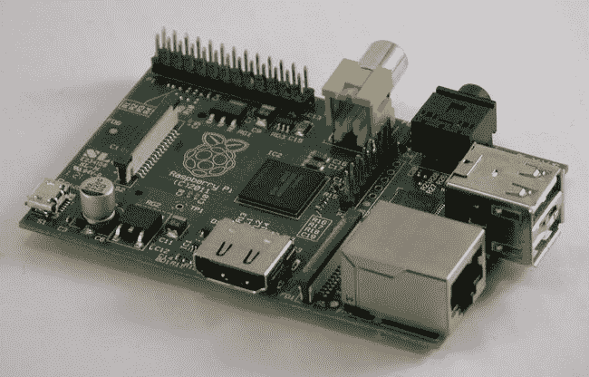
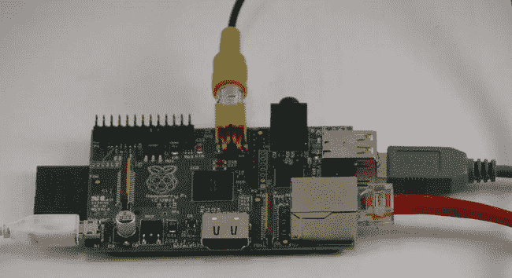
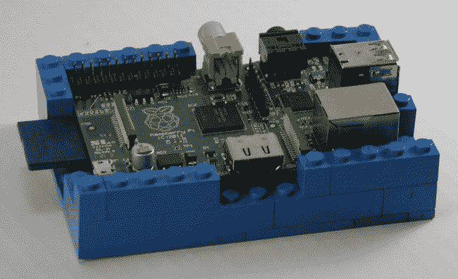
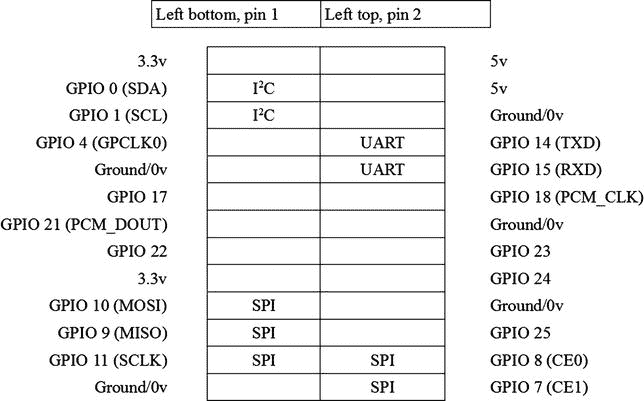
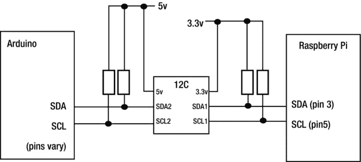

# 8.树莓皮

Abstract

图 [8-1](#Fig1) 中展示了树莓派的全部荣耀，它是计算领域的现代奇迹之一——一台信用卡大小的单板计算机，能够运行 Linux 及其应用程序，并能够处理高清视频的回放。它于 2012 年 2 月 29 日推出，现在已经发布了三个不同的版本，目前的两个版本是型号 A (256 兆字节，带 USB)和型号 B (512 兆字节，带 2 个 USB 和以太网)。为了额外的 10 美元，没有理由不考虑 B 型车！这两款机器都不附带电源、Shell、键盘、鼠标或任何使其工作的必要物品(这为用户提供了第一剂教育！)，所以它是尽可能便宜。

图 [8-1](#Fig1) 中展示了树莓派的全部荣耀，它是计算领域的现代奇迹之一——一台信用卡大小的单板计算机，能够运行 Linux 及其应用程序，并能够处理高清视频的回放。它于 2012 年 2 月 29 日推出，现在已经发布了三个不同的版本，目前的两个版本是型号 A (256 兆字节，带 USB)和型号 B (512 兆字节，带 2 个 USB 和以太网)。为了额外的 10 美元，没有理由不考虑 B 型车！这两款机器都不附带电源、Shell、键盘、鼠标或任何使其工作的必要物品(这为用户提供了第一剂教育！)，所以它是尽可能便宜。

图 8-1。

The barebones Raspberry Pi, at 85.6 x 56.0 x 21.0mm

## 公顷内的树莓皮

对许多人来说，树莓派是一种小巧、廉价的 Linux 机器。但是，仅仅从这些方面考虑这个问题是没有意义的。当宽带第一次被引入时，人们认为它是“一种快速拨号服务”，有一个很好的好处就是一直在线，仅此而已。事实上，永久连接改变了每个人使用互联网的方式。拥有家庭服务器，以及随之而来的 HA，第一次成为一种可行的可能性，允许人们拥有一个私有的数据存储和控制系统。同样，拥有一台这么小的电脑并不是在你的桌子上有更多空间的问题，而是能够自动化设备的问题，否则如果有一台全尺寸的机器连接到它，使用起来会变得很麻烦。同样，拥有这么便宜的设备意味着你可以进行更多的实验，自动化更多(也更深奥)的设备。

### 明显的好处

尽管我在上一段有所评论，但小而便宜确实有它的好处。大小允许我们将它连接到其他设备和其他地方。令人惊讶的是，一个树莓皮可以装进一个电灯开关！因为 HA 的计划是移除旧的手动技术，例如灯开关，这意味着您可以重新使用开关曾经用于 Raspberry Pi 和一些附加组件的孔。对于网络摄像头、 [1](#Fn1) 等外围设备来说尤其如此，这些都是需要复杂软件驱动程序才能工作的哑技术。如果你愿意，你可以使用 SimpleCV 在你书房或书房的开关上添加人脸识别功能，并以这种方式限制访问！或者，通过增加一个小屏幕，您可以将交换机变成一个会议或 VOIP 终端。

Note

对于钱多的人来说，把每个墙壁开关换成 iPod Touch 或者 Android 平板电脑也能达到同样的效果！

同样值得考虑的是，树莓派比任何现成的小工具更容易破解，也更便宜。在过去，开发人员会花几个月的时间对一个 35 美元的小工具进行逆向工程，只是为了增加一个功能或让它运行某个版本的 Linux 或 BSD。现在，由于树莓 Pi 的成本相同，几乎没有必要做这项工作，因为树莓 Pi 可以通过最少的硬件和突出的软件成为小工具——这些软件大部分已经可用，并在开源许可证下发布。

### 走向完全的地方控制

树莓派的价格意味着在家里的每个房间都有一台(或两台)电脑不再是不合理的。更重要的是，因为它比 Arduino 更强大，它可以用作媒体流和控制系统，特别是当它运行 Linux 时，因此能够使用所有传统的 Linux 软件来完成这些任务。

如前所述，Raspberry Pi 可以安装在灯开关内，因此您可以用“软”开关取代“硬”开关，电流通过“硬”开关来控制灯。在高可用性环境中，这意味着交换机不(直接)控制电流。相反，交换机连接到 Raspberry Pi，后者依次向 Node0 发送打开/关闭消息。Node0 接收该消息，对其进行解释，并向灯发送适当的控制信号。如果灯在 X10 上，或者是一个色调灯泡，那么我们已经看到的命令可以控制灯。但是，您也可以自己实现一个类似的系统，方法是将 Raspberry Pi 的 GPIO 连接到一个继电器，继电器反过来用灯泡控制现有的电路。图 [8-2](#Fig2) 中的电路在这里很有用，尽管 Raspberry Pi GPIO 接口的更多细节将在后面讨论。

图 8-2。

A method to control a relay from a Raspberry Pi

Raspberry Pi 的低功耗要求使得软开关变得非常简单，因此为了保持低能耗，建议使用单独的 led 作为状态灯，而不是耗电(且昂贵)的显示器。然后由您决定是否为交换机添加 USB 充电站...或者一个扬声器...

### 社区的快乐

通过在主板成本上节省大量资金，开发人员可以花时间帮助其他开发人员。除了 Arduino，Raspberry Pi 可能拥有目前市场上任何一款硬件的最大社区。除了官方论坛( [`http://www.raspberrypi.org/phpBB3/index.php`](http://www.raspberrypi.org/phpBB3/index.php) )之外，在 Element14 ( [`http://www.element14.com`](http://www.element14.com/) )上还有一个(通常更技术性的)论坛，它是法内尔的一部分。

Tip

如果你在寻找更详细的社区支持，那就避开官方的 Raspberry Pi 论坛，使用 Element14 上的论坛——尽管注册过程很麻烦而且没有必要！正如帖子 [`http://www.element14.com/community/thread/19436`](http://www.element14.com/community/thread/19436) 所显示的，当对话没有提出基金会的理想时，人们会被禁止进入官方网站，帖子也会被删除，这可能会妨碍你找到问题的答案，甚至无法证明此类问题的存在。

案例设计是 Raspberry Pi 社区聚集在一起讨论想法的另一个领域。这对于那些没有螺丝孔的旧主板来说尤其重要。箱子由乐高、旧游戏机和纸制成。甚至出现了铝制的专业版本，几个 kickstarter 项目也提供了一个案例。虽然目前还没有正式的案件，皮鲍颜色案件目前正在挑选了很多球迷。

Caution

并非所有预建的机箱都提供 GPIO 引脚，这是与自制外设接口所必需的，所以要注意。

### 缺点

当然，如果树莓派是完美的，我们就不需要发明更多的电脑了。永远不会。然而，除了它缺乏完成现代任务的能力(即使是语音合成也仅限于一种简化得多、听起来不那么令人愉快的算法)，还有一些问题限制了 Raspberry Pi 的使用范围。这些问题是否重要将取决于您的用例。

要提出的第一点是，您不能使用 PXE 或类似技术通过网络进行引导。因此，你总是需要一个 SD 卡或者(不太常见的)一个连接的硬盘。所以，如果你打算把树莓派放在一个密闭的空间里，请记住 SD 会比Shell更突出。

物理安装设备时的另一个注意事项是，电源是通过 USB 导线连接的，这将使总尺寸增加几毫米，复合电缆、以太网插头等也是如此。树莓派更常见的尺寸实际上是 175.0 x 85.0 x 25.0mm 毫米，如图 [8-3](#Fig3) 所示。

图 8-3。

The effective size of a Raspberry Pi, without bending the cables excessively

此外，谈到安装，记得购买版本 2 板，因为这些是第一个有安装孔，所以他们可以固定到案件和附加到任意设备，使用这两个孔。 [2](#Fn2)

正如你可能注意到的，没有开关。考虑到它消耗的电流量，这对大多数人来说可能并不重要。事实上，让 NSLU2 或迷你 ITX 解决电源开关问题所需的技巧可能意味着这是一个明智的选择。然而，如果你认为你需要这样一个按钮，你必须手动将它插入 USB 电缆。

另一个缺失的元素是实时时钟。如果没有的话，你每次插上电源都必须手动设置时钟。这意味着，如果您不重新编程时间，或者重新编程不正确，日志文件和文件戳可能会陷入混乱。通常，时钟电路由一个谐振器或晶体和备用电池组成，以在机器关闭时保留时间和日期。然而，这被认为是过多的额外电路，因此在设计中被省略。因此，任何需要了解时间或日期(包括任何可能记录数据的内容)的解决方案都需要将时钟与网络时间服务器(NTP)同步，使其永久保持开启，或者购买/构建一个外部 USB 时钟，如 [`http://ahsoftware.de/usb-rtc`](http://ahsoftware.de/usb-rtc) 的时钟。对于基于软件的解决方案，您可以编写一个简短的脚本，在日志文件中查找最近的日期，并使用它。从人类的角度来看，时间可能是错误的，但是，由于日期戳是连续的，机器不会造成问题。

在考虑底层硬件含义时，请注意，如果没有 NDA，Broadcom BCM2835 芯片(完成所有主要工作)的完整文档将无法获得。大多数人会乐于在更高层次上使用它，甚至是编程 GPIO，或者从内核源代码开始工作。但是，如果你希望了解 SoC 的内部工作原理，或者想要调查驱动因素，那么你就不太走运了，你应该寻找完全开放的选项。 [3](#Fn3)

从接口的角度来看，缺少 VGA 端口是大多数人关心的问题。虽然 Raspberry Pi foundation 认为 VGA 是一项过时的技术，但现实是，有许多不错的显示器不支持 HDMI，因此需要您购买单独的转换器。当寻找小型显示器时，这个问题变得更加突出，因为 HDMI 的小型版本非常少，而且(到目前为止)没有明确的兼容性列表。(树莓 Pi 上的 HDMI 似乎比台式机上的 HDMI 有更糟糕的兼容性问题。)因此，你可能会被迫使用复合视频来利用小显示器，此时你使用的是比 VGA 更老的技术，而且视觉质量更差。其他视觉连接包括 Kindle(需要越狱和终端模拟器，如 [`http://www.ponnuki.net/2012/09/kindleberry-pi`](http://www.ponnuki.net/2012/09/kindleberry-pi) 所述)、iPad(只需使用标准终端模拟器)，甚至现有的数码相框( [`http://www.cjb.im/2012/06/raspberry-pi-wireless-display-using.html`](http://www.cjb.im/2012/06/raspberry-pi-wireless-display-using.html) )。

Caution

如果没有正确检测到您的 HDMI 设备，您将需要编辑`/boot/config.txt`文件，以包含明确定义它的参数。这显示为两行，如`hdmi_group=1`和`hdmi_drive=2`，参数指示 HDMI 的类型(CEA 或 DMT)和分辨率。 [`http://www.raspberrypi.org/phpBB3/viewtopic.php?f=26&t=5851`](http://www.raspberrypi.org/phpBB3/viewtopic.php?f=26) 都有描述。

Raspberry Pi 最大的问题似乎是 USB 堆栈的实现，硬件和软件都有问题。虽然情况正在改善，但任何需要 USB 成为“关键任务”的东西都可能需要重新设计。不幸的是，这包括通过 USB 提供的以太网。(这也是为什么你不能在 Raspberry Pi 上安装千兆以太网——你受到基本 USB 端口速度的限制。)

在撰写本文时，USB 问题还没有完全解决，但症结就在于此。Broadcom 芯片内部处理 USB 端口的硬件组件不是特别好，试图驯服它的驱动程序(dwc_otg)存在一些问题，如果收到 NAK 数据包，处理器就会中断。此时(但似乎只是部分时间), USB 堆栈的硬件部分重新发送一个入站数据包...这产生了另一个 NAK 包…导致了处理器的另一个中断。诸如此类。这很快会导致中断级联问题，可能会导致 Raspberry Pi 在大约 20 秒内不可用。关于这个话题的有趣讨论，以及为什么树莓派在空闲时每秒有 8000 次中断，线程在 [`http://www.raspberrypi.org/phpBB3/viewtopic.php?f=28&t=7866&start=111`](http://www.raspberrypi.org/phpBB3/viewtopic.php?f=28t=7866start=111) 仍然是打开的。

解决这个问题的一个办法是完全禁用 USB:

`echo 1 > /sys/devices/platform/bcm2708_usb/bussuspend`

自然，这就妨碍了键盘的工作。由于以太网也是通过 USB 控制的，这意味着您无法远程控制它来与外界通信。通过 GPIO 连接键盘或类似设备是可能的，但是这种电路超出了本书的范围。网上也有一些关于树莓派(A 型)是否避免了这个问题，或者它是否没有经常被目睹的讨论。一个帖子，比官方的更详细，可以在 [`http://www.element14.com/community/thread/18568`](http://www.element14.com/community/thread/18568) 找到。

## 典型项目

互联网上充斥着对树莓派的使用；以至于很多人可能会认为这是一个寻找问题的解决方案！这是标准行为。对于任何新技术，总会有人喊“我能在 PI 上做 X 吗”，其中 X 等同于他们想在另一台机器上做的任何任务。我们现在将考虑这些项目中的一些，以及它们如何实现，但更重要的是，涵盖更多可能的项目，因为 Raspberry Pi 足够便宜，或足够小，允许这样的想法实现。

### 电话

手机和互联网的广泛使用改变了许多行业。有些，比如邮政服务，继续主张征收“电子邮件税”来补充他们垂死的商业模式。其他公司，如电信公司，正在寻找新的方式来销售他们现有的服务，在这个世界上，互联网供应商可以在大多数领域削弱他们。一个显而易见的领域是 IP 语音，在这个领域，传统的电话可以通过互联网，而不是固定电话，几乎不需要任何费用。事实上，您甚至可以使用一个“尽您所能”的数据包在手机上运行 Skype，从而绕过移动服务提供商的电话费！

对于那些对 VOIP 解决方案感兴趣的人来说，你可以通过将树莓 Pi 放在电话桌的抽屉里来利用它的小尺寸(对于那些仍然有这样东西的人来说！).然后可以加载 Asterisk 或其他 PBX 软件，以提供与另一个基于 VOIP 的内部通话系统一样有效的内部电话系统。放在这个位置的一个树莓 Pi 也提供了一个合适的借口，把它当做你手机的充电和同步站。当你回家时，你的手机可以放在连接 Raspberry Pi 的底座上，当天的照片可以自动复制(即备份)到你的家庭网络服务器上。

### 儿童看护

树莓皮的大小也让你有机会在泰迪熊里安装一个，为孩子们提供一个舒适的故事讲述设备，同时通过使用基本的网络摄像头和麦克风组合，在他们上床睡觉后充当儿童安全监视器。这可以双向工作，包括 VOIP 功能，所有数据通过以太网或单独的 WiFi 板传输。有一个 Raspberry Pi 认可的相机模块正在开发中，在你读到这篇文章的时候应该已经准备好了。

这种模型的构造很简单。“睡前熊”是最好的，因为它们基本上没有填充物，因为孩子打算把他们的睡衣放在里面。然而，除了睡衣，你还可以用树莓酱来填充小熊！这是唯一可能的项目之一，因为 Raspberry Pi 足够小。以至于，事实上，你需要添加一些填料，因为大多数熊都足够大，可以带一个盒装的树莓皮，一个电池组和各种外围设备！

因为它是由织物制成的，所以没有简单的方法将树莓皮板拧入熊中，所以在熊的内部缝一个小口袋，将树莓皮(在箱子或防静电袋中)插入其中，并穿孔，以便电缆进出袋子。

英国电视儿童系列节目《天线宝宝》中的泰迪熊肚子里有电视显示屏。你也可以复制这个。或者包括一个微型投影仪，在他们房间的天花板上给孩子们放映卡通片。根据二维码或 RFID 或 NFC 传感器检测到的熊在房间中的位置，可能会有不同的漫画。

ToyTalk ( [`http://www.toytalk.com`](http://www.toytalk.com/) )最近开始研究现代的泰迪·鲁斯宾，它可以通过故事和歌曲与你的孩子互动，所以，和 Kinectimals 一起，你应该能为你的虚拟儿童看护者找到许多好主意。

如果你的孩子比较大，那么也许把这样的照看孩子的设施建在一个街机游戏柜里比建一个玩具熊更好！

### 相框

树莓派的低成本也意味着其他家用设备的制造商不得不提高产品档次，降低价格。一个高质量的数码相框曾经非常昂贵。现在，只需一个树莓派和一个便宜的显示器，您就可以改进市场上最好的产品，提供带有图像、视频和声音剪辑的幻灯片。

从软件的角度来看，这再简单不过了。你甚至可以使用标准的屏幕保护程序，或者 OpenElec 或 XBMC 的幻灯片功能。如果你不想要基于网络的解决方案(除非你想要增加无线板或运行以太网电缆的额外成本，否则没有理由将它连接到网络上)，还有许多其他的解决方案——eog([`https://help.gnome.org/users/eog/stable`](https://help.gnome.org/users/eog/stable))、gthumb ( [`http://gthumb.sourceforge.net/home.html`](http://gthumb.sourceforge.net/home.html) )、kiosk 系统( [`https://github.com/csldevices/sweb`](https://github.com/csldevices/sweb) )或 fbi。后者使用帧缓冲设备，因此您不需要完全的桌面安装，这有助于减少系统的启动时间和占用空间。

通过软件而不是固件运行相框，意味着您可以更轻松地升级系统，以结合夏令时的变化，显示天气，或在早上时间定期呈现日历，或向家中的多个相框添加从 Node0 发送的警报或消息(详见第 7 章[)。您还可以更容易地调整显示的图像，也许是介绍 12 月份圣诞节过去的图像，或者在您知道他们要来住的时候添加更多的家庭成员，并在不久之后删除他们！](http://dx.doi.org/978-1-4302-5888-9_7)

### 气象站

你也可以考虑建立或加强一个气象站。大多数有两种类型——便宜的版本可能会报告温度、风速和寒冷系数，但不提供将数据导出到设备外部的方法。昂贵的版本提供了一个无线或 USB 组件的数据输出。然而，成本的差异通常超过一个树莓派，所以它是一个有趣的项目来黑你自己的。

每次攻击的细节取决于气象站本身。您可以捕获设备发出的消息( [`http://hackaday.com/2011/09/06/lacross-weather-station-wireless-data-acquisition`](http://hackaday.com/2011/09/06/lacross-weather-station-wireless-data-acquisition) )并对协议进行逆向工程，或者重新配置传感器并将结果直接反馈给 GPIO。

如果你打算学习协议，买一个有独立室外传感器的天气单元。通过这种方式，协议将有一个明确的终点，这使得工程更容易。(我见过的都没有加密天气数据的！)

购买一个完整的单元，然后把它拆成零件，这种想法可能看起来很浪费，但这样做通常比单独购买传感器更便宜！此外，找到传感器的产品规格通常比找到协议描述更容易。为此，我建议寻找这个领域已经发生的项目(比如 Hack-A-Day 的例子),并购买相同的设备。

吉姆·伊斯特本的《Pywws》就是其中之一。这个 Python 程序从 Maplin USB 气象站读取信息，他的项目被记录为 [`http://www.weather.dragontail.co.uk/index.php?page=station_setup`](http://www.weather.dragontail.co.uk/index.php?page=station_setup) 。从这里，数据可以被制成图表、分析并呈现在网页上。当你考虑调整你的恒温器以反映温度时，特别是度假归来时，利益因素被效用函数所取代。

### 树莓 Pi 作为 USB 主机

看看需要强大驱动程序才能运行的 USB 设备，您可以通过简单地将一台旧打印机连接到网络并在其上安装一个 CUPS 服务器，用 Raspberry Pi 将它变成一台现代化的联网打印机。这是一个标准包装，准备如下:

`sudo apt-get install cups`

`sudo usermod -a -G lpadmin <your_user_name>`

剩下的配置可以通过 web 浏览器进行:

[T2`http://127.0.0.1:631`](http://127.0.0.1:631/)

如果您计划将 Raspberry Pi 用作无头打印机服务器，那么您必须编辑`/etc/cups/cupsd.conf`来监听其他机器:

`Listen 192.168.0.100:631`

并继续修改/admin 部分，以包括可以使用该接口的机器的 IP 地址:

`<Location /admin>`

`Order deny,allow`

`Encryption IfRequested`

`Satisfy All`

`AuthType Basic`

`AuthClass System`

`Deny All`

`Allow 127.0.0.1`

`Allow 192.168.0.100`

`</Location>`

继续 USB 主题，低成本提供了将它作为一次性设备的机会，就像 USB 记忆棒一样。然而，由于你也有一个 CPU，所以你可以携带一个完全安全的设备(如果你愿意的话，一个个人云),并在你无法访问互联网和/或你不能信任当地网吧的时候(当你在国外并且你的智能手机缺少电池或信号时，可能会发生这种情况)携带一个数据镜像。这与几个网站上讨论的拥有个人比特币钱包的方法相同，包括使用 [`http://electrum.org`](http://electrum.org/) 客户端的 [`https://coderwall.com/p/9i4g9a`](https://coderwall.com/p/9i4g9a) 。

或者，为了更轻薄的用途，连接任何 USB 新奇小工具，如保暖拖鞋，圣诞灯，轮子上的仓鼠，微型风扇，导弹发射装置，或饮料冷却器，并将树莓派作为您玩具房间的一部分！

### 作为设备主机

理论上，所有桌面电脑的插件模块和实用程序都适用于 Raspberry Pi。实际上，这可能毫无意义。例如，如果它节省的电力与 PC 消耗的千瓦时相比相形见绌，为什么您要运行高性能的台式机来开关您的灯呢？类似的观点也适用于监控室内能耗的设备——如果算上电脑，让所有东西都开着会更便宜！

考虑到这两个用例，Aeon Labs Z-Stick 是一个低功耗的 USB 加密狗，在 Linux 上具有良好的兼容性，包括 Raspberry Pi 和 OpenZWave(见[第 2 章](http://dx.doi.org/978-1-4302-5888-9_2))。)在 [`http://thomasloughlin.com/z-wave-controller-setup-on-my-raspberry-pi`](http://thomasloughlin.com/z-wave-controller-setup-on-my-raspberry-pi) 概述的项目允许你用最小的功率足迹控制 ZWave 设备。这篇文章还举例说明了每个 Raspberry Pi 应该只做一项工作的思想，它提供了一个包含完整安装的 Linux 和必要软件的 SD 映像。

在能源使用方面，Owl 系统最近受到了好评，特别是因为它可以将其 OWL 传感器接收器连接到 Raspberry Pi 并恢复数据。在 [`http://www.raspberrypiusers.com/?p=7486`](http://www.raspberrypiusers.com/?p=7486) 中详细描述的项目显示了所涉及的简单性，这部分归功于 OWL 将其数据多播到网络，允许您打开一个套接字并使用 Pi 选择的语言 Python 检索数据，使用如下代码:

`import socket`

`import struct`

`MULTICAST_ADDRESS='224.192.32.19'`

`s = socket.socket(socket.AF_INET, socket.SOCK_DGRAM, socket.IPPROTO_UDP)`

`s.setsockopt(socket.SOL_SOCKET, socket.SO_REUSEADDR,1)`

`s.bind(('', 22600))`

`mreq = struct.pack ('4sl', socket.inet_aton(MULTICAST_ADDRESS), socket.INADDR_ANY)`

`s.setsockopt (socket.IPPROTO_IP, socket.IP_ADD_MEMBERSHIP, mreq)`

`buffer = s.recv(800)`

### 近程传感

对于那些希望树莓派在智能家居中扮演更重要角色的人来说，BlueProximity 项目( [`http://blueproximity.sourceforge.net`](http://blueproximity.sourceforge.net/) )提供了一种自动锁定和解锁 X Window 会话的方法，这种方法基于你的蓝牙手机与相关机器的距离。这个自然不需要插在你要锁的机器上！你可以在书房的门口或者前门和后门放一个树莓派和它的蓝牙装置。在机器之间发送消息的最简单的方式包括从一台机器到另一台机器的 HTTP GET 请求，以及检查正确参数的小脚本(因为它们应该包括各种密码)。)

这个想法可以通过在房子周围放置几个接近传感器来扩展，以计算出个人的位置。为了促进这一点，BlueProximity 版本的工作正在进行中，该版本将监控几台不同机器上的蓝牙信号强度，并使用它来推断您的位置。

此位置信息可用于向您的当前位置发送反馈消息和警报。因此，举例来说，如果软件检测到你在客厅，它可以在你的电视屏幕上显示信息。通过这种方式能够针对特定设备，消除了将所有消息发送到您的手机的需要。此外，它允许您将手机用作遥控器，可以智能地锁定离您当前位置最近的任何设备。正如我所说，这个项目仍在开发中，但有潜力，是一个很好的解决方案的例子，否则，如果控制 PC 比 Raspberry Pi 大得多，或更昂贵，这是不可能的！

### 咖啡机

在 20 世纪 70 年代和 80 年代，奶茶是中产阶级的时髦玩意儿！晚上，你可以在机器里装满水和茶，或者咖啡，然后设定第二天早上的闹钟。然后，它会像闹钟一样，自动为你沏上早晨的第一杯茶。通过我们在[第 2 章](http://dx.doi.org/978-1-4302-5888-9_2)中提到的 X10 项目，这现在又成为可能。但随着树莓 Pi 能够有更大的控制机会，它的范围可以得到改善。

树莓派相对于 X10 的优势在于，你可以有一个从茶壶到网页的反馈回路，你可以控制设备的更多参数，因为现代浓缩咖啡机有许多用于不同咖啡类型的按钮，像茶壶一样只打开电源是不够的。作为一个例子，Shawn Wallace 和 Matt Richardson 建造了一个树莓 Pi 控制的咖啡机，如在 [`http://blog.makezine.com/2013/02/11/raspberry-pi-for-web-initiated-coffee`](http://blog.makezine.com/2013/02/11/raspberry-pi-for-web-initiated-coffee) 所述。

对于那些早上想喝点更烈的东西的人， [`http://brewpi.com`](http://brewpi.com/) 讨论了一种基于树莓派的解决方案，用于控制家庭酿酒厂的温度！

### 带闹钟的定时开启收音机

如果茶(或一杯清晨啤酒！)不合你的口味，那树莓派就做了一个很高级的时钟收音机。这样一个项目是进入自制家庭自动化世界的一个合适的开端，因为它需要非常简单的软件，一个非常基本的显示器就足够了。

没有理由不使用真正的收音机，它不能从你当地的媒体服务器上播放音乐，或者从 RSS 订阅源上阅读新闻，或者你的日程安排，或者第七章第一节中提出的任何其他想法。另外，与当时大多数时钟收音机不同的是，它还可以根据夏令时自行调节。然而，如果发生这种情况，它应该总是发出反馈，说它已经改变了时间，因为(正如我们所了解的)每个动作都应该有一个反馈消息，我们不想更新时间两次。

### 没有主电源

抛开小巧和廉价的优势，人们可以利用树莓 Pi 由电池供电的能力，在可能被认为危险或非法的地方使用电源。 [4](#Fn4) 例如，棚子、淋浴间、厨房或花园，在这些地方引入水或蒸汽会对市电供电设备产生不利影响。

这使你可以建造自己的园艺机器人，在特定的时间间隔给植物喂食和浇水，并且不需要任何额外的努力，就可以通过网页报告结果。这里的关键词是“间隔”，因为计算机，甚至是树莓 Pi，都是高功率设备，所以永久使用电池将确保机器人的寿命很短。例如，Adafruit 电源包( [`http://www.adafruit.com/products/962`](http://www.adafruit.com/products/962) )可以持续 5 小时左右，而基本的 AA 电池组( [`http://www.raspberrypi-spy.co.uk/2013/02/running-a-raspberry-pi-from-6-aa-batteries`](http://www.raspberrypi-spy.co.uk/2013/02/running-a-raspberry-pi-from-6-aa-batteries) )可以持续 16 小时以上。

电池电量(除了屏幕)的最大消耗之一是 WiFi 连接。因为你不想放弃电源线，却发现自己被网线束缚，所以最好将所有数据存储在本地，并编写 rsync 脚本定期将数据卸载到另一台机器，如笔记本电脑。

## 装置

提供的树莓派什么也做不了。事实上，所提供的主板需要额外的硬件和软件才能像砖块一样智能。现在让我们看看这些步骤。

### 软件

与传统的 Linux 系统一样，第一步是选择发行版。Raspberry Pi 在这里占据了一个有趣的位置，因为虽然一些传统发行版(如 Debian)提供了自己的版本，但许多其他发行版却避而远之。总的来说，这个社区采用了一种有趣的方法，将发行版视为应用程序——如果你想将 Raspberry Pi 用作媒体中心，那么就使用预装的媒体中心发行版，如 XBMC [5](#Fn5) 或 OpenElec。 [6](#Fn6) 如果你想要瘦客户端，那就用 RPTC。 [7](#Fn7) 等等。

不管发行版本如何，安装过程都是一样的。在这个例子中，我们将使用基于 Debian Wheezy 的官方通用发行版 Raspbian。您必须首先从一个网站(如 [`http://www.raspbian.org/RaspbianImages`](http://www.raspbian.org/RaspbianImages) )下载一个 SD 卡映像形式的预装版本。然后，必须使用以下命令将该映像写入 SD 卡(大小适合该映像，显然，4GB 是一个不错的入门级别):

`sudo dd bs=4M if=raspbian.img of=/dev/sdd`

`sudo sync`

Warning

在这里引用错误的设备可以(并且将会！)擦除连接到机器的硬盘或其他基于 SCSI 的设备。测量两次——如制造商所说，切割一次！

然后，您可以卸载 SD(如这里的`/dev/sdd`所示)并将其插入您的 Raspberry Pi，然后打开它。

如果这是你第一次涉足 Linux，你将需要 PiWriter[8](#Fn8)(Mac OS X)或 ImageWriter [9](#Fn9) (对于微软 Windows)来执行相同的 dd 步骤。

Raspbian 映像的当前版本没有 root 帐户，因此您无法直接登录。这样做的好处之一是防止您在第一次登录时造成重大损害。但是，许多发行版的默认用户是“pi”(密码是“raspberry”)，拥有 sudo 权限，允许您以 root 用户身份运行命令，以执行系统管理任务。

### 五金器具

没有开/关开关，你只需要插入 SD 卡，然后是电源线，你就可以走了。所有关于在插入或取出 SD 卡之前关闭的标准免责声明仍然适用。

Raspberry Pi 电源线是一个微型 USB 插头，可以从主机或连接到板上等效 USB 端口的电源适配器插头提供 5v 电源。正如我们所见，有电池组可用，但这些都不是为了长期使用。

一旦安装了操作系统，就该关机并开始物理安装了。这个是可选的！Raspberry Pi 设计的简洁优雅意味着许多人(包括我自己)更喜欢放弃保护套，或者使用透明保护套来防尘。否则，您将需要一个版本 2 板、两个螺母、四个螺栓和两个比螺母和螺栓的高度稍长的垫片。建议使用双螺母，这样它们可以用作“锁紧螺母”，防止它们意外丢失。当然，对于 geek chic 来说，一个乐高盒子永远不会出错，如图 [8-4](#Fig4) 所示。

图 8-4。

One of many LEGO cases, from [`LegoPunk.com/?q=node/210`](http://LegoPunk.com/?q=node/210)

## 与硬件接口

当您的 Raspberry Pi 到达时，它是一个防静电小袋中的电路板。这与笔记本电脑或台式机的大盒子和花哨包装大相径庭。可能正是这一点让人们更倾向于将电线直接连接到电路板上，以实现接口的目的，这种方式他们永远不可能用台式机来实现。

鉴于前面提到的 USB 问题，以及 USB 插座速度慢并且通常充满键盘、鼠标和硬盘驱动器的事实，意味着 USB 不是与 Raspberry Pi 接口的常用方式。这项荣誉由 GPIO、I2C、SPI 和 Arduino 相关技术分享。

### 硬件警告

调试软件虽然痛苦而困难，但与调试硬件相比，相对容易。尤其是当你出身软件背景的时候。硬件工程师可用的调试器(例如，电压表和电流表)与 GDB 最基本的版本相比已经过时了。因此，除非你是一个拥有良好逻辑分析仪的富家子弟，否则你将不得不修改你的开发方法！尤其是当一个硬件错误可能会破坏你试图构建的电路，以及连接到它的计算机。当这种情况发生时，你可能甚至没有意识到，并浪费时间试图修复一个永远不会工作的电路。

正是由于这个原因，许多接口板都有内置的保护缓冲器，所以即使你在输入端施加过大的电压，或者试图在电路中反向驱动电流，也不会损坏你的硬件。它们还可以帮助确定运行各种硬件所需的电压水平。许多分立插座组件使用 5v，这就是为什么 Arduino 可以简单地使用它们，因为它默认设置为使用 5v。然而，由于 Raspberry Pi 运行在 3.3v，当与这种芯片通信时，您需要调整电压电平。在这方面，接口板可以提供帮助。

如果您的开发方法可以说是谨慎的，那么采用 I2C 或 SPI 可能比 GPIO 更好，因为它们都需要一个芯片来有效地处理协议，例如分别采用 MCP23017 或 MCP3208。它们不仅允许比 GPIO 更多的通道，而且还提供了一种缓冲形式来帮助保护 Raspberry Pi 本身。

Caution

Linux 不是一个实时操作系统，因为你的软件不能准确地在它想要的时候运行，或者运行它想要的时间，因为操作系统总是有机会切换到另一个进程。因此，如果您的任务需要传感器或开关的精确定时，那么最好使用 Arduino，这样可以保证对每个时钟周期的控制，并相应地对代码进行定时。

### 使用 GPIO

GPIO(通用输入/输出)是 Raspberry Pi 电路板上的一组 26 引脚。其中包括 3.3v 和 5v 电源轨、一个时钟和几个引脚，它们可以由处理器直接控制，因此也可以由您的软件控制。这些可以与外部硬件通信。像 Arduino 一样，这些引脚可以重新配置，在我们的情况下，它们可以用作 I2C 接口、UART(通用异步接收器/发送器)、SPI(串行外设接口总线)和 PWM(脉宽调制)，如图 [8-5](#Fig5) 所示。最大的缺点是，与 Arduino 相比，用 Raspberry Pi 编写这种功能更困难，因为 Raspberry Pi 是一个多任务操作系统，所以时间上的变化很小。这些微秒是否明显将取决于您的应用程序，然而，任何刚开始使用该工具包的人都不太可能在一段时间内遇到问题。

图 8-5。

The GPIO pins

Raspberry Pi 和 Arduino 都有相同的过程来配置输入或输出引脚，然后向它们写入高电平或低电平信号。因此，将 LED 和电阻器(串联)连接到物理引脚 11(以及引脚 1 上的地)后，您可以使用命令行来控制它:

`gpio mode 0 out`

`gpio write 0 1`

这个 gpio 程序是 WiringPi 包的一部分，可以在 [`https://projects.drogon.net/raspberry-pi/wiringpi`](https://projects.drogon.net/raspberry-pi/wiringpi) 找到。我们使用这个包也是为了帮助解决理解引脚命名差异的复杂性。WiringPi 代码允许我们将接线引脚 0 作为系统的输出，它映射到物理引脚 11，因为 GPIO 引脚 17 恰好位于那里。(现在暂停一下，重读一遍，直到你理解每种类型的针之间的区别，因为它将在以后节省很多痛苦。)引脚的奇数编号正是这个特定芯片的配置方式。因此，如果我们将代码移植到另一个处理器，其中 GPIO-17 位于物理引脚 9 上，我们可以完全保持代码不变，只需用适当引脚上的 LED 重建电路。

当然,“Pi”这个名字参考了主要用 Python 编程的初衷。所以，如果你喜欢那种语言，你可以写:

`import Raspberry Pi.GPIO as GPIO`

`GPIO.setmode(GPIO.BOARD)`

`GPIO.setup(11, GPIO.OUT)`

`GPIO.output(11, GPIO.HIGH)`

与 Arduino 和大多数微控制器一样，Raspberry Pi 无法为电机提供足够的电流。(建议从任何引脚吸取的电流不要超过 50 毫安，总电流不要超过 150 毫安。)因此，您将需要使用一个带有继电器的驱动电路，该驱动电路遵循与之前图 [8-2](#Fig2) 所示相同的设计。

输入信号(如来自开关的信号)的代码需要您预期的代码更改:

`GPIO.setup(12, GPIO.IN)`

`inputValue = GPIO.input(12)`

允许您构建与 Arduino 相同级别的电路，还允许您强化完整 Linux 机器的能力和连接性。

Tip

要了解更多这种风格的编程，以及一些例子，请前往 [`http://elinux.org/RPi_Low-level_peripherals.`](http://elinux.org/RPi_Low-level_peripherals)

一旦电机连接到树莓派，你需要一个有效的方法来控制它。根据用途，这将取决于购买的电机类型，尽管总是建议使用反馈回路来告诉机器电机移动了多远。

对于需要大量运动的情况，例如窗帘轨道，可以使用步进电机或标准 DC 电机。在前一种情况下，反馈是自动的，因为电机被编程为以特定数量的离散步骤移动。对于 DC 电机，可以使用限位开关或开槽盘计数器。如果你注意到乐高头脑风暴项目中使用的马达，你就会明白如何用更坚固的部件来建造它。如果你的反馈是布尔型的，也就是说，你只需要知道是否达到了一个极限，那么一个简单的微动开关就足够了。

或者，对于机器人等轻型应用，最好的解决方案是采用伺服系统，其中电机的位置可以通过输出信号的脉冲宽度来控制。精确控制该脉冲至关重要，虽然对新手来说编程可能很困难，尤其是因为只有一个 PWM 引脚可用，但已经有一个库可以通过在软件中仿真 PWM 来解决这个问题。

Note

通过脉冲工作的伺服电机可能只能绕其轴的一部分转动，可能小于 270 度，因此不能用于所有应用。

ServoBlaster ( [`https://github.com/richardghirst/PiBits/tree/master/ServoBlaster`](https://github.com/richardghirst/PiBits/tree/master/ServoBlaster) )是一个能够通过 Raspberry Pi 的 GPIO 端口驱动多达八个伺服电机的库，这意味着它不需要额外的硬件。在其最基本的形式中，它只不过是一个用户空间守护进程(考虑到它需要访问 GPIO，它仍然需要作为 root 运行),当您第一次运行它时，它与 shell 分离:

`$ sudo ./servod`

然而，您也可以使用内核空间实现，通过创建一个新的设备`/dev/servoblaster`来处理所有的时序，您只需要指定脉冲宽度。电机 4 上的 1.3 毫秒脉冲宽度将被寻址:

`$ echo "4=130" >/dev/servoblaster`

零值将关闭它。对于 8 个伺服系统，每个伺服系统需要 2.5 毫秒的服务时间。最大延迟(从发出命令到看到效果的时间)将是周期时间，8 * 2.5 毫秒，即 20 毫秒。

给定这个周期时间，不可能有比 2.5 毫秒或 12.5%更长的脉冲。如果你正在使用发光二极管，那么更长的脉冲是必要的，并有可能使用一个称为 Pi-Blaster ( [`https://github.com/sarfata/pi-blaster`](https://github.com/sarfata/pi-blaster) )的伺服增强器代码的分支。给它一个明显的遗产，它以相同的方式被调用，但是使用脉冲宽度的分数百分比，而不是绝对时间。因此，12.5%的脉冲将是:

`echo "0=0.125" > /dev/pi-blaster`

为了扩大电机控制器的数量，也许是为了建造一个机器人，你将需要把你的调试器换成烙铁，并安装一个物理附件，例如来自 [`http://adafruit.com/products/815`](http://adafruit.com/products/815) 的 Adafruit 模块，它为伺服电机提供多达 16 个通道。

对于更高级模拟 I/O，您最好考虑最近的发展 Gertboard。虽然这是一个非常昂贵的板，但它提供了丰富的接口选项，使用 GPIO 的所有功能。SPI 用于 A2D (MCP4002)和 D2A (MCP4802)转换器，而唯一的 PWM 引脚用作电机控制器(L6203，缓冲至强大的 48V/4A)。UART 被配置为使用 Atmel AVR 微控制器、 [10](#Fn10) 以及用于各种按钮和 led 的剩余 GPIO 引脚。作为一个主要的模拟控制器，这是大多数项目的更好的匹配，因为我们的(真实)世界是模拟的，而不是数字的！

Tip

如果你打算在你的 Raspberry Pi 设置中加入 Arduino，那么值得考虑只买 Gertboard 和芯片，因为这可能比购买单独/额外的屏蔽和 Arduino 板更便宜。

Gertboard 的编程很像底层的 Arduino 代码。也就是说，你是直接写内存映射 IO，因此需要汇编程序员的细心技巧。这段代码可能看起来很普通，如下所示:

`PWMCLK_DIV = 0x5A000000 | (32<<12);`

`PWMCLK_CNTL = 0x5A000011;`

`PWM_CONTROL = 0; // i.e. off`

`PWM0_RANGE = 0x400; // all values between 0 and 1023`

`PWM0_DATA = 0x100; // write output`

这看似很自然的代码(尽管有点重于幻数)，是设置 PWM 所必需的。然而，隐藏在这些宏后面的是指针间接寻址，例如:

`#define PWM_CONTROL *pwm`

`#define PWM_STATUS *(pwm+1)`

`#define PWM0_RANGE *(pwm+4)`

`#define PWM1_RANGE *(pwm+8)`

`#define PWM0_DATA  *(pwm+5)`

`#define PWM1_DATA  *(pwm+9)`

因此，所有需要做的就是错过一个关于不正确数据类型的警告，并且您将会破坏后续的寄存器并跟踪几个小时不存在的错误！更多关于此板的信息可以在 Element14 网站 [`http://www.element14.com/community/docs/DOC-51726?ICID=raspi-group`](http://www.element14.com/community/docs/DOC-51726?ICID=raspi-group) 找到。

自然也有其他接口板，有曼彻斯特大学的 Pi-Face，Pi Crust，Quick2Wire。每个月都会有更多的产品问世，所以在网上快速搜索“缓冲板”或“扩展板”会让你了解当前的技术水平。

### 用 Arduino

将 Raspberry Pi 连接到外部世界的最简单方法是通过 Arduino，因为我们已经有了多年使用该设备的经验。此外，已经有许多有用的屏蔽。对于大多数人来说，这是一种浪费，因为 Arduino 能够处理我们关心的大多数输入设备。然而，它确实提供了一定程度的安全性，因为如果你犯了一个错误，爆炸的是(更便宜的)Arduino，而不是你心爱的 Raspberry Pi！

#### 通用串行总线

尽管之前提到了关于 Raspberry Pi 上的 USB 的问题，但这是连接两台机器最简单、最安全的方式。你只要把一个插到另一个里面就行了！

就软件而言，Arduino 使用传统的:

`Serial.begin(9600);`

`pinMode(inputSwitchPin, INPUT);`

`pinState = digitalRead(inputSwitchPin);`

`Serial.println(pinState ? '1' : '0');`

Raspberry Pi 上有一个程序从串行设备中读取这些数据。您需要设置设备，包括:

`char *szUSBDevice = "/dev/ttyUSB0";`

`FILE *fp = fopen(szUSBDevice, "r");`

然后在一个紧循环中从串行设备读取数据，执行类似于以下的操作:

`if (fread(&v, 1, 1, fp)) {`

`if (v == '0') { }`

`if (v == '1') { }`

`}`

自然，这是非常慢的，并且在事件发生、被 Arduino 发现、然后在 Raspberry Pi 上传输和处理之间有相当大的延迟。为了改善这一点，你需要考虑使用 I2C 公共汽车。

#### I 2 C

I2C 是一种称为内部集成电路的双线接口。这是一种总线协议，最初由飞利浦设计，用于将慢速外设直接连接到计算机主板上。通过将数据直接放到总线上，设备之间的延迟可以大大减少。此外，您可以在一条 I2C 总线上连接多达 128 个设备，这远远超过了我们之前提到的相当保守的 USB 解决方案。

Caution

当将设备直接连接到另一个设备的总线上时，您没有其他方法(如 USB)提供的隔离或保护。因此，一个设备更容易(从物理上)伤害另一个设备，或者通过不作为来允许伤害降临到它身上。在连接 Arduino 和 Raspberry Pi 的具体情况下，记住它们分别工作在 5v 和 3.3v，需要一个电平移位器来正确协调电压。

硬件组件与双线协议一样简单，只需将 Raspberry Pi 的 SDA 连接到 Arduino 的 SDA，将 Raspberry Pi 的 SCL 连接到 Arduino 的 SCL，如此即可。当然，你需要我们之前使用的电平转换器(为了安全起见，你可能想增加一些上拉电阻)，但是，除此之外，所有必要的是如图 [8-6](#Fig6) 所示。

图 8-6。

Connecting an Raspberry Pi to an Arduino

构建它，然后打开电源，在 Arduino 上运行软件，以便它能够在 I2C 总线上注册自己:

`#include "Wire.h"`

`int i2cAddress = 0x03;`

`void setup() {`

`Wire.begin(i2cAddress);`

`}`

剩下的软件和硬件一样简单！首先检查 Arduino 是否能在总线上找到。因此，在树莓派上，只需运行:

`$ sudo modprobe i2c-dev`

`$ sudo i2cdetect -y 0`

`0 1 2 3 4 5 6 7 8 9 a b c d e f`

`00:     03 -- -- -- -- -- -- -- -- -- -- -- --`

`10: -- -- -- -- -- -- -- -- -- -- -- -- -- -- -- --`

`20: -- -- -- -- -- -- -- -- -- -- -- -- -- -- -- --`

`30: -- -- -- -- -- -- -- -- -- -- -- -- -- -- -- --`

`40: -- -- -- -- -- -- -- -- -- -- -- -- -- -- -- --`

`50: -- -- -- -- -- -- -- -- -- -- -- -- -- -- -- --`

`60: -- -- -- -- -- -- -- -- -- -- -- -- -- -- -- --`

`70: -- -- -- -- -- -- -- --`

从这里，你可以看到你的 Arduino 成功地连接到总线，并在地址 03。如果你看不到 Arduino，那么很可能你使用的是修订版二板，因此需要使用总线 1，而不是总线 0，所以改变上面的`i2cdetect`命令，和下面的`SMBus`参考。

从 Raspberry Pi 发送数据使用 smbus 库和代码，例如:

`#! /usr/bin/python`

`import smbus`

`bus = smbus.SMBus(0)`

`address = 0x03`

`dataToSend = 42`

`bus.write_byte_data(address, 0xC9, dataToSend)`

注意，我们发送了两个字节，尽管只需要一个。第一个字节(0xC9)就像一个报头，表示我们正在发送的数据类型。然后，Arduino 可以在地址 3 的 I2C 总线上观察数据，并做出相应的响应。因此，我们将上述程序修改为:

`#include "Wire.h"`

`int i2cAddress = 0x03;`

`void setup() {`

`Wire.begin(i2cAddress);`

`Wire.onReceive(receiveEvent);`

`}`

`void receiveEvent(int size) {`

`if (size == 2) {`

`int header = Wire.read();`

`int dataRead = Wire.read();`

`if (header == 0xC9) {`

`// Do something`

`}`

`}`

`}`

将数据从 Raspberry Pi 发送回 Arduino 的等价但更罕见的代码留给读者作为练习！

### 带 SPI

作为事实上的标准，串行外设接口总线是一种在单个主机(本例中为 Raspberry Pi)和任意数量的从机外设之间进行通信的方法。虽然一次只能控制或查询一个从机，但其高速操作和全双工操作使其成为许多微控制器和其他类似项目的有用方法。

必要的硬件只涉及树莓派连接器的五个引脚，SCLK(时钟)、MOSI(主机输出)、MISO(主机输入)和 CE0/CE1(都选择使用哪个从机)。)MOSI/MISO 对为全双工通信信道提供发送/接收配对，而 SCLK 用于保持所有从机与主机同步。因此，不需要在从机上运行单独的时钟，这样更容易找到合适的振荡器，而且它们不需要很精确。这种简化电路的努力也体现在以下事实上:与 I2C 不同，不需要上拉或下拉电阻，您只需将主设备上的 MOSI 连接到从设备上的 MOSI(对 OISO 和 SCLK 重复此操作)，就万事俱备了！

从机选择指示主机正在与哪个从机通话。Raspberry Pi 硬件提供了其中的两个，CE0 和 CE1，它们利用了`/dev/spidev-0.0`和`/dev/spidev-0.1`。然而，作为一种协议，SPI 允许您控制任意数量的从机。因此，有可能(实际上也建议)使用其它 GPIO 引脚来选择所需的从机，使用低逻辑 0 来表示所讨论的从机。由于不能使用标准 SPI 库，因此必须通过写入 GPIO 来手动处理从机选择，如前所述。GPIO 和 SPI 之间的时序是一个正确排序的问题，首先将从机选择中使用的所有 GPIO 引脚拉高至逻辑 1，等待，然后将相应的引脚拉低。

Tip

如果您编写自己的从机选择驱动程序，那么您应该总是先将选择引脚发送至高电平，然后发送至低电平，因为有些从机只能在下降沿唤醒。

使用 SPI 可能实现的项目就像使用 GPIO 或 I2C 一样。您在简化的电子设备中获得了什么，在软件上就失去了什么，因此您需要编写自己的错误处理和握手代码，因为无法知道从机是否收到了发送给它的消息，协议本身也没有任何错误检查。如果您的项目是在一个电气噪声环境中(可能是杂物间，有洗衣机和滚筒式烘干机的大功率电机)，那么这是一个有效的关注，因为 SPI 更容易受到噪声的影响。如果您没有 SPI 从机来进行实验，那么您可能错了(！)因为任何能够在四个不同管脚上通信的东西都可以被压入服务中...Arduino 是一个合适的候选者。可以在 [`http://hackaday.com/2013/01/06/hardware-spi-with-python-on-a-raspberry-pi`](http://hackaday.com/2013/01/06/hardware-spi-with-python-on-a-raspberry-pi) 找到概念证明。

从编程的角度来看，该软件与其他协议一样易于编写。在 Python 中，您可以使用标准库并编写:

`import spi`

`spi.initialize()`

`spi.transfer((1,2,3))`

或者，用 C，在 [`http://git.kernel.org/cgit/linux/kernel/git/torvalds/linux.git/plain/Documentation/spi/spidev_test.c`](http://git.kernel.org/cgit/linux/kernel/git/torvalds/linux.git/plain/Documentation/spi/spidev_test.c) 有一个来自 Linux 内核本身的测试程序。

### 带 Arduino 护盾

虽然 Arduino 盾牌是一个很大的卖点，但说你必须有一个 Arduino 才能使用它们并不一定是真的。烹饪黑客( [`http://www.cooking-hacks.com`](http://www.cooking-hacks.com/) )制作了一个连接桥，它位于你的树莓 Pi 之上，允许你直接给 Pi 添加 Arduino 护盾。

该桥带有 arduPi 库，它模仿 Arduino 的 API 所以`digitalRead`和`readBytes`的所有传统功能依然可用。因此，你可以编写标准的 Arduino 代码，只要你添加自己的`main`函数:

`#include "arduPi.h"`

`// Insert your usual setup and loop methods here`

`int main (int argc, char *argv[]) {`

`setup();`

`while(1){`

`loop();`

`}`

`return (0);`

`}`

其余的代码可以直接从原始的 Arduino 源代码中复制，然后以正常的方式编译和运行。

Note

arduPi 库是在 GPL 下发布的，因此可用于其他 Linux 机器，如果您希望模拟 Arduino，在另一个环境中测试您的软件，或者甚至尝试将 shields 连接到桌面机器！

硬件组件需要更多的工作，因为 Raspberry Pi GPIO 的电压电平是 3.3v，而原始 Arduino 始终使用 5v。不幸的是，这个桥不像处理软件那样处理硬件转换。因此，所有 5v 输入信号都需要降低到 3.3v，这可以通过 5K/10K 分压器电路来实现。或者，看看 Arduino 的最新版本及其克隆版本，因为许多新版本可以在 5v 和 3.3v 之间切换，从而根除了这个问题。

同样，3.3v 的数字输出也需要升级，也许是像我们在[图 2-5](#Fig5) 中看到的晶体管开关电路。对于元器件比较奇特的，可以用两个 2N7000 的 MOSFETs 和一个与 [`http://www.hobbytronics.co.uk/mosfet-voltage-level-converter`](http://www.hobbytronics.co.uk/mosfet-voltage-level-converter) 不相异的电路来构建电平移位器，或者买一个 [`http://www.skpang.co.uk/catalog/logic-level-converter-p-511.html`](http://www.skpang.co.uk/catalog/logic-level-converter-p-511.html) 之类的预建电平转换器。

然而，最大的问题在于它是否值得。目前，这座桥的价格为€40 英镑，和 Arduino 的价格差不多，是 Uno 的两倍。因此，尽管这是一个有趣的想法，但只有当通过 I2C 直接连接 Arduino 的成本(在时间上)超过€20 时，这种设备才值得使用。

然而，在那些有一个好的 Arduino 盾可用的情况下，并且没有类似于 Raspberry Pi 的东西，那么这个盾可以很容易地证明其成本是合理的。(当然，前提是您不能通过在 Arduino 上处理数据，并将数据传输到合适的机器上进行显示来缓解对 Raspberry Pi 的需求。)

## 软件选项

作为一台 Linux 机器，这意味着你可以在 Raspberry Pi 上运行任何传统的开源软件。推荐使用官方的 Raspbian 发行版，因为他们已经编译了大部分 Debian 包来适应 Raspberry Pi 的 ARM 芯片。非开源或以二进制形式发布的软件将需要一个特定于 Raspberry Pi 的版本，正如您对任何非英特尔架构的预期一样。

如果您发现您需要从源代码编译您自己的包，那么您可能需要修改 make 文件以确保它使用硬浮点:

`CFLAGS="-O2 -pipe -mcpu=arm1176jzf-s -mfpu=vfp -mfloat-abi=hard"`

“硬浮点”选项确保所有浮点运算都在硬件、CPU 上完成，而不是在软件中模拟。原因是软件仿真比基于硬件的解决方案至少慢 10 倍。

Tip

如果你有一个基金会的 Raspberry Pi Linux 发行版的旧版本(基于 Squeeze)，它很可能是用软浮点版本编译的，这使得你的硬浮点编译不兼容。虽然可以重新编译库来使用硬浮点，并重新获得一些速度，但简单地下载一个新的映像并重新安装更容易。这些较新的图像被称为 Raspbian，都使用 armhf。此外，型号 B 上的内存控制器发生了变化(当他们将 RAM 增加一倍时)，因此在这种情况下，您也需要一个新的安装映像。

即使没有构建(或重新构建)自己的包，也已经有很多标准软件可用了。因此，您可以毫不费力地将您的 Raspberry Pi 变成打印服务器、BitTorrent 客户端(比如带有种子字段的客户端)、NAS 服务器等等。请注意，虽然它的小尺寸会建议一个不错的紧凑型文件服务器，但如果您打算将它用于媒体流而不是数据备份，USB 上的中断级联问题可能意味着问题。还要注意的是，Raspberry Pi 有时会因 USB 集线器而变得不稳定。(较新的驱动程序更好，但问题仍然存在。)因此，建议在系统中安装单个驱动器，这是您目前所能承受的最大容量。它可能无法实现基于软件的 RAID，但因为它主要是只读设备(因为你有 DVD 上的原始媒体文件，或者有备份)，所以没有必要。

众所周知，Raspberry Pi 中的 Pi 源自 Python，这种脚本语言旨在成为机器的 de factor 标准。然而，由于包含了完整的开发工具链，大多数其他语言都可以使用。如果你正在编写小程序(比如说，少于 10，000 行)，那么你可以很高兴地在设备上构建你的 Raspberry Pi 软件。对于较大的项目，通常最好在全尺寸的 Linux 机器上构建(并测试)，然后针对 Raspberry Pi 进行交叉编译。

交叉编译是在一台机器上构建可执行文件，在另一台机器上使用编译器的过程——更具体地说，是为一种架构构建，使用另一种架构。例如，这可能是在 Intel 机器上为 ARM 处理器进行编译。这意味着您可以使用台式机的改进处理能力来为更小、能力更差的机器快速编译。

为了对软件进行交叉编译，你需要一个合适的工具链，包括编译器、库、头文件和其他相关语言的配套工具。确定您需要什么样的编译器、库、头文件和其他各种工具可能是一项令人厌倦的工作，但是——以真正开源的方式——其他开发人员已经完成了这项繁重的工作。在 [`http://crosstool-ng.org`](http://crosstool-ng.org/) 的团队已经为许多系统和语言提供了工具链，包括我们的 Raspberry Pi。安装过程很简单，但不会太快。然而，当构建大型软件时，安装一个跨环境所花费的时间将通过您的第一次大型编译得到补偿。安装过程的完整说明可以在 [`http://www.kitware.com/blog/home/post/426`](http://www.kitware.com/blog/home/post/426) 找到。

## 结论

Raspberry Pi 是一台功能强大的机器，能够支持家庭自动化领域的许多面向制造商的项目。它被称为小型、廉价的 Linux 机器并不一定准确，因为它缺少许多人们在 PC 中认为理所当然的组件，如实时时钟、VGA 输出或可靠的 USB 堆栈，并且围绕这些限制进行构建可能需要成本。然而，提供一个易于编程的 GPIO 端口使其成为一个超级强大的 Arduino，能够同时运行几种服务，这意味着它可以很容易地扩展新功能，并且比其他类似的设备更容易更新。在其开发周期中如此年轻，以及如此迷人的设备，确保了许多特定模块已经可用于其扩展，这将有望确保较长的保质期和许多新项目。

Footnotes [1](#Fn1_source)

尽管一些网络摄像机(尤其是高清摄像机)会导致问题，因为 Rapsberry Pi CPU 并不像人们希望的那样能够处理它们！

  [2](#Fn2_source)

这些最初是由索尼的工厂添加的，以帮助他们的生产过程。

  [3](#Fn3_source)

在 [`http://www.bigboardlist.com`](http://www.bigboardlist.com/) 可以找到这些替代品的部分列表。

  [4](#Fn4_source)

例如，许多管辖区都有电源插座到分接头的最小距离。

  [5](#Fn5_source)

[T2`http://www.raspbmc.com`](http://www.raspbmc.com/)

  [6](#Fn6_source)

[T2`http://www.openelec.tv`](http://www.openelec.tv/)

  [7](#Fn7_source)

[T2`http://rpitc.blogspot.se`](http://rpitc.blogspot.se/)

  [8](#Fn8_source)

[T2`http://sourceforge.net/projects/piwriter`](http://sourceforge.net/projects/piwriter)

  [9](#Fn9_source)

[T2`https://launchpad.net/win32-image-writer`](https://launchpad.net/win32-image-writer)

  [10](#Fn10_source)

Gertboard 可以使用多种芯片(48A/PA、88A/PA、168A/PA、328/P ),但没有提供任何芯片。